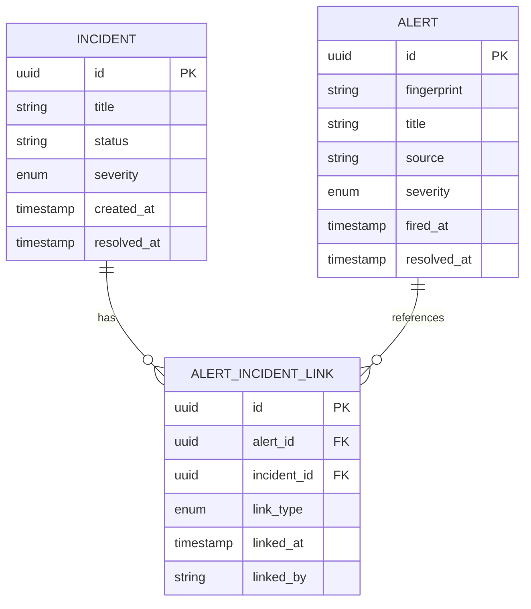
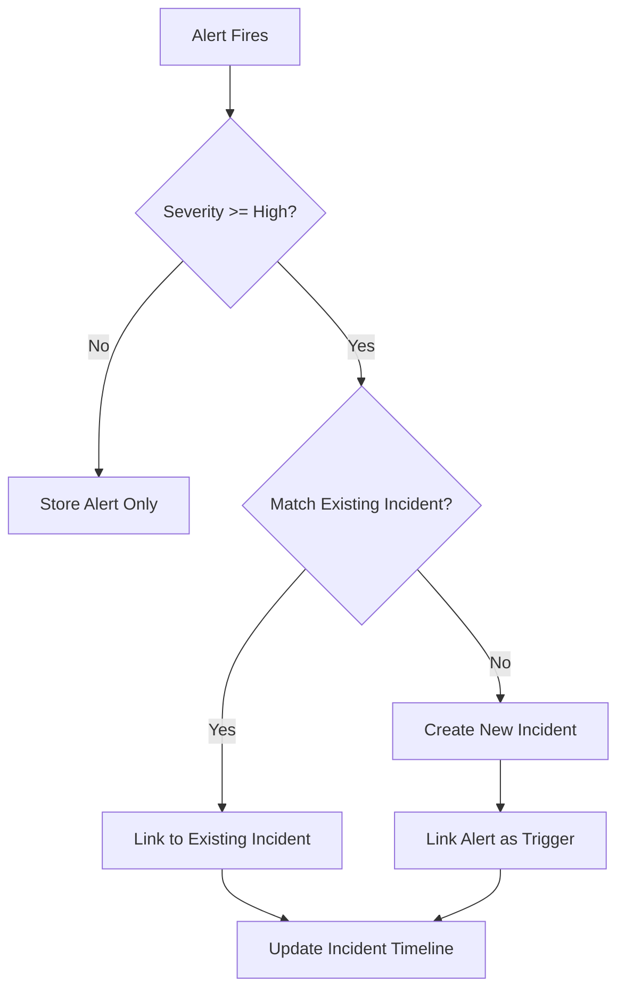
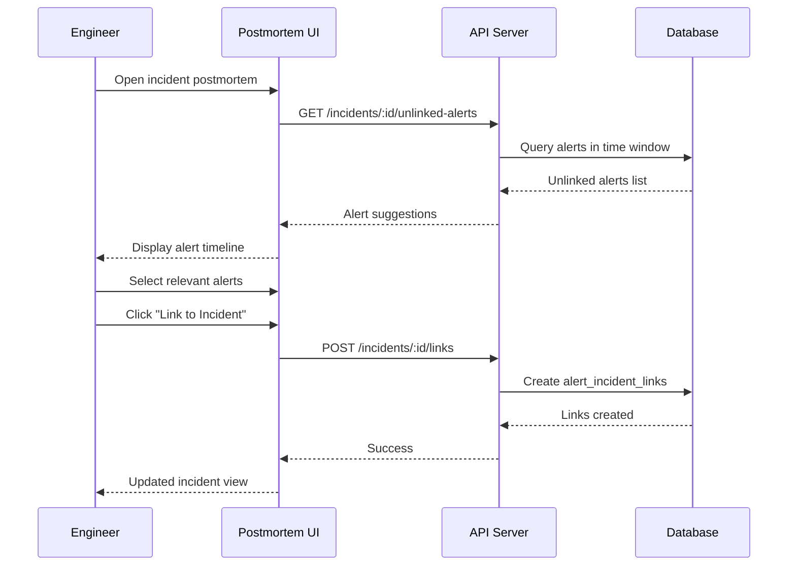
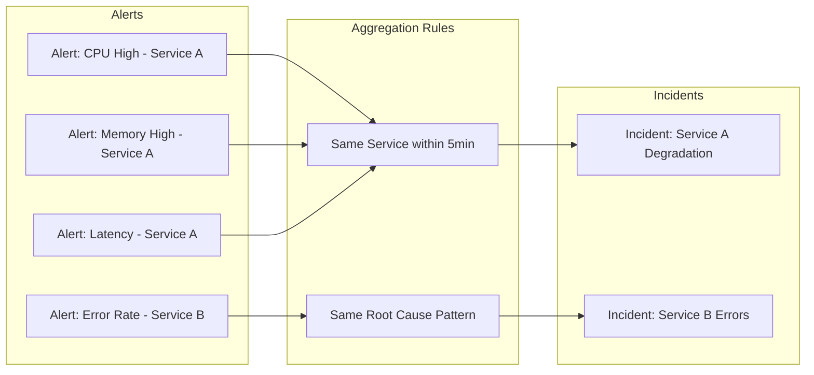

# How to Implement Alert Incident Links

Author: [nawazdhandala](https://github.com/nawazdhandala)

Tags: Alerting, Incident Management, SRE, Monitoring

Description: Learn how to link alerts to related incidents for tracking and correlation.

---

When an alert fires, the natural question is: "Is this part of an existing incident?" Linking alerts to incidents transforms isolated signals into actionable context. This guide covers practical patterns for implementing alert-incident relationships, from data modeling to automated correlation.

## Why Link Alerts to Incidents?

- **Reduce noise**: Group related alerts under a single incident instead of treating each as separate.
- **Faster triage**: Responders see the full picture immediately.
- **Better postmortems**: All contributing alerts are visible for root cause analysis.
- **Accurate metrics**: MTTR and incident counts reflect reality, not alert volume.

---

## Alert-Incident Relationship Modeling

The foundation is a well-designed data model that captures the relationship between alerts and incidents.



### Database Schema

```sql
-- Core tables
CREATE TABLE incidents (
    id UUID PRIMARY KEY DEFAULT gen_random_uuid(),
    title VARCHAR(500) NOT NULL,
    status VARCHAR(50) NOT NULL DEFAULT 'open',
    severity VARCHAR(20) NOT NULL,
    created_at TIMESTAMP WITH TIME ZONE DEFAULT NOW(),
    resolved_at TIMESTAMP WITH TIME ZONE,
    root_cause TEXT,
    summary TEXT
);

CREATE TABLE alerts (
    id UUID PRIMARY KEY DEFAULT gen_random_uuid(),
    fingerprint VARCHAR(255) NOT NULL,
    title VARCHAR(500) NOT NULL,
    source VARCHAR(100) NOT NULL,
    severity VARCHAR(20) NOT NULL,
    fired_at TIMESTAMP WITH TIME ZONE DEFAULT NOW(),
    resolved_at TIMESTAMP WITH TIME ZONE,
    labels JSONB DEFAULT '{}',
    annotations JSONB DEFAULT '{}'
);

-- Junction table for many-to-many relationship
CREATE TABLE alert_incident_links (
    id UUID PRIMARY KEY DEFAULT gen_random_uuid(),
    alert_id UUID NOT NULL REFERENCES alerts(id) ON DELETE CASCADE,
    incident_id UUID NOT NULL REFERENCES incidents(id) ON DELETE CASCADE,
    link_type VARCHAR(50) NOT NULL DEFAULT 'manual',
    linked_at TIMESTAMP WITH TIME ZONE DEFAULT NOW(),
    linked_by VARCHAR(255),
    UNIQUE(alert_id, incident_id)
);

-- Indexes for fast lookups
CREATE INDEX idx_links_alert_id ON alert_incident_links(alert_id);
CREATE INDEX idx_links_incident_id ON alert_incident_links(incident_id);
CREATE INDEX idx_alerts_fingerprint ON alerts(fingerprint);
CREATE INDEX idx_alerts_fired_at ON alerts(fired_at);
CREATE INDEX idx_incidents_status ON incidents(status);
```

### Link Types

```javascript
const LinkType = {
  AUTO_CREATED: 'auto_created',     // Alert triggered incident creation
  AUTO_CORRELATED: 'auto_correlated', // System detected similarity
  MANUAL: 'manual',                  // Human linked during triage
  HISTORICAL: 'historical',          // Linked during postmortem
};
```

---

## Incident Ticket Auto-Creation

When a critical alert fires and no matching incident exists, automatically create one.



### Implementation

```javascript
class IncidentManager {
  constructor(db, notificationService) {
    this.db = db;
    this.notificationService = notificationService;
  }

  async processAlert(alert) {
    // Store the alert first
    const storedAlert = await this.db.alerts.create({
      fingerprint: alert.fingerprint,
      title: alert.title,
      source: alert.source,
      severity: alert.severity,
      fired_at: alert.firedAt,
      labels: alert.labels,
      annotations: alert.annotations,
    });

    // Check if this should trigger incident creation
    if (!this.shouldCreateIncident(alert)) {
      return { alert: storedAlert, incident: null };
    }

    // Look for existing open incident to link to
    const existingIncident = await this.findMatchingIncident(alert);

    if (existingIncident) {
      await this.linkAlertToIncident(
        storedAlert.id,
        existingIncident.id,
        'auto_correlated'
      );
      return { alert: storedAlert, incident: existingIncident };
    }

    // Create new incident
    const incident = await this.createIncidentFromAlert(storedAlert);
    return { alert: storedAlert, incident };
  }

  shouldCreateIncident(alert) {
    const criticalSeverities = ['critical', 'high'];
    return criticalSeverities.includes(alert.severity.toLowerCase());
  }

  async createIncidentFromAlert(alert) {
    const incident = await this.db.incidents.create({
      title: `[Auto] ${alert.title}`,
      status: 'open',
      severity: alert.severity,
      summary: `Automatically created from alert: ${alert.fingerprint}`,
    });

    // Link the triggering alert
    await this.linkAlertToIncident(
      alert.id,
      incident.id,
      'auto_created'
    );

    // Notify on-call
    await this.notificationService.notifyIncident(incident);

    return incident;
  }

  async linkAlertToIncident(alertId, incidentId, linkType, linkedBy = 'system') {
    return this.db.alertIncidentLinks.create({
      alert_id: alertId,
      incident_id: incidentId,
      link_type: linkType,
      linked_by: linkedBy,
    });
  }
}
```

### Configuration

```yaml
# incident-rules.yaml
auto_create:
  enabled: true
  conditions:
    - severity_in: [critical, high]
    - source_not_in: [synthetic-monitors, load-tests]

  # Deduplication window - don't create new incident if similar exists
  dedup_window: 1h

  # Fields to match for deduplication
  match_fields:
    - fingerprint
    - service
    - environment

auto_link:
  enabled: true
  conditions:
    - severity_in: [critical, high, medium]

  # Time window to look for related incidents
  correlation_window: 4h
```

---

## Historical Incident Linking

During postmortems, engineers often discover alerts that contributed to an incident but were not linked at the time.

```javascript
class HistoricalLinkingService {
  constructor(db) {
    this.db = db;
  }

  // Find alerts that fired during an incident's timeline
  async findUnlinkedAlerts(incidentId) {
    const incident = await this.db.incidents.findById(incidentId);

    if (!incident) {
      throw new Error('Incident not found');
    }

    const timeWindow = {
      start: new Date(incident.created_at.getTime() - 30 * 60000), // 30 min before
      end: incident.resolved_at || new Date(),
    };

    // Find alerts in the time window not already linked
    const unlinkedAlerts = await this.db.query(`
      SELECT a.*
      FROM alerts a
      WHERE a.fired_at BETWEEN $1 AND $2
        AND NOT EXISTS (
          SELECT 1 FROM alert_incident_links l
          WHERE l.alert_id = a.id AND l.incident_id = $3
        )
      ORDER BY a.fired_at ASC
    `, [timeWindow.start, timeWindow.end, incidentId]);

    return unlinkedAlerts;
  }

  // Suggest alerts based on shared labels/services
  async suggestRelatedAlerts(incidentId) {
    const linkedAlerts = await this.db.query(`
      SELECT a.labels, a.source
      FROM alerts a
      JOIN alert_incident_links l ON l.alert_id = a.id
      WHERE l.incident_id = $1
    `, [incidentId]);

    // Extract common labels from linked alerts
    const services = [...new Set(
      linkedAlerts.map(a => a.labels?.service).filter(Boolean)
    )];

    // Find other alerts with same services
    const suggestions = await this.db.query(`
      SELECT a.*
      FROM alerts a
      WHERE a.labels->>'service' = ANY($1)
        AND NOT EXISTS (
          SELECT 1 FROM alert_incident_links l
          WHERE l.alert_id = a.id AND l.incident_id = $2
        )
      ORDER BY a.fired_at DESC
      LIMIT 50
    `, [services, incidentId]);

    return suggestions;
  }

  // Bulk link alerts during postmortem
  async bulkLinkAlerts(incidentId, alertIds, linkedBy) {
    const links = alertIds.map(alertId => ({
      alert_id: alertId,
      incident_id: incidentId,
      link_type: 'historical',
      linked_by: linkedBy,
    }));

    await this.db.alertIncidentLinks.bulkCreate(links);

    // Update incident with linking activity
    await this.db.incidents.update(incidentId, {
      last_activity: new Date(),
      activity_log: this.db.raw(
        `activity_log || $1::jsonb`,
        JSON.stringify({
          type: 'alerts_linked',
          count: alertIds.length,
          by: linkedBy,
          at: new Date().toISOString(),
        })
      ),
    });
  }
}
```

### Postmortem Alert Review UI Flow



---

## Similar Incident Detection

Detect when a new alert matches the pattern of a historical incident.

```javascript
class SimilarIncidentDetector {
  constructor(db, vectorStore) {
    this.db = db;
    this.vectorStore = vectorStore; // For semantic similarity
  }

  // Find similar historical incidents
  async findSimilarIncidents(alert, options = {}) {
    const { limit = 5, minScore = 0.7 } = options;

    // Strategy 1: Exact fingerprint match
    const fingerprintMatches = await this.findByFingerprint(alert.fingerprint);

    // Strategy 2: Label-based similarity
    const labelMatches = await this.findByLabels(alert.labels);

    // Strategy 3: Semantic similarity using embeddings
    const semanticMatches = await this.findBySemantic(alert.title);

    // Combine and deduplicate results
    const combined = this.combineResults([
      { results: fingerprintMatches, weight: 1.0 },
      { results: labelMatches, weight: 0.8 },
      { results: semanticMatches, weight: 0.6 },
    ]);

    return combined
      .filter(r => r.score >= minScore)
      .slice(0, limit);
  }

  async findByFingerprint(fingerprint) {
    const incidents = await this.db.query(`
      SELECT DISTINCT i.*, COUNT(a.id) as alert_count
      FROM incidents i
      JOIN alert_incident_links l ON l.incident_id = i.id
      JOIN alerts a ON a.id = l.alert_id
      WHERE a.fingerprint = $1
      GROUP BY i.id
      ORDER BY i.created_at DESC
      LIMIT 10
    `, [fingerprint]);

    return incidents.map(i => ({
      incident: i,
      score: 1.0,
      matchType: 'fingerprint',
    }));
  }

  async findByLabels(labels) {
    if (!labels || Object.keys(labels).length === 0) {
      return [];
    }

    // Match on service + environment
    const incidents = await this.db.query(`
      SELECT DISTINCT i.*,
        COUNT(DISTINCT a.id) as alert_count,
        COUNT(DISTINCT CASE
          WHEN a.labels->>'service' = $1 THEN a.id
        END) as service_matches
      FROM incidents i
      JOIN alert_incident_links l ON l.incident_id = i.id
      JOIN alerts a ON a.id = l.alert_id
      WHERE a.labels->>'service' = $1
        OR a.labels->>'environment' = $2
      GROUP BY i.id
      HAVING COUNT(DISTINCT CASE
        WHEN a.labels->>'service' = $1 THEN a.id
      END) > 0
      ORDER BY i.created_at DESC
      LIMIT 10
    `, [labels.service, labels.environment]);

    return incidents.map(i => ({
      incident: i,
      score: 0.8 * (i.service_matches / i.alert_count),
      matchType: 'labels',
    }));
  }

  async findBySemantic(title) {
    // Generate embedding for alert title
    const embedding = await this.vectorStore.embed(title);

    // Find similar incident titles
    const similar = await this.vectorStore.search({
      vector: embedding,
      collection: 'incidents',
      limit: 10,
    });

    return similar.map(s => ({
      incident: s.metadata,
      score: s.similarity,
      matchType: 'semantic',
    }));
  }

  combineResults(resultSets) {
    const scoreMap = new Map();

    for (const { results, weight } of resultSets) {
      for (const result of results) {
        const id = result.incident.id;
        const existing = scoreMap.get(id);

        if (existing) {
          existing.score = Math.max(existing.score, result.score * weight);
          existing.matchTypes.push(result.matchType);
        } else {
          scoreMap.set(id, {
            ...result,
            score: result.score * weight,
            matchTypes: [result.matchType],
          });
        }
      }
    }

    return Array.from(scoreMap.values())
      .sort((a, b) => b.score - a.score);
  }
}
```

### Using Detection in Alert Processing

```javascript
async function processAlertWithSimilarity(alert, detector, incidentManager) {
  // Check for similar historical incidents
  const similar = await detector.findSimilarIncidents(alert);

  if (similar.length > 0) {
    const topMatch = similar[0];

    // If high confidence match and incident is resolved, show context
    if (topMatch.score > 0.9 && topMatch.incident.resolved_at) {
      await incidentManager.addContext(alert, {
        type: 'similar_incident',
        incident_id: topMatch.incident.id,
        title: topMatch.incident.title,
        root_cause: topMatch.incident.root_cause,
        resolution: topMatch.incident.summary,
        confidence: topMatch.score,
      });
    }

    // If there's a very similar open incident, link to it
    const openMatch = similar.find(
      s => s.score > 0.85 && !s.incident.resolved_at
    );

    if (openMatch) {
      await incidentManager.linkAlertToIncident(
        alert.id,
        openMatch.incident.id,
        'auto_correlated'
      );
    }
  }

  return similar;
}
```

---

## Incident Aggregation from Alerts

Group alerts into incidents based on rules and patterns.



### Aggregation Engine

```javascript
class AlertAggregator {
  constructor(db, rules) {
    this.db = db;
    this.rules = rules;
    this.pendingAlerts = new Map(); // Buffer for time-based grouping
  }

  async aggregate(alert) {
    // Find matching aggregation rule
    const rule = this.findMatchingRule(alert);

    if (!rule) {
      return null; // No aggregation
    }

    // Generate group key based on rule
    const groupKey = this.generateGroupKey(alert, rule);

    // Check for existing open incident in this group
    const existingIncident = await this.findOpenIncidentForGroup(groupKey);

    if (existingIncident) {
      return existingIncident;
    }

    // Check pending alerts buffer
    if (this.pendingAlerts.has(groupKey)) {
      const pending = this.pendingAlerts.get(groupKey);
      pending.alerts.push(alert);

      // If we've hit the threshold, create incident
      if (pending.alerts.length >= rule.minAlerts) {
        return this.createAggregatedIncident(pending, rule);
      }

      return null;
    }

    // Start new pending group
    this.pendingAlerts.set(groupKey, {
      alerts: [alert],
      rule,
      groupKey,
      startedAt: Date.now(),
    });

    // Set timeout to create incident if threshold not met
    setTimeout(() => {
      this.flushPendingGroup(groupKey);
    }, rule.timeWindow);

    return null;
  }

  findMatchingRule(alert) {
    return this.rules.find(rule => {
      return rule.conditions.every(condition => {
        switch (condition.type) {
          case 'severity_in':
            return condition.values.includes(alert.severity);
          case 'source_in':
            return condition.values.includes(alert.source);
          case 'label_equals':
            return alert.labels?.[condition.key] === condition.value;
          case 'label_exists':
            return condition.key in (alert.labels || {});
          default:
            return false;
        }
      });
    });
  }

  generateGroupKey(alert, rule) {
    const parts = rule.groupBy.map(field => {
      if (field.startsWith('label:')) {
        const labelKey = field.slice(6);
        return alert.labels?.[labelKey] || 'unknown';
      }
      return alert[field] || 'unknown';
    });

    return parts.join(':');
  }

  async findOpenIncidentForGroup(groupKey) {
    const incident = await this.db.query(`
      SELECT i.*
      FROM incidents i
      WHERE i.status = 'open'
        AND i.aggregation_key = $1
      LIMIT 1
    `, [groupKey]);

    return incident[0] || null;
  }

  async createAggregatedIncident(pending, rule) {
    const { alerts, groupKey } = pending;

    // Generate incident title from alerts
    const title = this.generateIncidentTitle(alerts, rule);

    const incident = await this.db.incidents.create({
      title,
      status: 'open',
      severity: this.highestSeverity(alerts),
      aggregation_key: groupKey,
      summary: `Aggregated from ${alerts.length} alerts`,
    });

    // Link all alerts
    for (const alert of alerts) {
      await this.db.alertIncidentLinks.create({
        alert_id: alert.id,
        incident_id: incident.id,
        link_type: 'auto_created',
      });
    }

    this.pendingAlerts.delete(groupKey);

    return incident;
  }

  generateIncidentTitle(alerts, rule) {
    // Use first alert as base
    const firstAlert = alerts[0];
    const service = firstAlert.labels?.service || 'Unknown Service';

    return `[Aggregated] ${service}: ${alerts.length} related alerts`;
  }

  highestSeverity(alerts) {
    const order = ['critical', 'high', 'medium', 'low', 'info'];
    return alerts
      .map(a => a.severity)
      .sort((a, b) => order.indexOf(a) - order.indexOf(b))[0];
  }

  async flushPendingGroup(groupKey) {
    const pending = this.pendingAlerts.get(groupKey);
    if (!pending) return;

    // Create incident even if below threshold after timeout
    if (pending.alerts.length > 0) {
      await this.createAggregatedIncident(pending, pending.rule);
    }
  }
}
```

### Aggregation Rules Configuration

```yaml
# aggregation-rules.yaml
rules:
  - name: service-alerts
    description: Group alerts by service within time window
    conditions:
      - type: severity_in
        values: [critical, high, medium]
    groupBy:
      - label:service
      - label:environment
    timeWindow: 300000  # 5 minutes
    minAlerts: 2

  - name: infrastructure-alerts
    description: Group infrastructure alerts by node
    conditions:
      - type: source_in
        values: [prometheus, node-exporter]
      - type: label_exists
        key: node
    groupBy:
      - label:node
      - label:datacenter
    timeWindow: 180000  # 3 minutes
    minAlerts: 3

  - name: deployment-alerts
    description: Group alerts during deployments
    conditions:
      - type: label_exists
        key: deployment_id
    groupBy:
      - label:deployment_id
    timeWindow: 600000  # 10 minutes
    minAlerts: 1
```

---

## Post-Incident Alert Review Links

Create permanent links between resolved incidents and their alerts for future reference.

```javascript
class PostIncidentReview {
  constructor(db, searchService) {
    this.db = db;
    this.searchService = searchService;
  }

  // Generate incident report with all linked alerts
  async generateReport(incidentId) {
    const incident = await this.db.incidents.findById(incidentId);

    const linkedAlerts = await this.db.query(`
      SELECT
        a.*,
        l.link_type,
        l.linked_at,
        l.linked_by
      FROM alerts a
      JOIN alert_incident_links l ON l.alert_id = a.id
      WHERE l.incident_id = $1
      ORDER BY a.fired_at ASC
    `, [incidentId]);

    // Group alerts by phase
    const timeline = this.buildTimeline(incident, linkedAlerts);

    // Calculate metrics
    const metrics = this.calculateMetrics(incident, linkedAlerts);

    return {
      incident,
      alerts: linkedAlerts,
      timeline,
      metrics,
      generated_at: new Date().toISOString(),
    };
  }

  buildTimeline(incident, alerts) {
    const events = [];

    // Add incident events
    events.push({
      timestamp: incident.created_at,
      type: 'incident_created',
      title: 'Incident opened',
    });

    if (incident.resolved_at) {
      events.push({
        timestamp: incident.resolved_at,
        type: 'incident_resolved',
        title: 'Incident resolved',
      });
    }

    // Add alert events
    for (const alert of alerts) {
      events.push({
        timestamp: alert.fired_at,
        type: 'alert_fired',
        title: alert.title,
        alert_id: alert.id,
        severity: alert.severity,
        link_type: alert.link_type,
      });

      if (alert.resolved_at) {
        events.push({
          timestamp: alert.resolved_at,
          type: 'alert_resolved',
          title: `${alert.title} resolved`,
          alert_id: alert.id,
        });
      }
    }

    // Sort by timestamp
    return events.sort((a, b) =>
      new Date(a.timestamp) - new Date(b.timestamp)
    );
  }

  calculateMetrics(incident, alerts) {
    const firstAlert = alerts.reduce((min, a) =>
      a.fired_at < min.fired_at ? a : min
    , alerts[0]);

    const detectionTime = firstAlert
      ? new Date(incident.created_at) - new Date(firstAlert.fired_at)
      : 0;

    const resolutionTime = incident.resolved_at
      ? new Date(incident.resolved_at) - new Date(incident.created_at)
      : null;

    const severityCounts = alerts.reduce((acc, a) => {
      acc[a.severity] = (acc[a.severity] || 0) + 1;
      return acc;
    }, {});

    const linkTypeCounts = alerts.reduce((acc, a) => {
      acc[a.link_type] = (acc[a.link_type] || 0) + 1;
      return acc;
    }, {});

    return {
      total_alerts: alerts.length,
      time_to_detect_ms: detectionTime,
      time_to_resolve_ms: resolutionTime,
      severity_breakdown: severityCounts,
      link_type_breakdown: linkTypeCounts,
      unique_services: [...new Set(
        alerts.map(a => a.labels?.service).filter(Boolean)
      )],
    };
  }

  // Create shareable review URL
  async createReviewLink(incidentId, options = {}) {
    const { expiresIn = '30d', accessLevel = 'team' } = options;

    const token = crypto.randomUUID();
    const expiresAt = this.calculateExpiry(expiresIn);

    await this.db.reviewLinks.create({
      incident_id: incidentId,
      token,
      access_level: accessLevel,
      expires_at: expiresAt,
    });

    return {
      url: `https://incidents.example.com/review/${token}`,
      expires_at: expiresAt,
    };
  }

  calculateExpiry(duration) {
    const match = duration.match(/^(\d+)(d|h|m)$/);
    if (!match) throw new Error('Invalid duration format');

    const [, value, unit] = match;
    const ms = {
      d: 86400000,
      h: 3600000,
      m: 60000,
    }[unit];

    return new Date(Date.now() + parseInt(value) * ms);
  }
}
```

### Report Output Example

```json
{
  "incident": {
    "id": "inc-123",
    "title": "Database Connection Pool Exhaustion",
    "status": "resolved",
    "severity": "critical",
    "created_at": "2026-01-30T10:15:00Z",
    "resolved_at": "2026-01-30T11:45:00Z"
  },
  "alerts": [
    {
      "id": "alert-001",
      "title": "High DB Connection Count",
      "severity": "warning",
      "fired_at": "2026-01-30T10:00:00Z",
      "link_type": "auto_created"
    },
    {
      "id": "alert-002",
      "title": "API Latency > 2s",
      "severity": "critical",
      "fired_at": "2026-01-30T10:14:00Z",
      "link_type": "auto_correlated"
    },
    {
      "id": "alert-003",
      "title": "Error Rate Spike",
      "severity": "critical",
      "fired_at": "2026-01-30T10:14:30Z",
      "link_type": "auto_correlated"
    }
  ],
  "metrics": {
    "total_alerts": 3,
    "time_to_detect_ms": 900000,
    "time_to_resolve_ms": 5400000,
    "severity_breakdown": {
      "warning": 1,
      "critical": 2
    }
  }
}
```

---

## API Endpoints

```javascript
const express = require('express');
const router = express.Router();

// Link alert to incident
router.post('/incidents/:incidentId/links', async (req, res) => {
  const { incidentId } = req.params;
  const { alertIds, linkType = 'manual' } = req.body;

  const links = await Promise.all(
    alertIds.map(alertId =>
      incidentManager.linkAlertToIncident(
        alertId,
        incidentId,
        linkType,
        req.user.id
      )
    )
  );

  res.json({ links });
});

// Get alerts linked to incident
router.get('/incidents/:incidentId/alerts', async (req, res) => {
  const { incidentId } = req.params;

  const alerts = await db.query(`
    SELECT a.*, l.link_type, l.linked_at
    FROM alerts a
    JOIN alert_incident_links l ON l.alert_id = a.id
    WHERE l.incident_id = $1
    ORDER BY a.fired_at DESC
  `, [incidentId]);

  res.json({ alerts });
});

// Get incidents linked to alert
router.get('/alerts/:alertId/incidents', async (req, res) => {
  const { alertId } = req.params;

  const incidents = await db.query(`
    SELECT i.*, l.link_type, l.linked_at
    FROM incidents i
    JOIN alert_incident_links l ON l.incident_id = i.id
    WHERE l.alert_id = $1
    ORDER BY i.created_at DESC
  `, [alertId]);

  res.json({ incidents });
});

// Find unlinked alerts for incident
router.get('/incidents/:incidentId/unlinked-alerts', async (req, res) => {
  const { incidentId } = req.params;

  const alerts = await historicalLinking.findUnlinkedAlerts(incidentId);

  res.json({ alerts });
});

// Find similar incidents for alert
router.get('/alerts/:alertId/similar-incidents', async (req, res) => {
  const { alertId } = req.params;

  const alert = await db.alerts.findById(alertId);
  const similar = await similarDetector.findSimilarIncidents(alert);

  res.json({ similar });
});

// Generate incident review report
router.get('/incidents/:incidentId/report', async (req, res) => {
  const { incidentId } = req.params;

  const report = await postIncidentReview.generateReport(incidentId);

  res.json(report);
});

module.exports = router;
```

---

## Summary

| Feature | Purpose | Key Benefit |
|---------|---------|-------------|
| **Relationship Modeling** | Define alert-incident links | Query and trace relationships |
| **Auto-Creation** | Create incidents from critical alerts | Faster response initiation |
| **Historical Linking** | Connect alerts during postmortem | Complete incident picture |
| **Similar Detection** | Find matching past incidents | Faster resolution with context |
| **Aggregation** | Group related alerts | Reduce incident noise |
| **Review Links** | Share incident+alert reports | Effective postmortems |

Linking alerts to incidents transforms your monitoring from a stream of individual signals into a connected system where context flows naturally. Start with the data model, add auto-creation for critical alerts, and build toward similarity detection as your incident history grows.
