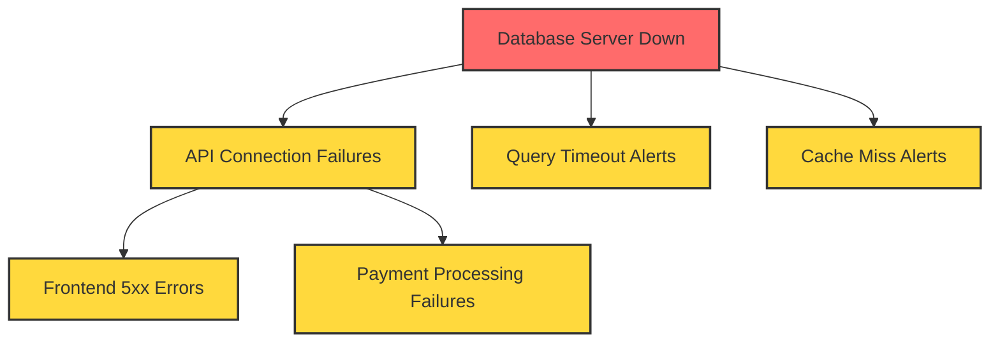
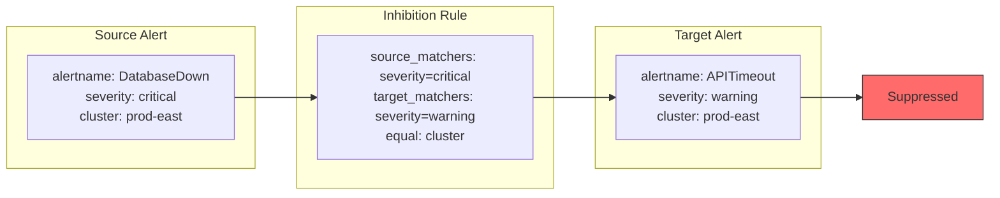
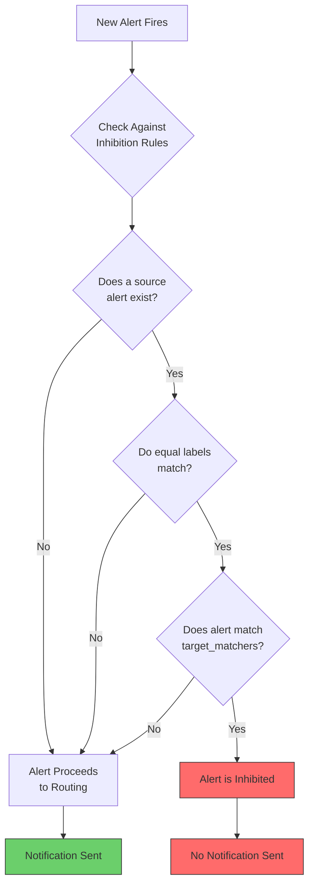
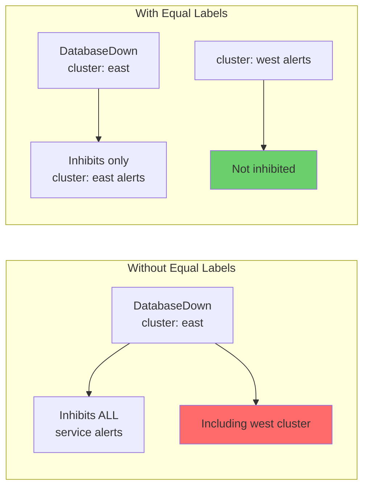

# How to Build Alert Inhibition Rules

Author: [nawazdhandala](https://github.com/nawazdhandala)

Tags: Observability, Alerting, Alertmanager, SRE

Description: Learn how to implement alert inhibition to suppress downstream alerts when root cause alerts fire.

---

## Introduction

When infrastructure fails, it rarely fails in isolation. A single root cause can trigger a cascade of downstream alerts, flooding your on-call engineers with notifications and making it harder to identify the actual problem. Alert inhibition solves this by automatically suppressing dependent alerts when their root cause alert is already firing.

In this post, we will explore how to build effective alert inhibition rules using Prometheus Alertmanager, covering the core concepts of source matchers, target matchers, and equal labels.

## Understanding Alert Dependencies

Before diving into configuration, let us visualize a common alert dependency scenario:



In this scenario, when the database server goes down (the root cause), you do not want to receive separate alerts for every downstream failure. You want the database alert to inhibit all the dependent alerts.

## Core Concepts of Alert Inhibition

Alert inhibition in Alertmanager works through three key components:

1. **Source Matchers**: Define which alerts can inhibit other alerts (the root cause)
2. **Target Matchers**: Define which alerts can be inhibited (the symptoms)
3. **Equal Labels**: Labels that must match between source and target for inhibition to apply



## Basic Inhibition Rule Configuration

Here is a fundamental inhibition rule that suppresses warning alerts when critical alerts fire for the same service:

```yaml
# alertmanager.yml
# Basic inhibition rule configuration

inhibit_rules:
  # Rule 1: Critical alerts inhibit warning alerts for the same alertname
  - source_matchers:
      # Match alerts with critical severity as the source (inhibitor)
      - severity = critical
    target_matchers:
      # Match alerts with warning severity as the target (to be inhibited)
      - severity = warning
    equal:
      # Only inhibit if both alerts share the same alertname
      # This ensures we only suppress related alerts
      - alertname
```

## Advanced Inhibition Patterns

### Pattern 1: Infrastructure Layer Inhibition

This pattern suppresses application-level alerts when infrastructure alerts are firing:

```yaml
# alertmanager.yml
# Infrastructure layer inhibition

inhibit_rules:
  # When a node is down, suppress all pod alerts on that node
  - source_matchers:
      # Source: Node-level alerts indicating node failure
      - alertname = NodeDown
    target_matchers:
      # Target: Any pod-level alert
      - alert_type = pod
    equal:
      # Match on the node label to ensure we only suppress
      # alerts for pods running on the affected node
      - node

  # When a cluster is unreachable, suppress all node alerts in that cluster
  - source_matchers:
      - alertname = ClusterUnreachable
    target_matchers:
      - alert_type = node
    equal:
      # Match on cluster to scope the inhibition
      - cluster
```

### Pattern 2: Service Dependency Inhibition

Use this pattern when you have well-defined service dependencies:

```yaml
# alertmanager.yml
# Service dependency inhibition rules

inhibit_rules:
  # Database down inhibits all database-dependent service alerts
  - source_matchers:
      # Match the root cause: database is unavailable
      - alertname = DatabaseDown
      - severity = critical
    target_matchers:
      # Match any alert that depends on the database
      - depends_on = database
    equal:
      # Scope to the same environment (prod, staging, dev)
      - environment
      # Scope to the same database cluster
      - db_cluster

  # Message queue down inhibits consumer alerts
  - source_matchers:
      - alertname = KafkaClusterDown
    target_matchers:
      - depends_on = kafka
    equal:
      - environment
      - kafka_cluster
```

### Pattern 3: Severity-Based Cascading Inhibition

This pattern creates a hierarchy where higher severity alerts suppress lower ones:

```yaml
# alertmanager.yml
# Severity cascade inhibition

inhibit_rules:
  # Critical inhibits warning
  - source_matchers:
      - severity = critical
    target_matchers:
      - severity = warning
    equal:
      - alertname
      - instance

  # Critical inhibits info
  - source_matchers:
      - severity = critical
    target_matchers:
      - severity = info
    equal:
      - alertname
      - instance

  # Warning inhibits info
  - source_matchers:
      - severity = warning
    target_matchers:
      - severity = info
    equal:
      - alertname
      - instance
```

## Complete Working Example

Here is a complete Alertmanager configuration demonstrating multiple inhibition strategies:

```yaml
# alertmanager.yml
# Complete Alertmanager configuration with inhibition rules

global:
  # Global configuration for notification timeouts
  resolve_timeout: 5m

# Route configuration for alert routing
route:
  receiver: default-receiver
  group_by:
    - alertname
    - cluster
    - service
  group_wait: 30s
  group_interval: 5m
  repeat_interval: 4h

  routes:
    # Critical alerts go to PagerDuty immediately
    - receiver: pagerduty-critical
      matchers:
        - severity = critical
      continue: false

    # Warning alerts go to Slack
    - receiver: slack-warnings
      matchers:
        - severity = warning
      continue: false

# Receiver definitions
receivers:
  - name: default-receiver
    webhook_configs:
      - url: 'http://alerthandler:9093/webhook'

  - name: pagerduty-critical
    pagerduty_configs:
      - service_key: '<your-pagerduty-key>'

  - name: slack-warnings
    slack_configs:
      - api_url: '<your-slack-webhook>'
        channel: '#alerts'

# Inhibition rules section
inhibit_rules:
  # Rule 1: Cluster-level failures inhibit node-level alerts
  # When an entire cluster is down, we do not need alerts for individual nodes
  - source_matchers:
      - alertname = ClusterDown
      - severity = critical
    target_matchers:
      - level = node
    equal:
      - cluster
      - environment

  # Rule 2: Node failures inhibit container alerts
  # When a node fails, container alerts on that node are redundant
  - source_matchers:
      - alertname = NodeNotReady
      - severity = critical
    target_matchers:
      - level = container
    equal:
      - node
      - cluster

  # Rule 3: Network partition inhibits service connectivity alerts
  # Network issues cause many downstream connectivity failures
  - source_matchers:
      - alertname = NetworkPartition
    target_matchers:
      - category = connectivity
    equal:
      - network_zone
      - datacenter

  # Rule 4: Database primary failure inhibits replica alerts
  # When primary is down, replica lag alerts are expected
  - source_matchers:
      - alertname = DatabasePrimaryDown
    target_matchers:
      - alertname =~ "DatabaseReplica.*"
    equal:
      - db_cluster
      - environment

  # Rule 5: Maintenance mode inhibits all non-critical alerts
  # During planned maintenance, suppress expected alerts
  - source_matchers:
      - alertname = MaintenanceMode
    target_matchers:
      - severity =~ "warning|info"
    equal:
      - service
      - environment
```

## Visualizing the Inhibition Flow

Here is how the inhibition logic flows when an alert fires:



## Best Practices for Alert Inhibition

### 1. Use Specific Equal Labels

Always include enough labels in the `equal` field to prevent over-inhibition:

```yaml
# Good: Specific scoping prevents unrelated alerts from being inhibited
inhibit_rules:
  - source_matchers:
      - alertname = ServiceDown
    target_matchers:
      - depends_on = service
    equal:
      - service_name    # The specific service
      - environment     # prod, staging, dev
      - region          # Geographic region

# Bad: Too broad, may inhibit unrelated alerts
inhibit_rules:
  - source_matchers:
      - severity = critical
    target_matchers:
      - severity = warning
    # No equal labels means ALL warnings are inhibited
    # when ANY critical alert fires
```

### 2. Document Your Dependency Graph

Maintain a clear record of your alert dependencies:

```yaml
# alertmanager.yml
# Document the dependency hierarchy in comments

inhibit_rules:
  # Dependency: payment-service -> database-primary
  # When database-primary is down, payment-service cannot process transactions
  # Expected downstream alerts: PaymentTimeout, TransactionFailed
  - source_matchers:
      - alertname = DatabasePrimaryDown
      - service = database-primary
    target_matchers:
      - service = payment-service
    equal:
      - environment
      - region
```

### 3. Test Inhibition Rules

Use Alertmanager's API to verify your inhibition rules work as expected:

```bash
#!/bin/bash
# test-inhibition.sh
# Script to test inhibition rules by firing test alerts

# Fire the source alert (root cause)
curl -X POST http://localhost:9093/api/v2/alerts \
  -H "Content-Type: application/json" \
  -d '[{
    "labels": {
      "alertname": "DatabaseDown",
      "severity": "critical",
      "environment": "test",
      "cluster": "db-cluster-1"
    },
    "annotations": {
      "summary": "Test database down alert"
    }
  }]'

# Wait for the alert to be processed
sleep 5

# Fire the target alert (should be inhibited)
curl -X POST http://localhost:9093/api/v2/alerts \
  -H "Content-Type: application/json" \
  -d '[{
    "labels": {
      "alertname": "APITimeout",
      "severity": "warning",
      "environment": "test",
      "cluster": "db-cluster-1",
      "depends_on": "database"
    },
    "annotations": {
      "summary": "Test API timeout alert"
    }
  }]'

# Check inhibited alerts
echo "Checking inhibited alerts..."
curl -s http://localhost:9093/api/v2/alerts | jq '.[] | select(.status.state == "suppressed")'
```

### 4. Monitor Inhibition Effectiveness

Track how often inhibition rules are triggered to validate their usefulness:

```yaml
# Prometheus recording rule to track inhibition metrics

groups:
  - name: inhibition_tracking
    rules:
      # Count of currently inhibited alerts
      - record: alertmanager_inhibited_alerts_total
        expr: |
          count(ALERTS{alertstate="pending"}) by (alertname)
```

## Common Pitfalls to Avoid

### Pitfall 1: Circular Inhibition

Avoid creating rules where alerts can inhibit each other:

```yaml
# Bad: Creates circular dependency
inhibit_rules:
  - source_matchers:
      - alertname = AlertA
    target_matchers:
      - alertname = AlertB
    equal:
      - instance

  - source_matchers:
      - alertname = AlertB
    target_matchers:
      - alertname = AlertA
    equal:
      - instance
```

### Pitfall 2: Over-Inhibition

Be careful not to suppress alerts that should still be visible:

```yaml
# Bad: This inhibits ALL alerts when ANY critical alert fires
inhibit_rules:
  - source_matchers:
      - severity = critical
    target_matchers:
      - severity =~ ".*"  # Matches everything
    # No equal labels

# Good: Properly scoped inhibition
inhibit_rules:
  - source_matchers:
      - severity = critical
    target_matchers:
      - severity = warning
    equal:
      - alertname
      - service
      - environment
```

### Pitfall 3: Missing Equal Labels

Without proper equal labels, inhibition may not work as expected:



## Conclusion

Alert inhibition is a powerful technique for reducing alert noise and helping on-call engineers focus on root causes rather than symptoms. By carefully designing your inhibition rules with proper source matchers, target matchers, and equal labels, you can create a more manageable alerting system.

Key takeaways:

- Always scope inhibition rules with equal labels to prevent over-inhibition
- Document your alert dependency graph alongside your inhibition rules
- Test inhibition rules before deploying to production
- Monitor the effectiveness of your rules over time
- Start with conservative rules and expand based on observed patterns

With well-designed inhibition rules, your team can respond faster to incidents by cutting through the noise and focusing on what truly matters.

## Further Reading

- [Prometheus Alertmanager Documentation](https://prometheus.io/docs/alerting/latest/alertmanager/)
- [Alertmanager Configuration Reference](https://prometheus.io/docs/alerting/latest/configuration/)
- [SRE Book: Practical Alerting](https://sre.google/sre-book/practical-alerting/)
