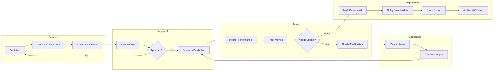
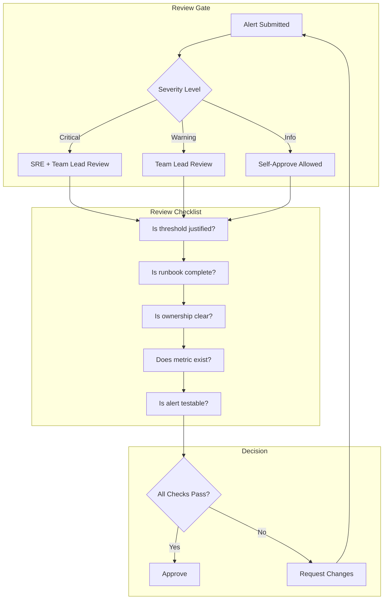
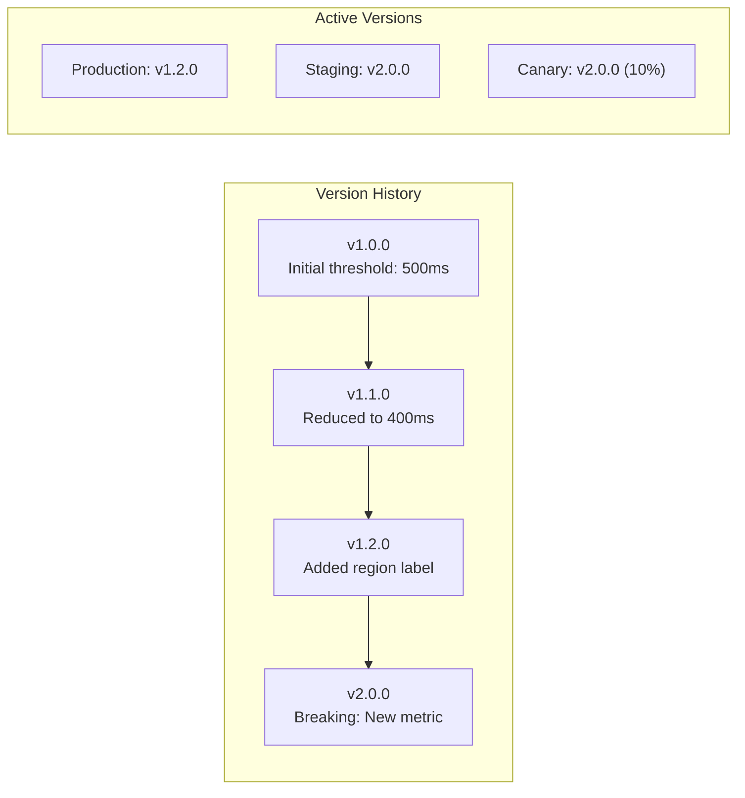
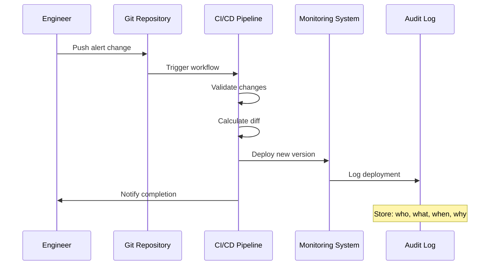
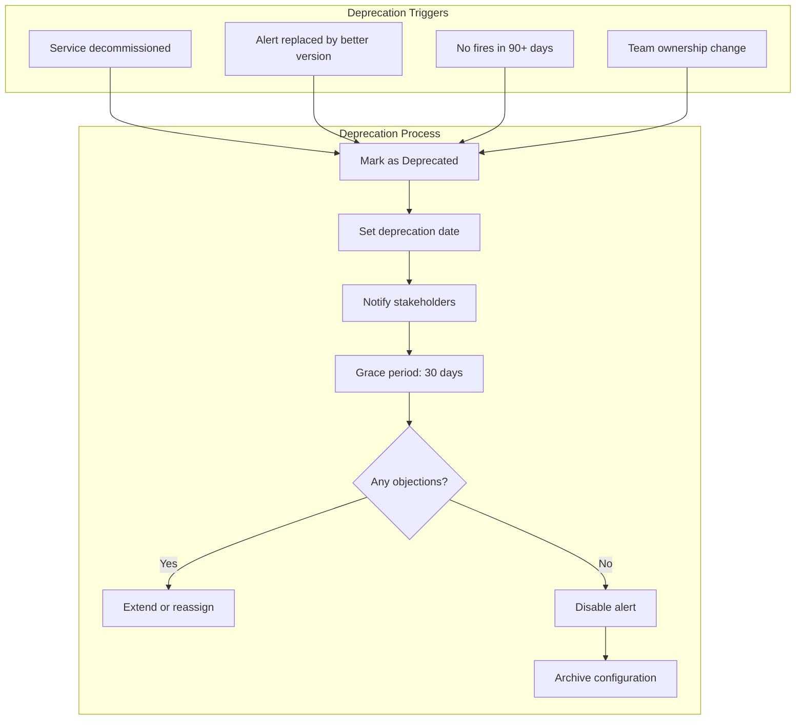
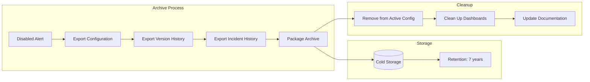
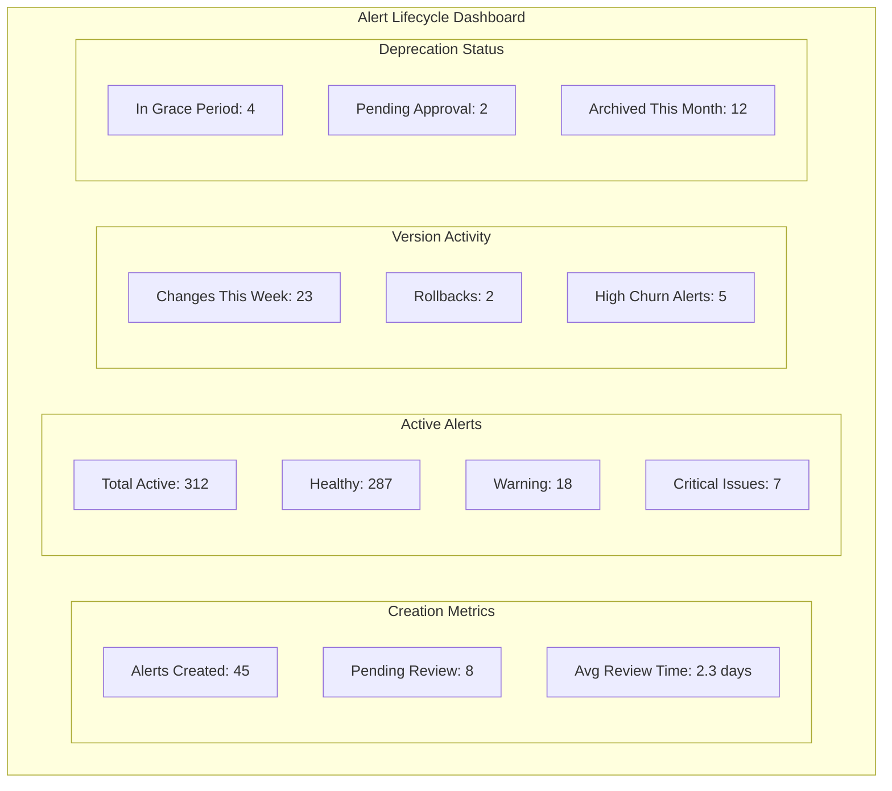

# How to Build Alert Lifecycle Management

Author: [nawazdhandala](https://github.com/nawazdhandala)

Tags: Alerting, SRE, Management, DevOps

Description: Learn how to manage alerts through their complete lifecycle from creation to retirement.

---

## Why Alert Lifecycle Management Matters

Alerts are not static artifacts. They evolve with your systems, teams, and business requirements. An alert created during a product launch may become irrelevant six months later. A threshold that made sense at 100 users may generate noise at 100,000 users. Without deliberate lifecycle management, alert configurations drift into chaos: stale rules fire for services that no longer exist, undocumented thresholds confuse new team members, and nobody knows who owns what.

Alert lifecycle management treats alerts as first-class engineering artifacts with clear ownership, version history, approval workflows, and retirement processes. This guide walks through each phase of the alert lifecycle with practical implementation patterns you can adopt today.

---

## The Alert Lifecycle Overview



Each phase has specific responsibilities, tooling requirements, and success criteria. Let us examine them in detail.

---

## Phase 1: Alert Creation Workflow

The creation phase establishes the foundation for a well-managed alert. Every alert should answer these questions before deployment:

- **What** condition triggers this alert?
- **Why** does this condition matter?
- **Who** is responsible for responding?
- **How** should responders investigate and resolve it?

### Alert Configuration Schema

Define a structured schema for all alerts in your system. This ensures consistency and enables automation.

```yaml
# alert-definition.yaml
apiVersion: alerts.oneuptime.com/v1
kind: AlertDefinition
metadata:
  name: api-latency-p99-high
  namespace: production
  labels:
    service: api-gateway
    team: platform
    severity: critical
    tier: tier-1
spec:
  version: "1.0.0"
  description: |
    API gateway p99 latency exceeds SLO threshold.
    This impacts customer-facing requests and may indicate
    downstream service degradation or resource exhaustion.

  condition:
    metric: http_request_duration_seconds
    aggregation: quantile
    quantile: 0.99
    operator: ">"
    threshold: 0.5
    duration: 5m
    labels:
      service: api-gateway

  routing:
    escalation_policy: platform-oncall
    notification_channels:
      - slack-platform-alerts
      - pagerduty-platform

  runbook:
    url: https://runbooks.internal/api-latency-high
    checklist:
      - Check recent deployments
      - Review downstream service health
      - Examine database query performance
      - Check for traffic spikes

  ownership:
    team: platform
    primary_contact: platform-oncall@company.com
    created_by: jane.engineer
    created_at: "2026-01-30T10:00:00Z"

  lifecycle:
    status: draft
    review_required: true
    auto_deprecate_days: 180
```

### Validation Before Submission

Implement automated validation to catch common mistakes before alerts reach production.

```typescript
// alert-validator.ts
interface AlertDefinition {
  metadata: {
    name: string;
    namespace: string;
    labels: Record<string, string>;
  };
  spec: {
    version: string;
    description: string;
    condition: AlertCondition;
    routing: AlertRouting;
    runbook: Runbook;
    ownership: Ownership;
    lifecycle: Lifecycle;
  };
}

interface ValidationResult {
  valid: boolean;
  errors: string[];
  warnings: string[];
}

function validateAlertDefinition(alert: AlertDefinition): ValidationResult {
  const errors: string[] = [];
  const warnings: string[] = [];

  // Required fields validation
  if (!alert.metadata.name || alert.metadata.name.length < 3) {
    errors.push('Alert name must be at least 3 characters');
  }

  if (!alert.metadata.labels.team) {
    errors.push('Alert must have a team label for ownership tracking');
  }

  if (!alert.metadata.labels.severity) {
    errors.push('Alert must have a severity label (critical, warning, info)');
  }

  // Description quality check
  if (alert.spec.description.length < 50) {
    errors.push('Description must be at least 50 characters to provide context');
  }

  // Runbook requirement for critical alerts
  if (alert.metadata.labels.severity === 'critical' && !alert.spec.runbook?.url) {
    errors.push('Critical alerts must have a runbook URL');
  }

  // Threshold sanity checks
  if (alert.spec.condition.threshold <= 0) {
    warnings.push('Threshold is zero or negative - verify this is intentional');
  }

  // Duration validation
  const durationMinutes = parseDuration(alert.spec.condition.duration);
  if (durationMinutes < 1) {
    warnings.push('Duration under 1 minute may cause alert flapping');
  }
  if (durationMinutes > 60) {
    warnings.push('Duration over 60 minutes may delay incident detection');
  }

  // Ownership validation
  if (!alert.spec.ownership.team || !alert.spec.ownership.primary_contact) {
    errors.push('Alert must have team ownership and primary contact');
  }

  return {
    valid: errors.length === 0,
    errors,
    warnings,
  };
}

function parseDuration(duration: string): number {
  const match = duration.match(/^(\d+)(s|m|h)$/);
  if (!match) return 0;
  const value = parseInt(match[1], 10);
  const unit = match[2];
  switch (unit) {
    case 's': return value / 60;
    case 'm': return value;
    case 'h': return value * 60;
    default: return 0;
  }
}
```

### Creation Workflow Automation

```typescript
// alert-creation-workflow.ts
import { AlertDefinition, ValidationResult } from './alert-validator';

interface WorkflowState {
  alertId: string;
  status: 'draft' | 'pending_review' | 'approved' | 'rejected' | 'deployed';
  validation: ValidationResult;
  reviewers: string[];
  approvals: string[];
  rejections: Rejection[];
  createdAt: Date;
  updatedAt: Date;
}

interface Rejection {
  reviewer: string;
  reason: string;
  timestamp: Date;
}

class AlertCreationWorkflow {
  private state: WorkflowState;
  private alertStore: AlertStore;
  private notificationService: NotificationService;

  constructor(
    alert: AlertDefinition,
    alertStore: AlertStore,
    notificationService: NotificationService
  ) {
    this.alertStore = alertStore;
    this.notificationService = notificationService;
    this.state = {
      alertId: alert.metadata.name,
      status: 'draft',
      validation: { valid: false, errors: [], warnings: [] },
      reviewers: [],
      approvals: [],
      rejections: [],
      createdAt: new Date(),
      updatedAt: new Date(),
    };
  }

  async submitForReview(alert: AlertDefinition): Promise<WorkflowState> {
    // Validate the alert definition
    const validation = validateAlertDefinition(alert);
    this.state.validation = validation;

    if (!validation.valid) {
      throw new Error(`Alert validation failed: ${validation.errors.join(', ')}`);
    }

    // Determine required reviewers based on severity and scope
    this.state.reviewers = this.determineReviewers(alert);

    // Update state
    this.state.status = 'pending_review';
    this.state.updatedAt = new Date();

    // Store the draft alert
    await this.alertStore.saveDraft(alert, this.state);

    // Notify reviewers
    await this.notificationService.notifyReviewers({
      alertId: this.state.alertId,
      alertName: alert.metadata.name,
      reviewers: this.state.reviewers,
      description: alert.spec.description,
      severity: alert.metadata.labels.severity,
      submittedBy: alert.spec.ownership.created_by,
    });

    return this.state;
  }

  async approve(reviewer: string, comments?: string): Promise<WorkflowState> {
    if (!this.state.reviewers.includes(reviewer)) {
      throw new Error(`${reviewer} is not an authorized reviewer`);
    }

    this.state.approvals.push(reviewer);
    this.state.updatedAt = new Date();

    // Check if we have enough approvals
    const requiredApprovals = this.getRequiredApprovalCount();
    if (this.state.approvals.length >= requiredApprovals) {
      this.state.status = 'approved';
      await this.notificationService.notifyApproval({
        alertId: this.state.alertId,
        approvedBy: this.state.approvals,
      });
    }

    return this.state;
  }

  async reject(reviewer: string, reason: string): Promise<WorkflowState> {
    this.state.rejections.push({
      reviewer,
      reason,
      timestamp: new Date(),
    });
    this.state.status = 'rejected';
    this.state.updatedAt = new Date();

    await this.notificationService.notifyRejection({
      alertId: this.state.alertId,
      rejectedBy: reviewer,
      reason,
    });

    return this.state;
  }

  private determineReviewers(alert: AlertDefinition): string[] {
    const reviewers: string[] = [];
    const severity = alert.metadata.labels.severity;
    const team = alert.metadata.labels.team;

    // Team lead always reviews
    reviewers.push(`${team}-lead`);

    // Critical alerts require SRE review
    if (severity === 'critical') {
      reviewers.push('sre-oncall');
    }

    // Cross-team alerts require platform review
    if (alert.spec.routing.notification_channels.length > 2) {
      reviewers.push('platform-lead');
    }

    return reviewers;
  }

  private getRequiredApprovalCount(): number {
    // Critical alerts need 2 approvals, others need 1
    return this.state.reviewers.length >= 2 ? 2 : 1;
  }
}
```

---

## Phase 2: Alert Approval Process

The approval process ensures alerts meet quality standards before they can wake up engineers at 3 AM. Different alert severities warrant different review rigor.



### Review Checklist Implementation

```typescript
// alert-review-checklist.ts
interface ReviewChecklist {
  items: ChecklistItem[];
  reviewerId: string;
  alertId: string;
  completedAt?: Date;
}

interface ChecklistItem {
  id: string;
  category: 'technical' | 'operational' | 'documentation';
  question: string;
  required: boolean;
  passed: boolean | null;
  notes?: string;
}

function createReviewChecklist(alert: AlertDefinition): ReviewChecklist {
  return {
    items: [
      // Technical checks
      {
        id: 'metric-exists',
        category: 'technical',
        question: 'Does the metric exist in the monitoring system?',
        required: true,
        passed: null,
      },
      {
        id: 'threshold-justified',
        category: 'technical',
        question: 'Is the threshold based on SLO, baseline data, or documented rationale?',
        required: true,
        passed: null,
      },
      {
        id: 'duration-appropriate',
        category: 'technical',
        question: 'Is the duration long enough to avoid flapping but short enough for timely detection?',
        required: true,
        passed: null,
      },
      {
        id: 'labels-correct',
        category: 'technical',
        question: 'Are all labels valid and correctly scoped?',
        required: true,
        passed: null,
      },

      // Operational checks
      {
        id: 'routing-correct',
        category: 'operational',
        question: 'Does the alert route to the correct team and escalation policy?',
        required: true,
        passed: null,
      },
      {
        id: 'actionable',
        category: 'operational',
        question: 'Can the on-call engineer take immediate action when this fires?',
        required: true,
        passed: null,
      },
      {
        id: 'severity-appropriate',
        category: 'operational',
        question: 'Does the severity match the business impact?',
        required: true,
        passed: null,
      },

      // Documentation checks
      {
        id: 'description-clear',
        category: 'documentation',
        question: 'Does the description explain what is happening and why it matters?',
        required: true,
        passed: null,
      },
      {
        id: 'runbook-complete',
        category: 'documentation',
        question: 'Does the runbook provide step-by-step investigation guidance?',
        required: alert.metadata.labels.severity === 'critical',
        passed: null,
      },
      {
        id: 'ownership-documented',
        category: 'documentation',
        question: 'Is team ownership and escalation path documented?',
        required: true,
        passed: null,
      },
    ],
    reviewerId: '',
    alertId: alert.metadata.name,
  };
}

function evaluateChecklist(checklist: ReviewChecklist): {
  approved: boolean;
  failedItems: ChecklistItem[];
  summary: string;
} {
  const failedItems = checklist.items.filter(
    item => item.required && item.passed === false
  );

  const pendingItems = checklist.items.filter(
    item => item.required && item.passed === null
  );

  if (pendingItems.length > 0) {
    return {
      approved: false,
      failedItems: pendingItems,
      summary: `Review incomplete: ${pendingItems.length} items pending`,
    };
  }

  return {
    approved: failedItems.length === 0,
    failedItems,
    summary: failedItems.length === 0
      ? 'All required checks passed'
      : `Failed checks: ${failedItems.map(i => i.id).join(', ')}`,
  };
}
```

---

## Phase 3: Alert Versioning

Alerts change over time. Thresholds are tuned, conditions are refined, and routing evolves. Version control provides audit trails, enables rollback, and supports A/B testing of alert configurations.



### Semantic Versioning for Alerts

Apply semantic versioning principles to alert configurations:

- **MAJOR**: Breaking changes (new metric, incompatible threshold, routing changes)
- **MINOR**: Backward-compatible additions (new labels, updated runbook)
- **PATCH**: Bug fixes (typo corrections, threshold fine-tuning)

```typescript
// alert-versioning.ts
interface AlertVersion {
  version: string;
  alert: AlertDefinition;
  changelog: string;
  author: string;
  timestamp: Date;
  parentVersion?: string;
}

interface VersionDiff {
  field: string;
  oldValue: any;
  newValue: any;
  breaking: boolean;
}

class AlertVersionManager {
  private versions: Map<string, AlertVersion[]> = new Map();

  async createVersion(
    alertId: string,
    alert: AlertDefinition,
    changelog: string,
    author: string
  ): Promise<AlertVersion> {
    const existingVersions = this.versions.get(alertId) || [];
    const latestVersion = existingVersions[existingVersions.length - 1];

    // Calculate version diff
    const diff = latestVersion
      ? this.calculateDiff(latestVersion.alert, alert)
      : [];

    // Determine version bump type
    const bumpType = this.determineBumpType(diff);
    const newVersionString = latestVersion
      ? this.bumpVersion(latestVersion.version, bumpType)
      : '1.0.0';

    // Update alert version
    alert.spec.version = newVersionString;

    const newVersion: AlertVersion = {
      version: newVersionString,
      alert,
      changelog,
      author,
      timestamp: new Date(),
      parentVersion: latestVersion?.version,
    };

    existingVersions.push(newVersion);
    this.versions.set(alertId, existingVersions);

    return newVersion;
  }

  async rollback(alertId: string, targetVersion: string): Promise<AlertVersion> {
    const versions = this.versions.get(alertId);
    if (!versions) {
      throw new Error(`No versions found for alert ${alertId}`);
    }

    const targetVersionData = versions.find(v => v.version === targetVersion);
    if (!targetVersionData) {
      throw new Error(`Version ${targetVersion} not found`);
    }

    // Create a new version that reverts to the target
    return this.createVersion(
      alertId,
      { ...targetVersionData.alert },
      `Rollback to version ${targetVersion}`,
      'system'
    );
  }

  getVersionHistory(alertId: string): AlertVersion[] {
    return this.versions.get(alertId) || [];
  }

  private calculateDiff(oldAlert: AlertDefinition, newAlert: AlertDefinition): VersionDiff[] {
    const diffs: VersionDiff[] = [];

    // Check condition changes
    if (oldAlert.spec.condition.metric !== newAlert.spec.condition.metric) {
      diffs.push({
        field: 'condition.metric',
        oldValue: oldAlert.spec.condition.metric,
        newValue: newAlert.spec.condition.metric,
        breaking: true,
      });
    }

    if (oldAlert.spec.condition.threshold !== newAlert.spec.condition.threshold) {
      diffs.push({
        field: 'condition.threshold',
        oldValue: oldAlert.spec.condition.threshold,
        newValue: newAlert.spec.condition.threshold,
        breaking: false,
      });
    }

    // Check routing changes
    if (oldAlert.spec.routing.escalation_policy !== newAlert.spec.routing.escalation_policy) {
      diffs.push({
        field: 'routing.escalation_policy',
        oldValue: oldAlert.spec.routing.escalation_policy,
        newValue: newAlert.spec.routing.escalation_policy,
        breaking: true,
      });
    }

    // Check description changes
    if (oldAlert.spec.description !== newAlert.spec.description) {
      diffs.push({
        field: 'description',
        oldValue: oldAlert.spec.description,
        newValue: newAlert.spec.description,
        breaking: false,
      });
    }

    return diffs;
  }

  private determineBumpType(diffs: VersionDiff[]): 'major' | 'minor' | 'patch' {
    if (diffs.some(d => d.breaking)) {
      return 'major';
    }
    if (diffs.some(d => ['condition.threshold', 'condition.duration'].includes(d.field))) {
      return 'minor';
    }
    return 'patch';
  }

  private bumpVersion(current: string, type: 'major' | 'minor' | 'patch'): string {
    const [major, minor, patch] = current.split('.').map(Number);
    switch (type) {
      case 'major':
        return `${major + 1}.0.0`;
      case 'minor':
        return `${major}.${minor + 1}.0`;
      case 'patch':
        return `${major}.${minor}.${patch + 1}`;
    }
  }
}
```

### Git-Based Alert Configuration

Store alert definitions in Git for full audit capability.

```bash
# Directory structure
alerts/
  production/
    api-gateway/
      api-latency-p99-high.yaml
      api-error-rate-high.yaml
    database/
      postgres-connection-pool.yaml
      postgres-replication-lag.yaml
  staging/
    ...
  templates/
    latency-alert.yaml
    error-rate-alert.yaml
```

```yaml
# .github/workflows/alert-deployment.yaml
name: Alert Deployment

on:
  push:
    paths:
      - 'alerts/**'
    branches:
      - main

jobs:
  validate:
    runs-on: ubuntu-latest
    steps:
      - uses: actions/checkout@v4

      - name: Validate alert definitions
        run: |
          npm run validate-alerts

      - name: Check for breaking changes
        run: |
          npm run check-breaking-changes

  deploy:
    needs: validate
    runs-on: ubuntu-latest
    steps:
      - uses: actions/checkout@v4

      - name: Deploy alerts to monitoring system
        run: |
          npm run deploy-alerts
        env:
          ONEUPTIME_API_KEY: ${{ secrets.ONEUPTIME_API_KEY }}

      - name: Notify team of changes
        run: |
          npm run notify-alert-changes
```

---

## Phase 4: Alert Modification Tracking

Track every change to understand how alerts evolve and identify patterns that indicate configuration issues.



### Modification Audit System

```typescript
// alert-audit-log.ts
interface AuditEntry {
  id: string;
  timestamp: Date;
  alertId: string;
  action: 'created' | 'modified' | 'deployed' | 'disabled' | 'archived';
  actor: string;
  previousVersion?: string;
  newVersion: string;
  changes: FieldChange[];
  reason: string;
  metadata: Record<string, any>;
}

interface FieldChange {
  field: string;
  oldValue: any;
  newValue: any;
}

class AlertAuditLog {
  private entries: AuditEntry[] = [];

  async logChange(entry: Omit<AuditEntry, 'id' | 'timestamp'>): Promise<AuditEntry> {
    const fullEntry: AuditEntry = {
      ...entry,
      id: this.generateId(),
      timestamp: new Date(),
    };

    this.entries.push(fullEntry);
    await this.persistEntry(fullEntry);
    await this.notifyIfSignificant(fullEntry);

    return fullEntry;
  }

  async getAlertHistory(alertId: string): Promise<AuditEntry[]> {
    return this.entries
      .filter(e => e.alertId === alertId)
      .sort((a, b) => b.timestamp.getTime() - a.timestamp.getTime());
  }

  async getRecentChanges(days: number = 7): Promise<AuditEntry[]> {
    const cutoff = new Date();
    cutoff.setDate(cutoff.getDate() - days);

    return this.entries
      .filter(e => e.timestamp >= cutoff)
      .sort((a, b) => b.timestamp.getTime() - a.timestamp.getTime());
  }

  async getChangesByActor(actor: string): Promise<AuditEntry[]> {
    return this.entries
      .filter(e => e.actor === actor)
      .sort((a, b) => b.timestamp.getTime() - a.timestamp.getTime());
  }

  async analyzeChurnRate(alertId: string, days: number = 30): Promise<{
    totalChanges: number;
    changeFrequency: number;
    recommendation: string;
  }> {
    const cutoff = new Date();
    cutoff.setDate(cutoff.getDate() - days);

    const recentChanges = this.entries.filter(
      e => e.alertId === alertId && e.timestamp >= cutoff
    );

    const changeFrequency = recentChanges.length / days;

    let recommendation: string;
    if (changeFrequency > 0.5) {
      recommendation = 'High churn detected. Consider reviewing alert design or stabilizing thresholds.';
    } else if (changeFrequency > 0.2) {
      recommendation = 'Moderate churn. Monitor for stabilization over the next sprint.';
    } else {
      recommendation = 'Alert is stable.';
    }

    return {
      totalChanges: recentChanges.length,
      changeFrequency,
      recommendation,
    };
  }

  private generateId(): string {
    return `audit_${Date.now()}_${Math.random().toString(36).substr(2, 9)}`;
  }

  private async persistEntry(entry: AuditEntry): Promise<void> {
    // Persist to database or external audit system
    console.log(`[AUDIT] ${entry.action} on ${entry.alertId} by ${entry.actor}`);
  }

  private async notifyIfSignificant(entry: AuditEntry): Promise<void> {
    // Notify if this is a critical alert or significant change
    const significantActions = ['disabled', 'archived'];
    if (significantActions.includes(entry.action)) {
      // Send notification to alert owners
    }
  }
}
```

### Change Impact Analysis

```typescript
// change-impact-analyzer.ts
interface ImpactAnalysis {
  alertId: string;
  change: FieldChange;
  estimatedImpact: 'high' | 'medium' | 'low';
  affectedServices: string[];
  recommendations: string[];
}

class ChangeImpactAnalyzer {
  async analyzeChange(
    alert: AlertDefinition,
    change: FieldChange,
    historicalData: MetricData[]
  ): Promise<ImpactAnalysis> {
    const affectedServices = this.getAffectedServices(alert);
    const recommendations: string[] = [];
    let estimatedImpact: 'high' | 'medium' | 'low' = 'low';

    // Analyze threshold changes
    if (change.field === 'condition.threshold') {
      const oldThreshold = change.oldValue as number;
      const newThreshold = change.newValue as number;

      // Calculate how many incidents would have fired with new threshold
      const oldFiringCount = this.countThresholdBreaches(historicalData, oldThreshold);
      const newFiringCount = this.countThresholdBreaches(historicalData, newThreshold);

      const changeRatio = Math.abs(newFiringCount - oldFiringCount) / Math.max(oldFiringCount, 1);

      if (changeRatio > 0.5) {
        estimatedImpact = 'high';
        if (newFiringCount > oldFiringCount) {
          recommendations.push(
            `This change would increase alert volume by ${Math.round(changeRatio * 100)}%. Consider a gradual rollout.`
          );
        } else {
          recommendations.push(
            `This change would decrease alert volume by ${Math.round(changeRatio * 100)}%. Verify this does not miss critical incidents.`
          );
        }
      } else if (changeRatio > 0.2) {
        estimatedImpact = 'medium';
      }
    }

    // Analyze routing changes
    if (change.field === 'routing.escalation_policy') {
      estimatedImpact = 'high';
      recommendations.push(
        'Routing change detected. Notify both old and new on-call teams before deployment.'
      );
    }

    return {
      alertId: alert.metadata.name,
      change,
      estimatedImpact,
      affectedServices,
      recommendations,
    };
  }

  private getAffectedServices(alert: AlertDefinition): string[] {
    const services: string[] = [];

    if (alert.metadata.labels.service) {
      services.push(alert.metadata.labels.service);
    }

    // Add downstream dependencies if known
    return services;
  }

  private countThresholdBreaches(data: MetricData[], threshold: number): number {
    return data.filter(d => d.value > threshold).length;
  }
}

interface MetricData {
  timestamp: Date;
  value: number;
}
```

---

## Phase 5: Alert Deprecation Process

Alerts that are no longer needed should be retired gracefully, not abruptly deleted. A proper deprecation process prevents confusion and ensures continuity.



### Deprecation Workflow

```typescript
// alert-deprecation.ts
interface DeprecationRequest {
  alertId: string;
  reason: 'service_decommissioned' | 'replaced' | 'unused' | 'ownership_change' | 'other';
  reasonDetails: string;
  replacementAlertId?: string;
  requestedBy: string;
  gracePeriodDays: number;
}

interface DeprecationState {
  alertId: string;
  status: 'pending' | 'approved' | 'in_grace_period' | 'disabled' | 'archived';
  request: DeprecationRequest;
  approvedBy?: string;
  approvedAt?: Date;
  disabledAt?: Date;
  archivedAt?: Date;
  objections: Objection[];
}

interface Objection {
  raisedBy: string;
  reason: string;
  timestamp: Date;
  resolved: boolean;
}

class AlertDeprecationManager {
  private deprecations: Map<string, DeprecationState> = new Map();
  private notificationService: NotificationService;
  private auditLog: AlertAuditLog;

  constructor(notificationService: NotificationService, auditLog: AlertAuditLog) {
    this.notificationService = notificationService;
    this.auditLog = auditLog;
  }

  async requestDeprecation(request: DeprecationRequest): Promise<DeprecationState> {
    const state: DeprecationState = {
      alertId: request.alertId,
      status: 'pending',
      request,
      objections: [],
    };

    this.deprecations.set(request.alertId, state);

    // Get alert owners and stakeholders
    const stakeholders = await this.getStakeholders(request.alertId);

    // Notify about deprecation request
    await this.notificationService.notifyDeprecationRequest({
      alertId: request.alertId,
      reason: request.reason,
      reasonDetails: request.reasonDetails,
      requestedBy: request.requestedBy,
      gracePeriodDays: request.gracePeriodDays,
      stakeholders,
    });

    await this.auditLog.logChange({
      alertId: request.alertId,
      action: 'modified',
      actor: request.requestedBy,
      newVersion: 'deprecated',
      changes: [{ field: 'lifecycle.status', oldValue: 'active', newValue: 'pending_deprecation' }],
      reason: request.reasonDetails,
      metadata: { deprecationReason: request.reason },
    });

    return state;
  }

  async approveDeprecation(alertId: string, approver: string): Promise<DeprecationState> {
    const state = this.deprecations.get(alertId);
    if (!state) {
      throw new Error(`No deprecation request found for alert ${alertId}`);
    }

    state.status = 'in_grace_period';
    state.approvedBy = approver;
    state.approvedAt = new Date();

    // Schedule disable date
    const disableDate = new Date();
    disableDate.setDate(disableDate.getDate() + state.request.gracePeriodDays);

    await this.scheduleDisable(alertId, disableDate);

    // Send notification about grace period
    await this.notificationService.notifyGracePeriodStarted({
      alertId,
      disableDate,
      gracePeriodDays: state.request.gracePeriodDays,
    });

    return state;
  }

  async raiseObjection(alertId: string, raisedBy: string, reason: string): Promise<DeprecationState> {
    const state = this.deprecations.get(alertId);
    if (!state) {
      throw new Error(`No deprecation request found for alert ${alertId}`);
    }

    state.objections.push({
      raisedBy,
      reason,
      timestamp: new Date(),
      resolved: false,
    });

    // Notify deprecation requester about objection
    await this.notificationService.notifyObjection({
      alertId,
      raisedBy,
      reason,
      currentStatus: state.status,
    });

    return state;
  }

  async executeDisable(alertId: string): Promise<void> {
    const state = this.deprecations.get(alertId);
    if (!state) return;

    // Check for unresolved objections
    const unresolvedObjections = state.objections.filter(o => !o.resolved);
    if (unresolvedObjections.length > 0) {
      // Extend grace period
      await this.extendGracePeriod(alertId, 14);
      return;
    }

    state.status = 'disabled';
    state.disabledAt = new Date();

    // Actually disable the alert in the monitoring system
    await this.disableAlertInMonitoringSystem(alertId);

    await this.auditLog.logChange({
      alertId,
      action: 'disabled',
      actor: 'system',
      newVersion: 'disabled',
      changes: [{ field: 'lifecycle.status', oldValue: 'deprecated', newValue: 'disabled' }],
      reason: `Deprecation completed after ${state.request.gracePeriodDays} day grace period`,
      metadata: { deprecationReason: state.request.reason },
    });

    // Schedule archival after additional period
    const archiveDate = new Date();
    archiveDate.setDate(archiveDate.getDate() + 30);
    await this.scheduleArchive(alertId, archiveDate);
  }

  private async getStakeholders(alertId: string): Promise<string[]> {
    // Return team members, on-call engineers, and dependent service owners
    return [];
  }

  private async scheduleDisable(alertId: string, date: Date): Promise<void> {
    // Schedule job to disable alert at specified date
  }

  private async scheduleArchive(alertId: string, date: Date): Promise<void> {
    // Schedule job to archive alert at specified date
  }

  private async extendGracePeriod(alertId: string, additionalDays: number): Promise<void> {
    // Extend the grace period due to objections
  }

  private async disableAlertInMonitoringSystem(alertId: string): Promise<void> {
    // Call monitoring system API to disable the alert
  }
}
```

---

## Phase 6: Alert Archive and Cleanup

After deprecation, alerts should be archived with their full history for compliance and potential reactivation.



### Archive Implementation

```typescript
// alert-archival.ts
interface AlertArchive {
  alertId: string;
  archivedAt: Date;
  retentionUntil: Date;
  configuration: AlertDefinition;
  versionHistory: AlertVersion[];
  incidentHistory: IncidentSummary[];
  deprecationRecord: DeprecationState;
  metadata: {
    totalIncidents: number;
    activeLifespanDays: number;
    lastFiredAt?: Date;
  };
}

interface IncidentSummary {
  incidentId: string;
  startedAt: Date;
  resolvedAt?: Date;
  severity: string;
  ttd: number; // Time to detect
  ttr: number; // Time to resolve
}

class AlertArchivalService {
  private archives: Map<string, AlertArchive> = new Map();
  private coldStorage: ColdStorageClient;
  private retentionYears: number = 7;

  constructor(coldStorage: ColdStorageClient) {
    this.coldStorage = coldStorage;
  }

  async archiveAlert(
    alertId: string,
    configuration: AlertDefinition,
    versionHistory: AlertVersion[],
    incidentHistory: IncidentSummary[],
    deprecationRecord: DeprecationState
  ): Promise<AlertArchive> {
    const retentionUntil = new Date();
    retentionUntil.setFullYear(retentionUntil.getFullYear() + this.retentionYears);

    // Calculate metadata
    const firstVersion = versionHistory[0];
    const lastIncident = incidentHistory[incidentHistory.length - 1];

    const archive: AlertArchive = {
      alertId,
      archivedAt: new Date(),
      retentionUntil,
      configuration,
      versionHistory,
      incidentHistory,
      deprecationRecord,
      metadata: {
        totalIncidents: incidentHistory.length,
        activeLifespanDays: firstVersion
          ? Math.floor((Date.now() - firstVersion.timestamp.getTime()) / (1000 * 60 * 60 * 24))
          : 0,
        lastFiredAt: lastIncident?.startedAt,
      },
    };

    // Store in cold storage
    await this.coldStorage.store({
      key: `alerts/${alertId}/${archive.archivedAt.toISOString()}`,
      data: JSON.stringify(archive),
      metadata: {
        alertId,
        archivedAt: archive.archivedAt.toISOString(),
        retentionUntil: retentionUntil.toISOString(),
      },
    });

    this.archives.set(alertId, archive);

    // Clean up active resources
    await this.cleanupActiveResources(alertId);

    return archive;
  }

  async retrieveArchive(alertId: string): Promise<AlertArchive | null> {
    // Try local cache first
    if (this.archives.has(alertId)) {
      return this.archives.get(alertId)!;
    }

    // Retrieve from cold storage
    const stored = await this.coldStorage.retrieve(`alerts/${alertId}/`);
    if (stored) {
      const archive = JSON.parse(stored.data) as AlertArchive;
      this.archives.set(alertId, archive);
      return archive;
    }

    return null;
  }

  async reactivateAlert(alertId: string): Promise<AlertDefinition> {
    const archive = await this.retrieveArchive(alertId);
    if (!archive) {
      throw new Error(`No archive found for alert ${alertId}`);
    }

    // Update lifecycle status
    const reactivatedConfig = {
      ...archive.configuration,
      spec: {
        ...archive.configuration.spec,
        lifecycle: {
          ...archive.configuration.spec.lifecycle,
          status: 'draft',
          reactivatedAt: new Date().toISOString(),
          previousArchiveId: alertId,
        },
      },
    };

    return reactivatedConfig;
  }

  private async cleanupActiveResources(alertId: string): Promise<void> {
    // Remove from active configuration store
    // Update dashboards that reference this alert
    // Clean up related scheduled jobs
    console.log(`Cleaned up active resources for alert ${alertId}`);
  }

  async generateArchiveReport(): Promise<{
    totalArchived: number;
    byReason: Record<string, number>;
    averageLifespan: number;
    upcomingRetentionExpiry: AlertArchive[];
  }> {
    const archives = Array.from(this.archives.values());

    const byReason: Record<string, number> = {};
    let totalLifespan = 0;

    for (const archive of archives) {
      const reason = archive.deprecationRecord.request.reason;
      byReason[reason] = (byReason[reason] || 0) + 1;
      totalLifespan += archive.metadata.activeLifespanDays;
    }

    // Find archives expiring in next 90 days
    const expiryThreshold = new Date();
    expiryThreshold.setDate(expiryThreshold.getDate() + 90);

    const upcomingRetentionExpiry = archives.filter(
      a => a.retentionUntil <= expiryThreshold
    );

    return {
      totalArchived: archives.length,
      byReason,
      averageLifespan: archives.length > 0 ? totalLifespan / archives.length : 0,
      upcomingRetentionExpiry,
    };
  }
}

interface ColdStorageClient {
  store(params: { key: string; data: string; metadata: Record<string, string> }): Promise<void>;
  retrieve(keyPrefix: string): Promise<{ data: string } | null>;
}
```

---

## Automated Lifecycle Health Checks

Implement periodic health checks to identify alerts that need attention.

```typescript
// alert-health-checker.ts
interface HealthCheckResult {
  alertId: string;
  status: 'healthy' | 'warning' | 'critical';
  issues: HealthIssue[];
  recommendations: string[];
}

interface HealthIssue {
  type: string;
  severity: 'low' | 'medium' | 'high';
  description: string;
}

class AlertHealthChecker {
  async checkAllAlerts(alerts: AlertDefinition[]): Promise<HealthCheckResult[]> {
    const results: HealthCheckResult[] = [];

    for (const alert of alerts) {
      const result = await this.checkAlert(alert);
      results.push(result);
    }

    return results;
  }

  async checkAlert(alert: AlertDefinition): Promise<HealthCheckResult> {
    const issues: HealthIssue[] = [];
    const recommendations: string[] = [];

    // Check for stale alerts (no fires in 90 days)
    const lastFired = await this.getLastFiredTime(alert.metadata.name);
    if (lastFired) {
      const daysSinceLastFire = (Date.now() - lastFired.getTime()) / (1000 * 60 * 60 * 24);
      if (daysSinceLastFire > 90) {
        issues.push({
          type: 'stale_alert',
          severity: 'medium',
          description: `Alert has not fired in ${Math.floor(daysSinceLastFire)} days`,
        });
        recommendations.push('Review if this alert is still relevant or consider deprecation');
      }
    }

    // Check for noisy alerts (too many fires)
    const firesLast7Days = await this.getFireCount(alert.metadata.name, 7);
    if (firesLast7Days > 50) {
      issues.push({
        type: 'noisy_alert',
        severity: 'high',
        description: `Alert fired ${firesLast7Days} times in the last 7 days`,
      });
      recommendations.push('Adjust threshold or add debouncing to reduce noise');
    }

    // Check for missing runbook
    if (!alert.spec.runbook?.url && alert.metadata.labels.severity === 'critical') {
      issues.push({
        type: 'missing_runbook',
        severity: 'high',
        description: 'Critical alert without runbook',
      });
      recommendations.push('Add runbook URL to help on-call engineers respond effectively');
    }

    // Check for outdated configuration
    const versionAge = await this.getVersionAge(alert.metadata.name);
    if (versionAge > 180) {
      issues.push({
        type: 'outdated_config',
        severity: 'low',
        description: `Alert configuration unchanged for ${versionAge} days`,
      });
      recommendations.push('Review if thresholds and routing are still appropriate');
    }

    // Check for orphaned ownership
    const teamExists = await this.validateTeamExists(alert.metadata.labels.team);
    if (!teamExists) {
      issues.push({
        type: 'orphaned_ownership',
        severity: 'high',
        description: `Owning team "${alert.metadata.labels.team}" no longer exists`,
      });
      recommendations.push('Reassign ownership to an active team');
    }

    // Determine overall status
    let status: 'healthy' | 'warning' | 'critical' = 'healthy';
    if (issues.some(i => i.severity === 'high')) {
      status = 'critical';
    } else if (issues.some(i => i.severity === 'medium')) {
      status = 'warning';
    }

    return {
      alertId: alert.metadata.name,
      status,
      issues,
      recommendations,
    };
  }

  private async getLastFiredTime(alertId: string): Promise<Date | null> {
    // Query incident history for last fire time
    return null;
  }

  private async getFireCount(alertId: string, days: number): Promise<number> {
    // Query incident history for fire count
    return 0;
  }

  private async getVersionAge(alertId: string): Promise<number> {
    // Calculate days since last version change
    return 0;
  }

  private async validateTeamExists(team: string): Promise<boolean> {
    // Check if team still exists in the organization
    return true;
  }
}
```

---

## Putting It All Together: Complete Lifecycle Dashboard



---

## Best Practices Summary

| Phase | Key Practice | Why It Matters |
|-------|--------------|----------------|
| **Creation** | Require structured schema with validation | Prevents incomplete or misconfigured alerts |
| **Approval** | Severity-based review gates | Critical alerts get appropriate scrutiny |
| **Versioning** | Semantic versioning with Git history | Enables rollback and audit trails |
| **Modification** | Change impact analysis | Prevents unexpected alert volume changes |
| **Deprecation** | Grace periods with stakeholder notification | Allows objections and prevents surprises |
| **Archival** | Long-term storage with reactivation capability | Supports compliance and knowledge retention |

---

## Conclusion

Alert lifecycle management transforms alerts from ad-hoc configurations into well-governed engineering artifacts. By implementing structured creation workflows, version control, modification tracking, and graceful deprecation, you reduce alert fatigue, improve incident response, and maintain a healthy alerting ecosystem.

Start with the creation workflow and approval process. Add versioning when your team outgrows manual change tracking. Implement deprecation workflows as your alert inventory grows. The investment in lifecycle tooling pays dividends in reduced operational burden and clearer ownership.

---

**Related Reading:**

- [Designing an SRE On-Call Rotation Without Burning Out Your Team](https://oneuptime.com/blog/post/2025-11-28-sre-on-call-rotation-design/view)
- [18 SRE Metrics Worth Tracking](https://oneuptime.com/blog/post/2025-11-28-sre-metrics-to-track/view)
- [What is Toil and How to Eliminate It](https://oneuptime.com/blog/post/2025-10-01-what-is-toil-and-how-to-eliminate-it/view)
