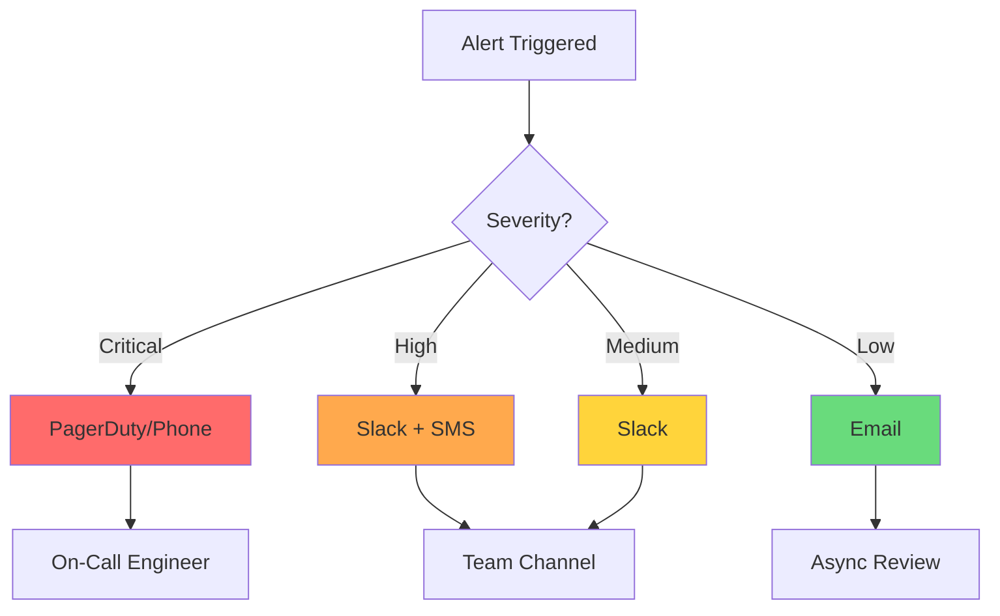
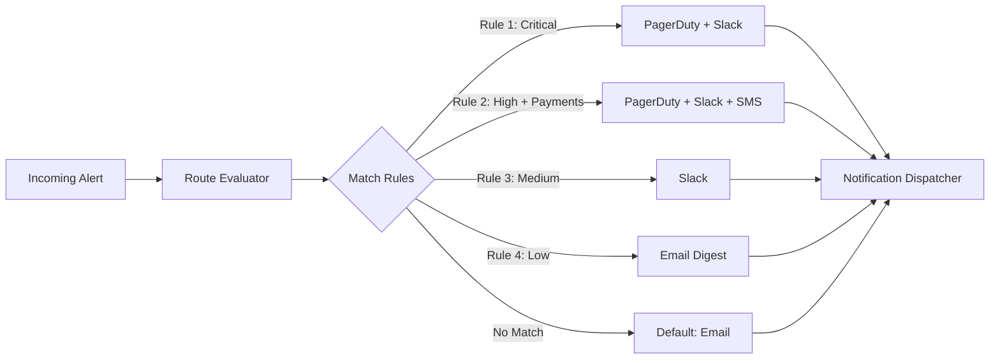
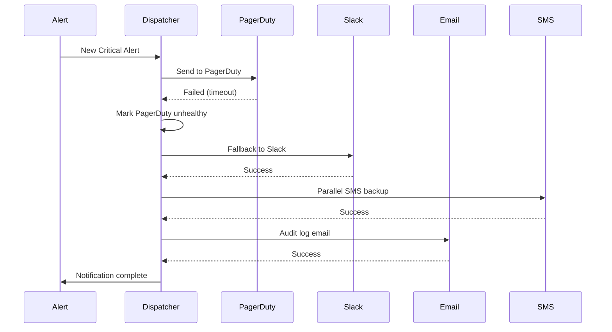
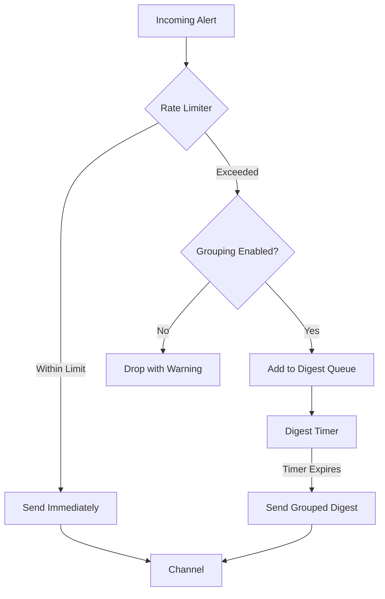

# How to Build Alert Notification Channels

Author: [nawazdhandala](https://github.com/nawazdhandala)

Tags: Alerting, Monitoring, SRE, DevOps

Description: Learn how to configure and manage multiple notification channels for effective alert delivery.

---

When an alert fires, getting the right notification to the right person through the right channel is critical. A missed alert can mean prolonged downtime, while alert fatigue from poorly configured channels leads to ignored warnings. This guide covers how to build a robust, multi-channel notification system that ensures alerts reach your team reliably.

## Why Notification Channels Matter

| Scenario | Poor Channel Design | Good Channel Design |
|----------|---------------------|---------------------|
| Critical outage | Alert goes to email, sits unread | PagerDuty escalates, phone call wakes on-call |
| High alert volume | Slack channel becomes noise | Grouped alerts with severity routing |
| Channel failure | Alerts lost entirely | Fallback channels take over |
| Off-hours incident | Nobody responds | Follow-the-sun routing engages right team |

## Channel Types Overview

Different channels serve different purposes. Choose based on urgency, recipient preferences, and integration capabilities.



### Email Channel

Best for: Low-priority alerts, daily digests, audit trails.

```typescript
interface EmailChannelConfig {
  type: 'email';
  recipients: string[];
  ccRecipients?: string[];
  subjectTemplate: string;
  bodyTemplate: string;
  replyTo?: string;
  throttling?: {
    maxPerHour: number;
    digestWindow?: number; // minutes
  };
}

class EmailChannel {
  private config: EmailChannelConfig;
  private sentCount: Map<string, number> = new Map();

  constructor(config: EmailChannelConfig) {
    this.config = config;
  }

  async send(alert: Alert): Promise<NotificationResult> {
    // Check throttling
    if (this.isThrottled(alert.fingerprint)) {
      return {
        success: false,
        reason: 'throttled',
        queued: true
      };
    }

    const subject = this.renderTemplate(
      this.config.subjectTemplate,
      alert
    );
    const body = this.renderTemplate(
      this.config.bodyTemplate,
      alert
    );

    try {
      await this.emailClient.send({
        to: this.config.recipients,
        cc: this.config.ccRecipients,
        subject,
        html: body,
        replyTo: this.config.replyTo,
      });

      this.recordSent(alert.fingerprint);
      return { success: true, channel: 'email' };
    } catch (error) {
      return {
        success: false,
        reason: error.message,
        retryable: true
      };
    }
  }

  private isThrottled(fingerprint: string): boolean {
    const count = this.sentCount.get(fingerprint) || 0;
    return count >= (this.config.throttling?.maxPerHour || Infinity);
  }

  private renderTemplate(template: string, alert: Alert): string {
    return template
      .replace('{{title}}', alert.title)
      .replace('{{severity}}', alert.severity)
      .replace('{{description}}', alert.description)
      .replace('{{timestamp}}', alert.timestamp.toISOString())
      .replace('{{service}}', alert.labels.service || 'unknown');
  }
}
```

### Slack Channel

Best for: Team awareness, medium-severity alerts, collaborative response.

```typescript
interface SlackChannelConfig {
  type: 'slack';
  webhookUrl?: string;
  token?: string;
  channel: string;
  username?: string;
  iconEmoji?: string;
  mentionUsers?: string[];
  mentionGroups?: string[];
  threadByAlert?: boolean;
}

class SlackChannel {
  private config: SlackChannelConfig;
  private threadMap: Map<string, string> = new Map();

  constructor(config: SlackChannelConfig) {
    this.config = config;
  }

  async send(alert: Alert): Promise<NotificationResult> {
    const blocks = this.buildMessageBlocks(alert);
    const mentions = this.buildMentions(alert);

    try {
      // Check if we should thread this message
      const threadTs = this.config.threadByAlert
        ? this.threadMap.get(alert.fingerprint)
        : undefined;

      const response = await this.postMessage({
        channel: this.config.channel,
        text: `${mentions}${alert.title}`,
        blocks,
        thread_ts: threadTs,
        username: this.config.username,
        icon_emoji: this.config.iconEmoji,
      });

      // Store thread timestamp for future updates
      if (!threadTs && response.ts) {
        this.threadMap.set(alert.fingerprint, response.ts);
      }

      return { success: true, channel: 'slack', messageId: response.ts };
    } catch (error) {
      return {
        success: false,
        reason: error.message,
        retryable: this.isRetryableError(error)
      };
    }
  }

  private buildMessageBlocks(alert: Alert): SlackBlock[] {
    const severityColor = {
      critical: '#ff0000',
      high: '#ff6b00',
      medium: '#ffa500',
      low: '#00ff00',
    }[alert.severity] || '#808080';

    return [
      {
        type: 'header',
        text: {
          type: 'plain_text',
          text: alert.title,
          emoji: true,
        },
      },
      {
        type: 'section',
        fields: [
          {
            type: 'mrkdwn',
            text: `*Severity:*\n${alert.severity.toUpperCase()}`,
          },
          {
            type: 'mrkdwn',
            text: `*Service:*\n${alert.labels.service || 'N/A'}`,
          },
          {
            type: 'mrkdwn',
            text: `*Time:*\n<!date^${Math.floor(alert.timestamp.getTime() / 1000)}^{date_short} {time}|${alert.timestamp.toISOString()}>`,
          },
          {
            type: 'mrkdwn',
            text: `*Status:*\n${alert.status}`,
          },
        ],
      },
      {
        type: 'section',
        text: {
          type: 'mrkdwn',
          text: alert.description,
        },
      },
      {
        type: 'actions',
        elements: [
          {
            type: 'button',
            text: { type: 'plain_text', text: 'View Alert' },
            url: alert.alertUrl,
            action_id: 'view_alert',
          },
          {
            type: 'button',
            text: { type: 'plain_text', text: 'Acknowledge' },
            action_id: 'acknowledge_alert',
            value: alert.id,
            style: 'primary',
          },
          {
            type: 'button',
            text: { type: 'plain_text', text: 'Runbook' },
            url: alert.runbookUrl,
            action_id: 'view_runbook',
          },
        ],
      },
      {
        type: 'context',
        elements: [
          {
            type: 'mrkdwn',
            text: `Alert ID: ${alert.id} | Fingerprint: ${alert.fingerprint}`,
          },
        ],
      },
    ];
  }

  private buildMentions(alert: Alert): string {
    const mentions: string[] = [];

    if (alert.severity === 'critical' || alert.severity === 'high') {
      if (this.config.mentionUsers) {
        mentions.push(...this.config.mentionUsers.map(u => `<@${u}>`));
      }
      if (this.config.mentionGroups) {
        mentions.push(...this.config.mentionGroups.map(g => `<!subteam^${g}>`));
      }
    }

    return mentions.length > 0 ? mentions.join(' ') + ' ' : '';
  }
}
```

### PagerDuty Channel

Best for: Critical alerts requiring immediate response with escalation.

```typescript
interface PagerDutyChannelConfig {
  type: 'pagerduty';
  integrationKey: string;
  serviceId?: string;
  escalationPolicyId?: string;
  urgency?: 'high' | 'low';
}

class PagerDutyChannel {
  private config: PagerDutyChannelConfig;
  private baseUrl = 'https://events.pagerduty.com/v2';

  constructor(config: PagerDutyChannelConfig) {
    this.config = config;
  }

  async send(alert: Alert): Promise<NotificationResult> {
    const payload = this.buildPayload(alert);

    try {
      const response = await fetch(`${this.baseUrl}/enqueue`, {
        method: 'POST',
        headers: {
          'Content-Type': 'application/json',
        },
        body: JSON.stringify(payload),
      });

      if (!response.ok) {
        const error = await response.json();
        return {
          success: false,
          reason: error.message,
          retryable: response.status >= 500,
        };
      }

      const result = await response.json();
      return {
        success: true,
        channel: 'pagerduty',
        incidentKey: result.dedup_key,
      };
    } catch (error) {
      return {
        success: false,
        reason: error.message,
        retryable: true,
      };
    }
  }

  async resolve(alert: Alert): Promise<NotificationResult> {
    const payload = {
      routing_key: this.config.integrationKey,
      dedup_key: alert.fingerprint,
      event_action: 'resolve',
    };

    const response = await fetch(`${this.baseUrl}/enqueue`, {
      method: 'POST',
      headers: { 'Content-Type': 'application/json' },
      body: JSON.stringify(payload),
    });

    return { success: response.ok, channel: 'pagerduty' };
  }

  private buildPayload(alert: Alert) {
    return {
      routing_key: this.config.integrationKey,
      dedup_key: alert.fingerprint,
      event_action: alert.status === 'firing' ? 'trigger' : 'resolve',
      payload: {
        summary: alert.title,
        source: alert.labels.service || 'monitoring',
        severity: this.mapSeverity(alert.severity),
        timestamp: alert.timestamp.toISOString(),
        component: alert.labels.component,
        group: alert.labels.team,
        class: alert.labels.alertType,
        custom_details: {
          description: alert.description,
          runbook_url: alert.runbookUrl,
          dashboard_url: alert.dashboardUrl,
          labels: alert.labels,
        },
      },
      links: [
        { href: alert.alertUrl, text: 'View Alert' },
        { href: alert.runbookUrl, text: 'Runbook' },
      ],
    };
  }

  private mapSeverity(severity: string): string {
    const mapping: Record<string, string> = {
      critical: 'critical',
      high: 'error',
      medium: 'warning',
      low: 'info',
    };
    return mapping[severity] || 'info';
  }
}
```

## Channel Routing Configuration

Route alerts to appropriate channels based on severity, service, team, and time of day.



```typescript
interface RoutingRule {
  id: string;
  name: string;
  priority: number;
  conditions: RuleCondition[];
  channels: string[];
  enabled: boolean;
  schedule?: Schedule;
}

interface RuleCondition {
  field: 'severity' | 'service' | 'team' | 'labels' | 'title';
  operator: 'equals' | 'contains' | 'regex' | 'in';
  value: string | string[];
}

class AlertRouter {
  private rules: RoutingRule[] = [];
  private channels: Map<string, NotificationChannel> = new Map();
  private defaultChannels: string[] = ['email'];

  addRule(rule: RoutingRule): void {
    this.rules.push(rule);
    // Sort by priority (lower number = higher priority)
    this.rules.sort((a, b) => a.priority - b.priority);
  }

  registerChannel(name: string, channel: NotificationChannel): void {
    this.channels.set(name, channel);
  }

  async route(alert: Alert): Promise<RoutingResult> {
    const matchedRule = this.findMatchingRule(alert);
    const channelNames = matchedRule?.channels || this.defaultChannels;

    const results: ChannelResult[] = [];

    for (const channelName of channelNames) {
      const channel = this.channels.get(channelName);
      if (!channel) {
        results.push({
          channel: channelName,
          success: false,
          reason: 'Channel not found',
        });
        continue;
      }

      const result = await channel.send(alert);
      results.push({
        channel: channelName,
        ...result,
      });
    }

    return {
      alert,
      matchedRule: matchedRule?.id,
      results,
      timestamp: new Date(),
    };
  }

  private findMatchingRule(alert: Alert): RoutingRule | null {
    for (const rule of this.rules) {
      if (!rule.enabled) continue;

      // Check schedule
      if (rule.schedule && !this.isWithinSchedule(rule.schedule)) {
        continue;
      }

      // Check all conditions (AND logic)
      const allMatch = rule.conditions.every(condition =>
        this.evaluateCondition(alert, condition)
      );

      if (allMatch) {
        return rule;
      }
    }

    return null;
  }

  private evaluateCondition(alert: Alert, condition: RuleCondition): boolean {
    const value = this.getFieldValue(alert, condition.field);

    switch (condition.operator) {
      case 'equals':
        return value === condition.value;
      case 'contains':
        return String(value).includes(String(condition.value));
      case 'regex':
        return new RegExp(String(condition.value)).test(String(value));
      case 'in':
        return Array.isArray(condition.value) &&
               condition.value.includes(String(value));
      default:
        return false;
    }
  }

  private getFieldValue(alert: Alert, field: string): string {
    switch (field) {
      case 'severity': return alert.severity;
      case 'service': return alert.labels.service || '';
      case 'team': return alert.labels.team || '';
      case 'title': return alert.title;
      default:
        if (field.startsWith('labels.')) {
          const labelKey = field.substring(7);
          return alert.labels[labelKey] || '';
        }
        return '';
    }
  }

  private isWithinSchedule(schedule: Schedule): boolean {
    const now = new Date();
    const currentHour = now.getUTCHours();
    const currentDay = now.getUTCDay();

    // Check if current time is within active hours
    if (schedule.activeHours) {
      const { start, end } = schedule.activeHours;
      if (currentHour < start || currentHour >= end) {
        return false;
      }
    }

    // Check if current day is an active day
    if (schedule.activeDays && !schedule.activeDays.includes(currentDay)) {
      return false;
    }

    return true;
  }
}

// Example routing configuration
const router = new AlertRouter();

// Critical alerts - always page
router.addRule({
  id: 'critical-alerts',
  name: 'Critical Alert Routing',
  priority: 1,
  conditions: [
    { field: 'severity', operator: 'equals', value: 'critical' }
  ],
  channels: ['pagerduty', 'slack-critical'],
  enabled: true,
});

// Payment service - extra scrutiny
router.addRule({
  id: 'payment-alerts',
  name: 'Payment Service Routing',
  priority: 2,
  conditions: [
    { field: 'service', operator: 'equals', value: 'payment-service' },
    { field: 'severity', operator: 'in', value: ['critical', 'high'] }
  ],
  channels: ['pagerduty', 'slack-payments', 'sms-oncall'],
  enabled: true,
});

// Business hours - Slack only for medium
router.addRule({
  id: 'business-hours-medium',
  name: 'Business Hours Medium Alerts',
  priority: 3,
  conditions: [
    { field: 'severity', operator: 'equals', value: 'medium' }
  ],
  channels: ['slack-alerts'],
  enabled: true,
  schedule: {
    activeHours: { start: 9, end: 17 },
    activeDays: [1, 2, 3, 4, 5], // Monday-Friday
    timezone: 'America/New_York',
  },
});
```

## Fallback Channel Strategies

Ensure alerts are delivered even when primary channels fail.



```typescript
interface FallbackConfig {
  primaryChannel: string;
  fallbackChannels: string[];
  retryAttempts: number;
  retryDelayMs: number;
  parallelFallback?: boolean;
}

class FallbackDispatcher {
  private channels: Map<string, NotificationChannel> = new Map();
  private channelHealth: Map<string, ChannelHealth> = new Map();
  private fallbackConfigs: Map<string, FallbackConfig> = new Map();

  constructor() {
    // Start health check loop
    setInterval(() => this.checkChannelHealth(), 60000);
  }

  async dispatch(
    alert: Alert,
    channelName: string
  ): Promise<DispatchResult> {
    const config = this.fallbackConfigs.get(channelName);
    const channel = this.channels.get(channelName);

    if (!channel) {
      throw new Error(`Channel ${channelName} not found`);
    }

    // Check if primary channel is healthy
    const health = this.channelHealth.get(channelName);
    if (health && !health.healthy && config?.fallbackChannels.length) {
      console.log(`Primary channel ${channelName} unhealthy, using fallback`);
      return this.dispatchWithFallback(alert, config);
    }

    // Try primary channel with retries
    let lastError: Error | null = null;
    for (let attempt = 1; attempt <= (config?.retryAttempts || 3); attempt++) {
      try {
        const result = await channel.send(alert);
        if (result.success) {
          return {
            success: true,
            channel: channelName,
            attempts: attempt,
          };
        }
        lastError = new Error(result.reason);
      } catch (error) {
        lastError = error;
      }

      if (attempt < (config?.retryAttempts || 3)) {
        await this.delay(config?.retryDelayMs || 1000);
      }
    }

    // Primary failed, try fallbacks
    if (config?.fallbackChannels.length) {
      this.markChannelUnhealthy(channelName);
      return this.dispatchWithFallback(alert, config);
    }

    return {
      success: false,
      channel: channelName,
      error: lastError?.message,
    };
  }

  private async dispatchWithFallback(
    alert: Alert,
    config: FallbackConfig
  ): Promise<DispatchResult> {
    const results: DispatchResult[] = [];

    if (config.parallelFallback) {
      // Send to all fallbacks in parallel
      const promises = config.fallbackChannels.map(async (channelName) => {
        const channel = this.channels.get(channelName);
        if (!channel) return { success: false, channel: channelName };

        const result = await channel.send(alert);
        return { ...result, channel: channelName };
      });

      const allResults = await Promise.all(promises);
      const anySuccess = allResults.some(r => r.success);

      return {
        success: anySuccess,
        channel: config.primaryChannel,
        fallbackUsed: true,
        fallbackResults: allResults,
      };
    } else {
      // Try fallbacks in sequence
      for (const fallbackName of config.fallbackChannels) {
        const channel = this.channels.get(fallbackName);
        if (!channel) continue;

        const result = await channel.send(alert);
        if (result.success) {
          return {
            success: true,
            channel: fallbackName,
            fallbackUsed: true,
            originalChannel: config.primaryChannel,
          };
        }
        results.push({ ...result, channel: fallbackName });
      }
    }

    return {
      success: false,
      channel: config.primaryChannel,
      fallbackUsed: true,
      fallbackResults: results,
    };
  }

  private async checkChannelHealth(): Promise<void> {
    for (const [name, channel] of this.channels) {
      try {
        const healthy = await channel.healthCheck();
        this.channelHealth.set(name, {
          healthy,
          lastCheck: new Date(),
          consecutiveFailures: healthy ? 0 :
            (this.channelHealth.get(name)?.consecutiveFailures || 0) + 1,
        });
      } catch (error) {
        this.channelHealth.set(name, {
          healthy: false,
          lastCheck: new Date(),
          error: error.message,
          consecutiveFailures:
            (this.channelHealth.get(name)?.consecutiveFailures || 0) + 1,
        });
      }
    }
  }

  private markChannelUnhealthy(channelName: string): void {
    const current = this.channelHealth.get(channelName);
    this.channelHealth.set(channelName, {
      healthy: false,
      lastCheck: new Date(),
      consecutiveFailures: (current?.consecutiveFailures || 0) + 1,
    });
  }

  private delay(ms: number): Promise<void> {
    return new Promise(resolve => setTimeout(resolve, ms));
  }
}

// Configure fallback chains
const dispatcher = new FallbackDispatcher();

dispatcher.setFallbackConfig('pagerduty', {
  primaryChannel: 'pagerduty',
  fallbackChannels: ['slack-critical', 'sms-oncall', 'email-oncall'],
  retryAttempts: 3,
  retryDelayMs: 2000,
  parallelFallback: false,
});

dispatcher.setFallbackConfig('slack-alerts', {
  primaryChannel: 'slack-alerts',
  fallbackChannels: ['email-team', 'msteams-team'],
  retryAttempts: 2,
  retryDelayMs: 1000,
  parallelFallback: true, // Send to both email and Teams simultaneously
});
```

## Channel Health Monitoring

Monitor notification channel health to detect failures before they impact alert delivery.

```typescript
interface ChannelHealthMetrics {
  successRate: number;
  averageLatencyMs: number;
  lastSuccess: Date | null;
  lastFailure: Date | null;
  consecutiveFailures: number;
  totalSent: number;
  totalFailed: number;
}

class ChannelHealthMonitor {
  private metrics: Map<string, ChannelHealthMetrics> = new Map();
  private alertThresholds = {
    minSuccessRate: 0.95,
    maxLatencyMs: 5000,
    maxConsecutiveFailures: 3,
  };

  recordSuccess(channelName: string, latencyMs: number): void {
    const current = this.getOrCreateMetrics(channelName);

    current.totalSent++;
    current.lastSuccess = new Date();
    current.consecutiveFailures = 0;
    current.averageLatencyMs = this.updateAverage(
      current.averageLatencyMs,
      latencyMs,
      current.totalSent
    );
    current.successRate =
      (current.totalSent - current.totalFailed) / current.totalSent;

    this.checkThresholds(channelName, current);
  }

  recordFailure(channelName: string, error: string): void {
    const current = this.getOrCreateMetrics(channelName);

    current.totalSent++;
    current.totalFailed++;
    current.lastFailure = new Date();
    current.consecutiveFailures++;
    current.successRate =
      (current.totalSent - current.totalFailed) / current.totalSent;

    this.checkThresholds(channelName, current);
  }

  private checkThresholds(
    channelName: string,
    metrics: ChannelHealthMetrics
  ): void {
    const alerts: string[] = [];

    if (metrics.successRate < this.alertThresholds.minSuccessRate) {
      alerts.push(
        `Success rate ${(metrics.successRate * 100).toFixed(1)}% ` +
        `below threshold ${this.alertThresholds.minSuccessRate * 100}%`
      );
    }

    if (metrics.averageLatencyMs > this.alertThresholds.maxLatencyMs) {
      alerts.push(
        `Average latency ${metrics.averageLatencyMs}ms ` +
        `exceeds threshold ${this.alertThresholds.maxLatencyMs}ms`
      );
    }

    if (metrics.consecutiveFailures >= this.alertThresholds.maxConsecutiveFailures) {
      alerts.push(
        `${metrics.consecutiveFailures} consecutive failures`
      );
    }

    if (alerts.length > 0) {
      this.raiseChannelHealthAlert(channelName, alerts);
    }
  }

  private raiseChannelHealthAlert(
    channelName: string,
    issues: string[]
  ): void {
    console.error(`Channel health alert for ${channelName}:`, issues);

    // Send alert through a backup channel
    // This should use a different path than normal alerts
    this.emergencyNotify({
      title: `Notification Channel Degraded: ${channelName}`,
      description: issues.join('; '),
      severity: 'high',
    });
  }

  getHealthReport(): ChannelHealthReport {
    const report: ChannelHealthReport = {
      timestamp: new Date(),
      channels: {},
      overallHealth: 'healthy',
    };

    for (const [name, metrics] of this.metrics) {
      const status = this.calculateStatus(metrics);
      report.channels[name] = {
        status,
        metrics,
      };

      if (status === 'unhealthy') {
        report.overallHealth = 'unhealthy';
      } else if (status === 'degraded' && report.overallHealth === 'healthy') {
        report.overallHealth = 'degraded';
      }
    }

    return report;
  }

  private calculateStatus(metrics: ChannelHealthMetrics): string {
    if (metrics.consecutiveFailures >= this.alertThresholds.maxConsecutiveFailures) {
      return 'unhealthy';
    }
    if (metrics.successRate < this.alertThresholds.minSuccessRate) {
      return 'degraded';
    }
    if (metrics.averageLatencyMs > this.alertThresholds.maxLatencyMs) {
      return 'degraded';
    }
    return 'healthy';
  }

  private getOrCreateMetrics(channelName: string): ChannelHealthMetrics {
    if (!this.metrics.has(channelName)) {
      this.metrics.set(channelName, {
        successRate: 1,
        averageLatencyMs: 0,
        lastSuccess: null,
        lastFailure: null,
        consecutiveFailures: 0,
        totalSent: 0,
        totalFailed: 0,
      });
    }
    return this.metrics.get(channelName)!;
  }

  private updateAverage(
    currentAvg: number,
    newValue: number,
    count: number
  ): number {
    return currentAvg + (newValue - currentAvg) / count;
  }
}
```

## Rate Limiting Per Channel

Prevent alert storms from overwhelming channels and recipients.



```typescript
interface RateLimitConfig {
  maxPerMinute: number;
  maxPerHour: number;
  maxPerDay: number;
  groupingWindow?: number; // seconds
  groupByFields?: string[];
}

interface RateLimitState {
  minuteCount: number;
  hourCount: number;
  dayCount: number;
  minuteReset: Date;
  hourReset: Date;
  dayReset: Date;
  pendingDigest: Alert[];
  digestTimer: NodeJS.Timeout | null;
}

class ChannelRateLimiter {
  private config: RateLimitConfig;
  private state: Map<string, RateLimitState> = new Map();
  private onDigestReady: (channelKey: string, alerts: Alert[]) => void;

  constructor(
    config: RateLimitConfig,
    onDigestReady: (channelKey: string, alerts: Alert[]) => void
  ) {
    this.config = config;
    this.onDigestReady = onDigestReady;
  }

  async checkAndConsume(
    channelName: string,
    alert: Alert
  ): Promise<RateLimitResult> {
    const key = this.getGroupKey(channelName, alert);
    const state = this.getOrCreateState(key);

    this.resetExpiredCounters(state);

    // Check if within all limits
    if (
      state.minuteCount < this.config.maxPerMinute &&
      state.hourCount < this.config.maxPerHour &&
      state.dayCount < this.config.maxPerDay
    ) {
      // Consume from all buckets
      state.minuteCount++;
      state.hourCount++;
      state.dayCount++;

      return { allowed: true };
    }

    // Rate limited - check if grouping is enabled
    if (this.config.groupingWindow) {
      return this.addToDigest(key, state, alert);
    }

    // No grouping - return rate limited
    return {
      allowed: false,
      reason: this.getRateLimitReason(state),
      retryAfter: this.getRetryAfter(state),
    };
  }

  private addToDigest(
    key: string,
    state: RateLimitState,
    alert: Alert
  ): RateLimitResult {
    state.pendingDigest.push(alert);

    // Set up digest timer if not already running
    if (!state.digestTimer) {
      state.digestTimer = setTimeout(() => {
        const alerts = [...state.pendingDigest];
        state.pendingDigest = [];
        state.digestTimer = null;

        // Consume one slot for the digest
        state.minuteCount++;
        state.hourCount++;
        state.dayCount++;

        this.onDigestReady(key, alerts);
      }, this.config.groupingWindow! * 1000);
    }

    return {
      allowed: false,
      queued: true,
      digestPosition: state.pendingDigest.length,
      digestSendTime: new Date(
        Date.now() + this.config.groupingWindow! * 1000
      ),
    };
  }

  private getGroupKey(channelName: string, alert: Alert): string {
    if (!this.config.groupByFields?.length) {
      return channelName;
    }

    const groupValues = this.config.groupByFields
      .map(field => alert.labels[field] || 'unknown')
      .join(':');

    return `${channelName}:${groupValues}`;
  }

  private getOrCreateState(key: string): RateLimitState {
    if (!this.state.has(key)) {
      const now = new Date();
      this.state.set(key, {
        minuteCount: 0,
        hourCount: 0,
        dayCount: 0,
        minuteReset: new Date(now.getTime() + 60000),
        hourReset: new Date(now.getTime() + 3600000),
        dayReset: new Date(now.getTime() + 86400000),
        pendingDigest: [],
        digestTimer: null,
      });
    }
    return this.state.get(key)!;
  }

  private resetExpiredCounters(state: RateLimitState): void {
    const now = new Date();

    if (now >= state.minuteReset) {
      state.minuteCount = 0;
      state.minuteReset = new Date(now.getTime() + 60000);
    }

    if (now >= state.hourReset) {
      state.hourCount = 0;
      state.hourReset = new Date(now.getTime() + 3600000);
    }

    if (now >= state.dayReset) {
      state.dayCount = 0;
      state.dayReset = new Date(now.getTime() + 86400000);
    }
  }

  private getRateLimitReason(state: RateLimitState): string {
    if (state.minuteCount >= this.config.maxPerMinute) {
      return 'minute limit exceeded';
    }
    if (state.hourCount >= this.config.maxPerHour) {
      return 'hour limit exceeded';
    }
    return 'day limit exceeded';
  }

  private getRetryAfter(state: RateLimitState): Date {
    const now = new Date();

    if (state.minuteCount >= this.config.maxPerMinute) {
      return state.minuteReset;
    }
    if (state.hourCount >= this.config.maxPerHour) {
      return state.hourReset;
    }
    return state.dayReset;
  }
}

// Usage
const rateLimiter = new ChannelRateLimiter(
  {
    maxPerMinute: 10,
    maxPerHour: 100,
    maxPerDay: 500,
    groupingWindow: 300, // 5-minute digest window
    groupByFields: ['service', 'alertname'],
  },
  (channelKey, alerts) => {
    // Send digest notification
    sendDigestNotification(channelKey, alerts);
  }
);
```

## Channel Testing and Validation

Verify channels work correctly before relying on them for critical alerts.

```typescript
interface ChannelTestResult {
  channel: string;
  success: boolean;
  latencyMs: number;
  error?: string;
  details?: Record<string, any>;
}

class ChannelValidator {
  private channels: Map<string, NotificationChannel> = new Map();

  async testChannel(channelName: string): Promise<ChannelTestResult> {
    const channel = this.channels.get(channelName);
    if (!channel) {
      return {
        channel: channelName,
        success: false,
        latencyMs: 0,
        error: 'Channel not found',
      };
    }

    const testAlert = this.createTestAlert(channelName);
    const startTime = Date.now();

    try {
      const result = await channel.send(testAlert);
      const latencyMs = Date.now() - startTime;

      return {
        channel: channelName,
        success: result.success,
        latencyMs,
        error: result.reason,
        details: {
          messageId: result.messageId,
          testAlertId: testAlert.id,
        },
      };
    } catch (error) {
      return {
        channel: channelName,
        success: false,
        latencyMs: Date.now() - startTime,
        error: error.message,
      };
    }
  }

  async testAllChannels(): Promise<ChannelTestResult[]> {
    const results: ChannelTestResult[] = [];

    for (const channelName of this.channels.keys()) {
      const result = await this.testChannel(channelName);
      results.push(result);
    }

    return results;
  }

  async validateConfiguration(
    config: ChannelConfig
  ): Promise<ValidationResult> {
    const errors: string[] = [];
    const warnings: string[] = [];

    // Validate required fields
    if (!config.type) {
      errors.push('Channel type is required');
    }

    // Type-specific validation
    switch (config.type) {
      case 'slack':
        if (!config.webhookUrl && !config.token) {
          errors.push('Slack requires either webhookUrl or token');
        }
        if (!config.channel) {
          errors.push('Slack channel is required');
        }
        if (config.channel && !config.channel.startsWith('#') &&
            !config.channel.startsWith('C')) {
          warnings.push('Slack channel should start with # or be a channel ID');
        }
        break;

      case 'pagerduty':
        if (!config.integrationKey) {
          errors.push('PagerDuty integration key is required');
        }
        if (config.integrationKey && config.integrationKey.length !== 32) {
          warnings.push('PagerDuty integration key should be 32 characters');
        }
        break;

      case 'email':
        if (!config.recipients?.length) {
          errors.push('At least one email recipient is required');
        }
        for (const email of config.recipients || []) {
          if (!this.isValidEmail(email)) {
            errors.push(`Invalid email address: ${email}`);
          }
        }
        break;
    }

    // Validate rate limiting config
    if (config.rateLimit) {
      if (config.rateLimit.maxPerMinute > 60) {
        warnings.push('High per-minute rate limit may cause issues');
      }
      if (config.rateLimit.groupingWindow &&
          config.rateLimit.groupingWindow < 60) {
        warnings.push('Short grouping window may not reduce noise effectively');
      }
    }

    return {
      valid: errors.length === 0,
      errors,
      warnings,
    };
  }

  private createTestAlert(channelName: string): Alert {
    return {
      id: `test-${Date.now()}`,
      fingerprint: `test-${channelName}-${Date.now()}`,
      title: `[TEST] Channel Validation - ${channelName}`,
      description: 'This is a test alert to validate channel configuration. ' +
                   'Please ignore this message.',
      severity: 'low',
      status: 'firing',
      timestamp: new Date(),
      labels: {
        alertType: 'test',
        channel: channelName,
      },
      alertUrl: 'https://example.com/test',
      runbookUrl: 'https://example.com/runbook',
      dashboardUrl: 'https://example.com/dashboard',
    };
  }

  private isValidEmail(email: string): boolean {
    return /^[^\s@]+@[^\s@]+\.[^\s@]+$/.test(email);
  }
}

// Scheduled channel validation
class ChannelHealthScheduler {
  private validator: ChannelValidator;
  private testInterval: NodeJS.Timeout | null = null;

  constructor(validator: ChannelValidator) {
    this.validator = validator;
  }

  startScheduledTests(intervalMinutes: number = 60): void {
    // Run immediately
    this.runTests();

    // Schedule regular tests
    this.testInterval = setInterval(
      () => this.runTests(),
      intervalMinutes * 60 * 1000
    );
  }

  stopScheduledTests(): void {
    if (this.testInterval) {
      clearInterval(this.testInterval);
      this.testInterval = null;
    }
  }

  private async runTests(): Promise<void> {
    console.log('Running scheduled channel tests...');

    const results = await this.validator.testAllChannels();

    const failures = results.filter(r => !r.success);
    if (failures.length > 0) {
      console.error('Channel test failures:', failures);

      // Alert about channel failures through a known-good channel
      this.alertChannelFailures(failures);
    } else {
      console.log('All channel tests passed');
    }

    // Record metrics
    for (const result of results) {
      recordMetric('channel_test_result', {
        channel: result.channel,
        success: result.success ? 1 : 0,
        latency_ms: result.latencyMs,
      });
    }
  }

  private alertChannelFailures(failures: ChannelTestResult[]): void {
    const message = failures
      .map(f => `${f.channel}: ${f.error}`)
      .join('\n');

    // Use emergency notification path
    emergencyNotify({
      title: 'Notification Channel Test Failures',
      description: message,
      severity: 'high',
    });
  }
}
```

## Complete Integration Example

Putting it all together with a unified notification service.

```typescript
class NotificationService {
  private router: AlertRouter;
  private dispatcher: FallbackDispatcher;
  private rateLimiter: ChannelRateLimiter;
  private healthMonitor: ChannelHealthMonitor;
  private validator: ChannelValidator;

  constructor(config: NotificationServiceConfig) {
    this.router = new AlertRouter();
    this.dispatcher = new FallbackDispatcher();
    this.healthMonitor = new ChannelHealthMonitor();
    this.validator = new ChannelValidator();

    this.rateLimiter = new ChannelRateLimiter(
      config.rateLimiting,
      (key, alerts) => this.sendDigest(key, alerts)
    );

    // Register channels
    this.setupChannels(config.channels);

    // Setup routing rules
    this.setupRouting(config.routing);

    // Start health checks
    new ChannelHealthScheduler(this.validator).startScheduledTests();
  }

  async notify(alert: Alert): Promise<NotificationResult> {
    const startTime = Date.now();

    try {
      // Route alert to appropriate channels
      const routingResult = await this.router.route(alert);

      const results: ChannelResult[] = [];

      for (const channelName of routingResult.channels) {
        // Check rate limits
        const rateLimitResult = await this.rateLimiter.checkAndConsume(
          channelName,
          alert
        );

        if (!rateLimitResult.allowed) {
          if (rateLimitResult.queued) {
            results.push({
              channel: channelName,
              success: true,
              queued: true,
            });
          } else {
            results.push({
              channel: channelName,
              success: false,
              reason: rateLimitResult.reason,
            });
          }
          continue;
        }

        // Dispatch with fallback support
        const dispatchResult = await this.dispatcher.dispatch(
          alert,
          channelName
        );

        // Record metrics
        const latencyMs = Date.now() - startTime;
        if (dispatchResult.success) {
          this.healthMonitor.recordSuccess(channelName, latencyMs);
        } else {
          this.healthMonitor.recordFailure(channelName, dispatchResult.error);
        }

        results.push(dispatchResult);
      }

      // Determine overall success
      const anySuccess = results.some(r => r.success);

      return {
        success: anySuccess,
        alert,
        results,
        latencyMs: Date.now() - startTime,
      };
    } catch (error) {
      return {
        success: false,
        alert,
        error: error.message,
        latencyMs: Date.now() - startTime,
      };
    }
  }

  private async sendDigest(
    channelKey: string,
    alerts: Alert[]
  ): Promise<void> {
    const digestAlert = this.createDigestAlert(alerts);
    const channelName = channelKey.split(':')[0];

    await this.dispatcher.dispatch(digestAlert, channelName);
  }

  private createDigestAlert(alerts: Alert[]): Alert {
    const severityCounts = alerts.reduce((acc, a) => {
      acc[a.severity] = (acc[a.severity] || 0) + 1;
      return acc;
    }, {} as Record<string, number>);

    const highestSeverity = ['critical', 'high', 'medium', 'low']
      .find(s => severityCounts[s]) || 'low';

    return {
      id: `digest-${Date.now()}`,
      fingerprint: `digest-${Date.now()}`,
      title: `Alert Digest: ${alerts.length} alerts`,
      description: `Severity breakdown: ${JSON.stringify(severityCounts)}\n\n` +
        alerts.map(a => `- [${a.severity}] ${a.title}`).join('\n'),
      severity: highestSeverity,
      status: 'firing',
      timestamp: new Date(),
      labels: {
        alertType: 'digest',
        alertCount: String(alerts.length),
      },
    };
  }

  getHealthReport(): HealthReport {
    return this.healthMonitor.getHealthReport();
  }

  async testChannel(channelName: string): Promise<ChannelTestResult> {
    return this.validator.testChannel(channelName);
  }
}

// Initialize and use
const notificationService = new NotificationService({
  channels: {
    'pagerduty': {
      type: 'pagerduty',
      integrationKey: process.env.PAGERDUTY_KEY,
    },
    'slack-critical': {
      type: 'slack',
      webhookUrl: process.env.SLACK_CRITICAL_WEBHOOK,
      channel: '#incidents',
      mentionGroups: ['oncall-team'],
    },
    'slack-alerts': {
      type: 'slack',
      webhookUrl: process.env.SLACK_ALERTS_WEBHOOK,
      channel: '#alerts',
    },
    'email-oncall': {
      type: 'email',
      recipients: ['oncall@company.com'],
    },
  },
  routing: {
    rules: [
      {
        id: 'critical',
        priority: 1,
        conditions: [{ field: 'severity', operator: 'equals', value: 'critical' }],
        channels: ['pagerduty', 'slack-critical'],
      },
      {
        id: 'high',
        priority: 2,
        conditions: [{ field: 'severity', operator: 'equals', value: 'high' }],
        channels: ['slack-critical'],
      },
      {
        id: 'default',
        priority: 100,
        conditions: [],
        channels: ['slack-alerts'],
      },
    ],
    defaultChannels: ['email-oncall'],
  },
  rateLimiting: {
    maxPerMinute: 10,
    maxPerHour: 100,
    maxPerDay: 500,
    groupingWindow: 300,
  },
});

// Handle incoming alert
const result = await notificationService.notify({
  id: 'alert-123',
  fingerprint: 'service-api-high-latency',
  title: 'High API Latency Detected',
  description: 'P95 latency exceeds 2s threshold',
  severity: 'high',
  status: 'firing',
  timestamp: new Date(),
  labels: {
    service: 'api-gateway',
    team: 'platform',
  },
  alertUrl: 'https://monitoring.company.com/alerts/123',
  runbookUrl: 'https://wiki.company.com/runbooks/api-latency',
});
```

## Summary

| Component | Purpose | Key Considerations |
|-----------|---------|-------------------|
| **Channel Types** | Different urgency levels | Match channel to alert severity |
| **Routing** | Direct alerts to right channels | Use rules with priorities and schedules |
| **Fallbacks** | Ensure delivery when channels fail | Configure backup chains |
| **Health Monitoring** | Detect channel issues early | Alert on degradation before failures |
| **Rate Limiting** | Prevent alert storms | Use grouping to reduce noise |
| **Testing** | Validate channels work | Schedule regular verification |

Building a robust notification channel system requires balancing reliability with noise reduction. Start with basic routing, add fallbacks for critical paths, implement rate limiting to prevent fatigue, and continuously monitor channel health.

OneUptime provides built-in support for multiple notification channels with automatic routing, fallbacks, and health monitoring. Check out the platform at [oneuptime.com](https://oneuptime.com) to see how these patterns are implemented in a production-ready alerting system.
