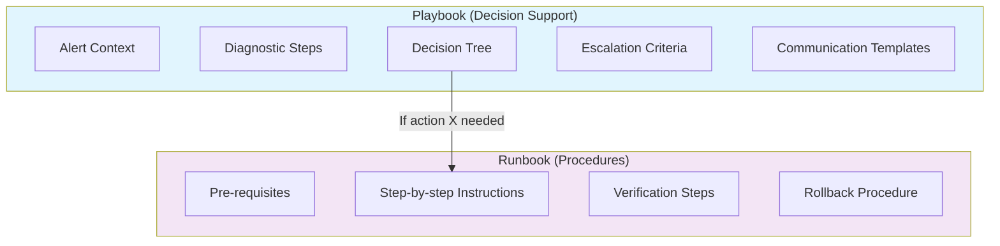
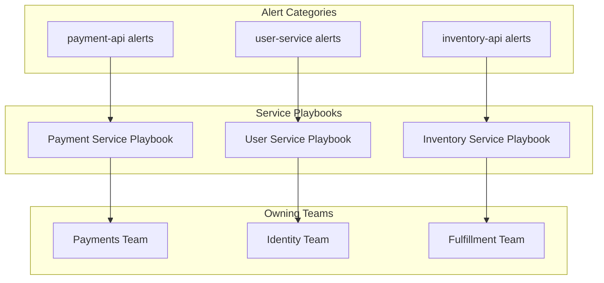
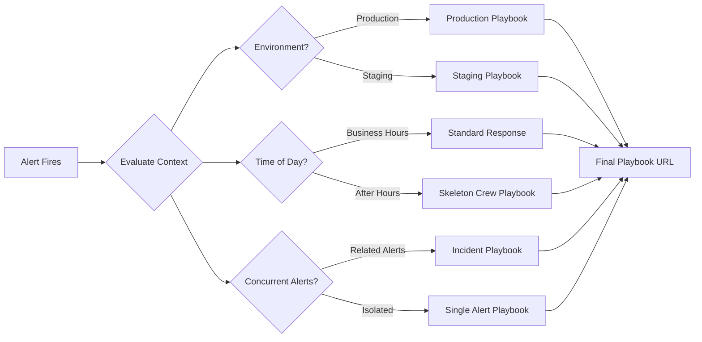
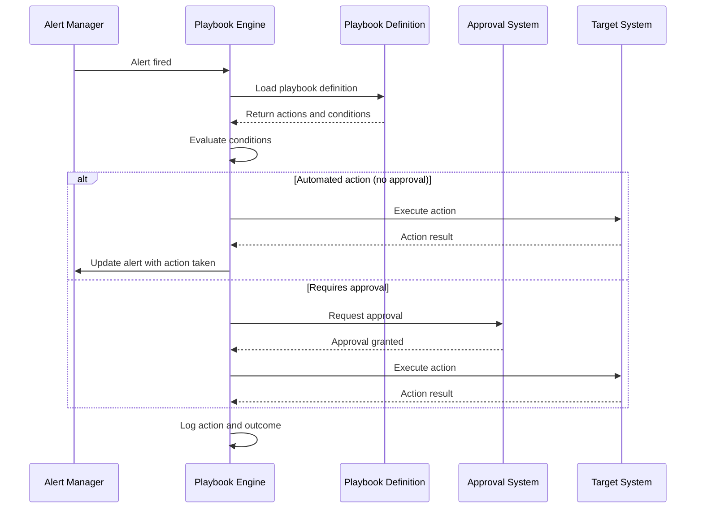
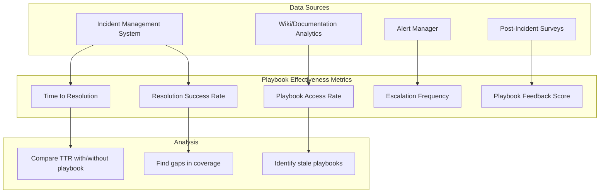

# How to Create Alert Playbook Links

Author: [nawazdhandala](https://github.com/nawazdhandala)

Tags: Alerting, Playbooks, Incident Response, SRE

Description: Learn how to link alerts to response playbooks for consistent incident handling.

---

When an alert fires at 3 AM, the on-call engineer should not be deciphering cryptic error messages while half-asleep. They need clear, actionable guidance that gets them from alert to resolution as fast as possible. Alert playbook links bridge this gap by connecting each alert directly to its corresponding response documentation.

This post covers how to design, implement, and maintain alert-to-playbook links that make incident response faster and more consistent.

## Playbook vs Runbook: Understanding the Distinction

Before diving into implementation, let us clarify terminology that often gets conflated.

**Runbooks** are step-by-step instructions for routine operational tasks. They describe how to perform a specific procedure: restart a service, rotate credentials, scale a cluster. Runbooks assume you know what needs to be done and tell you how to do it.

**Playbooks** are decision-support documents for incident response. They help you diagnose what is happening, decide what actions to take, and understand the broader context. Playbooks handle uncertainty and guide investigation.



When an alert fires, you typically start with a playbook to understand and diagnose, then switch to runbooks when you know what action to take. Alert links should point to playbooks, which themselves link to relevant runbooks.

| Aspect | Playbook | Runbook |
|--------|----------|---------|
| Purpose | Diagnose and decide | Execute procedure |
| Uncertainty | High - exploring unknowns | Low - known procedure |
| Structure | Decision trees, diagnostics | Sequential steps |
| When used | Alert investigation | After deciding on action |
| Example | "Database latency alert playbook" | "How to failover to replica" |

## Alert-to-Playbook Mapping Strategies

Mapping alerts to playbooks requires a systematic approach. Random links to documentation create confusion. A thoughtful mapping strategy ensures engineers find the right guidance quickly.

### One-to-One Mapping

The simplest approach assigns one playbook to each alert rule. This works well for specific, well-understood alerts.

```yaml
# Prometheus alerting rule with playbook link
# Each alert includes a direct link to its response documentation

groups:
  - name: database-alerts
    rules:
      - alert: PostgresHighConnectionCount
        expr: pg_stat_activity_count > 100
        for: 5m
        labels:
          severity: warning
          team: platform
        annotations:
          summary: "PostgreSQL connection count is high"
          description: "Database {{ $labels.instance }} has {{ $value }} active connections"
          # Direct link to the specific playbook for this alert
          playbook_url: "https://wiki.company.com/playbooks/postgres-high-connections"
          runbook_url: "https://wiki.company.com/runbooks/postgres-connection-management"
```

### Category-Based Mapping

For systems with many alerts, category-based mapping reduces maintenance overhead. Alerts in the same category share a playbook.

```yaml
# Category-based playbook mapping
# Similar alerts share response procedures

groups:
  - name: api-alerts
    rules:
      - alert: APIHighLatency
        expr: histogram_quantile(0.99, rate(http_request_duration_seconds_bucket[5m])) > 0.5
        labels:
          severity: warning
          category: api-performance
        annotations:
          summary: "API p99 latency above 500ms"
          # Category-level playbook covers multiple latency scenarios
          playbook_url: "https://wiki.company.com/playbooks/api-performance"

      - alert: APIHighErrorRate
        expr: rate(http_requests_total{status=~"5.."}[5m]) / rate(http_requests_total[5m]) > 0.01
        labels:
          severity: critical
          category: api-errors
        annotations:
          summary: "API error rate above 1%"
          playbook_url: "https://wiki.company.com/playbooks/api-errors"
```

### Service-Based Mapping

For microservices architectures, service-based mapping aligns playbooks with team ownership.



## Playbook URL Patterns

Consistent URL patterns make playbook links predictable and maintainable. Engineers learn the pattern and can guess playbook locations even without clicking the link.

### Pattern Design

Design URL patterns that encode useful information: service name, alert category, or severity level.

```python
# playbook_url_generator.py
# Generate consistent playbook URLs from alert metadata

from typing import Optional
from urllib.parse import urljoin

class PlaybookURLGenerator:
    """
    Generates predictable playbook URLs based on alert metadata.
    URL pattern: {base_url}/playbooks/{service}/{category}/{alert_name}
    """

    def __init__(self, base_url: str):
        self.base_url = base_url.rstrip('/')

    def generate_url(
        self,
        service: str,
        category: str,
        alert_name: str,
        anchor: Optional[str] = None
    ) -> str:
        """
        Generate a playbook URL from alert components.

        Args:
            service: Service name (e.g., 'payment-api')
            category: Alert category (e.g., 'latency', 'errors')
            alert_name: Specific alert name (e.g., 'high-p99-latency')
            anchor: Optional section anchor within the playbook

        Returns:
            Full playbook URL
        """
        # Normalize components to URL-safe format
        service_slug = self._slugify(service)
        category_slug = self._slugify(category)
        alert_slug = self._slugify(alert_name)

        # Build the URL path
        path = f"/playbooks/{service_slug}/{category_slug}/{alert_slug}"
        url = urljoin(self.base_url, path)

        # Add anchor if specified
        if anchor:
            url = f"{url}#{self._slugify(anchor)}"

        return url

    def _slugify(self, text: str) -> str:
        """Convert text to URL-safe slug."""
        return text.lower().replace(' ', '-').replace('_', '-')


# Example usage showing URL generation from alert labels
def get_playbook_url_for_alert(alert_labels: dict) -> str:
    """
    Extract playbook URL from alert labels or generate from metadata.
    """
    generator = PlaybookURLGenerator("https://wiki.company.com")

    # If explicit playbook_url is set, use it
    if 'playbook_url' in alert_labels:
        return alert_labels['playbook_url']

    # Otherwise, generate from metadata
    return generator.generate_url(
        service=alert_labels.get('service', 'unknown'),
        category=alert_labels.get('category', 'general'),
        alert_name=alert_labels.get('alertname', 'unknown-alert')
    )
```

### URL Pattern Examples

Different organizations use different patterns. Here are common approaches.

```text
# Pattern 1: Flat structure by alert name
https://wiki.company.com/playbooks/PostgresHighConnections
https://wiki.company.com/playbooks/APIHighLatency

# Pattern 2: Hierarchical by service and alert
https://wiki.company.com/playbooks/database/postgres/high-connections
https://wiki.company.com/playbooks/api/gateway/high-latency

# Pattern 3: Category-based with tags
https://wiki.company.com/playbooks?service=postgres&category=performance
https://wiki.company.com/playbooks?service=api&category=availability

# Pattern 4: Version-controlled in Git repository
https://github.com/company/playbooks/blob/main/database/postgres-high-connections.md
https://github.com/company/playbooks/blob/main/api/high-latency.md
```

## Context-Aware Playbook Selection

Static playbook links work for simple cases, but complex systems benefit from context-aware selection. The right playbook might depend on the environment, time of day, or concurrent alerts.

### Dynamic Playbook Resolution

Implement a resolver that considers context when selecting playbooks.



```python
# context_aware_playbook.py
# Select playbooks based on alert context and environment

from datetime import datetime, time
from typing import Dict, List, Optional
from dataclasses import dataclass

@dataclass
class AlertContext:
    """Context information for an alert."""
    alert_name: str
    service: str
    environment: str
    severity: str
    labels: Dict[str, str]
    concurrent_alerts: List[str]
    timestamp: datetime

class ContextAwarePlaybookResolver:
    """
    Resolves playbook URLs based on alert context.
    Considers environment, time, severity, and concurrent alerts.
    """

    def __init__(self, base_url: str):
        self.base_url = base_url
        self.business_hours = (time(9, 0), time(18, 0))

    def resolve(self, context: AlertContext) -> str:
        """
        Resolve the most appropriate playbook for the given context.
        """
        # Check for incident-level playbook if multiple related alerts
        if self._is_incident_scenario(context):
            return self._get_incident_playbook(context)

        # Environment-specific playbooks
        env_playbook = self._get_environment_playbook(context)
        if env_playbook:
            return env_playbook

        # Time-sensitive playbook selection
        if not self._is_business_hours(context.timestamp):
            return self._get_after_hours_playbook(context)

        # Default to standard playbook
        return self._get_standard_playbook(context)

    def _is_incident_scenario(self, context: AlertContext) -> bool:
        """
        Detect if this alert is part of a larger incident.
        Look for patterns in concurrent alerts that suggest cascading failure.
        """
        if len(context.concurrent_alerts) < 2:
            return False

        # Check if concurrent alerts affect the same service
        related_count = sum(
            1 for alert in context.concurrent_alerts
            if context.service in alert
        )
        return related_count >= 2

    def _get_incident_playbook(self, context: AlertContext) -> str:
        """Return incident-level playbook for multi-alert scenarios."""
        return f"{self.base_url}/playbooks/incidents/{context.service}-outage"

    def _get_environment_playbook(self, context: AlertContext) -> Optional[str]:
        """Return environment-specific playbook if available."""
        if context.environment == "production":
            return f"{self.base_url}/playbooks/production/{context.alert_name}"
        elif context.environment in ["staging", "development"]:
            # Non-production environments share a simplified playbook
            return f"{self.base_url}/playbooks/non-production/{context.alert_name}"
        return None

    def _is_business_hours(self, timestamp: datetime) -> bool:
        """Check if timestamp falls within business hours."""
        current_time = timestamp.time()
        start, end = self.business_hours
        return start <= current_time <= end

    def _get_after_hours_playbook(self, context: AlertContext) -> str:
        """
        Return after-hours playbook with escalation guidance.
        After-hours playbooks emphasize quick triage and escalation paths.
        """
        return f"{self.base_url}/playbooks/after-hours/{context.alert_name}"

    def _get_standard_playbook(self, context: AlertContext) -> str:
        """Return standard playbook for normal business hours."""
        return f"{self.base_url}/playbooks/{context.service}/{context.alert_name}"


# Example integration with alerting system
def enrich_alert_with_playbook(alert: dict) -> dict:
    """
    Enrich an incoming alert with the appropriate playbook URL.
    Called by the alert processing pipeline.
    """
    resolver = ContextAwarePlaybookResolver("https://wiki.company.com")

    context = AlertContext(
        alert_name=alert['labels'].get('alertname'),
        service=alert['labels'].get('service'),
        environment=alert['labels'].get('environment', 'production'),
        severity=alert['labels'].get('severity'),
        labels=alert['labels'],
        concurrent_alerts=get_concurrent_alerts(alert),  # Implementation depends on your system
        timestamp=datetime.now()
    )

    alert['annotations']['playbook_url'] = resolver.resolve(context)
    return alert
```

## Automated Playbook Triggering

Beyond linking to playbooks, mature systems can trigger automated actions based on playbook definitions. This bridges the gap between documentation and automation.

### Playbook as Code

Define playbooks in a structured format that supports both human reading and automated execution.

```yaml
# playbooks/database/postgres-high-connections.yaml
# Machine-readable playbook definition

metadata:
  name: PostgreSQL High Connection Count
  service: postgres
  category: performance
  severity_threshold: warning
  owner: platform-team
  last_updated: 2026-01-15

triggers:
  - alert: PostgresHighConnectionCount
  - alert: PostgresConnectionPoolExhausted

# Diagnostic steps for human responders
diagnostics:
  - step: Check current connection distribution
    command: |
      SELECT usename, count(*)
      FROM pg_stat_activity
      GROUP BY usename
      ORDER BY count DESC;
    interpretation: "Look for unexpected users or applications consuming connections"

  - step: Identify long-running queries
    command: |
      SELECT pid, now() - pg_stat_activity.query_start AS duration, query
      FROM pg_stat_activity
      WHERE state != 'idle'
      ORDER BY duration DESC
      LIMIT 10;
    interpretation: "Queries running >5 minutes may indicate stuck transactions"

  - step: Check for connection leaks
    command: |
      SELECT client_addr, count(*)
      FROM pg_stat_activity
      GROUP BY client_addr
      ORDER BY count DESC;
    interpretation: "Single client with many connections suggests connection leak"

# Automated actions that can be triggered
automated_actions:
  - name: terminate_idle_connections
    description: "Kill connections idle for more than 10 minutes"
    condition: "connection_count > 150 AND idle_connection_count > 50"
    action:
      type: sql
      query: |
        SELECT pg_terminate_backend(pid)
        FROM pg_stat_activity
        WHERE state = 'idle'
        AND query_start < now() - interval '10 minutes';
    requires_approval: false
    cooldown_minutes: 15

  - name: enable_connection_limiting
    description: "Enable stricter connection limits"
    condition: "connection_count > 180"
    action:
      type: config_change
      parameter: max_connections
      value: 100
    requires_approval: true
    approvers: [platform-team-lead, dba-oncall]

# Escalation path
escalation:
  - level: 1
    wait_minutes: 15
    notify: [platform-oncall]
  - level: 2
    wait_minutes: 30
    notify: [platform-team-lead, dba-team]
  - level: 3
    wait_minutes: 60
    notify: [engineering-director]

# Links to related documentation
related_runbooks:
  - name: "PostgreSQL Connection Pool Tuning"
    url: "https://wiki.company.com/runbooks/postgres-connection-pool"
  - name: "Emergency Database Failover"
    url: "https://wiki.company.com/runbooks/postgres-failover"
```

### Automation Engine

Build an engine that reads playbook definitions and executes automated actions.



```python
# playbook_engine.py
# Engine for executing automated playbook actions

import yaml
from typing import Dict, Any, Optional
from dataclasses import dataclass
from datetime import datetime, timedelta
import logging

logger = logging.getLogger(__name__)

@dataclass
class ActionResult:
    """Result of executing a playbook action."""
    success: bool
    action_name: str
    message: str
    timestamp: datetime
    requires_followup: bool = False

class PlaybookEngine:
    """
    Executes automated actions defined in playbooks.
    Handles condition evaluation, approval workflows, and cooldowns.
    """

    def __init__(self, playbook_directory: str):
        self.playbook_directory = playbook_directory
        self.action_history: Dict[str, datetime] = {}
        self.executors = {
            'sql': self._execute_sql_action,
            'http': self._execute_http_action,
            'script': self._execute_script_action,
            'config_change': self._execute_config_change,
        }

    def process_alert(self, alert: dict) -> list[ActionResult]:
        """
        Process an alert and execute any applicable automated actions.
        """
        results = []

        # Load the playbook for this alert
        playbook = self._load_playbook(alert)
        if not playbook:
            logger.info(f"No playbook found for alert {alert['labels']['alertname']}")
            return results

        # Evaluate and execute automated actions
        for action in playbook.get('automated_actions', []):
            if self._should_execute_action(action, alert):
                result = self._execute_action(action, alert, playbook)
                results.append(result)

        return results

    def _load_playbook(self, alert: dict) -> Optional[dict]:
        """Load playbook definition from file."""
        alert_name = alert['labels'].get('alertname', '')
        service = alert['labels'].get('service', 'default')

        # Try service-specific playbook first
        playbook_path = f"{self.playbook_directory}/{service}/{alert_name}.yaml"

        try:
            with open(playbook_path, 'r') as f:
                return yaml.safe_load(f)
        except FileNotFoundError:
            # Fall back to generic playbook
            generic_path = f"{self.playbook_directory}/generic/{alert_name}.yaml"
            try:
                with open(generic_path, 'r') as f:
                    return yaml.safe_load(f)
            except FileNotFoundError:
                return None

    def _should_execute_action(self, action: dict, alert: dict) -> bool:
        """
        Determine if an action should be executed based on conditions and cooldowns.
        """
        action_name = action['name']

        # Check cooldown
        if action_name in self.action_history:
            last_execution = self.action_history[action_name]
            cooldown = timedelta(minutes=action.get('cooldown_minutes', 0))
            if datetime.now() - last_execution < cooldown:
                logger.info(f"Action {action_name} is in cooldown period")
                return False

        # Evaluate condition expression
        condition = action.get('condition', 'true')
        return self._evaluate_condition(condition, alert)

    def _evaluate_condition(self, condition: str, alert: dict) -> bool:
        """
        Evaluate a condition expression against alert data.
        In production, use a safe expression evaluator.
        """
        # Build context from alert labels and annotations
        context = {
            **alert.get('labels', {}),
            **alert.get('annotations', {}),
            'value': alert.get('value', 0),
        }

        # Simple evaluation - in production, use a sandboxed evaluator
        try:
            return eval(condition, {"__builtins__": {}}, context)
        except Exception as e:
            logger.error(f"Failed to evaluate condition '{condition}': {e}")
            return False

    def _execute_action(
        self,
        action: dict,
        alert: dict,
        playbook: dict
    ) -> ActionResult:
        """Execute an automated action."""
        action_name = action['name']
        action_type = action['action']['type']

        # Check if approval is required
        if action.get('requires_approval', False):
            if not self._get_approval(action, alert):
                return ActionResult(
                    success=False,
                    action_name=action_name,
                    message="Action requires approval - request sent",
                    timestamp=datetime.now(),
                    requires_followup=True
                )

        # Execute the action
        executor = self.executors.get(action_type)
        if not executor:
            return ActionResult(
                success=False,
                action_name=action_name,
                message=f"Unknown action type: {action_type}",
                timestamp=datetime.now()
            )

        try:
            result = executor(action['action'], alert)
            self.action_history[action_name] = datetime.now()

            return ActionResult(
                success=True,
                action_name=action_name,
                message=f"Action executed successfully: {result}",
                timestamp=datetime.now()
            )
        except Exception as e:
            logger.error(f"Failed to execute action {action_name}: {e}")
            return ActionResult(
                success=False,
                action_name=action_name,
                message=f"Action failed: {str(e)}",
                timestamp=datetime.now(),
                requires_followup=True
            )

    def _execute_sql_action(self, action: dict, alert: dict) -> str:
        """Execute a SQL action against the database."""
        # Implementation depends on your database setup
        query = action['query']
        logger.info(f"Executing SQL action: {query[:100]}...")
        # In production: execute query against appropriate database
        return "SQL executed"

    def _execute_http_action(self, action: dict, alert: dict) -> str:
        """Execute an HTTP action."""
        # Implementation for HTTP-based actions
        return "HTTP request sent"

    def _execute_script_action(self, action: dict, alert: dict) -> str:
        """Execute a script action."""
        # Implementation for script execution
        return "Script executed"

    def _execute_config_change(self, action: dict, alert: dict) -> str:
        """Execute a configuration change action."""
        # Implementation for config changes
        return "Configuration updated"

    def _get_approval(self, action: dict, alert: dict) -> bool:
        """
        Request and wait for approval.
        In production, integrate with your approval workflow system.
        """
        approvers = action.get('approvers', [])
        logger.info(f"Requesting approval from {approvers} for action {action['name']}")
        # Implementation depends on your approval system
        return False  # Default to not approved for safety
```

## Playbook Effectiveness Tracking

Creating playbook links is not enough. You need to measure whether playbooks actually help engineers resolve incidents faster.

### Metrics to Track

Track these metrics to understand playbook effectiveness.



### Tracking Implementation

Build tracking into your alerting and incident management workflow.

```python
# playbook_analytics.py
# Track playbook usage and effectiveness

from datetime import datetime, timedelta
from typing import Dict, List, Optional
from dataclasses import dataclass
import statistics

@dataclass
class PlaybookUsageEvent:
    """Records a single playbook access or usage event."""
    playbook_url: str
    alert_name: str
    incident_id: Optional[str]
    user: str
    timestamp: datetime
    time_spent_seconds: int
    resolution_achieved: bool
    feedback_score: Optional[int]  # 1-5 rating

@dataclass
class PlaybookEffectivenessReport:
    """Aggregated effectiveness metrics for a playbook."""
    playbook_url: str
    total_accesses: int
    unique_incidents: int
    avg_time_to_resolution_minutes: float
    resolution_success_rate: float
    avg_feedback_score: float
    last_accessed: datetime
    last_updated: datetime
    staleness_warning: bool

class PlaybookAnalytics:
    """
    Analyzes playbook usage and effectiveness.
    Identifies which playbooks work well and which need improvement.
    """

    def __init__(self):
        self.usage_events: List[PlaybookUsageEvent] = []

    def record_usage(self, event: PlaybookUsageEvent):
        """Record a playbook usage event."""
        self.usage_events.append(event)

    def generate_effectiveness_report(
        self,
        playbook_url: str,
        lookback_days: int = 30
    ) -> PlaybookEffectivenessReport:
        """
        Generate effectiveness report for a specific playbook.
        """
        cutoff = datetime.now() - timedelta(days=lookback_days)

        # Filter events for this playbook within the lookback period
        relevant_events = [
            e for e in self.usage_events
            if e.playbook_url == playbook_url and e.timestamp >= cutoff
        ]

        if not relevant_events:
            return self._empty_report(playbook_url)

        # Calculate metrics
        total_accesses = len(relevant_events)
        unique_incidents = len(set(e.incident_id for e in relevant_events if e.incident_id))

        resolution_times = [
            e.time_spent_seconds / 60 for e in relevant_events
            if e.resolution_achieved
        ]
        avg_ttr = statistics.mean(resolution_times) if resolution_times else 0

        successful = sum(1 for e in relevant_events if e.resolution_achieved)
        success_rate = successful / total_accesses if total_accesses > 0 else 0

        feedback_scores = [e.feedback_score for e in relevant_events if e.feedback_score]
        avg_feedback = statistics.mean(feedback_scores) if feedback_scores else 0

        last_accessed = max(e.timestamp for e in relevant_events)

        # Check for staleness (no updates in 90 days)
        last_updated = self._get_playbook_last_updated(playbook_url)
        staleness_warning = (datetime.now() - last_updated).days > 90

        return PlaybookEffectivenessReport(
            playbook_url=playbook_url,
            total_accesses=total_accesses,
            unique_incidents=unique_incidents,
            avg_time_to_resolution_minutes=avg_ttr,
            resolution_success_rate=success_rate,
            avg_feedback_score=avg_feedback,
            last_accessed=last_accessed,
            last_updated=last_updated,
            staleness_warning=staleness_warning
        )

    def identify_underperforming_playbooks(
        self,
        min_accesses: int = 5,
        max_success_rate: float = 0.7
    ) -> List[PlaybookEffectivenessReport]:
        """
        Find playbooks that may need improvement.
        Returns playbooks with low success rates or poor feedback.
        """
        # Get all unique playbook URLs
        all_playbooks = set(e.playbook_url for e in self.usage_events)

        underperforming = []
        for playbook_url in all_playbooks:
            report = self.generate_effectiveness_report(playbook_url)

            # Only consider playbooks with enough usage data
            if report.total_accesses < min_accesses:
                continue

            # Flag if success rate is below threshold
            if report.resolution_success_rate < max_success_rate:
                underperforming.append(report)

            # Also flag if feedback is consistently poor
            elif report.avg_feedback_score < 3.0:
                underperforming.append(report)

        return sorted(underperforming, key=lambda r: r.resolution_success_rate)

    def identify_coverage_gaps(self) -> List[str]:
        """
        Find alerts that fired but have no associated playbook.
        """
        # Get all alert names from events
        alerts_with_playbooks = set(e.alert_name for e in self.usage_events)
        all_fired_alerts = self._get_all_fired_alerts()

        # Find alerts without playbook usage
        gaps = all_fired_alerts - alerts_with_playbooks
        return list(gaps)

    def _empty_report(self, playbook_url: str) -> PlaybookEffectivenessReport:
        """Return an empty report for playbooks with no usage."""
        return PlaybookEffectivenessReport(
            playbook_url=playbook_url,
            total_accesses=0,
            unique_incidents=0,
            avg_time_to_resolution_minutes=0,
            resolution_success_rate=0,
            avg_feedback_score=0,
            last_accessed=datetime.min,
            last_updated=datetime.min,
            staleness_warning=True
        )

    def _get_playbook_last_updated(self, playbook_url: str) -> datetime:
        """Get the last modification date of a playbook."""
        # Implementation depends on your documentation system
        # Could query wiki API, git history, etc.
        return datetime.now() - timedelta(days=45)  # Placeholder

    def _get_all_fired_alerts(self) -> set:
        """Get all alerts that have fired in the tracking period."""
        # Implementation depends on your alerting system
        return set()  # Placeholder
```

### Dashboard for Playbook Health

Create a dashboard that shows playbook health at a glance.

```yaml
# grafana-dashboard.yaml
# Dashboard definition for playbook effectiveness monitoring

apiVersion: 1

dashboards:
  - name: Playbook Effectiveness
    panels:
      - title: "Resolution Success Rate by Playbook"
        type: bar-gauge
        targets:
          - expr: |
              playbook_resolution_success_rate{} * 100
        fieldConfig:
          defaults:
            unit: percent
            thresholds:
              - value: 0
                color: red
              - value: 70
                color: yellow
              - value: 90
                color: green

      - title: "Average Time to Resolution"
        type: timeseries
        targets:
          - expr: |
              avg(playbook_time_to_resolution_minutes) by (playbook_name)
        fieldConfig:
          defaults:
            unit: minutes

      - title: "Stale Playbooks"
        type: table
        targets:
          - expr: |
              playbook_days_since_update > 90
        description: "Playbooks not updated in 90+ days"

      - title: "Coverage Gaps"
        type: stat
        targets:
          - expr: |
              count(alerts_without_playbook)
        description: "Alerts that fired without linked playbooks"
```

## Best Practices Summary

Follow these practices to build an effective alert-to-playbook linking system.

**Start with high-severity alerts.** Do not try to create playbooks for every alert at once. Focus on critical alerts that wake people up at night.

**Keep playbooks concise.** Engineers in incident mode need quick answers, not documentation novels. Lead with the most common fix, then provide deeper investigation steps.

**Version control your playbooks.** Store playbooks in Git alongside your code. This enables pull request reviews and tracks changes over time.

**Include validation steps.** Every playbook should tell engineers how to confirm the problem is resolved. Do not leave them guessing.

**Review playbooks after incidents.** Make playbook updates part of your post-incident process. If a playbook was wrong or incomplete, fix it immediately.

**Automate staleness detection.** Set up alerts for playbooks not updated in 90 days. Stale playbooks are worse than no playbooks because they provide false confidence.

**Test playbooks periodically.** Run game days where engineers use playbooks to resolve simulated incidents. Find gaps before real incidents expose them.

## Conclusion

Alert playbook links transform incident response from improvisation to structured problem-solving. By connecting every alert to relevant response guidance, you reduce cognitive load on responders and improve consistency across your team.

Start by understanding the difference between playbooks and runbooks, then build a mapping strategy that fits your organization. Implement consistent URL patterns, consider context-aware selection for complex environments, and track effectiveness to continuously improve.

The goal is not just documentation, but actionable guidance that helps engineers resolve incidents faster. When an alert fires at 3 AM, the on-call engineer should open the playbook link and know exactly where to start.

---

**Related Reading:**

- [Designing an SRE On-Call Rotation Without Burning Out Your Team](https://oneuptime.com/blog/post/2025-11-28-sre-on-call-rotation-design/view)
- [Effective Incident Postmortem Templates](https://oneuptime.com/blog/post/2025-09-09-effective-incident-postmortem-templates-ready-to-use-examples/view)
- [SRE Best Practices](https://oneuptime.com/blog/post/2025-11-28-sre-best-practices/view)
