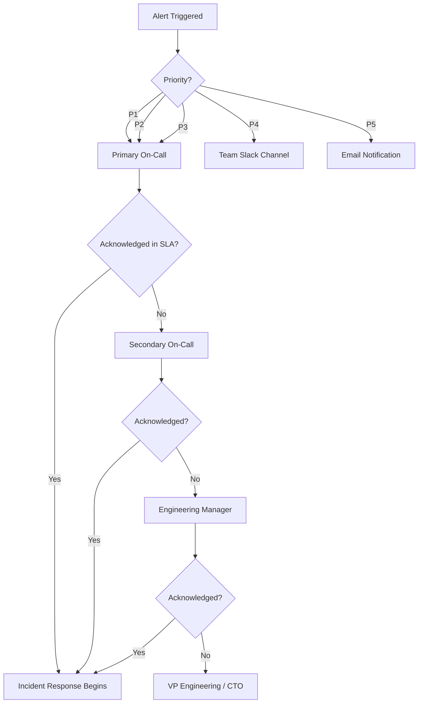
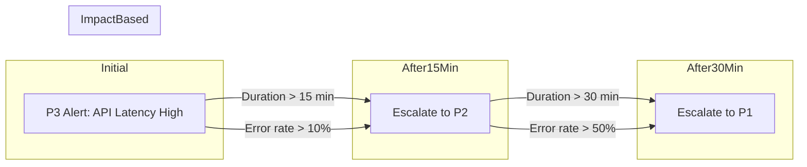
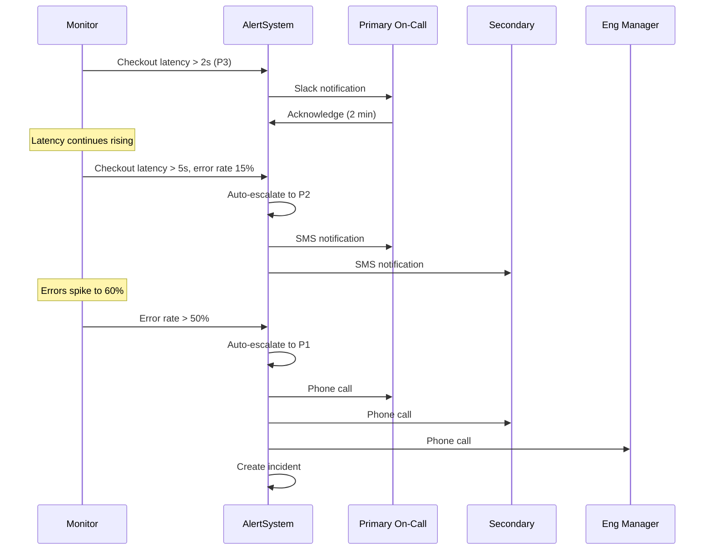

# How to Implement Alert Priority Levels

Author: [nawazdhandala](https://github.com/nawazdhandala)

Tags: Alerting, Priority, Incident Management, SRE

Description: A practical guide to defining alert priority levels with response time SLAs, escalation rules, and routing strategies.

---

Not all alerts are created equal. A database running low on disk space at 3% utilization is not the same as your payment gateway going offline during peak hours. Yet many teams treat them identically, leading to alert fatigue and missed critical incidents.

This guide covers how to implement a structured alert priority system that ensures the right people respond to the right issues at the right time.

---

## Table of Contents

1. Why Alert Priority Levels Matter
2. Defining P1 Through P5 Priorities
3. Response Time SLAs by Priority
4. Escalation Rules and Routing
5. Priority Escalation Flow
6. Implementing Priority-Based Routing
7. Examples in Practice
8. Common Mistakes to Avoid

---

## 1. Why Alert Priority Levels Matter

Without clear priority definitions, on-call engineers face a constant stream of alerts with no way to know which ones need immediate attention. This creates two problems:

**Alert fatigue:** When everything is urgent, nothing is urgent. Engineers start ignoring alerts, and real incidents slip through.

**Inconsistent response:** Different engineers interpret severity differently. One person might wake up the entire team for a slow API response while another ignores a database failover.

A well-defined priority system solves both problems by creating shared understanding across the team about what constitutes a P1 versus a P3.

---

## 2. Defining P1 Through P5 Priorities

Here is a practical framework for five priority levels. Adapt the specific criteria to match your business context.

### P1: Critical

**Definition:** Complete service outage affecting all users, or security breach in progress.

**Examples:**
- Production database is unreachable
- Payment processing is failing for all transactions
- Active security incident with data exfiltration
- Core API returning 5xx errors for 100% of requests
- DNS resolution failure for primary domain

**Business Impact:** Revenue loss is occurring every minute. Customer trust is at immediate risk.

### P2: High

**Definition:** Major functionality degraded affecting a significant portion of users.

**Examples:**
- One of three payment providers is down (66% of payments working)
- Search functionality is broken but browse still works
- Mobile app is crashing for users on specific OS version
- Authentication service is slow (30+ second response times)
- Partial data loss detected in non-critical tables

**Business Impact:** Some users cannot complete key workflows. Revenue impact is measurable but not catastrophic.

### P3: Medium

**Definition:** Non-critical functionality impaired, or degraded performance not blocking users.

**Examples:**
- Email notifications are delayed by 15 minutes
- Dashboard charts are loading slowly
- Export functionality is failing
- Log ingestion is backed up but not dropping data
- One monitoring probe is failing out of five

**Business Impact:** User experience is degraded but core functionality works. No immediate revenue impact.

### P4: Low

**Definition:** Minor issues with workarounds available, or early warning of potential problems.

**Examples:**
- Disk usage at 70% with current growth rate problematic in 2 weeks
- SSL certificate expires in 14 days
- Background job queue is growing but not at critical levels
- Memory usage trending upward over past week
- Non-production environment has connectivity issues

**Business Impact:** No current user impact. Left unaddressed, these could become higher priority.

### P5: Informational

**Definition:** Notices and non-urgent items for awareness during business hours.

**Examples:**
- Successful deployment completed
- Scheduled maintenance window starting
- Monthly capacity report generated
- Security scan completed with no findings
- Backup verification passed

**Business Impact:** None. These exist for audit trails and team awareness.

---

## 3. Response Time SLAs by Priority

Each priority level needs clear expectations for acknowledgment and resolution. Here is a sample SLA matrix:

| Priority | Acknowledge | First Response | Resolution Target | Escalation If Unacked |
|----------|-------------|----------------|-------------------|-----------------------|
| P1 | 5 minutes | Immediate | 1 hour | 10 minutes |
| P2 | 15 minutes | 30 minutes | 4 hours | 30 minutes |
| P3 | 1 hour | 2 hours | 24 hours | 2 hours |
| P4 | 4 hours | 8 hours | 1 week | Next business day |
| P5 | Next business day | N/A | N/A | None |

**Key terms:**

- **Acknowledge:** Confirm that someone is looking at the alert
- **First Response:** Initial assessment or communication to stakeholders
- **Resolution Target:** Issue is resolved or mitigated
- **Escalation If Unacked:** When to notify the next tier if no acknowledgment

These numbers are starting points. Adjust based on your SLOs and business requirements.

---

## 4. Escalation Rules and Routing

Alerts should route to different channels and people based on priority.

### Routing by Priority

| Priority | Notification Channel | Who Gets Notified | Time Restriction |
|----------|---------------------|-------------------|------------------|
| P1 | Phone call + SMS + Slack | Primary on-call, Secondary on-call, Engineering Manager | 24/7 |
| P2 | SMS + Slack | Primary on-call, Secondary on-call | 24/7 |
| P3 | Slack + Email | Primary on-call | 24/7 for ack, business hours for fix |
| P4 | Slack + Email | Team channel | Business hours only |
| P5 | Email | Team channel | Business hours only |

### Escalation Tiers



### Escalation Chain Example

For a P1 alert:

1. **T+0:** Primary on-call receives phone call
2. **T+5 min:** If no ack, secondary on-call receives phone call
3. **T+10 min:** If no ack, engineering manager receives phone call
4. **T+15 min:** If no ack, VP of Engineering receives phone call and incident is declared
5. **T+20 min:** If still no ack, CTO is notified

---

## 5. Priority Escalation Flow

Sometimes an alert starts as one priority and needs to escalate based on duration or spreading impact.



### Time-Based Escalation Rules

| Initial Priority | Escalation Trigger | New Priority |
|-----------------|-------------------|--------------|
| P3 | Unresolved after 30 minutes | P2 |
| P3 | Affects > 100 users | P2 |
| P2 | Unresolved after 1 hour | P1 |
| P2 | Affects > 1000 users | P1 |
| P2 | Revenue impact detected | P1 |

### Impact-Based Escalation

Monitor alert context to automatically escalate:

```yaml
# Example escalation rule configuration
escalation_rules:
  - name: latency_to_errors
    initial_alert: api_latency_high
    trigger:
      metric: error_rate_5xx
      threshold: 10%
      duration: 5m
    action:
      escalate_to: P2
      notify: secondary_oncall

  - name: errors_to_outage
    initial_alert: api_errors_elevated
    trigger:
      metric: error_rate_5xx
      threshold: 50%
      duration: 2m
    action:
      escalate_to: P1
      notify: incident_commander
      start_incident: true
```

---

## 6. Implementing Priority-Based Routing

Here is how to configure priority-based routing in your alerting system.

### Alert Definition with Priority

```yaml
# OneUptime alert configuration example
alerts:
  - name: database_connection_pool_exhausted
    priority: P1
    condition:
      metric: db_connection_pool_available
      operator: less_than
      threshold: 5
      duration: 1m
    notification:
      channels:
        - type: phone
          targets: [primary_oncall, secondary_oncall]
        - type: sms
          targets: [primary_oncall, secondary_oncall, eng_manager]
        - type: slack
          channel: "#incidents"
    escalation:
      unacknowledged_after: 5m
      escalate_to: secondary_oncall

  - name: disk_usage_warning
    priority: P4
    condition:
      metric: disk_usage_percent
      operator: greater_than
      threshold: 70
      duration: 10m
    notification:
      channels:
        - type: slack
          channel: "#ops-alerts"
        - type: email
          targets: [platform_team]
    schedule:
      active_hours: "09:00-18:00"
      timezone: "America/New_York"
      days: ["mon", "tue", "wed", "thu", "fri"]
```

### Routing Logic Pseudocode

```typescript
interface Alert {
  id: string;
  name: string;
  priority: 'P1' | 'P2' | 'P3' | 'P4' | 'P5';
  triggeredAt: Date;
  acknowledgedAt?: Date;
  metadata: Record<string, unknown>;
}

interface OnCallSchedule {
  primary: string;
  secondary: string;
  manager: string;
}

function routeAlert(alert: Alert, schedule: OnCallSchedule): void {
  const channels = getChannelsForPriority(alert.priority);
  const recipients = getRecipientsForPriority(alert.priority, schedule);

  for (const channel of channels) {
    for (const recipient of recipients) {
      if (shouldNotifyNow(alert.priority, channel)) {
        notify(channel, recipient, alert);
      }
    }
  }

  scheduleEscalation(alert);
}

function getChannelsForPriority(priority: string): string[] {
  const channelMap: Record<string, string[]> = {
    'P1': ['phone', 'sms', 'slack'],
    'P2': ['sms', 'slack'],
    'P3': ['slack', 'email'],
    'P4': ['slack', 'email'],
    'P5': ['email'],
  };
  return channelMap[priority] || ['email'];
}

function getRecipientsForPriority(
  priority: string,
  schedule: OnCallSchedule
): string[] {
  switch (priority) {
    case 'P1':
      return [schedule.primary, schedule.secondary, schedule.manager];
    case 'P2':
      return [schedule.primary, schedule.secondary];
    case 'P3':
    case 'P4':
      return [schedule.primary];
    case 'P5':
      return ['team-channel'];
    default:
      return [schedule.primary];
  }
}

function shouldNotifyNow(priority: string, channel: string): boolean {
  const isBusinessHours = checkBusinessHours();

  // P1 and P2 always notify
  if (priority === 'P1' || priority === 'P2') {
    return true;
  }

  // P3 notifies 24/7 for slack, business hours for email
  if (priority === 'P3') {
    return channel === 'slack' || isBusinessHours;
  }

  // P4 and P5 only during business hours
  return isBusinessHours;
}
```

---

## 7. Examples in Practice

### Example 1: E-commerce Platform

**Scenario:** Black Friday sale, checkout service latency increasing.



### Example 2: SaaS Application

**Alert priority mapping for a typical SaaS product:**

| System Component | Condition | Priority |
|-----------------|-----------|----------|
| Authentication | Login failures > 10% | P1 |
| Authentication | Login latency > 3s | P2 |
| Database | Primary DB unreachable | P1 |
| Database | Replication lag > 30s | P2 |
| Database | Connection pool > 80% | P3 |
| API Gateway | 5xx rate > 5% | P2 |
| API Gateway | 5xx rate > 0.1% | P3 |
| Background Jobs | Queue depth > 10000 | P3 |
| Background Jobs | Jobs failing > 5% | P3 |
| CDN | Cache hit rate < 80% | P4 |
| Monitoring | Probe failure (1 of 5) | P4 |
| Monitoring | Probe failure (3 of 5) | P2 |

### Example 3: On-Call Rotation Integration

```yaml
# On-call schedule with priority-based paging
schedules:
  - name: platform-oncall
    rotation: weekly
    members:
      - alice@company.com
      - bob@company.com
      - charlie@company.com

    escalation_policy:
      - level: 1
        targets: [current_primary]
        priorities: [P1, P2, P3]
        delay: 0m

      - level: 2
        targets: [current_secondary]
        priorities: [P1, P2]
        delay: 5m

      - level: 3
        targets: [eng_manager]
        priorities: [P1]
        delay: 10m

      - level: 4
        targets: [vp_engineering]
        priorities: [P1]
        delay: 15m
```

---

## 8. Common Mistakes to Avoid

### Mistake 1: Everything is P1

When teams first implement priority levels, there is temptation to mark everything as critical. This defeats the purpose.

**Solution:** Require justification for P1 and P2 alerts. Review new alerts in weekly on-call handoffs. If an alert has never fired, or fires but never requires action, downgrade it.

### Mistake 2: No Priority Review Process

Priorities get stale. What was P2 last year might be P4 today because you added redundancy.

**Solution:** Schedule quarterly reviews of alert priorities. Look at:
- Alerts that fired but required no action
- Alerts that were manually escalated
- Alerts with response times far under or over SLA

### Mistake 3: Priority Without Context

An alert that says "CPU high" with no context forces the on-call engineer to investigate before knowing if it matters.

**Solution:** Include business context in alerts:
- Which service or customer is affected
- What is the trend (getting worse, stable, improving)
- Links to relevant dashboards and runbooks

### Mistake 4: Static Priorities Only

Some conditions should change priority based on time or context. A P3 during business hours might be P2 at 2 AM when fewer people are available.

**Solution:** Implement dynamic priority rules:

```yaml
# Time-based priority adjustment
alert: api_latency_high
base_priority: P3
adjustments:
  - condition: time_of_day
    range: "22:00-06:00"
    adjust: +1  # Becomes P2 overnight
  - condition: day_of_week
    values: ["saturday", "sunday"]
    adjust: +1  # Becomes P2 on weekends
```

### Mistake 5: No Feedback Loop

If on-call engineers cannot easily report that an alert is miscategorized, bad priorities persist.

**Solution:** Add a feedback mechanism to your incident response process:
- "Was this alert appropriately prioritized?" in postmortem template
- Quick reaction buttons in Slack to flag priority issues
- Monthly report on priority accuracy

---

## Summary

Effective alert priority levels require:

| Component | Key Points |
|-----------|------------|
| Priority definitions | Clear criteria for P1 through P5 with business impact context |
| Response SLAs | Acknowledgment and resolution targets for each level |
| Escalation rules | Automatic escalation when SLAs are missed |
| Routing logic | Right channels and recipients for each priority |
| Dynamic adjustment | Time-based and impact-based priority changes |
| Review process | Regular audits to keep priorities accurate |

Start with the framework in this guide, then tune it based on your team's experience. The goal is a system where P1 alerts always deserve immediate attention and P4 alerts can safely wait until business hours.

---

**Related Reading:**

- [Designing an SRE On-Call Rotation Without Burning Out Your Team](/blog/post/2025-11-28-sre-on-call-rotation-design/)
- [Effective Incident Postmortem Templates](/blog/post/2025-09-09-effective-incident-postmortem-templates-ready-to-use-examples/)
- [SRE Best Practices](/blog/post/2025-11-28-sre-best-practices/)
