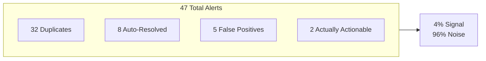
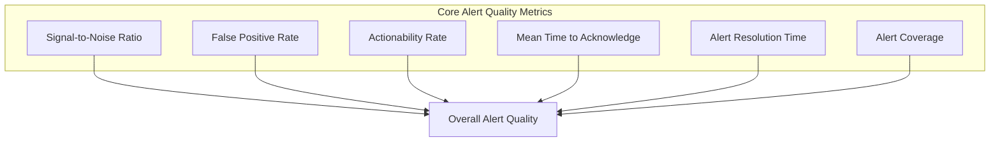
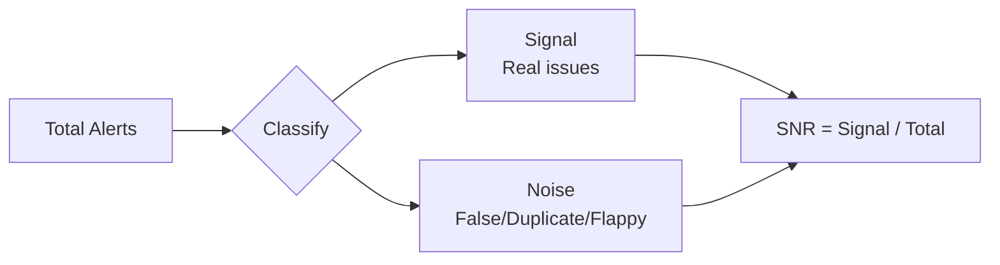
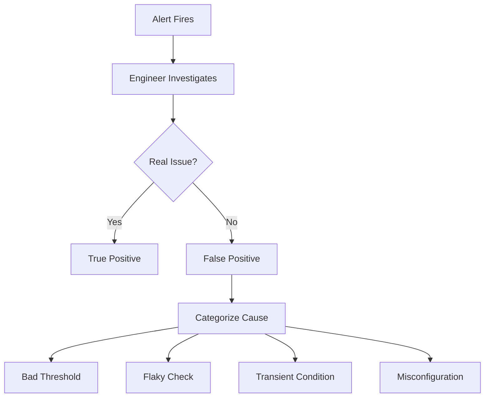
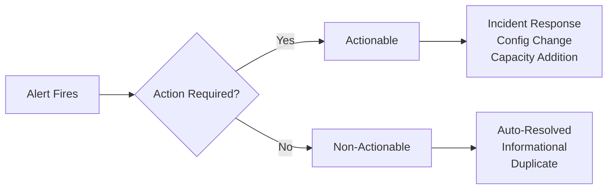
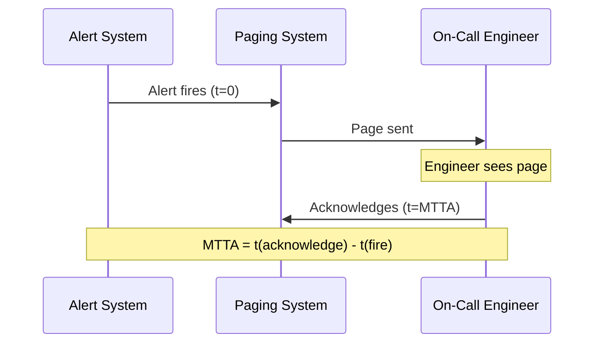
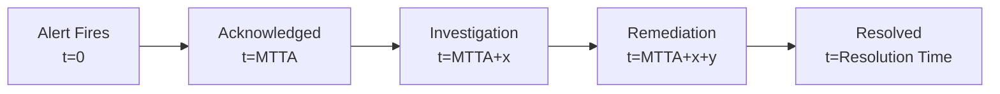
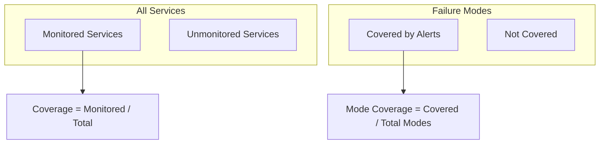
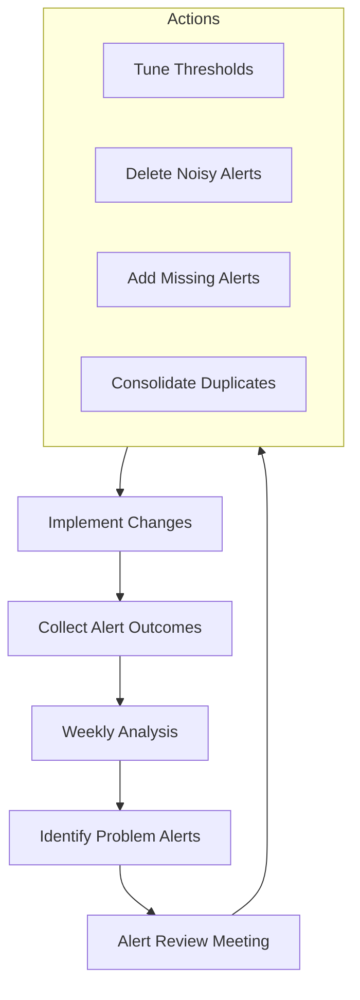

# How to Build Alert Quality Metrics

Author: [nawazdhandala](https://github.com/nawazdhandala)

Tags: Alerting, Metrics, SRE, Observability

Description: Learn how to measure and improve alert quality through actionable metrics.

---

Alerts are supposed to wake you up when something is wrong. In reality, most teams drown in noise. Pages fire for non-issues, critical problems slip through, and on-call engineers develop alert fatigue that makes them slower to respond when real incidents occur.

The solution is not more alerts or fewer alerts. It is better alerts. And you cannot improve what you do not measure. Alert quality metrics give you the data to separate signal from noise, tune thresholds, and build an alerting system that engineers trust.

This guide covers the essential metrics for measuring alert quality, practical implementations, and the feedback loops that drive continuous improvement.

---

## The Alert Quality Problem

Consider a typical on-call shift. An engineer receives 47 alerts. Of those, 32 are duplicates or related to the same underlying issue. 8 resolve themselves before anyone can investigate. 5 are false positives from flaky checks. Only 2 require actual intervention.



This is not an alerting system. It is a noise generator. The engineer learns to ignore alerts, and when a real incident occurs, response time suffers. Alert quality metrics help you identify and fix these problems systematically.

---

## Core Alert Quality Metrics

Six metrics form the foundation of alert quality measurement. Together, they reveal whether your alerts are actionable, timely, and trustworthy.



| Metric | What It Measures | Target Range |
|--------|------------------|--------------|
| Signal-to-Noise Ratio | Proportion of meaningful alerts | > 80% |
| False Positive Rate | Alerts that fire incorrectly | < 5% |
| Actionability Rate | Alerts requiring human action | > 70% |
| Mean Time to Acknowledge | Speed of initial response | < 5 minutes |
| Alert Resolution Time | End-to-end handling time | Varies by severity |
| Alert Coverage | Services with proper alerting | > 95% |

---

## Signal-to-Noise Ratio

Signal-to-noise ratio (SNR) measures the proportion of alerts that represent real issues requiring attention. A high SNR means engineers trust the alerting system; a low SNR means they ignore it.



### Calculating SNR

Track the outcome of every alert. Categorize each as signal or noise based on whether it led to meaningful investigation or action.

```typescript
// alert-quality-tracker.ts - Track alert outcomes
interface AlertOutcome {
  alertId: string;
  alertName: string;
  service: string;
  firedAt: Date;
  acknowledgedAt?: Date;
  resolvedAt?: Date;
  outcome: 'actionable' | 'false_positive' | 'duplicate' | 'auto_resolved' | 'flapping';
  notes?: string;
}

class AlertQualityTracker {
  private outcomes: AlertOutcome[] = [];

  recordOutcome(outcome: AlertOutcome): void {
    this.outcomes.push(outcome);
    this.emitMetrics(outcome);
  }

  private emitMetrics(outcome: AlertOutcome): void {
    // Emit to your metrics system
    const labels = {
      alert_name: outcome.alertName,
      service: outcome.service,
      outcome: outcome.outcome,
    };

    // Counter for total alerts by outcome
    alertOutcomeTotal.inc(labels);

    // Track acknowledgment time if applicable
    if (outcome.acknowledgedAt) {
      const ackTimeMs = outcome.acknowledgedAt.getTime() - outcome.firedAt.getTime();
      alertAckDuration.observe(labels, ackTimeMs / 1000);
    }

    // Track resolution time
    if (outcome.resolvedAt) {
      const resolutionTimeMs = outcome.resolvedAt.getTime() - outcome.firedAt.getTime();
      alertResolutionDuration.observe(labels, resolutionTimeMs / 1000);
    }
  }

  calculateSNR(timeRange: { start: Date; end: Date }): number {
    const relevant = this.outcomes.filter(
      o => o.firedAt >= timeRange.start && o.firedAt <= timeRange.end
    );

    const signal = relevant.filter(o => o.outcome === 'actionable').length;
    const total = relevant.length;

    return total > 0 ? signal / total : 1;
  }
}
```

### SNR Prometheus Metrics

```typescript
// alert-metrics.ts - Prometheus metric definitions
import { Counter, Histogram, Gauge, Registry } from 'prom-client';

const registry = new Registry();

// Total alerts by outcome type
const alertOutcomeTotal = new Counter({
  name: 'alert_outcome_total',
  help: 'Total alerts categorized by outcome',
  labelNames: ['alert_name', 'service', 'outcome'],
  registers: [registry],
});

// Acknowledgment duration histogram
const alertAckDuration = new Histogram({
  name: 'alert_acknowledgment_duration_seconds',
  help: 'Time from alert firing to acknowledgment',
  labelNames: ['alert_name', 'service', 'outcome'],
  buckets: [30, 60, 120, 300, 600, 1800, 3600],
  registers: [registry],
});

// Resolution duration histogram
const alertResolutionDuration = new Histogram({
  name: 'alert_resolution_duration_seconds',
  help: 'Time from alert firing to resolution',
  labelNames: ['alert_name', 'service', 'outcome'],
  buckets: [60, 300, 900, 1800, 3600, 7200, 14400],
  registers: [registry],
});

// Current SNR gauge
const signalToNoiseRatio = new Gauge({
  name: 'alert_signal_to_noise_ratio',
  help: 'Current signal to noise ratio for alerts',
  labelNames: ['service'],
  registers: [registry],
});
```

### SNR PromQL Queries

```promql
# Signal-to-noise ratio over the last 7 days
sum(alert_outcome_total{outcome="actionable"}) by (service)
/
sum(alert_outcome_total) by (service)

# Trend over time (weekly rolling)
sum(increase(alert_outcome_total{outcome="actionable"}[7d])) by (service)
/
sum(increase(alert_outcome_total[7d])) by (service)

# Worst performing alerts by SNR
bottomk(10,
  sum(alert_outcome_total{outcome="actionable"}) by (alert_name)
  /
  sum(alert_outcome_total) by (alert_name)
)
```

---

## False Positive Rate Tracking

False positives erode trust. When alerts fire for non-issues, engineers learn to dismiss them, which slows response to real incidents. Track false positives explicitly and investigate patterns.



### False Positive Categories

Different types of false positives require different fixes.

| Category | Description | Fix |
|----------|-------------|-----|
| Threshold | Alert fires at normal operating conditions | Adjust threshold based on baseline data |
| Flaky Check | Intermittent failures unrelated to real issues | Add retry logic or hysteresis |
| Transient | Brief spikes that self-resolve | Increase evaluation window |
| Misconfiguration | Alert logic is incorrect | Review and fix alert definition |
| Stale | Alert for deprecated service or metric | Remove the alert |

### Tracking Implementation

```typescript
// false-positive-tracker.ts - Detailed FP tracking
interface FalsePositiveReport {
  alertId: string;
  alertName: string;
  service: string;
  reportedAt: Date;
  reportedBy: string;
  category: 'threshold' | 'flaky' | 'transient' | 'misconfiguration' | 'stale';
  description: string;
  suggestedFix?: string;
}

class FalsePositiveTracker {
  private reports: FalsePositiveReport[] = [];

  reportFalsePositive(report: FalsePositiveReport): void {
    this.reports.push(report);

    // Emit metrics
    falsePositiveTotal.inc({
      alert_name: report.alertName,
      service: report.service,
      category: report.category,
    });

    // Create ticket for review if threshold exceeded
    this.checkForReviewThreshold(report.alertName);
  }

  private checkForReviewThreshold(alertName: string): void {
    const recentReports = this.reports.filter(
      r => r.alertName === alertName &&
           r.reportedAt > new Date(Date.now() - 7 * 24 * 60 * 60 * 1000)
    );

    if (recentReports.length >= 3) {
      this.createReviewTicket(alertName, recentReports);
    }
  }

  private createReviewTicket(alertName: string, reports: FalsePositiveReport[]): void {
    // Integration with your ticketing system
    console.log(`Alert ${alertName} needs review: ${reports.length} false positives in 7 days`);
  }

  getFalsePositiveRate(timeRange: { start: Date; end: Date }): Record<string, number> {
    // Calculate FP rate by alert name
    const byAlert: Record<string, { total: number; fp: number }> = {};

    // Aggregate from your alert outcome data
    // Return FP rate per alert

    return Object.fromEntries(
      Object.entries(byAlert).map(([name, data]) => [
        name,
        data.total > 0 ? data.fp / data.total : 0,
      ])
    );
  }
}

// Prometheus metric for false positives
const falsePositiveTotal = new Counter({
  name: 'alert_false_positive_total',
  help: 'Total false positive alerts by category',
  labelNames: ['alert_name', 'service', 'category'],
});
```

---

## Alert Actionability Metrics

An actionable alert requires human intervention to resolve. Non-actionable alerts, those that auto-resolve or require no action, add noise without value. Track actionability to identify alerts that should be tuned or removed.



### Actionability Score

Calculate actionability as the percentage of alerts that led to meaningful human action.

```typescript
// actionability-tracker.ts - Track alert actionability
interface ActionRecord {
  alertId: string;
  alertName: string;
  actionTaken: 'none' | 'acknowledged_only' | 'investigated' | 'remediated' | 'escalated';
  timeToAction?: number; // seconds
  actionDescription?: string;
}

function calculateActionabilityScore(records: ActionRecord[]): number {
  const actionable = records.filter(
    r => r.actionTaken === 'investigated' ||
         r.actionTaken === 'remediated' ||
         r.actionTaken === 'escalated'
  );

  return records.length > 0 ? actionable.length / records.length : 1;
}

// Identify alerts that are rarely actionable
function findLowActionabilityAlerts(
  records: ActionRecord[],
  threshold: number = 0.3
): string[] {
  const byAlert: Record<string, ActionRecord[]> = {};

  for (const record of records) {
    if (!byAlert[record.alertName]) {
      byAlert[record.alertName] = [];
    }
    byAlert[record.alertName].push(record);
  }

  return Object.entries(byAlert)
    .filter(([_, recs]) => calculateActionabilityScore(recs) < threshold)
    .map(([name, _]) => name);
}
```

### PromQL for Actionability

```promql
# Actionability rate by alert
sum(alert_outcome_total{outcome="actionable"}) by (alert_name)
/
sum(alert_outcome_total) by (alert_name)

# Alerts with actionability below 50%
(
  sum(alert_outcome_total{outcome="actionable"}) by (alert_name)
  /
  sum(alert_outcome_total) by (alert_name)
) < 0.5

# Overall actionability trend
sum(rate(alert_outcome_total{outcome="actionable"}[1d]))
/
sum(rate(alert_outcome_total[1d]))
```

---

## Mean Time to Acknowledge (MTTA)

MTTA measures how quickly engineers respond to alerts. A high MTTA indicates alert fatigue, poor routing, or insufficient on-call coverage. A low MTTA shows a healthy, responsive on-call culture.



### MTTA Implementation

```typescript
// mtta-tracker.ts - Track acknowledgment times
interface AcknowledgmentEvent {
  alertId: string;
  alertName: string;
  severity: 'critical' | 'warning' | 'info';
  firedAt: Date;
  acknowledgedAt: Date;
  acknowledgedBy: string;
}

class MTTATracker {
  recordAcknowledgment(event: AcknowledgmentEvent): void {
    const mttaSeconds = (event.acknowledgedAt.getTime() - event.firedAt.getTime()) / 1000;

    // Record to histogram
    alertMTTA.observe(
      {
        alert_name: event.alertName,
        severity: event.severity,
      },
      mttaSeconds
    );

    // Check SLA compliance
    const slaSeconds = this.getSLAForSeverity(event.severity);
    if (mttaSeconds > slaSeconds) {
      alertMTTASLABreach.inc({
        alert_name: event.alertName,
        severity: event.severity,
      });
    }
  }

  private getSLAForSeverity(severity: string): number {
    switch (severity) {
      case 'critical': return 300;  // 5 minutes
      case 'warning': return 900;   // 15 minutes
      case 'info': return 3600;     // 1 hour
      default: return 900;
    }
  }
}

// Prometheus metrics for MTTA
const alertMTTA = new Histogram({
  name: 'alert_mtta_seconds',
  help: 'Mean time to acknowledge alerts in seconds',
  labelNames: ['alert_name', 'severity'],
  buckets: [30, 60, 120, 300, 600, 900, 1800, 3600],
});

const alertMTTASLABreach = new Counter({
  name: 'alert_mtta_sla_breach_total',
  help: 'Count of alerts that breached MTTA SLA',
  labelNames: ['alert_name', 'severity'],
});
```

### MTTA PromQL Queries

```promql
# Average MTTA by severity
sum(rate(alert_mtta_seconds_sum[1d])) by (severity)
/
sum(rate(alert_mtta_seconds_count[1d])) by (severity)

# P95 MTTA
histogram_quantile(0.95,
  sum(rate(alert_mtta_seconds_bucket[1d])) by (severity, le)
)

# SLA breach rate
sum(rate(alert_mtta_sla_breach_total[7d])) by (severity)
/
sum(rate(alert_mtta_seconds_count[7d])) by (severity)

# Slowest acknowledging alerts
topk(10,
  sum(rate(alert_mtta_seconds_sum[7d])) by (alert_name)
  /
  sum(rate(alert_mtta_seconds_count[7d])) by (alert_name)
)
```

---

## Alert Resolution Time

Resolution time measures the full lifecycle of an alert, from firing to resolution. Unlike MTTA, which measures initial response, resolution time captures the total time the system was in an alerting state.



### Resolution Time by Alert Type

Different alerts have different acceptable resolution times. A critical production outage should resolve in minutes; a disk space warning might be acceptable for hours.

```typescript
// resolution-time-tracker.ts - Track alert resolution
interface ResolutionEvent {
  alertId: string;
  alertName: string;
  severity: 'critical' | 'warning' | 'info';
  firedAt: Date;
  resolvedAt: Date;
  resolutionType: 'auto' | 'manual' | 'suppressed';
}

class ResolutionTimeTracker {
  recordResolution(event: ResolutionEvent): void {
    const resolutionSeconds = (event.resolvedAt.getTime() - event.firedAt.getTime()) / 1000;

    alertResolutionTime.observe(
      {
        alert_name: event.alertName,
        severity: event.severity,
        resolution_type: event.resolutionType,
      },
      resolutionSeconds
    );

    // Track auto-resolution rate
    if (event.resolutionType === 'auto') {
      alertAutoResolutionTotal.inc({
        alert_name: event.alertName,
        severity: event.severity,
      });
    }
  }
}

const alertResolutionTime = new Histogram({
  name: 'alert_resolution_time_seconds',
  help: 'Time from alert firing to resolution',
  labelNames: ['alert_name', 'severity', 'resolution_type'],
  buckets: [60, 300, 900, 1800, 3600, 7200, 14400, 28800, 86400],
});

const alertAutoResolutionTotal = new Counter({
  name: 'alert_auto_resolution_total',
  help: 'Count of alerts that resolved automatically',
  labelNames: ['alert_name', 'severity'],
});
```

### Resolution Time Analysis

```promql
# Average resolution time by severity
sum(rate(alert_resolution_time_seconds_sum[7d])) by (severity)
/
sum(rate(alert_resolution_time_seconds_count[7d])) by (severity)

# Auto-resolution rate (potential noise indicator)
sum(rate(alert_auto_resolution_total[7d])) by (alert_name)
/
sum(rate(alert_resolution_time_seconds_count[7d])) by (alert_name)

# Alerts taking longest to resolve
topk(10,
  sum(rate(alert_resolution_time_seconds_sum[7d])) by (alert_name)
  /
  sum(rate(alert_resolution_time_seconds_count[7d])) by (alert_name)
)
```

---

## Alert Coverage Metrics

Coverage metrics ensure you have alerting for all critical services and failure modes. Gaps in coverage mean incidents go undetected until users report them.



### Coverage Tracking Implementation

```typescript
// coverage-tracker.ts - Track alert coverage
interface ServiceCoverage {
  serviceName: string;
  hasAvailabilityAlert: boolean;
  hasLatencyAlert: boolean;
  hasErrorRateAlert: boolean;
  hasSaturationAlert: boolean;
  lastReviewed: Date;
}

class CoverageTracker {
  private services: Map<string, ServiceCoverage> = new Map();

  updateServiceCoverage(coverage: ServiceCoverage): void {
    this.services.set(coverage.serviceName, coverage);
    this.emitCoverageMetrics();
  }

  private emitCoverageMetrics(): void {
    let totalServices = 0;
    let fullyMonitored = 0;
    let hasAvailability = 0;
    let hasLatency = 0;
    let hasErrorRate = 0;
    let hasSaturation = 0;

    for (const service of this.services.values()) {
      totalServices++;
      if (service.hasAvailabilityAlert) hasAvailability++;
      if (service.hasLatencyAlert) hasLatency++;
      if (service.hasErrorRateAlert) hasErrorRate++;
      if (service.hasSaturationAlert) hasSaturation++;
      if (
        service.hasAvailabilityAlert &&
        service.hasLatencyAlert &&
        service.hasErrorRateAlert &&
        service.hasSaturationAlert
      ) {
        fullyMonitored++;
      }
    }

    // Update gauges
    alertCoverageTotal.set({ coverage_type: 'full' }, fullyMonitored / totalServices);
    alertCoverageTotal.set({ coverage_type: 'availability' }, hasAvailability / totalServices);
    alertCoverageTotal.set({ coverage_type: 'latency' }, hasLatency / totalServices);
    alertCoverageTotal.set({ coverage_type: 'error_rate' }, hasErrorRate / totalServices);
    alertCoverageTotal.set({ coverage_type: 'saturation' }, hasSaturation / totalServices);
  }

  findCoverageGaps(): string[] {
    const gaps: string[] = [];

    for (const [name, coverage] of this.services.entries()) {
      const missing: string[] = [];
      if (!coverage.hasAvailabilityAlert) missing.push('availability');
      if (!coverage.hasLatencyAlert) missing.push('latency');
      if (!coverage.hasErrorRateAlert) missing.push('error_rate');
      if (!coverage.hasSaturationAlert) missing.push('saturation');

      if (missing.length > 0) {
        gaps.push(`${name}: missing ${missing.join(', ')}`);
      }
    }

    return gaps;
  }
}

const alertCoverageTotal = new Gauge({
  name: 'alert_coverage_ratio',
  help: 'Ratio of services with alert coverage by type',
  labelNames: ['coverage_type'],
});
```

### Automated Coverage Scanning

```typescript
// coverage-scanner.ts - Scan Prometheus rules for coverage
import * as yaml from 'js-yaml';
import * as fs from 'fs';

interface PrometheusRule {
  alert: string;
  expr: string;
  labels?: Record<string, string>;
}

interface RuleFile {
  groups: Array<{
    name: string;
    rules: PrometheusRule[];
  }>;
}

function scanAlertCoverage(ruleFiles: string[], knownServices: string[]): Map<string, string[]> {
  const coverage: Map<string, string[]> = new Map();

  // Initialize all services with empty coverage
  for (const service of knownServices) {
    coverage.set(service, []);
  }

  for (const file of ruleFiles) {
    const content = fs.readFileSync(file, 'utf-8');
    const rules = yaml.load(content) as RuleFile;

    for (const group of rules.groups) {
      for (const rule of group.rules) {
        // Extract service from labels or expression
        const service = extractServiceFromRule(rule);
        const alertType = categorizeAlert(rule);

        if (service && coverage.has(service)) {
          const existing = coverage.get(service) || [];
          if (!existing.includes(alertType)) {
            existing.push(alertType);
            coverage.set(service, existing);
          }
        }
      }
    }
  }

  return coverage;
}

function extractServiceFromRule(rule: PrometheusRule): string | null {
  // Extract service name from rule labels or expression
  if (rule.labels?.service) {
    return rule.labels.service;
  }
  // Parse from expression if possible
  const match = rule.expr.match(/service="([^"]+)"/);
  return match ? match[1] : null;
}

function categorizeAlert(rule: PrometheusRule): string {
  const alertName = rule.alert.toLowerCase();
  const expr = rule.expr.toLowerCase();

  if (alertName.includes('down') || expr.includes('up == 0')) {
    return 'availability';
  }
  if (alertName.includes('latency') || expr.includes('duration') || expr.includes('histogram_quantile')) {
    return 'latency';
  }
  if (alertName.includes('error') || expr.includes('error') || expr.includes('5xx')) {
    return 'error_rate';
  }
  if (alertName.includes('saturation') || expr.includes('capacity') || expr.includes('usage')) {
    return 'saturation';
  }
  return 'other';
}
```

---

## Building the Feedback Loop

Metrics without action are vanity metrics. Build a feedback loop that turns alert quality data into improvements.



### Weekly Alert Review Process

```typescript
// alert-review.ts - Generate weekly alert quality report
interface WeeklyAlertReport {
  period: { start: Date; end: Date };
  totalAlerts: number;
  signalToNoiseRatio: number;
  falsePositiveRate: number;
  actionabilityRate: number;
  avgMTTA: number;
  avgResolutionTime: number;
  topNoisyAlerts: Array<{ name: string; count: number; snr: number }>;
  coverageGaps: string[];
  recommendations: string[];
}

async function generateWeeklyReport(
  tracker: AlertQualityTracker,
  fpTracker: FalsePositiveTracker,
  coverageTracker: CoverageTracker
): Promise<WeeklyAlertReport> {
  const end = new Date();
  const start = new Date(end.getTime() - 7 * 24 * 60 * 60 * 1000);
  const period = { start, end };

  const snr = tracker.calculateSNR(period);
  const fpRates = fpTracker.getFalsePositiveRate(period);
  const avgFPRate = Object.values(fpRates).reduce((a, b) => a + b, 0) / Object.keys(fpRates).length;

  // Query Prometheus for MTTA and resolution time
  const avgMTTA = await queryPrometheus(`
    sum(rate(alert_mtta_seconds_sum[7d])) / sum(rate(alert_mtta_seconds_count[7d]))
  `);

  const avgResolutionTime = await queryPrometheus(`
    sum(rate(alert_resolution_time_seconds_sum[7d])) / sum(rate(alert_resolution_time_seconds_count[7d]))
  `);

  // Find noisiest alerts
  const topNoisyAlerts = await queryPrometheus(`
    bottomk(5,
      sum(alert_outcome_total{outcome="actionable"}) by (alert_name)
      / sum(alert_outcome_total) by (alert_name)
    )
  `);

  const coverageGaps = coverageTracker.findCoverageGaps();

  // Generate recommendations
  const recommendations = generateRecommendations(snr, avgFPRate, topNoisyAlerts, coverageGaps);

  return {
    period,
    totalAlerts: 0, // Query from metrics
    signalToNoiseRatio: snr,
    falsePositiveRate: avgFPRate,
    actionabilityRate: snr, // Simplified
    avgMTTA,
    avgResolutionTime,
    topNoisyAlerts,
    coverageGaps,
    recommendations,
  };
}

function generateRecommendations(
  snr: number,
  fpRate: number,
  noisyAlerts: Array<{ name: string; snr: number }>,
  gaps: string[]
): string[] {
  const recommendations: string[] = [];

  if (snr < 0.7) {
    recommendations.push('SNR is below 70%. Review and tune the top 5 noisiest alerts.');
  }

  if (fpRate > 0.1) {
    recommendations.push('False positive rate exceeds 10%. Investigate threshold settings.');
  }

  for (const alert of noisyAlerts) {
    if (alert.snr < 0.3) {
      recommendations.push(`Consider removing or significantly tuning ${alert.name} (SNR: ${(alert.snr * 100).toFixed(1)}%)`);
    }
  }

  if (gaps.length > 0) {
    recommendations.push(`Address coverage gaps: ${gaps.slice(0, 3).join('; ')}`);
  }

  return recommendations;
}

async function queryPrometheus(query: string): Promise<number> {
  // Implementation depends on your Prometheus client
  return 0;
}
```

---

## Dashboard Design

A well-designed dashboard makes alert quality visible to the entire team.

```typescript
// dashboard-config.ts - Grafana dashboard definition
const alertQualityDashboard = {
  title: 'Alert Quality Metrics',
  panels: [
    {
      title: 'Signal-to-Noise Ratio (7d)',
      type: 'stat',
      targets: [{
        expr: `
          sum(increase(alert_outcome_total{outcome="actionable"}[7d]))
          / sum(increase(alert_outcome_total[7d]))
        `,
      }],
      thresholds: [
        { value: 0.5, color: 'red' },
        { value: 0.7, color: 'yellow' },
        { value: 0.8, color: 'green' },
      ],
    },
    {
      title: 'False Positive Rate (7d)',
      type: 'stat',
      targets: [{
        expr: `
          sum(increase(alert_outcome_total{outcome="false_positive"}[7d]))
          / sum(increase(alert_outcome_total[7d]))
        `,
      }],
      thresholds: [
        { value: 0.1, color: 'green' },
        { value: 0.2, color: 'yellow' },
        { value: 0.3, color: 'red' },
      ],
    },
    {
      title: 'MTTA by Severity',
      type: 'timeseries',
      targets: [{
        expr: `
          sum(rate(alert_mtta_seconds_sum[1h])) by (severity)
          / sum(rate(alert_mtta_seconds_count[1h])) by (severity)
        `,
        legendFormat: '{{severity}}',
      }],
    },
    {
      title: 'Top 10 Noisiest Alerts',
      type: 'table',
      targets: [{
        expr: `
          bottomk(10,
            sum(alert_outcome_total{outcome="actionable"}) by (alert_name)
            / sum(alert_outcome_total) by (alert_name)
          )
        `,
      }],
    },
    {
      title: 'Alert Coverage by Type',
      type: 'gauge',
      targets: [{
        expr: 'alert_coverage_ratio',
        legendFormat: '{{coverage_type}}',
      }],
    },
    {
      title: 'Alert Volume Trend',
      type: 'timeseries',
      targets: [{
        expr: 'sum(increase(alert_outcome_total[1d])) by (outcome)',
        legendFormat: '{{outcome}}',
      }],
    },
  ],
};
```

---

## Alerting on Alert Quality

Use alerts to catch degradation in alert quality before it becomes critical.

```yaml
# alert-quality-rules.yaml - Meta-alerts for alert quality
groups:
  - name: alert_quality
    interval: 1h
    rules:
      - alert: LowSignalToNoiseRatio
        expr: |
          (
            sum(increase(alert_outcome_total{outcome="actionable"}[7d]))
            / sum(increase(alert_outcome_total[7d]))
          ) < 0.6
        for: 1d
        labels:
          severity: warning
        annotations:
          summary: "Alert signal-to-noise ratio is below 60%"
          description: "Only {{ $value | humanizePercentage }} of alerts are actionable. Review noisy alerts."

      - alert: HighFalsePositiveRate
        expr: |
          (
            sum(increase(alert_outcome_total{outcome="false_positive"}[7d]))
            / sum(increase(alert_outcome_total[7d]))
          ) > 0.15
        for: 1d
        labels:
          severity: warning
        annotations:
          summary: "Alert false positive rate exceeds 15%"
          description: "{{ $value | humanizePercentage }} of alerts are false positives. Tune thresholds."

      - alert: SlowMTTA
        expr: |
          (
            sum(rate(alert_mtta_seconds_sum{severity="critical"}[1d]))
            / sum(rate(alert_mtta_seconds_count{severity="critical"}[1d]))
          ) > 600
        for: 1h
        labels:
          severity: warning
        annotations:
          summary: "Critical alert MTTA exceeds 10 minutes"
          description: "Average acknowledgment time for critical alerts is {{ $value | humanizeDuration }}."

      - alert: AlertCoverageGap
        expr: alert_coverage_ratio{coverage_type="full"} < 0.8
        for: 1d
        labels:
          severity: info
        annotations:
          summary: "Alert coverage is below 80%"
          description: "{{ $value | humanizePercentage }} of services have complete alert coverage."
```

---

## Key Takeaways

Alert quality is not a nice-to-have. It directly impacts incident response time, on-call health, and system reliability.

- **Measure everything**: Track SNR, false positive rate, actionability, MTTA, resolution time, and coverage
- **Build feedback loops**: Weekly reviews turn data into action
- **Automate tracking**: Instrument your alerting pipeline to collect outcome data automatically
- **Alert on quality**: Use meta-alerts to catch degradation before it becomes critical
- **Start simple**: Begin with SNR and false positive rate, then expand

The goal is an alerting system where every page represents a real issue that requires human attention. When engineers trust alerts, they respond faster. When they respond faster, incidents resolve sooner. When incidents resolve sooner, users are happier.

Good alerts are not about catching every possible failure. They are about catching the failures that matter, when they matter, without crying wolf.

---

**Related Reading:**

- [SRE Metrics Worth Tracking](https://oneuptime.com/blog/post/2025-11-28-sre-metrics-to-track/view)
- [The Five Stages of SRE Maturity](https://oneuptime.com/blog/post/2025-09-01-the-five-stages-of-sre-maturity/view)
- [How to Reduce Noise in OpenTelemetry](https://oneuptime.com/blog/post/2025-08-25-how-to-reduce-noise-in-opentelemetry/view)
