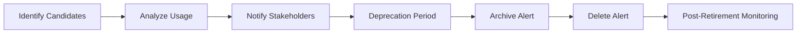
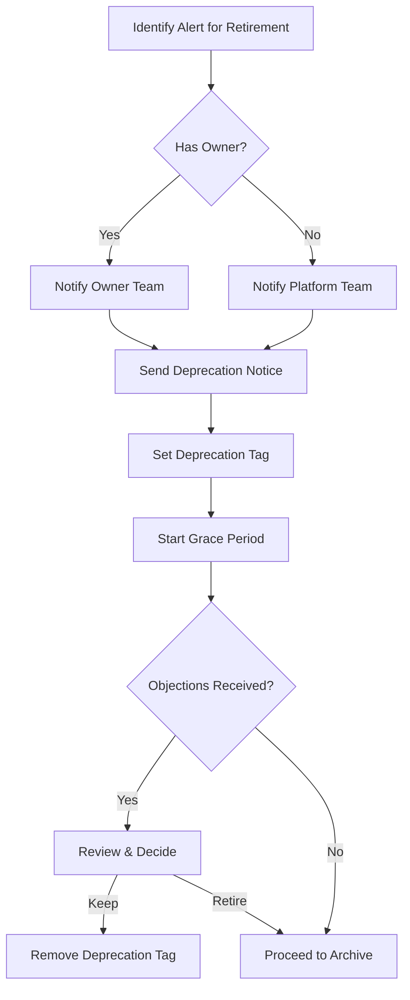
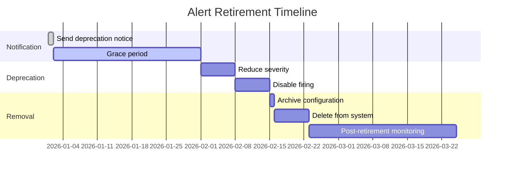
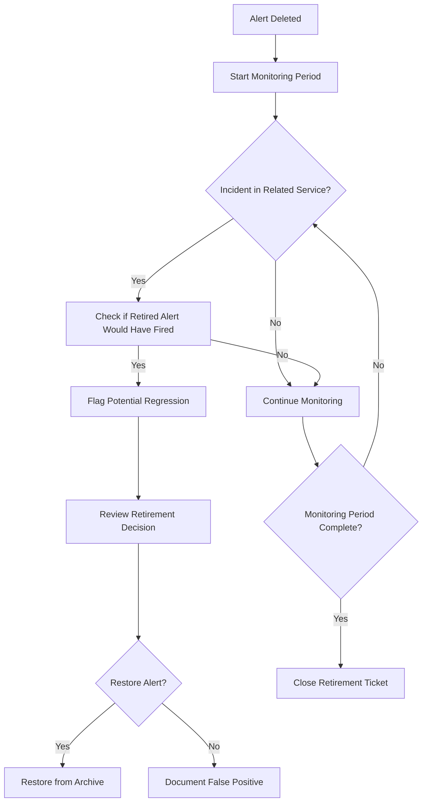
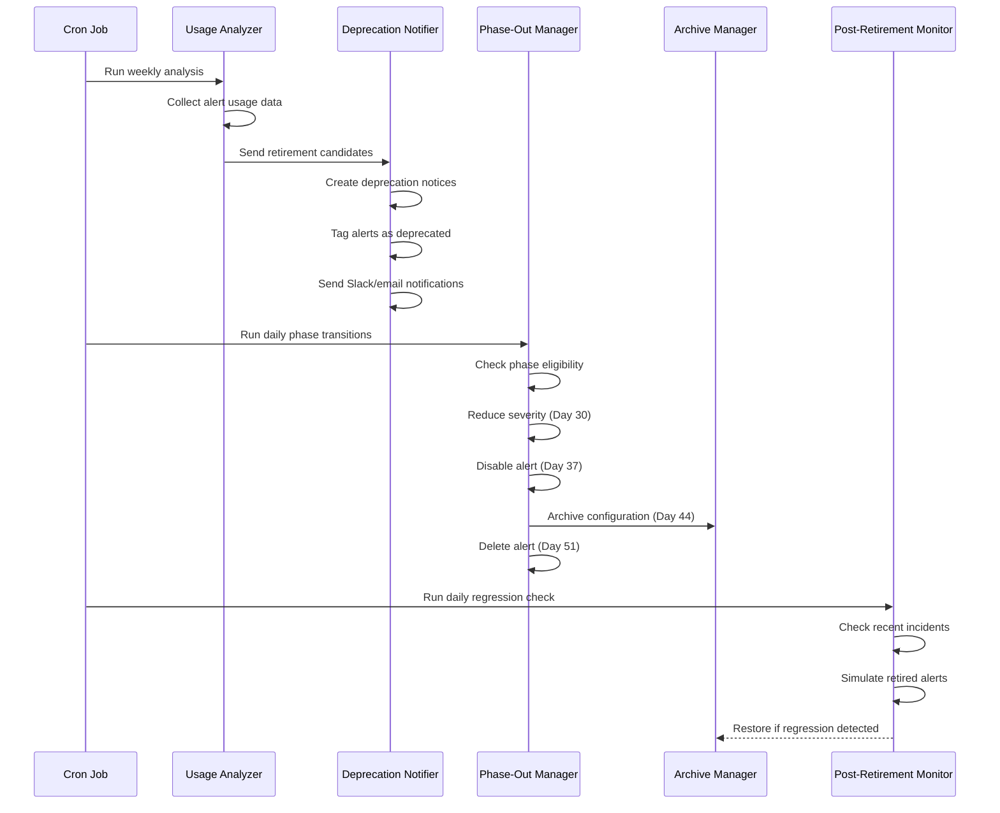

# How to Implement Alert Retirement

Author: [nawazdhandala](https://github.com/nawazdhandala)

Tags: Alerting, SRE, Maintenance, Best Practices

Description: Learn how to safely retire alerts that are no longer needed or effective.

---

Alert fatigue is real. Over time, alerting systems accumulate rules that no longer serve their purpose - the service was deprecated, the threshold became irrelevant, or the alert simply never fired. These zombie alerts create noise, consume resources, and erode trust in your monitoring system.

This guide walks you through a systematic approach to alert retirement - from identifying candidates to safely removing them while maintaining audit trails and preventing regressions.

---

## Why Alert Retirement Matters

| Problem | Impact |
|---------|--------|
| Alert sprawl | Slower query times, higher costs |
| Stale thresholds | False positives or missed incidents |
| Orphaned alerts | No owner to respond or tune |
| Configuration drift | Alerts diverge from actual system behavior |
| On-call fatigue | Engineers ignore alerts, miss real issues |

A healthy alerting system requires regular pruning. Think of it like gardening: you can not just plant and walk away.

---

## The Alert Retirement Lifecycle



Each phase has specific gates and criteria. Rushing through them risks removing alerts that still provide value.

---

## Step 1: Retirement Criteria Definition

Before retiring any alert, establish clear criteria. Not every quiet alert is useless, and not every noisy alert is valuable.

### Candidate Identification Criteria

```yaml
# alert-retirement-criteria.yaml
retirement_candidates:
  # Time-based criteria
  never_fired:
    threshold_days: 180
    action: review_for_retirement

  # Engagement criteria
  always_ignored:
    ack_rate_below: 10  # percentage
    evaluation_period_days: 90
    action: review_for_retirement

  # Ownership criteria
  orphaned:
    owner_team_exists: false
    action: immediate_review

  # System criteria
  target_deprecated:
    service_status: ["deprecated", "decommissioned"]
    action: schedule_retirement

  # Quality criteria
  high_noise:
    false_positive_rate_above: 80  # percentage
    evaluation_period_days: 30
    action: tune_or_retire

exceptions:
  # Alerts that should never be auto-retired
  - category: compliance
  - category: security
  - tag: critical-slo
```

### Decision Matrix

| Criterion | Threshold | Action |
|-----------|-----------|--------|
| Never fired | > 180 days | Review for retirement |
| Low ack rate | < 10% | Tune or retire |
| No owner | Team dissolved | Immediate review |
| Target deprecated | Service gone | Schedule retirement |
| High false positive | > 80% | Tune first, then retire |

---

## Step 2: Alert Usage Analysis

Before retiring, gather data. You need evidence, not assumptions.

### Alert Metadata Collection Script

```python
#!/usr/bin/env python3
"""
alert_usage_analyzer.py
Collects alert firing history, acknowledgement rates, and ownership data.
"""

import json
from datetime import datetime, timedelta
from dataclasses import dataclass, asdict
from typing import Optional
import requests

@dataclass
class AlertUsageReport:
    alert_id: str
    alert_name: str
    owner_team: Optional[str]
    created_date: datetime
    last_fired: Optional[datetime]
    fire_count_90d: int
    ack_count_90d: int
    ack_rate: float
    avg_resolution_time_minutes: float
    target_service: str
    target_service_status: str
    recommendation: str

class AlertUsageAnalyzer:
    def __init__(self, monitoring_api_url: str, api_token: str):
        self.api_url = monitoring_api_url
        self.headers = {"Authorization": f"Bearer {api_token}"}

    def get_all_alerts(self) -> list[dict]:
        """Fetch all configured alerts from the monitoring system."""
        response = requests.get(
            f"{self.api_url}/alerts",
            headers=self.headers
        )
        response.raise_for_status()
        return response.json()["alerts"]

    def get_alert_history(self, alert_id: str, days: int = 90) -> dict:
        """Get firing history for a specific alert."""
        since = (datetime.utcnow() - timedelta(days=days)).isoformat()
        response = requests.get(
            f"{self.api_url}/alerts/{alert_id}/history",
            headers=self.headers,
            params={"since": since}
        )
        response.raise_for_status()
        return response.json()

    def get_service_status(self, service_name: str) -> str:
        """Check if the target service is still active."""
        response = requests.get(
            f"{self.api_url}/services/{service_name}",
            headers=self.headers
        )
        if response.status_code == 404:
            return "not_found"
        return response.json().get("status", "unknown")

    def analyze_alert(self, alert: dict) -> AlertUsageReport:
        """Analyze a single alert and generate a usage report."""
        alert_id = alert["id"]
        history = self.get_alert_history(alert_id)

        fires = history.get("fires", [])
        acks = [f for f in fires if f.get("acknowledged")]

        fire_count = len(fires)
        ack_count = len(acks)
        ack_rate = (ack_count / fire_count * 100) if fire_count > 0 else 0

        # Calculate average resolution time
        resolution_times = [
            f["resolved_at"] - f["fired_at"]
            for f in fires
            if f.get("resolved_at")
        ]
        avg_resolution = (
            sum(resolution_times) / len(resolution_times) / 60
            if resolution_times else 0
        )

        # Determine recommendation
        recommendation = self._determine_recommendation(
            fire_count=fire_count,
            ack_rate=ack_rate,
            owner_team=alert.get("owner_team"),
            last_fired=fires[-1]["fired_at"] if fires else None,
            service_status=self.get_service_status(alert["target_service"])
        )

        return AlertUsageReport(
            alert_id=alert_id,
            alert_name=alert["name"],
            owner_team=alert.get("owner_team"),
            created_date=datetime.fromisoformat(alert["created_at"]),
            last_fired=datetime.fromisoformat(fires[-1]["fired_at"]) if fires else None,
            fire_count_90d=fire_count,
            ack_count_90d=ack_count,
            ack_rate=round(ack_rate, 1),
            avg_resolution_time_minutes=round(avg_resolution, 1),
            target_service=alert["target_service"],
            target_service_status=self.get_service_status(alert["target_service"]),
            recommendation=recommendation
        )

    def _determine_recommendation(
        self,
        fire_count: int,
        ack_rate: float,
        owner_team: Optional[str],
        last_fired: Optional[str],
        service_status: str
    ) -> str:
        """Determine retirement recommendation based on criteria."""

        # Service no longer exists
        if service_status in ["deprecated", "decommissioned", "not_found"]:
            return "RETIRE: Target service no longer active"

        # No owner
        if not owner_team:
            return "REVIEW: No owner assigned"

        # Never fired in 90 days
        if fire_count == 0:
            return "REVIEW: No fires in 90 days"

        # Low acknowledgement rate
        if ack_rate < 10:
            return "REVIEW: Low ack rate suggests alert fatigue"

        # High noise (fires often, rarely acknowledged)
        if fire_count > 100 and ack_rate < 30:
            return "TUNE_OR_RETIRE: High noise, low engagement"

        return "KEEP: Alert appears healthy"

    def generate_full_report(self) -> list[AlertUsageReport]:
        """Generate usage reports for all alerts."""
        alerts = self.get_all_alerts()
        reports = []

        for alert in alerts:
            try:
                report = self.analyze_alert(alert)
                reports.append(report)
            except Exception as e:
                print(f"Error analyzing alert {alert['id']}: {e}")

        return reports

    def export_candidates(self, reports: list[AlertUsageReport]) -> list[dict]:
        """Export alerts recommended for retirement review."""
        candidates = [
            asdict(r) for r in reports
            if r.recommendation.startswith(("RETIRE", "REVIEW", "TUNE_OR_RETIRE"))
        ]
        return candidates


if __name__ == "__main__":
    import os

    analyzer = AlertUsageAnalyzer(
        monitoring_api_url=os.environ["MONITORING_API_URL"],
        api_token=os.environ["MONITORING_API_TOKEN"]
    )

    reports = analyzer.generate_full_report()
    candidates = analyzer.export_candidates(reports)

    print(f"Total alerts analyzed: {len(reports)}")
    print(f"Retirement candidates: {len(candidates)}")

    # Output to JSON for review
    with open("retirement_candidates.json", "w") as f:
        json.dump(candidates, f, indent=2, default=str)

    print("Candidates exported to retirement_candidates.json")
```

### Usage Metrics Dashboard Query

```sql
-- Alert retirement candidate query
-- Run against your monitoring system's metrics database

WITH alert_stats AS (
    SELECT
        alert_id,
        alert_name,
        owner_team,
        target_service,
        COUNT(*) as fire_count,
        COUNT(CASE WHEN acknowledged = true THEN 1 END) as ack_count,
        MAX(fired_at) as last_fired,
        AVG(EXTRACT(EPOCH FROM (resolved_at - fired_at))/60) as avg_resolution_mins
    FROM alert_events
    WHERE fired_at > NOW() - INTERVAL '90 days'
    GROUP BY alert_id, alert_name, owner_team, target_service
),
all_alerts AS (
    SELECT
        a.id as alert_id,
        a.name as alert_name,
        a.owner_team,
        a.target_service,
        a.created_at,
        s.status as service_status
    FROM alerts a
    LEFT JOIN services s ON a.target_service = s.name
)

SELECT
    aa.alert_id,
    aa.alert_name,
    aa.owner_team,
    aa.target_service,
    aa.service_status,
    aa.created_at,
    COALESCE(ast.fire_count, 0) as fire_count_90d,
    COALESCE(ast.ack_count, 0) as ack_count_90d,
    CASE
        WHEN COALESCE(ast.fire_count, 0) > 0
        THEN ROUND(ast.ack_count::numeric / ast.fire_count * 100, 1)
        ELSE 0
    END as ack_rate_pct,
    ast.last_fired,
    ROUND(COALESCE(ast.avg_resolution_mins, 0)::numeric, 1) as avg_resolution_mins,
    CASE
        WHEN aa.service_status IN ('deprecated', 'decommissioned') THEN 'RETIRE'
        WHEN aa.owner_team IS NULL THEN 'REVIEW_ORPHANED'
        WHEN COALESCE(ast.fire_count, 0) = 0 THEN 'REVIEW_NEVER_FIRED'
        WHEN ast.ack_count::numeric / NULLIF(ast.fire_count, 0) < 0.1 THEN 'REVIEW_LOW_ACK'
        ELSE 'KEEP'
    END as recommendation
FROM all_alerts aa
LEFT JOIN alert_stats ast ON aa.alert_id = ast.alert_id
ORDER BY
    CASE
        WHEN aa.service_status IN ('deprecated', 'decommissioned') THEN 1
        WHEN aa.owner_team IS NULL THEN 2
        WHEN COALESCE(ast.fire_count, 0) = 0 THEN 3
        ELSE 4
    END,
    aa.alert_name;
```

---

## Step 3: Deprecation Notification

Never surprise stakeholders. Before retiring alerts, notify everyone who might care.

### Notification Flow



### Automated Notification System

```python
#!/usr/bin/env python3
"""
alert_deprecation_notifier.py
Sends deprecation notices and manages the notification workflow.
"""

from dataclasses import dataclass
from datetime import datetime, timedelta
from typing import Optional
import requests
import json

@dataclass
class DeprecationNotice:
    alert_id: str
    alert_name: str
    reason: str
    grace_period_days: int
    retirement_date: datetime
    owner_team: Optional[str]
    escalation_contacts: list[str]

class AlertDeprecationNotifier:
    def __init__(
        self,
        monitoring_api_url: str,
        slack_webhook_url: str,
        email_api_url: str,
        api_token: str
    ):
        self.monitoring_api = monitoring_api_url
        self.slack_webhook = slack_webhook_url
        self.email_api = email_api_url
        self.headers = {"Authorization": f"Bearer {api_token}"}

    def create_deprecation_notice(
        self,
        alert_id: str,
        reason: str,
        grace_period_days: int = 30
    ) -> DeprecationNotice:
        """Create a deprecation notice for an alert."""

        # Fetch alert details
        response = requests.get(
            f"{self.monitoring_api}/alerts/{alert_id}",
            headers=self.headers
        )
        response.raise_for_status()
        alert = response.json()

        retirement_date = datetime.utcnow() + timedelta(days=grace_period_days)

        return DeprecationNotice(
            alert_id=alert_id,
            alert_name=alert["name"],
            reason=reason,
            grace_period_days=grace_period_days,
            retirement_date=retirement_date,
            owner_team=alert.get("owner_team"),
            escalation_contacts=alert.get("escalation_contacts", [])
        )

    def tag_alert_deprecated(self, alert_id: str, retirement_date: datetime):
        """Add deprecation metadata to the alert."""
        response = requests.patch(
            f"{self.monitoring_api}/alerts/{alert_id}",
            headers=self.headers,
            json={
                "tags": {
                    "deprecated": "true",
                    "retirement_date": retirement_date.isoformat(),
                    "deprecation_notice_sent": datetime.utcnow().isoformat()
                }
            }
        )
        response.raise_for_status()

    def send_slack_notification(self, notice: DeprecationNotice):
        """Send deprecation notice to Slack."""
        message = {
            "blocks": [
                {
                    "type": "header",
                    "text": {
                        "type": "plain_text",
                        "text": "Alert Scheduled for Retirement"
                    }
                },
                {
                    "type": "section",
                    "fields": [
                        {
                            "type": "mrkdwn",
                            "text": f"*Alert:*\n{notice.alert_name}"
                        },
                        {
                            "type": "mrkdwn",
                            "text": f"*Owner:*\n{notice.owner_team or 'Unassigned'}"
                        },
                        {
                            "type": "mrkdwn",
                            "text": f"*Reason:*\n{notice.reason}"
                        },
                        {
                            "type": "mrkdwn",
                            "text": f"*Retirement Date:*\n{notice.retirement_date.strftime('%Y-%m-%d')}"
                        }
                    ]
                },
                {
                    "type": "section",
                    "text": {
                        "type": "mrkdwn",
                        "text": f"This alert will be archived in *{notice.grace_period_days} days*. "
                               f"If you believe this alert should be kept, please respond in this thread "
                               f"with your justification."
                    }
                },
                {
                    "type": "actions",
                    "elements": [
                        {
                            "type": "button",
                            "text": {"type": "plain_text", "text": "Keep Alert"},
                            "style": "primary",
                            "action_id": f"keep_alert_{notice.alert_id}"
                        },
                        {
                            "type": "button",
                            "text": {"type": "plain_text", "text": "Approve Retirement"},
                            "style": "danger",
                            "action_id": f"retire_alert_{notice.alert_id}"
                        }
                    ]
                }
            ]
        }

        requests.post(self.slack_webhook, json=message)

    def send_email_notification(self, notice: DeprecationNotice, recipients: list[str]):
        """Send deprecation notice via email."""
        email_body = f"""
        <h2>Alert Scheduled for Retirement</h2>

        <table>
            <tr><td><strong>Alert Name:</strong></td><td>{notice.alert_name}</td></tr>
            <tr><td><strong>Alert ID:</strong></td><td>{notice.alert_id}</td></tr>
            <tr><td><strong>Owner Team:</strong></td><td>{notice.owner_team or 'Unassigned'}</td></tr>
            <tr><td><strong>Reason:</strong></td><td>{notice.reason}</td></tr>
            <tr><td><strong>Grace Period:</strong></td><td>{notice.grace_period_days} days</td></tr>
            <tr><td><strong>Retirement Date:</strong></td><td>{notice.retirement_date.strftime('%Y-%m-%d')}</td></tr>
        </table>

        <p>This alert is scheduled for retirement. If you believe this alert should be kept,
        please reply to this email with your justification before the retirement date.</p>

        <p>After the retirement date, the alert will be archived and then deleted.</p>
        """

        requests.post(
            self.email_api,
            headers=self.headers,
            json={
                "to": recipients,
                "subject": f"[Alert Retirement] {notice.alert_name} scheduled for removal",
                "body_html": email_body
            }
        )

    def process_deprecation(self, alert_id: str, reason: str, grace_period_days: int = 30):
        """Full deprecation workflow for an alert."""

        # Create notice
        notice = self.create_deprecation_notice(alert_id, reason, grace_period_days)

        # Tag alert as deprecated
        self.tag_alert_deprecated(alert_id, notice.retirement_date)

        # Send notifications
        self.send_slack_notification(notice)

        if notice.escalation_contacts:
            self.send_email_notification(notice, notice.escalation_contacts)

        # Log the action
        print(f"Deprecation notice sent for alert: {notice.alert_name}")
        print(f"Retirement date: {notice.retirement_date}")

        return notice


if __name__ == "__main__":
    import os

    notifier = AlertDeprecationNotifier(
        monitoring_api_url=os.environ["MONITORING_API_URL"],
        slack_webhook_url=os.environ["SLACK_WEBHOOK_URL"],
        email_api_url=os.environ["EMAIL_API_URL"],
        api_token=os.environ["MONITORING_API_TOKEN"]
    )

    # Example: deprecate alerts from a candidates file
    with open("retirement_candidates.json") as f:
        candidates = json.load(f)

    for candidate in candidates:
        if candidate["recommendation"].startswith("RETIRE"):
            notifier.process_deprecation(
                alert_id=candidate["alert_id"],
                reason=candidate["recommendation"],
                grace_period_days=30
            )
```

---

## Step 4: Gradual Phase-Out Process

Do not hard-delete alerts immediately. Use a staged approach that allows for recovery.

### Phase-Out Timeline



### Phase-Out Implementation

```python
#!/usr/bin/env python3
"""
alert_phase_out.py
Implements gradual alert retirement with configurable stages.
"""

from enum import Enum
from datetime import datetime, timedelta
from dataclasses import dataclass
import requests
import json

class RetirementPhase(Enum):
    ACTIVE = "active"
    DEPRECATED = "deprecated"
    SEVERITY_REDUCED = "severity_reduced"
    DISABLED = "disabled"
    ARCHIVED = "archived"
    DELETED = "deleted"

@dataclass
class PhaseTransition:
    from_phase: RetirementPhase
    to_phase: RetirementPhase
    wait_days: int
    action: str

# Define the retirement state machine
RETIREMENT_TRANSITIONS = [
    PhaseTransition(
        RetirementPhase.ACTIVE,
        RetirementPhase.DEPRECATED,
        wait_days=0,
        action="tag_deprecated"
    ),
    PhaseTransition(
        RetirementPhase.DEPRECATED,
        RetirementPhase.SEVERITY_REDUCED,
        wait_days=30,
        action="reduce_severity"
    ),
    PhaseTransition(
        RetirementPhase.SEVERITY_REDUCED,
        RetirementPhase.DISABLED,
        wait_days=7,
        action="disable_alert"
    ),
    PhaseTransition(
        RetirementPhase.DISABLED,
        RetirementPhase.ARCHIVED,
        wait_days=7,
        action="archive_alert"
    ),
    PhaseTransition(
        RetirementPhase.ARCHIVED,
        RetirementPhase.DELETED,
        wait_days=7,
        action="delete_alert"
    ),
]

class AlertPhaseOutManager:
    def __init__(self, monitoring_api_url: str, api_token: str):
        self.api_url = monitoring_api_url
        self.headers = {"Authorization": f"Bearer {api_token}"}

    def get_alert_phase(self, alert_id: str) -> RetirementPhase:
        """Get the current retirement phase of an alert."""
        response = requests.get(
            f"{self.api_url}/alerts/{alert_id}",
            headers=self.headers
        )
        response.raise_for_status()
        alert = response.json()

        phase_str = alert.get("tags", {}).get("retirement_phase", "active")
        return RetirementPhase(phase_str)

    def get_phase_start_date(self, alert_id: str) -> datetime:
        """Get when the current phase started."""
        response = requests.get(
            f"{self.api_url}/alerts/{alert_id}",
            headers=self.headers
        )
        response.raise_for_status()
        alert = response.json()

        date_str = alert.get("tags", {}).get("phase_start_date")
        if date_str:
            return datetime.fromisoformat(date_str)
        return datetime.utcnow()

    def tag_deprecated(self, alert_id: str):
        """Mark alert as deprecated."""
        self._update_phase(alert_id, RetirementPhase.DEPRECATED)
        print(f"Alert {alert_id}: tagged as deprecated")

    def reduce_severity(self, alert_id: str):
        """Reduce alert severity to lowest level."""
        # First, reduce the severity
        requests.patch(
            f"{self.api_url}/alerts/{alert_id}",
            headers=self.headers,
            json={"severity": "info", "priority": "low"}
        )
        self._update_phase(alert_id, RetirementPhase.SEVERITY_REDUCED)
        print(f"Alert {alert_id}: severity reduced to info/low")

    def disable_alert(self, alert_id: str):
        """Disable the alert from firing."""
        requests.patch(
            f"{self.api_url}/alerts/{alert_id}",
            headers=self.headers,
            json={"enabled": False}
        )
        self._update_phase(alert_id, RetirementPhase.DISABLED)
        print(f"Alert {alert_id}: disabled")

    def archive_alert(self, alert_id: str):
        """Archive the alert configuration."""
        # Fetch current config
        response = requests.get(
            f"{self.api_url}/alerts/{alert_id}",
            headers=self.headers
        )
        alert_config = response.json()

        # Store in archive
        archive_record = {
            "alert_id": alert_id,
            "archived_at": datetime.utcnow().isoformat(),
            "config": alert_config,
            "retirement_reason": alert_config.get("tags", {}).get("retirement_reason", "unknown")
        }

        requests.post(
            f"{self.api_url}/alert-archive",
            headers=self.headers,
            json=archive_record
        )

        self._update_phase(alert_id, RetirementPhase.ARCHIVED)
        print(f"Alert {alert_id}: archived")

    def delete_alert(self, alert_id: str):
        """Permanently delete the alert."""
        requests.delete(
            f"{self.api_url}/alerts/{alert_id}",
            headers=self.headers
        )
        print(f"Alert {alert_id}: deleted")

    def _update_phase(self, alert_id: str, phase: RetirementPhase):
        """Update the retirement phase tag."""
        requests.patch(
            f"{self.api_url}/alerts/{alert_id}",
            headers=self.headers,
            json={
                "tags": {
                    "retirement_phase": phase.value,
                    "phase_start_date": datetime.utcnow().isoformat()
                }
            }
        )

    def process_transitions(self):
        """Process all alerts that are ready for phase transitions."""

        # Get all alerts in retirement process
        response = requests.get(
            f"{self.api_url}/alerts",
            headers=self.headers,
            params={"tag": "deprecated:true"}
        )
        alerts = response.json().get("alerts", [])

        for alert in alerts:
            alert_id = alert["id"]
            current_phase = self.get_alert_phase(alert_id)
            phase_start = self.get_phase_start_date(alert_id)

            # Find the next transition
            for transition in RETIREMENT_TRANSITIONS:
                if transition.from_phase != current_phase:
                    continue

                # Check if enough time has passed
                days_in_phase = (datetime.utcnow() - phase_start).days
                if days_in_phase >= transition.wait_days:
                    # Execute the transition
                    action_method = getattr(self, transition.action)
                    action_method(alert_id)
                    break


if __name__ == "__main__":
    import os

    manager = AlertPhaseOutManager(
        monitoring_api_url=os.environ["MONITORING_API_URL"],
        api_token=os.environ["MONITORING_API_TOKEN"]
    )

    # Run as a cron job to process transitions
    manager.process_transitions()
```

---

## Step 5: Archive Before Deletion

Never delete without archiving. You may need to restore an alert or audit the retirement decision.

### Archive Schema

```json
{
  "$schema": "http://json-schema.org/draft-07/schema#",
  "title": "AlertArchiveRecord",
  "type": "object",
  "required": ["alert_id", "archived_at", "config", "retirement_metadata"],
  "properties": {
    "alert_id": {
      "type": "string",
      "description": "Original alert identifier"
    },
    "archived_at": {
      "type": "string",
      "format": "date-time",
      "description": "When the alert was archived"
    },
    "deleted_at": {
      "type": "string",
      "format": "date-time",
      "description": "When the alert was permanently deleted"
    },
    "config": {
      "type": "object",
      "description": "Complete alert configuration at time of archive",
      "properties": {
        "name": { "type": "string" },
        "description": { "type": "string" },
        "query": { "type": "string" },
        "threshold": { "type": "object" },
        "severity": { "type": "string" },
        "owner_team": { "type": "string" },
        "runbook_url": { "type": "string" },
        "notification_channels": { "type": "array" },
        "tags": { "type": "object" }
      }
    },
    "retirement_metadata": {
      "type": "object",
      "properties": {
        "reason": { "type": "string" },
        "initiated_by": { "type": "string" },
        "approved_by": { "type": "string" },
        "deprecation_notice_date": { "type": "string", "format": "date-time" },
        "usage_stats_at_retirement": {
          "type": "object",
          "properties": {
            "fire_count_90d": { "type": "integer" },
            "ack_rate": { "type": "number" },
            "last_fired": { "type": "string", "format": "date-time" }
          }
        }
      }
    },
    "restoration_history": {
      "type": "array",
      "items": {
        "type": "object",
        "properties": {
          "restored_at": { "type": "string", "format": "date-time" },
          "restored_by": { "type": "string" },
          "reason": { "type": "string" }
        }
      }
    }
  }
}
```

### Archive Storage Implementation

```python
#!/usr/bin/env python3
"""
alert_archive.py
Manages alert archival and restoration.
"""

import json
import hashlib
from datetime import datetime
from typing import Optional
import boto3  # For S3 storage
from dataclasses import dataclass, asdict

@dataclass
class ArchiveRecord:
    alert_id: str
    archived_at: str
    config: dict
    retirement_metadata: dict
    deleted_at: Optional[str] = None
    restoration_history: list = None

    def __post_init__(self):
        if self.restoration_history is None:
            self.restoration_history = []

class AlertArchiveManager:
    def __init__(
        self,
        s3_bucket: str,
        dynamodb_table: str,
        region: str = "us-east-1"
    ):
        self.s3 = boto3.client("s3", region_name=region)
        self.dynamodb = boto3.resource("dynamodb", region_name=region)
        self.bucket = s3_bucket
        self.table = self.dynamodb.Table(dynamodb_table)

    def archive_alert(
        self,
        alert_config: dict,
        retirement_reason: str,
        initiated_by: str,
        usage_stats: dict
    ) -> ArchiveRecord:
        """Archive an alert configuration."""

        alert_id = alert_config["id"]
        archived_at = datetime.utcnow().isoformat()

        record = ArchiveRecord(
            alert_id=alert_id,
            archived_at=archived_at,
            config=alert_config,
            retirement_metadata={
                "reason": retirement_reason,
                "initiated_by": initiated_by,
                "approved_by": alert_config.get("tags", {}).get("retirement_approved_by"),
                "deprecation_notice_date": alert_config.get("tags", {}).get("deprecation_notice_sent"),
                "usage_stats_at_retirement": usage_stats
            }
        )

        # Store full config in S3 (immutable, versioned)
        s3_key = f"alerts/{alert_id}/{archived_at}.json"
        self.s3.put_object(
            Bucket=self.bucket,
            Key=s3_key,
            Body=json.dumps(asdict(record), indent=2),
            ContentType="application/json",
            Metadata={
                "alert_name": alert_config.get("name", ""),
                "retirement_reason": retirement_reason,
                "checksum": self._compute_checksum(alert_config)
            }
        )

        # Store index in DynamoDB for fast lookup
        self.table.put_item(
            Item={
                "alert_id": alert_id,
                "archived_at": archived_at,
                "s3_key": s3_key,
                "alert_name": alert_config.get("name"),
                "owner_team": alert_config.get("owner_team"),
                "retirement_reason": retirement_reason,
                "is_deleted": False
            }
        )

        return record

    def mark_deleted(self, alert_id: str):
        """Mark an archived alert as permanently deleted."""
        deleted_at = datetime.utcnow().isoformat()

        self.table.update_item(
            Key={"alert_id": alert_id},
            UpdateExpression="SET is_deleted = :d, deleted_at = :t",
            ExpressionAttributeValues={
                ":d": True,
                ":t": deleted_at
            }
        )

    def get_archive(self, alert_id: str) -> Optional[ArchiveRecord]:
        """Retrieve an archived alert configuration."""

        response = self.table.get_item(Key={"alert_id": alert_id})
        item = response.get("Item")

        if not item:
            return None

        # Fetch full config from S3
        s3_response = self.s3.get_object(
            Bucket=self.bucket,
            Key=item["s3_key"]
        )

        record_data = json.loads(s3_response["Body"].read())
        return ArchiveRecord(**record_data)

    def restore_alert(
        self,
        alert_id: str,
        monitoring_api_url: str,
        api_token: str,
        restored_by: str,
        reason: str
    ) -> dict:
        """Restore an archived alert to the monitoring system."""

        archive = self.get_archive(alert_id)
        if not archive:
            raise ValueError(f"No archive found for alert {alert_id}")

        # Restore to monitoring system
        import requests

        config = archive.config.copy()
        config.pop("id", None)  # Let system assign new ID
        config["tags"] = config.get("tags", {})
        config["tags"]["restored_from_archive"] = "true"
        config["tags"]["original_alert_id"] = alert_id
        config["tags"]["restored_at"] = datetime.utcnow().isoformat()
        config["enabled"] = True  # Re-enable the alert

        response = requests.post(
            f"{monitoring_api_url}/alerts",
            headers={"Authorization": f"Bearer {api_token}"},
            json=config
        )
        response.raise_for_status()
        new_alert = response.json()

        # Update archive with restoration history
        archive.restoration_history.append({
            "restored_at": datetime.utcnow().isoformat(),
            "restored_by": restored_by,
            "reason": reason,
            "new_alert_id": new_alert["id"]
        })

        # Update S3 record
        s3_key = f"alerts/{alert_id}/{archive.archived_at}.json"
        self.s3.put_object(
            Bucket=self.bucket,
            Key=s3_key,
            Body=json.dumps(asdict(archive), indent=2),
            ContentType="application/json"
        )

        return new_alert

    def search_archives(
        self,
        owner_team: Optional[str] = None,
        retirement_reason: Optional[str] = None,
        include_deleted: bool = False
    ) -> list[dict]:
        """Search archived alerts."""

        filter_expression = None
        expression_values = {}

        if not include_deleted:
            filter_expression = "is_deleted = :deleted"
            expression_values[":deleted"] = False

        if owner_team:
            owner_filter = "owner_team = :team"
            expression_values[":team"] = owner_team
            filter_expression = f"{filter_expression} AND {owner_filter}" if filter_expression else owner_filter

        scan_kwargs = {}
        if filter_expression:
            scan_kwargs["FilterExpression"] = filter_expression
            scan_kwargs["ExpressionAttributeValues"] = expression_values

        response = self.table.scan(**scan_kwargs)
        return response.get("Items", [])

    def _compute_checksum(self, config: dict) -> str:
        """Compute checksum for config integrity verification."""
        config_str = json.dumps(config, sort_keys=True)
        return hashlib.sha256(config_str.encode()).hexdigest()
```

---

## Step 6: Post-Retirement Monitoring

After deleting an alert, monitor for regressions. Did you remove something important?

### Regression Detection



### Post-Retirement Monitor Implementation

```python
#!/usr/bin/env python3
"""
post_retirement_monitor.py
Monitors for incidents that retired alerts might have caught.
"""

from datetime import datetime, timedelta
from dataclasses import dataclass
from typing import Optional
import requests
import json

@dataclass
class RetirementRegressionCheck:
    retired_alert_id: str
    incident_id: str
    incident_service: str
    incident_time: datetime
    would_have_fired: bool
    confidence: float
    recommendation: str

class PostRetirementMonitor:
    def __init__(
        self,
        monitoring_api_url: str,
        incident_api_url: str,
        archive_api_url: str,
        api_token: str
    ):
        self.monitoring_api = monitoring_api_url
        self.incident_api = incident_api_url
        self.archive_api = archive_api_url
        self.headers = {"Authorization": f"Bearer {api_token}"}
        self.monitoring_period_days = 30

    def get_recently_retired_alerts(self) -> list[dict]:
        """Get alerts retired within the monitoring period."""
        since = datetime.utcnow() - timedelta(days=self.monitoring_period_days)

        response = requests.get(
            f"{self.archive_api}/alerts",
            headers=self.headers,
            params={
                "deleted_after": since.isoformat(),
                "is_deleted": True
            }
        )
        response.raise_for_status()
        return response.json().get("archives", [])

    def get_recent_incidents(self, service: str, since: datetime) -> list[dict]:
        """Get incidents for a service since a given time."""
        response = requests.get(
            f"{self.incident_api}/incidents",
            headers=self.headers,
            params={
                "service": service,
                "since": since.isoformat()
            }
        )
        response.raise_for_status()
        return response.json().get("incidents", [])

    def simulate_alert_on_incident(
        self,
        alert_config: dict,
        incident: dict
    ) -> tuple[bool, float]:
        """
        Simulate whether a retired alert would have fired for an incident.
        Returns (would_have_fired, confidence_score)
        """

        # Get metrics around incident time
        incident_time = datetime.fromisoformat(incident["started_at"])
        window_start = incident_time - timedelta(minutes=10)
        window_end = incident_time + timedelta(minutes=5)

        # Query the metrics that the alert was monitoring
        response = requests.post(
            f"{self.monitoring_api}/query",
            headers=self.headers,
            json={
                "query": alert_config.get("query"),
                "start": window_start.isoformat(),
                "end": window_end.isoformat()
            }
        )

        if response.status_code != 200:
            return False, 0.0

        metrics_data = response.json()

        # Check if threshold would have been breached
        threshold = alert_config.get("threshold", {})
        threshold_value = threshold.get("value", 0)
        threshold_operator = threshold.get("operator", "gt")

        values = [point["value"] for point in metrics_data.get("datapoints", [])]

        if not values:
            return False, 0.0

        max_value = max(values)

        would_fire = False
        if threshold_operator == "gt":
            would_fire = max_value > threshold_value
        elif threshold_operator == "lt":
            would_fire = max_value < threshold_value
        elif threshold_operator == "gte":
            would_fire = max_value >= threshold_value
        elif threshold_operator == "lte":
            would_fire = max_value <= threshold_value

        # Confidence based on how clearly the threshold was breached
        if would_fire:
            breach_margin = abs(max_value - threshold_value) / threshold_value
            confidence = min(0.5 + breach_margin, 1.0)
        else:
            confidence = 0.0

        return would_fire, confidence

    def check_for_regressions(self) -> list[RetirementRegressionCheck]:
        """Check all recently retired alerts for potential regressions."""

        retired_alerts = self.get_recently_retired_alerts()
        regressions = []

        for archive in retired_alerts:
            alert_config = archive.get("config", {})
            target_service = alert_config.get("target_service")
            deleted_at = datetime.fromisoformat(archive["deleted_at"])

            # Get incidents since deletion
            incidents = self.get_recent_incidents(target_service, deleted_at)

            for incident in incidents:
                would_fire, confidence = self.simulate_alert_on_incident(
                    alert_config, incident
                )

                if would_fire:
                    recommendation = self._determine_recommendation(
                        confidence, incident
                    )

                    regressions.append(RetirementRegressionCheck(
                        retired_alert_id=archive["alert_id"],
                        incident_id=incident["id"],
                        incident_service=target_service,
                        incident_time=datetime.fromisoformat(incident["started_at"]),
                        would_have_fired=True,
                        confidence=confidence,
                        recommendation=recommendation
                    ))

        return regressions

    def _determine_recommendation(
        self,
        confidence: float,
        incident: dict
    ) -> str:
        """Determine recommendation based on regression analysis."""

        severity = incident.get("severity", "low")

        if confidence > 0.8 and severity in ["critical", "high"]:
            return "RESTORE: High confidence regression on critical incident"
        elif confidence > 0.6:
            return "REVIEW: Moderate confidence - manual review recommended"
        else:
            return "MONITOR: Low confidence - continue monitoring"

    def generate_regression_report(self) -> dict:
        """Generate a full regression report."""

        regressions = self.check_for_regressions()

        report = {
            "generated_at": datetime.utcnow().isoformat(),
            "monitoring_period_days": self.monitoring_period_days,
            "total_regressions_detected": len(regressions),
            "regressions_by_recommendation": {},
            "details": []
        }

        for regression in regressions:
            rec = regression.recommendation.split(":")[0]
            report["regressions_by_recommendation"][rec] = \
                report["regressions_by_recommendation"].get(rec, 0) + 1

            report["details"].append({
                "retired_alert_id": regression.retired_alert_id,
                "incident_id": regression.incident_id,
                "incident_service": regression.incident_service,
                "incident_time": regression.incident_time.isoformat(),
                "confidence": regression.confidence,
                "recommendation": regression.recommendation
            })

        return report


if __name__ == "__main__":
    import os

    monitor = PostRetirementMonitor(
        monitoring_api_url=os.environ["MONITORING_API_URL"],
        incident_api_url=os.environ["INCIDENT_API_URL"],
        archive_api_url=os.environ["ARCHIVE_API_URL"],
        api_token=os.environ["MONITORING_API_TOKEN"]
    )

    report = monitor.generate_regression_report()

    print(f"Regression Report - {report['generated_at']}")
    print(f"Total potential regressions: {report['total_regressions_detected']}")
    print(f"By recommendation: {report['regressions_by_recommendation']}")

    # Output full report
    with open("regression_report.json", "w") as f:
        json.dump(report, f, indent=2)
```

---

## Complete Retirement Workflow

Here is the full orchestration tying all components together.



### Orchestration Script

```python
#!/usr/bin/env python3
"""
alert_retirement_orchestrator.py
Main entry point for the alert retirement system.
"""

import os
import argparse
from datetime import datetime

# Import our modules
from alert_usage_analyzer import AlertUsageAnalyzer
from alert_deprecation_notifier import AlertDeprecationNotifier
from alert_phase_out import AlertPhaseOutManager
from alert_archive import AlertArchiveManager
from post_retirement_monitor import PostRetirementMonitor

def run_analysis():
    """Run alert usage analysis and identify candidates."""
    analyzer = AlertUsageAnalyzer(
        monitoring_api_url=os.environ["MONITORING_API_URL"],
        api_token=os.environ["MONITORING_API_TOKEN"]
    )

    reports = analyzer.generate_full_report()
    candidates = analyzer.export_candidates(reports)

    print(f"[{datetime.utcnow()}] Analysis complete")
    print(f"  Total alerts: {len(reports)}")
    print(f"  Retirement candidates: {len(candidates)}")

    return candidates

def run_notifications(candidates: list):
    """Send deprecation notifications for new candidates."""
    notifier = AlertDeprecationNotifier(
        monitoring_api_url=os.environ["MONITORING_API_URL"],
        slack_webhook_url=os.environ["SLACK_WEBHOOK_URL"],
        email_api_url=os.environ["EMAIL_API_URL"],
        api_token=os.environ["MONITORING_API_TOKEN"]
    )

    for candidate in candidates:
        if candidate["recommendation"].startswith("RETIRE"):
            notifier.process_deprecation(
                alert_id=candidate["alert_id"],
                reason=candidate["recommendation"],
                grace_period_days=30
            )

    print(f"[{datetime.utcnow()}] Notifications sent")

def run_phase_transitions():
    """Process scheduled phase transitions."""
    manager = AlertPhaseOutManager(
        monitoring_api_url=os.environ["MONITORING_API_URL"],
        api_token=os.environ["MONITORING_API_TOKEN"]
    )

    manager.process_transitions()
    print(f"[{datetime.utcnow()}] Phase transitions processed")

def run_regression_monitoring():
    """Check for potential regressions from retired alerts."""
    monitor = PostRetirementMonitor(
        monitoring_api_url=os.environ["MONITORING_API_URL"],
        incident_api_url=os.environ["INCIDENT_API_URL"],
        archive_api_url=os.environ["ARCHIVE_API_URL"],
        api_token=os.environ["MONITORING_API_TOKEN"]
    )

    report = monitor.generate_regression_report()

    print(f"[{datetime.utcnow()}] Regression monitoring complete")
    print(f"  Potential regressions: {report['total_regressions_detected']}")

    # Alert if high-confidence regressions found
    restore_count = report["regressions_by_recommendation"].get("RESTORE", 0)
    if restore_count > 0:
        print(f"  ACTION REQUIRED: {restore_count} alerts recommended for restoration")

def main():
    parser = argparse.ArgumentParser(description="Alert Retirement Orchestrator")
    parser.add_argument(
        "--mode",
        choices=["analysis", "notify", "transitions", "monitor", "full"],
        default="full",
        help="Operation mode"
    )

    args = parser.parse_args()

    if args.mode in ["analysis", "full"]:
        candidates = run_analysis()
        if args.mode == "full":
            run_notifications(candidates)

    if args.mode in ["notify"]:
        candidates = run_analysis()
        run_notifications(candidates)

    if args.mode in ["transitions", "full"]:
        run_phase_transitions()

    if args.mode in ["monitor", "full"]:
        run_regression_monitoring()

if __name__ == "__main__":
    main()
```

---

## Best Practices Summary

### Do

- Define clear retirement criteria before you start
- Use data-driven analysis, not gut feelings
- Notify stakeholders with adequate grace periods
- Archive everything before deletion
- Monitor for regressions after retirement
- Document every retirement decision
- Make restoration easy and fast

### Do Not

- Delete alerts without notification
- Skip the archival step
- Ignore post-retirement incidents
- Auto-retire compliance or security alerts
- Retire during incident response periods
- Remove alerts for services under active development

---

## Metrics to Track

| Metric | Target | Why It Matters |
|--------|--------|----------------|
| Alerts retired per quarter | 10-20% of stale alerts | Shows hygiene progress |
| Time from candidate to retirement | < 60 days | Prevents backlog |
| Regression rate | < 5% | Validates criteria accuracy |
| Restoration requests | < 10% of retirements | Indicates notification effectiveness |
| Archive retrieval time | < 5 minutes | Ensures quick recovery |

---

## Conclusion

Alert retirement is not about deleting alerts - it is about maintaining a healthy, trustworthy monitoring system. By implementing a systematic approach with clear criteria, stakeholder notifications, gradual phase-out, proper archival, and post-retirement monitoring, you protect your team from alert fatigue while ensuring critical signals are never lost.

The key is treating alert retirement as a first-class operational process, not a one-time cleanup. Schedule regular reviews, automate the workflow where possible, and always keep an escape hatch through comprehensive archival.

Start small: identify your top 10 candidates, run them through this process, and iterate. Your on-call engineers will thank you.

---

**Related Reading:**

- [The Ultimate SRE Reliability Checklist](https://oneuptime.com/blog/post/2025-09-10-sre-checklist/view)
- [How to Reduce Noise in OpenTelemetry](https://oneuptime.com/blog/post/2025-08-25-how-to-reduce-noise-in-opentelemetry/view)
- [What is Toil and How to Eliminate It](https://oneuptime.com/blog/post/2025-10-01-what-is-toil-and-how-to-eliminate-it/view)
