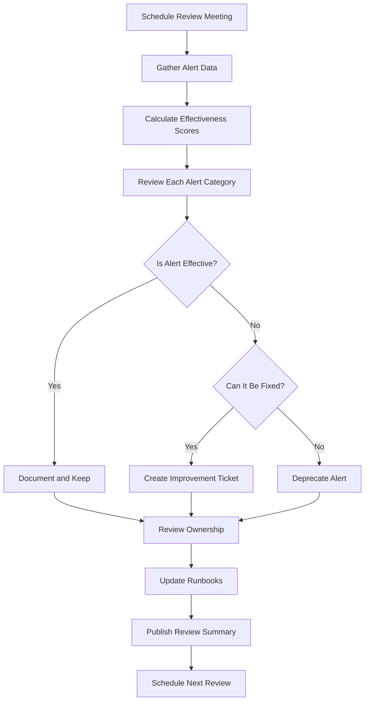
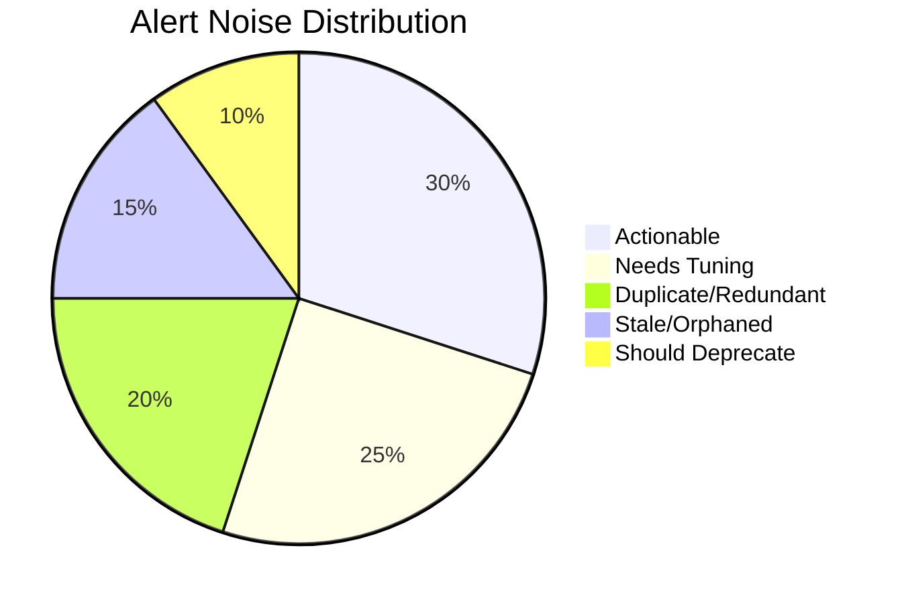
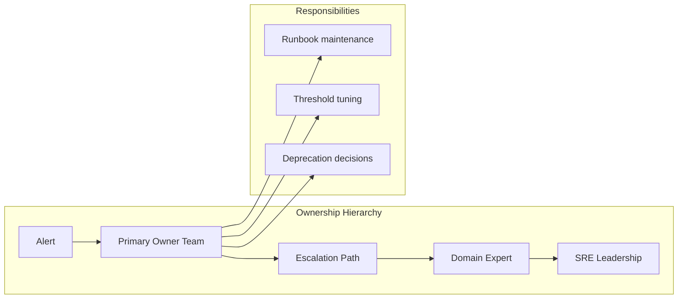
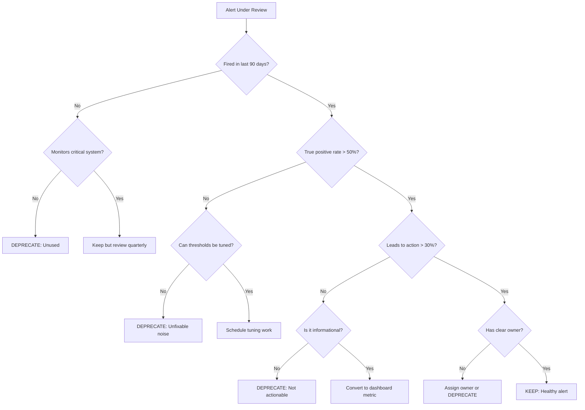

# How to Create Alert Review Process

Author: [nawazdhandala](https://github.com/nawazdhandala)

Tags: Alerting, SRE, Process, Best Practices

Description: Learn how to establish an effective alert review process for continuous improvement.

---

Alerts are the nervous system of your reliability practice. But without regular review, that nervous system degrades: noisy alerts burn out on-call engineers, silent alerts miss real incidents, and orphaned alerts clutter dashboards. An alert review process keeps your alerting sharp, actionable, and aligned with actual user impact.

## Why Alert Reviews Matter

| Without Reviews | With Reviews |
|-----------------|--------------|
| Alert fatigue builds | Signal stays high |
| Runbooks go stale | Documentation stays current |
| Ownership becomes unclear | Clear accountability |
| Noise accumulates | Noise gets eliminated |
| SLOs drift from alerts | Alerts stay SLO-aligned |

The goal is simple: every alert should lead to action. If it does not, it should be fixed or removed.

---

## Alert Review Process Flow



---

## 1. Establish Regular Alert Review Cadence

Consistency beats intensity. A monthly review rhythm works well for most teams.

### Recommended Schedule

| Team Size | Review Frequency | Duration |
|-----------|------------------|----------|
| Small (2-5) | Monthly | 30-60 min |
| Medium (6-12) | Bi-weekly | 45-90 min |
| Large (12+) | Weekly | 60 min per domain |

### Sample Review Calendar

```yaml
# alert-review-calendar.yaml
reviews:
  monthly:
    - name: "Full Alert Review"
      week: 1
      day: Wednesday
      time: "10:00 AM"
      duration: 60
      attendees:
        - on-call-engineers
        - service-owners
        - sre-lead

  weekly:
    - name: "Quick Noise Check"
      day: Monday
      time: "9:30 AM"
      duration: 15
      attendees:
        - outgoing-on-call
        - incoming-on-call
```

### Meeting Agenda Template

```markdown
## Alert Review Meeting - [Date]

### Pre-Meeting (5 min)
- [ ] Pull alert metrics from last period
- [ ] Identify top 10 noisiest alerts
- [ ] Gather on-call feedback

### Review Agenda (45 min)
1. **Metrics Overview** (10 min)
   - Total alerts fired
   - Alert-to-incident ratio
   - Top noisy alerts
   - Mean time to acknowledge

2. **Alert-by-Alert Review** (25 min)
   - Walk through flagged alerts
   - Collect team feedback
   - Make keep/fix/deprecate decisions

3. **Action Items** (10 min)
   - Assign improvement tickets
   - Update ownership records
   - Schedule follow-ups

### Post-Meeting
- [ ] Publish meeting notes
- [ ] Create tickets for improvements
- [ ] Update alert documentation
```

---

## 2. Noisy Alert Identification

Noise is the enemy of effective alerting. A noisy alert trains engineers to ignore pages.

### Noise Detection Script

```python
# noise_detector.py
from datetime import datetime, timedelta
from dataclasses import dataclass
from typing import List, Dict
import json

@dataclass
class Alert:
    name: str
    fired_at: datetime
    resolved_at: datetime
    acknowledged: bool
    incident_created: bool
    service: str

@dataclass
class NoiseReport:
    alert_name: str
    fire_count: int
    ack_rate: float
    incident_rate: float
    avg_duration_minutes: float
    noise_score: float

def calculate_noise_score(alerts: List[Alert]) -> float:
    """
    Noise score formula:
    - High fire count = more noise
    - Low acknowledgment rate = likely ignored
    - Low incident rate = not actionable
    - Short duration = flapping
    """
    if not alerts:
        return 0.0

    fire_count = len(alerts)
    ack_count = sum(1 for a in alerts if a.acknowledged)
    incident_count = sum(1 for a in alerts if a.incident_created)

    ack_rate = ack_count / fire_count if fire_count > 0 else 0
    incident_rate = incident_count / fire_count if fire_count > 0 else 0

    durations = [
        (a.resolved_at - a.fired_at).total_seconds() / 60
        for a in alerts if a.resolved_at
    ]
    avg_duration = sum(durations) / len(durations) if durations else 0

    # Noise score: higher = noisier
    # Penalize: high frequency, low ack, low incident conversion, short duration
    frequency_factor = min(fire_count / 10, 5)  # Cap at 5
    ack_penalty = (1 - ack_rate) * 3
    incident_penalty = (1 - incident_rate) * 4
    flapping_penalty = 2 if avg_duration < 5 else 0

    return frequency_factor + ack_penalty + incident_penalty + flapping_penalty

def analyze_alerts(alerts: List[Alert], period_days: int = 30) -> List[NoiseReport]:
    """Group alerts by name and calculate noise metrics."""
    grouped: Dict[str, List[Alert]] = {}

    for alert in alerts:
        if alert.name not in grouped:
            grouped[alert.name] = []
        grouped[alert.name].append(alert)

    reports = []
    for name, alert_list in grouped.items():
        fire_count = len(alert_list)
        ack_count = sum(1 for a in alert_list if a.acknowledged)
        incident_count = sum(1 for a in alert_list if a.incident_created)

        durations = [
            (a.resolved_at - a.fired_at).total_seconds() / 60
            for a in alert_list if a.resolved_at
        ]

        reports.append(NoiseReport(
            alert_name=name,
            fire_count=fire_count,
            ack_rate=ack_count / fire_count if fire_count > 0 else 0,
            incident_rate=incident_count / fire_count if fire_count > 0 else 0,
            avg_duration_minutes=sum(durations) / len(durations) if durations else 0,
            noise_score=calculate_noise_score(alert_list)
        ))

    # Sort by noise score descending
    reports.sort(key=lambda r: r.noise_score, reverse=True)
    return reports

def generate_noise_report(reports: List[NoiseReport], top_n: int = 10) -> str:
    """Generate a human-readable noise report."""
    output = ["# Alert Noise Report", ""]
    output.append(f"## Top {top_n} Noisiest Alerts\n")
    output.append("| Rank | Alert | Fires | Ack Rate | Incident Rate | Noise Score |")
    output.append("|------|-------|-------|----------|---------------|-------------|")

    for i, report in enumerate(reports[:top_n], 1):
        output.append(
            f"| {i} | {report.alert_name} | {report.fire_count} | "
            f"{report.ack_rate:.0%} | {report.incident_rate:.0%} | "
            f"{report.noise_score:.1f} |"
        )

    output.append("\n## Recommendations\n")
    for report in reports[:top_n]:
        if report.noise_score > 8:
            output.append(f"- **{report.alert_name}**: Consider deprecating or major rework")
        elif report.noise_score > 5:
            output.append(f"- **{report.alert_name}**: Needs threshold tuning")
        elif report.noise_score > 3:
            output.append(f"- **{report.alert_name}**: Review runbook and ownership")

    return "\n".join(output)

# Example usage
if __name__ == "__main__":
    # Sample data - in production, pull from your alerting platform
    sample_alerts = [
        Alert("HighCPU", datetime.now() - timedelta(hours=2),
              datetime.now() - timedelta(hours=1, minutes=55), False, False, "api"),
        Alert("HighCPU", datetime.now() - timedelta(hours=5),
              datetime.now() - timedelta(hours=4, minutes=50), False, False, "api"),
        Alert("HighCPU", datetime.now() - timedelta(hours=8),
              datetime.now() - timedelta(hours=7, minutes=45), True, False, "api"),
        Alert("ErrorRateHigh", datetime.now() - timedelta(days=1),
              datetime.now() - timedelta(hours=23), True, True, "checkout"),
        Alert("LatencyP99High", datetime.now() - timedelta(days=2),
              datetime.now() - timedelta(days=1, hours=23), True, True, "search"),
    ]

    reports = analyze_alerts(sample_alerts)
    print(generate_noise_report(reports))
```

### Noise Categories



---

## 3. Alert Effectiveness Scoring

Not all alerts are equal. Score each alert to prioritize review efforts.

### Effectiveness Score Formula

```python
# effectiveness_scorer.py
from dataclasses import dataclass
from typing import Optional
from enum import Enum

class AlertTier(Enum):
    CRITICAL = "critical"  # SLO-impacting, pages immediately
    WARNING = "warning"    # Needs attention, may page
    INFO = "info"          # Awareness only, no page

@dataclass
class AlertEffectivenessScore:
    alert_name: str
    tier: AlertTier
    scores: dict
    total_score: float
    grade: str
    recommendations: list

def calculate_effectiveness(
    alert_name: str,
    tier: AlertTier,
    fires_last_30_days: int,
    true_positives: int,
    false_positives: int,
    mean_time_to_ack_minutes: float,
    has_runbook: bool,
    runbook_last_updated_days: int,
    has_owner: bool,
    linked_to_slo: bool,
    led_to_incident: int,
    led_to_action: int
) -> AlertEffectivenessScore:
    """
    Calculate alert effectiveness on a 0-100 scale.

    Scoring weights:
    - Accuracy (true positive rate): 25 points
    - Actionability (led to action): 25 points
    - Documentation (runbook quality): 20 points
    - Ownership (clear owner): 15 points
    - SLO alignment: 15 points
    """
    scores = {}

    # Accuracy Score (25 points)
    total_fires = true_positives + false_positives
    if total_fires > 0:
        accuracy_rate = true_positives / total_fires
        scores["accuracy"] = accuracy_rate * 25
    else:
        scores["accuracy"] = 0

    # Actionability Score (25 points)
    if fires_last_30_days > 0:
        action_rate = led_to_action / fires_last_30_days
        scores["actionability"] = action_rate * 25
    else:
        scores["actionability"] = 25  # No fires = not a problem

    # Documentation Score (20 points)
    doc_score = 0
    if has_runbook:
        doc_score += 10
        if runbook_last_updated_days < 90:
            doc_score += 10
        elif runbook_last_updated_days < 180:
            doc_score += 5
    scores["documentation"] = doc_score

    # Ownership Score (15 points)
    scores["ownership"] = 15 if has_owner else 0

    # SLO Alignment Score (15 points)
    if tier == AlertTier.CRITICAL:
        scores["slo_alignment"] = 15 if linked_to_slo else 0
    else:
        scores["slo_alignment"] = 10 if linked_to_slo else 5

    total_score = sum(scores.values())

    # Determine grade
    if total_score >= 85:
        grade = "A"
    elif total_score >= 70:
        grade = "B"
    elif total_score >= 55:
        grade = "C"
    elif total_score >= 40:
        grade = "D"
    else:
        grade = "F"

    # Generate recommendations
    recommendations = []
    if scores["accuracy"] < 15:
        recommendations.append("High false positive rate - tune thresholds")
    if scores["actionability"] < 15:
        recommendations.append("Low action rate - consider if alert is needed")
    if scores["documentation"] < 10:
        recommendations.append("Missing or stale runbook - update documentation")
    if scores["ownership"] == 0:
        recommendations.append("No owner assigned - assign team ownership")
    if scores["slo_alignment"] < 10 and tier == AlertTier.CRITICAL:
        recommendations.append("Critical alert not linked to SLO - review alignment")

    return AlertEffectivenessScore(
        alert_name=alert_name,
        tier=tier,
        scores=scores,
        total_score=total_score,
        grade=grade,
        recommendations=recommendations
    )

def print_effectiveness_report(score: AlertEffectivenessScore):
    """Print a formatted effectiveness report."""
    print(f"\n{'='*50}")
    print(f"Alert: {score.alert_name}")
    print(f"Tier: {score.tier.value}")
    print(f"{'='*50}")
    print(f"\nScore Breakdown:")
    for category, points in score.scores.items():
        max_points = {"accuracy": 25, "actionability": 25, "documentation": 20,
                      "ownership": 15, "slo_alignment": 15}[category]
        bar = "=" * int(points / max_points * 20)
        print(f"  {category:15} [{bar:20}] {points:.1f}/{max_points}")

    print(f"\nTotal Score: {score.total_score:.1f}/100 (Grade: {score.grade})")

    if score.recommendations:
        print(f"\nRecommendations:")
        for rec in score.recommendations:
            print(f"  - {rec}")

# Example usage
if __name__ == "__main__":
    score = calculate_effectiveness(
        alert_name="CheckoutErrorRateHigh",
        tier=AlertTier.CRITICAL,
        fires_last_30_days=8,
        true_positives=7,
        false_positives=1,
        mean_time_to_ack_minutes=3.5,
        has_runbook=True,
        runbook_last_updated_days=45,
        has_owner=True,
        linked_to_slo=True,
        led_to_incident=5,
        led_to_action=7
    )
    print_effectiveness_report(score)
```

### Effectiveness Dashboard Metrics

Track these metrics over time to measure improvement:

```yaml
# alert-effectiveness-metrics.yaml
metrics:
  # Quality metrics
  - name: alert_true_positive_rate
    description: "Percentage of alerts that were genuine issues"
    target: ">= 90%"
    query: "true_positives / (true_positives + false_positives)"

  - name: alert_actionability_rate
    description: "Percentage of alerts that led to meaningful action"
    target: ">= 80%"
    query: "alerts_with_action / total_alerts"

  - name: alert_to_incident_ratio
    description: "How often alerts become incidents"
    target: "Context dependent"
    query: "incidents_from_alerts / total_alerts"

  # Health metrics
  - name: alerts_with_owner
    description: "Percentage of alerts with assigned ownership"
    target: "100%"

  - name: alerts_with_runbook
    description: "Percentage of alerts with linked runbook"
    target: "100%"

  - name: runbook_freshness
    description: "Percentage of runbooks updated in last 90 days"
    target: ">= 80%"

  # Volume metrics
  - name: alerts_per_on_call_shift
    description: "Average alerts per engineer per shift"
    target: "<= 5"

  - name: noise_score_trend
    description: "Week-over-week change in aggregate noise score"
    target: "Decreasing"
```

---

## 4. Team Feedback Collection

Engineers on the ground have the best insight into alert quality. Capture their feedback systematically.

### Post-Shift Survey

```yaml
# post-shift-survey.yaml
survey:
  name: "On-Call Shift Feedback"
  trigger: "End of on-call rotation"
  questions:
    - id: overall_experience
      type: rating
      scale: 1-5
      question: "How manageable was the alert volume this shift?"
      labels:
        1: "Overwhelming - constant pages"
        3: "Acceptable - some noise"
        5: "Excellent - only actionable alerts"

    - id: noisiest_alerts
      type: multi_select
      question: "Which alerts were the noisiest? (Select up to 3)"
      options: "[Dynamic list from alert catalog]"

    - id: missing_alerts
      type: text
      question: "Were there any issues that should have alerted but didn't?"

    - id: runbook_quality
      type: rating
      scale: 1-5
      question: "How helpful were the runbooks?"
      labels:
        1: "Missing or useless"
        3: "Somewhat helpful"
        5: "Clear and actionable"

    - id: improvement_suggestions
      type: text
      question: "What one change would most improve on-call experience?"

    - id: escalation_needed
      type: boolean
      question: "Did you need to escalate any alerts that should have been handled by runbook?"
```

### Feedback Aggregation

```python
# feedback_aggregator.py
from collections import Counter
from dataclasses import dataclass
from typing import List, Dict
import statistics

@dataclass
class ShiftFeedback:
    engineer: str
    shift_date: str
    overall_rating: int
    noisiest_alerts: List[str]
    missing_alerts: str
    runbook_rating: int
    suggestions: str
    needed_escalation: bool

def aggregate_feedback(feedback_list: List[ShiftFeedback]) -> Dict:
    """Aggregate feedback from multiple shifts into actionable insights."""

    # Calculate averages
    overall_ratings = [f.overall_rating for f in feedback_list]
    runbook_ratings = [f.runbook_rating for f in feedback_list]

    # Count noisy alerts
    noisy_counter = Counter()
    for f in feedback_list:
        noisy_counter.update(f.noisiest_alerts)

    # Collect all suggestions
    suggestions = [f.suggestions for f in feedback_list if f.suggestions]

    # Calculate escalation rate
    escalation_count = sum(1 for f in feedback_list if f.needed_escalation)

    return {
        "summary": {
            "total_shifts_reviewed": len(feedback_list),
            "avg_overall_rating": statistics.mean(overall_ratings),
            "avg_runbook_rating": statistics.mean(runbook_ratings),
            "escalation_rate": escalation_count / len(feedback_list),
        },
        "top_noisy_alerts": noisy_counter.most_common(10),
        "improvement_themes": extract_themes(suggestions),
        "missing_alert_reports": [
            f.missing_alerts for f in feedback_list if f.missing_alerts
        ],
    }

def extract_themes(suggestions: List[str]) -> List[str]:
    """Extract common themes from free-text suggestions."""
    # In production, use NLP or manual categorization
    themes = []
    keywords = {
        "threshold": "Threshold tuning needed",
        "runbook": "Runbook improvements needed",
        "noise": "Noise reduction priority",
        "documentation": "Better documentation needed",
        "escalation": "Escalation path unclear",
    }

    suggestion_text = " ".join(suggestions).lower()
    for keyword, theme in keywords.items():
        if keyword in suggestion_text:
            themes.append(theme)

    return themes

def generate_feedback_report(aggregated: Dict) -> str:
    """Generate a feedback report for review meetings."""
    report = ["# On-Call Feedback Summary\n"]

    summary = aggregated["summary"]
    report.append(f"**Shifts Reviewed:** {summary['total_shifts_reviewed']}")
    report.append(f"**Average Experience Rating:** {summary['avg_overall_rating']:.1f}/5")
    report.append(f"**Average Runbook Rating:** {summary['avg_runbook_rating']:.1f}/5")
    report.append(f"**Escalation Rate:** {summary['escalation_rate']:.0%}\n")

    report.append("## Top Noisy Alerts\n")
    for alert, count in aggregated["top_noisy_alerts"][:5]:
        report.append(f"- {alert}: mentioned {count} times")

    report.append("\n## Improvement Themes\n")
    for theme in aggregated["improvement_themes"]:
        report.append(f"- {theme}")

    if aggregated["missing_alert_reports"]:
        report.append("\n## Missing Alert Reports\n")
        for report_text in aggregated["missing_alert_reports"]:
            report.append(f"- {report_text}")

    return "\n".join(report)
```

---

## 5. Alert Ownership Review

Every alert needs a clear owner. Orphaned alerts become noise.

### Ownership Model



### Ownership Registry

```yaml
# alert-ownership-registry.yaml
alerts:
  - name: "CheckoutErrorRateHigh"
    description: "Error rate exceeds 1% on checkout service"
    tier: critical
    ownership:
      primary_team: "payments"
      primary_contact: "@payments-oncall"
      escalation_path:
        - "@payments-lead"
        - "@platform-sre"
      domain_expert: "jane.doe@company.com"
    review:
      last_reviewed: "2026-01-15"
      next_review: "2026-02-15"
      review_outcome: "kept"
    metadata:
      created: "2024-06-01"
      slo_linked: true
      runbook_url: "https://wiki/runbooks/checkout-errors"

  - name: "HighCPUUsage"
    description: "CPU usage exceeds 80% for 5 minutes"
    tier: warning
    ownership:
      primary_team: "platform"
      primary_contact: "@platform-oncall"
      escalation_path:
        - "@platform-lead"
      domain_expert: null
    review:
      last_reviewed: "2025-10-01"
      next_review: "2026-01-01"  # OVERDUE
      review_outcome: "needs_tuning"
    metadata:
      created: "2023-01-15"
      slo_linked: false
      runbook_url: null  # MISSING
```

### Ownership Audit Script

```python
# ownership_audit.py
from dataclasses import dataclass
from datetime import datetime, timedelta
from typing import List, Optional
import yaml

@dataclass
class AlertOwnership:
    name: str
    primary_team: str
    primary_contact: Optional[str]
    has_escalation_path: bool
    has_domain_expert: bool
    last_reviewed: Optional[datetime]
    has_runbook: bool
    slo_linked: bool

@dataclass
class OwnershipAuditResult:
    alert_name: str
    issues: List[str]
    severity: str  # "critical", "warning", "info"

def audit_ownership(alerts: List[AlertOwnership]) -> List[OwnershipAuditResult]:
    """Audit alert ownership for gaps and issues."""
    results = []
    today = datetime.now()

    for alert in alerts:
        issues = []
        severity = "info"

        # Check for missing owner
        if not alert.primary_team:
            issues.append("No primary team assigned")
            severity = "critical"

        # Check for missing contact
        if not alert.primary_contact:
            issues.append("No primary contact specified")
            if severity != "critical":
                severity = "warning"

        # Check for missing escalation path
        if not alert.has_escalation_path:
            issues.append("No escalation path defined")
            if severity != "critical":
                severity = "warning"

        # Check review freshness
        if alert.last_reviewed:
            days_since_review = (today - alert.last_reviewed).days
            if days_since_review > 90:
                issues.append(f"Review overdue by {days_since_review - 90} days")
                if severity != "critical":
                    severity = "warning"
        else:
            issues.append("Never reviewed")
            severity = "critical"

        # Check documentation
        if not alert.has_runbook:
            issues.append("Missing runbook")
            if severity != "critical":
                severity = "warning"

        # Check SLO alignment for critical alerts
        if not alert.slo_linked:
            issues.append("Not linked to SLO")

        if issues:
            results.append(OwnershipAuditResult(
                alert_name=alert.name,
                issues=issues,
                severity=severity
            ))

    # Sort by severity
    severity_order = {"critical": 0, "warning": 1, "info": 2}
    results.sort(key=lambda r: severity_order[r.severity])

    return results

def generate_audit_report(results: List[OwnershipAuditResult]) -> str:
    """Generate ownership audit report."""
    report = ["# Alert Ownership Audit Report\n"]

    critical = [r for r in results if r.severity == "critical"]
    warning = [r for r in results if r.severity == "warning"]
    info = [r for r in results if r.severity == "info"]

    report.append(f"**Critical Issues:** {len(critical)}")
    report.append(f"**Warnings:** {len(warning)}")
    report.append(f"**Info:** {len(info)}\n")

    if critical:
        report.append("## Critical Issues (Immediate Action Required)\n")
        for r in critical:
            report.append(f"### {r.alert_name}")
            for issue in r.issues:
                report.append(f"- {issue}")
            report.append("")

    if warning:
        report.append("## Warnings (Address This Sprint)\n")
        for r in warning:
            report.append(f"### {r.alert_name}")
            for issue in r.issues:
                report.append(f"- {issue}")
            report.append("")

    return "\n".join(report)
```

---

## 6. Deprecation Criteria

Not every alert deserves to live forever. Clear deprecation criteria prevent alert graveyards.

### Deprecation Decision Tree



### Deprecation Workflow

```python
# deprecation_workflow.py
from dataclasses import dataclass
from datetime import datetime
from enum import Enum
from typing import Optional, List

class DeprecationReason(Enum):
    UNUSED = "No fires in 90+ days, non-critical"
    NOISE = "False positive rate > 50%, unfixable"
    NOT_ACTIONABLE = "Rarely leads to action"
    DUPLICATE = "Redundant with another alert"
    OBSOLETE = "Underlying system changed"
    NO_OWNER = "No team willing to own"

class DeprecationStatus(Enum):
    PROPOSED = "proposed"
    APPROVED = "approved"
    SILENCED = "silenced"  # Soft deprecation
    REMOVED = "removed"    # Hard deprecation

@dataclass
class DeprecationRequest:
    alert_name: str
    reason: DeprecationReason
    proposed_by: str
    proposed_date: datetime
    evidence: str
    status: DeprecationStatus
    approved_by: Optional[str] = None
    approved_date: Optional[datetime] = None
    removal_date: Optional[datetime] = None

def create_deprecation_request(
    alert_name: str,
    reason: DeprecationReason,
    proposed_by: str,
    evidence: str
) -> DeprecationRequest:
    """Create a new deprecation request."""
    return DeprecationRequest(
        alert_name=alert_name,
        reason=reason,
        proposed_by=proposed_by,
        proposed_date=datetime.now(),
        evidence=evidence,
        status=DeprecationStatus.PROPOSED
    )

def deprecation_checklist(request: DeprecationRequest) -> List[str]:
    """Generate checklist for deprecation review."""
    checklist = [
        f"[ ] Verify evidence: {request.evidence}",
        "[ ] Check for dependent alerts or dashboards",
        "[ ] Notify alert owner team",
        "[ ] Review with on-call engineers",
        "[ ] Document in alert changelog",
        "[ ] Set silence period (2 weeks recommended)",
        "[ ] Schedule final removal",
    ]

    if request.reason == DeprecationReason.DUPLICATE:
        checklist.insert(2, "[ ] Verify replacement alert covers same scenarios")

    return checklist

def soft_deprecate(alert_name: str, silence_days: int = 14) -> dict:
    """
    Soft deprecation: silence the alert but keep it defined.
    This allows easy rollback if we were wrong.
    """
    return {
        "action": "silence",
        "alert": alert_name,
        "duration_days": silence_days,
        "rollback_command": f"oneuptime alerts unsilence {alert_name}",
        "removal_date": datetime.now().isoformat(),
        "note": "Silenced for deprecation review period"
    }

def hard_deprecate(alert_name: str, archive: bool = True) -> dict:
    """
    Hard deprecation: remove the alert definition.
    Archive keeps the config for potential restoration.
    """
    return {
        "action": "remove",
        "alert": alert_name,
        "archive": archive,
        "archive_location": f"/alerts/archive/{alert_name}.yaml" if archive else None,
        "restore_command": f"oneuptime alerts restore {alert_name}" if archive else None
    }

# Example deprecation policy
DEPRECATION_POLICY = """
# Alert Deprecation Policy

## Automatic Deprecation Triggers
Alerts may be automatically flagged for deprecation if:
1. Zero fires in 90 days AND not protecting critical infrastructure
2. False positive rate > 80% for 30 consecutive days
3. No owner team for > 60 days

## Deprecation Process
1. **Proposal** (Day 0): Engineer proposes deprecation with evidence
2. **Review** (Days 1-3): Owner team reviews and approves/rejects
3. **Soft Deprecation** (Days 4-18): Alert silenced, monitored for issues
4. **Hard Deprecation** (Day 19+): Alert removed, archived for 1 year

## Rollback
- During soft deprecation: Unsilence immediately
- After hard deprecation: Restore from archive within 1 year

## Exceptions
Critical infrastructure alerts require VP-level approval for deprecation.
"""
```

---

## Putting It All Together: Monthly Review Checklist

```yaml
# monthly-review-checklist.yaml
review:
  name: "Monthly Alert Review"
  duration: "60-90 minutes"

  pre_meeting:
    - task: "Generate noise report"
      script: "python noise_detector.py --days 30"
      output: "noise_report.md"

    - task: "Calculate effectiveness scores"
      script: "python effectiveness_scorer.py --all"
      output: "effectiveness_scores.csv"

    - task: "Aggregate feedback"
      script: "python feedback_aggregator.py"
      output: "feedback_summary.md"

    - task: "Run ownership audit"
      script: "python ownership_audit.py"
      output: "ownership_audit.md"

  meeting_agenda:
    - section: "Metrics Review"
      duration: 10
      items:
        - "Alert volume trend"
        - "True positive rate"
        - "Mean time to acknowledge"
        - "On-call feedback scores"

    - section: "Noise Triage"
      duration: 20
      items:
        - "Review top 10 noisiest alerts"
        - "Decide: tune, fix, or deprecate"
        - "Assign owners for improvements"

    - section: "Effectiveness Deep Dive"
      duration: 15
      items:
        - "Review alerts with grade D or F"
        - "Identify common improvement patterns"
        - "Prioritize fixes"

    - section: "Ownership Updates"
      duration: 10
      items:
        - "Address orphaned alerts"
        - "Update stale runbooks"
        - "Confirm escalation paths"

    - section: "Deprecation Decisions"
      duration: 10
      items:
        - "Review deprecation proposals"
        - "Approve/reject with evidence"
        - "Schedule removals"

  post_meeting:
    - task: "Create improvement tickets"
      assignee: "Meeting facilitator"
      deadline: "Same day"

    - task: "Update ownership registry"
      assignee: "SRE lead"
      deadline: "Next business day"

    - task: "Publish review summary"
      assignee: "Meeting facilitator"
      deadline: "Next business day"

    - task: "Schedule follow-ups"
      assignee: "Meeting facilitator"
      deadline: "Same day"
```

---

## Integration with OneUptime

OneUptime provides built-in support for alert review workflows:

1. **Alert Analytics Dashboard**: View fire counts, acknowledgment rates, and noise scores
2. **Ownership Registry**: Track alert owners and review schedules
3. **Runbook Integration**: Link runbooks directly to alerts
4. **Feedback Collection**: Collect post-incident and post-shift feedback
5. **Deprecation Workflow**: Propose, approve, silence, and remove alerts

---

## Key Takeaways

1. **Schedule regular reviews**: Monthly works for most teams
2. **Measure alert quality**: Track true positive rate, actionability, and noise score
3. **Collect feedback**: Engineers on-call have the best insights
4. **Enforce ownership**: Every alert needs a clear owner
5. **Deprecate aggressively**: An unused alert is technical debt
6. **Document decisions**: Keep a changelog of review outcomes

The best alerting systems are not the ones with the most alerts. They are the ones where every alert leads to action, every runbook is current, and every engineer trusts the pager.

Start your first review this week. Pick your top 5 noisiest alerts and decide: tune, fix, or remove.
