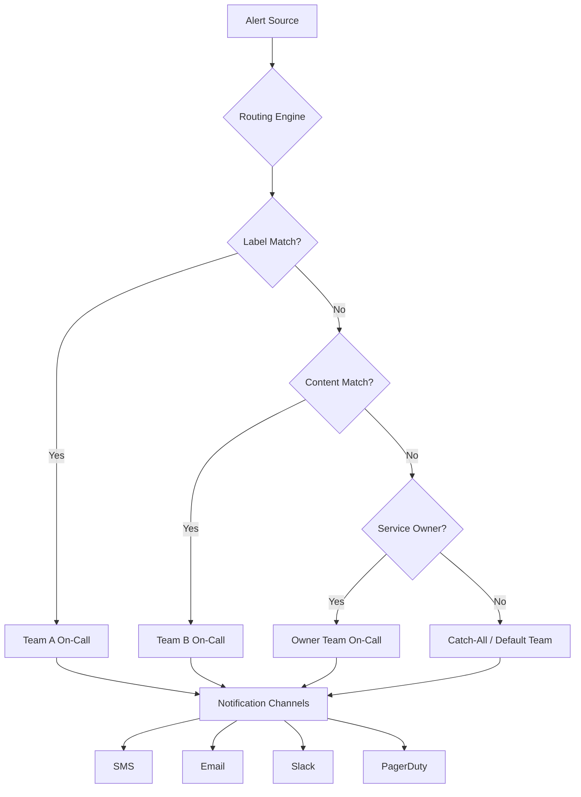
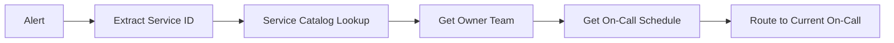
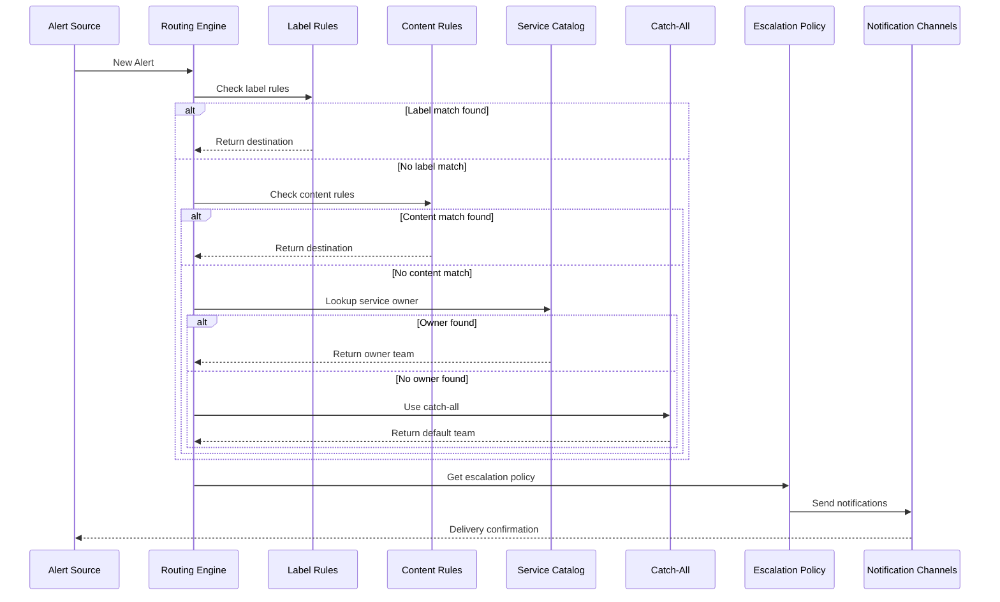

# How to Implement Alert Routing

Author: [nawazdhandala](https://github.com/nawazdhandala)

Tags: SRE, Alerting, Routing, OnCall

Description: Route alerts to the right teams using labels, content matching, and ownership rules to reduce noise and speed up incident response.

---

Alert routing determines which team or individual receives a notification when something breaks. Without proper routing, alerts end up in the wrong inboxes, pages go unanswered, and incidents drag on longer than necessary. This guide walks through building a routing system that directs alerts based on labels, content, and service ownership.

---

## Why Alert Routing Matters

- **Faster response times**: The right team gets paged immediately instead of waiting for manual escalation.
- **Reduced noise**: Engineers only see alerts relevant to their services, preventing fatigue.
- **Clear ownership**: Every alert has a defined destination, eliminating ambiguity during incidents.
- **Scalable operations**: As services multiply, routing rules handle complexity without manual intervention.

---

## Alert Routing Architecture



The routing engine evaluates alerts against rules in priority order. Label-based rules fire first, followed by content-based matching, then service ownership lookups. Alerts that match no rule fall through to a catch-all destination.

---

## Step 1: Define Alert Labels

Labels are key-value pairs attached to alerts at creation time. They provide structured metadata for routing decisions.

```yaml
# Example alert with labels
alert:
  name: "HighErrorRate"
  severity: "critical"
  labels:
    team: "payments"
    environment: "production"
    service: "checkout-api"
    region: "us-east-1"
  annotations:
    summary: "Error rate exceeded 5% threshold"
    runbook: "https://runbooks.example.com/checkout-errors"
```

**Common label categories:**

| Label | Purpose | Example Values |
|-------|---------|----------------|
| `team` | Primary owning team | payments, platform, data |
| `service` | Specific service name | checkout-api, user-auth |
| `severity` | Alert criticality | critical, warning, info |
| `environment` | Deployment environment | production, staging, dev |
| `region` | Geographic location | us-east-1, eu-west-1 |

---

## Step 2: Configure Label-Based Routing Rules

Label-based routing matches alerts using exact values or patterns. Rules execute in order; the first match wins.

```yaml
# routing-rules.yaml
# Rules are evaluated top to bottom. First match wins.

routing_rules:
  # Rule 1: Critical payment alerts go to payments team primary
  - name: "payments-critical"
    match:
      labels:
        team: "payments"
        severity: "critical"
    route_to:
      team: "payments-oncall"
      channel: "phone"
      escalation_policy: "payments-escalation"

  # Rule 2: All payment alerts (non-critical) go to Slack
  - name: "payments-warning"
    match:
      labels:
        team: "payments"
    route_to:
      team: "payments-oncall"
      channel: "slack"
      escalation_policy: null

  # Rule 3: Infrastructure alerts by environment
  - name: "infra-production"
    match:
      labels:
        team: "infrastructure"
        environment: "production"
    route_to:
      team: "sre-oncall"
      channel: "phone"
      escalation_policy: "sre-escalation"
```

**Rule matching logic:**

```python
# Pseudocode for label matching
def match_labels(alert_labels, rule_labels):
    """
    Returns True if all rule labels are present in alert labels
    with matching values. Supports wildcards with '*'.
    """
    for key, expected_value in rule_labels.items():
        actual_value = alert_labels.get(key)

        # Missing label means no match
        if actual_value is None:
            return False

        # Wildcard matches any value
        if expected_value == "*":
            continue

        # Exact match required
        if actual_value != expected_value:
            return False

    return True
```

---

## Step 3: Add Content-Based Routing

Content-based routing inspects the alert message, title, or annotations for patterns. Use this when labels are incomplete or alerts come from external systems you cannot modify.

```yaml
# content-routing-rules.yaml
# Matches against alert title, message, and annotation fields

content_rules:
  # Match database-related alerts by keyword
  - name: "database-alerts"
    match:
      content_contains:
        - "postgresql"
        - "mysql"
        - "database connection"
        - "replication lag"
    route_to:
      team: "dba-oncall"
      channel: "slack"

  # Match Kubernetes alerts using regex
  - name: "kubernetes-alerts"
    match:
      content_regex: "(pod|node|deployment|statefulset).*(crash|oom|evict)"
    route_to:
      team: "platform-oncall"
      channel: "phone"

  # Match third-party service alerts
  - name: "vendor-alerts"
    match:
      source_contains:
        - "stripe"
        - "twilio"
        - "sendgrid"
    route_to:
      team: "integrations-oncall"
      channel: "email"
```

**Content matching implementation:**

```python
import re

def match_content(alert, content_rule):
    """
    Check if alert content matches the rule criteria.
    Searches title, message, and all annotation values.
    """
    # Build searchable text from alert fields
    searchable_text = " ".join([
        alert.get("title", ""),
        alert.get("message", ""),
        " ".join(alert.get("annotations", {}).values())
    ]).lower()

    # Check for keyword matches
    if "content_contains" in content_rule:
        keywords = content_rule["content_contains"]
        if any(kw.lower() in searchable_text for kw in keywords):
            return True

    # Check for regex matches
    if "content_regex" in content_rule:
        pattern = content_rule["content_regex"]
        if re.search(pattern, searchable_text, re.IGNORECASE):
            return True

    return False
```

---

## Step 4: Map Service Ownership

Service ownership routing uses your service catalog to determine alert destinations. When an alert references a service, the routing engine looks up the owning team automatically.



**Service catalog schema:**

```yaml
# service-catalog.yaml
services:
  checkout-api:
    display_name: "Checkout API"
    owner_team: "payments"
    oncall_policy: "payments-escalation"
    tier: 1
    dependencies:
      - user-service
      - inventory-service
      - stripe-integration

  user-service:
    display_name: "User Service"
    owner_team: "identity"
    oncall_policy: "identity-escalation"
    tier: 1
    dependencies:
      - postgres-cluster
      - redis-cache

  inventory-service:
    display_name: "Inventory Service"
    owner_team: "commerce"
    oncall_policy: "commerce-escalation"
    tier: 2
    dependencies:
      - postgres-cluster
```

**Ownership lookup function:**

```python
def route_by_ownership(alert, service_catalog):
    """
    Route alert based on service ownership from catalog.
    Returns the on-call policy for the owning team.
    """
    # Extract service identifier from alert labels
    service_id = alert.get("labels", {}).get("service")

    if not service_id:
        # Try to extract from alert message
        service_id = extract_service_from_content(alert)

    if not service_id:
        return None  # Fall through to catch-all

    # Look up service in catalog
    service = service_catalog.get(service_id)

    if not service:
        return None  # Unknown service, fall through

    # Return routing destination
    return {
        "team": service["owner_team"],
        "oncall_policy": service["oncall_policy"],
        "tier": service["tier"]
    }
```

---

## Step 5: Configure Fallback and Catch-All Routes

Every routing configuration needs a catch-all rule for alerts that match nothing. Without one, alerts disappear silently.

```yaml
# Complete routing configuration with fallbacks

routing_config:
  # Primary rules (evaluated in order)
  rules:
    - name: "payments-critical"
      match:
        labels:
          team: "payments"
          severity: "critical"
      route_to:
        team: "payments-oncall"
        channel: "phone"

    - name: "platform-critical"
      match:
        labels:
          team: "platform"
          severity: "critical"
      route_to:
        team: "platform-oncall"
        channel: "phone"

  # Content-based fallback (when no label match)
  content_fallback:
    enabled: true
    rules:
      - name: "database-keywords"
        match:
          content_contains: ["database", "postgres", "mysql"]
        route_to:
          team: "dba-oncall"

  # Service ownership fallback (when no content match)
  ownership_fallback:
    enabled: true
    catalog_source: "service-catalog.yaml"

  # Catch-all destination (when nothing else matches)
  catch_all:
    route_to:
      team: "sre-oncall"
      channel: "slack"
      escalation_after_minutes: 15
    notify:
      - "oncall-leads@example.com"
    tag_as: "unrouted"
```

**Catch-all handling logic:**

```python
def route_alert(alert, config):
    """
    Main routing function. Evaluates rules in priority order
    and returns the final destination.
    """
    # Step 1: Try label-based rules
    for rule in config["rules"]:
        if match_labels(alert.get("labels", {}), rule["match"]["labels"]):
            return rule["route_to"]

    # Step 2: Try content-based fallback
    if config["content_fallback"]["enabled"]:
        for rule in config["content_fallback"]["rules"]:
            if match_content(alert, rule["match"]):
                return rule["route_to"]

    # Step 3: Try service ownership fallback
    if config["ownership_fallback"]["enabled"]:
        catalog = load_catalog(config["ownership_fallback"]["catalog_source"])
        destination = route_by_ownership(alert, catalog)
        if destination:
            return destination

    # Step 4: Use catch-all
    log_unrouted_alert(alert)  # Track for analysis
    return config["catch_all"]["route_to"]
```

---

## Step 6: Team and Escalation Policies

Define escalation policies that specify how alerts move through responders if unacknowledged.

```yaml
# escalation-policies.yaml

policies:
  payments-escalation:
    name: "Payments Team Escalation"
    steps:
      # Step 1: Page primary on-call
      - delay_minutes: 0
        targets:
          - type: "schedule"
            schedule: "payments-primary"
        channels: ["phone", "sms"]

      # Step 2: Page secondary if no ack in 5 min
      - delay_minutes: 5
        targets:
          - type: "schedule"
            schedule: "payments-secondary"
        channels: ["phone", "sms"]

      # Step 3: Page team lead if still no ack
      - delay_minutes: 10
        targets:
          - type: "user"
            user: "payments-lead@example.com"
        channels: ["phone"]

      # Step 4: Page engineering manager
      - delay_minutes: 15
        targets:
          - type: "user"
            user: "eng-manager@example.com"
        channels: ["phone"]

    repeat:
      enabled: true
      max_repeats: 3
      repeat_delay_minutes: 20

  sre-escalation:
    name: "SRE Team Escalation"
    steps:
      - delay_minutes: 0
        targets:
          - type: "schedule"
            schedule: "sre-primary"
          - type: "schedule"
            schedule: "sre-secondary"
        channels: ["phone"]

      - delay_minutes: 10
        targets:
          - type: "user"
            user: "sre-lead@example.com"
        channels: ["phone"]
```

---

## Complete Routing Flow



---

## Practical Example: Multi-Team Configuration

Here is a complete routing configuration for an organization with multiple teams:

```yaml
# production-routing.yaml
# Alert routing configuration for Acme Corp

version: "1.0"
organization: "acme-corp"

# Team definitions with on-call schedules
teams:
  payments:
    display_name: "Payments Team"
    slack_channel: "#payments-alerts"
    primary_schedule: "payments-primary"
    secondary_schedule: "payments-secondary"
    escalation_policy: "payments-escalation"

  platform:
    display_name: "Platform Team"
    slack_channel: "#platform-alerts"
    primary_schedule: "platform-primary"
    secondary_schedule: "platform-secondary"
    escalation_policy: "platform-escalation"

  data:
    display_name: "Data Team"
    slack_channel: "#data-alerts"
    primary_schedule: "data-primary"
    escalation_policy: "data-escalation"

  sre:
    display_name: "SRE Team"
    slack_channel: "#sre-alerts"
    primary_schedule: "sre-primary"
    secondary_schedule: "sre-secondary"
    escalation_policy: "sre-escalation"

# Routing rules
routing:
  # High-priority rules for critical alerts
  critical_rules:
    - name: "payments-critical"
      priority: 1
      match:
        labels:
          team: "payments"
          severity: "critical"
      destination:
        team: "payments"
        use_escalation: true
        channels: ["phone", "sms", "slack"]

    - name: "platform-critical"
      priority: 1
      match:
        labels:
          team: "platform"
          severity: "critical"
      destination:
        team: "platform"
        use_escalation: true
        channels: ["phone", "sms", "slack"]

  # Standard rules for warnings
  standard_rules:
    - name: "payments-warning"
      priority: 2
      match:
        labels:
          team: "payments"
          severity: "warning"
      destination:
        team: "payments"
        use_escalation: false
        channels: ["slack", "email"]

    - name: "data-pipeline"
      priority: 2
      match:
        labels:
          team: "data"
      destination:
        team: "data"
        use_escalation: true
        channels: ["slack"]

  # Content-based rules for external integrations
  content_rules:
    - name: "aws-alerts"
      match:
        source: "aws-cloudwatch"
        content_regex: "(RDS|EC2|ECS|Lambda)"
      destination:
        team: "platform"
        channels: ["slack"]

    - name: "stripe-alerts"
      match:
        source: "stripe-webhooks"
      destination:
        team: "payments"
        channels: ["slack"]

  # Catch-all configuration
  catch_all:
    destination:
      team: "sre"
      channels: ["slack"]
    notify_unrouted: true
    tracking_label: "needs-routing-rule"
```

---

## Monitoring Your Routing Rules

Track routing effectiveness with these metrics:

| Metric | Description | Target |
|--------|-------------|--------|
| Unrouted alert rate | Percentage of alerts hitting catch-all | < 5% |
| Mean time to acknowledge | Time from alert to first response | < 5 min for critical |
| Routing rule hit rate | Distribution of alerts across rules | Balanced load |
| False positive rate | Alerts closed without action | < 10% |

```yaml
# Routing metrics dashboard query examples

queries:
  unrouted_rate:
    query: |
      sum(alerts_total{routed="catch_all"})
      / sum(alerts_total) * 100
    threshold: 5
    alert_if_exceeds: true

  routing_distribution:
    query: |
      topk(10, sum by (rule_name) (alerts_routed_total))

  acknowledgment_time:
    query: |
      histogram_quantile(0.95,
        sum by (team, le) (alert_ack_time_seconds_bucket)
      )
```

---

## Best Practices

1. **Start with labels**: Instrument alert sources to emit consistent labels before relying on content matching.

2. **Keep rules simple**: Complex regex patterns are hard to debug. Prefer explicit label matches.

3. **Review catch-all regularly**: High catch-all traffic indicates missing routing rules or unlabeled alerts.

4. **Test routing changes**: Use a staging environment or dry-run mode before deploying new rules.

5. **Document team boundaries**: Make it clear which services each team owns to prevent routing disputes.

6. **Version control your config**: Store routing rules in Git for audit trails and rollback capability.

7. **Set up alerts for routing failures**: Know immediately when the routing system itself has issues.

---

## Conclusion

Effective alert routing reduces incident response time and prevents engineer burnout. Start with label-based rules for your most critical services, add content-based matching for legacy systems, and always configure a catch-all with visibility into unrouted alerts. As your organization grows, service ownership mapping scales routing automatically based on your catalog.

Review routing metrics monthly and refine rules based on where alerts actually land versus where they should go. The goal is zero unrouted alerts and every notification reaching an engineer who can act on it.
