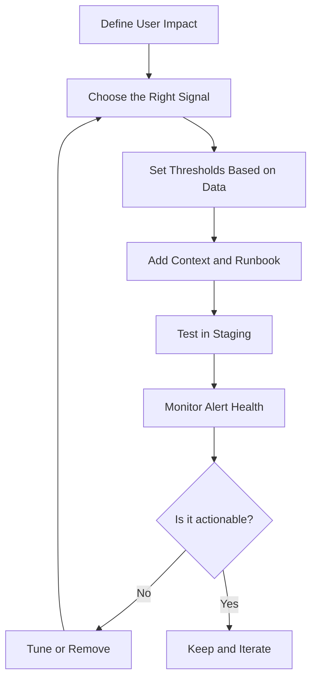
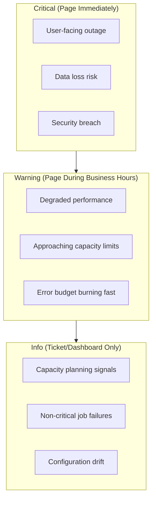
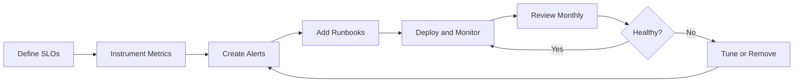

# How to Build Alert Rule Design

Author: [nawazdhandala](https://github.com/nawazdhandala)

Tags: Alerting, Monitoring, SRE, DevOps, Observability, Incident Response

Description: A practical guide to designing effective alert rules that reduce noise, catch real incidents, and keep your on-call team sane.

---

Alerting is the nervous system of your infrastructure. Done right, it wakes you up for genuine problems and lets you sleep through the noise. Done wrong, it creates alert fatigue, missed incidents, and burned-out engineers.

This guide walks through the principles, patterns, and practical examples for building alert rules that actually work.

---

## Core Principles of Alert Rule Design

Before writing a single alert, internalize these principles:

1. **Alerts should be actionable.** If there is nothing to do, it should not page anyone.
2. **Optimize for signal, not coverage.** One well-tuned alert beats ten noisy ones.
3. **Tie alerts to user impact.** CPU at 80% means nothing if users are happy.
4. **Alert on symptoms, not causes.** Users care about slow responses, not which microservice is struggling.
5. **Every alert needs an owner.** Orphan alerts become noise.

---

## The Alert Design Framework

Use this mental model when creating any alert rule:



---

## Step 1: Start With User Impact

Every alert should answer: "What user-visible problem does this detect?"

| Bad Alert | Better Alert |
|-----------|--------------|
| CPU > 80% | API latency P95 > 500ms |
| Memory usage high | Checkout flow error rate > 1% |
| Disk 90% full | Database query timeout rate increasing |
| Pod restarted | Payment success rate dropped below SLO |

The first column describes infrastructure state. The second describes user pain. Always prefer the second.

---

## Step 2: Choose the Right Signal Type

Different problems need different signal types:

### Threshold Alerts
Best for: Known boundaries that should never be crossed.

The example below shows a basic threshold alert that fires when error rate exceeds 5%.

```yaml
# Prometheus alert rule for error rate threshold
groups:
  - name: api-alerts
    rules:
      - alert: HighErrorRate
        # Fire when error rate exceeds 5% over 5 minutes
        expr: |
          sum(rate(http_requests_total{status=~"5.."}[5m]))
          /
          sum(rate(http_requests_total[5m]))
          > 0.05
        for: 5m
        labels:
          severity: critical
          team: platform
        annotations:
          summary: "API error rate above 5%"
          description: "Error rate is {{ $value | humanizePercentage }}"
          runbook: "https://wiki.example.com/runbooks/high-error-rate"
```

### Rate of Change Alerts
Best for: Detecting sudden shifts that indicate incidents.

This alert catches rapid increases in error rate, even when absolute numbers are still low.

```yaml
# Alert on sudden spike in errors (rate of change)
groups:
  - name: anomaly-detection
    rules:
      - alert: ErrorRateSpike
        # Fire when error rate doubles compared to 1 hour ago
        expr: |
          (
            sum(rate(http_requests_total{status=~"5.."}[5m]))
            /
            sum(rate(http_requests_total[5m]))
          )
          /
          (
            sum(rate(http_requests_total{status=~"5.."}[5m] offset 1h))
            /
            sum(rate(http_requests_total[5m] offset 1h))
          )
          > 2
        for: 3m
        labels:
          severity: warning
        annotations:
          summary: "Error rate doubled compared to 1 hour ago"
```

### SLO Burn Rate Alerts
Best for: Balancing reliability with development velocity.

Burn rate alerts tell you when you are consuming your error budget too fast.

```yaml
# Multi-window burn rate alert for SLO
# This catches both fast burns and slow burns
groups:
  - name: slo-alerts
    rules:
      # Fast burn: consuming budget 14x faster than sustainable
      - alert: SLOFastBurn
        expr: |
          (
            1 - (
              sum(rate(http_requests_total{status!~"5.."}[1h]))
              /
              sum(rate(http_requests_total[1h]))
            )
          ) > (14 * 0.001)
          and
          (
            1 - (
              sum(rate(http_requests_total{status!~"5.."}[5m]))
              /
              sum(rate(http_requests_total[5m]))
            )
          ) > (14 * 0.001)
        for: 2m
        labels:
          severity: critical
        annotations:
          summary: "SLO burn rate critical - budget exhausting in <2 hours"

      # Slow burn: consuming budget 3x faster than sustainable
      - alert: SLOSlowBurn
        expr: |
          (
            1 - (
              sum(rate(http_requests_total{status!~"5.."}[6h]))
              /
              sum(rate(http_requests_total[6h]))
            )
          ) > (3 * 0.001)
        for: 1h
        labels:
          severity: warning
        annotations:
          summary: "SLO burn rate elevated - review error sources"
```

---

## Step 3: Set Thresholds Based on Data

Never guess thresholds. Use historical data to find the right values.

### Finding the Right Threshold

Query your metrics to understand normal behavior before setting thresholds.

```sql
-- Find P95 and P99 latency over the past 30 days
-- Use this to set reasonable latency thresholds
SELECT
  percentile_cont(0.95) WITHIN GROUP (ORDER BY latency_ms) as p95,
  percentile_cont(0.99) WITHIN GROUP (ORDER BY latency_ms) as p99,
  avg(latency_ms) as avg_latency
FROM request_metrics
WHERE timestamp > now() - interval '30 days'
  AND endpoint = '/api/checkout';
```

### Threshold Selection Guidelines

| Metric Type | Threshold Strategy |
|-------------|-------------------|
| Latency | Set at 2x your P95 baseline |
| Error rate | Start at 1%, tune based on SLO |
| Saturation | Alert at 70-80% to allow reaction time |
| Availability | Based on SLO (99.9% = alert on 0.1% failure window) |

---

## Step 4: Structure Your Alert Hierarchy

Not all alerts are equal. Design a clear severity system.



### Severity Definitions

Use this table to classify your alerts consistently.

| Severity | Response Time | Notification | Examples |
|----------|---------------|--------------|----------|
| Critical | 5 minutes | Page + Phone + Slack | Complete outage, data corruption |
| Warning | 30 minutes | Slack + Email | Elevated errors, capacity concerns |
| Info | Next business day | Dashboard/Ticket | Cleanup tasks, optimization opportunities |

---

## Step 5: Add Context That Speeds Resolution

An alert without context is a puzzle to solve at 3 AM. Include everything needed to start troubleshooting.

### Alert Template Structure

Every alert should include these fields to help responders act quickly.

```yaml
# Well-structured alert with full context
groups:
  - name: checkout-service
    rules:
      - alert: CheckoutLatencyHigh
        expr: |
          histogram_quantile(0.95,
            sum(rate(checkout_duration_seconds_bucket[5m])) by (le)
          ) > 2.0
        for: 5m
        labels:
          severity: critical
          service: checkout
          team: payments
          slo: checkout-latency
        annotations:
          # Clear summary of what is happening
          summary: "Checkout P95 latency exceeds 2 seconds"

          # Detailed description with current value
          description: |
            Checkout service latency is {{ $value | humanizeDuration }}.
            This exceeds our 2 second P95 target.

          # Direct link to relevant dashboard
          dashboard: "https://grafana.example.com/d/checkout-overview"

          # Runbook with step-by-step resolution
          runbook: "https://wiki.example.com/runbooks/checkout-latency"

          # Recent changes that might be relevant
          recent_deploys: "https://argocd.example.com/applications/checkout"

          # Escalation path if primary responder needs help
          escalation: "Slack #checkout-oncall or page payments-secondary"
```

---

## Step 6: Implement Alert Grouping and Deduplication

When things go wrong, they often go wrong together. Prevent alert storms with smart grouping.

### Alertmanager Configuration for Grouping

This configuration groups related alerts to prevent notification floods during incidents.

```yaml
# Alertmanager configuration for intelligent grouping
global:
  resolve_timeout: 5m

route:
  # Group alerts by service and alertname
  # This prevents 50 separate notifications during an outage
  group_by: ['service', 'alertname']

  # Wait 30 seconds to collect related alerts before sending
  group_wait: 30s

  # Wait 5 minutes before sending updates on existing groups
  group_interval: 5m

  # Resend notifications every 4 hours for unresolved alerts
  repeat_interval: 4h

  receiver: 'default-receiver'

  routes:
    # Critical alerts get immediate, individual attention
    - match:
        severity: critical
      group_wait: 10s
      group_interval: 1m
      receiver: 'pagerduty-critical'

    # Group all warnings from the same service together
    - match:
        severity: warning
      group_by: ['service']
      group_wait: 2m
      receiver: 'slack-warnings'

    # Info alerts batch together for daily digest
    - match:
        severity: info
      group_by: ['team']
      group_wait: 1h
      receiver: 'email-digest'

receivers:
  - name: 'pagerduty-critical'
    pagerduty_configs:
      - service_key: '<pagerduty-key>'

  - name: 'slack-warnings'
    slack_configs:
      - api_url: '<slack-webhook>'
        channel: '#alerts-warning'

  - name: 'email-digest'
    email_configs:
      - to: 'team@example.com'
```

---

## Step 7: Build Composite Alerts for Complex Conditions

Real incidents often involve multiple signals. Composite alerts catch problems that single metrics miss.

### Composite Alert Example

This alert only fires when multiple conditions are true, reducing false positives.

```yaml
# Composite alert: High latency AND high traffic AND recent deploy
groups:
  - name: composite-alerts
    rules:
      # First, create recording rules for individual conditions
      - record: condition:high_latency
        expr: |
          histogram_quantile(0.95,
            sum(rate(http_request_duration_seconds_bucket[5m])) by (le, service)
          ) > 1.0

      - record: condition:high_traffic
        expr: |
          sum(rate(http_requests_total[5m])) by (service) > 100

      - record: condition:recent_deploy
        expr: |
          time() - deploy_timestamp < 1800  # Within 30 minutes

      # Composite alert combining all conditions
      - alert: LatencyDegradationAfterDeploy
        expr: |
          condition:high_latency
          and condition:high_traffic
          and condition:recent_deploy
        for: 5m
        labels:
          severity: critical
        annotations:
          summary: "High latency detected after recent deployment"
          description: |
            Service {{ $labels.service }} is experiencing high latency
            during high traffic, and a deploy occurred in the last 30 minutes.
            Consider rolling back.
          runbook: "https://wiki.example.com/runbooks/post-deploy-latency"
```

---

## Step 8: Implement Alert Lifecycle Management

Alerts are not "set and forget." Build processes to keep them healthy.

### Alert Health Metrics to Track

Monitor these metrics to ensure your alerting system stays effective.

```yaml
# Recording rules for alert health monitoring
groups:
  - name: alert-meta-metrics
    rules:
      # Track how often each alert fires
      - record: alert:firing_frequency:7d
        expr: |
          count_over_time(ALERTS{alertstate="firing"}[7d])

      # Track alerts that fire but are never acknowledged
      - record: alert:ignored_ratio:7d
        expr: |
          (
            count_over_time(ALERTS{alertstate="firing"}[7d])
            -
            count_over_time(alert_acknowledged_total[7d])
          )
          /
          count_over_time(ALERTS{alertstate="firing"}[7d])

      # Track mean time to acknowledge per alert
      - record: alert:mtta_seconds:avg
        expr: |
          avg(alert_time_to_acknowledge_seconds) by (alertname)
```

### Monthly Alert Review Checklist

| Question | Action if Yes |
|----------|---------------|
| Alert fired > 10 times with no action taken? | Tune threshold or delete |
| Alert never fired in 90 days? | Validate it still works |
| Multiple alerts always fire together? | Consolidate into one |
| Alert requires > 5 minutes to understand? | Improve annotations |
| Alert has no runbook? | Add one or delete the alert |

---

## Step 9: Test Your Alerts

Untested alerts fail when you need them most.

### Alert Testing Approaches

This script validates that alerts fire correctly in a test environment.

```python
# Python script to validate alert rules fire correctly
import requests
import time
from prometheus_client import CollectorRegistry, Counter, push_to_gateway

def test_error_rate_alert():
    """
    Test that HighErrorRate alert fires when error rate exceeds threshold.

    This test:
    1. Pushes synthetic metrics with high error rate
    2. Waits for alert evaluation interval
    3. Checks if alert is firing
    """
    registry = CollectorRegistry()

    # Create metrics that should trigger the alert
    requests_total = Counter(
        'http_requests_total',
        'Total requests',
        ['status'],
        registry=registry
    )

    # Simulate 10% error rate (above 5% threshold)
    requests_total.labels(status='200').inc(90)
    requests_total.labels(status='500').inc(10)

    # Push to test Prometheus instance
    push_to_gateway(
        'localhost:9091',
        job='alert-test',
        registry=registry
    )

    # Wait for alert evaluation (2 evaluation cycles)
    print("Waiting for alert evaluation...")
    time.sleep(120)

    # Check if alert is firing
    response = requests.get(
        'http://localhost:9090/api/v1/alerts',
        params={'filter': 'alertname="HighErrorRate"'}
    )

    alerts = response.json()['data']['alerts']
    firing_alerts = [a for a in alerts if a['state'] == 'firing']

    if firing_alerts:
        print("SUCCESS: HighErrorRate alert is firing as expected")
        return True
    else:
        print("FAILURE: HighErrorRate alert did not fire")
        return False

def test_alert_has_required_labels():
    """
    Validate that all alerts have required labels and annotations.
    """
    response = requests.get('http://localhost:9090/api/v1/rules')
    rules = response.json()['data']['groups']

    required_labels = ['severity', 'team']
    required_annotations = ['summary', 'runbook']

    issues = []

    for group in rules:
        for rule in group['rules']:
            if rule['type'] != 'alerting':
                continue

            alert_name = rule['name']

            # Check required labels
            for label in required_labels:
                if label not in rule.get('labels', {}):
                    issues.append(f"{alert_name}: missing label '{label}'")

            # Check required annotations
            for annotation in required_annotations:
                if annotation not in rule.get('annotations', {}):
                    issues.append(f"{alert_name}: missing annotation '{annotation}'")

    if issues:
        print("Alert validation issues found:")
        for issue in issues:
            print(f"  - {issue}")
        return False

    print("All alerts have required labels and annotations")
    return True

if __name__ == '__main__':
    test_error_rate_alert()
    test_alert_has_required_labels()
```

---

## Real-World Alert Rule Examples

### E-commerce Checkout Flow

A complete alert set for monitoring a checkout service.

```yaml
# Complete alert rules for checkout service
groups:
  - name: checkout-alerts
    rules:
      # User impact: checkout success rate
      - alert: CheckoutSuccessRateLow
        expr: |
          (
            sum(rate(checkout_completed_total{status="success"}[5m]))
            /
            sum(rate(checkout_completed_total[5m]))
          ) < 0.95
        for: 5m
        labels:
          severity: critical
          service: checkout
          team: payments
        annotations:
          summary: "Checkout success rate below 95%"
          description: "Only {{ $value | humanizePercentage }} of checkouts succeeding"
          runbook: "https://wiki.example.com/runbooks/checkout-failures"

      # User impact: payment processing time
      - alert: PaymentProcessingSlow
        expr: |
          histogram_quantile(0.95,
            sum(rate(payment_processing_seconds_bucket[5m])) by (le, provider)
          ) > 5
        for: 3m
        labels:
          severity: warning
          service: checkout
          team: payments
        annotations:
          summary: "Payment processing P95 exceeds 5 seconds"
          description: "Provider {{ $labels.provider }} P95: {{ $value | humanizeDuration }}"

      # Capacity: cart abandonment spike
      - alert: CartAbandonmentSpike
        expr: |
          (
            sum(rate(cart_abandoned_total[1h]))
            /
            sum(rate(cart_abandoned_total[1h] offset 1d))
          ) > 1.5
        for: 30m
        labels:
          severity: warning
          service: checkout
          team: product
        annotations:
          summary: "Cart abandonment 50% higher than yesterday"
          description: "Investigate UX issues or payment problems"
```

### Kubernetes Cluster Health

Essential alerts for Kubernetes infrastructure.

```yaml
# Kubernetes cluster health alerts
groups:
  - name: kubernetes-alerts
    rules:
      # Node health
      - alert: NodeNotReady
        expr: kube_node_status_condition{condition="Ready",status="true"} == 0
        for: 5m
        labels:
          severity: critical
        annotations:
          summary: "Node {{ $labels.node }} is not ready"
          runbook: "https://wiki.example.com/runbooks/node-not-ready"

      # Pod restarts indicate instability
      - alert: PodCrashLooping
        expr: |
          rate(kube_pod_container_status_restarts_total[15m]) * 60 * 15 > 3
        for: 5m
        labels:
          severity: warning
        annotations:
          summary: "Pod {{ $labels.pod }} restarting frequently"
          description: "{{ $value | humanize }} restarts in last 15 minutes"

      # Resource pressure
      - alert: NodeMemoryPressure
        expr: |
          (
            node_memory_MemAvailable_bytes / node_memory_MemTotal_bytes
          ) < 0.1
        for: 10m
        labels:
          severity: warning
        annotations:
          summary: "Node {{ $labels.instance }} has less than 10% memory available"

      # Persistent volume running low
      - alert: PVCAlmostFull
        expr: |
          (
            kubelet_volume_stats_used_bytes / kubelet_volume_stats_capacity_bytes
          ) > 0.85
        for: 15m
        labels:
          severity: warning
        annotations:
          summary: "PVC {{ $labels.persistentvolumeclaim }} is 85% full"
```

---

## Common Anti-Patterns to Avoid

| Anti-Pattern | Problem | Solution |
|--------------|---------|----------|
| Alerting on every metric | Alert fatigue, noise | Alert on symptoms, not causes |
| Static thresholds everywhere | Breaks with growth | Use percentile-based or burn rate alerts |
| No runbook attached | Slow incident response | Require runbooks in CI validation |
| Alerts without owners | Orphan alerts become noise | Require team label, review quarterly |
| Same threshold for all services | False positives/negatives | Tune per-service based on SLOs |
| Alerting on transient spikes | Wasted investigation | Add appropriate "for" duration |

---

## Measuring Alert Quality

Track these metrics to continuously improve your alerting:

| Metric | Target | What It Tells You |
|--------|--------|-------------------|
| Alert-to-incident ratio | > 0.8 | Are alerts catching real problems? |
| Mean time to acknowledge | < 5 min for critical | Is the team responsive? |
| Alerts requiring no action | < 20% | Is there too much noise? |
| Incident without alert | 0 | Are there monitoring gaps? |
| Alert flapping rate | < 5% | Are thresholds too sensitive? |

---

## Putting It All Together

Great alert design is an ongoing practice, not a one-time setup. Follow this cycle:



### Quick Start Checklist

1. Define 3-5 SLOs for your most critical user journeys
2. Create burn rate alerts for each SLO
3. Add symptom-based alerts for known failure modes
4. Attach runbooks to every alert
5. Set up monthly alert reviews
6. Track alert-to-incident ratio as your north star metric

Remember: the goal is not to monitor everything. The goal is to detect user-impacting problems fast enough to fix them before users notice. Every alert that does not serve that goal is noise.

---

## Related Reading

- [Designing an SRE On-Call Rotation Without Burning Out Your Team](https://oneuptime.com/blog/post/2025-11-28-sre-on-call-rotation-design/view)
- [How to Reduce Noise in OpenTelemetry](https://oneuptime.com/blog/post/2025-08-25-how-to-reduce-noise-in-opentelemetry/view)
- [18 SRE Metrics Worth Tracking](https://oneuptime.com/blog/post/2025-11-28-sre-metrics-to-track/view)
