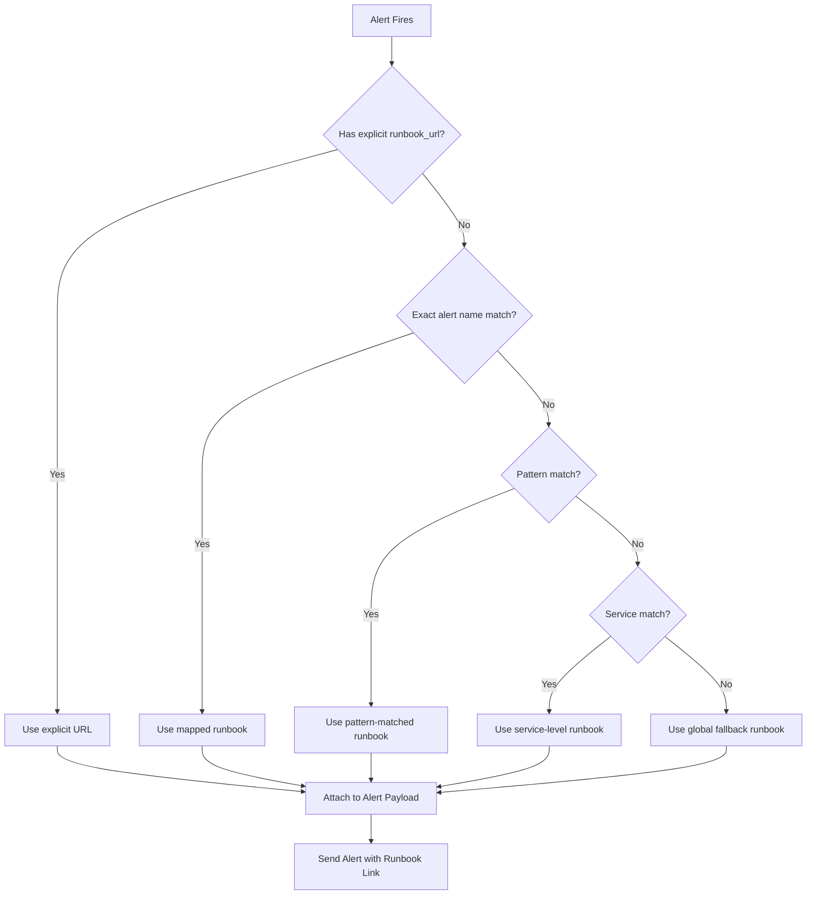
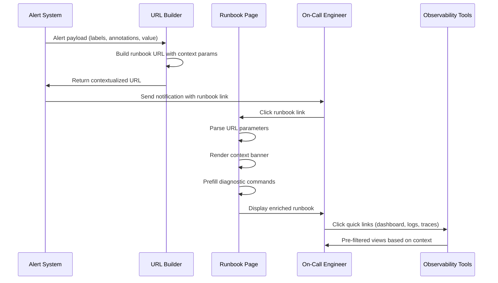
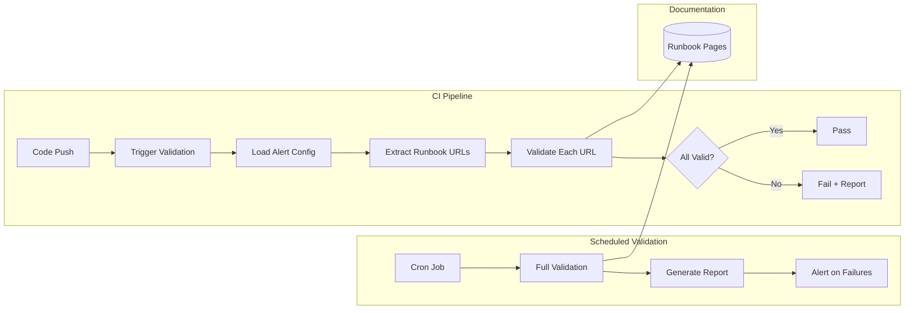

# How to Build Alert Runbook Links

Author: [nawazdhandala](https://github.com/nawazdhandala)

Tags: Alerting, SRE, Runbooks, Incident Response

Description: Learn how to integrate runbook links into alerts for streamlined incident response.

---

When an alert fires at 3 AM, the on-call engineer needs to know exactly what to do. A well-designed runbook link embedded in the alert payload transforms a panic moment into a structured response. This guide covers practical patterns for building, routing, validating, and versioning alert runbook links in your SRE practice.

## Why Runbook Links Matter

| Without Runbook Links | With Runbook Links |
|-----------------------|-------------------|
| Engineer searches wiki | Direct link in alert |
| Guessing which doc applies | Context-aware routing |
| Stale documentation unnoticed | Version-controlled, validated |
| Longer MTTR | Faster diagnosis and resolution |

Runbook links are the bridge between detection (alerting) and action (incident response). Done right, they reduce mean time to resolution (MTTR) and cognitive load during incidents.

---

## Runbook URL Conventions

Establish a consistent URL structure that maps alerts to runbooks predictably. This enables automation and reduces manual errors.

### Pattern 1: Service-Based Routing

```
https://docs.company.com/runbooks/{service}/{alert-name}
```

Example:
```
https://docs.company.com/runbooks/checkout-service/high-latency
https://docs.company.com/runbooks/payment-gateway/circuit-breaker-open
https://docs.company.com/runbooks/inventory-api/database-connection-pool-exhausted
```

### Pattern 2: Alert ID Routing

```
https://docs.company.com/runbooks/alerts/{alert-id}
```

Example:
```
https://docs.company.com/runbooks/alerts/SVC-CHECKOUT-001
https://docs.company.com/runbooks/alerts/DB-PG-CONN-EXHAUST
```

### Pattern 3: Hierarchical Routing

```
https://docs.company.com/runbooks/{team}/{service}/{category}/{alert-name}
```

Example:
```
https://docs.company.com/runbooks/platform/kubernetes/networking/pod-dns-resolution-failure
https://docs.company.com/runbooks/payments/stripe-integration/latency/p99-threshold-breach
```

### Recommended Naming Conventions

| Element | Convention | Example |
|---------|------------|---------|
| Service name | lowercase, hyphenated | `checkout-service` |
| Alert name | lowercase, hyphenated | `high-memory-usage` |
| Category | lowercase | `latency`, `errors`, `saturation` |
| Alert ID | uppercase, prefixed | `SVC-CHECKOUT-001` |

---

## Dynamic Runbook Routing

Static URLs work for simple setups, but production systems need dynamic routing based on alert context.

### URL Template System

```yaml
# alerting-config.yaml
alerts:
  - name: high_latency
    expr: histogram_quantile(0.99, http_request_duration_seconds_bucket) > 0.5
    labels:
      severity: warning
      service: "{{ $labels.service }}"
    annotations:
      runbook_url: "https://docs.company.com/runbooks/{{ $labels.service }}/high-latency"
      summary: "High latency detected on {{ $labels.service }}"
```

### Prometheus Alertmanager Example

```yaml
# alertmanager.yml
receivers:
  - name: 'oncall-team'
    slack_configs:
      - channel: '#alerts'
        title: '{{ .CommonAnnotations.summary }}'
        text: |
          *Alert:* {{ .CommonLabels.alertname }}
          *Service:* {{ .CommonLabels.service }}
          *Severity:* {{ .CommonLabels.severity }}
          *Runbook:* {{ .CommonAnnotations.runbook_url }}
        actions:
          - type: button
            text: "View Runbook"
            url: "{{ .CommonAnnotations.runbook_url }}"
```

### Dynamic URL Builder (Node.js)

```javascript
// runbook-url-builder.js
class RunbookUrlBuilder {
  constructor(baseUrl, options = {}) {
    this.baseUrl = baseUrl;
    this.defaultVersion = options.defaultVersion || 'latest';
    this.fallbackRunbook = options.fallbackRunbook || '/general/troubleshooting';
  }

  /**
   * Build a runbook URL from alert context
   * @param {Object} alert - Alert object with labels and annotations
   * @returns {string} - Fully qualified runbook URL
   */
  buildUrl(alert) {
    const { labels = {}, annotations = {} } = alert;

    // Priority 1: Explicit runbook URL in annotations
    if (annotations.runbook_url) {
      return this.normalizeUrl(annotations.runbook_url);
    }

    // Priority 2: Build from alert metadata
    const service = labels.service || labels.job || 'unknown';
    const alertName = labels.alertname || 'unknown';
    const category = this.categorizeAlert(labels);

    const path = this.buildPath({ service, alertName, category });
    return `${this.baseUrl}${path}`;
  }

  buildPath({ service, alertName, category }) {
    const sanitizedService = this.sanitize(service);
    const sanitizedAlert = this.sanitize(alertName);

    if (category) {
      return `/runbooks/${sanitizedService}/${category}/${sanitizedAlert}`;
    }
    return `/runbooks/${sanitizedService}/${sanitizedAlert}`;
  }

  categorizeAlert(labels) {
    // Categorize based on alert characteristics
    if (labels.alertname?.includes('latency') || labels.alertname?.includes('slow')) {
      return 'latency';
    }
    if (labels.alertname?.includes('error') || labels.alertname?.includes('failure')) {
      return 'errors';
    }
    if (labels.alertname?.includes('memory') || labels.alertname?.includes('cpu') || labels.alertname?.includes('disk')) {
      return 'saturation';
    }
    return null;
  }

  sanitize(str) {
    return str
      .toLowerCase()
      .replace(/[^a-z0-9]+/g, '-')
      .replace(/^-|-$/g, '');
  }

  normalizeUrl(url) {
    // Ensure URL is absolute
    if (url.startsWith('http')) {
      return url;
    }
    return `${this.baseUrl}${url}`;
  }
}

// Usage
const builder = new RunbookUrlBuilder('https://docs.company.com', {
  defaultVersion: 'v2',
  fallbackRunbook: '/general/troubleshooting',
});

const alert = {
  labels: {
    alertname: 'HighLatencyCheckout',
    service: 'checkout-service',
    severity: 'warning',
  },
  annotations: {
    summary: 'Checkout service P99 latency above threshold',
  },
};

const runbookUrl = builder.buildUrl(alert);
console.log(runbookUrl);
// Output: https://docs.company.com/runbooks/checkout-service/latency/highlatencycheckout
```

### Python Implementation

```python
# runbook_url_builder.py
import re
from urllib.parse import urljoin
from typing import Optional, Dict, Any

class RunbookUrlBuilder:
    def __init__(self, base_url: str, default_version: str = "latest"):
        self.base_url = base_url.rstrip("/")
        self.default_version = default_version

    def build_url(self, alert: Dict[str, Any]) -> str:
        """Build a runbook URL from alert context."""
        labels = alert.get("labels", {})
        annotations = alert.get("annotations", {})

        # Priority 1: Explicit runbook URL
        if runbook_url := annotations.get("runbook_url"):
            return self._normalize_url(runbook_url)

        # Priority 2: Build from metadata
        service = labels.get("service") or labels.get("job") or "unknown"
        alert_name = labels.get("alertname", "unknown")
        category = self._categorize_alert(labels)

        return self._build_path(service, alert_name, category)

    def _build_path(self, service: str, alert_name: str, category: Optional[str]) -> str:
        sanitized_service = self._sanitize(service)
        sanitized_alert = self._sanitize(alert_name)

        if category:
            path = f"/runbooks/{sanitized_service}/{category}/{sanitized_alert}"
        else:
            path = f"/runbooks/{sanitized_service}/{sanitized_alert}"

        return f"{self.base_url}{path}"

    def _categorize_alert(self, labels: Dict[str, str]) -> Optional[str]:
        alert_name = labels.get("alertname", "").lower()

        if any(term in alert_name for term in ["latency", "slow", "timeout"]):
            return "latency"
        if any(term in alert_name for term in ["error", "failure", "exception"]):
            return "errors"
        if any(term in alert_name for term in ["memory", "cpu", "disk", "exhausted"]):
            return "saturation"
        return None

    def _sanitize(self, value: str) -> str:
        return re.sub(r"[^a-z0-9]+", "-", value.lower()).strip("-")

    def _normalize_url(self, url: str) -> str:
        if url.startswith("http"):
            return url
        return f"{self.base_url}{url}"


# Usage
builder = RunbookUrlBuilder("https://docs.company.com")

alert = {
    "labels": {
        "alertname": "DatabaseConnectionPoolExhausted",
        "service": "inventory-api",
        "severity": "critical",
    },
    "annotations": {
        "summary": "Connection pool at 100% capacity",
    },
}

print(builder.build_url(alert))
# Output: https://docs.company.com/runbooks/inventory-api/saturation/databaseconnectionpoolexhausted
```

---

## Alert-to-Runbook Mapping

For complex environments, maintain an explicit mapping between alerts and runbooks.

### Mapping Configuration

```yaml
# alert-runbook-mapping.yaml
version: "1.0"
mappings:
  # Exact match mappings
  - alert_name: "HighLatencyCheckoutService"
    runbook: "/runbooks/checkout/high-latency"
    priority: 1

  - alert_name: "DatabaseConnectionPoolExhausted"
    runbook: "/runbooks/database/connection-pool-exhausted"
    priority: 1

  # Pattern-based mappings
  - alert_pattern: "^High.*Latency.*"
    runbook: "/runbooks/general/high-latency-troubleshooting"
    priority: 2

  - alert_pattern: "^.*MemoryUsage.*"
    runbook: "/runbooks/general/memory-troubleshooting"
    priority: 2

  # Service-based fallbacks
  - service: "checkout-service"
    runbook: "/runbooks/checkout/general"
    priority: 3

  # Global fallback
  - default: true
    runbook: "/runbooks/general/troubleshooting"
    priority: 99

defaults:
  base_url: "https://docs.company.com"
  version: "v2"
```

### Mapping Resolver

```javascript
// mapping-resolver.js
const yaml = require('js-yaml');
const fs = require('fs');

class MappingResolver {
  constructor(configPath) {
    const config = yaml.load(fs.readFileSync(configPath, 'utf8'));
    this.mappings = config.mappings.sort((a, b) => a.priority - b.priority);
    this.defaults = config.defaults;
  }

  resolve(alert) {
    const { labels = {} } = alert;
    const alertName = labels.alertname || '';
    const service = labels.service || '';

    for (const mapping of this.mappings) {
      // Exact match
      if (mapping.alert_name && mapping.alert_name === alertName) {
        return this.buildFullUrl(mapping.runbook);
      }

      // Pattern match
      if (mapping.alert_pattern) {
        const regex = new RegExp(mapping.alert_pattern);
        if (regex.test(alertName)) {
          return this.buildFullUrl(mapping.runbook);
        }
      }

      // Service match
      if (mapping.service && mapping.service === service) {
        return this.buildFullUrl(mapping.runbook);
      }

      // Default fallback
      if (mapping.default) {
        return this.buildFullUrl(mapping.runbook);
      }
    }

    return this.buildFullUrl('/runbooks/general/troubleshooting');
  }

  buildFullUrl(path) {
    const { base_url, version } = this.defaults;
    return `${base_url}${path}?version=${version}`;
  }
}

// Usage
const resolver = new MappingResolver('./alert-runbook-mapping.yaml');
const runbookUrl = resolver.resolve({
  labels: { alertname: 'HighLatencyCheckoutService', service: 'checkout-service' }
});
```

### Mapping Flow Diagram



---

## Runbook Version Control

Runbooks should be version-controlled alongside your infrastructure code.

### Git-Based Versioning

```
runbooks/
  checkout-service/
    high-latency.md
    circuit-breaker-open.md
    database-timeout.md
  payment-gateway/
    stripe-api-errors.md
    idempotency-failures.md
  _templates/
    runbook-template.md
  VERSION
```

### Runbook Template

```markdown
<!-- runbooks/_templates/runbook-template.md -->
# {Alert Name} Runbook

**Last Updated:** {DATE}
**Owner:** {TEAM}
**Alert ID:** {ALERT_ID}
**Severity:** {SEVERITY}

---

## Overview

Brief description of what this alert means and why it fires.

## Impact

- **User Impact:** What users experience when this alert fires
- **Business Impact:** Revenue, reputation, or compliance implications
- **Dependencies:** Systems affected if not resolved

## Prerequisites

- Required access/permissions
- Required tools
- Relevant dashboards

## Diagnosis Steps

1. **Check the dashboard:** [Link to Grafana dashboard]
2. **Verify the symptoms:**
   ```bash
   kubectl logs -l app=service-name --tail=100
   ```
3. **Identify the root cause:**
   - Common cause 1: [Description and verification]
   - Common cause 2: [Description and verification]

## Resolution Steps

### Scenario 1: {Common Root Cause}

1. Step one with command
   ```bash
   # Command to run
   ```
2. Step two
3. Verify resolution

### Scenario 2: {Another Root Cause}

1. Different resolution steps

## Escalation

- **When to escalate:** Conditions that require escalation
- **Escalation path:** Team/person to contact
- **Escalation contacts:** Slack channel, phone number

## Post-Incident

- [ ] Update this runbook if steps changed
- [ ] File follow-up ticket if needed
- [ ] Schedule postmortem if severity warrants

## Related Resources

- [Architecture diagram]
- [Related alerts]
- [Historical incidents]

---

**Changelog:**
- YYYY-MM-DD: Initial version
- YYYY-MM-DD: Updated diagnosis steps
```

### Versioned URL Scheme

```javascript
// versioned-runbook-resolver.js
class VersionedRunbookResolver {
  constructor(baseUrl, options = {}) {
    this.baseUrl = baseUrl;
    this.versionParam = options.versionParam || 'v';
    this.defaultVersion = options.defaultVersion || 'latest';
  }

  /**
   * Build a versioned runbook URL
   * @param {string} path - Runbook path
   * @param {Object} options - Version options
   * @returns {string} - Versioned URL
   */
  buildVersionedUrl(path, options = {}) {
    const version = options.version || this.defaultVersion;
    const gitRef = options.gitRef; // For linking to specific git commits

    const url = new URL(path, this.baseUrl);

    if (gitRef) {
      // Link directly to git commit/tag
      url.searchParams.set('ref', gitRef);
    } else if (version !== 'latest') {
      url.searchParams.set(this.versionParam, version);
    }

    return url.toString();
  }

  /**
   * Build URL with alert context for traceability
   */
  buildContextualUrl(path, alertContext) {
    const url = new URL(path, this.baseUrl);

    // Add context for post-incident analysis
    if (alertContext.alertId) {
      url.searchParams.set('alert_id', alertContext.alertId);
    }
    if (alertContext.timestamp) {
      url.searchParams.set('ts', alertContext.timestamp);
    }
    if (alertContext.environment) {
      url.searchParams.set('env', alertContext.environment);
    }

    return url.toString();
  }
}

// Usage
const resolver = new VersionedRunbookResolver('https://docs.company.com');

// Latest version
console.log(resolver.buildVersionedUrl('/runbooks/checkout/high-latency'));
// https://docs.company.com/runbooks/checkout/high-latency

// Specific version
console.log(resolver.buildVersionedUrl('/runbooks/checkout/high-latency', { version: 'v2.1' }));
// https://docs.company.com/runbooks/checkout/high-latency?v=v2.1

// Git ref (for immutable historical reference)
console.log(resolver.buildVersionedUrl('/runbooks/checkout/high-latency', { gitRef: 'abc123' }));
// https://docs.company.com/runbooks/checkout/high-latency?ref=abc123

// With alert context
console.log(resolver.buildContextualUrl('/runbooks/checkout/high-latency', {
  alertId: 'ALERT-12345',
  timestamp: '2026-01-30T03:15:00Z',
  environment: 'production',
}));
// https://docs.company.com/runbooks/checkout/high-latency?alert_id=ALERT-12345&ts=2026-01-30T03%3A15%3A00Z&env=production
```

---

## Context Passing to Runbooks

Pass relevant context from the alert to the runbook for faster diagnosis.

### URL Parameters

```javascript
// context-encoder.js
class AlertContextEncoder {
  /**
   * Encode alert context into URL parameters
   */
  static encode(alert) {
    const params = new URLSearchParams();

    // Essential context
    if (alert.labels?.alertname) {
      params.set('alert', alert.labels.alertname);
    }
    if (alert.labels?.service) {
      params.set('service', alert.labels.service);
    }
    if (alert.labels?.severity) {
      params.set('severity', alert.labels.severity);
    }
    if (alert.labels?.instance) {
      params.set('instance', alert.labels.instance);
    }

    // Timing context
    if (alert.startsAt) {
      params.set('started', alert.startsAt);
    }

    // Environment context
    if (alert.labels?.environment) {
      params.set('env', alert.labels.environment);
    }
    if (alert.labels?.region) {
      params.set('region', alert.labels.region);
    }

    // Value that triggered the alert
    if (alert.value) {
      params.set('value', alert.value);
    }

    return params.toString();
  }

  /**
   * Build complete runbook URL with context
   */
  static buildRunbookUrl(baseUrl, runbookPath, alert) {
    const contextParams = this.encode(alert);
    const separator = runbookPath.includes('?') ? '&' : '?';
    return `${baseUrl}${runbookPath}${separator}${contextParams}`;
  }
}

// Usage
const alert = {
  labels: {
    alertname: 'HighLatency',
    service: 'checkout-service',
    severity: 'critical',
    instance: 'checkout-pod-xyz',
    environment: 'production',
    region: 'us-east-1',
  },
  startsAt: '2026-01-30T03:15:00Z',
  value: '2.5',
};

const runbookUrl = AlertContextEncoder.buildRunbookUrl(
  'https://docs.company.com',
  '/runbooks/checkout/high-latency',
  alert
);

console.log(runbookUrl);
// https://docs.company.com/runbooks/checkout/high-latency?alert=HighLatency&service=checkout-service&severity=critical&instance=checkout-pod-xyz&started=2026-01-30T03%3A15%3A00Z&env=production&region=us-east-1&value=2.5
```

### Context-Aware Runbook Page

```javascript
// runbook-page.js (frontend)
class RunbookPage {
  constructor() {
    this.context = this.parseContext();
    this.renderContextBanner();
    this.prefillDiagnostics();
  }

  parseContext() {
    const params = new URLSearchParams(window.location.search);
    return {
      alert: params.get('alert'),
      service: params.get('service'),
      severity: params.get('severity'),
      instance: params.get('instance'),
      started: params.get('started'),
      env: params.get('env'),
      region: params.get('region'),
      value: params.get('value'),
    };
  }

  renderContextBanner() {
    if (!this.context.alert) return;

    const banner = document.createElement('div');
    banner.className = 'alert-context-banner';
    banner.innerHTML = `
      <h3>Alert Context</h3>
      <dl>
        <dt>Alert</dt><dd>${this.context.alert}</dd>
        <dt>Service</dt><dd>${this.context.service}</dd>
        <dt>Severity</dt><dd><span class="severity-${this.context.severity}">${this.context.severity}</span></dd>
        <dt>Instance</dt><dd>${this.context.instance}</dd>
        <dt>Started</dt><dd>${new Date(this.context.started).toLocaleString()}</dd>
        <dt>Region</dt><dd>${this.context.env} / ${this.context.region}</dd>
        <dt>Value</dt><dd>${this.context.value}</dd>
      </dl>
      <div class="quick-links">
        <a href="${this.buildDashboardUrl()}" target="_blank">Open Dashboard</a>
        <a href="${this.buildLogsUrl()}" target="_blank">View Logs</a>
        <a href="${this.buildTracesUrl()}" target="_blank">View Traces</a>
      </div>
    `;

    document.body.prepend(banner);
  }

  buildDashboardUrl() {
    const { service, started, env, region } = this.context;
    const from = new Date(started).getTime() - 15 * 60 * 1000; // 15 min before
    const to = Date.now();
    return `https://grafana.company.com/d/service-overview?var-service=${service}&var-env=${env}&var-region=${region}&from=${from}&to=${to}`;
  }

  buildLogsUrl() {
    const { service, instance, started } = this.context;
    return `https://oneuptime.company.com/logs?service=${service}&pod=${instance}&from=${started}`;
  }

  buildTracesUrl() {
    const { service, started } = this.context;
    return `https://oneuptime.company.com/traces?service=${service}&from=${started}`;
  }

  prefillDiagnostics() {
    // Prefill diagnostic commands with context
    const codeBlocks = document.querySelectorAll('pre code');
    codeBlocks.forEach(block => {
      let code = block.textContent;
      code = code.replace(/\{SERVICE\}/g, this.context.service || 'service-name');
      code = code.replace(/\{INSTANCE\}/g, this.context.instance || 'pod-name');
      code = code.replace(/\{ENV\}/g, this.context.env || 'production');
      code = code.replace(/\{REGION\}/g, this.context.region || 'us-east-1');
      block.textContent = code;
    });
  }
}

// Initialize when DOM loads
document.addEventListener('DOMContentLoaded', () => new RunbookPage());
```

### Context Flow Diagram



---

## Runbook Link Validation

Validate runbook links to prevent broken references during incidents.

### Link Validator

```javascript
// runbook-validator.js
const https = require('https');
const http = require('http');
const yaml = require('js-yaml');
const fs = require('fs');

class RunbookValidator {
  constructor(options = {}) {
    this.timeout = options.timeout || 5000;
    this.retries = options.retries || 2;
    this.results = [];
  }

  /**
   * Validate all runbook links in alert configuration
   */
  async validateAlertConfig(configPath) {
    const config = yaml.load(fs.readFileSync(configPath, 'utf8'));
    const alerts = this.extractAlerts(config);

    console.log(`Validating ${alerts.length} alert runbook links...`);

    for (const alert of alerts) {
      const result = await this.validateLink(alert);
      this.results.push(result);
    }

    return this.generateReport();
  }

  extractAlerts(config) {
    const alerts = [];

    // Handle Prometheus-style config
    if (config.groups) {
      for (const group of config.groups) {
        for (const rule of group.rules || []) {
          if (rule.annotations?.runbook_url) {
            alerts.push({
              name: rule.alert,
              url: rule.annotations.runbook_url,
              group: group.name,
            });
          }
        }
      }
    }

    // Handle flat alert list
    if (config.alerts) {
      for (const alert of config.alerts) {
        if (alert.annotations?.runbook_url) {
          alerts.push({
            name: alert.name || alert.alert,
            url: alert.annotations.runbook_url,
          });
        }
      }
    }

    return alerts;
  }

  async validateLink(alert) {
    const { name, url } = alert;
    let lastError = null;

    for (let attempt = 0; attempt <= this.retries; attempt++) {
      try {
        const status = await this.checkUrl(url);
        return {
          alert: name,
          url,
          status: status === 200 ? 'valid' : 'invalid',
          httpStatus: status,
          error: status !== 200 ? `HTTP ${status}` : null,
        };
      } catch (error) {
        lastError = error;
        if (attempt < this.retries) {
          await this.sleep(1000 * (attempt + 1));
        }
      }
    }

    return {
      alert: name,
      url,
      status: 'error',
      httpStatus: null,
      error: lastError.message,
    };
  }

  checkUrl(url) {
    return new Promise((resolve, reject) => {
      const protocol = url.startsWith('https') ? https : http;

      const req = protocol.get(url, { timeout: this.timeout }, (res) => {
        resolve(res.statusCode);
      });

      req.on('error', reject);
      req.on('timeout', () => {
        req.destroy();
        reject(new Error('Request timeout'));
      });
    });
  }

  sleep(ms) {
    return new Promise(resolve => setTimeout(resolve, ms));
  }

  generateReport() {
    const valid = this.results.filter(r => r.status === 'valid');
    const invalid = this.results.filter(r => r.status === 'invalid');
    const errors = this.results.filter(r => r.status === 'error');

    const report = {
      summary: {
        total: this.results.length,
        valid: valid.length,
        invalid: invalid.length,
        errors: errors.length,
        passRate: ((valid.length / this.results.length) * 100).toFixed(1) + '%',
      },
      invalid: invalid.map(r => ({
        alert: r.alert,
        url: r.url,
        reason: r.error,
      })),
      errors: errors.map(r => ({
        alert: r.alert,
        url: r.url,
        reason: r.error,
      })),
    };

    return report;
  }
}

// CLI usage
async function main() {
  const validator = new RunbookValidator({ timeout: 5000, retries: 2 });
  const report = await validator.validateAlertConfig('./prometheus-rules.yaml');

  console.log('\n=== Runbook Validation Report ===');
  console.log(`Total: ${report.summary.total}`);
  console.log(`Valid: ${report.summary.valid}`);
  console.log(`Invalid: ${report.summary.invalid}`);
  console.log(`Errors: ${report.summary.errors}`);
  console.log(`Pass Rate: ${report.summary.passRate}`);

  if (report.invalid.length > 0) {
    console.log('\n--- Invalid Links ---');
    report.invalid.forEach(r => {
      console.log(`  ${r.alert}: ${r.url} (${r.reason})`);
    });
  }

  if (report.errors.length > 0) {
    console.log('\n--- Errors ---');
    report.errors.forEach(r => {
      console.log(`  ${r.alert}: ${r.url} (${r.reason})`);
    });
  }

  // Exit with error code if validation failed
  if (report.summary.invalid > 0 || report.summary.errors > 0) {
    process.exit(1);
  }
}

main().catch(console.error);
```

### CI Pipeline Integration

```yaml
# .github/workflows/validate-runbooks.yml
name: Validate Runbook Links

on:
  push:
    paths:
      - 'alerts/**'
      - 'prometheus-rules/**'
  pull_request:
    paths:
      - 'alerts/**'
      - 'prometheus-rules/**'
  schedule:
    # Run daily at 9 AM UTC
    - cron: '0 9 * * *'

jobs:
  validate:
    runs-on: ubuntu-latest
    steps:
      - uses: actions/checkout@v4

      - name: Setup Node.js
        uses: actions/setup-node@v4
        with:
          node-version: '20'

      - name: Install dependencies
        run: npm ci

      - name: Validate runbook links
        run: node scripts/runbook-validator.js

      - name: Upload validation report
        if: always()
        uses: actions/upload-artifact@v4
        with:
          name: runbook-validation-report
          path: validation-report.json

      - name: Comment on PR
        if: failure() && github.event_name == 'pull_request'
        uses: actions/github-script@v7
        with:
          script: |
            const fs = require('fs');
            const report = JSON.parse(fs.readFileSync('validation-report.json'));

            let comment = '## Runbook Validation Failed\n\n';
            comment += `- Total: ${report.summary.total}\n`;
            comment += `- Valid: ${report.summary.valid}\n`;
            comment += `- Invalid: ${report.summary.invalid}\n`;
            comment += `- Errors: ${report.summary.errors}\n\n`;

            if (report.invalid.length > 0) {
              comment += '### Invalid Links\n\n';
              report.invalid.forEach(r => {
                comment += `- **${r.alert}**: ${r.url} (${r.reason})\n`;
              });
            }

            github.rest.issues.createComment({
              owner: context.repo.owner,
              repo: context.repo.repo,
              issue_number: context.issue.number,
              body: comment
            });
```

### Validation Architecture Diagram



---

## Complete Integration Example

Here is a complete example integrating all the concepts into an alert pipeline.

```javascript
// alert-enrichment-service.js
const express = require('express');

class AlertEnrichmentService {
  constructor(config) {
    this.runbookBaseUrl = config.runbookBaseUrl;
    this.mappingConfig = config.mappingConfig;
    this.app = express();
    this.setupRoutes();
  }

  setupRoutes() {
    this.app.use(express.json());

    // Webhook endpoint for alertmanager
    this.app.post('/webhook/alertmanager', (req, res) => {
      const enrichedAlerts = this.enrichAlerts(req.body.alerts);
      this.forwardToNotificationChannels(enrichedAlerts);
      res.json({ status: 'ok', processed: enrichedAlerts.length });
    });

    // Health check
    this.app.get('/health', (req, res) => {
      res.json({ status: 'healthy' });
    });
  }

  enrichAlerts(alerts) {
    return alerts.map(alert => {
      const runbookUrl = this.resolveRunbook(alert);
      const contextUrl = this.addContext(runbookUrl, alert);

      return {
        ...alert,
        annotations: {
          ...alert.annotations,
          runbook_url: contextUrl,
          runbook_url_raw: runbookUrl,
        },
      };
    });
  }

  resolveRunbook(alert) {
    const { labels = {}, annotations = {} } = alert;

    // Priority 1: Explicit annotation
    if (annotations.runbook_url) {
      return this.normalizeUrl(annotations.runbook_url);
    }

    // Priority 2: Mapping config
    const mapped = this.lookupMapping(labels);
    if (mapped) {
      return this.normalizeUrl(mapped);
    }

    // Priority 3: Dynamic construction
    const service = labels.service || labels.job || 'unknown';
    const alertName = this.sanitize(labels.alertname || 'unknown');

    return `${this.runbookBaseUrl}/runbooks/${this.sanitize(service)}/${alertName}`;
  }

  lookupMapping(labels) {
    const alertName = labels.alertname || '';
    const service = labels.service || '';

    for (const mapping of this.mappingConfig.mappings || []) {
      if (mapping.alert_name === alertName) {
        return mapping.runbook;
      }
      if (mapping.alert_pattern && new RegExp(mapping.alert_pattern).test(alertName)) {
        return mapping.runbook;
      }
      if (mapping.service === service) {
        return mapping.runbook;
      }
      if (mapping.default) {
        return mapping.runbook;
      }
    }
    return null;
  }

  addContext(baseUrl, alert) {
    const url = new URL(baseUrl);
    const { labels = {} } = alert;

    if (labels.alertname) url.searchParams.set('alert', labels.alertname);
    if (labels.service) url.searchParams.set('service', labels.service);
    if (labels.severity) url.searchParams.set('severity', labels.severity);
    if (labels.instance) url.searchParams.set('instance', labels.instance);
    if (labels.environment) url.searchParams.set('env', labels.environment);
    if (alert.startsAt) url.searchParams.set('started', alert.startsAt);
    if (alert.value) url.searchParams.set('value', alert.value);

    return url.toString();
  }

  normalizeUrl(url) {
    if (url.startsWith('http')) return url;
    return `${this.runbookBaseUrl}${url}`;
  }

  sanitize(str) {
    return str.toLowerCase().replace(/[^a-z0-9]+/g, '-').replace(/^-|-$/g, '');
  }

  async forwardToNotificationChannels(alerts) {
    // Forward to Slack, PagerDuty, etc.
    for (const alert of alerts) {
      console.log(`Forwarding alert: ${alert.labels?.alertname}`);
      console.log(`  Runbook: ${alert.annotations?.runbook_url}`);
      // Implementation for actual notification channels
    }
  }

  start(port = 3000) {
    this.app.listen(port, () => {
      console.log(`Alert enrichment service running on port ${port}`);
    });
  }
}

// Usage
const service = new AlertEnrichmentService({
  runbookBaseUrl: 'https://docs.company.com',
  mappingConfig: {
    mappings: [
      { alert_name: 'HighLatencyCheckoutService', runbook: '/runbooks/checkout/high-latency' },
      { alert_pattern: '^Database.*', runbook: '/runbooks/database/general' },
      { service: 'payment-gateway', runbook: '/runbooks/payment/general' },
      { default: true, runbook: '/runbooks/general/troubleshooting' },
    ],
  },
});

service.start(3000);
```

---

## Best Practices Summary

| Practice | Description |
|----------|-------------|
| **Consistent URL conventions** | Use predictable patterns like `/{service}/{alert-name}` |
| **Dynamic routing** | Build URLs from alert context, not hardcoded values |
| **Explicit mappings** | Maintain a mapping config for complex alert-to-runbook relationships |
| **Version control** | Store runbooks in git alongside infrastructure code |
| **Context passing** | Embed alert context in URL parameters for faster diagnosis |
| **Validation** | Validate links in CI and on a schedule to catch broken references |
| **Fallback runbooks** | Always have a general troubleshooting guide as a last resort |
| **Runbook freshness** | Flag runbooks untouched for 90+ days for review |

---

## Conclusion

Alert runbook links are a force multiplier for incident response. By establishing consistent URL conventions, implementing dynamic routing, maintaining explicit mappings, version-controlling your runbooks, passing rich context, and validating links automatically, you transform alerts from cryptic notifications into actionable guidance.

The investment in runbook link infrastructure pays dividends during every incident: faster MTTR, reduced cognitive load, and more confident on-call engineers.

Start simple (consistent URLs + basic templates), then add sophistication (dynamic routing, context passing, validation) as your practice matures. Your future on-call self will thank you.

For a unified platform that connects alerts, runbooks, incidents, and observability data, check out [OneUptime](https://oneuptime.com).
