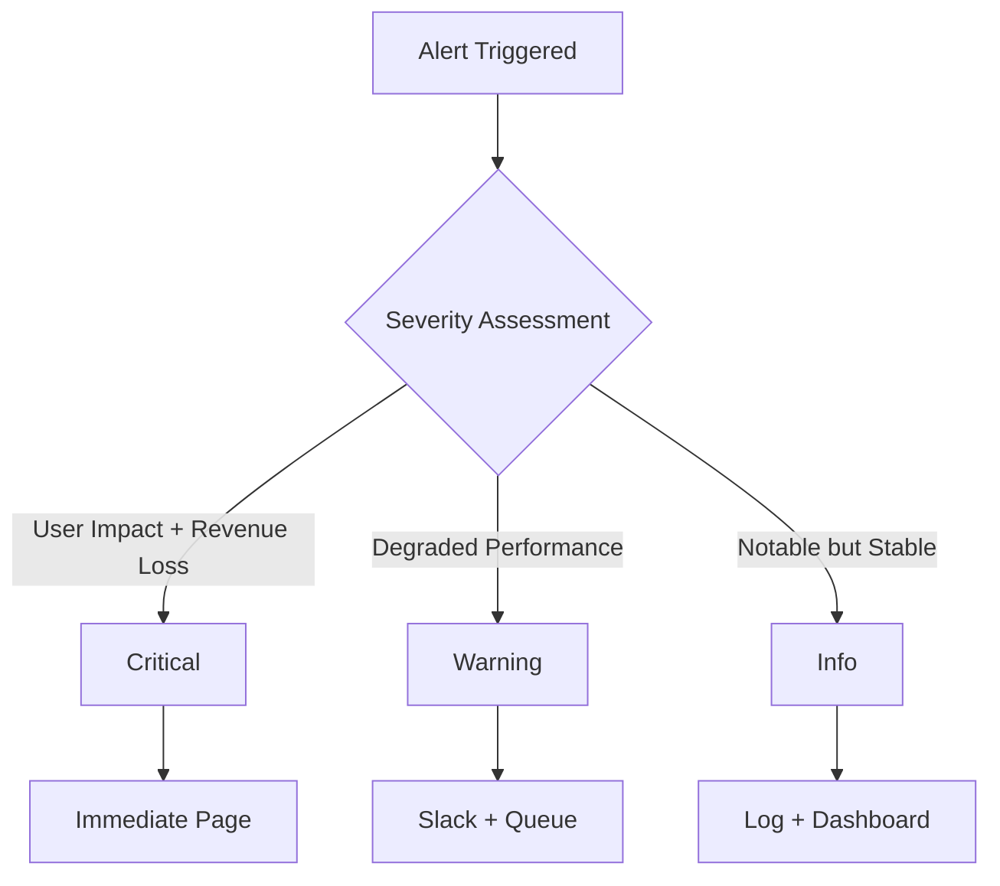
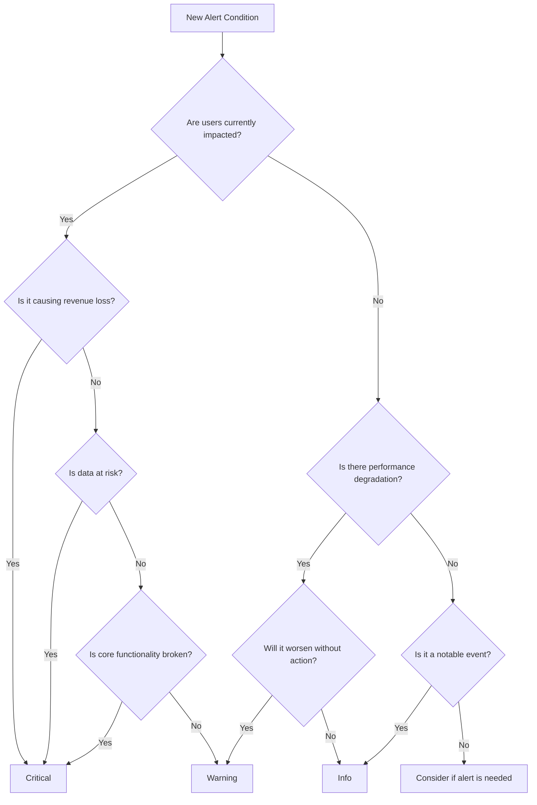
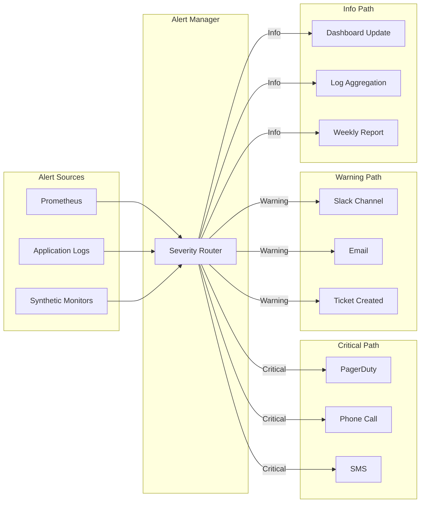
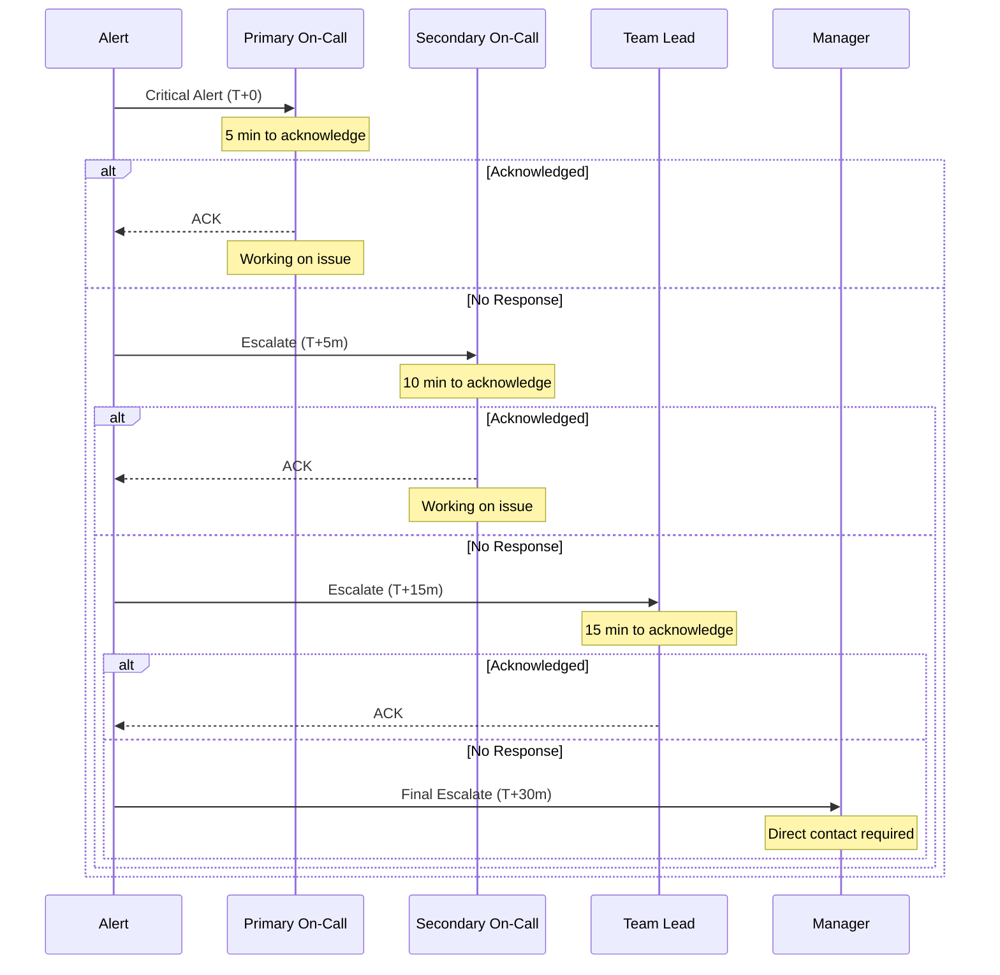
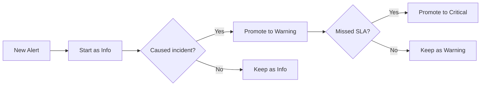

# How to Build Alert Severity Levels

Author: [nawazdhandala](https://github.com/nawazdhandala)

Tags: Observability, Alerting, Incident Management, SRE

Description: Learn how to design alert severity levels for effective incident triage and response.

---

Alert fatigue is real. When every alert screams with equal urgency, teams learn to ignore them all. The solution is a well-designed severity level system that ensures critical issues get immediate attention while informational alerts provide context without disruption.

This guide walks through building a practical alert severity framework, from defining clear levels to implementing severity-based routing and escalation policies.

---

## Why Severity Levels Matter

Without severity levels, on-call engineers face an impossible task: treating every alert as if it were a production outage. The result is predictable.

| Scenario | Outcome |
|----------|---------|
| All alerts are critical | Team ignores alerts (fatigue) |
| No classification system | Slow triage, delayed response |
| Inconsistent definitions | Confusion, finger-pointing |
| Well-defined severity levels | Fast triage, appropriate response |

A severity level system provides:

1. **Clear prioritization** for incident responders
2. **Appropriate routing** to the right teams
3. **Escalation paths** when issues are not resolved
4. **Response time expectations** for SLA compliance
5. **Post-incident analysis** for improvement

---

## The Three Core Severity Levels

While some organizations use five or more levels, three core severities cover most use cases effectively. Adding more levels often creates confusion without improving outcomes.



### Critical (Severity 1)

Critical alerts represent active incidents affecting users or revenue. These demand immediate human intervention, regardless of time of day.

**Definition:** A critical alert indicates a complete or severe degradation of a production service that directly impacts customers or business operations.

**Characteristics:**
- Active user impact (errors, downtime, data loss)
- Revenue-affecting issues (payment failures, checkout broken)
- Security incidents (breach detected, unauthorized access)
- Complete service unavailability
- Data integrity at risk

**Response expectations:**
- Acknowledge within 5 minutes
- First response within 15 minutes
- Status update every 30 minutes until resolved
- Post-incident review required

**Examples:**

```yaml
# Critical alert: Database connection pool exhausted
# All new requests are failing
alert: DatabaseConnectionPoolExhausted
expr: |
  pg_stat_activity_count{state="active"}
  / pg_settings_max_connections
  > 0.95
for: 2m
labels:
  severity: critical
annotations:
  summary: "Database connection pool nearly exhausted"
  description: "{{ $labels.instance }} has {{ $value | humanizePercentage }} of max connections in use"
  runbook: "https://runbooks.example.com/db-connections"
```

```yaml
# Critical alert: Error rate exceeds SLO threshold
# Users are experiencing failures
alert: HighErrorRate
expr: |
  sum(rate(http_requests_total{status=~"5.."}[5m]))
  / sum(rate(http_requests_total[5m]))
  > 0.05
for: 3m
labels:
  severity: critical
annotations:
  summary: "Error rate exceeds 5% SLO threshold"
  description: "Current error rate: {{ $value | humanizePercentage }}"
```

### Warning (Severity 2)

Warning alerts indicate conditions that require attention but are not actively impacting users. These are problems that will become critical if left unaddressed.

**Definition:** A warning alert indicates degraded performance, approaching thresholds, or conditions that could lead to user impact if not addressed promptly.

**Characteristics:**
- Performance degradation (latency increases, slower responses)
- Resource constraints approaching limits
- Partial functionality loss (non-critical features affected)
- Elevated error rates below SLO threshold
- Redundancy loss (one replica down, failover available)

**Response expectations:**
- Acknowledge within 30 minutes during business hours
- Investigation within 2 hours
- Resolution or escalation within 4 hours
- Can wait until next business day if after hours

**Examples:**

```yaml
# Warning alert: Memory usage approaching limit
# Service still functional but at risk
alert: HighMemoryUsage
expr: |
  (node_memory_MemTotal_bytes - node_memory_MemAvailable_bytes)
  / node_memory_MemTotal_bytes
  > 0.85
for: 10m
labels:
  severity: warning
annotations:
  summary: "Memory usage above 85%"
  description: "{{ $labels.instance }} memory at {{ $value | humanizePercentage }}"
  runbook: "https://runbooks.example.com/high-memory"
```

```yaml
# Warning alert: Latency elevated but within tolerance
# Users may notice slowness
alert: ElevatedLatency
expr: |
  histogram_quantile(0.95,
    sum(rate(http_request_duration_seconds_bucket[5m])) by (le)
  ) > 0.5
for: 5m
labels:
  severity: warning
annotations:
  summary: "P95 latency above 500ms"
  description: "Current P95 latency: {{ $value | humanizeDuration }}"
```

### Info (Severity 3)

Info alerts provide situational awareness without requiring immediate action. They document notable events and trends that operators should know about.

**Definition:** An info alert indicates a notable condition that does not require immediate action but provides context for operations or may be useful for investigation.

**Characteristics:**
- Deployments and configuration changes
- Scheduled maintenance windows
- Traffic pattern changes (expected spikes)
- Automated recovery events
- Threshold crossings that self-resolved
- Capacity planning data points

**Response expectations:**
- Review during next business day
- No acknowledgment required
- Used for context and trend analysis
- May trigger batch reporting

**Examples:**

```yaml
# Info alert: Deployment completed
# Useful context for any subsequent issues
alert: DeploymentCompleted
expr: |
  changes(deployment_timestamp_seconds[10m]) > 0
for: 0m
labels:
  severity: info
annotations:
  summary: "New deployment detected"
  description: "Service {{ $labels.service }} deployed version {{ $labels.version }}"
```

```yaml
# Info alert: Auto-scaling event occurred
# Documents capacity changes
alert: AutoScaleEvent
expr: |
  changes(kube_deployment_spec_replicas[5m]) > 0
for: 0m
labels:
  severity: info
annotations:
  summary: "Replica count changed"
  description: "{{ $labels.deployment }} scaled to {{ $value }} replicas"
```

---

## Severity Classification Decision Tree

Use this decision tree to classify alerts consistently:



### Quick Reference Table

| Question | Yes | No |
|----------|-----|-----|
| Users actively affected? | Critical or Warning | Info or Warning |
| Revenue being lost? | Critical | Warning or Info |
| Data integrity at risk? | Critical | Warning or Info |
| Performance degraded? | Warning | Info |
| Will worsen if ignored? | Bump severity up | Keep current level |
| Self-healing likely? | Consider Info | Keep current level |

---

## Implementing Severity-Based Routing

Different severities should route to different channels and responders. Here is a practical routing architecture:



### Alertmanager Configuration Example

```yaml
# Alertmanager configuration for severity-based routing
# Each severity level has distinct routing and notification rules

global:
  # Global settings for all routes
  resolve_timeout: 5m
  slack_api_url: 'https://hooks.slack.com/services/xxx'

# Route tree defines how alerts are handled based on labels
route:
  # Default receiver for unmatched alerts
  receiver: 'default-receiver'

  # Group alerts by these labels
  # Alerts with same values are batched together
  group_by: ['alertname', 'service', 'severity']

  # Wait time before sending first notification for a group
  group_wait: 30s

  # Wait time before sending updates for a group
  group_interval: 5m

  # Wait time before resending a notification
  repeat_interval: 4h

  # Child routes for severity-based routing
  routes:
    # Critical alerts: immediate paging
    - match:
        severity: critical
      receiver: 'critical-pager'
      group_wait: 10s
      group_interval: 1m
      repeat_interval: 15m
      continue: true  # Also send to other matching routes

    # Warning alerts: Slack and ticketing
    - match:
        severity: warning
      receiver: 'warning-slack'
      group_wait: 1m
      group_interval: 10m
      repeat_interval: 2h

    # Info alerts: low priority notification
    - match:
        severity: info
      receiver: 'info-logger'
      group_wait: 5m
      group_interval: 30m
      repeat_interval: 24h

# Receiver definitions
receivers:
  - name: 'default-receiver'
    slack_configs:
      - channel: '#alerts-general'
        title: 'Alert: {{ .GroupLabels.alertname }}'
        text: '{{ range .Alerts }}{{ .Annotations.description }}{{ end }}'

  - name: 'critical-pager'
    pagerduty_configs:
      - service_key: 'your-pagerduty-key'
        severity: critical
        description: '{{ .GroupLabels.alertname }}: {{ .CommonAnnotations.summary }}'
        details:
          firing: '{{ template "pagerduty.default.instances" .Alerts.Firing }}'

    # Also send SMS for critical alerts
    webhook_configs:
      - url: 'https://sms-gateway.example.com/alert'
        send_resolved: true

  - name: 'warning-slack'
    slack_configs:
      - channel: '#alerts-warning'
        color: 'warning'
        title: 'Warning: {{ .GroupLabels.alertname }}'
        text: |
          *Service:* {{ .GroupLabels.service }}
          *Summary:* {{ .CommonAnnotations.summary }}
          *Description:* {{ .CommonAnnotations.description }}
          *Runbook:* {{ .CommonAnnotations.runbook }}

    # Create ticket for tracking
    webhook_configs:
      - url: 'https://jira.example.com/api/create-ticket'
        send_resolved: true

  - name: 'info-logger'
    webhook_configs:
      - url: 'https://logging.example.com/alerts'
        send_resolved: false
```

### Routing Logic in Code

```python
# Alert routing implementation
# Routes alerts to appropriate channels based on severity

from dataclasses import dataclass
from typing import List, Callable, Dict
from enum import Enum
import asyncio


class Severity(Enum):
    """Alert severity levels with numeric priority."""
    CRITICAL = 1  # Highest priority
    WARNING = 2   # Medium priority
    INFO = 3      # Lowest priority


@dataclass
class Alert:
    """Represents an alert with metadata."""
    name: str
    severity: Severity
    service: str
    summary: str
    description: str
    labels: Dict[str, str]
    runbook_url: str = None


@dataclass
class NotificationChannel:
    """A channel for sending notifications."""
    name: str
    send_func: Callable  # Async function to send notification
    severities: List[Severity]  # Which severities use this channel

    async def send(self, alert: Alert) -> bool:
        """Send alert to this channel if severity matches."""
        if alert.severity in self.severities:
            return await self.send_func(alert)
        return False


class AlertRouter:
    """
    Routes alerts to appropriate notification channels based on severity.

    The router maintains a list of channels, each configured to handle
    specific severity levels. When an alert arrives, it is sent to all
    channels that handle its severity level.
    """

    def __init__(self):
        self.channels: List[NotificationChannel] = []
        self.routing_history: List[Dict] = []

    def add_channel(self, channel: NotificationChannel) -> None:
        """Register a notification channel."""
        self.channels.append(channel)

    async def route(self, alert: Alert) -> List[str]:
        """
        Route an alert to appropriate channels.

        Args:
            alert: The alert to route

        Returns:
            List of channel names that received the alert
        """
        notified_channels = []

        # Send to all channels that handle this severity
        tasks = []
        for channel in self.channels:
            if alert.severity in channel.severities:
                tasks.append(self._send_to_channel(channel, alert))

        # Execute all sends concurrently
        results = await asyncio.gather(*tasks, return_exceptions=True)

        # Track which channels were notified
        for channel, result in zip(
            [c for c in self.channels if alert.severity in c.severities],
            results
        ):
            if result is True:
                notified_channels.append(channel.name)

        # Log routing decision
        self.routing_history.append({
            'alert': alert.name,
            'severity': alert.severity.name,
            'channels': notified_channels
        })

        return notified_channels

    async def _send_to_channel(
        self,
        channel: NotificationChannel,
        alert: Alert
    ) -> bool:
        """Send alert to a single channel with error handling."""
        try:
            return await channel.send(alert)
        except Exception as e:
            print(f"Failed to send to {channel.name}: {e}")
            return False


# Example notification functions
async def send_pagerduty(alert: Alert) -> bool:
    """Send alert to PagerDuty for immediate paging."""
    # In production, this would call the PagerDuty API
    print(f"PAGERDUTY: {alert.severity.name} - {alert.summary}")
    return True


async def send_slack(alert: Alert) -> bool:
    """Send alert to Slack channel."""
    # In production, this would call the Slack API
    channel = "#alerts-critical" if alert.severity == Severity.CRITICAL else "#alerts-warning"
    print(f"SLACK {channel}: {alert.summary}")
    return True


async def send_email(alert: Alert) -> bool:
    """Send alert via email."""
    print(f"EMAIL: {alert.severity.name} - {alert.summary}")
    return True


async def log_alert(alert: Alert) -> bool:
    """Log alert for tracking and analysis."""
    print(f"LOG: {alert.severity.name} - {alert.name}")
    return True


# Example usage
async def main():
    # Create router
    router = AlertRouter()

    # Configure channels for each severity level
    router.add_channel(NotificationChannel(
        name="pagerduty",
        send_func=send_pagerduty,
        severities=[Severity.CRITICAL]  # Only critical alerts
    ))

    router.add_channel(NotificationChannel(
        name="slack-urgent",
        send_func=send_slack,
        severities=[Severity.CRITICAL, Severity.WARNING]
    ))

    router.add_channel(NotificationChannel(
        name="email",
        send_func=send_email,
        severities=[Severity.WARNING]  # Only warning alerts
    ))

    router.add_channel(NotificationChannel(
        name="logging",
        send_func=log_alert,
        severities=[Severity.CRITICAL, Severity.WARNING, Severity.INFO]
    ))

    # Route a critical alert
    critical_alert = Alert(
        name="DatabaseDown",
        severity=Severity.CRITICAL,
        service="api-service",
        summary="Primary database unreachable",
        description="Connection to primary PostgreSQL failed",
        labels={"env": "production", "region": "us-east-1"}
    )

    channels = await router.route(critical_alert)
    print(f"Critical alert sent to: {channels}")

    # Route a warning alert
    warning_alert = Alert(
        name="HighMemory",
        severity=Severity.WARNING,
        service="worker-service",
        summary="Memory usage at 87%",
        description="Worker pods approaching memory limit",
        labels={"env": "production"}
    )

    channels = await router.route(warning_alert)
    print(f"Warning alert sent to: {channels}")


if __name__ == "__main__":
    asyncio.run(main())
```

---

## Building an Escalation Policy

Escalation ensures that alerts do not go unaddressed. When the primary responder does not acknowledge within a threshold, the alert escalates to the next tier.



### Escalation Policy Configuration

```yaml
# Escalation policy configuration
# Defines who gets notified and when based on severity

escalation_policies:
  # Critical alert escalation
  critical:
    name: "Critical Incident Escalation"
    description: "Escalation path for critical production incidents"

    # Escalation tiers with timing
    tiers:
      - level: 1
        name: "Primary On-Call"
        delay_minutes: 0  # Immediate notification
        targets:
          - type: schedule
            id: "primary-oncall-schedule"
          - type: user
            id: "oncall-backup@example.com"
        acknowledgment_timeout_minutes: 5

      - level: 2
        name: "Secondary On-Call"
        delay_minutes: 5  # If not acknowledged in 5 minutes
        targets:
          - type: schedule
            id: "secondary-oncall-schedule"
        acknowledgment_timeout_minutes: 10

      - level: 3
        name: "Team Lead"
        delay_minutes: 15  # If still not acknowledged
        targets:
          - type: user
            id: "team-lead@example.com"
          - type: user
            id: "senior-engineer@example.com"
        acknowledgment_timeout_minutes: 15

      - level: 4
        name: "Engineering Manager"
        delay_minutes: 30  # Final escalation
        targets:
          - type: user
            id: "eng-manager@example.com"
        acknowledgment_timeout_minutes: null  # No further escalation

    # Repeat policy for ongoing incidents
    repeat:
      enabled: true
      interval_minutes: 30
      max_repeats: 4

  # Warning alert escalation (business hours only)
  warning:
    name: "Warning Alert Escalation"
    description: "Escalation for warning alerts during business hours"

    # Only escalate during business hours
    time_restrictions:
      type: "business_hours"
      timezone: "America/New_York"
      hours:
        start: "09:00"
        end: "18:00"
      days: ["monday", "tuesday", "wednesday", "thursday", "friday"]

    tiers:
      - level: 1
        name: "On-Duty Engineer"
        delay_minutes: 0
        targets:
          - type: schedule
            id: "daytime-schedule"
        acknowledgment_timeout_minutes: 30

      - level: 2
        name: "Team Channel"
        delay_minutes: 30
        targets:
          - type: slack_channel
            id: "#platform-team"
        acknowledgment_timeout_minutes: 60

      - level: 3
        name: "Create Ticket"
        delay_minutes: 90
        targets:
          - type: webhook
            url: "https://jira.example.com/api/create"
        acknowledgment_timeout_minutes: null

  # Info alerts (no escalation, just logging)
  info:
    name: "Info Alert Handling"
    description: "Info alerts are logged but not escalated"

    tiers:
      - level: 1
        name: "Dashboard and Logs"
        delay_minutes: 0
        targets:
          - type: webhook
            url: "https://logging.example.com/alerts"
        acknowledgment_timeout_minutes: null  # No acknowledgment needed
```

### Escalation Engine Implementation

```python
# Escalation engine implementation
# Manages alert acknowledgment and escalation timing

from dataclasses import dataclass, field
from datetime import datetime, timedelta
from typing import List, Optional, Dict, Callable
from enum import Enum
import asyncio


class AlertStatus(Enum):
    """Current status of an alert."""
    TRIGGERED = "triggered"      # Alert fired, not yet acknowledged
    ACKNOWLEDGED = "acknowledged" # Someone is working on it
    RESOLVED = "resolved"        # Issue is fixed
    SUPPRESSED = "suppressed"    # Manually silenced


@dataclass
class EscalationTier:
    """A single tier in an escalation policy."""
    level: int
    name: str
    delay_minutes: int
    targets: List[str]  # User IDs, schedule IDs, or channel IDs
    ack_timeout_minutes: Optional[int]


@dataclass
class EscalationPolicy:
    """Complete escalation policy definition."""
    name: str
    tiers: List[EscalationTier]
    repeat_interval_minutes: int = 30
    max_repeats: int = 4


@dataclass
class TrackedAlert:
    """An alert being tracked for escalation."""
    id: str
    name: str
    severity: str
    policy: EscalationPolicy
    triggered_at: datetime
    status: AlertStatus = AlertStatus.TRIGGERED
    current_tier: int = 0
    escalation_count: int = 0
    acknowledged_by: Optional[str] = None
    acknowledged_at: Optional[datetime] = None
    notifications_sent: List[Dict] = field(default_factory=list)


class EscalationEngine:
    """
    Manages alert escalation based on policies.

    The engine tracks active alerts and ensures they escalate
    through the defined tiers if not acknowledged within
    the configured timeouts.
    """

    def __init__(self):
        self.active_alerts: Dict[str, TrackedAlert] = {}
        self.notification_handlers: Dict[str, Callable] = {}
        self._running = False

    def register_handler(self, target_type: str, handler: Callable) -> None:
        """
        Register a notification handler for a target type.

        Args:
            target_type: Type of target (e.g., 'user', 'slack', 'pagerduty')
            handler: Async function to send notification
        """
        self.notification_handlers[target_type] = handler

    def trigger_alert(
        self,
        alert_id: str,
        name: str,
        severity: str,
        policy: EscalationPolicy
    ) -> TrackedAlert:
        """
        Start tracking a new alert for escalation.

        Args:
            alert_id: Unique identifier for this alert
            name: Human-readable alert name
            severity: Alert severity level
            policy: Escalation policy to apply

        Returns:
            The tracked alert object
        """
        alert = TrackedAlert(
            id=alert_id,
            name=name,
            severity=severity,
            policy=policy,
            triggered_at=datetime.now()
        )

        self.active_alerts[alert_id] = alert

        # Send initial notification to first tier
        asyncio.create_task(self._notify_tier(alert, 0))

        return alert

    def acknowledge(self, alert_id: str, user: str) -> bool:
        """
        Acknowledge an alert, stopping escalation.

        Args:
            alert_id: ID of alert to acknowledge
            user: User who acknowledged

        Returns:
            True if successful, False if alert not found
        """
        if alert_id not in self.active_alerts:
            return False

        alert = self.active_alerts[alert_id]
        alert.status = AlertStatus.ACKNOWLEDGED
        alert.acknowledged_by = user
        alert.acknowledged_at = datetime.now()

        # Calculate acknowledgment time
        ack_time = (alert.acknowledged_at - alert.triggered_at).total_seconds()
        print(f"Alert {alert_id} acknowledged by {user} in {ack_time:.0f}s")

        return True

    def resolve(self, alert_id: str) -> bool:
        """
        Mark an alert as resolved.

        Args:
            alert_id: ID of alert to resolve

        Returns:
            True if successful, False if alert not found
        """
        if alert_id not in self.active_alerts:
            return False

        alert = self.active_alerts[alert_id]
        alert.status = AlertStatus.RESOLVED

        # Remove from active tracking
        del self.active_alerts[alert_id]

        return True

    async def run_escalation_loop(self) -> None:
        """
        Main loop that checks for alerts needing escalation.

        This runs continuously and checks each active alert
        to see if it needs to escalate to the next tier.
        """
        self._running = True

        while self._running:
            now = datetime.now()

            for alert_id, alert in list(self.active_alerts.items()):
                # Skip acknowledged or resolved alerts
                if alert.status != AlertStatus.TRIGGERED:
                    continue

                # Check if we need to escalate
                await self._check_escalation(alert, now)

            # Check every 30 seconds
            await asyncio.sleep(30)

    async def _check_escalation(
        self,
        alert: TrackedAlert,
        now: datetime
    ) -> None:
        """Check if an alert needs to escalate to the next tier."""
        policy = alert.policy
        current_tier_idx = alert.current_tier

        # Check if we have more tiers to escalate to
        if current_tier_idx >= len(policy.tiers) - 1:
            # At final tier, check if we should repeat
            await self._check_repeat(alert, now)
            return

        current_tier = policy.tiers[current_tier_idx]
        next_tier = policy.tiers[current_tier_idx + 1]

        # Calculate when escalation should happen
        escalate_at = alert.triggered_at + timedelta(
            minutes=next_tier.delay_minutes
        )

        # Time to escalate?
        if now >= escalate_at:
            alert.current_tier = current_tier_idx + 1
            await self._notify_tier(alert, alert.current_tier)

    async def _check_repeat(
        self,
        alert: TrackedAlert,
        now: datetime
    ) -> None:
        """Check if we should repeat notification at final tier."""
        policy = alert.policy

        if alert.escalation_count >= policy.max_repeats:
            return

        # Calculate when to repeat
        last_notification = alert.notifications_sent[-1]['time']
        repeat_at = last_notification + timedelta(
            minutes=policy.repeat_interval_minutes
        )

        if now >= repeat_at:
            alert.escalation_count += 1
            await self._notify_tier(alert, alert.current_tier)

    async def _notify_tier(self, alert: TrackedAlert, tier_idx: int) -> None:
        """Send notifications to all targets in a tier."""
        tier = alert.policy.tiers[tier_idx]

        print(f"Escalating {alert.name} to tier {tier.level}: {tier.name}")

        for target in tier.targets:
            # Determine target type and get handler
            target_type = target.split(':')[0] if ':' in target else 'user'

            if target_type in self.notification_handlers:
                handler = self.notification_handlers[target_type]
                try:
                    await handler(alert, target)
                except Exception as e:
                    print(f"Failed to notify {target}: {e}")

        # Record notification
        alert.notifications_sent.append({
            'tier': tier_idx,
            'targets': tier.targets,
            'time': datetime.now()
        })


# Example usage demonstrating the escalation engine
async def example_usage():
    engine = EscalationEngine()

    # Register notification handlers
    async def notify_user(alert: TrackedAlert, target: str) -> None:
        print(f"  Paging user {target} for {alert.name}")

    async def notify_slack(alert: TrackedAlert, target: str) -> None:
        print(f"  Sending to Slack {target} for {alert.name}")

    engine.register_handler('user', notify_user)
    engine.register_handler('slack', notify_slack)

    # Define escalation policy
    critical_policy = EscalationPolicy(
        name="Critical Escalation",
        tiers=[
            EscalationTier(
                level=1,
                name="Primary On-Call",
                delay_minutes=0,
                targets=["user:oncall@example.com"],
                ack_timeout_minutes=5
            ),
            EscalationTier(
                level=2,
                name="Secondary On-Call",
                delay_minutes=5,
                targets=["user:backup@example.com", "slack:#incidents"],
                ack_timeout_minutes=10
            ),
            EscalationTier(
                level=3,
                name="Management",
                delay_minutes=15,
                targets=["user:manager@example.com"],
                ack_timeout_minutes=None
            )
        ],
        repeat_interval_minutes=30,
        max_repeats=4
    )

    # Trigger an alert
    alert = engine.trigger_alert(
        alert_id="alert-123",
        name="Database Connection Failed",
        severity="critical",
        policy=critical_policy
    )

    # Simulate acknowledgment after 3 minutes
    await asyncio.sleep(2)  # Simulated delay
    engine.acknowledge("alert-123", "oncall@example.com")

    # Later, resolve the alert
    engine.resolve("alert-123")


if __name__ == "__main__":
    asyncio.run(example_usage())
```

---

## Severity Level Best Practices

### 1. Start Conservative, Loosen Over Time

Begin with fewer critical alerts and promote based on actual impact:



### 2. Use Consistent Severity Across Services

Create a shared severity definition that all teams use:

```yaml
# Shared severity definitions
# All services should reference these standards

severity_standards:
  critical:
    user_impact: "Active and significant"
    response_time: "5 minutes to acknowledge"
    examples:
      - "Complete service outage"
      - "Data corruption detected"
      - "Security breach in progress"
      - "Payment processing failure"
    paging: true

  warning:
    user_impact: "Potential or minor"
    response_time: "30 minutes to acknowledge"
    examples:
      - "Elevated error rates below SLO"
      - "Disk space above 80%"
      - "Replica count below desired"
      - "Latency approaching threshold"
    paging: false

  info:
    user_impact: "None"
    response_time: "Next business day review"
    examples:
      - "Deployment completed"
      - "Certificate expires in 30 days"
      - "Auto-scaling event"
      - "Configuration change detected"
    paging: false
```

### 3. Review and Adjust Regularly

Schedule monthly reviews of alert severities:

| Review Question | Action if Yes |
|-----------------|---------------|
| Did this critical alert cause a page for a non-issue? | Demote to warning |
| Did this warning cause an outage when ignored? | Promote to critical |
| Has this info alert ever been useful? | Consider removing |
| Are we ignoring alerts of this severity? | Investigate root cause |

### 4. Document Runbooks for Each Severity

Every alert should link to a runbook with severity-appropriate detail:

```markdown
# Alert: DatabaseConnectionPoolExhausted

## Severity: Critical

## What This Means
The database connection pool has reached 95% capacity. New requests
will start failing if connections are not freed.

## Immediate Actions
1. Check for long-running queries: `SELECT * FROM pg_stat_activity WHERE state = 'active' ORDER BY duration DESC;`
2. Identify connection leaks in application logs
3. If needed, terminate idle connections: `SELECT pg_terminate_backend(pid) FROM pg_stat_activity WHERE state = 'idle' AND query_start < now() - interval '5 minutes';`

## Escalation
If not resolved in 15 minutes, escalate to database team lead.

## Prevention
- Review connection pool sizing
- Add connection timeout to application config
- Enable connection pooling (PgBouncer)
```

---

## Measuring Severity System Effectiveness

Track these metrics to evaluate your severity system:

```yaml
# Metrics for severity system health

metrics:
  # Alert volume by severity
  alert_volume:
    query: "count by (severity) (ALERTS)"
    target:
      critical: "< 5 per week"
      warning: "< 50 per week"
      info: "No limit"

  # Acknowledgment time
  time_to_acknowledge:
    query: "avg(alert_ack_time_seconds) by (severity)"
    target:
      critical: "< 5 minutes"
      warning: "< 30 minutes"

  # False positive rate
  false_positives:
    query: "count(alerts_resolved_no_action) / count(alerts_total)"
    target: "< 10%"

  # Escalation rate
  escalation_rate:
    query: "count(alerts_escalated) / count(alerts_triggered)"
    target: "< 20%"

  # Mean time to resolve by severity
  mttr:
    query: "avg(alert_resolve_time_seconds) by (severity)"
    target:
      critical: "< 1 hour"
      warning: "< 4 hours"
```

---

## Common Mistakes to Avoid

| Mistake | Problem | Solution |
|---------|---------|----------|
| Everything is critical | Alert fatigue, ignored alerts | Use objective criteria for severity |
| No runbooks | Slow response, guesswork | Require runbook link for all alerts |
| Static thresholds | False positives during normal variation | Use anomaly detection or dynamic thresholds |
| Severity by service | Database alerts always critical? | Severity should reflect user impact |
| No escalation | Alerts fall through cracks | Define clear escalation paths |
| Too many levels | Confusion about which level to use | Stick to 3 levels unless you have clear need |

---

## Conclusion

A well-designed alert severity system is the foundation of effective incident management. The key principles:

1. **Three levels are enough** for most organizations: Critical, Warning, and Info
2. **Clear definitions** prevent inconsistency and confusion
3. **Severity-based routing** ensures the right people are notified at the right time
4. **Escalation policies** prevent alerts from being lost
5. **Regular review** keeps the system healthy and relevant

Start with conservative severity assignments, measure the effectiveness of your system, and adjust based on real-world outcomes. The goal is not to minimize alerts but to ensure every alert drives the appropriate response.

---

**Related Reading:**

- [Designing an SRE On-Call Rotation Without Burning Out Your Team](https://oneuptime.com/blog/post/2025-11-28-sre-on-call-rotation-design/view)
- [18 SRE Metrics Worth Tracking](https://oneuptime.com/blog/post/2025-11-28-sre-metrics-to-track/view)
- [The Five Stages of SRE Maturity](https://oneuptime.com/blog/post/2025-09-01-the-five-stages-of-sre-maturity/view)
