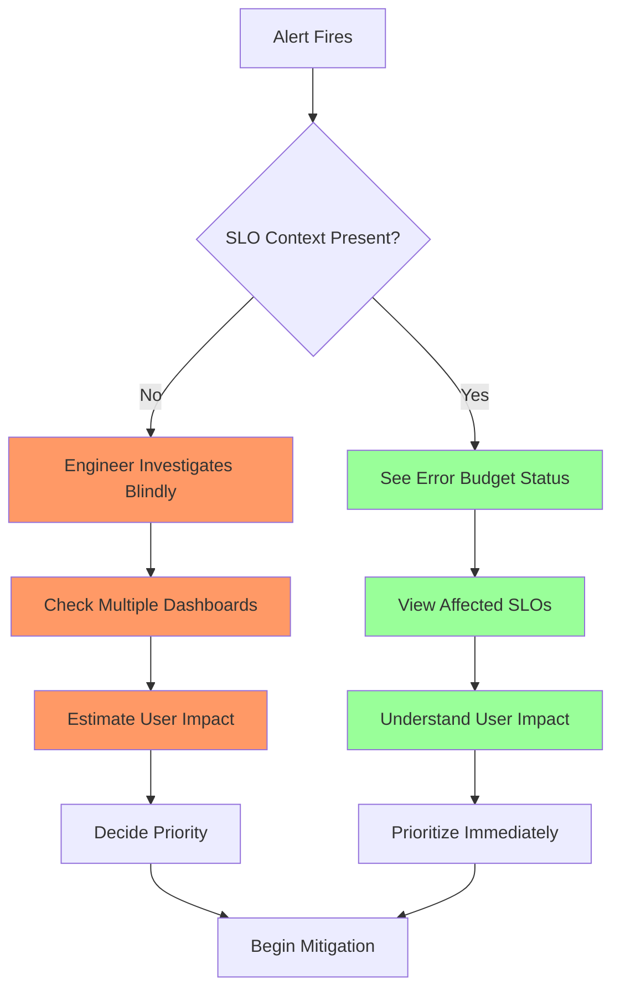
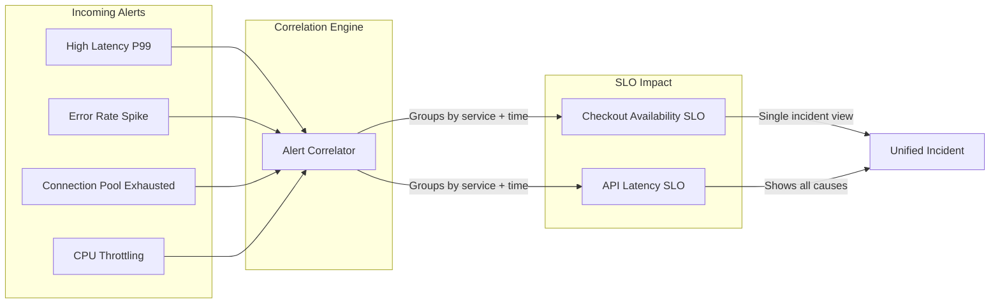
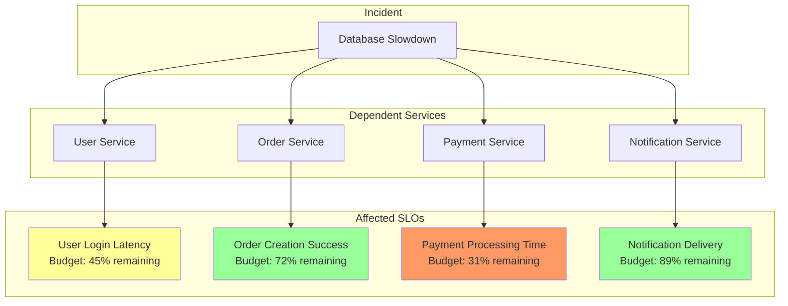
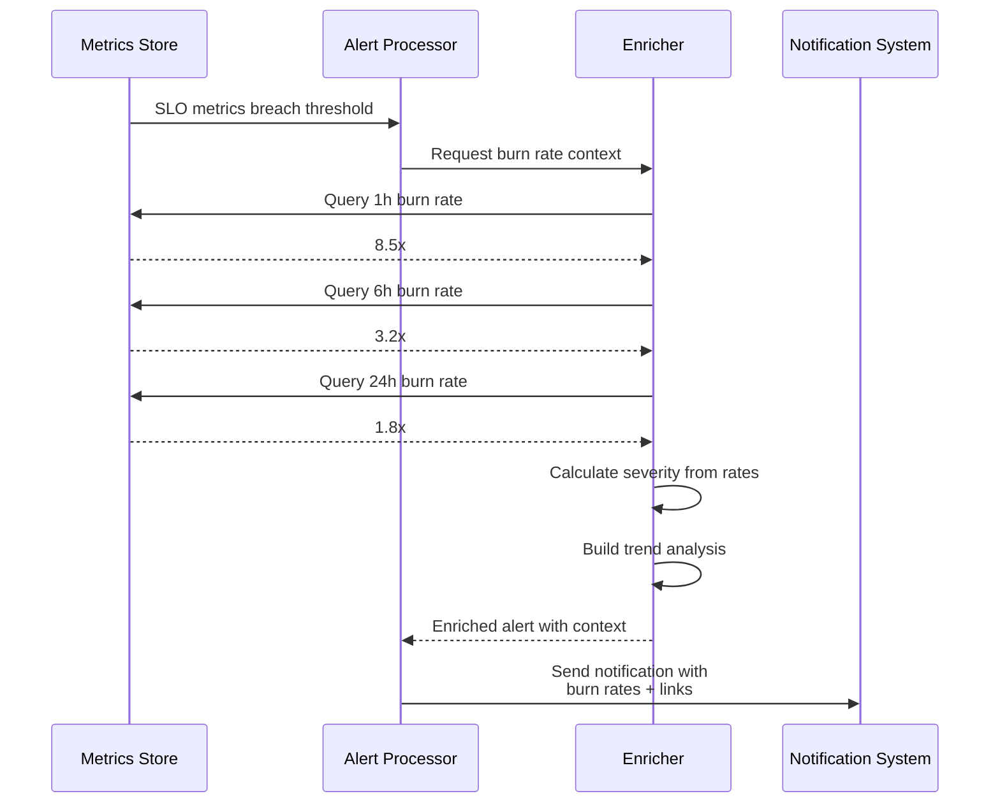

# How to Build Alert SLO Links

Author: [nawazdhandala](https://github.com/nawazdhandala)

Tags: Alerting, SLO, SRE, Observability

Description: Learn how to link alerts to related SLOs for context-aware incident response.

---

Alerts without context force responders to scramble for information during incidents. When an alert fires, the on-call engineer needs to know not just what broke, but how it affects users and service commitments. Linking alerts to their related SLOs provides that context instantly, turning reactive firefighting into informed incident response.

## Why Link Alerts to SLOs?

Traditional alerting tells you something is wrong. SLO-linked alerting tells you how wrong it is and whether you should care. Consider the difference between "CPU at 95%" versus "Checkout latency SLO has consumed 40% of monthly error budget in the last hour."

The first alert might wake someone at 3 AM for a non-issue. The second communicates business impact and urgency in terms everyone understands.

Here is how alert-SLO linkage transforms incident response.



## SLO Dashboard Integration

The first step is making SLO dashboards accessible from alerts. Every alert should include a direct link to the relevant SLO dashboard, showing current status and historical trends.

Define your alert template to include SLO references.

```yaml
# alertmanager-config.yaml
global:
  resolve_timeout: 5m

route:
  group_by: ['alertname', 'slo_name']
  group_wait: 30s
  group_interval: 5m
  repeat_interval: 4h
  receiver: 'sre-team'

receivers:
  - name: 'sre-team'
    webhook_configs:
      - url: 'http://alert-router:8080/webhook'
        send_resolved: true

templates:
  - '/etc/alertmanager/templates/*.tmpl'
```

Create a template that embeds SLO dashboard links.

```go
// alert_template.tmpl
{{ define "slack.slo.message" }}
*Alert:* {{ .GroupLabels.alertname }}
*Severity:* {{ .CommonLabels.severity }}
*Service:* {{ .CommonLabels.service }}

{{ range .Alerts }}
*Summary:* {{ .Annotations.summary }}
*Description:* {{ .Annotations.description }}

*SLO Context:*
- SLO Name: {{ .Labels.slo_name }}
- Current Error Budget: {{ .Labels.error_budget_remaining }}%
- Burn Rate: {{ .Labels.burn_rate }}x

*Quick Links:*
- <{{ .Annotations.slo_dashboard_url }}|SLO Dashboard>
- <{{ .Annotations.runbook_url }}|Runbook>
- <{{ .Annotations.service_dashboard_url }}|Service Dashboard>
{{ end }}
{{ end }}
```

## Error Budget Visibility from Alerts

Error budget status is the most critical context for incident prioritization. Build alerts that calculate and display remaining budget in real-time.

```typescript
// error-budget-calculator.ts
interface SLOConfig {
  name: string;
  target: number;          // e.g., 0.999 for 99.9%
  windowDays: number;      // e.g., 30 for monthly
  service: string;
}

interface ErrorBudgetStatus {
  sloName: string;
  target: number;
  currentSLI: number;
  budgetTotal: number;
  budgetConsumed: number;
  budgetRemaining: number;
  budgetRemainingPercent: number;
  burnRate: number;
  projectedExhaustion: Date | null;
}

export function calculateErrorBudget(
  config: SLOConfig,
  goodEvents: number,
  totalEvents: number,
  windowStartTime: Date
): ErrorBudgetStatus {
  // Calculate current SLI
  const currentSLI = totalEvents > 0 ? goodEvents / totalEvents : 1;

  // Calculate error budget
  const budgetTotal = 1 - config.target;  // e.g., 0.001 for 99.9%
  const errorRate = 1 - currentSLI;
  const budgetConsumed = errorRate;
  const budgetRemaining = Math.max(0, budgetTotal - budgetConsumed);
  const budgetRemainingPercent = (budgetRemaining / budgetTotal) * 100;

  // Calculate burn rate (how fast we're consuming budget)
  const windowMs = config.windowDays * 24 * 60 * 60 * 1000;
  const elapsedMs = Date.now() - windowStartTime.getTime();
  const elapsedFraction = elapsedMs / windowMs;

  // Expected consumption at this point in the window
  const expectedConsumption = elapsedFraction * budgetTotal;
  const burnRate = expectedConsumption > 0
    ? budgetConsumed / expectedConsumption
    : 0;

  // Project when budget will be exhausted at current rate
  let projectedExhaustion: Date | null = null;
  if (burnRate > 1 && budgetRemaining > 0) {
    const remainingMs = (budgetRemaining / budgetConsumed) * elapsedMs;
    projectedExhaustion = new Date(Date.now() + remainingMs);
  }

  return {
    sloName: config.name,
    target: config.target,
    currentSLI,
    budgetTotal,
    budgetConsumed,
    budgetRemaining,
    budgetRemainingPercent,
    burnRate,
    projectedExhaustion
  };
}
```

Use this calculator to enrich alerts with budget context.

```typescript
// alert-enricher.ts
import { calculateErrorBudget, ErrorBudgetStatus } from './error-budget-calculator';

interface Alert {
  name: string;
  labels: Record<string, string>;
  annotations: Record<string, string>;
}

interface EnrichedAlert extends Alert {
  sloContext: ErrorBudgetStatus;
  priorityScore: number;
}

export function enrichAlertWithSLO(
  alert: Alert,
  sloMetrics: { goodEvents: number; totalEvents: number; windowStart: Date },
  sloConfig: SLOConfig
): EnrichedAlert {
  const sloContext = calculateErrorBudget(
    sloConfig,
    sloMetrics.goodEvents,
    sloMetrics.totalEvents,
    sloMetrics.windowStart
  );

  // Calculate priority score based on budget impact
  const priorityScore = calculatePriorityScore(sloContext);

  return {
    ...alert,
    sloContext,
    priorityScore,
    annotations: {
      ...alert.annotations,
      error_budget_remaining: `${sloContext.budgetRemainingPercent.toFixed(1)}%`,
      burn_rate: `${sloContext.burnRate.toFixed(2)}x`,
      slo_dashboard_url: buildSLODashboardUrl(sloConfig.name),
      projected_exhaustion: sloContext.projectedExhaustion?.toISOString() || 'N/A'
    }
  };
}

function calculatePriorityScore(budget: ErrorBudgetStatus): number {
  // Higher score = higher priority
  // Based on remaining budget and burn rate
  let score = 0;

  // Budget remaining factor (0-50 points)
  if (budget.budgetRemainingPercent < 10) score += 50;
  else if (budget.budgetRemainingPercent < 25) score += 40;
  else if (budget.budgetRemainingPercent < 50) score += 30;
  else if (budget.budgetRemainingPercent < 75) score += 20;
  else score += 10;

  // Burn rate factor (0-50 points)
  if (budget.burnRate > 10) score += 50;
  else if (budget.burnRate > 5) score += 40;
  else if (budget.burnRate > 2) score += 30;
  else if (budget.burnRate > 1) score += 20;
  else score += 10;

  return score;
}

function buildSLODashboardUrl(sloName: string): string {
  const baseUrl = process.env.ONEUPTIME_URL || 'https://oneuptime.com';
  return `${baseUrl}/dashboard/slo/${encodeURIComponent(sloName)}`;
}
```

## SLO Violation Alert Correlation

When multiple alerts fire, understanding which ones relate to the same SLO violation helps reduce noise and focus attention. Build a correlation engine that groups related alerts.



Implement the correlation logic.

```typescript
// alert-correlator.ts
interface CorrelationGroup {
  id: string;
  primarySLO: string;
  affectedSLOs: string[];
  alerts: Alert[];
  startTime: Date;
  lastUpdateTime: Date;
  aggregateBurnRate: number;
  rootCauseCandidate: Alert | null;
}

class AlertCorrelator {
  private correlationGroups: Map<string, CorrelationGroup> = new Map();
  private correlationWindowMs = 5 * 60 * 1000; // 5 minutes

  correlateAlert(
    alert: EnrichedAlert,
    sloMappings: Map<string, string[]>
  ): CorrelationGroup {
    // Find existing group or create new one
    const groupKey = this.buildGroupKey(alert);
    let group = this.correlationGroups.get(groupKey);

    if (!group || this.isGroupExpired(group)) {
      group = this.createNewGroup(alert, sloMappings);
      this.correlationGroups.set(groupKey, group);
    } else {
      this.addAlertToGroup(group, alert, sloMappings);
    }

    // Identify potential root cause
    group.rootCauseCandidate = this.identifyRootCause(group);

    return group;
  }

  private buildGroupKey(alert: EnrichedAlert): string {
    const service = alert.labels.service || 'unknown';
    const slo = alert.sloContext.sloName;
    // Round to 5-minute windows
    const timeWindow = Math.floor(Date.now() / this.correlationWindowMs);
    return `${service}:${slo}:${timeWindow}`;
  }

  private createNewGroup(
    alert: EnrichedAlert,
    sloMappings: Map<string, string[]>
  ): CorrelationGroup {
    const affectedSLOs = this.findAffectedSLOs(alert, sloMappings);

    return {
      id: crypto.randomUUID(),
      primarySLO: alert.sloContext.sloName,
      affectedSLOs,
      alerts: [alert],
      startTime: new Date(),
      lastUpdateTime: new Date(),
      aggregateBurnRate: alert.sloContext.burnRate,
      rootCauseCandidate: null
    };
  }

  private addAlertToGroup(
    group: CorrelationGroup,
    alert: EnrichedAlert,
    sloMappings: Map<string, string[]>
  ): void {
    group.alerts.push(alert);
    group.lastUpdateTime = new Date();

    // Update affected SLOs
    const newSLOs = this.findAffectedSLOs(alert, sloMappings);
    for (const slo of newSLOs) {
      if (!group.affectedSLOs.includes(slo)) {
        group.affectedSLOs.push(slo);
      }
    }

    // Update aggregate burn rate (use max)
    group.aggregateBurnRate = Math.max(
      group.aggregateBurnRate,
      alert.sloContext.burnRate
    );
  }

  private findAffectedSLOs(
    alert: EnrichedAlert,
    sloMappings: Map<string, string[]>
  ): string[] {
    const alertType = alert.labels.alertname || '';
    return sloMappings.get(alertType) || [alert.sloContext.sloName];
  }

  private identifyRootCause(group: CorrelationGroup): Alert | null {
    if (group.alerts.length === 0) return null;

    // Sort by timestamp, earliest alert is likely root cause
    const sorted = [...group.alerts].sort(
      (a, b) => new Date(a.labels.timestamp || 0).getTime() -
                new Date(b.labels.timestamp || 0).getTime()
    );

    return sorted[0];
  }

  private isGroupExpired(group: CorrelationGroup): boolean {
    const age = Date.now() - group.lastUpdateTime.getTime();
    return age > this.correlationWindowMs * 2;
  }
}
```

## Multi-SLO Impact Assessment

A single incident can affect multiple SLOs across different services. Build impact assessment that shows the full blast radius.



Implement multi-SLO impact calculation.

```typescript
// impact-assessor.ts
interface ServiceDependency {
  service: string;
  dependsOn: string[];
  slos: string[];
}

interface ImpactAssessment {
  incidentId: string;
  affectedService: string;
  directlyAffectedSLOs: SLOImpact[];
  transitivelyAffectedSLOs: SLOImpact[];
  totalBusinessImpact: string;
  recommendedPriority: 'P1' | 'P2' | 'P3' | 'P4';
}

interface SLOImpact {
  sloName: string;
  service: string;
  budgetRemaining: number;
  burnRate: number;
  impactType: 'direct' | 'transitive';
  estimatedRecoveryTime: number | null;
}

class MultiSLOImpactAssessor {
  constructor(
    private dependencies: ServiceDependency[],
    private sloConfigs: Map<string, SLOConfig>,
    private metricsClient: MetricsClient
  ) {}

  async assessImpact(
    incidentService: string,
    incidentId: string
  ): Promise<ImpactAssessment> {
    // Find directly affected SLOs
    const directSLOs = await this.getDirectlyAffectedSLOs(incidentService);

    // Find transitively affected SLOs through dependency chain
    const dependentServices = this.findDependentServices(incidentService);
    const transitiveSLOs = await this.getTransitivelyAffectedSLOs(
      dependentServices,
      incidentService
    );

    // Calculate business impact
    const allSLOs = [...directSLOs, ...transitiveSLOs];
    const businessImpact = this.calculateBusinessImpact(allSLOs);
    const priority = this.determinePriority(allSLOs);

    return {
      incidentId,
      affectedService: incidentService,
      directlyAffectedSLOs: directSLOs,
      transitivelyAffectedSLOs: transitiveSLOs,
      totalBusinessImpact: businessImpact,
      recommendedPriority: priority
    };
  }

  private async getDirectlyAffectedSLOs(service: string): Promise<SLOImpact[]> {
    const serviceDep = this.dependencies.find(d => d.service === service);
    if (!serviceDep) return [];

    const impacts: SLOImpact[] = [];

    for (const sloName of serviceDep.slos) {
      const config = this.sloConfigs.get(sloName);
      if (!config) continue;

      const metrics = await this.metricsClient.getSLOMetrics(sloName);
      const budget = calculateErrorBudget(
        config,
        metrics.goodEvents,
        metrics.totalEvents,
        metrics.windowStart
      );

      impacts.push({
        sloName,
        service,
        budgetRemaining: budget.budgetRemainingPercent,
        burnRate: budget.burnRate,
        impactType: 'direct',
        estimatedRecoveryTime: this.estimateRecoveryTime(budget)
      });
    }

    return impacts;
  }

  private findDependentServices(service: string): string[] {
    const dependents: string[] = [];

    for (const dep of this.dependencies) {
      if (dep.dependsOn.includes(service)) {
        dependents.push(dep.service);
        // Recursively find services that depend on dependents
        dependents.push(...this.findDependentServices(dep.service));
      }
    }

    return [...new Set(dependents)]; // Remove duplicates
  }

  private async getTransitivelyAffectedSLOs(
    services: string[],
    rootCause: string
  ): Promise<SLOImpact[]> {
    const impacts: SLOImpact[] = [];

    for (const service of services) {
      const directImpacts = await this.getDirectlyAffectedSLOs(service);
      for (const impact of directImpacts) {
        impacts.push({
          ...impact,
          impactType: 'transitive'
        });
      }
    }

    return impacts;
  }

  private calculateBusinessImpact(slos: SLOImpact[]): string {
    const criticalSLOs = slos.filter(s => s.budgetRemaining < 25);
    const warningSLOs = slos.filter(s => s.budgetRemaining >= 25 && s.budgetRemaining < 50);

    if (criticalSLOs.length > 0) {
      return `CRITICAL: ${criticalSLOs.length} SLOs at risk of breach. ` +
             `${criticalSLOs.map(s => s.sloName).join(', ')}`;
    }

    if (warningSLOs.length > 0) {
      return `WARNING: ${warningSLOs.length} SLOs with elevated burn rate. ` +
             `Monitor closely.`;
    }

    return 'LOW: All affected SLOs have sufficient error budget.';
  }

  private determinePriority(slos: SLOImpact[]): 'P1' | 'P2' | 'P3' | 'P4' {
    const minBudget = Math.min(...slos.map(s => s.budgetRemaining));
    const maxBurnRate = Math.max(...slos.map(s => s.burnRate));

    if (minBudget < 10 || maxBurnRate > 10) return 'P1';
    if (minBudget < 25 || maxBurnRate > 5) return 'P2';
    if (minBudget < 50 || maxBurnRate > 2) return 'P3';
    return 'P4';
  }

  private estimateRecoveryTime(budget: ErrorBudgetStatus): number | null {
    if (budget.burnRate <= 1) return null; // Not burning budget abnormally

    // Estimate based on current burn rate
    // Time to return to normal burn rate
    const excessBurnRate = budget.burnRate - 1;
    const recoveryHours = Math.ceil(excessBurnRate * 2); // Rough estimate
    return recoveryHours;
  }
}
```

## SLO Trend Visualization Links

Alerts should link to trend visualizations that show how the SLO has behaved over time. This context helps responders understand whether an issue is new or recurring.

```typescript
// trend-link-builder.ts
interface TrendLinkConfig {
  baseUrl: string;
  defaultTimeRange: string;
  dashboardId: string;
}

interface TrendLinks {
  currentStatus: string;
  last24Hours: string;
  last7Days: string;
  last30Days: string;
  burnRateChart: string;
  errorBudgetHistory: string;
  compareToLastWeek: string;
}

export function buildTrendLinks(
  sloName: string,
  service: string,
  config: TrendLinkConfig
): TrendLinks {
  const baseParams = new URLSearchParams({
    slo: sloName,
    service: service,
    dashboard: config.dashboardId
  });

  return {
    currentStatus: `${config.baseUrl}/slo/${sloName}/status?${baseParams}`,

    last24Hours: `${config.baseUrl}/slo/${sloName}/trends?` +
      `${baseParams}&from=now-24h&to=now`,

    last7Days: `${config.baseUrl}/slo/${sloName}/trends?` +
      `${baseParams}&from=now-7d&to=now`,

    last30Days: `${config.baseUrl}/slo/${sloName}/trends?` +
      `${baseParams}&from=now-30d&to=now`,

    burnRateChart: `${config.baseUrl}/slo/${sloName}/burn-rate?` +
      `${baseParams}&windows=1h,6h,24h,72h`,

    errorBudgetHistory: `${config.baseUrl}/slo/${sloName}/budget-history?` +
      `${baseParams}&from=now-30d&to=now`,

    compareToLastWeek: `${config.baseUrl}/slo/${sloName}/compare?` +
      `${baseParams}&baseline=now-7d&comparison=now`
  };
}

// Embed in alert annotations
export function enrichAlertWithTrendLinks(
  alert: Alert,
  sloName: string,
  service: string
): Alert {
  const config: TrendLinkConfig = {
    baseUrl: process.env.ONEUPTIME_URL || 'https://oneuptime.com',
    defaultTimeRange: '24h',
    dashboardId: 'slo-overview'
  };

  const links = buildTrendLinks(sloName, service, config);

  return {
    ...alert,
    annotations: {
      ...alert.annotations,
      slo_current_status_url: links.currentStatus,
      slo_trends_24h_url: links.last24Hours,
      slo_trends_7d_url: links.last7Days,
      slo_burn_rate_url: links.burnRateChart,
      slo_budget_history_url: links.errorBudgetHistory
    }
  };
}
```

## Burn Rate Context in Alerts

Burn rate is the most actionable metric for incident prioritization. Include multiple burn rate windows in alerts to show both immediate and sustained impact.



Implement multi-window burn rate calculation.

```typescript
// burn-rate-calculator.ts
interface BurnRateWindow {
  windowName: string;
  durationHours: number;
  burnRate: number;
  severity: 'critical' | 'warning' | 'normal';
}

interface BurnRateContext {
  windows: BurnRateWindow[];
  trend: 'accelerating' | 'decelerating' | 'stable';
  recommendation: string;
  alertSeverity: 'critical' | 'high' | 'medium' | 'low';
}

class BurnRateCalculator {
  private readonly windowConfigs = [
    { name: '1h', hours: 1, criticalThreshold: 14.4, warningThreshold: 6 },
    { name: '6h', hours: 6, criticalThreshold: 6, warningThreshold: 3 },
    { name: '24h', hours: 24, criticalThreshold: 3, warningThreshold: 1.5 },
    { name: '72h', hours: 72, criticalThreshold: 1.5, warningThreshold: 1 }
  ];

  async calculateBurnRateContext(
    sloConfig: SLOConfig,
    metricsClient: MetricsClient
  ): Promise<BurnRateContext> {
    const windows: BurnRateWindow[] = [];

    for (const config of this.windowConfigs) {
      const metrics = await metricsClient.getSLOMetrics(
        sloConfig.name,
        config.hours
      );

      const budget = calculateErrorBudget(
        sloConfig,
        metrics.goodEvents,
        metrics.totalEvents,
        new Date(Date.now() - config.hours * 60 * 60 * 1000)
      );

      const severity = this.determineSeverity(
        budget.burnRate,
        config.criticalThreshold,
        config.warningThreshold
      );

      windows.push({
        windowName: config.name,
        durationHours: config.hours,
        burnRate: budget.burnRate,
        severity
      });
    }

    const trend = this.analyzeTrend(windows);
    const alertSeverity = this.determineOverallSeverity(windows);
    const recommendation = this.generateRecommendation(windows, trend);

    return {
      windows,
      trend,
      recommendation,
      alertSeverity
    };
  }

  private determineSeverity(
    burnRate: number,
    criticalThreshold: number,
    warningThreshold: number
  ): 'critical' | 'warning' | 'normal' {
    if (burnRate >= criticalThreshold) return 'critical';
    if (burnRate >= warningThreshold) return 'warning';
    return 'normal';
  }

  private analyzeTrend(windows: BurnRateWindow[]): 'accelerating' | 'decelerating' | 'stable' {
    if (windows.length < 2) return 'stable';

    // Compare short-term to long-term burn rates
    const shortTerm = windows[0].burnRate;  // 1h
    const longTerm = windows[windows.length - 1].burnRate;  // 72h

    const ratio = shortTerm / longTerm;

    if (ratio > 1.5) return 'accelerating';
    if (ratio < 0.7) return 'decelerating';
    return 'stable';
  }

  private determineOverallSeverity(
    windows: BurnRateWindow[]
  ): 'critical' | 'high' | 'medium' | 'low' {
    const criticalCount = windows.filter(w => w.severity === 'critical').length;
    const warningCount = windows.filter(w => w.severity === 'warning').length;

    // Critical if 1h OR 6h windows are critical
    if (windows.slice(0, 2).some(w => w.severity === 'critical')) {
      return 'critical';
    }

    // High if multiple windows show warning
    if (warningCount >= 2) return 'high';

    // Medium if any warning
    if (warningCount >= 1) return 'medium';

    return 'low';
  }

  private generateRecommendation(
    windows: BurnRateWindow[],
    trend: string
  ): string {
    const shortTermBurn = windows[0];

    if (shortTermBurn.severity === 'critical') {
      if (trend === 'accelerating') {
        return 'IMMEDIATE ACTION REQUIRED: Burn rate is critical and accelerating. ' +
               'Consider rolling back recent changes or scaling resources.';
      }
      return 'URGENT: High burn rate detected. Investigate root cause and ' +
             'consider mitigation actions.';
    }

    if (shortTermBurn.severity === 'warning') {
      if (trend === 'accelerating') {
        return 'WARNING: Burn rate is elevated and increasing. ' +
               'Monitor closely and prepare mitigation plan.';
      }
      return 'ATTENTION: Elevated burn rate detected. Review recent changes ' +
             'and system health.';
    }

    if (trend === 'decelerating') {
      return 'IMPROVING: Burn rate is returning to normal. Continue monitoring.';
    }

    return 'NORMAL: SLO burn rate is within acceptable limits.';
  }
}
```

## Putting It All Together

Here is a complete alert enrichment pipeline that combines all the SLO linking capabilities.

```typescript
// alert-pipeline.ts
import express from 'express';
import { AlertCorrelator } from './alert-correlator';
import { MultiSLOImpactAssessor } from './impact-assessor';
import { BurnRateCalculator } from './burn-rate-calculator';
import { enrichAlertWithTrendLinks } from './trend-link-builder';

const app = express();
app.use(express.json());

const correlator = new AlertCorrelator();
const impactAssessor = new MultiSLOImpactAssessor(dependencies, sloConfigs, metricsClient);
const burnRateCalc = new BurnRateCalculator();

app.post('/webhook', async (req, res) => {
  const alerts = req.body.alerts || [];
  const enrichedAlerts = [];

  for (const alert of alerts) {
    try {
      // Step 1: Calculate burn rate context
      const sloConfig = getSLOConfigForAlert(alert);
      const burnRateContext = await burnRateCalc.calculateBurnRateContext(
        sloConfig,
        metricsClient
      );

      // Step 2: Enrich with error budget status
      const metrics = await metricsClient.getSLOMetrics(sloConfig.name);
      const enrichedAlert = enrichAlertWithSLO(alert, metrics, sloConfig);

      // Step 3: Add trend visualization links
      const withTrends = enrichAlertWithTrendLinks(
        enrichedAlert,
        sloConfig.name,
        alert.labels.service
      );

      // Step 4: Correlate with related alerts
      const correlationGroup = correlator.correlateAlert(
        withTrends,
        sloMappings
      );

      // Step 5: Assess multi-SLO impact
      const impact = await impactAssessor.assessImpact(
        alert.labels.service,
        correlationGroup.id
      );

      // Build final enriched alert
      enrichedAlerts.push({
        ...withTrends,
        burnRateContext,
        correlationGroup: {
          id: correlationGroup.id,
          alertCount: correlationGroup.alerts.length,
          affectedSLOs: correlationGroup.affectedSLOs
        },
        impactAssessment: {
          priority: impact.recommendedPriority,
          businessImpact: impact.totalBusinessImpact,
          affectedSLOCount: impact.directlyAffectedSLOs.length +
                           impact.transitivelyAffectedSLOs.length
        }
      });

    } catch (error) {
      console.error('Failed to enrich alert:', error);
      enrichedAlerts.push(alert); // Pass through unmodified
    }
  }

  // Forward to notification system
  await sendToNotificationSystem(enrichedAlerts);

  res.json({ processed: enrichedAlerts.length });
});

app.listen(8080, () => {
  console.log('Alert enrichment pipeline running on port 8080');
});
```

## Best Practices

**Start with high-value SLOs**: Link alerts to your most critical SLOs first. Customer-facing availability and latency SLOs typically provide the most actionable context.

**Use multiple burn rate windows**: A single burn rate can be misleading. Show 1h, 6h, and 24h windows so responders can distinguish between spikes and sustained issues.

**Automate impact assessment**: Manual blast radius analysis delays incident response. Pre-compute service dependencies and automate impact calculations.

**Keep links current**: Dashboard URLs change. Use parameterized link builders that dynamically construct URLs based on current configurations.

**Correlate before notifying**: Group related alerts before sending notifications. A single notification about 5 correlated alerts is more actionable than 5 separate pages.

**Include trend context**: Show whether conditions are improving or degrading. Responders make different decisions when burn rate is accelerating versus stabilizing.

---

Alert-SLO linking transforms incident response from reactive scrambling to informed decision-making. When an alert includes error budget status, burn rate trends, and multi-SLO impact assessment, responders can immediately prioritize and act. Build these links into your alerting pipeline, and every page becomes an invitation to fix what matters most.
