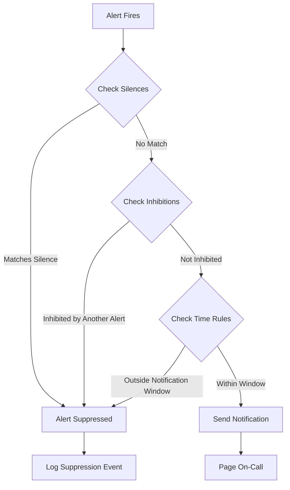
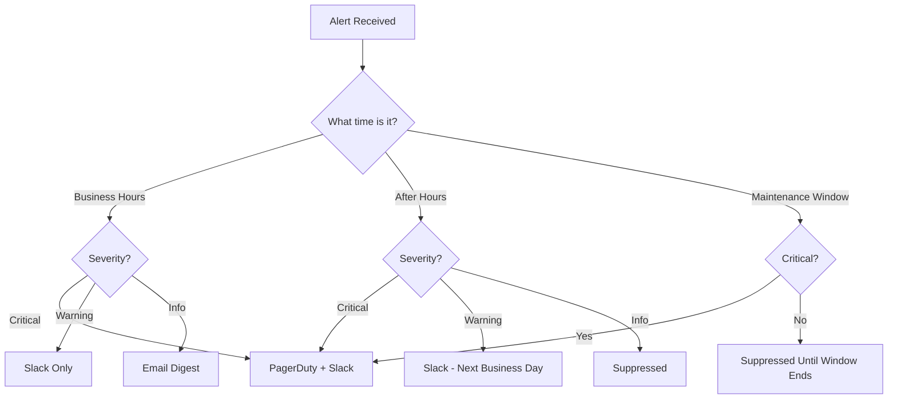
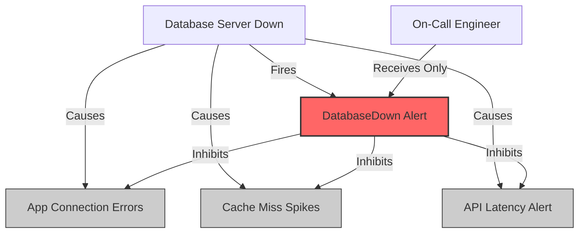
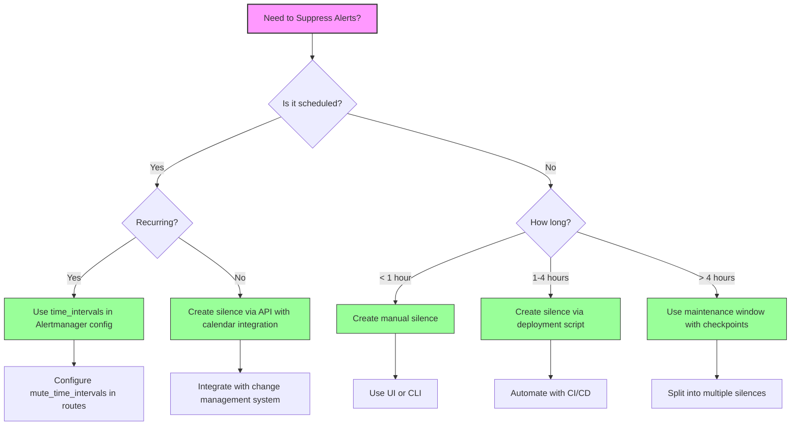

# How to Create Alert Suppression Rules

Author: [nawazdhandala](https://github.com/nawazdhandala)

Tags: Observability, Alerting, Alertmanager, SRE

Description: Learn how to implement alert suppression to silence alerts during maintenance or known issues.

---

Alert fatigue is real. When every deployment triggers a cascade of notifications, when planned maintenance fires off pages at 2 AM, when a known issue generates the same alert every five minutes, your on-call engineers lose trust in the system. They start ignoring alerts. That is when real incidents slip through.

Alert suppression solves this problem. It lets you temporarily silence alerts based on specific criteria: time windows, labels, or relationships between alerts. Done right, suppression keeps your pager meaningful while letting engineers focus on actual problems.

This guide covers three core suppression strategies: silences, maintenance windows, and time-based suppression. We will use Prometheus Alertmanager examples throughout, with working code you can adapt to your environment.

---

## How Alert Suppression Works



Alertmanager processes alerts through multiple suppression layers:

1. **Silences** - Manual or API-created rules that mute specific alerts
2. **Inhibitions** - Automatic suppression when related alerts are already firing
3. **Time-based routing** - Routes that only notify during specific hours

Each layer has its use case. Understanding when to use which approach is key to effective alert management.

---

## Silences: Temporary Muting

Silences are the most common suppression mechanism. They match alerts based on label selectors and suppress notifications for a defined duration.

### Creating Silences via the UI

Most Alertmanager UIs provide a "New Silence" form. You specify:

- **Matchers**: Label selectors that identify which alerts to silence
- **Start time**: When the silence begins (defaults to now)
- **End time**: When the silence expires
- **Creator**: Who created the silence (for accountability)
- **Comment**: Why this silence exists (required for audit trails)

### Creating Silences via the API

The Alertmanager API lets you automate silence creation. This is essential for integrating with deployment pipelines, maintenance schedulers, or incident response tooling.

```bash
#!/bin/bash
# create-silence.sh
# Creates a silence in Alertmanager for a specified duration

# Configuration
ALERTMANAGER_URL="http://alertmanager:9093"
STARTS_AT=$(date -u +"%Y-%m-%dT%H:%M:%SZ")
# Silence for 2 hours
ENDS_AT=$(date -u -d "+2 hours" +"%Y-%m-%dT%H:%M:%SZ")

# Create silence payload
# Matches all alerts where:
# - alertname equals "HighCPUUsage"
# - AND service equals "payment-api"
PAYLOAD=$(cat <<EOF
{
  "matchers": [
    {
      "name": "alertname",
      "value": "HighCPUUsage",
      "isRegex": false
    },
    {
      "name": "service",
      "value": "payment-api",
      "isRegex": false
    }
  ],
  "startsAt": "${STARTS_AT}",
  "endsAt": "${ENDS_AT}",
  "createdBy": "deployment-pipeline",
  "comment": "Silencing during payment-api v2.3.1 deployment"
}
EOF
)

# Send request to create silence
# Returns the silence ID on success
curl -X POST "${ALERTMANAGER_URL}/api/v2/silences" \
  -H "Content-Type: application/json" \
  -d "${PAYLOAD}"
```

### Using Regex Matchers

For more flexible matching, use regex patterns:

```bash
#!/bin/bash
# create-regex-silence.sh
# Silences all database-related alerts across all environments

ALERTMANAGER_URL="http://alertmanager:9093"
STARTS_AT=$(date -u +"%Y-%m-%dT%H:%M:%SZ")
ENDS_AT=$(date -u -d "+4 hours" +"%Y-%m-%dT%H:%M:%SZ")

# This silence matches any alert where:
# - alertname contains "Database" or "DB" (case sensitive)
# - environment matches staging or production
PAYLOAD=$(cat <<EOF
{
  "matchers": [
    {
      "name": "alertname",
      "value": ".*(Database|DB).*",
      "isRegex": true
    },
    {
      "name": "environment",
      "value": "staging|production",
      "isRegex": true
    }
  ],
  "startsAt": "${STARTS_AT}",
  "endsAt": "${ENDS_AT}",
  "createdBy": "dba-team",
  "comment": "Database maintenance window - schema migration"
}
EOF
)

curl -X POST "${ALERTMANAGER_URL}/api/v2/silences" \
  -H "Content-Type: application/json" \
  -d "${PAYLOAD}"
```

### Listing and Managing Silences

```bash
#!/bin/bash
# manage-silences.sh
# Utility functions for managing Alertmanager silences

ALERTMANAGER_URL="http://alertmanager:9093"

# List all active silences
# Filter parameter options: active, pending, expired
list_silences() {
  local filter="${1:-active}"
  curl -s "${ALERTMANAGER_URL}/api/v2/silences?filter=${filter}" | jq '.'
}

# Get a specific silence by ID
get_silence() {
  local silence_id="$1"
  curl -s "${ALERTMANAGER_URL}/api/v2/silence/${silence_id}" | jq '.'
}

# Delete (expire) a silence immediately
# This does not delete the silence record, it sets endsAt to now
delete_silence() {
  local silence_id="$1"
  curl -X DELETE "${ALERTMANAGER_URL}/api/v2/silence/${silence_id}"
}

# Example usage:
# list_silences active
# get_silence "abc123-def456"
# delete_silence "abc123-def456"
```

---

## Maintenance Windows: Scheduled Suppression

Maintenance windows extend silences with scheduling capabilities. Instead of manually creating silences before each maintenance, you define recurring windows that automatically suppress alerts.

### Alertmanager Configuration for Maintenance Windows

```yaml
# alertmanager.yml
# Configure routes to handle maintenance windows

global:
  # Default receiver when no routes match
  resolve_timeout: 5m

# Time intervals define when notifications should be sent
# or suppressed based on time of day and day of week
time_intervals:
  # Business hours: Monday-Friday, 9 AM to 6 PM UTC
  - name: business-hours
    time_intervals:
      - weekdays: ['monday:friday']
        times:
          - start_time: '09:00'
            end_time: '18:00'

  # Weekly maintenance window: Sunday 2-6 AM UTC
  - name: weekly-maintenance
    time_intervals:
      - weekdays: ['sunday']
        times:
          - start_time: '02:00'
            end_time: '06:00'

  # Monthly maintenance: First Saturday of month, midnight to 4 AM
  - name: monthly-maintenance
    time_intervals:
      - weekdays: ['saturday']
        days_of_month: ['1:7']
        times:
          - start_time: '00:00'
            end_time: '04:00'

route:
  # Default receiver for all alerts
  receiver: 'default-receiver'
  # Group alerts by these labels to reduce notification volume
  group_by: ['alertname', 'cluster', 'service']
  # Wait before sending first notification for a group
  group_wait: 30s
  # Wait before sending updates for a group
  group_interval: 5m
  # Wait before resending a notification
  repeat_interval: 4h

  routes:
    # Route for infrastructure alerts during maintenance
    - match:
        team: infrastructure
      receiver: 'infrastructure-team'
      # Mute during weekly maintenance window
      mute_time_intervals:
        - weekly-maintenance
        - monthly-maintenance

    # Route for non-critical alerts
    - match:
        severity: warning
      receiver: 'slack-warnings'
      # Only notify during business hours
      active_time_intervals:
        - business-hours

    # Critical alerts always go through
    - match:
        severity: critical
      receiver: 'pagerduty-critical'
      # No time restrictions for critical alerts

receivers:
  - name: 'default-receiver'
    webhook_configs:
      - url: 'http://webhook-handler:5000/alerts'

  - name: 'infrastructure-team'
    email_configs:
      - to: 'infra@example.com'
    slack_configs:
      - channel: '#infra-alerts'

  - name: 'slack-warnings'
    slack_configs:
      - channel: '#alerts-warnings'

  - name: 'pagerduty-critical'
    pagerduty_configs:
      - service_key: '<pagerduty-service-key>'
```

### Programmatic Maintenance Windows

For dynamic maintenance scheduling, create silences programmatically:

```python
#!/usr/bin/env python3
"""
maintenance_scheduler.py
Schedule and manage maintenance windows via Alertmanager API.

This script creates silences based on a maintenance schedule,
integrates with calendar systems, and handles recurring windows.
"""

import requests
import json
from datetime import datetime, timedelta
from typing import List, Dict, Optional
import logging

logging.basicConfig(level=logging.INFO)
logger = logging.getLogger(__name__)


class MaintenanceScheduler:
    """
    Manages maintenance windows by creating and tracking
    Alertmanager silences.
    """

    def __init__(self, alertmanager_url: str):
        """
        Initialize the scheduler.

        Args:
            alertmanager_url: Base URL of Alertmanager (e.g., http://alertmanager:9093)
        """
        self.alertmanager_url = alertmanager_url.rstrip('/')
        self.api_base = f"{self.alertmanager_url}/api/v2"

    def create_maintenance_window(
        self,
        name: str,
        matchers: List[Dict],
        duration_hours: float,
        start_time: Optional[datetime] = None,
        created_by: str = "maintenance-scheduler"
    ) -> Optional[str]:
        """
        Create a maintenance window (silence) in Alertmanager.

        Args:
            name: Human-readable name for the maintenance window
            matchers: List of label matchers to identify alerts to silence
                      Format: [{"name": "label", "value": "value", "isRegex": False}]
            duration_hours: How long the window should last
            start_time: When to start (defaults to now)
            created_by: Who/what is creating this window

        Returns:
            Silence ID if successful, None otherwise

        Example:
            scheduler.create_maintenance_window(
                name="Database upgrade",
                matchers=[
                    {"name": "service", "value": "postgres", "isRegex": False},
                    {"name": "severity", "value": "warning|critical", "isRegex": True}
                ],
                duration_hours=2
            )
        """
        if start_time is None:
            start_time = datetime.utcnow()

        end_time = start_time + timedelta(hours=duration_hours)

        payload = {
            "matchers": matchers,
            "startsAt": start_time.strftime("%Y-%m-%dT%H:%M:%SZ"),
            "endsAt": end_time.strftime("%Y-%m-%dT%H:%M:%SZ"),
            "createdBy": created_by,
            "comment": f"Maintenance window: {name}"
        }

        try:
            response = requests.post(
                f"{self.api_base}/silences",
                headers={"Content-Type": "application/json"},
                data=json.dumps(payload),
                timeout=10
            )
            response.raise_for_status()

            silence_id = response.json().get("silenceID")
            logger.info(f"Created maintenance window '{name}' with ID: {silence_id}")
            return silence_id

        except requests.RequestException as e:
            logger.error(f"Failed to create maintenance window: {e}")
            return None

    def extend_maintenance_window(
        self,
        silence_id: str,
        additional_hours: float
    ) -> bool:
        """
        Extend an existing maintenance window.

        Alertmanager does not support updating silences directly.
        We must delete the old one and create a new one with
        extended end time.

        Args:
            silence_id: ID of the silence to extend
            additional_hours: How many hours to add

        Returns:
            True if successful, False otherwise
        """
        # First, get the existing silence
        try:
            response = requests.get(
                f"{self.api_base}/silence/{silence_id}",
                timeout=10
            )
            response.raise_for_status()
            silence = response.json()

        except requests.RequestException as e:
            logger.error(f"Failed to get silence {silence_id}: {e}")
            return False

        # Calculate new end time
        current_end = datetime.strptime(
            silence["endsAt"].replace("Z", ""),
            "%Y-%m-%dT%H:%M:%S"
        )
        new_end = current_end + timedelta(hours=additional_hours)

        # Create new silence with extended time
        new_payload = {
            "matchers": silence["matchers"],
            "startsAt": silence["startsAt"],
            "endsAt": new_end.strftime("%Y-%m-%dT%H:%M:%SZ"),
            "createdBy": silence["createdBy"],
            "comment": f"{silence['comment']} (extended by {additional_hours}h)"
        }

        try:
            # Delete old silence
            requests.delete(
                f"{self.api_base}/silence/{silence_id}",
                timeout=10
            )

            # Create new one
            response = requests.post(
                f"{self.api_base}/silences",
                headers={"Content-Type": "application/json"},
                data=json.dumps(new_payload),
                timeout=10
            )
            response.raise_for_status()

            new_id = response.json().get("silenceID")
            logger.info(f"Extended maintenance window. New ID: {new_id}")
            return True

        except requests.RequestException as e:
            logger.error(f"Failed to extend maintenance window: {e}")
            return False

    def end_maintenance_window(self, silence_id: str) -> bool:
        """
        End a maintenance window early.

        Args:
            silence_id: ID of the silence to expire

        Returns:
            True if successful, False otherwise
        """
        try:
            response = requests.delete(
                f"{self.api_base}/silence/{silence_id}",
                timeout=10
            )
            response.raise_for_status()
            logger.info(f"Ended maintenance window: {silence_id}")
            return True

        except requests.RequestException as e:
            logger.error(f"Failed to end maintenance window: {e}")
            return False

    def list_active_windows(self) -> List[Dict]:
        """
        List all currently active maintenance windows.

        Returns:
            List of active silence objects
        """
        try:
            response = requests.get(
                f"{self.api_base}/silences",
                params={"filter": "active"},
                timeout=10
            )
            response.raise_for_status()
            return response.json()

        except requests.RequestException as e:
            logger.error(f"Failed to list active windows: {e}")
            return []


# Example: Integration with deployment pipeline
def deployment_maintenance_window(
    service_name: str,
    environment: str,
    duration_minutes: int = 30
):
    """
    Create a maintenance window for a deployment.

    Call this at the start of your deployment to suppress
    expected alerts during the rollout.

    Args:
        service_name: Name of the service being deployed
        environment: Target environment (staging, production, etc.)
        duration_minutes: Expected deployment duration
    """
    scheduler = MaintenanceScheduler("http://alertmanager:9093")

    matchers = [
        {"name": "service", "value": service_name, "isRegex": False},
        {"name": "environment", "value": environment, "isRegex": False},
        # Suppress warnings and non-critical alerts
        # Critical alerts still go through
        {"name": "severity", "value": "warning|info", "isRegex": True}
    ]

    silence_id = scheduler.create_maintenance_window(
        name=f"Deployment: {service_name} to {environment}",
        matchers=matchers,
        duration_hours=duration_minutes / 60,
        created_by="ci-cd-pipeline"
    )

    # Return the ID so the deployment script can extend or end it
    return silence_id


if __name__ == "__main__":
    # Example usage
    scheduler = MaintenanceScheduler("http://alertmanager:9093")

    # Create a 2-hour maintenance window for database work
    silence_id = scheduler.create_maintenance_window(
        name="PostgreSQL upgrade to 15.2",
        matchers=[
            {"name": "service", "value": "postgres.*", "isRegex": True},
            {"name": "cluster", "value": "prod-us-east", "isRegex": False}
        ],
        duration_hours=2,
        created_by="dba-team"
    )

    print(f"Created silence: {silence_id}")
```

---

## Time-Based Suppression

Time-based suppression routes alerts to different receivers (or no receiver) based on time of day, day of week, or calendar events.

### Alert Routing by Time



### Complete Time-Based Configuration

```yaml
# alertmanager.yml
# Advanced time-based routing configuration

global:
  resolve_timeout: 5m
  # SMTP settings for email notifications
  smtp_smarthost: 'smtp.example.com:587'
  smtp_from: 'alerts@example.com'
  smtp_auth_username: 'alerts@example.com'
  smtp_auth_password: '<password>'

# Define all time intervals
time_intervals:
  # Standard business hours across time zones
  - name: business-hours-us-east
    time_intervals:
      - weekdays: ['monday:friday']
        location: 'America/New_York'
        times:
          - start_time: '09:00'
            end_time: '18:00'

  - name: business-hours-us-west
    time_intervals:
      - weekdays: ['monday:friday']
        location: 'America/Los_Angeles'
        times:
          - start_time: '09:00'
            end_time: '18:00'

  - name: business-hours-eu
    time_intervals:
      - weekdays: ['monday:friday']
        location: 'Europe/London'
        times:
          - start_time: '09:00'
            end_time: '18:00'

  # After hours: evenings and weekends
  - name: after-hours
    time_intervals:
      # Weekday evenings
      - weekdays: ['monday:friday']
        times:
          - start_time: '18:00'
            end_time: '23:59'
          - start_time: '00:00'
            end_time: '09:00'
      # Weekends
      - weekdays: ['saturday', 'sunday']

  # Scheduled maintenance windows
  - name: weekly-maintenance
    time_intervals:
      - weekdays: ['sunday']
        times:
          - start_time: '02:00'
            end_time: '06:00'

  # Holiday periods (update annually)
  - name: holidays-2026
    time_intervals:
      # New Year
      - months: ['january']
        days_of_month: ['1']
      # US Thanksgiving (4th Thursday of November)
      - months: ['november']
        days_of_month: ['22:28']
        weekdays: ['thursday']
      # Christmas period
      - months: ['december']
        days_of_month: ['24:26']

# Inhibition rules prevent notification storms
# When a critical alert fires, suppress related warnings
inhibit_rules:
  # If cluster is down, do not alert on individual services
  - source_matchers:
      - alertname = ClusterDown
    target_matchers:
      - alertname =~ "Service.*"
    equal: ['cluster']

  # If a node is down, do not alert on pods on that node
  - source_matchers:
      - alertname = NodeDown
    target_matchers:
      - alertname =~ "Pod.*"
    equal: ['node']

  # Critical alerts suppress warnings for the same service
  - source_matchers:
      - severity = critical
    target_matchers:
      - severity = warning
    equal: ['alertname', 'service']

route:
  receiver: 'default'
  group_by: ['alertname', 'cluster', 'service']
  group_wait: 30s
  group_interval: 5m
  repeat_interval: 4h

  routes:
    # Critical alerts: always page, no time restrictions
    - match:
        severity: critical
      receiver: 'pagerduty-critical'
      continue: true

    # Production alerts during business hours
    - match:
        environment: production
        severity: warning
      receiver: 'slack-prod-warnings'
      active_time_intervals:
        - business-hours-us-east
        - business-hours-us-west
        - business-hours-eu
      mute_time_intervals:
        - weekly-maintenance
        - holidays-2026

    # Production warnings after hours go to email digest
    - match:
        environment: production
        severity: warning
      receiver: 'email-digest'
      active_time_intervals:
        - after-hours
      group_wait: 1h
      group_interval: 4h

    # Staging alerts only during business hours
    - match:
        environment: staging
      receiver: 'slack-staging'
      active_time_intervals:
        - business-hours-us-east

    # Development alerts suppressed after hours
    - match:
        environment: development
      receiver: 'slack-dev'
      active_time_intervals:
        - business-hours-us-east
        - business-hours-us-west

receivers:
  - name: 'default'
    slack_configs:
      - channel: '#alerts-default'
        send_resolved: true

  - name: 'pagerduty-critical'
    pagerduty_configs:
      - service_key: '<service-key>'
        severity: critical
        description: '{{ .CommonAnnotations.summary }}'
        details:
          firing: '{{ template "pagerduty.default.instances" .Alerts.Firing }}'
          resolved: '{{ template "pagerduty.default.instances" .Alerts.Resolved }}'

  - name: 'slack-prod-warnings'
    slack_configs:
      - channel: '#alerts-production'
        send_resolved: true
        title: '{{ .CommonAnnotations.summary }}'
        text: '{{ range .Alerts }}{{ .Annotations.description }}{{ end }}'

  - name: 'slack-staging'
    slack_configs:
      - channel: '#alerts-staging'
        send_resolved: true

  - name: 'slack-dev'
    slack_configs:
      - channel: '#alerts-dev'
        send_resolved: false

  - name: 'email-digest'
    email_configs:
      - to: 'oncall-digest@example.com'
        send_resolved: false
        headers:
          Subject: 'Alert Digest: {{ .Alerts | len }} alerts'
```

---

## Inhibition Rules: Automatic Suppression

Inhibition rules automatically suppress alerts when related alerts are already firing. This prevents notification storms when a root cause triggers many downstream alerts.



### Configuring Inhibition Rules

```yaml
# alertmanager.yml (inhibit_rules section)

inhibit_rules:
  # Rule 1: Cluster-level alerts suppress service-level alerts
  # If the entire cluster is having problems, do not page for
  # individual service issues within that cluster
  - source_matchers:
      - alertname = ClusterUnreachable
    target_matchers:
      - alertname =~ "Service.*|Pod.*|Container.*"
    # Only inhibit if the cluster label matches
    equal: ['cluster']

  # Rule 2: Node-level alerts suppress pod-level alerts
  # If a node is down, we already know pods on it are affected
  - source_matchers:
      - alertname = NodeNotReady
    target_matchers:
      - alertname =~ "Pod.*|Container.*"
    equal: ['node']

  # Rule 3: Database alerts suppress application alerts
  # Connection errors, query timeouts, etc. are expected
  # when the database is having issues
  - source_matchers:
      - alertname =~ "Database.*Down|Database.*Unreachable"
    target_matchers:
      - alertname =~ ".*ConnectionError|.*QueryTimeout|.*CacheMiss"
    equal: ['cluster']

  # Rule 4: Critical severity suppresses warning severity
  # For the same alert on the same service, only page once
  - source_matchers:
      - severity = critical
    target_matchers:
      - severity = warning
    equal: ['alertname', 'service', 'instance']

  # Rule 5: Network partition suppresses dependent service alerts
  - source_matchers:
      - alertname = NetworkPartition
    target_matchers:
      - alertname =~ ".*Latency|.*Timeout|.*Unreachable"
    equal: ['cluster', 'zone']

  # Rule 6: Deployment in progress suppresses non-critical alerts
  # Works with deployment pipeline that creates DeploymentInProgress alert
  - source_matchers:
      - alertname = DeploymentInProgress
    target_matchers:
      - severity =~ "warning|info"
    equal: ['service', 'environment']
```

### Creating Deployment Inhibition Alerts

To use inhibition during deployments, your deployment pipeline should create an alert:

```yaml
# prometheus-rules.yml
# Alert rule that signals a deployment is in progress

groups:
  - name: deployment-signals
    rules:
      # This alert is created by setting the metric via pushgateway
      # during deployment and cleared when deployment completes
      - alert: DeploymentInProgress
        expr: deployment_in_progress == 1
        labels:
          severity: info
        annotations:
          summary: "Deployment in progress for {{ $labels.service }}"
          description: "A deployment is currently running. Related alerts are being inhibited."
```

```bash
#!/bin/bash
# deployment-wrapper.sh
# Wraps deployments with alert inhibition

SERVICE_NAME="$1"
ENVIRONMENT="$2"
PUSHGATEWAY_URL="http://pushgateway:9091"

# Signal deployment start
# This creates the DeploymentInProgress alert via Prometheus
echo "deployment_in_progress{service=\"${SERVICE_NAME}\",environment=\"${ENVIRONMENT}\"} 1" | \
  curl --data-binary @- "${PUSHGATEWAY_URL}/metrics/job/deployment/service/${SERVICE_NAME}"

# Run the actual deployment
./deploy.sh "${SERVICE_NAME}" "${ENVIRONMENT}"
DEPLOY_EXIT_CODE=$?

# Signal deployment end
# Delete the metric to resolve the alert
curl -X DELETE "${PUSHGATEWAY_URL}/metrics/job/deployment/service/${SERVICE_NAME}"

exit $DEPLOY_EXIT_CODE
```

---

## Best Practices for Alert Suppression

### 1. Always Document Silences

Every silence should have a meaningful comment:

```json
{
  "comment": "Silencing PostgreSQL alerts during planned upgrade from 14.x to 15.2. DBA: @alice. Runbook: https://wiki/db-upgrade. Ticket: OPS-1234"
}
```

### 2. Set Conservative Durations

Start with shorter durations and extend if needed:

| Scenario | Recommended Duration |
|----------|---------------------|
| Quick deployment | 15-30 minutes |
| Standard maintenance | 1-2 hours |
| Complex migration | 2-4 hours with checkpoints |
| Major upgrade | Create multiple shorter windows |

### 3. Use Labels Strategically

Design your alert labels to support flexible suppression:

```yaml
# Good: Specific labels enable precise silencing
labels:
  alertname: HighLatency
  service: payment-api
  environment: production
  team: platform
  component: database-client

# Bad: Generic labels make targeting difficult
labels:
  alertname: HighLatency
  app: backend
```

### 4. Monitor Suppressed Alerts

Track what is being suppressed to catch issues:

```yaml
# Prometheus recording rule to track suppressed alerts
groups:
  - name: suppression-monitoring
    rules:
      - record: alerts:suppressed:count
        expr: count(ALERTS{alertstate="suppressed"}) or vector(0)

      - alert: HighSuppressionRate
        expr: alerts:suppressed:count > 50
        for: 10m
        labels:
          severity: warning
        annotations:
          summary: "High number of suppressed alerts"
          description: "{{ $value }} alerts are currently suppressed. Review active silences."
```

### 5. Implement Silence Approval Workflows

For production environments, require approval for silences:

```python
"""
silence_approval.py
Webhook handler that validates silence creation requests.
"""

from flask import Flask, request, jsonify
import requests

app = Flask(__name__)

# Silences targeting production require approval
PROTECTED_MATCHERS = [
    {"name": "environment", "value": "production"},
    {"name": "cluster", "value": "prod-.*"}
]

APPROVAL_WEBHOOK = "https://slack.com/api/chat.postMessage"
SLACK_TOKEN = "<bot-token>"
APPROVAL_CHANNEL = "#alert-approvals"


def requires_approval(matchers: list) -> bool:
    """Check if silence targets protected resources."""
    for matcher in matchers:
        for protected in PROTECTED_MATCHERS:
            if matcher.get("name") == protected["name"]:
                # Check if value matches (handle regex)
                if protected.get("isRegex"):
                    import re
                    if re.match(protected["value"], matcher.get("value", "")):
                        return True
                elif matcher.get("value") == protected["value"]:
                    return True
    return False


@app.route("/api/v2/silences", methods=["POST"])
def create_silence():
    """
    Intercept silence creation requests.
    Forward to Alertmanager if approved or does not need approval.
    """
    silence_request = request.json

    if requires_approval(silence_request.get("matchers", [])):
        # Send approval request to Slack
        requests.post(
            APPROVAL_WEBHOOK,
            headers={"Authorization": f"Bearer {SLACK_TOKEN}"},
            json={
                "channel": APPROVAL_CHANNEL,
                "text": f"Silence approval needed",
                "attachments": [{
                    "text": f"Creator: {silence_request.get('createdBy')}\n"
                           f"Comment: {silence_request.get('comment')}\n"
                           f"Duration: {silence_request.get('startsAt')} to {silence_request.get('endsAt')}",
                    "actions": [
                        {"type": "button", "text": "Approve", "value": "approve"},
                        {"type": "button", "text": "Deny", "value": "deny"}
                    ]
                }]
            }
        )
        return jsonify({"status": "pending_approval"}), 202

    # Forward to Alertmanager
    response = requests.post(
        "http://alertmanager:9093/api/v2/silences",
        json=silence_request
    )
    return jsonify(response.json()), response.status_code


if __name__ == "__main__":
    app.run(port=8080)
```

---

## Suppression Strategy Decision Tree



---

## Common Mistakes to Avoid

| Mistake | Why It Hurts | Better Approach |
|---------|--------------|-----------------|
| Silencing `alertname=~".*"` | Suppresses everything including critical alerts | Use specific matchers |
| No expiration on silences | Alerts never come back | Always set end time |
| Missing comments | No audit trail | Require comments with ticket links |
| Silencing instead of fixing | Alert debt accumulates | Fix root cause, silence temporarily |
| Manual silences for deployments | Inconsistent, error-prone | Automate in CI/CD pipeline |
| Ignoring suppressed alert counts | Miss cascading failures | Monitor suppression metrics |

---

## Summary

Alert suppression is essential for maintaining alert hygiene. Use the right tool for the job:

- **Silences**: One-time or ad-hoc suppression with specific matchers
- **Maintenance windows**: Scheduled, recurring suppression via time intervals
- **Inhibition rules**: Automatic suppression of dependent alerts
- **Time-based routing**: Route alerts to different channels based on time

The goal is not to hide problems but to ensure the right alerts reach the right people at the right time. When your pager goes off, it should mean something.

Start with silences for immediate needs, then codify recurring patterns into your Alertmanager configuration. Automate silence creation in your deployment pipelines. Monitor what you suppress. And always, always document why.

---

**Related Reading:**

- [How to Reduce Noise in OpenTelemetry](https://oneuptime.com/blog/post/2025-08-25-how-to-reduce-noise-in-opentelemetry/view)
- [The Five Stages of SRE Maturity](https://oneuptime.com/blog/post/2025-09-01-the-five-stages-of-sre-maturity/view)
- [Designing an SRE On-Call Rotation Without Burning Out Your Team](https://oneuptime.com/blog/post/2025-11-28-sre-on-call-rotation-design/view)
