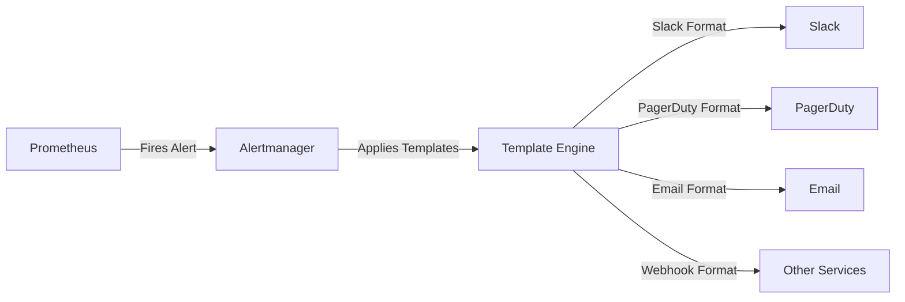
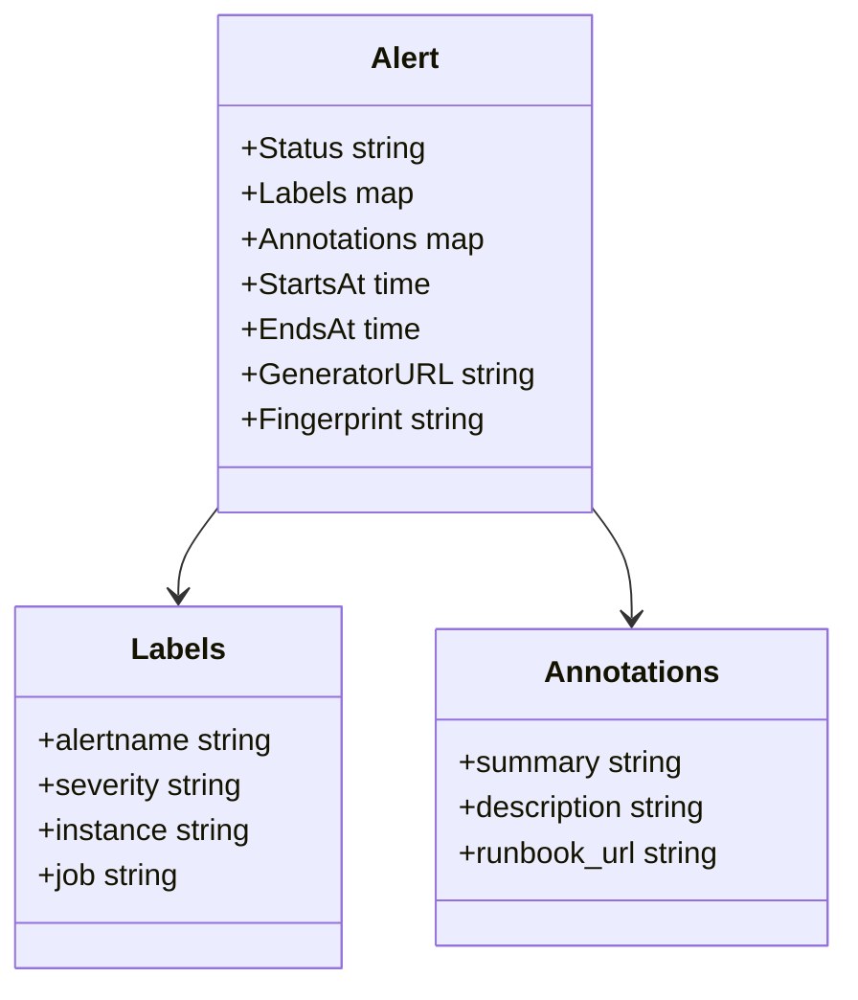
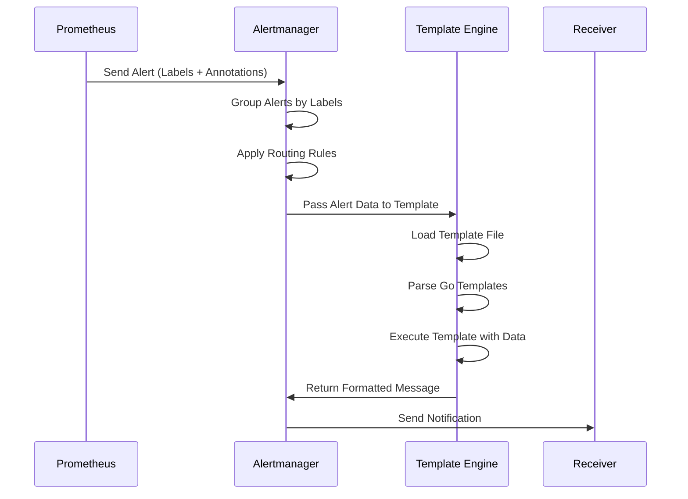

# How to Implement Alert Templates

Author: [nawazdhandala](https://github.com/nawazdhandala)

Tags: Observability, Alerting, Alertmanager, SRE

Description: Learn how to create alert templates for consistent, actionable alert messages.

---

Alert fatigue is real. When your on-call engineers receive poorly formatted alerts at 3 AM, they waste precious minutes trying to understand what is happening. Alert templates solve this problem by ensuring every notification follows a consistent, actionable format. In this guide, you will learn how to implement alert templates in Alertmanager using Go templates, with practical examples for Slack, PagerDuty, and email.

## Why Alert Templates Matter

Before diving into implementation, let us understand the benefits of well-designed alert templates:

- **Consistency**: Every alert follows the same structure, reducing cognitive load
- **Actionability**: Include runbook links, severity levels, and context
- **Reduced MTTR**: Engineers can quickly identify and respond to issues
- **Better Signal-to-Noise**: Clear formatting helps distinguish critical alerts from informational ones

## Alert Template Architecture

Here is how alert templates fit into the alerting pipeline:



## Understanding Go Templates in Alertmanager

Alertmanager uses Go's `text/template` package for rendering alert messages. Before creating templates, you need to understand the data structure available to you.

### Alert Data Structure

When Alertmanager processes an alert, it provides these key fields:



### Basic Template Syntax

Here is a quick reference for Go template syntax:

```go
// Accessing a field
{{ .Status }}

// Accessing a label
{{ .Labels.alertname }}

// Accessing an annotation
{{ .Annotations.summary }}

// Conditional logic
{{ if eq .Status "firing" }}ALERT{{ else }}RESOLVED{{ end }}

// Iterating over alerts
{{ range .Alerts }}
  {{ .Labels.alertname }}
{{ end }}

// Default values
{{ .Labels.severity | default "warning" }}

// String manipulation
{{ .Labels.alertname | toUpper }}
```

## Setting Up Your Template File

Create a dedicated template file that Alertmanager will load. This keeps your configuration clean and maintainable.

```yaml
# alertmanager.yml
global:
  resolve_timeout: 5m

# Load custom templates from this directory
templates:
  - '/etc/alertmanager/templates/*.tmpl'

route:
  receiver: 'default-receiver'
  group_by: ['alertname', 'severity']
  group_wait: 30s
  group_interval: 5m
  repeat_interval: 4h

receivers:
  - name: 'default-receiver'
    slack_configs:
      - channel: '#alerts'
        send_resolved: true
```

## Slack Alert Templates

Slack templates should be visually clear and include all necessary context for quick triage.

### Basic Slack Template

```go
{{/*
  File: /etc/alertmanager/templates/slack.tmpl
  Purpose: Slack notification templates for Alertmanager
*/}}

{{/* Define the color based on alert status and severity */}}
{{ define "slack.color" }}
  {{- if eq .Status "firing" -}}
    {{- if eq .CommonLabels.severity "critical" -}}
      danger
    {{- else if eq .CommonLabels.severity "warning" -}}
      warning
    {{- else -}}
      #439FE0
    {{- end -}}
  {{- else -}}
    good
  {{- end -}}
{{ end }}

{{/* Main title showing alert count and status */}}
{{ define "slack.title" }}
  {{- if eq .Status "firing" -}}
    [{{ .Status | toUpper }}:{{ .Alerts.Firing | len }}] {{ .CommonLabels.alertname }}
  {{- else -}}
    [RESOLVED] {{ .CommonLabels.alertname }}
  {{- end -}}
{{ end }}

{{/* Detailed alert information */}}
{{ define "slack.text" }}
{{ range .Alerts }}
*Alert:* {{ .Labels.alertname }}
*Severity:* {{ .Labels.severity | default "unknown" }}
*Status:* {{ .Status }}
*Instance:* {{ .Labels.instance | default "N/A" }}

*Summary:*
{{ .Annotations.summary | default "No summary provided" }}

*Description:*
{{ .Annotations.description | default "No description provided" }}

{{- if .Annotations.runbook_url }}
*Runbook:* <{{ .Annotations.runbook_url }}|View Runbook>
{{- end }}

*Started:* {{ .StartsAt.Format "2006-01-02 15:04:05 UTC" }}
{{- if eq .Status "resolved" }}
*Resolved:* {{ .EndsAt.Format "2006-01-02 15:04:05 UTC" }}
{{- end }}

---
{{ end }}
{{ end }}
```

### Advanced Slack Template with Blocks

For richer formatting, use Slack Block Kit:

```go
{{/*
  File: /etc/alertmanager/templates/slack-blocks.tmpl
  Purpose: Slack Block Kit templates for rich alert formatting
*/}}

{{ define "slack.blocks" }}
[
  {
    "type": "header",
    "text": {
      "type": "plain_text",
      "text": "{{ if eq .Status "firing" }}ALERT{{ else }}RESOLVED{{ end }}: {{ .CommonLabels.alertname }}"
    }
  },
  {
    "type": "section",
    "fields": [
      {
        "type": "mrkdwn",
        "text": "*Status:*\n{{ .Status | toUpper }}"
      },
      {
        "type": "mrkdwn",
        "text": "*Severity:*\n{{ .CommonLabels.severity | default "unknown" }}"
      },
      {
        "type": "mrkdwn",
        "text": "*Alerts Firing:*\n{{ .Alerts.Firing | len }}"
      },
      {
        "type": "mrkdwn",
        "text": "*Alerts Resolved:*\n{{ .Alerts.Resolved | len }}"
      }
    ]
  },
  {{- range .Alerts }}
  {
    "type": "section",
    "text": {
      "type": "mrkdwn",
      "text": "*{{ .Labels.alertname }}*\n{{ .Annotations.summary | default "No summary" }}"
    }
  },
  {{- if .Annotations.runbook_url }}
  {
    "type": "actions",
    "elements": [
      {
        "type": "button",
        "text": {
          "type": "plain_text",
          "text": "View Runbook"
        },
        "url": "{{ .Annotations.runbook_url }}"
      }
    ]
  },
  {{- end }}
  {{- end }}
  {
    "type": "context",
    "elements": [
      {
        "type": "mrkdwn",
        "text": "Source: Alertmanager | Cluster: {{ .CommonLabels.cluster | default "default" }}"
      }
    ]
  }
]
{{ end }}
```

### Applying Slack Templates

Update your Alertmanager configuration to use these templates:

```yaml
# alertmanager.yml - Slack receiver configuration
receivers:
  - name: 'slack-critical'
    slack_configs:
      - api_url: 'https://hooks.slack.com/services/YOUR/WEBHOOK/URL'
        channel: '#alerts-critical'
        send_resolved: true
        # Use custom templates
        title: '{{ template "slack.title" . }}'
        text: '{{ template "slack.text" . }}'
        color: '{{ template "slack.color" . }}'
        # Optional: Use blocks for richer formatting
        # blocks: '{{ template "slack.blocks" . }}'
```

## PagerDuty Alert Templates

PagerDuty templates should prioritize critical information for incident response.

### PagerDuty Template

```go
{{/*
  File: /etc/alertmanager/templates/pagerduty.tmpl
  Purpose: PagerDuty notification templates
*/}}

{{/* Generate a descriptive incident title */}}
{{ define "pagerduty.title" }}
  {{- .CommonLabels.alertname -}}
  {{- if .CommonLabels.severity }} [{{ .CommonLabels.severity | toUpper }}]{{ end -}}
  {{- if .CommonLabels.instance }} on {{ .CommonLabels.instance }}{{ end -}}
{{ end }}

{{/* Create detailed incident description */}}
{{ define "pagerduty.description" }}
{{ range .Alerts }}
Alert: {{ .Labels.alertname }}
Severity: {{ .Labels.severity | default "unknown" }}
Instance: {{ .Labels.instance | default "N/A" }}
Job: {{ .Labels.job | default "N/A" }}

Summary: {{ .Annotations.summary | default "No summary provided" }}

Description: {{ .Annotations.description | default "No description provided" }}

{{- if .Annotations.runbook_url }}
Runbook: {{ .Annotations.runbook_url }}
{{- end }}

Labels:
{{- range $key, $value := .Labels }}
  - {{ $key }}: {{ $value }}
{{- end }}

Started: {{ .StartsAt.Format "2006-01-02 15:04:05 UTC" }}
{{ end }}
{{ end }}

{{/* Custom details for PagerDuty */}}
{{ define "pagerduty.custom_details" }}
{
  "alertname": "{{ .CommonLabels.alertname }}",
  "severity": "{{ .CommonLabels.severity | default "unknown" }}",
  "firing_alerts": "{{ .Alerts.Firing | len }}",
  "resolved_alerts": "{{ .Alerts.Resolved | len }}",
  "cluster": "{{ .CommonLabels.cluster | default "default" }}",
  "namespace": "{{ .CommonLabels.namespace | default "N/A" }}"
}
{{ end }}
```

### PagerDuty Configuration

```yaml
# alertmanager.yml - PagerDuty receiver configuration
receivers:
  - name: 'pagerduty-critical'
    pagerduty_configs:
      - service_key: 'YOUR_PAGERDUTY_SERVICE_KEY'
        send_resolved: true
        # Map severity to PagerDuty severity levels
        severity: '{{ if eq .CommonLabels.severity "critical" }}critical{{ else if eq .CommonLabels.severity "warning" }}warning{{ else }}info{{ end }}'
        # Use custom templates
        description: '{{ template "pagerduty.title" . }}'
        details:
          firing: '{{ template "pagerduty.description" . }}'
          alertname: '{{ .CommonLabels.alertname }}'
          severity: '{{ .CommonLabels.severity }}'
          runbook_url: '{{ (index .Alerts 0).Annotations.runbook_url }}'
```

## Email Alert Templates

Email templates can include more detailed information and HTML formatting.

### Plain Text Email Template

```go
{{/*
  File: /etc/alertmanager/templates/email.tmpl
  Purpose: Email notification templates
*/}}

{{/* Email subject line */}}
{{ define "email.subject" }}
  [{{ .Status | toUpper }}{{ if eq .Status "firing" }}:{{ .Alerts.Firing | len }}{{ end }}] {{ .CommonLabels.alertname }}
{{ end }}

{{/* Plain text email body */}}
{{ define "email.text" }}
Alert Notification from Alertmanager

Status: {{ .Status | toUpper }}
{{ if eq .Status "firing" }}
Firing Alerts: {{ .Alerts.Firing | len }}
{{ else }}
Resolved Alerts: {{ .Alerts.Resolved | len }}
{{ end }}

================================================================================
ALERT DETAILS
================================================================================
{{ range .Alerts }}
Alert Name: {{ .Labels.alertname }}
Status: {{ .Status }}
Severity: {{ .Labels.severity | default "unknown" }}
Instance: {{ .Labels.instance | default "N/A" }}
Job: {{ .Labels.job | default "N/A" }}

Summary:
{{ .Annotations.summary | default "No summary provided" }}

Description:
{{ .Annotations.description | default "No description provided" }}

{{ if .Annotations.runbook_url }}
Runbook URL: {{ .Annotations.runbook_url }}
{{ end }}

Timeline:
  Started: {{ .StartsAt.Format "2006-01-02 15:04:05 UTC" }}
{{ if eq .Status "resolved" }}
  Resolved: {{ .EndsAt.Format "2006-01-02 15:04:05 UTC" }}
{{ end }}

Labels:
{{ range $key, $value := .Labels }}
  {{ $key }}: {{ $value }}
{{ end }}

--------------------------------------------------------------------------------
{{ end }}

This alert was generated by Alertmanager.
{{ end }}
```

### HTML Email Template

```go
{{/*
  File: /etc/alertmanager/templates/email-html.tmpl
  Purpose: HTML email notification templates for rich formatting
*/}}

{{ define "email.html" }}
<!DOCTYPE html>
<html>
<head>
  <style>
    /* Base styles for email clients */
    body {
      font-family: -apple-system, BlinkMacSystemFont, 'Segoe UI', Roboto, Helvetica, Arial, sans-serif;
      line-height: 1.6;
      color: #333;
      max-width: 800px;
      margin: 0 auto;
      padding: 20px;
    }

    /* Header styling based on alert status */
    .header {
      padding: 20px;
      border-radius: 8px 8px 0 0;
      color: white;
      text-align: center;
    }
    .header.firing { background-color: #dc3545; }
    .header.resolved { background-color: #28a745; }

    /* Alert card styling */
    .alert-card {
      border: 1px solid #ddd;
      border-radius: 8px;
      margin: 15px 0;
      overflow: hidden;
    }
    .alert-card-header {
      padding: 15px;
      background-color: #f8f9fa;
      border-bottom: 1px solid #ddd;
    }
    .alert-card-body {
      padding: 15px;
    }

    /* Severity badges */
    .badge {
      display: inline-block;
      padding: 4px 8px;
      border-radius: 4px;
      font-size: 12px;
      font-weight: bold;
      text-transform: uppercase;
    }
    .badge.critical { background-color: #dc3545; color: white; }
    .badge.warning { background-color: #ffc107; color: black; }
    .badge.info { background-color: #17a2b8; color: white; }

    /* Labels table */
    .labels-table {
      width: 100%;
      border-collapse: collapse;
      margin-top: 10px;
    }
    .labels-table th,
    .labels-table td {
      padding: 8px;
      text-align: left;
      border-bottom: 1px solid #ddd;
    }
    .labels-table th { background-color: #f8f9fa; }

    /* Runbook button */
    .runbook-btn {
      display: inline-block;
      padding: 10px 20px;
      background-color: #007bff;
      color: white;
      text-decoration: none;
      border-radius: 5px;
      margin-top: 10px;
    }
    .runbook-btn:hover { background-color: #0056b3; }
  </style>
</head>
<body>
  <!-- Header section showing overall status -->
  <div class="header {{ .Status }}">
    <h1>{{ if eq .Status "firing" }}ALERT{{ else }}RESOLVED{{ end }}</h1>
    <p>{{ .CommonLabels.alertname }}</p>
  </div>

  <!-- Summary section -->
  <div style="padding: 20px; background-color: #f8f9fa; border: 1px solid #ddd;">
    <p><strong>Status:</strong> {{ .Status | toUpper }}</p>
    {{ if eq .Status "firing" }}
    <p><strong>Firing Alerts:</strong> {{ .Alerts.Firing | len }}</p>
    {{ end }}
    {{ if .Alerts.Resolved }}
    <p><strong>Resolved Alerts:</strong> {{ .Alerts.Resolved | len }}</p>
    {{ end }}
  </div>

  <!-- Individual alert cards -->
  {{ range .Alerts }}
  <div class="alert-card">
    <div class="alert-card-header">
      <h3 style="margin: 0;">{{ .Labels.alertname }}</h3>
      <span class="badge {{ .Labels.severity | default "info" }}">
        {{ .Labels.severity | default "unknown" }}
      </span>
    </div>
    <div class="alert-card-body">
      <p><strong>Summary:</strong><br>{{ .Annotations.summary | default "No summary provided" }}</p>
      <p><strong>Description:</strong><br>{{ .Annotations.description | default "No description provided" }}</p>

      <table class="labels-table">
        <tr>
          <th>Label</th>
          <th>Value</th>
        </tr>
        {{ range $key, $value := .Labels }}
        <tr>
          <td>{{ $key }}</td>
          <td>{{ $value }}</td>
        </tr>
        {{ end }}
      </table>

      <p style="margin-top: 15px;">
        <strong>Started:</strong> {{ .StartsAt.Format "2006-01-02 15:04:05 UTC" }}
        {{ if eq .Status "resolved" }}
        <br><strong>Resolved:</strong> {{ .EndsAt.Format "2006-01-02 15:04:05 UTC" }}
        {{ end }}
      </p>

      {{ if .Annotations.runbook_url }}
      <a href="{{ .Annotations.runbook_url }}" class="runbook-btn">View Runbook</a>
      {{ end }}
    </div>
  </div>
  {{ end }}

  <!-- Footer -->
  <div style="text-align: center; padding: 20px; color: #666; font-size: 12px;">
    <p>This alert was generated by Alertmanager</p>
    <p>Cluster: {{ .CommonLabels.cluster | default "default" }}</p>
  </div>
</body>
</html>
{{ end }}
```

### Email Configuration

```yaml
# alertmanager.yml - Email receiver configuration
receivers:
  - name: 'email-alerts'
    email_configs:
      - to: 'oncall-team@example.com'
        from: 'alertmanager@example.com'
        smarthost: 'smtp.example.com:587'
        auth_username: 'alertmanager@example.com'
        auth_password: 'your-smtp-password'
        send_resolved: true
        # Use custom templates
        headers:
          Subject: '{{ template "email.subject" . }}'
        text: '{{ template "email.text" . }}'
        html: '{{ template "email.html" . }}'
```

## Template Processing Flow

Understanding how templates are processed helps with debugging:



## Best Practices for Alert Templates

### 1. Always Include Essential Information

Every alert should contain:

```go
{{/* Essential alert information checklist */}}
{{ define "alert.essentials" }}
Alert: {{ .Labels.alertname }}
Severity: {{ .Labels.severity | default "unknown" }}
Status: {{ .Status }}
Summary: {{ .Annotations.summary }}
Runbook: {{ .Annotations.runbook_url | default "No runbook available" }}
{{ end }}
```

### 2. Use Default Values

Prevent template errors with default values:

```go
{{/* Safe access with defaults */}}
{{ .Labels.severity | default "warning" }}
{{ .Annotations.description | default "No description provided" }}
{{ .CommonLabels.cluster | default "unknown-cluster" }}
```

### 3. Format Timestamps Consistently

Use a standard timestamp format:

```go
{{/* Consistent timestamp formatting */}}
{{ define "timestamp" }}
{{ .StartsAt.Format "2006-01-02 15:04:05 UTC" }}
{{ end }}
```

### 4. Create Reusable Template Fragments

Build modular templates:

```go
{{/*
  File: /etc/alertmanager/templates/common.tmpl
  Purpose: Shared template fragments
*/}}

{{/* Severity indicator with emoji (optional) */}}
{{ define "severity.indicator" }}
  {{- if eq . "critical" -}}
    CRITICAL
  {{- else if eq . "warning" -}}
    WARNING
  {{- else if eq . "info" -}}
    INFO
  {{- else -}}
    UNKNOWN
  {{- end -}}
{{ end }}

{{/* Format labels as key-value pairs */}}
{{ define "labels.list" }}
{{- range $key, $value := . }}
  {{ $key }}: {{ $value }}
{{- end }}
{{ end }}

{{/* Generate alert fingerprint link */}}
{{ define "alert.link" }}
{{- if .GeneratorURL -}}
  {{ .GeneratorURL }}
{{- else -}}
  N/A
{{- end -}}
{{ end }}
```

## Testing Your Templates

Before deploying templates to production, test them locally.

### Using amtool

```bash
# Validate Alertmanager configuration including templates
amtool check-config alertmanager.yml

# Test template rendering with sample data
amtool template test templates/slack.tmpl \
  --template.data='{"status":"firing","alerts":[{"labels":{"alertname":"HighCPU","severity":"critical"},"annotations":{"summary":"CPU usage is high"}}]}'
```

### Template Test File

Create a test configuration:

```yaml
# test-alerts.yml - Sample alert data for testing
status: firing
commonLabels:
  alertname: HighCPUUsage
  severity: critical
  cluster: production
commonAnnotations:
  summary: CPU usage exceeds 90%
alerts:
  - status: firing
    labels:
      alertname: HighCPUUsage
      severity: critical
      instance: server-01:9090
      job: node-exporter
    annotations:
      summary: CPU usage exceeds 90%
      description: The CPU usage on server-01 has been above 90% for the last 5 minutes.
      runbook_url: https://runbooks.example.com/high-cpu
    startsAt: "2024-01-15T10:30:00Z"
```

## Common Template Debugging Tips

### 1. Check for Whitespace Issues

Go templates preserve whitespace. Use trim markers:

```go
{{/* Without trimming - adds extra newlines */}}
{{ if .Labels.severity }}
  Severity: {{ .Labels.severity }}
{{ end }}

{{/* With trimming - cleaner output */}}
{{- if .Labels.severity -}}
Severity: {{ .Labels.severity }}
{{- end -}}
```

### 2. Handle Missing Fields Gracefully

```go
{{/* Check if field exists before accessing */}}
{{ if .Annotations.runbook_url }}
Runbook: {{ .Annotations.runbook_url }}
{{ else }}
Runbook: Not available
{{ end }}
```

### 3. Escape Special Characters

For JSON output (like Slack blocks):

```go
{{/* Escape quotes in JSON */}}
"text": "{{ .Annotations.description | reReplaceAll "\"" "\\\"" }}"
```

## Complete Configuration Example

Here is a full Alertmanager configuration with all templates:

```yaml
# alertmanager.yml - Complete configuration
global:
  resolve_timeout: 5m
  smtp_smarthost: 'smtp.example.com:587'
  smtp_from: 'alertmanager@example.com'
  smtp_auth_username: 'alertmanager@example.com'
  smtp_auth_password: 'your-password'

# Load all template files
templates:
  - '/etc/alertmanager/templates/*.tmpl'

# Routing configuration
route:
  receiver: 'default'
  group_by: ['alertname', 'severity', 'cluster']
  group_wait: 30s
  group_interval: 5m
  repeat_interval: 4h

  routes:
    # Critical alerts go to PagerDuty and Slack
    - match:
        severity: critical
      receiver: 'critical-alerts'
      continue: true

    # Warning alerts go to Slack only
    - match:
        severity: warning
      receiver: 'warning-alerts'

    # Info alerts go to email
    - match:
        severity: info
      receiver: 'info-alerts'

receivers:
  - name: 'default'
    slack_configs:
      - api_url: 'https://hooks.slack.com/services/XXX/YYY/ZZZ'
        channel: '#alerts'
        send_resolved: true
        title: '{{ template "slack.title" . }}'
        text: '{{ template "slack.text" . }}'
        color: '{{ template "slack.color" . }}'

  - name: 'critical-alerts'
    pagerduty_configs:
      - service_key: 'your-pagerduty-key'
        send_resolved: true
        description: '{{ template "pagerduty.title" . }}'
    slack_configs:
      - api_url: 'https://hooks.slack.com/services/XXX/YYY/ZZZ'
        channel: '#alerts-critical'
        send_resolved: true
        title: '{{ template "slack.title" . }}'
        text: '{{ template "slack.text" . }}'
        color: '{{ template "slack.color" . }}'

  - name: 'warning-alerts'
    slack_configs:
      - api_url: 'https://hooks.slack.com/services/XXX/YYY/ZZZ'
        channel: '#alerts-warning'
        send_resolved: true
        title: '{{ template "slack.title" . }}'
        text: '{{ template "slack.text" . }}'
        color: '{{ template "slack.color" . }}'

  - name: 'info-alerts'
    email_configs:
      - to: 'team@example.com'
        send_resolved: true
        headers:
          Subject: '{{ template "email.subject" . }}'
        text: '{{ template "email.text" . }}'
        html: '{{ template "email.html" . }}'

# Inhibition rules to prevent duplicate alerts
inhibit_rules:
  - source_match:
      severity: 'critical'
    target_match:
      severity: 'warning'
    equal: ['alertname', 'instance']
```

## Conclusion

Well-designed alert templates are essential for effective incident response. By implementing consistent templates across Slack, PagerDuty, and email, you ensure that your on-call engineers receive clear, actionable notifications regardless of the channel.

Key takeaways:

1. **Standardize your alert format** across all notification channels
2. **Always include runbook links** to reduce time to resolution
3. **Use severity levels** to help engineers prioritize
4. **Test templates locally** before deploying to production
5. **Keep templates modular** for easier maintenance

Start with the templates provided in this guide and customize them to fit your organization's needs. Your on-call engineers will thank you for the improved alert quality.

## Further Reading

- [Alertmanager Documentation](https://prometheus.io/docs/alerting/latest/alertmanager/)
- [Go Template Package](https://pkg.go.dev/text/template)
- [Slack Block Kit Builder](https://app.slack.com/block-kit-builder)
- [PagerDuty Events API](https://developer.pagerduty.com/docs/events-api-v2/overview/)
