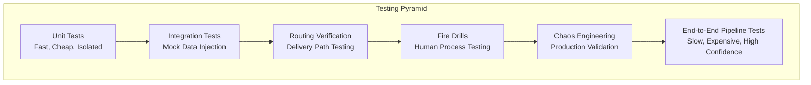
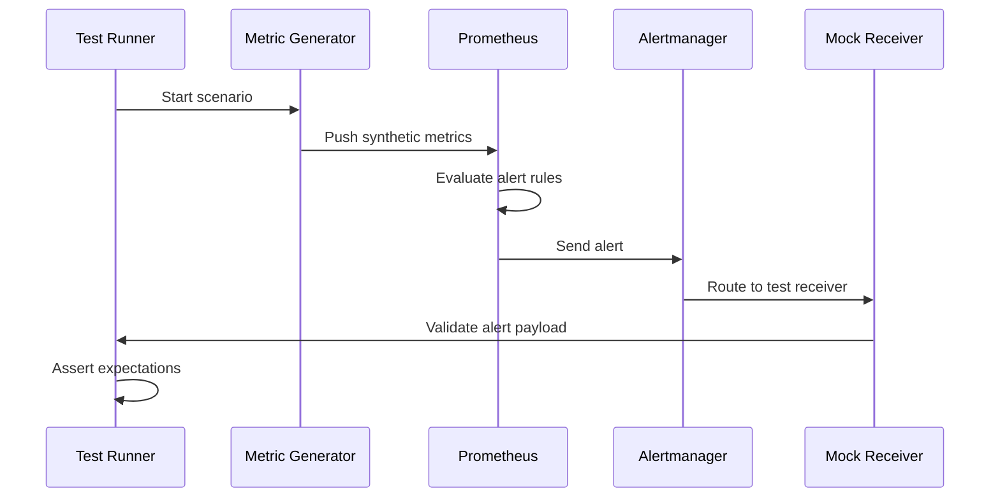
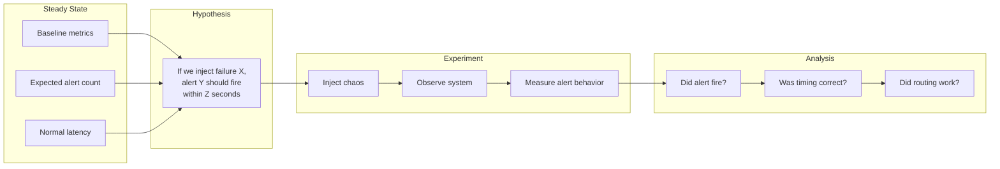
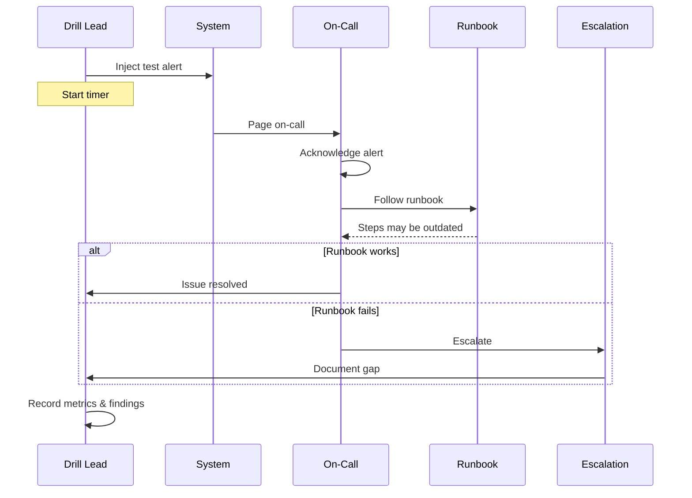
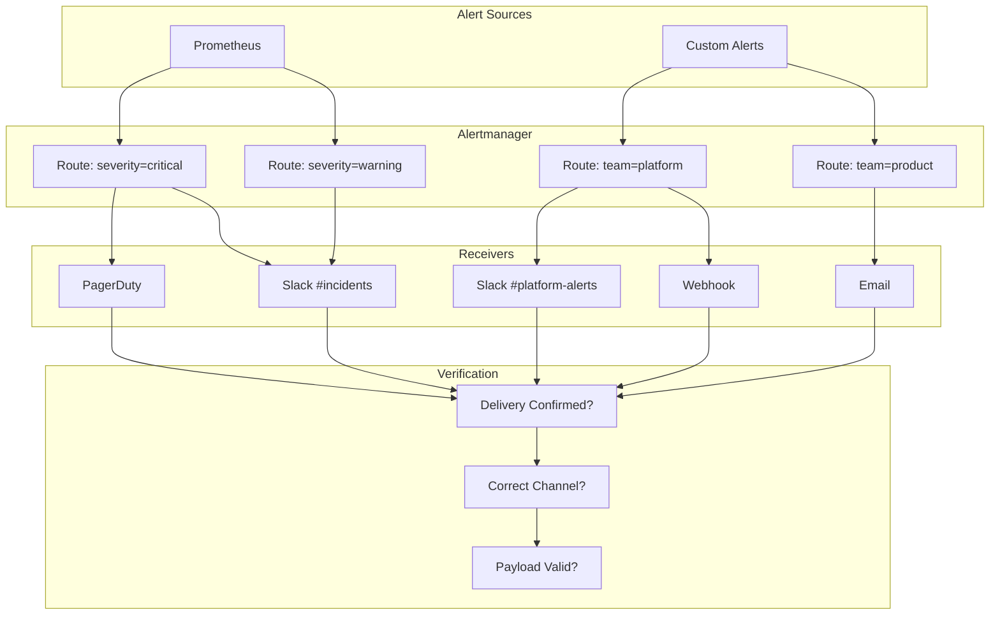
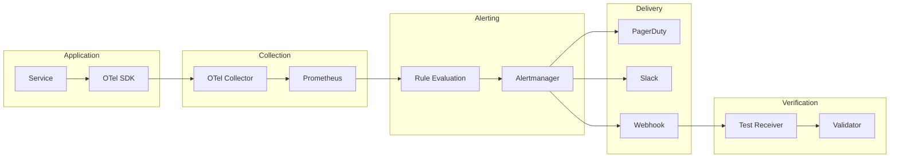

# How to Build Alert Testing Strategies

Author: [nawazdhandala](https://github.com/nawazdhandala)

Tags: Alerting, Testing, SRE, Monitoring

Description: Learn how to test alerts to ensure they fire correctly when needed.

---

## Why Alert Testing Matters

Alerts are your last line of defense against production incidents. When they fail to fire, users suffer in silence. When they fire incorrectly, on-call engineers burn out from alert fatigue. Both scenarios erode trust in your monitoring system.

Yet most teams treat alerts as "set and forget" configuration. They write alerting rules, deploy them, and hope they work when needed. This approach fails for the same reason untested code fails: assumptions break silently over time. Schema changes, metric renames, threshold drift, and routing misconfiguration all conspire to make alerts unreliable.

A systematic alert testing strategy ensures your alerts fire when they should, reach the right people, and provide actionable context for resolution. This guide covers the complete testing pyramid for alerts: from unit tests on individual rules to chaos engineering experiments that validate your entire alerting pipeline.

---

## The Alert Testing Pyramid

Just like application code, alerts benefit from a layered testing approach. Each layer catches different failure modes and operates at different speeds.



| Layer | Speed | What It Catches | When to Run |
|-------|-------|-----------------|-------------|
| **Unit Tests** | Milliseconds | Logic errors in alert expressions | Every commit |
| **Integration Tests** | Seconds | Data flow issues, query syntax | Every deploy |
| **Routing Verification** | Minutes | Notification channel misconfig | Daily / on change |
| **Fire Drills** | Hours | Human response gaps, runbook issues | Weekly / monthly |
| **Chaos Engineering** | Variable | System-level failures, cascading issues | Scheduled experiments |
| **E2E Pipeline Tests** | Minutes | Full pipeline health | Continuous |

---

## Unit Testing Alert Rules

Unit tests validate that your alert expressions evaluate correctly against known inputs. They catch typos, logic errors, and threshold mistakes before alerts reach production.

### Testing Prometheus Alert Rules

Prometheus provides a built-in testing framework through `promtool`. Define test cases in YAML that specify input metrics and expected alert states.

```yaml
# alert_rules.yaml
groups:
  - name: slo_alerts
    rules:
      - alert: HighErrorRate
        expr: |
          (
            sum(rate(http_requests_total{status=~"5.."}[5m]))
            /
            sum(rate(http_requests_total[5m]))
          ) > 0.01
        for: 2m
        labels:
          severity: critical
        annotations:
          summary: "Error rate exceeds 1%"
          description: "Current error rate is {{ $value | humanizePercentage }}"
          runbook_url: "https://runbooks.example.com/high-error-rate"

      - alert: HighLatencyP99
        expr: |
          histogram_quantile(0.99,
            sum(rate(http_request_duration_seconds_bucket[5m])) by (le)
          ) > 0.5
        for: 5m
        labels:
          severity: warning
        annotations:
          summary: "P99 latency exceeds 500ms"
```

```yaml
# alert_rules_test.yaml
rule_files:
  - alert_rules.yaml

evaluation_interval: 1m

tests:
  - interval: 1m
    input_series:
      # Simulate 2% error rate
      - series: 'http_requests_total{status="200"}'
        values: '0+98x10'  # 98 successful requests per minute
      - series: 'http_requests_total{status="500"}'
        values: '0+2x10'   # 2 errors per minute

    alert_rule_test:
      - eval_time: 3m
        alertname: HighErrorRate
        exp_alerts:
          - exp_labels:
              severity: critical
            exp_annotations:
              summary: "Error rate exceeds 1%"

  - interval: 1m
    input_series:
      # Simulate healthy error rate (0.5%)
      - series: 'http_requests_total{status="200"}'
        values: '0+995x10'
      - series: 'http_requests_total{status="500"}'
        values: '0+5x10'

    alert_rule_test:
      - eval_time: 3m
        alertname: HighErrorRate
        exp_alerts: []  # No alert expected

  - interval: 1m
    input_series:
      # Simulate high latency using histogram buckets
      - series: 'http_request_duration_seconds_bucket{le="0.1"}'
        values: '0+10x10'
      - series: 'http_request_duration_seconds_bucket{le="0.5"}'
        values: '0+50x10'
      - series: 'http_request_duration_seconds_bucket{le="1.0"}'
        values: '0+90x10'
      - series: 'http_request_duration_seconds_bucket{le="+Inf"}'
        values: '0+100x10'

    alert_rule_test:
      - eval_time: 6m
        alertname: HighLatencyP99
        exp_alerts:
          - exp_labels:
              severity: warning
```

Run the tests with:

```bash
promtool test rules alert_rules_test.yaml
```

### Testing in CI/CD

Integrate alert rule testing into your deployment pipeline to catch issues before they reach production.

```yaml
# .github/workflows/alert-tests.yaml
name: Alert Rule Tests

on:
  push:
    paths:
      - 'alerts/**'
      - 'prometheus/**'
  pull_request:
    paths:
      - 'alerts/**'
      - 'prometheus/**'

jobs:
  test-alerts:
    runs-on: ubuntu-latest
    steps:
      - uses: actions/checkout@v4

      - name: Install promtool
        run: |
          wget https://github.com/prometheus/prometheus/releases/download/v2.48.0/prometheus-2.48.0.linux-amd64.tar.gz
          tar xvfz prometheus-*.tar.gz
          sudo mv prometheus-*/promtool /usr/local/bin/

      - name: Validate alert rule syntax
        run: promtool check rules alerts/*.yaml

      - name: Run alert unit tests
        run: promtool test rules alerts/tests/*.yaml

      - name: Check for missing runbook URLs
        run: |
          # Ensure every critical alert has a runbook
          grep -r "severity: critical" alerts/ | while read line; do
            file=$(echo $line | cut -d: -f1)
            if ! grep -A5 "severity: critical" "$file" | grep -q "runbook_url"; then
              echo "ERROR: Critical alert in $file missing runbook_url"
              exit 1
            fi
          done
```

---

## Integration Testing with Mock Data

Integration tests verify that alerts work correctly when metrics flow through your actual monitoring stack. They catch issues that unit tests miss: query syntax errors, aggregation problems, and time window misconfigurations.

### Mock Data Injection Architecture



### Building a Metric Generator

Create a synthetic metric generator that can simulate various failure scenarios.

```python
# metric_generator.py
from prometheus_client import CollectorRegistry, Counter, Histogram, push_to_gateway
import time
import random

class AlertTestScenario:
    """Generate synthetic metrics to test alert rules."""

    def __init__(self, pushgateway_url: str, job_name: str = "alert_test"):
        self.pushgateway_url = pushgateway_url
        self.job_name = job_name
        self.registry = CollectorRegistry()

        # Define metrics that match your alert rules
        self.http_requests = Counter(
            'http_requests_total',
            'Total HTTP requests',
            ['status', 'method', 'endpoint'],
            registry=self.registry
        )

        self.request_duration = Histogram(
            'http_request_duration_seconds',
            'Request latency',
            ['method', 'endpoint'],
            buckets=[0.01, 0.05, 0.1, 0.25, 0.5, 1.0, 2.5, 5.0, 10.0],
            registry=self.registry
        )

    def simulate_high_error_rate(self, duration_seconds: int = 180, error_rate: float = 0.05):
        """
        Simulate elevated error rate to trigger HighErrorRate alert.

        Args:
            duration_seconds: How long to run the simulation
            error_rate: Target error rate (0.0 to 1.0)
        """
        print(f"Simulating {error_rate*100}% error rate for {duration_seconds}s")

        end_time = time.time() + duration_seconds
        while time.time() < end_time:
            # Generate request batch
            for _ in range(100):
                if random.random() < error_rate:
                    self.http_requests.labels(
                        status="500",
                        method="GET",
                        endpoint="/api/orders"
                    ).inc()
                else:
                    self.http_requests.labels(
                        status="200",
                        method="GET",
                        endpoint="/api/orders"
                    ).inc()

            self._push_metrics()
            time.sleep(10)  # Push every 10 seconds

    def simulate_latency_spike(self, duration_seconds: int = 300, p99_target: float = 2.0):
        """
        Simulate latency spike to trigger HighLatencyP99 alert.

        Args:
            duration_seconds: How long to run the simulation
            p99_target: Target p99 latency in seconds
        """
        print(f"Simulating p99 latency of {p99_target}s for {duration_seconds}s")

        end_time = time.time() + duration_seconds
        while time.time() < end_time:
            for _ in range(100):
                # 99% of requests are fast, 1% are slow
                if random.random() < 0.01:
                    latency = p99_target + random.uniform(0, 0.5)
                else:
                    latency = random.uniform(0.01, 0.1)

                self.request_duration.labels(
                    method="GET",
                    endpoint="/api/orders"
                ).observe(latency)

            self._push_metrics()
            time.sleep(10)

    def simulate_healthy_baseline(self, duration_seconds: int = 120):
        """Generate healthy metrics to verify alerts resolve."""
        print(f"Simulating healthy baseline for {duration_seconds}s")

        end_time = time.time() + duration_seconds
        while time.time() < end_time:
            for _ in range(100):
                # Healthy traffic: 0.1% error rate, low latency
                if random.random() < 0.001:
                    self.http_requests.labels(
                        status="500",
                        method="GET",
                        endpoint="/api/orders"
                    ).inc()
                else:
                    self.http_requests.labels(
                        status="200",
                        method="GET",
                        endpoint="/api/orders"
                    ).inc()

                self.request_duration.labels(
                    method="GET",
                    endpoint="/api/orders"
                ).observe(random.uniform(0.01, 0.05))

            self._push_metrics()
            time.sleep(10)

    def _push_metrics(self):
        """Push current metrics to Pushgateway."""
        push_to_gateway(
            self.pushgateway_url,
            job=self.job_name,
            registry=self.registry
        )


# Test runner
if __name__ == "__main__":
    import argparse

    parser = argparse.ArgumentParser(description="Alert integration test scenarios")
    parser.add_argument("--pushgateway", default="localhost:9091")
    parser.add_argument("--scenario", choices=["error_rate", "latency", "healthy"])
    parser.add_argument("--duration", type=int, default=180)
    args = parser.parse_args()

    scenario = AlertTestScenario(args.pushgateway)

    if args.scenario == "error_rate":
        scenario.simulate_high_error_rate(args.duration, error_rate=0.05)
    elif args.scenario == "latency":
        scenario.simulate_latency_spike(args.duration, p99_target=2.0)
    elif args.scenario == "healthy":
        scenario.simulate_healthy_baseline(args.duration)
```

### Mock Alert Receiver

Create a webhook receiver to capture and validate fired alerts.

```python
# alert_receiver.py
from flask import Flask, request, jsonify
from dataclasses import dataclass, field
from datetime import datetime
from typing import Optional
import json

app = Flask(__name__)

@dataclass
class ReceivedAlert:
    alertname: str
    status: str
    severity: str
    timestamp: datetime
    labels: dict
    annotations: dict

# Store received alerts for verification
received_alerts: list[ReceivedAlert] = []

@app.route('/webhook', methods=['POST'])
def receive_alert():
    """Webhook endpoint that Alertmanager sends alerts to."""
    payload = request.json

    for alert in payload.get('alerts', []):
        received = ReceivedAlert(
            alertname=alert['labels'].get('alertname', 'unknown'),
            status=alert['status'],
            severity=alert['labels'].get('severity', 'unknown'),
            timestamp=datetime.now(),
            labels=alert['labels'],
            annotations=alert['annotations']
        )
        received_alerts.append(received)
        print(f"Received alert: {received.alertname} ({received.status})")

    return jsonify({"status": "ok"})

@app.route('/alerts', methods=['GET'])
def list_alerts():
    """Query endpoint for test verification."""
    alertname = request.args.get('alertname')
    status = request.args.get('status')

    filtered = received_alerts
    if alertname:
        filtered = [a for a in filtered if a.alertname == alertname]
    if status:
        filtered = [a for a in filtered if a.status == status]

    return jsonify([{
        'alertname': a.alertname,
        'status': a.status,
        'severity': a.severity,
        'timestamp': a.timestamp.isoformat(),
        'labels': a.labels,
        'annotations': a.annotations
    } for a in filtered])

@app.route('/alerts', methods=['DELETE'])
def clear_alerts():
    """Clear alerts for next test run."""
    received_alerts.clear()
    return jsonify({"status": "cleared"})

if __name__ == '__main__':
    app.run(host='0.0.0.0', port=8080)
```

### Integration Test Orchestration

```python
# test_alerts_integration.py
import pytest
import requests
import time
import subprocess

PUSHGATEWAY_URL = "http://localhost:9091"
ALERT_RECEIVER_URL = "http://localhost:8080"

class TestAlertIntegration:
    """Integration tests for alerting rules."""

    @pytest.fixture(autouse=True)
    def setup(self):
        """Clear previous test state."""
        requests.delete(f"{ALERT_RECEIVER_URL}/alerts")
        yield

    def wait_for_alert(self, alertname: str, status: str = "firing",
                       timeout: int = 300) -> dict:
        """Poll alert receiver until expected alert arrives."""
        deadline = time.time() + timeout

        while time.time() < deadline:
            response = requests.get(
                f"{ALERT_RECEIVER_URL}/alerts",
                params={"alertname": alertname, "status": status}
            )
            alerts = response.json()

            if alerts:
                return alerts[0]

            time.sleep(10)

        raise TimeoutError(f"Alert {alertname} ({status}) not received within {timeout}s")

    def test_high_error_rate_fires(self):
        """Verify HighErrorRate alert fires when error rate exceeds threshold."""
        # Start metric generator in background
        proc = subprocess.Popen([
            "python", "metric_generator.py",
            "--pushgateway", PUSHGATEWAY_URL,
            "--scenario", "error_rate",
            "--duration", "300"
        ])

        try:
            # Wait for alert to fire (allow for 'for' duration + propagation)
            alert = self.wait_for_alert("HighErrorRate", "firing", timeout=300)

            assert alert["severity"] == "critical"
            assert "runbook_url" in alert["annotations"]
            assert "error rate" in alert["annotations"]["summary"].lower()
        finally:
            proc.terminate()

    def test_high_error_rate_resolves(self):
        """Verify HighErrorRate alert resolves when error rate drops."""
        # First trigger the alert
        proc = subprocess.Popen([
            "python", "metric_generator.py",
            "--pushgateway", PUSHGATEWAY_URL,
            "--scenario", "error_rate",
            "--duration", "180"
        ])

        try:
            self.wait_for_alert("HighErrorRate", "firing", timeout=300)
        finally:
            proc.terminate()

        # Now simulate recovery
        proc = subprocess.Popen([
            "python", "metric_generator.py",
            "--pushgateway", PUSHGATEWAY_URL,
            "--scenario", "healthy",
            "--duration", "180"
        ])

        try:
            alert = self.wait_for_alert("HighErrorRate", "resolved", timeout=300)
            assert alert["status"] == "resolved"
        finally:
            proc.terminate()

    def test_latency_alert_includes_context(self):
        """Verify latency alerts include debugging context."""
        proc = subprocess.Popen([
            "python", "metric_generator.py",
            "--pushgateway", PUSHGATEWAY_URL,
            "--scenario", "latency",
            "--duration", "360"
        ])

        try:
            alert = self.wait_for_alert("HighLatencyP99", "firing", timeout=400)

            # Verify actionable context is present
            assert "summary" in alert["annotations"]
            assert "description" in alert["annotations"]
            # Alert should link to relevant dashboard or runbook
            annotations = alert["annotations"]
            assert any(key in annotations for key in ["runbook_url", "dashboard_url"])
        finally:
            proc.terminate()
```

---

## Chaos Engineering for Alerts

Chaos engineering validates that your alerting system works under stress. It answers questions that controlled tests cannot: Does alert evaluation keep up during metric spikes? Do alerts still route correctly when notification systems are degraded?

### Alert Chaos Experiment Framework



### Chaos Experiments to Run

**Experiment 1: Metric Pipeline Overload**

Test whether alerts fire correctly when metric volume spikes 10x.

```python
# chaos_metric_flood.py
"""
Chaos experiment: Metric pipeline overload
Hypothesis: Alerts should still fire correctly when metric volume spikes 10x
"""
from prometheus_client import CollectorRegistry, Counter, push_to_gateway
import concurrent.futures
import time

def flood_metrics(pushgateway_url: str, duration_seconds: int = 300):
    """Generate 10x normal metric volume while maintaining alert-triggering conditions."""
    registry = CollectorRegistry()

    # Create high-cardinality metric to stress the system
    requests = Counter(
        'chaos_http_requests_total',
        'Chaos test requests',
        ['status', 'endpoint', 'instance', 'region'],
        registry=registry
    )

    print(f"Starting metric flood for {duration_seconds}s")
    end_time = time.time() + duration_seconds

    while time.time() < end_time:
        # Generate metrics across many label combinations
        for instance in range(10):
            for region in ['us-east', 'us-west', 'eu-west', 'ap-south']:
                for endpoint in ['/api/v1/orders', '/api/v1/users', '/api/v1/products']:
                    # 5% error rate to trigger alerts
                    requests.labels(
                        status="200",
                        endpoint=endpoint,
                        instance=f"instance-{instance}",
                        region=region
                    ).inc(95)

                    requests.labels(
                        status="500",
                        endpoint=endpoint,
                        instance=f"instance-{instance}",
                        region=region
                    ).inc(5)

        push_to_gateway(pushgateway_url, job='chaos_flood', registry=registry)
        time.sleep(1)  # Much faster push rate

if __name__ == "__main__":
    flood_metrics("localhost:9091", duration_seconds=300)
```

**Experiment 2: Alertmanager Degradation**

Test alert queuing when notification channels are slow.

```yaml
# chaos-alertmanager-latency.yaml (for Litmus/Chaos Mesh)
apiVersion: chaos-mesh.org/v1alpha1
kind: NetworkChaos
metadata:
  name: alertmanager-latency
spec:
  action: delay
  mode: all
  selector:
    namespaces:
      - monitoring
    labelSelectors:
      app: alertmanager
  delay:
    latency: "5s"
    jitter: "2s"
  duration: "10m"
```

**Experiment 3: Prometheus Restart During Alert**

Verify in-flight alerts survive Prometheus restarts.

```bash
#!/bin/bash
# chaos_prometheus_restart.sh

echo "Starting chaos experiment: Prometheus restart during alert"

# Trigger an alert condition
python metric_generator.py --scenario error_rate --duration 600 &
GENERATOR_PID=$!

# Wait for alert to fire
sleep 180

# Kill Prometheus pod
kubectl delete pod -n monitoring -l app=prometheus

# Wait for recovery
sleep 60

# Verify alert is still firing after restart
curl -s http://alertmanager:9093/api/v2/alerts | jq '.[] | select(.labels.alertname=="HighErrorRate")'

kill $GENERATOR_PID
```

---

## Alert Fire Drill Procedures

Fire drills validate the human side of alerting: Do engineers respond appropriately? Are runbooks accurate? Does escalation work?

### Fire Drill Process



### Fire Drill Automation

```python
# fire_drill.py
"""
Automated fire drill system for alert testing.
Injects synthetic alerts and measures response times.
"""
import requests
import time
from datetime import datetime
from dataclasses import dataclass
from typing import Optional
import json

@dataclass
class DrillResult:
    alert_name: str
    inject_time: datetime
    ack_time: Optional[datetime]
    resolve_time: Optional[datetime]
    responder: Optional[str]
    runbook_followed: bool
    notes: str

class FireDrillRunner:
    def __init__(self, alertmanager_url: str, pagerduty_token: str = None):
        self.alertmanager_url = alertmanager_url
        self.pagerduty_token = pagerduty_token
        self.results: list[DrillResult] = []

    def inject_test_alert(self, alert_name: str, severity: str = "warning") -> str:
        """
        Inject a synthetic alert into Alertmanager.
        Returns alert fingerprint for tracking.
        """
        alert_payload = [{
            "labels": {
                "alertname": alert_name,
                "severity": severity,
                "environment": "production",
                "drill": "true",  # Mark as drill for filtering
                "service": "fire-drill-test"
            },
            "annotations": {
                "summary": f"[DRILL] {alert_name} test alert",
                "description": "This is a fire drill. Please respond as if this were a real alert.",
                "runbook_url": f"https://runbooks.example.com/{alert_name.lower()}"
            },
            "startsAt": datetime.utcnow().isoformat() + "Z",
            "generatorURL": "http://fire-drill-system/drills"
        }]

        response = requests.post(
            f"{self.alertmanager_url}/api/v2/alerts",
            json=alert_payload,
            headers={"Content-Type": "application/json"}
        )
        response.raise_for_status()

        # Return fingerprint for tracking
        return self._get_alert_fingerprint(alert_name)

    def _get_alert_fingerprint(self, alert_name: str) -> str:
        """Get fingerprint of the injected alert."""
        response = requests.get(f"{self.alertmanager_url}/api/v2/alerts")
        for alert in response.json():
            if (alert["labels"].get("alertname") == alert_name and
                alert["labels"].get("drill") == "true"):
                return alert["fingerprint"]
        return ""

    def monitor_response(self, fingerprint: str, timeout_minutes: int = 30) -> DrillResult:
        """Monitor alert acknowledgment and resolution."""
        start_time = datetime.now()
        ack_time = None
        resolve_time = None
        responder = None

        deadline = time.time() + (timeout_minutes * 60)

        while time.time() < deadline:
            # Check Alertmanager for alert status
            response = requests.get(f"{self.alertmanager_url}/api/v2/alerts")

            for alert in response.json():
                if alert.get("fingerprint") == fingerprint:
                    status = alert.get("status", {})

                    # Check for silences (indicates acknowledgment)
                    if status.get("silencedBy") and not ack_time:
                        ack_time = datetime.now()
                        # Try to get responder from silence
                        silence_id = status["silencedBy"][0]
                        silence = self._get_silence(silence_id)
                        responder = silence.get("createdBy", "unknown")

                    # Check if resolved
                    if alert.get("status", {}).get("state") == "resolved":
                        resolve_time = datetime.now()
                        break

            if resolve_time:
                break

            time.sleep(30)

        return DrillResult(
            alert_name=self._get_alert_name(fingerprint),
            inject_time=start_time,
            ack_time=ack_time,
            resolve_time=resolve_time,
            responder=responder,
            runbook_followed=True,  # Would be validated manually
            notes=""
        )

    def _get_silence(self, silence_id: str) -> dict:
        """Get silence details."""
        response = requests.get(f"{self.alertmanager_url}/api/v2/silences")
        for silence in response.json():
            if silence["id"] == silence_id:
                return silence
        return {}

    def _get_alert_name(self, fingerprint: str) -> str:
        """Get alert name from fingerprint."""
        response = requests.get(f"{self.alertmanager_url}/api/v2/alerts")
        for alert in response.json():
            if alert.get("fingerprint") == fingerprint:
                return alert["labels"].get("alertname", "unknown")
        return "unknown"

    def run_drill(self, alert_name: str, severity: str = "warning") -> DrillResult:
        """Run a complete fire drill for an alert."""
        print(f"Starting fire drill for {alert_name}")

        fingerprint = self.inject_test_alert(alert_name, severity)
        print(f"Injected alert with fingerprint: {fingerprint}")

        result = self.monitor_response(fingerprint)
        self.results.append(result)

        return result

    def generate_report(self) -> str:
        """Generate drill results report."""
        report = ["# Fire Drill Results\n"]

        for result in self.results:
            report.append(f"## {result.alert_name}\n")
            report.append(f"- **Inject Time:** {result.inject_time}\n")

            if result.ack_time:
                ack_duration = (result.ack_time - result.inject_time).total_seconds()
                report.append(f"- **Ack Time:** {result.ack_time} ({ack_duration:.0f}s)\n")
            else:
                report.append("- **Ack Time:** NOT ACKNOWLEDGED\n")

            if result.resolve_time:
                resolve_duration = (result.resolve_time - result.inject_time).total_seconds()
                report.append(f"- **Resolve Time:** {result.resolve_time} ({resolve_duration:.0f}s)\n")
            else:
                report.append("- **Resolve Time:** NOT RESOLVED\n")

            report.append(f"- **Responder:** {result.responder or 'Unknown'}\n")
            report.append("\n")

        return "".join(report)


# Example usage
if __name__ == "__main__":
    runner = FireDrillRunner("http://alertmanager:9093")

    # Run drills for critical alerts
    for alert in ["HighErrorRate", "HighLatencyP99", "DatabaseConnectionPoolExhausted"]:
        result = runner.run_drill(alert, severity="warning")
        print(f"Drill complete: {result}")

    print(runner.generate_report())
```

### Fire Drill Checklist

Run through this checklist during each fire drill:

1. **Alert Reception**
   - [ ] Alert reached on-call within expected time
   - [ ] Alert contained correct severity
   - [ ] Alert included runbook link
   - [ ] Alert provided actionable context

2. **Response Process**
   - [ ] On-call acknowledged within SLA
   - [ ] Runbook was accurate and up-to-date
   - [ ] Escalation path was clear
   - [ ] Communication channels worked

3. **Resolution**
   - [ ] Issue was diagnosable from alert context
   - [ ] Resolution steps were documented
   - [ ] Alert resolved cleanly (no flapping)

4. **Post-Drill**
   - [ ] Documented gaps and improvements
   - [ ] Updated runbooks if needed
   - [ ] Filed tickets for systemic issues

---

## Routing Verification Tests

Routing tests ensure alerts reach the right people through the right channels. They catch misconfigurations in Alertmanager routing, broken webhook URLs, and permission issues.

### Routing Test Architecture



### Alertmanager Routing Test Suite

```python
# test_alert_routing.py
"""
Verify Alertmanager routing configuration delivers alerts correctly.
"""
import pytest
import requests
import time
from typing import Optional

ALERTMANAGER_URL = "http://alertmanager:9093"

class RoutingTestCase:
    """Define expected routing for an alert configuration."""

    def __init__(self, labels: dict, expected_receivers: list[str]):
        self.labels = labels
        self.expected_receivers = expected_receivers

# Define routing expectations based on your Alertmanager config
ROUTING_TESTS = [
    RoutingTestCase(
        labels={"alertname": "HighErrorRate", "severity": "critical", "service": "api"},
        expected_receivers=["pagerduty-critical", "slack-incidents"]
    ),
    RoutingTestCase(
        labels={"alertname": "HighLatency", "severity": "warning", "service": "api"},
        expected_receivers=["slack-warnings"]
    ),
    RoutingTestCase(
        labels={"alertname": "DiskSpaceLow", "severity": "warning", "team": "platform"},
        expected_receivers=["slack-platform", "email-platform"]
    ),
    RoutingTestCase(
        labels={"alertname": "PodCrashLooping", "severity": "critical", "namespace": "production"},
        expected_receivers=["pagerduty-critical", "slack-incidents"]
    ),
]


def get_alert_route(labels: dict) -> list[str]:
    """Query Alertmanager's route matching API to determine receivers."""
    # Alertmanager provides a route test endpoint
    response = requests.post(
        f"{ALERTMANAGER_URL}/api/v2/alerts/groups",
        json=[{"labels": labels}]
    )

    # Parse response to extract matched receivers
    # Note: Actual implementation depends on your Alertmanager version
    # This is a simplified example
    return response.json().get("receivers", [])


class TestAlertRouting:
    """Test suite for alert routing verification."""

    @pytest.mark.parametrize("test_case", ROUTING_TESTS)
    def test_routing_matches_expected(self, test_case: RoutingTestCase):
        """Verify each alert routes to expected receivers."""
        actual_receivers = get_alert_route(test_case.labels)

        for expected in test_case.expected_receivers:
            assert expected in actual_receivers, (
                f"Alert {test_case.labels} should route to {expected}, "
                f"but got {actual_receivers}"
            )

    def test_critical_alerts_page(self):
        """All critical alerts must route to PagerDuty."""
        critical_labels = {
            "alertname": "TestCritical",
            "severity": "critical"
        }
        receivers = get_alert_route(critical_labels)

        pagerduty_receivers = [r for r in receivers if "pagerduty" in r.lower()]
        assert pagerduty_receivers, "Critical alerts must route to PagerDuty"

    def test_no_orphan_routes(self):
        """Alerts should not fall through to default route unexpectedly."""
        # Generate test alerts with various label combinations
        test_cases = [
            {"alertname": "RandomAlert", "severity": "info"},
            {"alertname": "UnknownService", "service": "mystery"},
        ]

        for labels in test_cases:
            receivers = get_alert_route(labels)
            # Default receiver should be explicitly expected, not a surprise
            assert "null" not in str(receivers).lower(), (
                f"Alert {labels} fell through to null receiver"
            )


def test_webhook_endpoints_reachable():
    """Verify all webhook receivers are reachable."""
    # Parse Alertmanager config to extract webhook URLs
    response = requests.get(f"{ALERTMANAGER_URL}/api/v2/status")
    config = response.json().get("config", {}).get("original", "")

    # Extract webhook URLs (simplified - use proper YAML parsing)
    webhook_urls = []  # Parse from config

    for url in webhook_urls:
        try:
            response = requests.get(url, timeout=5)
            assert response.status_code < 500, f"Webhook {url} returned {response.status_code}"
        except requests.exceptions.RequestException as e:
            pytest.fail(f"Webhook {url} unreachable: {e}")


def test_slack_integration():
    """Verify Slack webhook is functional."""
    # Get Slack webhook URL from config or environment
    slack_webhook = "https://hooks.slack.com/services/xxx/yyy/zzz"

    test_payload = {
        "text": "[TEST] Alert routing verification - please ignore",
        "channel": "#alerts-test"
    }

    response = requests.post(slack_webhook, json=test_payload, timeout=10)
    assert response.status_code == 200, f"Slack webhook failed: {response.text}"
```

### Daily Routing Health Check

```yaml
# routing-healthcheck-cronjob.yaml
apiVersion: batch/v1
kind: CronJob
metadata:
  name: alert-routing-check
  namespace: monitoring
spec:
  schedule: "0 9 * * *"  # Daily at 9 AM
  jobTemplate:
    spec:
      template:
        spec:
          containers:
            - name: routing-check
              image: python:3.11-slim
              command:
                - python
                - /scripts/routing_healthcheck.py
              env:
                - name: ALERTMANAGER_URL
                  value: "http://alertmanager:9093"
                - name: SLACK_WEBHOOK
                  valueFrom:
                    secretKeyRef:
                      name: alerting-secrets
                      key: slack-webhook
              volumeMounts:
                - name: scripts
                  mountPath: /scripts
          volumes:
            - name: scripts
              configMap:
                name: routing-check-scripts
          restartPolicy: OnFailure
```

---

## End-to-End Alert Pipeline Testing

End-to-end tests validate the complete alerting pipeline from metric generation to notification delivery. They are slow and expensive but provide the highest confidence that your system works.

### E2E Pipeline Architecture



### E2E Test Implementation

```python
# test_e2e_alerting.py
"""
End-to-end alerting pipeline tests.
Validates the complete flow from application metrics to alert delivery.
"""
import pytest
import requests
import time
import subprocess
from dataclasses import dataclass
from datetime import datetime, timedelta
from typing import Optional

@dataclass
class E2ETestConfig:
    """Configuration for E2E alert testing."""
    app_endpoint: str
    prometheus_url: str
    alertmanager_url: str
    test_receiver_url: str
    max_wait_seconds: int = 600

@dataclass
class E2ETestResult:
    """Results of an E2E alert test."""
    scenario: str
    metric_generated: bool
    metric_scraped: bool
    alert_evaluated: bool
    alert_fired: bool
    alert_delivered: bool
    total_duration_seconds: float
    failure_reason: Optional[str] = None


class E2EAlertTester:
    """End-to-end alert pipeline tester."""

    def __init__(self, config: E2ETestConfig):
        self.config = config

    def run_scenario(self, scenario_name: str,
                     trigger_func: callable,
                     expected_alert: str) -> E2ETestResult:
        """
        Run a complete E2E test scenario.

        Args:
            scenario_name: Name of the test scenario
            trigger_func: Function that generates the failure condition
            expected_alert: Name of alert that should fire
        """
        start_time = datetime.now()
        result = E2ETestResult(
            scenario=scenario_name,
            metric_generated=False,
            metric_scraped=False,
            alert_evaluated=False,
            alert_fired=False,
            alert_delivered=False,
            total_duration_seconds=0
        )

        try:
            # Step 1: Trigger the failure condition
            print(f"[{scenario_name}] Triggering failure condition...")
            trigger_func()
            result.metric_generated = True

            # Step 2: Verify metrics are being scraped
            print(f"[{scenario_name}] Waiting for metrics to be scraped...")
            if not self._wait_for_metric_scrape(expected_alert):
                result.failure_reason = "Metrics not scraped by Prometheus"
                return result
            result.metric_scraped = True

            # Step 3: Wait for alert evaluation
            print(f"[{scenario_name}] Waiting for alert evaluation...")
            if not self._wait_for_alert_pending(expected_alert):
                result.failure_reason = "Alert never entered pending state"
                return result
            result.alert_evaluated = True

            # Step 4: Wait for alert to fire
            print(f"[{scenario_name}] Waiting for alert to fire...")
            if not self._wait_for_alert_firing(expected_alert):
                result.failure_reason = "Alert never fired"
                return result
            result.alert_fired = True

            # Step 5: Verify delivery to test receiver
            print(f"[{scenario_name}] Verifying alert delivery...")
            if not self._verify_alert_delivered(expected_alert):
                result.failure_reason = "Alert not delivered to receiver"
                return result
            result.alert_delivered = True

        except Exception as e:
            result.failure_reason = str(e)

        result.total_duration_seconds = (datetime.now() - start_time).total_seconds()
        return result

    def _wait_for_metric_scrape(self, alert_name: str, timeout: int = 120) -> bool:
        """Wait for Prometheus to scrape the relevant metrics."""
        # Query Prometheus for the metric used in the alert
        deadline = time.time() + timeout

        while time.time() < deadline:
            try:
                response = requests.get(
                    f"{self.config.prometheus_url}/api/v1/query",
                    params={"query": "up{job='test-app'}"}
                )
                if response.json().get("data", {}).get("result"):
                    return True
            except Exception:
                pass
            time.sleep(5)

        return False

    def _wait_for_alert_pending(self, alert_name: str, timeout: int = 180) -> bool:
        """Wait for alert to enter pending state."""
        deadline = time.time() + timeout

        while time.time() < deadline:
            alerts = self._get_prometheus_alerts()
            for alert in alerts:
                if (alert.get("labels", {}).get("alertname") == alert_name and
                    alert.get("state") in ["pending", "firing"]):
                    return True
            time.sleep(10)

        return False

    def _wait_for_alert_firing(self, alert_name: str, timeout: int = 300) -> bool:
        """Wait for alert to enter firing state."""
        deadline = time.time() + timeout

        while time.time() < deadline:
            alerts = self._get_prometheus_alerts()
            for alert in alerts:
                if (alert.get("labels", {}).get("alertname") == alert_name and
                    alert.get("state") == "firing"):
                    return True
            time.sleep(10)

        return False

    def _get_prometheus_alerts(self) -> list:
        """Get current alerts from Prometheus."""
        response = requests.get(f"{self.config.prometheus_url}/api/v1/alerts")
        return response.json().get("data", {}).get("alerts", [])

    def _verify_alert_delivered(self, alert_name: str, timeout: int = 60) -> bool:
        """Verify alert was delivered to test receiver."""
        deadline = time.time() + timeout

        while time.time() < deadline:
            response = requests.get(
                f"{self.config.test_receiver_url}/alerts",
                params={"alertname": alert_name, "status": "firing"}
            )
            if response.json():
                return True
            time.sleep(5)

        return False


# Test scenarios
class TestE2EAlertPipeline:
    """E2E test suite for alerting pipeline."""

    @pytest.fixture
    def tester(self):
        config = E2ETestConfig(
            app_endpoint="http://test-app:8080",
            prometheus_url="http://prometheus:9090",
            alertmanager_url="http://alertmanager:9093",
            test_receiver_url="http://alert-receiver:8080"
        )
        return E2EAlertTester(config)

    def test_error_rate_alert_e2e(self, tester):
        """E2E test: High error rate triggers alert and delivers notification."""

        def trigger_errors():
            """Generate 500 errors to trigger alert."""
            for _ in range(100):
                requests.get(f"{tester.config.app_endpoint}/error")

        result = tester.run_scenario(
            scenario_name="high_error_rate",
            trigger_func=trigger_errors,
            expected_alert="HighErrorRate"
        )

        assert result.alert_delivered, f"E2E test failed: {result.failure_reason}"
        assert result.total_duration_seconds < 600, "Alert took too long to deliver"

    def test_latency_alert_e2e(self, tester):
        """E2E test: High latency triggers alert and delivers notification."""

        def trigger_latency():
            """Make requests to slow endpoint."""
            for _ in range(50):
                requests.get(f"{tester.config.app_endpoint}/slow", timeout=30)

        result = tester.run_scenario(
            scenario_name="high_latency",
            trigger_func=trigger_latency,
            expected_alert="HighLatencyP99"
        )

        assert result.alert_delivered, f"E2E test failed: {result.failure_reason}"

    def test_alert_resolution_e2e(self, tester):
        """E2E test: Alert resolves when condition clears."""

        def trigger_then_resolve():
            """Trigger alert then return to healthy state."""
            # Trigger
            for _ in range(100):
                requests.get(f"{tester.config.app_endpoint}/error")

            # Wait for firing
            time.sleep(180)

            # Return to healthy (make successful requests)
            for _ in range(200):
                requests.get(f"{tester.config.app_endpoint}/healthy")

        result = tester.run_scenario(
            scenario_name="alert_resolution",
            trigger_func=trigger_then_resolve,
            expected_alert="HighErrorRate"
        )

        # Also verify resolution was delivered
        time.sleep(120)  # Wait for resolution
        response = requests.get(
            f"{tester.config.test_receiver_url}/alerts",
            params={"alertname": "HighErrorRate", "status": "resolved"}
        )
        assert response.json(), "Alert resolution not delivered"
```

---

## Testing Checklist Summary

Use this checklist to ensure comprehensive alert testing coverage:

### Unit Testing
- [ ] All alert rules have corresponding test cases
- [ ] Tests cover both firing and non-firing conditions
- [ ] Edge cases tested (zero values, missing labels)
- [ ] Tests run in CI on every change to alert rules

### Integration Testing
- [ ] Mock metric generator covers all alert scenarios
- [ ] Alert receiver captures and validates payloads
- [ ] Tests verify both alert firing and resolution
- [ ] Integration tests run before each production deploy

### Routing Verification
- [ ] All receivers are reachable
- [ ] Critical alerts route to paging systems
- [ ] Team-specific routing is correct
- [ ] No alerts fall through to unmonitored receivers

### Fire Drills
- [ ] Monthly drills for critical alerts
- [ ] Response times measured and tracked
- [ ] Runbooks validated during drills
- [ ] Escalation paths tested

### Chaos Engineering
- [ ] Alerting survives monitoring system restarts
- [ ] Alerts fire correctly under metric load spikes
- [ ] Notification delivery works when channels are degraded

### E2E Pipeline
- [ ] Complete flow validated from metric to notification
- [ ] Resolution notifications verified
- [ ] Pipeline latency within acceptable bounds

---

## Conclusion

Alert testing is not optional. Untested alerts are unreliable alerts, and unreliable alerts lead to either missed incidents or burnt-out engineers. By implementing a testing strategy that spans unit tests, integration tests, chaos experiments, and fire drills, you build confidence that your alerts will work when you need them most.

Start with unit tests for your most critical alerting rules. Add integration tests for high-severity paths. Run monthly fire drills to validate the human side of incident response. Gradually expand coverage until every alert in your system has evidence that it works.

The goal is not to test for testing's sake. It is to sleep well knowing that when production breaks at 3 AM, your alerts will wake the right person with the right information to fix it quickly.

---

**Related Reading:**

- [SRE On-Call Rotation Design](https://oneuptime.com/blog/post/2025-11-28-sre-on-call-rotation-design/view)
- [SRE Best Practices That Move the Needle](https://oneuptime.com/blog/post/2025-11-28-sre-best-practices/view)
- [What is Site Reliability Engineering](https://oneuptime.com/blog/post/2025-11-28-what-is-site-reliability-engineering/view)
