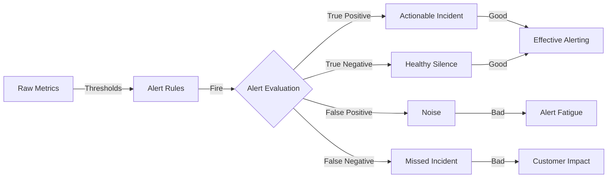
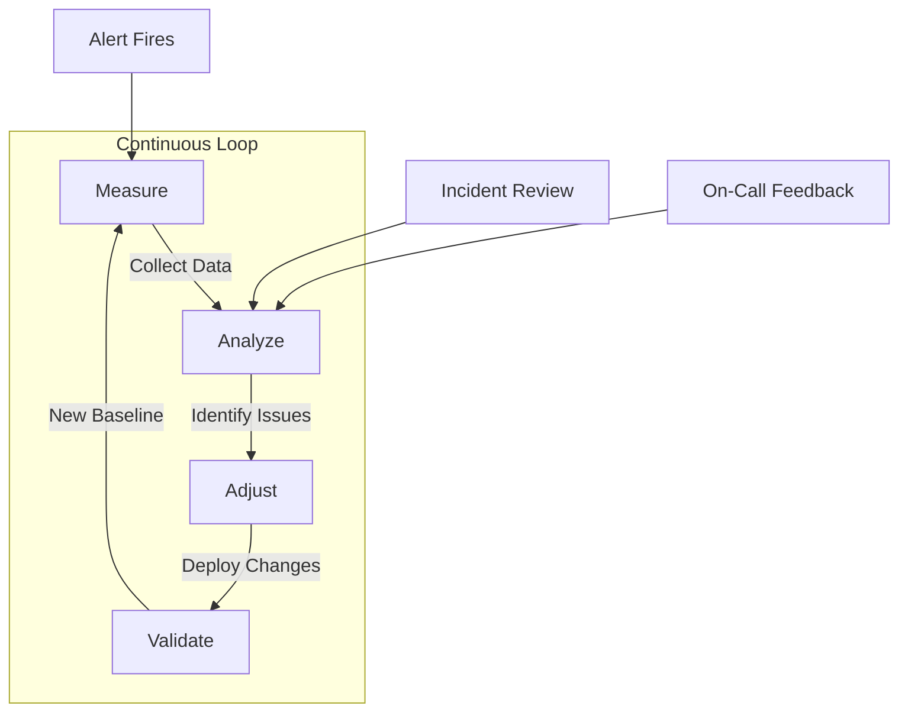
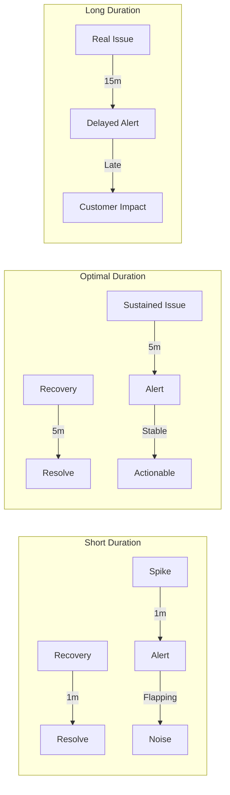
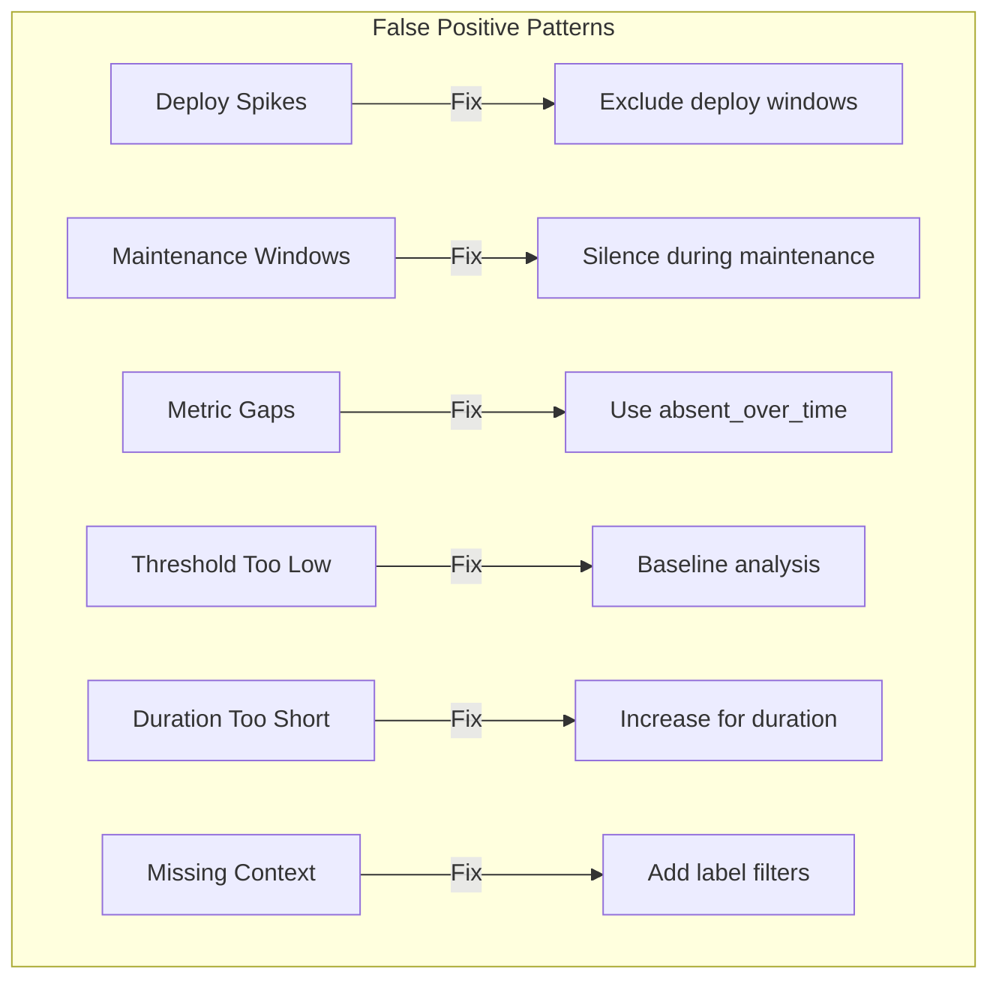
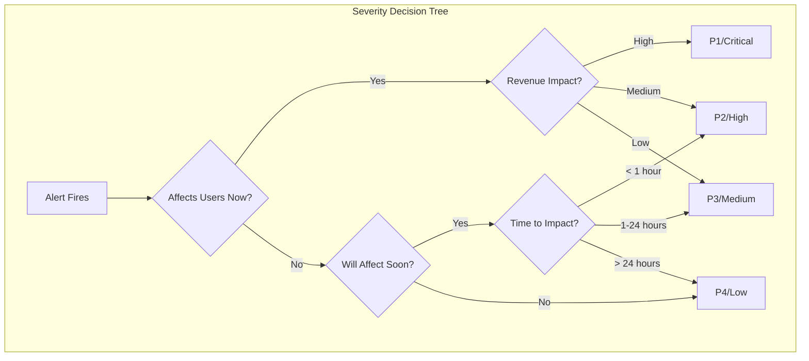
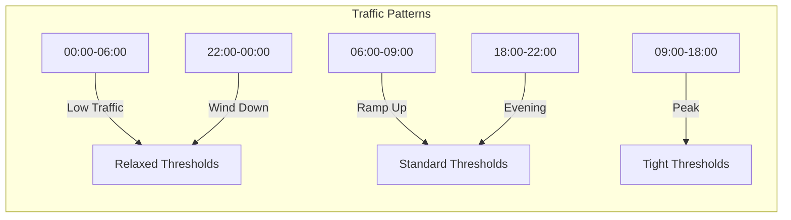
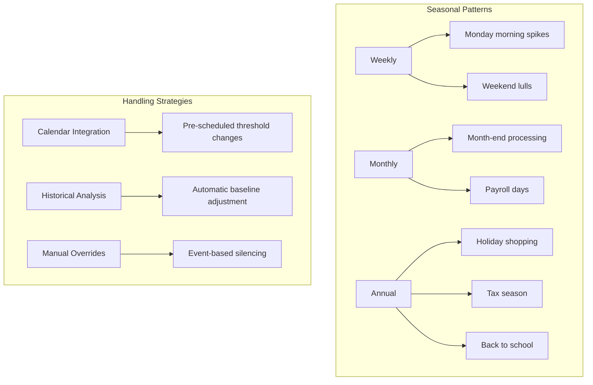
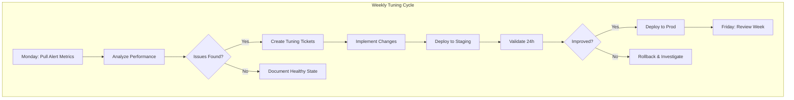

# How to Create Alert Tuning Process

Author: [nawazdhandala](https://github.com/nawazdhandala)

Tags: Alerting, SRE, Optimization, Monitoring

Description: Learn how to tune alerts for optimal signal-to-noise ratio.

---

Alert fatigue is the silent killer of SRE teams. When every alert feels urgent but most are noise, engineers stop paying attention. The result is missed incidents, burnout, and eroded trust in monitoring systems. A systematic alert tuning process transforms chaotic pagers into precise signals that drive action.

## Why Alert Tuning Matters

Effective alerting is the difference between catching issues before customers notice and scrambling through post-incident reviews. Poor alert hygiene leads to three destructive patterns.

**Alert fatigue**: Engineers ignore pages because most turn out to be false positives or non-actionable.

**Missed incidents**: Real problems get lost in the noise or dismissed as another false alarm.

**Burnout**: Constant interruptions destroy focus and drain on-call morale.

The goal of alert tuning is not fewer alerts. It is the right alerts at the right time with the right context.



## Building the Alert Tuning Process

A sustainable tuning process has four phases: measurement, analysis, adjustment, and validation. Each phase feeds into the next in a continuous improvement loop.



## Threshold Adjustment Methodology

Static thresholds fail in dynamic systems. A value that signals trouble at 2 AM might be normal during peak traffic. Start with baseline analysis before setting any threshold.

### Step 1: Establish Baselines

Collect at least two weeks of metric data before setting thresholds. Calculate percentiles to understand normal behavior.

```typescript
// baseline-calculator.ts
interface MetricSample {
  timestamp: Date;
  value: number;
  labels: Record<string, string>;
}

interface BaselineStats {
  p50: number;
  p90: number;
  p95: number;
  p99: number;
  mean: number;
  stdDev: number;
  min: number;
  max: number;
}

function calculateBaseline(samples: MetricSample[]): BaselineStats {
  const values = samples.map(s => s.value).sort((a, b) => a - b);
  const n = values.length;

  const sum = values.reduce((acc, v) => acc + v, 0);
  const mean = sum / n;

  const squaredDiffs = values.map(v => Math.pow(v - mean, 2));
  const variance = squaredDiffs.reduce((acc, v) => acc + v, 0) / n;
  const stdDev = Math.sqrt(variance);

  return {
    p50: values[Math.floor(n * 0.50)],
    p90: values[Math.floor(n * 0.90)],
    p95: values[Math.floor(n * 0.95)],
    p99: values[Math.floor(n * 0.99)],
    mean,
    stdDev,
    min: values[0],
    max: values[n - 1]
  };
}

// Usage: Calculate baseline for API latency
const latencySamples = await fetchMetrics('http_request_duration_seconds');
const baseline = calculateBaseline(latencySamples);

console.log(`Latency baseline:
  p50: ${baseline.p50}ms
  p95: ${baseline.p95}ms
  p99: ${baseline.p99}ms
  Normal range: ${baseline.mean - 2 * baseline.stdDev} to ${baseline.mean + 2 * baseline.stdDev}`);
```

### Step 2: Set Initial Thresholds

Use percentile-based thresholds rather than absolute values. This approach adapts to your specific service characteristics.

```yaml
# prometheus-rules.yaml
groups:
  - name: api-latency-alerts
    rules:
      # Warning: Latency exceeds p95 baseline
      - alert: HighLatencyWarning
        expr: |
          histogram_quantile(0.95,
            rate(http_request_duration_seconds_bucket[5m])
          ) > 0.5
        for: 5m
        labels:
          severity: warning
        annotations:
          summary: "API latency elevated"
          description: "p95 latency is {{ $value | printf \"%.2f\" }}s (threshold: 0.5s)"
          runbook: "https://runbooks.example.com/high-latency"

      # Critical: Latency exceeds p99 baseline significantly
      - alert: HighLatencyCritical
        expr: |
          histogram_quantile(0.99,
            rate(http_request_duration_seconds_bucket[5m])
          ) > 2.0
        for: 2m
        labels:
          severity: critical
        annotations:
          summary: "API latency critical"
          description: "p99 latency is {{ $value | printf \"%.2f\" }}s (threshold: 2.0s)"
          runbook: "https://runbooks.example.com/high-latency-critical"
```

### Step 3: Implement Dynamic Thresholds

For metrics with predictable patterns, use dynamic thresholds based on historical data. Compare current values to the same time window from previous periods.

```typescript
// dynamic-threshold.ts
interface ThresholdConfig {
  metricName: string;
  comparisonPeriods: number; // Number of previous periods to compare
  deviationMultiplier: number; // How many standard deviations trigger alert
  minAbsoluteThreshold: number; // Floor value to prevent over-sensitivity
}

async function calculateDynamicThreshold(
  config: ThresholdConfig,
  currentValue: number,
  currentHour: number,
  currentDayOfWeek: number
): Promise<{ shouldAlert: boolean; threshold: number; reason: string }> {
  // Fetch historical values for same hour and day of week
  const historicalValues = await fetchHistoricalValues({
    metric: config.metricName,
    hour: currentHour,
    dayOfWeek: currentDayOfWeek,
    periodsBack: config.comparisonPeriods
  });

  if (historicalValues.length < 3) {
    // Not enough history, fall back to absolute threshold
    return {
      shouldAlert: currentValue > config.minAbsoluteThreshold,
      threshold: config.minAbsoluteThreshold,
      reason: 'Insufficient historical data, using absolute threshold'
    };
  }

  const mean = historicalValues.reduce((a, b) => a + b, 0) / historicalValues.length;
  const stdDev = Math.sqrt(
    historicalValues.reduce((acc, v) => acc + Math.pow(v - mean, 2), 0) / historicalValues.length
  );

  const dynamicThreshold = Math.max(
    mean + config.deviationMultiplier * stdDev,
    config.minAbsoluteThreshold
  );

  return {
    shouldAlert: currentValue > dynamicThreshold,
    threshold: dynamicThreshold,
    reason: `Dynamic threshold based on ${historicalValues.length} historical samples`
  };
}
```

## Duration Tuning Strategies

The `for` clause in alert rules determines how long a condition must persist before firing. Too short creates flapping alerts. Too long delays response to real incidents.



### Duration Guidelines by Alert Type

Different alert types warrant different durations based on their impact and volatility.

```yaml
# alert-duration-guidelines.yaml
guidelines:
  # Availability alerts: Fast response needed
  service_down:
    recommended_duration: "1m"
    rationale: "Complete outages need immediate attention"
    example: "up == 0"

  # Error rate alerts: Allow for brief spikes
  high_error_rate:
    recommended_duration: "5m"
    rationale: "Brief error spikes during deploys are normal"
    example: "rate(http_requests_total{status=~'5..'}[5m]) / rate(http_requests_total[5m]) > 0.01"

  # Latency alerts: Sustained degradation matters
  high_latency:
    recommended_duration: "5m"
    rationale: "Transient latency spikes rarely indicate real issues"
    example: "histogram_quantile(0.95, rate(http_request_duration_seconds_bucket[5m])) > 1"

  # Resource alerts: Early warning with longer duration
  high_cpu:
    recommended_duration: "10m"
    rationale: "CPU can spike during legitimate bursts"
    example: "rate(process_cpu_seconds_total[5m]) > 0.8"

  # Disk alerts: Longest duration for slow-moving metrics
  disk_filling:
    recommended_duration: "15m"
    rationale: "Disk usage changes slowly, avoid false alarms"
    example: "predict_linear(node_filesystem_avail_bytes[6h], 24*3600) < 0"

  # SLO burn rate: Depends on window
  slo_burn_fast:
    recommended_duration: "2m"
    rationale: "Fast burn indicates active incident"
    example: "slo:error_budget_burn_rate:1h > 14.4"

  slo_burn_slow:
    recommended_duration: "1h"
    rationale: "Slow burn needs sustained observation"
    example: "slo:error_budget_burn_rate:6h > 6"
```

### Implementing Adaptive Duration

For critical paths, use multiple alert rules with different durations and severities.

```yaml
# multi-duration-alerts.yaml
groups:
  - name: payment-service-alerts
    rules:
      # Fast alert for complete outage
      - alert: PaymentServiceDown
        expr: up{job="payment-service"} == 0
        for: 30s
        labels:
          severity: critical
          team: payments

      # Medium alert for degraded performance
      - alert: PaymentServiceDegraded
        expr: |
          histogram_quantile(0.95,
            rate(payment_request_duration_seconds_bucket[5m])
          ) > 2
        for: 3m
        labels:
          severity: warning
          team: payments

      # Slow alert for concerning trends
      - alert: PaymentServiceTrending
        expr: |
          histogram_quantile(0.95,
            rate(payment_request_duration_seconds_bucket[30m])
          ) > 1.5
        for: 15m
        labels:
          severity: info
          team: payments
```

## False Positive Reduction

False positives destroy alert credibility. Systematic reduction requires categorization, root cause analysis, and targeted fixes.

### Categorize False Positives

Track every alert and categorize outcomes to identify patterns.

```typescript
// alert-tracker.ts
enum AlertOutcome {
  TRUE_POSITIVE_ACTIONED = 'true_positive_actioned',
  TRUE_POSITIVE_SELF_HEALED = 'true_positive_self_healed',
  FALSE_POSITIVE_NOISE = 'false_positive_noise',
  FALSE_POSITIVE_EXPECTED = 'false_positive_expected', // Maintenance, deploy, etc.
  FALSE_POSITIVE_MISCONFIGURED = 'false_positive_misconfigured',
  UNKNOWN = 'unknown'
}

interface AlertRecord {
  alertName: string;
  firedAt: Date;
  resolvedAt: Date;
  acknowledgedBy?: string;
  outcome: AlertOutcome;
  notes: string;
  actionsTaken: string[];
}

interface AlertAnalysis {
  alertName: string;
  totalFirings: number;
  truePositiveRate: number;
  meanTimeToAcknowledge: number;
  meanTimeToResolve: number;
  topFalsePositiveReasons: { reason: string; count: number }[];
  recommendation: string;
}

function analyzeAlertPerformance(records: AlertRecord[]): AlertAnalysis[] {
  const byAlert = groupBy(records, r => r.alertName);

  return Object.entries(byAlert).map(([alertName, alertRecords]) => {
    const truePositives = alertRecords.filter(r =>
      r.outcome === AlertOutcome.TRUE_POSITIVE_ACTIONED ||
      r.outcome === AlertOutcome.TRUE_POSITIVE_SELF_HEALED
    );

    const falsePositives = alertRecords.filter(r =>
      r.outcome.startsWith('false_positive')
    );

    const truePositiveRate = truePositives.length / alertRecords.length;

    // Categorize false positive reasons
    const fpReasons = falsePositives.reduce((acc, r) => {
      acc[r.outcome] = (acc[r.outcome] || 0) + 1;
      return acc;
    }, {} as Record<string, number>);

    let recommendation: string;
    if (truePositiveRate < 0.5) {
      recommendation = 'RETIRE or REWORK: More noise than signal';
    } else if (truePositiveRate < 0.8) {
      recommendation = 'TUNE: Adjust thresholds or duration';
    } else {
      recommendation = 'MAINTAIN: Alert is performing well';
    }

    return {
      alertName,
      totalFirings: alertRecords.length,
      truePositiveRate,
      meanTimeToAcknowledge: calculateMTTA(alertRecords),
      meanTimeToResolve: calculateMTTR(alertRecords),
      topFalsePositiveReasons: Object.entries(fpReasons)
        .map(([reason, count]) => ({ reason, count }))
        .sort((a, b) => b.count - a.count),
      recommendation
    };
  });
}
```

### Common False Positive Patterns and Fixes



### Implementing Alert Suppression During Known Events

```yaml
# alertmanager-config.yaml
route:
  receiver: 'default'
  routes:
    # Suppress during deployments
    - match:
        deploy_suppressed: 'true'
      receiver: 'null'
      continue: false

    # Route by severity
    - match:
        severity: 'critical'
      receiver: 'pagerduty-critical'

    - match:
        severity: 'warning'
      receiver: 'slack-warnings'

inhibit_rules:
  # If a service is down, suppress all other alerts for that service
  - source_match:
      alertname: 'ServiceDown'
    target_match_re:
      alertname: '.+'
    equal: ['service']

  # Suppress warnings when critical is firing for same alert
  - source_match:
      severity: 'critical'
    target_match:
      severity: 'warning'
    equal: ['alertname', 'service']
```

## Severity Level Calibration

Severity determines who gets paged and how urgently. Miscalibrated severity wastes on-call attention or delays critical responses.

### Severity Matrix

Define severity based on user impact and urgency.



### Severity Definitions

```typescript
// severity-config.ts
interface SeverityLevel {
  name: string;
  code: string;
  responseTime: string;
  escalationTime: string;
  notificationChannels: string[];
  examples: string[];
}

const severityLevels: SeverityLevel[] = [
  {
    name: 'Critical',
    code: 'P1',
    responseTime: '5 minutes',
    escalationTime: '15 minutes',
    notificationChannels: ['pagerduty', 'phone', 'slack-incidents'],
    examples: [
      'Complete service outage',
      'Data loss or corruption',
      'Security breach in progress',
      'Payment processing down'
    ]
  },
  {
    name: 'High',
    code: 'P2',
    responseTime: '15 minutes',
    escalationTime: '1 hour',
    notificationChannels: ['pagerduty', 'slack-incidents'],
    examples: [
      'Partial outage affecting subset of users',
      'Severe performance degradation',
      'Error rate above SLO threshold',
      'Critical dependency degraded'
    ]
  },
  {
    name: 'Medium',
    code: 'P3',
    responseTime: '1 hour',
    escalationTime: '4 hours',
    notificationChannels: ['slack-alerts'],
    examples: [
      'Performance degradation within SLO',
      'Non-critical feature unavailable',
      'Elevated error rate below threshold',
      'Resource approaching capacity'
    ]
  },
  {
    name: 'Low',
    code: 'P4',
    responseTime: '24 hours',
    escalationTime: 'None',
    notificationChannels: ['slack-alerts', 'email'],
    examples: [
      'Informational alerts',
      'Capacity planning warnings',
      'Non-urgent maintenance needed',
      'Development environment issues'
    ]
  }
];
```

### Automated Severity Assignment

```typescript
// severity-calculator.ts
interface AlertContext {
  serviceTier: 'critical' | 'standard' | 'internal';
  affectedUsers: number;
  errorRate: number;
  latencyImpact: number; // multiplier of baseline
  isRevenueImpacting: boolean;
  timeOfDay: 'business' | 'offhours';
}

function calculateSeverity(context: AlertContext): string {
  let score = 0;

  // Service tier weight
  const tierScores = { critical: 40, standard: 20, internal: 5 };
  score += tierScores[context.serviceTier];

  // User impact
  if (context.affectedUsers > 10000) score += 30;
  else if (context.affectedUsers > 1000) score += 20;
  else if (context.affectedUsers > 100) score += 10;

  // Error rate
  if (context.errorRate > 0.1) score += 25;
  else if (context.errorRate > 0.05) score += 15;
  else if (context.errorRate > 0.01) score += 5;

  // Latency impact
  if (context.latencyImpact > 5) score += 20;
  else if (context.latencyImpact > 2) score += 10;

  // Revenue impact
  if (context.isRevenueImpacting) score += 20;

  // Time adjustment (lower severity during off-hours for non-critical)
  if (context.timeOfDay === 'offhours' && context.serviceTier !== 'critical') {
    score = Math.floor(score * 0.7);
  }

  // Map score to severity
  if (score >= 80) return 'critical';
  if (score >= 50) return 'high';
  if (score >= 25) return 'medium';
  return 'low';
}
```

## Time-of-Day Adjustments

User behavior patterns mean different thresholds make sense at different times. A latency spike at 3 AM with minimal traffic is different from the same spike during peak hours.



### Time-Aware Alert Rules

```yaml
# time-based-alerts.yaml
groups:
  - name: business-hours-alerts
    rules:
      # Stricter during business hours
      - alert: HighErrorRateBusinessHours
        expr: |
          (
            rate(http_requests_total{status=~"5.."}[5m])
            / rate(http_requests_total[5m])
          ) > 0.01
          and ON() hour() >= 9 < 18
          and ON() day_of_week() >= 1 <= 5
        for: 5m
        labels:
          severity: critical
          time_context: business_hours
        annotations:
          summary: "High error rate during business hours"

      # More lenient outside business hours
      - alert: HighErrorRateOffHours
        expr: |
          (
            rate(http_requests_total{status=~"5.."}[5m])
            / rate(http_requests_total[5m])
          ) > 0.05
          and ON() (hour() < 9 or hour() >= 18 or day_of_week() < 1 or day_of_week() > 5)
        for: 10m
        labels:
          severity: warning
          time_context: off_hours
        annotations:
          summary: "High error rate during off-hours"
```

### Implementing Time-Based Threshold Service

```typescript
// time-threshold-service.ts
interface TimeWindow {
  startHour: number;
  endHour: number;
  daysOfWeek: number[]; // 0 = Sunday, 6 = Saturday
  thresholdMultiplier: number;
}

interface TimeBasedThreshold {
  baseThreshold: number;
  windows: TimeWindow[];
}

const latencyThresholds: TimeBasedThreshold = {
  baseThreshold: 500, // ms
  windows: [
    // Business hours: stricter
    {
      startHour: 9,
      endHour: 18,
      daysOfWeek: [1, 2, 3, 4, 5],
      thresholdMultiplier: 1.0
    },
    // Evening: slightly relaxed
    {
      startHour: 18,
      endHour: 22,
      daysOfWeek: [1, 2, 3, 4, 5],
      thresholdMultiplier: 1.5
    },
    // Night: more relaxed
    {
      startHour: 22,
      endHour: 9,
      daysOfWeek: [0, 1, 2, 3, 4, 5, 6],
      thresholdMultiplier: 2.0
    },
    // Weekends: relaxed
    {
      startHour: 0,
      endHour: 24,
      daysOfWeek: [0, 6],
      thresholdMultiplier: 2.0
    }
  ]
};

function getCurrentThreshold(config: TimeBasedThreshold): number {
  const now = new Date();
  const currentHour = now.getHours();
  const currentDay = now.getDay();

  // Find matching window (most specific wins)
  const matchingWindow = config.windows
    .filter(w => {
      const hourMatch = w.startHour < w.endHour
        ? currentHour >= w.startHour && currentHour < w.endHour
        : currentHour >= w.startHour || currentHour < w.endHour;
      const dayMatch = w.daysOfWeek.includes(currentDay);
      return hourMatch && dayMatch;
    })
    .sort((a, b) => a.thresholdMultiplier - b.thresholdMultiplier)[0];

  const multiplier = matchingWindow?.thresholdMultiplier || 1.0;
  return config.baseThreshold * multiplier;
}
```

## Seasonal Pattern Handling

Some systems have weekly, monthly, or annual patterns. E-commerce sites spike during holidays. Financial systems see month-end surges. Accounting for these patterns prevents predictable false positives.



### Seasonal Threshold Configuration

```typescript
// seasonal-thresholds.ts
interface SeasonalEvent {
  name: string;
  type: 'recurring' | 'one-time';
  schedule: {
    // For recurring events
    months?: number[];
    daysOfMonth?: number[];
    daysOfWeek?: number[];
    // For one-time events (ISO date strings)
    startDate?: string;
    endDate?: string;
  };
  thresholdAdjustments: Record<string, number>; // metric -> multiplier
}

const seasonalEvents: SeasonalEvent[] = [
  {
    name: 'Black Friday / Cyber Monday',
    type: 'recurring',
    schedule: {
      months: [11], // November
      daysOfMonth: [24, 25, 26, 27, 28] // Approximate
    },
    thresholdAdjustments: {
      'http_requests_per_second': 5.0,
      'order_processing_time_ms': 2.0,
      'database_connections': 3.0
    }
  },
  {
    name: 'Month-end Processing',
    type: 'recurring',
    schedule: {
      daysOfMonth: [28, 29, 30, 31, 1, 2]
    },
    thresholdAdjustments: {
      'batch_job_duration_seconds': 2.0,
      'database_cpu_usage': 1.5
    }
  },
  {
    name: 'Monday Morning Surge',
    type: 'recurring',
    schedule: {
      daysOfWeek: [1], // Monday
      // Assume we have hour handling elsewhere
    },
    thresholdAdjustments: {
      'login_requests_per_second': 3.0,
      'email_queue_depth': 5.0
    }
  }
];

function getSeasonalMultiplier(
  metric: string,
  date: Date = new Date()
): number {
  const month = date.getMonth();
  const dayOfMonth = date.getDate();
  const dayOfWeek = date.getDay();

  let maxMultiplier = 1.0;

  for (const event of seasonalEvents) {
    let matches = false;

    if (event.type === 'recurring') {
      const monthMatch = !event.schedule.months ||
        event.schedule.months.includes(month);
      const dayOfMonthMatch = !event.schedule.daysOfMonth ||
        event.schedule.daysOfMonth.includes(dayOfMonth);
      const dayOfWeekMatch = !event.schedule.daysOfWeek ||
        event.schedule.daysOfWeek.includes(dayOfWeek);

      matches = monthMatch && dayOfMonthMatch && dayOfWeekMatch;
    } else if (event.type === 'one-time') {
      const start = new Date(event.schedule.startDate!);
      const end = new Date(event.schedule.endDate!);
      matches = date >= start && date <= end;
    }

    if (matches && event.thresholdAdjustments[metric]) {
      maxMultiplier = Math.max(
        maxMultiplier,
        event.thresholdAdjustments[metric]
      );
    }
  }

  return maxMultiplier;
}
```

### Using Recording Rules for Seasonal Baselines

```yaml
# seasonal-recording-rules.yaml
groups:
  - name: seasonal-baselines
    interval: 1h
    rules:
      # Calculate same-hour, same-day-of-week average from past 4 weeks
      - record: metric:baseline:hourly_weekly
        expr: |
          avg_over_time(
            http_request_duration_seconds:rate5m[4w]
            offset 0s
          )
          # This is simplified - real implementation needs subqueries

      # Error rate baseline by day of week
      - record: error_rate:baseline:daily
        expr: |
          avg by (service, day_of_week) (
            label_replace(
              rate(http_requests_total{status=~"5.."}[1d]),
              "day_of_week", "$1", "", ""
            )
          )
```

## Implementing the Complete Tuning Workflow

Bring all components together into an automated tuning workflow.



### Alert Performance Dashboard Query

```yaml
# grafana-dashboard.json (queries section)
panels:
  - title: "Alert True Positive Rate"
    type: "stat"
    targets:
      - expr: |
          sum(alert_outcomes_total{outcome="true_positive"})
          / sum(alert_outcomes_total)

  - title: "Alerts by Outcome"
    type: "piechart"
    targets:
      - expr: sum by (outcome) (alert_outcomes_total)

  - title: "Mean Time to Acknowledge"
    type: "stat"
    targets:
      - expr: |
          avg(alert_acknowledge_time_seconds)

  - title: "Noisiest Alerts (Past 7 Days)"
    type: "table"
    targets:
      - expr: |
          topk(10,
            sum by (alertname) (
              increase(ALERTS_FOR_STATE{alertstate="firing"}[7d])
            )
          )

  - title: "Alert Volume Trend"
    type: "timeseries"
    targets:
      - expr: |
          sum(increase(ALERTS_FOR_STATE{alertstate="firing"}[1d]))
```

## Key Metrics to Track

Monitor the health of your alerting system with these metrics.

| Metric | Target | Action if Out of Range |
|--------|--------|----------------------|
| True Positive Rate | > 80% | Tighten thresholds, add context |
| Mean Time to Acknowledge | < 5 min (P1), < 15 min (P2) | Review escalation paths |
| Alerts per On-Call Shift | < 10 actionable | Reduce noise, consolidate |
| Alert to Incident Ratio | > 50% | Retire low-value alerts |
| Time in Firing State | Varies by alert | Review duration settings |
| Escalation Rate | < 10% | Improve runbooks, training |

## Best Practices Summary

**Start with SLOs**: Alerts should protect error budgets and user experience, not arbitrary technical metrics.

**Measure everything**: Track alert outcomes religiously. What you do not measure, you cannot improve.

**Tune incrementally**: Change one variable at a time. Give each change at least a week to evaluate.

**Involve on-call engineers**: The people getting paged have the best insight into alert quality.

**Document decisions**: Record why thresholds were set. Future you will thank past you.

**Automate where possible**: Dynamic thresholds and seasonal adjustments reduce manual tuning burden.

**Review regularly**: Schedule monthly alert reviews. Entropy accumulates.

---

Alert tuning is not a project with an end date. It is an ongoing practice that evolves with your system. Start with the highest-noise alerts, apply the methodology systematically, and measure the impact. Over time, your alerting system transforms from a source of fatigue into a trusted early warning system that catches issues before customers do.
