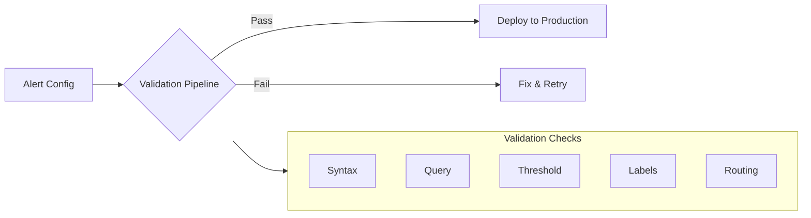
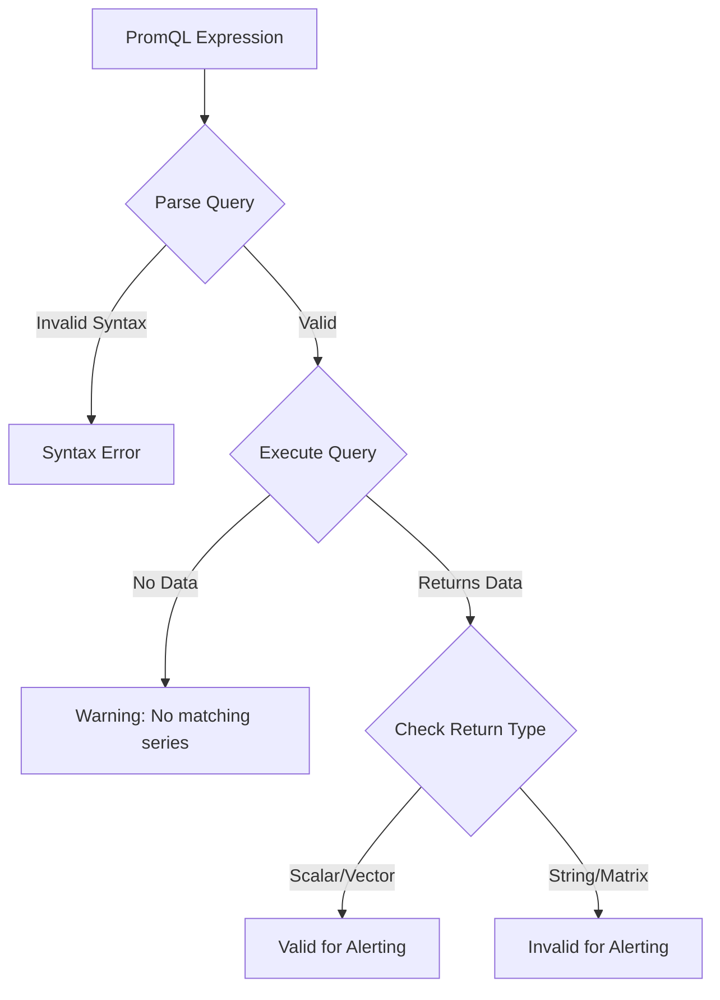
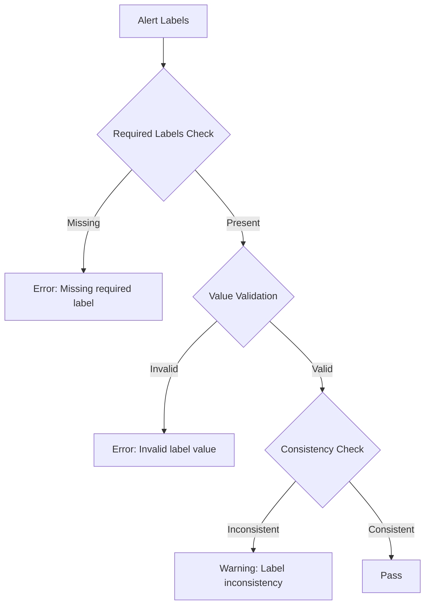
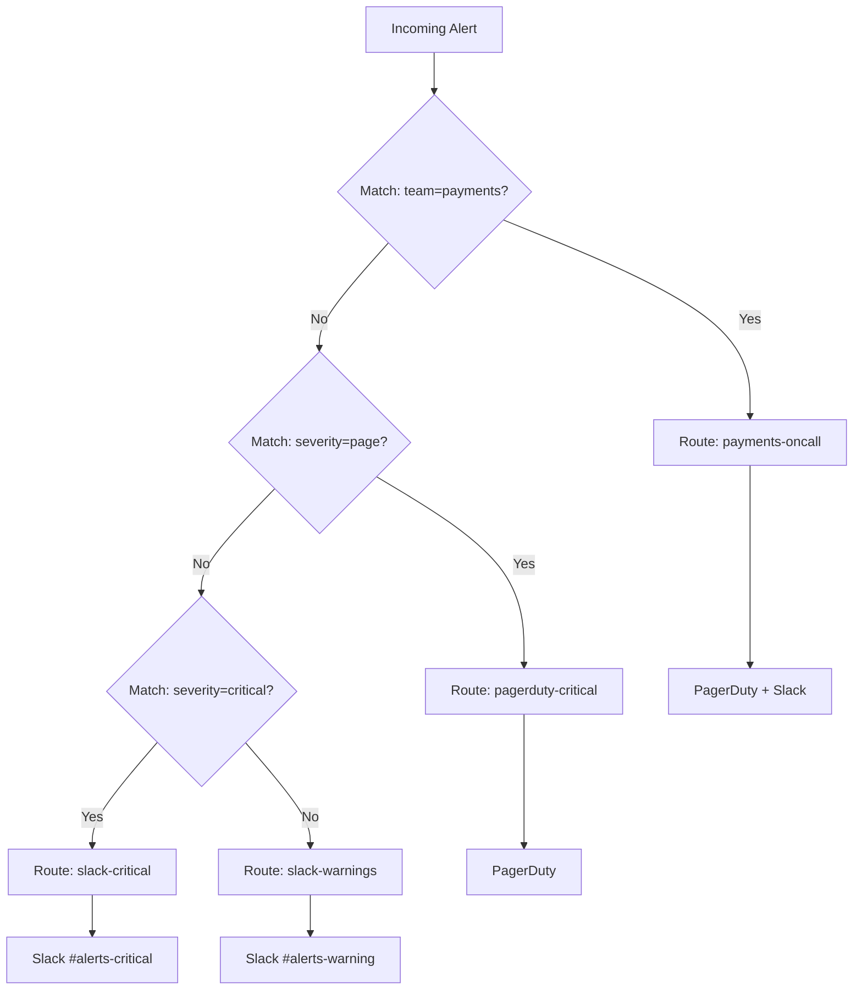
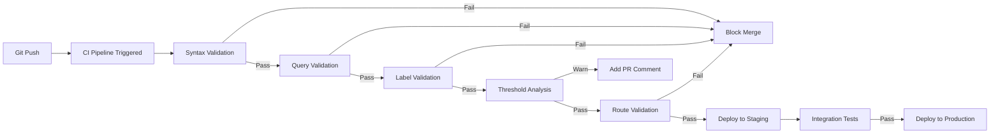

# How to Implement Alert Validation

Author: [nawazdhandala](https://github.com/nawazdhandala)

Tags: Alerting, Validation, SRE, Monitoring

Description: Learn how to validate alert configurations before deployment.

---

Alert validation is one of the most overlooked practices in SRE. Teams spend hours crafting alert rules, only to discover syntax errors at 3 AM when a critical alert fails to fire. This guide shows you how to implement comprehensive alert validation that catches problems before they reach production.

## Why Alert Validation Matters

Broken alerts create a false sense of security. A misconfigured alert rule is worse than no alert at all because you assume coverage exists when it does not. Alert validation helps you:

- Catch syntax errors before deployment
- Verify queries return expected data types
- Ensure thresholds make sense for the metric
- Confirm routing reaches the right teams
- Prevent alert storms from bad configurations



## 1. Syntax Validation for Alert Rules

Start with basic YAML and schema validation. This catches structural errors before anything else runs.

### Prometheus Alert Rule Schema Validation

```yaml
# alerting-rules.yaml
groups:
  - name: api-alerts
    rules:
      - alert: HighErrorRate
        expr: |
          sum(rate(http_requests_total{status=~"5.."}[5m]))
          /
          sum(rate(http_requests_total[5m])) > 0.05
        for: 5m
        labels:
          severity: critical
          team: platform
        annotations:
          summary: "High error rate detected"
          description: "Error rate is {{ $value | humanizePercentage }}"
```

### Python Validator Script

```python
#!/usr/bin/env python3
"""
alert_syntax_validator.py - Validates Prometheus alert rule syntax
"""

import yaml
import sys
import re
from pathlib import Path
from typing import List, Dict, Any

REQUIRED_FIELDS = ['alert', 'expr']
OPTIONAL_FIELDS = ['for', 'labels', 'annotations']
VALID_SEVERITY_LEVELS = ['info', 'warning', 'critical', 'page']

def validate_alert_rule(rule: Dict[str, Any], rule_index: int, group_name: str) -> List[str]:
    """Validate a single alert rule and return list of errors."""
    errors = []
    context = f"group '{group_name}', rule {rule_index}"

    # Check required fields
    for field in REQUIRED_FIELDS:
        if field not in rule:
            errors.append(f"{context}: Missing required field '{field}'")

    # Validate alert name format
    if 'alert' in rule:
        alert_name = rule['alert']
        if not re.match(r'^[A-Z][a-zA-Z0-9]+$', alert_name):
            errors.append(
                f"{context}: Alert name '{alert_name}' should be CamelCase"
            )

    # Validate 'for' duration format
    if 'for' in rule:
        duration = rule['for']
        if not re.match(r'^\d+[smhd]$', duration):
            errors.append(
                f"{context}: Invalid duration format '{duration}'. "
                "Use format like '5m', '1h', '30s'"
            )

    # Validate labels
    if 'labels' in rule:
        labels = rule['labels']
        if 'severity' in labels:
            if labels['severity'] not in VALID_SEVERITY_LEVELS:
                errors.append(
                    f"{context}: Invalid severity '{labels['severity']}'. "
                    f"Must be one of: {VALID_SEVERITY_LEVELS}"
                )
        else:
            errors.append(f"{context}: Missing 'severity' label")

        if 'team' not in labels:
            errors.append(f"{context}: Missing 'team' label for routing")

    # Validate annotations
    if 'annotations' in rule:
        annotations = rule['annotations']
        if 'summary' not in annotations:
            errors.append(f"{context}: Missing 'summary' annotation")
        if 'description' not in annotations:
            errors.append(f"{context}: Missing 'description' annotation")

    return errors

def validate_alert_file(filepath: Path) -> List[str]:
    """Validate an entire alert rules file."""
    errors = []

    try:
        with open(filepath) as f:
            content = yaml.safe_load(f)
    except yaml.YAMLError as e:
        return [f"YAML parsing error: {e}"]

    if not content or 'groups' not in content:
        return ["Missing 'groups' key in alert rules file"]

    for group in content['groups']:
        if 'name' not in group:
            errors.append("Alert group missing 'name' field")
            continue

        group_name = group['name']

        if 'rules' not in group:
            errors.append(f"Group '{group_name}' has no rules")
            continue

        for idx, rule in enumerate(group['rules'], 1):
            errors.extend(validate_alert_rule(rule, idx, group_name))

    return errors

def main():
    if len(sys.argv) < 2:
        print("Usage: python alert_syntax_validator.py <alert_rules.yaml>")
        sys.exit(1)

    filepath = Path(sys.argv[1])
    errors = validate_alert_file(filepath)

    if errors:
        print(f"Validation failed with {len(errors)} error(s):")
        for error in errors:
            print(f"  - {error}")
        sys.exit(1)
    else:
        print("Validation passed!")
        sys.exit(0)

if __name__ == "__main__":
    main()
```

### Using promtool for Native Validation

Prometheus provides a built-in tool for rule validation:

```bash
# Install promtool (comes with Prometheus)
# Validate alert rules
promtool check rules alerting-rules.yaml

# Output on success:
# Checking alerting-rules.yaml
#   SUCCESS: 5 rules found

# Output on failure:
# Checking alerting-rules.yaml
#   FAILED: error parsing rules file: parse error at line 8
```

## 2. PromQL Query Validation

Syntax validation is not enough. The query itself might be syntactically correct but semantically wrong. Validate queries actually work against your Prometheus instance.



### Query Validation Script

```python
#!/usr/bin/env python3
"""
promql_validator.py - Validates PromQL queries against Prometheus
"""

import requests
import yaml
import sys
from typing import Dict, Any, List, Tuple
from urllib.parse import urljoin

class PromQLValidator:
    def __init__(self, prometheus_url: str):
        self.prometheus_url = prometheus_url.rstrip('/')

    def validate_query(self, expr: str) -> Tuple[bool, str]:
        """
        Validate a PromQL expression.
        Returns (is_valid, message).
        """
        # First, check syntax via the parse endpoint
        parse_url = f"{self.prometheus_url}/api/v1/parse_query"
        try:
            resp = requests.post(parse_url, data={'query': expr}, timeout=10)
            if resp.status_code != 200:
                return False, f"Parse error: {resp.json().get('error', 'Unknown')}"
        except requests.RequestException as e:
            return False, f"Connection error: {e}"

        # Then, verify the query returns data
        query_url = f"{self.prometheus_url}/api/v1/query"
        try:
            resp = requests.get(
                query_url,
                params={'query': expr},
                timeout=30
            )
            data = resp.json()

            if data['status'] != 'success':
                return False, f"Query error: {data.get('error', 'Unknown')}"

            result_type = data['data']['resultType']
            results = data['data']['result']

            # Alerts need instant vectors or scalars
            if result_type not in ['vector', 'scalar']:
                return False, f"Invalid result type '{result_type}' for alerting"

            if not results:
                return True, "Warning: Query returns no data (check metric names)"

            return True, f"Valid: Returns {len(results)} series"

        except requests.RequestException as e:
            return False, f"Query execution error: {e}"

    def validate_alert_file(self, filepath: str) -> List[Dict[str, Any]]:
        """Validate all queries in an alert rules file."""
        results = []

        with open(filepath) as f:
            content = yaml.safe_load(f)

        for group in content.get('groups', []):
            for rule in group.get('rules', []):
                alert_name = rule.get('alert', 'unnamed')
                expr = rule.get('expr', '')

                is_valid, message = self.validate_query(expr)
                results.append({
                    'alert': alert_name,
                    'valid': is_valid,
                    'message': message,
                    'expression': expr[:100] + '...' if len(expr) > 100 else expr
                })

        return results

def main():
    prometheus_url = "http://localhost:9090"
    filepath = sys.argv[1] if len(sys.argv) > 1 else "alerting-rules.yaml"

    validator = PromQLValidator(prometheus_url)
    results = validator.validate_alert_file(filepath)

    has_errors = False
    for result in results:
        status = "PASS" if result['valid'] else "FAIL"
        if not result['valid']:
            has_errors = True
        print(f"[{status}] {result['alert']}: {result['message']}")

    sys.exit(1 if has_errors else 0)

if __name__ == "__main__":
    main()
```

### Example Validation Output

```bash
$ python promql_validator.py alerting-rules.yaml
[PASS] HighErrorRate: Valid: Returns 3 series
[PASS] HighLatency: Valid: Returns 5 series
[FAIL] DiskSpaceWarning: Query error: unknown metric: node_filesystem_free
[PASS] MemoryPressure: Warning: Query returns no data (check metric names)
```

## 3. Threshold Sanity Checks

Thresholds that are too sensitive cause alert fatigue. Thresholds that are too lenient miss real incidents. Validate thresholds against historical data.

### Threshold Analyzer

```python
#!/usr/bin/env python3
"""
threshold_analyzer.py - Analyzes alert thresholds against historical data
"""

import requests
import yaml
from datetime import datetime, timedelta
from typing import Dict, Any, List

class ThresholdAnalyzer:
    def __init__(self, prometheus_url: str):
        self.prometheus_url = prometheus_url.rstrip('/')

    def analyze_threshold(
        self,
        expr: str,
        threshold: float,
        operator: str,
        lookback_days: int = 7
    ) -> Dict[str, Any]:
        """
        Analyze how often a threshold would have fired historically.
        """
        # Query historical data
        end = datetime.now()
        start = end - timedelta(days=lookback_days)

        query_url = f"{self.prometheus_url}/api/v1/query_range"

        # Remove the comparison operator to get raw values
        base_expr = self._extract_base_expression(expr)

        resp = requests.get(query_url, params={
            'query': base_expr,
            'start': start.isoformat() + 'Z',
            'end': end.isoformat() + 'Z',
            'step': '5m'
        }, timeout=60)

        data = resp.json()
        if data['status'] != 'success':
            return {'error': data.get('error', 'Unknown error')}

        results = data['data']['result']
        if not results:
            return {'error': 'No historical data available'}

        # Analyze threshold violations
        total_samples = 0
        violations = 0
        values = []

        for series in results:
            for timestamp, value in series['values']:
                try:
                    v = float(value)
                    values.append(v)
                    total_samples += 1

                    if self._check_threshold(v, threshold, operator):
                        violations += 1
                except ValueError:
                    continue

        if not values:
            return {'error': 'No valid samples found'}

        violation_rate = (violations / total_samples) * 100

        return {
            'total_samples': total_samples,
            'violations': violations,
            'violation_rate': round(violation_rate, 2),
            'min_value': round(min(values), 4),
            'max_value': round(max(values), 4),
            'avg_value': round(sum(values) / len(values), 4),
            'recommendation': self._get_recommendation(violation_rate)
        }

    def _extract_base_expression(self, expr: str) -> str:
        """Extract the base expression without comparison operator."""
        for op in ['>=', '<=', '!=', '>', '<', '==']:
            if op in expr:
                return expr.split(op)[0].strip()
        return expr

    def _check_threshold(self, value: float, threshold: float, operator: str) -> bool:
        """Check if a value violates the threshold."""
        ops = {
            '>': lambda v, t: v > t,
            '>=': lambda v, t: v >= t,
            '<': lambda v, t: v < t,
            '<=': lambda v, t: v <= t,
            '==': lambda v, t: v == t,
            '!=': lambda v, t: v != t,
        }
        return ops.get(operator, lambda v, t: False)(value, threshold)

    def _get_recommendation(self, violation_rate: float) -> str:
        """Provide threshold recommendation based on violation rate."""
        if violation_rate > 20:
            return "NOISY: Threshold too sensitive. Consider raising it."
        elif violation_rate > 5:
            return "MODERATE: May cause alert fatigue. Review threshold."
        elif violation_rate < 0.1:
            return "QUIET: May be too lenient. Verify it catches real issues."
        else:
            return "GOOD: Threshold appears well-calibrated."

def main():
    analyzer = ThresholdAnalyzer("http://localhost:9090")

    # Example: Analyze error rate threshold
    result = analyzer.analyze_threshold(
        expr='sum(rate(http_requests_total{status=~"5.."}[5m])) / sum(rate(http_requests_total[5m]))',
        threshold=0.05,
        operator='>',
        lookback_days=7
    )

    print("Threshold Analysis Results:")
    print(f"  Total samples analyzed: {result.get('total_samples', 'N/A')}")
    print(f"  Threshold violations: {result.get('violations', 'N/A')}")
    print(f"  Violation rate: {result.get('violation_rate', 'N/A')}%")
    print(f"  Value range: {result.get('min_value', 'N/A')} - {result.get('max_value', 'N/A')}")
    print(f"  Average value: {result.get('avg_value', 'N/A')}")
    print(f"  Recommendation: {result.get('recommendation', 'N/A')}")

if __name__ == "__main__":
    main()
```

### Threshold Validation Rules

```yaml
# threshold-policies.yaml
policies:
  error_rate:
    metric_pattern: ".*error.*rate.*"
    min_threshold: 0.001    # At least 0.1%
    max_threshold: 0.20     # No more than 20%
    recommended: 0.05       # 5% is a good default

  latency_p99:
    metric_pattern: ".*latency.*p99.*"
    min_threshold: 0.1      # At least 100ms
    max_threshold: 30       # No more than 30s
    recommended: 2.0        # 2s for most services

  saturation:
    metric_pattern: ".*(cpu|memory|disk).*utilization.*"
    min_threshold: 0.50     # At least 50%
    max_threshold: 0.95     # No more than 95%
    recommended: 0.80       # 80% is typical
```

## 4. Label Consistency Validation

Inconsistent labels break routing and make dashboards unreliable. Enforce label standards across all alerts.



### Label Validation Configuration

```yaml
# label-policies.yaml
required_labels:
  - name: severity
    allowed_values:
      - info
      - warning
      - critical
      - page
    description: "Incident severity level"

  - name: team
    pattern: "^[a-z]+-[a-z]+$"  # e.g., platform-core, payments-fraud
    description: "Owning team in format 'group-subgroup'"

  - name: service
    pattern: "^[a-z][a-z0-9-]*$"
    description: "Service identifier"

recommended_labels:
  - name: tier
    allowed_values:
      - frontend
      - backend
      - database
      - infrastructure
    description: "Service tier for prioritization"

  - name: environment
    allowed_values:
      - production
      - staging
      - development
    description: "Deployment environment"

prohibited_labels:
  - name: env
    reason: "Use 'environment' instead for consistency"
  - name: sev
    reason: "Use 'severity' instead for consistency"
```

### Label Validator Script

```python
#!/usr/bin/env python3
"""
label_validator.py - Validates alert labels against policies
"""

import yaml
import re
import sys
from pathlib import Path
from typing import Dict, Any, List

class LabelValidator:
    def __init__(self, policy_file: str):
        with open(policy_file) as f:
            self.policies = yaml.safe_load(f)

    def validate_labels(self, labels: Dict[str, str], alert_name: str) -> List[str]:
        """Validate labels against policies."""
        errors = []
        warnings = []

        # Check required labels
        for req in self.policies.get('required_labels', []):
            label_name = req['name']

            if label_name not in labels:
                errors.append(
                    f"Alert '{alert_name}': Missing required label '{label_name}'"
                )
                continue

            value = labels[label_name]

            # Check allowed values
            if 'allowed_values' in req:
                if value not in req['allowed_values']:
                    errors.append(
                        f"Alert '{alert_name}': Label '{label_name}' has invalid "
                        f"value '{value}'. Allowed: {req['allowed_values']}"
                    )

            # Check pattern
            if 'pattern' in req:
                if not re.match(req['pattern'], value):
                    errors.append(
                        f"Alert '{alert_name}': Label '{label_name}' value '{value}' "
                        f"does not match pattern '{req['pattern']}'"
                    )

        # Check for prohibited labels
        for prohibited in self.policies.get('prohibited_labels', []):
            if prohibited['name'] in labels:
                errors.append(
                    f"Alert '{alert_name}': Prohibited label '{prohibited['name']}'. "
                    f"Reason: {prohibited['reason']}"
                )

        # Check recommended labels (warnings only)
        for rec in self.policies.get('recommended_labels', []):
            label_name = rec['name']
            if label_name not in labels:
                warnings.append(
                    f"Alert '{alert_name}': Consider adding label '{label_name}' "
                    f"({rec.get('description', '')})"
                )

        return errors, warnings

    def validate_file(self, alert_file: str) -> Dict[str, List[str]]:
        """Validate all alerts in a file."""
        with open(alert_file) as f:
            content = yaml.safe_load(f)

        all_errors = []
        all_warnings = []

        for group in content.get('groups', []):
            for rule in group.get('rules', []):
                alert_name = rule.get('alert', 'unnamed')
                labels = rule.get('labels', {})

                errors, warnings = self.validate_labels(labels, alert_name)
                all_errors.extend(errors)
                all_warnings.extend(warnings)

        return {'errors': all_errors, 'warnings': all_warnings}

def main():
    validator = LabelValidator('label-policies.yaml')
    results = validator.validate_file('alerting-rules.yaml')

    if results['errors']:
        print("ERRORS:")
        for error in results['errors']:
            print(f"  - {error}")

    if results['warnings']:
        print("\nWARNINGS:")
        for warning in results['warnings']:
            print(f"  - {warning}")

    sys.exit(1 if results['errors'] else 0)

if __name__ == "__main__":
    main()
```

## 5. Routing Path Verification

An alert that fires but never reaches the right person is useless. Validate that every alert has a working notification path.

### Alertmanager Routing Visualization



### Route Validation Script

```python
#!/usr/bin/env python3
"""
route_validator.py - Validates alert routing in Alertmanager
"""

import yaml
import requests
import sys
from typing import Dict, Any, List, Optional

class RouteValidator:
    def __init__(self, alertmanager_url: str):
        self.alertmanager_url = alertmanager_url.rstrip('/')
        self.config = self._fetch_config()

    def _fetch_config(self) -> Dict[str, Any]:
        """Fetch Alertmanager configuration."""
        resp = requests.get(
            f"{self.alertmanager_url}/api/v2/status",
            timeout=10
        )
        return yaml.safe_load(resp.json()['config']['original'])

    def find_route(self, labels: Dict[str, str]) -> List[Dict[str, Any]]:
        """Find which routes an alert with given labels would match."""
        matches = []
        self._match_route(self.config['route'], labels, matches, [])
        return matches

    def _match_route(
        self,
        route: Dict[str, Any],
        labels: Dict[str, str],
        matches: List[Dict[str, Any]],
        path: List[str]
    ):
        """Recursively match routes."""
        current_path = path + [route.get('receiver', 'default')]

        # Check if labels match this route
        match_labels = route.get('match', {})
        match_re = route.get('match_re', {})

        matches_route = True

        for key, value in match_labels.items():
            if labels.get(key) != value:
                matches_route = False
                break

        for key, pattern in match_re.items():
            import re
            if not re.match(pattern, labels.get(key, '')):
                matches_route = False
                break

        if matches_route:
            matches.append({
                'receiver': route.get('receiver'),
                'path': ' -> '.join(current_path),
                'continue': route.get('continue', False)
            })

            # Check child routes
            for child in route.get('routes', []):
                self._match_route(child, labels, matches, current_path)

                # Stop if we matched and continue is False
                if matches and not route.get('continue', False):
                    return

    def validate_alert_routing(self, alert_file: str) -> List[Dict[str, Any]]:
        """Validate routing for all alerts in a file."""
        with open(alert_file) as f:
            content = yaml.safe_load(f)

        results = []

        for group in content.get('groups', []):
            for rule in group.get('rules', []):
                alert_name = rule.get('alert', 'unnamed')
                labels = rule.get('labels', {})
                labels['alertname'] = alert_name  # Alertmanager adds this

                routes = self.find_route(labels)

                if not routes:
                    results.append({
                        'alert': alert_name,
                        'status': 'ERROR',
                        'message': 'No matching route found',
                        'labels': labels
                    })
                elif routes[0]['receiver'] == 'null' or routes[0]['receiver'] is None:
                    results.append({
                        'alert': alert_name,
                        'status': 'WARNING',
                        'message': 'Routes to null receiver (silenced)',
                        'route': routes[0]['path']
                    })
                else:
                    results.append({
                        'alert': alert_name,
                        'status': 'OK',
                        'message': f"Routes to: {routes[0]['receiver']}",
                        'route': routes[0]['path']
                    })

        return results

    def verify_receivers_exist(self) -> List[str]:
        """Verify all referenced receivers are configured."""
        errors = []
        configured_receivers = {r['name'] for r in self.config.get('receivers', [])}

        def check_route(route):
            receiver = route.get('receiver')
            if receiver and receiver not in configured_receivers:
                errors.append(f"Route references undefined receiver: '{receiver}'")

            for child in route.get('routes', []):
                check_route(child)

        check_route(self.config['route'])
        return errors

def main():
    validator = RouteValidator("http://localhost:9093")

    # Check receiver configuration
    receiver_errors = validator.verify_receivers_exist()
    if receiver_errors:
        print("Receiver Configuration Errors:")
        for error in receiver_errors:
            print(f"  - {error}")

    # Validate alert routing
    results = validator.validate_alert_routing('alerting-rules.yaml')

    print("\nAlert Routing Validation:")
    for result in results:
        status_icon = {
            'OK': 'PASS',
            'WARNING': 'WARN',
            'ERROR': 'FAIL'
        }[result['status']]

        print(f"[{status_icon}] {result['alert']}: {result['message']}")
        if 'route' in result:
            print(f"       Path: {result['route']}")

    has_errors = any(r['status'] == 'ERROR' for r in results)
    sys.exit(1 if has_errors else 0)

if __name__ == "__main__":
    main()
```

## 6. CI/CD Alert Validation Pipeline

Integrate all validation steps into your CI/CD pipeline to catch issues before they reach production.



### GitHub Actions Workflow

```yaml
# .github/workflows/alert-validation.yaml
name: Alert Validation

on:
  pull_request:
    paths:
      - 'alerting/**'
      - 'prometheus/rules/**'

jobs:
  validate-alerts:
    runs-on: ubuntu-latest

    services:
      prometheus:
        image: prom/prometheus:latest
        ports:
          - 9090:9090
        options: >-
          --health-cmd "wget -q --spider http://localhost:9090/-/healthy"
          --health-interval 10s
          --health-timeout 5s
          --health-retries 5

    steps:
      - uses: actions/checkout@v4

      - name: Set up Python
        uses: actions/setup-python@v5
        with:
          python-version: '3.11'

      - name: Install dependencies
        run: |
          pip install pyyaml requests
          wget https://github.com/prometheus/prometheus/releases/download/v2.47.0/prometheus-2.47.0.linux-amd64.tar.gz
          tar xzf prometheus-*.tar.gz
          mv prometheus-*/promtool /usr/local/bin/

      - name: Syntax Validation (promtool)
        run: |
          for file in alerting/*.yaml; do
            echo "Validating $file..."
            promtool check rules "$file"
          done

      - name: Syntax Validation (Custom)
        run: |
          for file in alerting/*.yaml; do
            python scripts/alert_syntax_validator.py "$file"
          done

      - name: Query Validation
        run: |
          # Wait for Prometheus to be ready
          sleep 10
          for file in alerting/*.yaml; do
            python scripts/promql_validator.py "$file"
          done

      - name: Label Validation
        run: |
          for file in alerting/*.yaml; do
            python scripts/label_validator.py "$file"
          done

      - name: Threshold Analysis
        id: threshold
        continue-on-error: true
        run: |
          python scripts/threshold_analyzer.py alerting/*.yaml > threshold_report.txt
          cat threshold_report.txt

      - name: Comment Threshold Report on PR
        if: steps.threshold.outcome == 'success'
        uses: actions/github-script@v7
        with:
          script: |
            const fs = require('fs');
            const report = fs.readFileSync('threshold_report.txt', 'utf8');
            github.rest.issues.createComment({
              issue_number: context.issue.number,
              owner: context.repo.owner,
              repo: context.repo.repo,
              body: `## Threshold Analysis Report\n\`\`\`\n${report}\n\`\`\``
            });
```

### Pre-commit Hook

```yaml
# .pre-commit-config.yaml
repos:
  - repo: local
    hooks:
      - id: validate-alerts
        name: Validate Alert Rules
        entry: scripts/validate-all-alerts.sh
        language: script
        files: '^alerting/.*\.yaml$'
        pass_filenames: false
```

### Validation Script

```bash
#!/bin/bash
# scripts/validate-all-alerts.sh

set -e

echo "=== Alert Validation Pipeline ==="

# Step 1: Syntax validation
echo -e "\n[1/4] Syntax Validation..."
for file in alerting/*.yaml; do
    if [ -f "$file" ]; then
        promtool check rules "$file" || exit 1
        python scripts/alert_syntax_validator.py "$file" || exit 1
    fi
done
echo "Syntax validation passed!"

# Step 2: Label validation
echo -e "\n[2/4] Label Validation..."
for file in alerting/*.yaml; do
    if [ -f "$file" ]; then
        python scripts/label_validator.py "$file" || exit 1
    fi
done
echo "Label validation passed!"

# Step 3: Query validation (requires running Prometheus)
if curl -s http://localhost:9090/-/healthy > /dev/null 2>&1; then
    echo -e "\n[3/4] Query Validation..."
    for file in alerting/*.yaml; do
        if [ -f "$file" ]; then
            python scripts/promql_validator.py "$file" || exit 1
        fi
    done
    echo "Query validation passed!"
else
    echo -e "\n[3/4] Query Validation... SKIPPED (Prometheus not available)"
fi

# Step 4: Route validation (requires running Alertmanager)
if curl -s http://localhost:9093/-/healthy > /dev/null 2>&1; then
    echo -e "\n[4/4] Route Validation..."
    for file in alerting/*.yaml; do
        if [ -f "$file" ]; then
            python scripts/route_validator.py "$file" || exit 1
        fi
    done
    echo "Route validation passed!"
else
    echo -e "\n[4/4] Route Validation... SKIPPED (Alertmanager not available)"
fi

echo -e "\n=== All validations passed! ==="
```

## Complete Validation Framework

Here is a unified validation framework that combines all checks:

```python
#!/usr/bin/env python3
"""
alert_validator.py - Unified alert validation framework
"""

import yaml
import sys
import argparse
from pathlib import Path
from typing import Dict, List, Any
from dataclasses import dataclass
from enum import Enum

class Severity(Enum):
    ERROR = "ERROR"
    WARNING = "WARNING"
    INFO = "INFO"

@dataclass
class ValidationResult:
    check: str
    severity: Severity
    message: str
    alert: str = ""

class AlertValidator:
    def __init__(self, config_path: str = None):
        self.config = {}
        if config_path:
            with open(config_path) as f:
                self.config = yaml.safe_load(f)

    def validate(self, alert_file: str) -> List[ValidationResult]:
        """Run all validations on an alert file."""
        results = []

        with open(alert_file) as f:
            content = yaml.safe_load(f)

        # File-level checks
        results.extend(self._check_file_structure(content))

        # Rule-level checks
        for group in content.get('groups', []):
            group_name = group.get('name', 'unnamed')

            for rule in group.get('rules', []):
                alert_name = rule.get('alert', 'unnamed')
                results.extend(self._check_rule(rule, alert_name, group_name))

        return results

    def _check_file_structure(self, content: Dict) -> List[ValidationResult]:
        """Validate file structure."""
        results = []

        if not content:
            results.append(ValidationResult(
                check="file_structure",
                severity=Severity.ERROR,
                message="Empty file"
            ))
            return results

        if 'groups' not in content:
            results.append(ValidationResult(
                check="file_structure",
                severity=Severity.ERROR,
                message="Missing 'groups' key"
            ))

        return results

    def _check_rule(self, rule: Dict, alert_name: str, group_name: str) -> List[ValidationResult]:
        """Validate a single alert rule."""
        results = []

        # Required fields
        for field in ['alert', 'expr']:
            if field not in rule:
                results.append(ValidationResult(
                    check="required_fields",
                    severity=Severity.ERROR,
                    message=f"Missing required field '{field}'",
                    alert=alert_name
                ))

        # Alert name format
        if not alert_name[0].isupper():
            results.append(ValidationResult(
                check="naming_convention",
                severity=Severity.WARNING,
                message="Alert name should start with uppercase",
                alert=alert_name
            ))

        # Duration format
        if 'for' in rule:
            duration = rule['for']
            if not self._is_valid_duration(duration):
                results.append(ValidationResult(
                    check="duration_format",
                    severity=Severity.ERROR,
                    message=f"Invalid duration format: '{duration}'",
                    alert=alert_name
                ))

        # Required labels
        labels = rule.get('labels', {})
        for required_label in ['severity', 'team']:
            if required_label not in labels:
                results.append(ValidationResult(
                    check="required_labels",
                    severity=Severity.ERROR,
                    message=f"Missing required label '{required_label}'",
                    alert=alert_name
                ))

        # Severity values
        if 'severity' in labels:
            valid_severities = ['info', 'warning', 'critical', 'page']
            if labels['severity'] not in valid_severities:
                results.append(ValidationResult(
                    check="severity_value",
                    severity=Severity.ERROR,
                    message=f"Invalid severity '{labels['severity']}'",
                    alert=alert_name
                ))

        # Required annotations
        annotations = rule.get('annotations', {})
        for required_annotation in ['summary', 'description']:
            if required_annotation not in annotations:
                results.append(ValidationResult(
                    check="required_annotations",
                    severity=Severity.WARNING,
                    message=f"Missing annotation '{required_annotation}'",
                    alert=alert_name
                ))

        # Runbook link (recommended)
        if 'runbook_url' not in annotations:
            results.append(ValidationResult(
                check="runbook_link",
                severity=Severity.INFO,
                message="Consider adding 'runbook_url' annotation",
                alert=alert_name
            ))

        return results

    def _is_valid_duration(self, duration: str) -> bool:
        """Check if duration string is valid."""
        import re
        return bool(re.match(r'^\d+[smhd]$', duration))

    def print_results(self, results: List[ValidationResult]):
        """Print validation results."""
        errors = [r for r in results if r.severity == Severity.ERROR]
        warnings = [r for r in results if r.severity == Severity.WARNING]
        infos = [r for r in results if r.severity == Severity.INFO]

        if errors:
            print("\nERRORS:")
            for r in errors:
                alert_ctx = f"[{r.alert}] " if r.alert else ""
                print(f"  {alert_ctx}{r.message}")

        if warnings:
            print("\nWARNINGS:")
            for r in warnings:
                alert_ctx = f"[{r.alert}] " if r.alert else ""
                print(f"  {alert_ctx}{r.message}")

        if infos:
            print("\nINFO:")
            for r in infos:
                alert_ctx = f"[{r.alert}] " if r.alert else ""
                print(f"  {alert_ctx}{r.message}")

        print(f"\nSummary: {len(errors)} errors, {len(warnings)} warnings, {len(infos)} info")

        return len(errors) == 0

def main():
    parser = argparse.ArgumentParser(description='Validate alert rules')
    parser.add_argument('files', nargs='+', help='Alert rule files to validate')
    parser.add_argument('--config', help='Validation config file')
    parser.add_argument('--strict', action='store_true', help='Treat warnings as errors')
    args = parser.parse_args()

    validator = AlertValidator(args.config)
    all_passed = True

    for filepath in args.files:
        print(f"\n{'='*60}")
        print(f"Validating: {filepath}")
        print('='*60)

        results = validator.validate(filepath)
        passed = validator.print_results(results)

        if args.strict:
            passed = passed and not any(r.severity == Severity.WARNING for r in results)

        all_passed = all_passed and passed

    sys.exit(0 if all_passed else 1)

if __name__ == "__main__":
    main()
```

## Best Practices Summary

1. **Validate Early**: Catch errors in development, not production
2. **Validate Often**: Run validation on every commit
3. **Validate Completely**: Syntax, queries, thresholds, labels, and routing
4. **Automate Everything**: CI/CD pipelines should block bad alerts
5. **Document Standards**: Label policies and naming conventions should be explicit
6. **Test Routing**: Verify alerts reach the right team before deploying
7. **Analyze Thresholds**: Use historical data to calibrate sensitivity

---

Alert validation is not optional. It is the difference between a monitoring system you trust and one that gives you a false sense of security. Implement these validations today, and sleep better knowing your alerts will work when you need them most.
