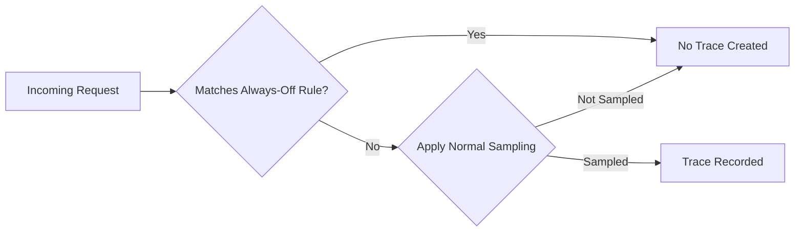
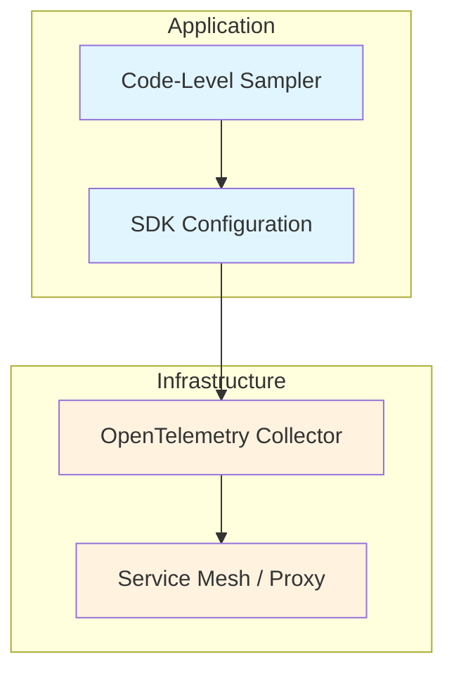
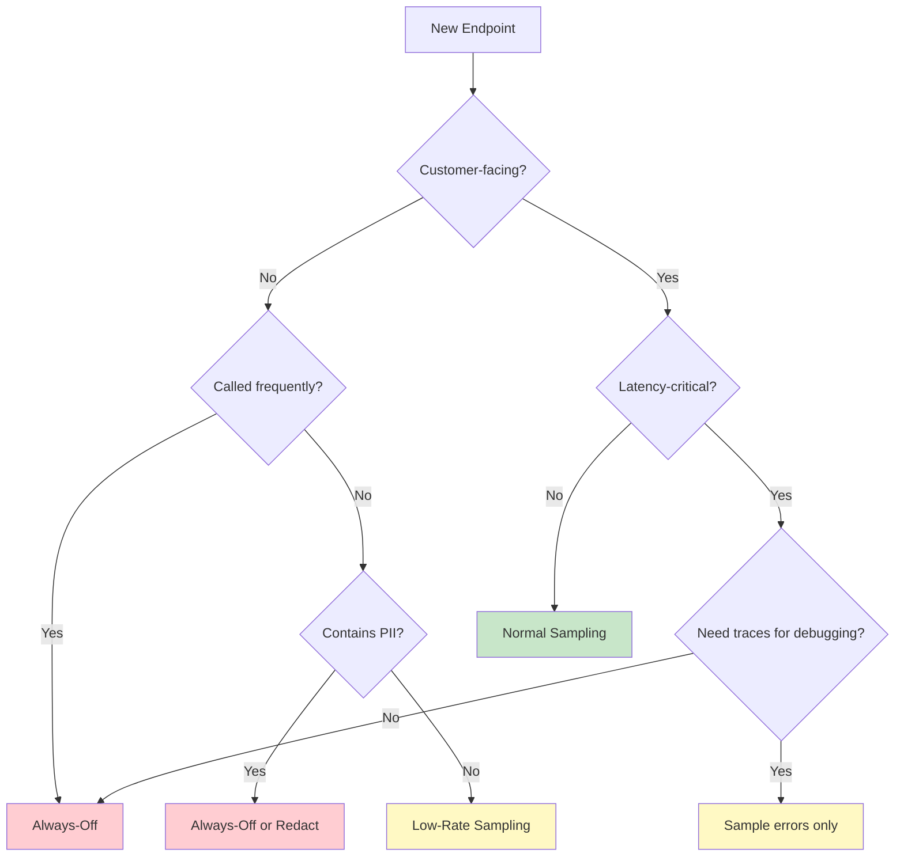

# How to Create Always-Off Sampling

Author: [nawazdhandala](https://github.com/nawazdhandala)

Tags: Observability, Tracing, OpenTelemetry, Sampling

Description: Learn when and how to implement always-off sampling to disable tracing selectively.

---

> Not every request deserves a trace. The art of observability is knowing when to look away.

Distributed tracing is powerful, but tracing *everything* creates noise, burns budget, and can even degrade performance. **Always-off sampling** is the deliberate decision to never record traces for specific paths, endpoints, or conditions. It's not about losing visibility - it's about focusing visibility where it matters.

This guide covers when to use always-off sampling, how to implement it at different layers (SDK, Collector, code), and patterns for dynamic toggling.

---

## Table of Contents

1. What Is Always-Off Sampling?
2. When to Disable Tracing
3. Implementation Approaches
4. Health Check Endpoint Exclusion
5. Internal Endpoint Filtering
6. Performance-Sensitive Path Exclusion
7. Conditional Sampling Toggling
8. Emergency Kill Switches
9. OpenTelemetry Collector Filtering
10. Best Practices
11. Common Pitfalls

---

## 1. What Is Always-Off Sampling?

Always-off sampling means explicitly configuring certain traces to **never be recorded or exported**. Unlike probabilistic sampling (where some percentage is kept), always-off is absolute: matching requests produce zero trace data.



The key difference from "just setting sampling to 0%" is intentionality. Always-off rules are explicit, documented, and targeted at specific patterns rather than applying globally.

---

## 2. When to Disable Tracing

### High-Volume, Low-Value Endpoints

| Endpoint Type | Why Exclude | Example |
|---------------|-------------|---------|
| Health checks | Called every few seconds by orchestrators; never fails interestingly | `/health`, `/healthz`, `/ready`, `/live` |
| Metrics endpoints | Scraped frequently; self-referential noise | `/metrics`, `/prometheus` |
| Static assets | No business logic; CDN should handle | `/static/*`, `/assets/*`, `*.css`, `*.js` |
| Favicon requests | Browser noise | `/favicon.ico` |

### Internal-Only Endpoints

| Endpoint Type | Why Exclude | Example |
|---------------|-------------|---------|
| Admin/debug endpoints | Not customer-facing; separate monitoring | `/debug/*`, `/admin/internal/*` |
| Service mesh probes | Infrastructure noise | Istio/Envoy health probes |
| Internal API versions | Legacy endpoints kept for compatibility | `/api/v1/internal/*` |

### Performance-Critical Paths

| Scenario | Why Exclude | Example |
|----------|-------------|---------|
| Hot loops in batch jobs | Span creation overhead adds up | Per-row processing in ETL |
| Real-time streaming | Microseconds matter | WebSocket message handlers |
| High-frequency trading | Latency-sensitive | Order matching engines |

### Compliance and Privacy

| Scenario | Why Exclude | Example |
|----------|-------------|---------|
| PII-heavy endpoints | Risk of leaking sensitive data in traces | `/api/users/*/profile` |
| Authentication flows | Credential handling | `/auth/login`, `/oauth/token` |

---

## 3. Implementation Approaches

You can implement always-off sampling at multiple layers:



| Layer | Pros | Cons |
|-------|------|------|
| Code-level | Zero overhead for excluded paths | Requires code changes |
| SDK config | Centralized per service | Still creates span objects |
| Collector | Decoupled from code | Network overhead before filtering |
| Service mesh | Language-agnostic | Less granular control |

**Recommendation**: Filter as early as possible. Code-level or SDK-level filtering eliminates overhead entirely.

---

## 4. Health Check Endpoint Exclusion

Health checks are the most common always-off target. They run every 5-30 seconds per pod, creating massive trace volume with zero diagnostic value.

### Node.js / Express with Auto-Instrumentation

```typescript
// telemetry.ts
import { NodeSDK } from '@opentelemetry/sdk-node';
import { getNodeAutoInstrumentations } from '@opentelemetry/auto-instrumentations-node';
import { OTLPTraceExporter } from '@opentelemetry/exporter-trace-otlp-http';

const sdk = new NodeSDK({
  traceExporter: new OTLPTraceExporter({
    url: process.env.OTEL_EXPORTER_OTLP_ENDPOINT,
  }),
  instrumentations: [
    getNodeAutoInstrumentations({
      '@opentelemetry/instrumentation-http': {
        ignoreIncomingRequestHook: (req) => {
          // Always-off for health endpoints
          const ignoredPaths = ['/health', '/healthz', '/ready', '/live', '/metrics'];
          return ignoredPaths.some(path => req.url?.startsWith(path));
        },
      },
    }),
  ],
});

sdk.start();
```

### Python / FastAPI

```python
# telemetry.py
from opentelemetry import trace
from opentelemetry.sdk.trace import TracerProvider
from opentelemetry.sdk.trace.export import BatchSpanProcessor
from opentelemetry.exporter.otlp.proto.grpc.trace_exporter import OTLPSpanExporter
from opentelemetry.instrumentation.fastapi import FastAPIInstrumentor

IGNORED_PATHS = {"/health", "/healthz", "/ready", "/live", "/metrics"}

def request_hook(span, scope):
    """Called for each request - return None to skip tracing."""
    pass

def should_trace(scope) -> bool:
    """Return False to disable tracing for this request."""
    path = scope.get("path", "")
    return path not in IGNORED_PATHS

# Configure provider
provider = TracerProvider()
provider.add_span_processor(BatchSpanProcessor(OTLPSpanExporter()))
trace.set_tracer_provider(provider)

# Instrument with exclusion filter
def exclude_health_checks(info):
    return info.request.url.path not in IGNORED_PATHS

FastAPIInstrumentor.instrument(
    excluded_urls=",".join(IGNORED_PATHS)
)
```

### Go with OpenTelemetry

```go
// telemetry.go
package main

import (
    "net/http"
    "strings"

    "go.opentelemetry.io/contrib/instrumentation/net/http/otelhttp"
)

var ignoredPaths = []string{"/health", "/healthz", "/ready", "/live", "/metrics"}

func shouldTrace(r *http.Request) bool {
    for _, path := range ignoredPaths {
        if strings.HasPrefix(r.URL.Path, path) {
            return false
        }
    }
    return true
}

func main() {
    handler := http.HandlerFunc(func(w http.ResponseWriter, r *http.Request) {
        // Your handler logic
    })

    // Wrap with conditional tracing
    tracedHandler := otelhttp.NewHandler(handler, "server",
        otelhttp.WithFilter(func(r *http.Request) bool {
            return shouldTrace(r)
        }),
    )

    http.ListenAndServe(":8080", tracedHandler)
}
```

---

## 5. Internal Endpoint Filtering

Internal endpoints (admin panels, debug routes, internal APIs) often need different treatment than customer-facing paths.

### Pattern-Based Exclusion

```typescript
// config/tracing-exclusions.ts
export const alwaysOffPatterns = {
  // Exact matches
  exact: new Set([
    '/favicon.ico',
    '/robots.txt',
    '/.well-known/health',
  ]),

  // Prefix matches
  prefixes: [
    '/internal/',
    '/admin/debug/',
    '/_next/static/',
    '/static/',
    '/assets/',
  ],

  // Regex patterns (use sparingly - performance cost)
  patterns: [
    /^\/api\/v[0-9]+\/internal\//,
    /\.(css|js|map|woff2?)$/,
  ],
};

export function shouldExcludeFromTracing(path: string): boolean {
  // Check exact matches first (fastest)
  if (alwaysOffPatterns.exact.has(path)) {
    return true;
  }

  // Check prefixes
  for (const prefix of alwaysOffPatterns.prefixes) {
    if (path.startsWith(prefix)) {
      return true;
    }
  }

  // Check regex patterns last (slowest)
  for (const pattern of alwaysOffPatterns.patterns) {
    if (pattern.test(path)) {
      return true;
    }
  }

  return false;
}
```

### Using the Filter

```typescript
// telemetry.ts
import { shouldExcludeFromTracing } from './config/tracing-exclusions';

const sdk = new NodeSDK({
  instrumentations: [
    getNodeAutoInstrumentations({
      '@opentelemetry/instrumentation-http': {
        ignoreIncomingRequestHook: (req) => shouldExcludeFromTracing(req.url || ''),
        ignoreOutgoingRequestHook: (req) => {
          // Also exclude outgoing calls to internal services
          const url = req.path || '';
          return url.includes('/internal/') || url.includes('/health');
        },
      },
    }),
  ],
});
```

---

## 6. Performance-Sensitive Path Exclusion

For latency-critical paths, even the overhead of creating (but not exporting) spans matters.

### Custom Sampler for Performance Paths

```typescript
// samplers/performance-aware-sampler.ts
import {
  Sampler,
  SamplingDecision,
  SamplingResult,
  Context,
  SpanKind,
  Attributes,
  Link,
} from '@opentelemetry/api';
import { ParentBasedSampler, TraceIdRatioBasedSampler } from '@opentelemetry/sdk-trace-base';

const PERFORMANCE_CRITICAL_OPERATIONS = new Set([
  'websocket.message',
  'stream.process',
  'batch.row.process',
  'cache.get',  // Hot path - trace at higher level only
]);

export class PerformanceAwareSampler implements Sampler {
  private readonly baseSampler: Sampler;

  constructor(baseRatio: number = 0.1) {
    this.baseSampler = new ParentBasedSampler({
      root: new TraceIdRatioBasedSampler(baseRatio),
    });
  }

  shouldSample(
    context: Context,
    traceId: string,
    spanName: string,
    spanKind: SpanKind,
    attributes: Attributes,
    links: Link[]
  ): SamplingResult {
    // Always-off for performance-critical operations
    if (PERFORMANCE_CRITICAL_OPERATIONS.has(spanName)) {
      return {
        decision: SamplingDecision.NOT_RECORD,
        attributes: {},
      };
    }

    // Delegate to base sampler for everything else
    return this.baseSampler.shouldSample(
      context, traceId, spanName, spanKind, attributes, links
    );
  }

  toString(): string {
    return 'PerformanceAwareSampler';
  }
}
```

### Usage

```typescript
// telemetry.ts
import { PerformanceAwareSampler } from './samplers/performance-aware-sampler';

const sdk = new NodeSDK({
  sampler: new PerformanceAwareSampler(0.1), // 10% base rate, 0% for critical paths
  // ... rest of config
});
```

---

## 7. Conditional Sampling Toggling

Sometimes you need to turn tracing on/off dynamically without redeploying.

### Environment Variable Toggle

```typescript
// samplers/toggleable-sampler.ts
import { Sampler, SamplingDecision, SamplingResult, Context, SpanKind, Attributes, Link } from '@opentelemetry/api';

export class ToggleableSampler implements Sampler {
  private readonly innerSampler: Sampler;
  private readonly envVar: string;

  constructor(innerSampler: Sampler, envVar: string = 'TRACING_ENABLED') {
    this.innerSampler = innerSampler;
    this.envVar = envVar;
  }

  shouldSample(
    context: Context,
    traceId: string,
    spanName: string,
    spanKind: SpanKind,
    attributes: Attributes,
    links: Link[]
  ): SamplingResult {
    // Check environment variable (supports hot-reload in some environments)
    const enabled = process.env[this.envVar] !== 'false';

    if (!enabled) {
      return {
        decision: SamplingDecision.NOT_RECORD,
        attributes: {},
      };
    }

    return this.innerSampler.shouldSample(
      context, traceId, spanName, spanKind, attributes, links
    );
  }

  toString(): string {
    return `ToggleableSampler(${this.envVar})`;
  }
}
```

### Feature Flag Integration

```typescript
// samplers/feature-flag-sampler.ts
import { Sampler, SamplingDecision, SamplingResult } from '@opentelemetry/api';

interface FeatureFlagClient {
  isEnabled(flag: string, context?: Record<string, any>): boolean;
}

export class FeatureFlagSampler implements Sampler {
  private readonly innerSampler: Sampler;
  private readonly flagClient: FeatureFlagClient;
  private readonly flagName: string;

  constructor(
    innerSampler: Sampler,
    flagClient: FeatureFlagClient,
    flagName: string = 'tracing-enabled'
  ) {
    this.innerSampler = innerSampler;
    this.flagClient = flagClient;
    this.flagName = flagName;
  }

  shouldSample(context, traceId, spanName, spanKind, attributes, links): SamplingResult {
    // Check feature flag
    const enabled = this.flagClient.isEnabled(this.flagName, {
      spanName,
      traceId,
    });

    if (!enabled) {
      return { decision: SamplingDecision.NOT_RECORD, attributes: {} };
    }

    return this.innerSampler.shouldSample(
      context, traceId, spanName, spanKind, attributes, links
    );
  }

  toString(): string {
    return `FeatureFlagSampler(${this.flagName})`;
  }
}
```

### Per-Endpoint Toggle via Config

```typescript
// config/sampling-config.ts
interface SamplingConfig {
  defaultEnabled: boolean;
  endpointOverrides: Record<string, boolean>;
}

// This could be loaded from a config service, file, or environment
export function loadSamplingConfig(): SamplingConfig {
  const configJson = process.env.SAMPLING_CONFIG || '{}';
  const parsed = JSON.parse(configJson);

  return {
    defaultEnabled: parsed.defaultEnabled ?? true,
    endpointOverrides: parsed.endpointOverrides ?? {},
  };
}

// Example config:
// {
//   "defaultEnabled": true,
//   "endpointOverrides": {
//     "/api/v1/search": false,      // High volume, disable
//     "/api/v1/checkout": true,     // Critical path, always trace
//     "/internal/*": false          // Internal endpoints, disable
//   }
// }
```

---

## 8. Emergency Kill Switches

When tracing causes production issues, you need a fast way to disable it entirely.

### Global Kill Switch

```typescript
// samplers/kill-switch-sampler.ts
import { Sampler, SamplingDecision, SamplingResult, Context, SpanKind, Attributes, Link } from '@opentelemetry/api';
import { AlwaysOffSampler } from '@opentelemetry/sdk-trace-base';

const KILL_SWITCH_FILE = '/etc/config/tracing-kill-switch';
const KILL_SWITCH_ENV = 'TRACING_KILL_SWITCH';

export class KillSwitchSampler implements Sampler {
  private readonly innerSampler: Sampler;
  private readonly alwaysOff: AlwaysOffSampler;
  private killSwitchActive: boolean = false;
  private lastCheck: number = 0;
  private readonly checkIntervalMs: number = 5000; // Check every 5 seconds

  constructor(innerSampler: Sampler) {
    this.innerSampler = innerSampler;
    this.alwaysOff = new AlwaysOffSampler();
  }

  private checkKillSwitch(): boolean {
    const now = Date.now();
    if (now - this.lastCheck < this.checkIntervalMs) {
      return this.killSwitchActive;
    }

    this.lastCheck = now;

    // Check environment variable first (fastest)
    if (process.env[KILL_SWITCH_ENV] === 'true') {
      this.killSwitchActive = true;
      return true;
    }

    // Check file-based kill switch (for Kubernetes ConfigMap updates)
    try {
      const fs = require('fs');
      if (fs.existsSync(KILL_SWITCH_FILE)) {
        const content = fs.readFileSync(KILL_SWITCH_FILE, 'utf8').trim();
        this.killSwitchActive = content === 'true' || content === '1';
        return this.killSwitchActive;
      }
    } catch {
      // File doesn't exist or can't be read - not an error
    }

    this.killSwitchActive = false;
    return false;
  }

  shouldSample(
    context: Context,
    traceId: string,
    spanName: string,
    spanKind: SpanKind,
    attributes: Attributes,
    links: Link[]
  ): SamplingResult {
    if (this.checkKillSwitch()) {
      return this.alwaysOff.shouldSample(
        context, traceId, spanName, spanKind, attributes, links
      );
    }

    return this.innerSampler.shouldSample(
      context, traceId, spanName, spanKind, attributes, links
    );
  }

  toString(): string {
    return `KillSwitchSampler(active=${this.killSwitchActive})`;
  }
}
```

### Kubernetes ConfigMap for Kill Switch

```yaml
# configmap.yaml
apiVersion: v1
kind: ConfigMap
metadata:
  name: tracing-config
data:
  kill-switch: "false"
---
# deployment.yaml (partial)
spec:
  containers:
    - name: app
      volumeMounts:
        - name: tracing-config
          mountPath: /etc/config
          readOnly: true
  volumes:
    - name: tracing-config
      configMap:
        name: tracing-config
        items:
          - key: kill-switch
            path: tracing-kill-switch
```

### Emergency Disable Command

```bash
# Instantly disable tracing across all pods
kubectl patch configmap tracing-config -p '{"data":{"kill-switch":"true"}}'

# Re-enable when issue is resolved
kubectl patch configmap tracing-config -p '{"data":{"kill-switch":"false"}}'
```

---

## 9. OpenTelemetry Collector Filtering

For filtering at the Collector level (after data leaves the application but before it reaches your backend):

### Filter Processor

```yaml
# otel-collector-config.yaml
receivers:
  otlp:
    protocols:
      grpc:
      http:

processors:
  # Filter out unwanted spans
  filter:
    error_mode: ignore
    traces:
      span:
        # Drop health check spans
        - 'attributes["http.route"] == "/health"'
        - 'attributes["http.route"] == "/healthz"'
        - 'attributes["http.route"] == "/ready"'
        - 'attributes["http.route"] == "/metrics"'
        # Drop static asset spans
        - 'attributes["http.route"] matches "^/static/.*"'
        - 'attributes["http.route"] matches ".*\\.(css|js|png|jpg|ico)$"'
        # Drop internal endpoints
        - 'attributes["http.route"] matches "^/internal/.*"'
        # Drop by span name
        - 'name == "healthcheck"'

  # Batch for efficiency
  batch:
    send_batch_size: 512
    timeout: 5s

exporters:
  otlphttp:
    endpoint: "https://oneuptime.com/otlp"
    headers:
      "x-oneuptime-token": "${ONEUPTIME_TOKEN}"

service:
  pipelines:
    traces:
      receivers: [otlp]
      processors: [filter, batch]
      exporters: [otlphttp]
```

### Conditional Dropping with Attributes

```yaml
processors:
  filter:
    traces:
      span:
        # Drop if explicitly marked as internal
        - 'attributes["trace.internal"] == true'
        # Drop debug spans in production
        - 'attributes["trace.level"] == "debug"'
        # Drop high-frequency batch operations
        - 'name matches "^batch\\.row\\..*" and attributes["batch.size"] > 1000'
```

### Always-Off via Sampling Processor

```yaml
processors:
  # Use probabilistic sampling with 0% for specific spans
  probabilistic_sampler:
    sampling_percentage: 0
    # This effectively creates always-off for everything
    # Use in combination with filter for selective always-off
```

---

## 10. Best Practices

### Document Your Exclusions

```typescript
// TRACING_EXCLUSIONS.md in your repo
/**
 * # Tracing Exclusions
 *
 * ## Health Endpoints (always-off)
 * - /health, /healthz, /ready, /live
 * - Reason: Called every 10s by K8s, no diagnostic value
 * - Added: 2024-01-15, PR #1234
 *
 * ## Static Assets (always-off)
 * - /static/*, *.css, *.js, *.png
 * - Reason: Served by CDN, no application logic
 * - Added: 2024-02-01, PR #1456
 *
 * ## Internal Debug Endpoints (always-off)
 * - /internal/*, /admin/debug/*
 * - Reason: Separate admin monitoring, avoid noise
 * - Added: 2024-02-15, PR #1567
 */
```

### Monitor Your Exclusions

Track how many requests are being excluded to ensure your rules are working:

```typescript
import { Counter } from '@opentelemetry/api';

const excludedRequestsCounter = meter.createCounter('tracing.excluded_requests', {
  description: 'Requests excluded from tracing',
});

function shouldExclude(path: string): boolean {
  const excluded = shouldExcludeFromTracing(path);
  if (excluded) {
    excludedRequestsCounter.add(1, { path_pattern: categorize(path) });
  }
  return excluded;
}
```

### Test Your Exclusions

```typescript
// __tests__/tracing-exclusions.test.ts
import { shouldExcludeFromTracing } from '../config/tracing-exclusions';

describe('Tracing Exclusions', () => {
  describe('health endpoints', () => {
    it.each(['/health', '/healthz', '/ready', '/live', '/metrics'])(
      'should exclude %s',
      (path) => {
        expect(shouldExcludeFromTracing(path)).toBe(true);
      }
    );
  });

  describe('API endpoints', () => {
    it.each(['/api/v1/users', '/api/v2/orders', '/checkout'])(
      'should NOT exclude %s',
      (path) => {
        expect(shouldExcludeFromTracing(path)).toBe(false);
      }
    );
  });

  describe('internal endpoints', () => {
    it('should exclude internal paths', () => {
      expect(shouldExcludeFromTracing('/internal/sync')).toBe(true);
      expect(shouldExcludeFromTracing('/admin/debug/cache')).toBe(true);
    });
  });
});
```

---

## 11. Common Pitfalls

| Pitfall | Why It Hurts | Better Approach |
|---------|--------------|-----------------|
| Excluding too aggressively | Lose visibility into real issues | Start conservative, expand exclusions based on data |
| Excluding at wrong layer | Collector filtering still has network overhead | Filter at SDK level for zero overhead |
| Not documenting exclusions | Team members don't know why traces are missing | Maintain exclusion docs with reasoning |
| Hardcoding exclusions | Can't adjust without redeploy | Use config files or feature flags |
| No kill switch | Can't respond to emergencies | Always have a way to disable tracing globally |
| Inconsistent across services | Some services trace health checks, others don't | Standardize exclusion patterns in shared library |

---

## Decision Flowchart



---

## Summary

| Goal | Implementation |
|------|----------------|
| Exclude health checks | SDK `ignoreIncomingRequestHook` or Collector filter |
| Exclude static assets | Path prefix matching at SDK level |
| Performance-critical paths | Custom sampler returning `NOT_RECORD` |
| Dynamic toggling | Environment variables or feature flags |
| Emergency disable | Kill switch file/env + fast ConfigMap update |
| Compliance/PII | Always-off for sensitive endpoints |

Always-off sampling is about intentional observability. By explicitly deciding what NOT to trace, you improve signal-to-noise ratio, reduce costs, and keep your tracing infrastructure focused on what matters: understanding and debugging real user issues.

---

**Related Reading:**

- [How to reduce noise in OpenTelemetry?](https://oneuptime.com/blog/post/2025-08-25-how-to-reduce-noise-in-opentelemetry/view)
- [What are Traces and Spans in OpenTelemetry: A Practical Guide](https://oneuptime.com/blog/post/2025-08-27-traces-and-spans-in-opentelemetry/view)
- [How to Structure Logs Properly in OpenTelemetry](https://oneuptime.com/blog/post/2025-08-28-how-to-structure-logs-properly-in-opentelemetry/view)
