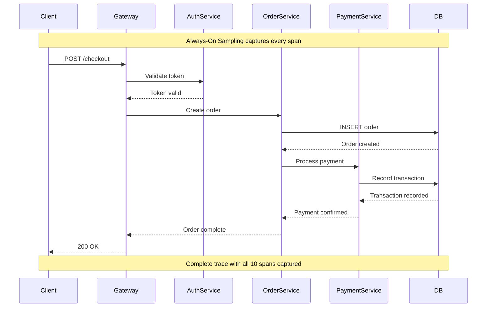
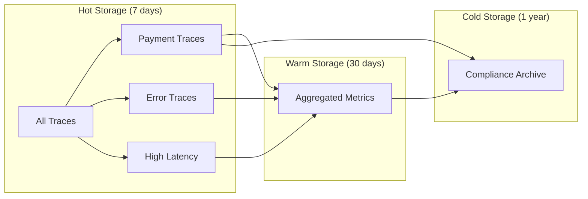
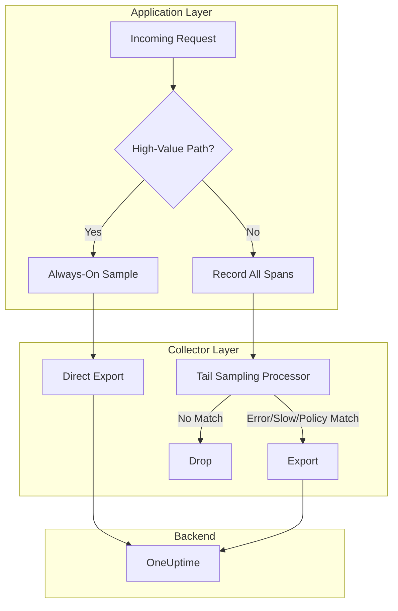

# How to Implement Always-On Sampling

Author: [nawazdhandala](https://github.com/nawazdhandala)

Tags: Observability, Tracing, OpenTelemetry, Sampling

Description: Learn when and how to implement always-on sampling for capturing every trace in your system.

---

> Most sampling strategies are about reduction. Always-on sampling is about **completeness**. When every request matters, you capture every request.

In distributed tracing, sampling is typically used to reduce data volume and cost. But there are scenarios where dropping even a single trace means losing critical visibility. This guide walks through when 100% sampling makes sense, how to implement it safely, and how to combine it with other strategies for production-grade observability.

---

## Table of Contents

1. When 100% Sampling Makes Sense
2. Development and Debugging Scenarios
3. High-Value Transaction Tracing
4. Cost and Storage Considerations
5. Always-On vs Tail-Based Hybrid
6. Production Safeguards
7. Implementation Examples
8. Monitoring Your Sampling Pipeline
9. Summary

---

## 1. When 100% Sampling Makes Sense

Always-on sampling (100% trace capture) is the right choice when:

| Scenario | Why 100% Matters |
|----------|------------------|
| Low-volume, high-value services | Every transaction represents significant business value |
| Financial transactions | Audit trails and compliance require complete records |
| Development/staging environments | Full visibility accelerates debugging |
| Critical path services | Payment gateways, authentication, core APIs |
| New service rollouts | Understanding behavior before scaling |
| Intermittent bugs | Rare issues require capturing every occurrence |

### The Decision Matrix

```
                    High Volume
                        |
     Tail-based    |    Head + Tail
     Sampling      |    Hybrid
                   |
   ----------------+------------------
                   |
     Always-On     |    Always-On +
     (Development) |    Aggregation
                   |
                    Low Volume
```

The bottom-left quadrant (low volume) is where always-on sampling shines without significant cost implications.

---

## 2. Development and Debugging Scenarios

Development environments benefit most from always-on sampling. You need complete visibility to understand system behavior, debug issues, and validate changes.

### Local Development Configuration

```typescript
// telemetry-dev.ts
import { NodeSDK } from '@opentelemetry/sdk-node';
import { getNodeAutoInstrumentations } from '@opentelemetry/auto-instrumentations-node';
import { OTLPTraceExporter } from '@opentelemetry/exporter-trace-otlp-http';
import { Resource } from '@opentelemetry/resources';
import { SemanticResourceAttributes } from '@opentelemetry/semantic-conventions';
import { AlwaysOnSampler } from '@opentelemetry/sdk-trace-base';

const traceExporter = new OTLPTraceExporter({
  url: process.env.OTEL_EXPORTER_OTLP_ENDPOINT || 'http://localhost:4318/v1/traces',
});

export const sdk = new NodeSDK({
  resource: new Resource({
    [SemanticResourceAttributes.SERVICE_NAME]: 'my-service',
    [SemanticResourceAttributes.DEPLOYMENT_ENVIRONMENT]: 'development',
  }),
  traceExporter,
  // Always-on: capture every trace in development
  sampler: new AlwaysOnSampler(),
  instrumentations: [getNodeAutoInstrumentations()],
});

sdk.start();
console.log('Tracing enabled with AlwaysOnSampler');
```

### Environment-Aware Sampler Selection

```typescript
// telemetry.ts
import { NodeSDK } from '@opentelemetry/sdk-node';
import {
  AlwaysOnSampler,
  ParentBasedSampler,
  TraceIdRatioBasedSampler
} from '@opentelemetry/sdk-trace-base';

function getSampler() {
  const env = process.env.NODE_ENV || 'development';
  const samplingRate = parseFloat(process.env.OTEL_TRACES_SAMPLER_ARG || '1.0');

  switch (env) {
    case 'development':
    case 'test':
      // Always-on for dev and test environments
      return new AlwaysOnSampler();

    case 'staging':
      // High sampling rate for staging (50-100%)
      return new ParentBasedSampler({
        root: new TraceIdRatioBasedSampler(Math.min(samplingRate, 1.0)),
      });

    case 'production':
      // Configurable rate for production (default 10%)
      return new ParentBasedSampler({
        root: new TraceIdRatioBasedSampler(samplingRate),
      });

    default:
      return new AlwaysOnSampler();
  }
}

export const sdk = new NodeSDK({
  sampler: getSampler(),
  // ... rest of configuration
});
```

### Debugging Flow Visualization

When debugging, always-on sampling lets you see the complete request flow:



---

## 3. High-Value Transaction Tracing

Some transactions are too important to sample. Payment processing, regulatory workflows, and critical business operations often require 100% capture.

### Attribute-Based Always-On Sampling

```typescript
// custom-sampler.ts
import {
  Sampler,
  SamplingDecision,
  SamplingResult
} from '@opentelemetry/sdk-trace-base';
import { Context, SpanKind, Attributes, Link } from '@opentelemetry/api';

export class HighValueTransactionSampler implements Sampler {
  private readonly baseSamplingRate: number;
  private readonly highValueAttributes: Set<string>;

  constructor(baseSamplingRate: number = 0.1) {
    this.baseSamplingRate = baseSamplingRate;
    this.highValueAttributes = new Set([
      '/api/payments',
      '/api/checkout',
      '/api/refunds',
      '/api/transfers',
      '/api/auth/login',
      '/api/auth/mfa',
    ]);
  }

  shouldSample(
    context: Context,
    traceId: string,
    spanName: string,
    spanKind: SpanKind,
    attributes: Attributes,
    links: Link[]
  ): SamplingResult {
    // Always sample high-value transactions
    const httpTarget = attributes['http.target'] as string;
    const httpRoute = attributes['http.route'] as string;
    const transactionType = attributes['transaction.type'] as string;

    const isHighValue =
      this.highValueAttributes.has(httpTarget) ||
      this.highValueAttributes.has(httpRoute) ||
      transactionType === 'payment' ||
      transactionType === 'financial';

    if (isHighValue) {
      return {
        decision: SamplingDecision.RECORD_AND_SAMPLED,
        attributes: { 'sampling.reason': 'high_value_transaction' },
      };
    }

    // Use probabilistic sampling for everything else
    const hash = this.hashTraceId(traceId);
    if (hash < this.baseSamplingRate) {
      return {
        decision: SamplingDecision.RECORD_AND_SAMPLED,
        attributes: { 'sampling.reason': 'probabilistic' },
      };
    }

    return { decision: SamplingDecision.NOT_RECORD };
  }

  private hashTraceId(traceId: string): number {
    // Simple hash to get deterministic 0-1 value from trace ID
    let hash = 0;
    for (let i = 0; i < traceId.length; i++) {
      hash = ((hash << 5) - hash) + traceId.charCodeAt(i);
      hash = hash & hash;
    }
    return Math.abs(hash) / 2147483647;
  }

  toString(): string {
    return `HighValueTransactionSampler{baseRate=${this.baseSamplingRate}}`;
  }
}
```

### Using the Custom Sampler

```typescript
// telemetry.ts
import { NodeSDK } from '@opentelemetry/sdk-node';
import { HighValueTransactionSampler } from './custom-sampler';

const sdk = new NodeSDK({
  sampler: new HighValueTransactionSampler(0.1), // 10% base, 100% high-value
  // ... rest of configuration
});
```

### Customer Tier-Based Sampling

```typescript
// tier-sampler.ts
import { Sampler, SamplingDecision, SamplingResult } from '@opentelemetry/sdk-trace-base';
import { Context, SpanKind, Attributes, Link } from '@opentelemetry/api';

export class CustomerTierSampler implements Sampler {
  private readonly tierRates: Map<string, number>;

  constructor() {
    this.tierRates = new Map([
      ['enterprise', 1.0],    // 100% for enterprise customers
      ['business', 0.5],      // 50% for business tier
      ['professional', 0.25], // 25% for professional
      ['free', 0.05],         // 5% for free tier
    ]);
  }

  shouldSample(
    context: Context,
    traceId: string,
    spanName: string,
    spanKind: SpanKind,
    attributes: Attributes,
    links: Link[]
  ): SamplingResult {
    const customerTier = (attributes['customer.tier'] as string) || 'free';
    const rate = this.tierRates.get(customerTier) || 0.05;

    // Deterministic sampling based on trace ID
    const hash = this.hashTraceId(traceId);

    if (hash < rate) {
      return {
        decision: SamplingDecision.RECORD_AND_SAMPLED,
        attributes: {
          'sampling.reason': 'customer_tier',
          'sampling.tier': customerTier,
          'sampling.rate': rate,
        },
      };
    }

    return { decision: SamplingDecision.NOT_RECORD };
  }

  private hashTraceId(traceId: string): number {
    let hash = 0;
    for (let i = 0; i < traceId.length; i++) {
      hash = ((hash << 5) - hash) + traceId.charCodeAt(i);
      hash = hash & hash;
    }
    return Math.abs(hash) / 2147483647;
  }

  toString(): string {
    return 'CustomerTierSampler';
  }
}
```

---

## 4. Cost and Storage Considerations

Always-on sampling significantly increases data volume. Understanding the cost implications is critical.

### Volume Estimation

| Metric | Formula | Example (1M requests/day) |
|--------|---------|---------------------------|
| Spans per trace | Avg spans x requests | 8 spans x 1M = 8M spans |
| Bytes per span | ~500-2000 bytes | ~1KB average |
| Daily volume | Spans x bytes | 8M x 1KB = 8GB/day |
| Monthly volume | Daily x 30 | 8GB x 30 = 240GB/month |

### Cost Comparison Matrix

```
Sampling Strategy     | Data Volume | Monthly Cost* | Use Case
---------------------|-------------|---------------|------------------
Always-On (100%)     | 240 GB      | $$$          | Dev, Low-volume prod
Head Sample (10%)    | 24 GB       | $            | High-volume prod
Tail Sample (errors) | 12-36 GB    | $-$$         | Production baseline
Hybrid               | 30-60 GB    | $$           | Balanced approach

* Relative cost indicator, actual costs vary by vendor
```

### Storage Tiering Strategy

```yaml
# OpenTelemetry Collector configuration for tiered storage
receivers:
  otlp:
    protocols:
      grpc:
      http:

processors:
  batch:
    send_batch_size: 1024
    timeout: 5s

  # Attribute-based routing for tiering
  attributes/tier:
    actions:
      - key: storage.tier
        value: hot
        action: insert

  # Route high-value to hot storage
  routing:
    from_attribute: transaction.type
    table:
      - value: payment
        exporters: [otlp/hot]
      - value: financial
        exporters: [otlp/hot]
    default_exporters: [otlp/warm]

exporters:
  otlp/hot:
    endpoint: "https://oneuptime.com/otlp"
    headers:
      x-oneuptime-token: "${ONEUPTIME_TOKEN}"

  otlp/warm:
    endpoint: "https://oneuptime.com/otlp"
    headers:
      x-oneuptime-token: "${ONEUPTIME_TOKEN}"
      x-storage-tier: "warm"

service:
  pipelines:
    traces:
      receivers: [otlp]
      processors: [batch, attributes/tier]
      exporters: [otlp/hot, otlp/warm]
```

### Retention Policies



---

## 5. Always-On vs Tail-Based Hybrid

The most effective production strategy often combines always-on sampling for specific paths with tail-based sampling for everything else.

### Hybrid Architecture



### Hybrid Collector Configuration

```yaml
# otel-collector-config.yaml
receivers:
  otlp:
    protocols:
      grpc:
        endpoint: 0.0.0.0:4317
      http:
        endpoint: 0.0.0.0:4318

processors:
  batch:
    send_batch_size: 512
    timeout: 5s

  # Memory limiter to prevent OOM
  memory_limiter:
    limit_mib: 1024
    spike_limit_mib: 256
    check_interval: 5s

  # Tail sampling for non-high-value traces
  tail_sampling:
    decision_wait: 10s
    num_traces: 100000
    expected_new_traces_per_sec: 1000
    policies:
      # Always keep high-value transactions (marked by app)
      - name: always-on-high-value
        type: string_attribute
        string_attribute:
          key: sampling.always_on
          values: ["true"]

      # Always keep errors
      - name: errors
        type: status_code
        status_code:
          status_codes: [ERROR]

      # Always keep slow traces
      - name: latency
        type: latency
        latency:
          threshold_ms: 500

      # Sample remaining traces at 10%
      - name: probabilistic
        type: probabilistic
        probabilistic:
          sampling_percentage: 10

  # Filter health checks
  filter:
    traces:
      span:
        - 'attributes["http.target"] == "/health"'
        - 'attributes["http.target"] == "/ready"'
        - 'attributes["http.target"] == "/metrics"'

exporters:
  otlp:
    endpoint: "https://oneuptime.com/otlp"
    headers:
      x-oneuptime-token: "${ONEUPTIME_TOKEN}"

service:
  pipelines:
    traces:
      receivers: [otlp]
      processors: [memory_limiter, filter, tail_sampling, batch]
      exporters: [otlp]
```

### Application-Side Marking for Hybrid

```typescript
// Mark high-value traces at the application level
import { trace, context, SpanStatusCode } from '@opentelemetry/api';

const tracer = trace.getTracer('payment-service');

async function processPayment(paymentData: PaymentInput) {
  return tracer.startActiveSpan('payment.process', {
    attributes: {
      // This attribute ensures the trace is always kept
      'sampling.always_on': 'true',
      'transaction.type': 'payment',
      'payment.amount': paymentData.amount,
      'payment.currency': paymentData.currency,
    },
  }, async (span) => {
    try {
      const result = await executePayment(paymentData);
      span.setAttribute('payment.status', result.status);
      return result;
    } catch (error: any) {
      span.recordException(error);
      span.setStatus({ code: SpanStatusCode.ERROR, message: error.message });
      throw error;
    } finally {
      span.end();
    }
  });
}
```

---

## 6. Production Safeguards

Running always-on sampling in production requires safeguards to prevent system overload.

### Circuit Breaker Pattern

```typescript
// circuit-breaker-sampler.ts
import { Sampler, SamplingDecision, SamplingResult } from '@opentelemetry/sdk-trace-base';
import { Context, SpanKind, Attributes, Link } from '@opentelemetry/api';

interface CircuitBreakerState {
  isOpen: boolean;
  failures: number;
  lastFailure: number;
  sampledCount: number;
  windowStart: number;
}

export class CircuitBreakerSampler implements Sampler {
  private state: CircuitBreakerState;
  private readonly maxSamplesPerWindow: number;
  private readonly windowDurationMs: number;
  private readonly failureThreshold: number;
  private readonly recoveryTimeMs: number;

  constructor(options: {
    maxSamplesPerWindow?: number;
    windowDurationMs?: number;
    failureThreshold?: number;
    recoveryTimeMs?: number;
  } = {}) {
    this.maxSamplesPerWindow = options.maxSamplesPerWindow || 10000;
    this.windowDurationMs = options.windowDurationMs || 60000; // 1 minute
    this.failureThreshold = options.failureThreshold || 100;
    this.recoveryTimeMs = options.recoveryTimeMs || 30000; // 30 seconds

    this.state = {
      isOpen: false,
      failures: 0,
      lastFailure: 0,
      sampledCount: 0,
      windowStart: Date.now(),
    };
  }

  shouldSample(
    context: Context,
    traceId: string,
    spanName: string,
    spanKind: SpanKind,
    attributes: Attributes,
    links: Link[]
  ): SamplingResult {
    this.checkWindow();

    // Circuit is open - drop most samples
    if (this.state.isOpen) {
      if (Date.now() - this.state.lastFailure > this.recoveryTimeMs) {
        // Try to recover - half-open state
        this.state.isOpen = false;
        this.state.failures = 0;
      } else {
        // Only sample errors when circuit is open
        return { decision: SamplingDecision.NOT_RECORD };
      }
    }

    // Check if we've exceeded the rate limit
    if (this.state.sampledCount >= this.maxSamplesPerWindow) {
      this.recordFailure();
      return {
        decision: SamplingDecision.NOT_RECORD,
        attributes: { 'sampling.dropped': 'rate_limit' },
      };
    }

    this.state.sampledCount++;
    return {
      decision: SamplingDecision.RECORD_AND_SAMPLED,
      attributes: { 'sampling.circuit_breaker': 'closed' },
    };
  }

  private checkWindow(): void {
    const now = Date.now();
    if (now - this.state.windowStart > this.windowDurationMs) {
      this.state.windowStart = now;
      this.state.sampledCount = 0;
    }
  }

  private recordFailure(): void {
    this.state.failures++;
    this.state.lastFailure = Date.now();

    if (this.state.failures >= this.failureThreshold) {
      this.state.isOpen = true;
      console.warn('Circuit breaker opened - sampling rate limited');
    }
  }

  toString(): string {
    return `CircuitBreakerSampler{max=${this.maxSamplesPerWindow}/min}`;
  }
}
```

### Resource Limits Configuration

```typescript
// telemetry-production.ts
import { NodeSDK } from '@opentelemetry/sdk-node';
import { BatchSpanProcessor } from '@opentelemetry/sdk-trace-base';
import { OTLPTraceExporter } from '@opentelemetry/exporter-trace-otlp-http';
import { CircuitBreakerSampler } from './circuit-breaker-sampler';

const exporter = new OTLPTraceExporter({
  url: process.env.OTEL_EXPORTER_OTLP_ENDPOINT,
  headers: {
    'x-oneuptime-token': process.env.ONEUPTIME_TOKEN || '',
  },
  // Timeout to prevent hanging
  timeoutMillis: 10000,
});

const spanProcessor = new BatchSpanProcessor(exporter, {
  // Limit batch size to prevent memory issues
  maxQueueSize: 2048,
  maxExportBatchSize: 512,
  scheduledDelayMillis: 5000,
  exportTimeoutMillis: 30000,
});

export const sdk = new NodeSDK({
  spanProcessor,
  sampler: new CircuitBreakerSampler({
    maxSamplesPerWindow: 50000,  // 50k traces per minute max
    windowDurationMs: 60000,
    failureThreshold: 100,
    recoveryTimeMs: 30000,
  }),
  // ... rest of configuration
});
```

### Health Monitoring

```typescript
// sampling-metrics.ts
import { metrics, Counter, Gauge } from '@opentelemetry/api';

const meter = metrics.getMeter('sampling-metrics');

export const samplingMetrics = {
  sampledTraces: meter.createCounter('sampling.traces.sampled', {
    description: 'Number of traces sampled',
  }),

  droppedTraces: meter.createCounter('sampling.traces.dropped', {
    description: 'Number of traces dropped',
  }),

  circuitBreakerState: meter.createObservableGauge('sampling.circuit_breaker.state', {
    description: 'Circuit breaker state (0=closed, 1=open)',
  }),

  queueSize: meter.createObservableGauge('sampling.queue.size', {
    description: 'Current span export queue size',
  }),
};

// Usage in sampler
export function recordSamplingDecision(sampled: boolean, reason: string) {
  if (sampled) {
    samplingMetrics.sampledTraces.add(1, { reason });
  } else {
    samplingMetrics.droppedTraces.add(1, { reason });
  }
}
```

### Graceful Degradation

```typescript
// graceful-degradation.ts
import { Sampler, SamplingDecision, SamplingResult } from '@opentelemetry/sdk-trace-base';
import { Context, SpanKind, Attributes, Link } from '@opentelemetry/api';

export class GracefulDegradationSampler implements Sampler {
  private currentRate: number;
  private readonly minRate: number;
  private readonly maxRate: number;
  private memoryThreshold: number;

  constructor(options: {
    initialRate?: number;
    minRate?: number;
    maxRate?: number;
    memoryThresholdPercent?: number;
  } = {}) {
    this.currentRate = options.initialRate || 1.0;
    this.minRate = options.minRate || 0.01;
    this.maxRate = options.maxRate || 1.0;
    this.memoryThreshold = options.memoryThresholdPercent || 0.8;

    // Periodically adjust based on system health
    setInterval(() => this.adjustRate(), 10000);
  }

  private adjustRate(): void {
    const memUsage = process.memoryUsage();
    const heapUsedPercent = memUsage.heapUsed / memUsage.heapTotal;

    if (heapUsedPercent > this.memoryThreshold) {
      // Reduce sampling rate under memory pressure
      this.currentRate = Math.max(this.minRate, this.currentRate * 0.5);
      console.warn(`Memory pressure detected. Reducing sampling rate to ${this.currentRate}`);
    } else if (heapUsedPercent < this.memoryThreshold * 0.5) {
      // Gradually restore sampling rate
      this.currentRate = Math.min(this.maxRate, this.currentRate * 1.1);
    }
  }

  shouldSample(
    context: Context,
    traceId: string,
    spanName: string,
    spanKind: SpanKind,
    attributes: Attributes,
    links: Link[]
  ): SamplingResult {
    // Always sample critical paths regardless of rate
    if (attributes['transaction.critical'] === true) {
      return {
        decision: SamplingDecision.RECORD_AND_SAMPLED,
        attributes: { 'sampling.reason': 'critical_path' },
      };
    }

    const hash = this.hashTraceId(traceId);
    if (hash < this.currentRate) {
      return {
        decision: SamplingDecision.RECORD_AND_SAMPLED,
        attributes: {
          'sampling.reason': 'graceful_degradation',
          'sampling.rate': this.currentRate,
        },
      };
    }

    return { decision: SamplingDecision.NOT_RECORD };
  }

  private hashTraceId(traceId: string): number {
    let hash = 0;
    for (let i = 0; i < traceId.length; i++) {
      hash = ((hash << 5) - hash) + traceId.charCodeAt(i);
      hash = hash & hash;
    }
    return Math.abs(hash) / 2147483647;
  }

  toString(): string {
    return `GracefulDegradationSampler{rate=${this.currentRate}}`;
  }
}
```

---

## 7. Implementation Examples

### Complete Node.js/TypeScript Setup

```typescript
// telemetry/index.ts
import { NodeSDK } from '@opentelemetry/sdk-node';
import { getNodeAutoInstrumentations } from '@opentelemetry/auto-instrumentations-node';
import { OTLPTraceExporter } from '@opentelemetry/exporter-trace-otlp-http';
import { Resource } from '@opentelemetry/resources';
import { SemanticResourceAttributes } from '@opentelemetry/semantic-conventions';
import {
  AlwaysOnSampler,
  ParentBasedSampler,
  BatchSpanProcessor
} from '@opentelemetry/sdk-trace-base';
import { HighValueTransactionSampler } from './custom-sampler';

function createSampler() {
  const env = process.env.NODE_ENV || 'development';
  const alwaysOnPaths = (process.env.ALWAYS_ON_PATHS || '').split(',').filter(Boolean);

  if (env === 'development' || env === 'test') {
    return new AlwaysOnSampler();
  }

  if (alwaysOnPaths.length > 0) {
    return new HighValueTransactionSampler(
      parseFloat(process.env.SAMPLING_RATE || '0.1')
    );
  }

  return new ParentBasedSampler({
    root: new AlwaysOnSampler(),
  });
}

const traceExporter = new OTLPTraceExporter({
  url: process.env.OTEL_EXPORTER_OTLP_TRACES_ENDPOINT || 'https://oneuptime.com/otlp/v1/traces',
  headers: {
    'x-oneuptime-token': process.env.ONEUPTIME_TOKEN || '',
  },
});

export const sdk = new NodeSDK({
  resource: new Resource({
    [SemanticResourceAttributes.SERVICE_NAME]: process.env.OTEL_SERVICE_NAME || 'my-service',
    [SemanticResourceAttributes.SERVICE_VERSION]: process.env.SERVICE_VERSION || '1.0.0',
    [SemanticResourceAttributes.DEPLOYMENT_ENVIRONMENT]: process.env.NODE_ENV || 'development',
  }),
  spanProcessor: new BatchSpanProcessor(traceExporter, {
    maxQueueSize: 2048,
    maxExportBatchSize: 512,
    scheduledDelayMillis: 5000,
  }),
  sampler: createSampler(),
  instrumentations: [
    getNodeAutoInstrumentations({
      '@opentelemetry/instrumentation-http': {
        ignoreIncomingRequestHook: (req) => {
          // Don't trace health checks
          return req.url === '/health' || req.url === '/ready';
        },
      },
    }),
  ],
});

export async function startTelemetry(): Promise<void> {
  await sdk.start();
  console.log('OpenTelemetry tracing initialized');

  // Graceful shutdown
  process.on('SIGTERM', async () => {
    await sdk.shutdown();
    console.log('OpenTelemetry shut down');
  });
}
```

### Python Implementation

```python
# telemetry.py
from opentelemetry import trace
from opentelemetry.sdk.trace import TracerProvider
from opentelemetry.sdk.trace.export import BatchSpanProcessor
from opentelemetry.sdk.trace.sampling import (
    ALWAYS_ON,
    ParentBasedTraceIdRatio,
    TraceIdRatioBased,
)
from opentelemetry.exporter.otlp.proto.http.trace_exporter import OTLPSpanExporter
from opentelemetry.sdk.resources import Resource, SERVICE_NAME
import os


def get_sampler():
    """Select sampler based on environment."""
    env = os.getenv("ENVIRONMENT", "development")

    if env in ("development", "test"):
        return ALWAYS_ON

    sampling_rate = float(os.getenv("SAMPLING_RATE", "0.1"))
    return ParentBasedTraceIdRatio(sampling_rate)


def configure_tracing():
    """Configure OpenTelemetry tracing with always-on sampling for dev."""
    resource = Resource.create({
        SERVICE_NAME: os.getenv("OTEL_SERVICE_NAME", "python-service"),
        "deployment.environment": os.getenv("ENVIRONMENT", "development"),
    })

    provider = TracerProvider(
        resource=resource,
        sampler=get_sampler(),
    )

    exporter = OTLPSpanExporter(
        endpoint=os.getenv(
            "OTEL_EXPORTER_OTLP_TRACES_ENDPOINT",
            "https://oneuptime.com/otlp/v1/traces"
        ),
        headers={
            "x-oneuptime-token": os.getenv("ONEUPTIME_TOKEN", ""),
        },
    )

    processor = BatchSpanProcessor(
        exporter,
        max_queue_size=2048,
        max_export_batch_size=512,
        schedule_delay_millis=5000,
    )

    provider.add_span_processor(processor)
    trace.set_tracer_provider(provider)

    return trace.get_tracer(__name__)


# Usage
tracer = configure_tracing()

@tracer.start_as_current_span("process_order")
def process_order(order_data: dict):
    span = trace.get_current_span()
    span.set_attribute("order.id", order_data["id"])
    span.set_attribute("transaction.type", "payment")
    # ... business logic
```

### Go Implementation

```go
// telemetry/telemetry.go
package telemetry

import (
	"context"
	"os"

	"go.opentelemetry.io/otel"
	"go.opentelemetry.io/otel/exporters/otlp/otlptrace/otlptracehttp"
	"go.opentelemetry.io/otel/sdk/resource"
	sdktrace "go.opentelemetry.io/otel/sdk/trace"
	semconv "go.opentelemetry.io/otel/semconv/v1.21.0"
)

func getSampler() sdktrace.Sampler {
	env := os.Getenv("ENVIRONMENT")

	switch env {
	case "development", "test":
		return sdktrace.AlwaysSample()
	default:
		// Production: use parent-based sampling
		return sdktrace.ParentBased(
			sdktrace.TraceIDRatioBased(0.1),
		)
	}
}

func InitTracer(ctx context.Context, serviceName string) (*sdktrace.TracerProvider, error) {
	exporter, err := otlptracehttp.New(ctx,
		otlptracehttp.WithEndpoint(os.Getenv("OTEL_EXPORTER_OTLP_ENDPOINT")),
		otlptracehttp.WithHeaders(map[string]string{
			"x-oneuptime-token": os.Getenv("ONEUPTIME_TOKEN"),
		}),
	)
	if err != nil {
		return nil, err
	}

	res, err := resource.New(ctx,
		resource.WithAttributes(
			semconv.ServiceName(serviceName),
			semconv.DeploymentEnvironment(os.Getenv("ENVIRONMENT")),
		),
	)
	if err != nil {
		return nil, err
	}

	tp := sdktrace.NewTracerProvider(
		sdktrace.WithSampler(getSampler()),
		sdktrace.WithBatcher(exporter),
		sdktrace.WithResource(res),
	)

	otel.SetTracerProvider(tp)
	return tp, nil
}
```

---

## 8. Monitoring Your Sampling Pipeline

### Key Metrics to Track

```yaml
# Prometheus alerting rules for sampling health
groups:
  - name: sampling-alerts
    rules:
      - alert: HighTraceDropRate
        expr: |
          rate(sampling_traces_dropped_total[5m]) /
          (rate(sampling_traces_sampled_total[5m]) + rate(sampling_traces_dropped_total[5m])) > 0.5
        for: 5m
        labels:
          severity: warning
        annotations:
          summary: "High trace drop rate detected"
          description: "More than 50% of traces are being dropped"

      - alert: SamplingCircuitBreakerOpen
        expr: sampling_circuit_breaker_state == 1
        for: 1m
        labels:
          severity: critical
        annotations:
          summary: "Sampling circuit breaker is open"
          description: "Sampling has been rate limited due to system pressure"

      - alert: SpanExportQueueBacklog
        expr: sampling_queue_size > 1500
        for: 2m
        labels:
          severity: warning
        annotations:
          summary: "Span export queue is backing up"
          description: "Queue size: {{ $value }}"
```

### Dashboard Queries

```promql
# Sampling effectiveness
sum(rate(sampling_traces_sampled_total[5m])) by (reason)

# Drop rate by reason
sum(rate(sampling_traces_dropped_total[5m])) by (reason)

# Export latency
histogram_quantile(0.99,
  sum(rate(otel_exporter_send_duration_bucket[5m])) by (le)
)

# Queue utilization
sampling_queue_size / sampling_queue_max_size * 100
```

---

## 9. Summary

| Consideration | Always-On | Hybrid | Tail-Based Only |
|---------------|-----------|--------|-----------------|
| Debug visibility | Excellent | Good | Limited |
| Cost at scale | High | Medium | Low |
| Implementation complexity | Low | Medium | Medium |
| Compliance ready | Yes | Partial | No |
| Production suitability | Low volume only | Yes | Yes |

### Key Takeaways

1. **Use always-on sampling for development** - Full visibility accelerates debugging and understanding.

2. **Identify high-value paths** - Payment, authentication, and critical business flows often warrant 100% capture.

3. **Implement safeguards** - Circuit breakers, rate limits, and graceful degradation protect production systems.

4. **Hybrid is often best** - Combine always-on for critical paths with tail-based sampling for everything else.

5. **Monitor your sampling** - Track drop rates, queue sizes, and exporter health to ensure visibility goals are met.

6. **Consider storage tiers** - Hot/warm/cold storage strategies help manage costs while maintaining compliance.

---

### Related Reading

- [What are Traces and Spans in OpenTelemetry: A Practical Guide](https://oneuptime.com/blog/post/2025-08-27-traces-and-spans-in-opentelemetry/view)
- [How to Reduce Noise in OpenTelemetry](https://oneuptime.com/blog/post/2025-08-25-how-to-reduce-noise-in-opentelemetry/view)
- [What is OpenTelemetry Collector and Why Use One](https://oneuptime.com/blog/post/2025-09-18-what-is-opentelemetry-collector-and-why-use-one/view)

---

*Ready to implement always-on sampling? [OneUptime](https://oneuptime.com) provides OpenTelemetry-native trace ingestion with flexible retention policies - send your traces via OTLP and get full-fidelity observability.*
