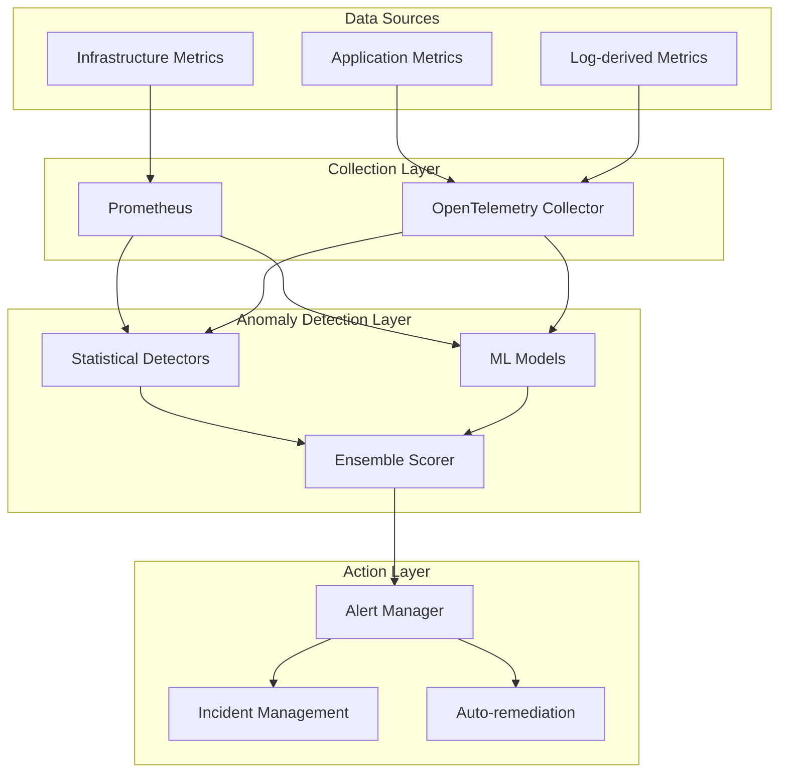
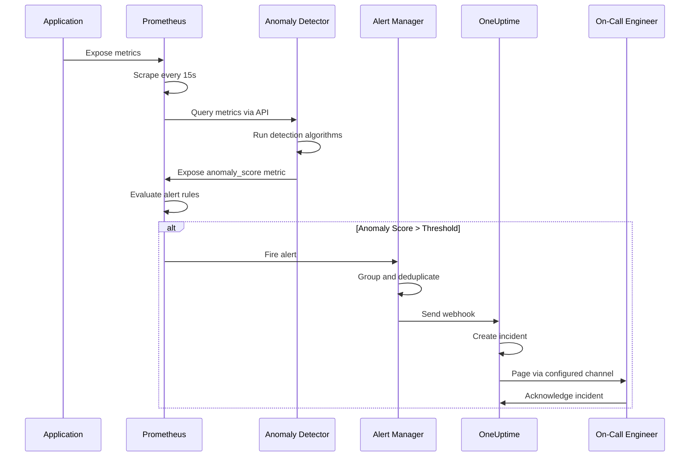
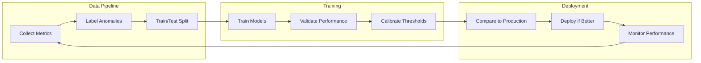

# How to Implement Anomaly Detection Integration

Author: [nawazdhandala](https://github.com/nawazdhandala)

Tags: Observability, Machine Learning, Monitoring, SRE

Description: Learn how to integrate anomaly detection into your monitoring stack for proactive incident detection.

---

Static thresholds are the training wheels of monitoring. They work until they don't. Your API latency sits at 200ms for months, then a marketing campaign doubles traffic and suddenly 300ms is normal. Your threshold fires constantly. You raise it to 400ms. A week later, traffic drops, a real regression creeps in at 280ms, and no one notices until customers complain.

Anomaly detection solves this by learning what "normal" looks like and alerting when behavior deviates. Instead of asking "Is latency above 500ms?" you ask "Is latency behaving unusually given recent patterns?"

This post walks through implementing anomaly detection in your monitoring stack, covering both statistical and machine learning approaches, with practical integration patterns for Prometheus, alerting pipelines, and production-grade deployment.

---

## Why Static Thresholds Fail

Consider these scenarios where fixed thresholds break down:

- **Seasonal patterns**: E-commerce traffic spikes on weekends. A static threshold either misses weekday issues or floods you with weekend false positives.
- **Gradual drift**: Memory usage creeps up 1% per day. By the time it crosses your threshold, you have hours, not days, to respond.
- **Multi-modal distributions**: Batch jobs run at 2 AM with different latency profiles than real-time traffic. One threshold cannot serve both.
- **Scale changes**: A new customer onboards and doubles your request volume. Every capacity metric needs threshold updates.

Anomaly detection adapts to these realities automatically.

---

## Anomaly Detection Approaches

### Statistical Methods

Statistical approaches work well when your data follows predictable patterns and you need interpretable, low-latency detection.

#### Z-Score Detection

The simplest method: measure how many standard deviations a point is from the mean.

```python
# z_score_detector.py
# Simple Z-score based anomaly detection for time series metrics
# Works well for normally distributed data with stable variance

import numpy as np
from typing import List, Tuple
from dataclasses import dataclass


@dataclass
class AnomalyResult:
    """Represents the result of anomaly detection for a single point."""
    timestamp: float
    value: float
    z_score: float
    is_anomaly: bool
    threshold: float


class ZScoreDetector:
    """
    Detects anomalies using rolling Z-score calculation.

    Best for: Stationary time series without strong seasonality.
    Limitations: Sensitive to outliers in training window, assumes normality.
    """

    def __init__(self, window_size: int = 100, threshold: float = 3.0):
        """
        Args:
            window_size: Number of recent points to compute mean/std from.
            threshold: Z-score threshold for anomaly classification.
                       3.0 = 99.7% of normal data falls within bounds.
        """
        self.window_size = window_size
        self.threshold = threshold
        self.history: List[float] = []

    def detect(self, value: float, timestamp: float) -> AnomalyResult:
        """
        Check if a new value is anomalous given recent history.

        Args:
            value: The metric value to check.
            timestamp: Unix timestamp of the measurement.

        Returns:
            AnomalyResult with z_score and anomaly classification.
        """
        # Need enough history to compute meaningful statistics
        if len(self.history) < self.window_size:
            self.history.append(value)
            return AnomalyResult(
                timestamp=timestamp,
                value=value,
                z_score=0.0,
                is_anomaly=False,
                threshold=self.threshold
            )

        # Calculate rolling statistics from the window
        window = self.history[-self.window_size:]
        mean = np.mean(window)
        std = np.std(window)

        # Avoid division by zero for constant series
        if std == 0:
            std = 1e-10

        z_score = abs(value - mean) / std
        is_anomaly = z_score > self.threshold

        # Update history with new value
        self.history.append(value)

        # Prevent unbounded memory growth
        if len(self.history) > self.window_size * 2:
            self.history = self.history[-self.window_size:]

        return AnomalyResult(
            timestamp=timestamp,
            value=value,
            z_score=z_score,
            is_anomaly=is_anomaly,
            threshold=self.threshold
        )
```

#### Exponential Moving Average with Bounds

EMA adapts faster to recent changes while smoothing noise:

```python
# ema_detector.py
# Exponential Moving Average based anomaly detection
# Provides faster adaptation to trend changes than simple Z-score

from dataclasses import dataclass
from typing import Optional


@dataclass
class EMAResult:
    """Result of EMA-based anomaly detection."""
    timestamp: float
    value: float
    expected: float
    deviation: float
    upper_bound: float
    lower_bound: float
    is_anomaly: bool


class EMADetector:
    """
    Detects anomalies using Exponential Moving Average with dynamic bounds.

    The EMA tracks expected value, while a separate EMA tracks deviation.
    Bounds are computed as: expected +/- (multiplier * deviation_ema)

    Best for: Metrics with gradual trends, need faster adaptation than Z-score.
    """

    def __init__(
        self,
        alpha: float = 0.1,
        bound_multiplier: float = 3.0,
        min_samples: int = 10
    ):
        """
        Args:
            alpha: Smoothing factor (0-1). Higher = more responsive to recent values.
                   0.1 gives ~90% weight to last 22 points.
            bound_multiplier: How many deviations from EMA triggers anomaly.
            min_samples: Minimum samples before detection activates.
        """
        self.alpha = alpha
        self.bound_multiplier = bound_multiplier
        self.min_samples = min_samples

        self.ema: Optional[float] = None
        self.ema_deviation: Optional[float] = None
        self.sample_count = 0

    def detect(self, value: float, timestamp: float) -> EMAResult:
        """
        Check if value is anomalous relative to EMA-based expectations.
        """
        self.sample_count += 1

        # Initialize EMAs with first value
        if self.ema is None:
            self.ema = value
            self.ema_deviation = 0.0
            return EMAResult(
                timestamp=timestamp,
                value=value,
                expected=value,
                deviation=0.0,
                upper_bound=value,
                lower_bound=value,
                is_anomaly=False
            )

        # Compute deviation from current expectation
        deviation = abs(value - self.ema)

        # Update deviation EMA (tracks typical deviation magnitude)
        self.ema_deviation = (
            self.alpha * deviation +
            (1 - self.alpha) * self.ema_deviation
        )

        # Calculate bounds before updating EMA
        bound_width = self.bound_multiplier * max(self.ema_deviation, 1e-10)
        upper_bound = self.ema + bound_width
        lower_bound = self.ema - bound_width

        # Check for anomaly (only after warmup period)
        is_anomaly = (
            self.sample_count >= self.min_samples and
            (value > upper_bound or value < lower_bound)
        )

        # Store expected value before update for result
        expected = self.ema

        # Update value EMA
        self.ema = self.alpha * value + (1 - self.alpha) * self.ema

        return EMAResult(
            timestamp=timestamp,
            value=value,
            expected=expected,
            deviation=deviation,
            upper_bound=upper_bound,
            lower_bound=lower_bound,
            is_anomaly=is_anomaly
        )
```

#### Seasonal Decomposition

For metrics with daily or weekly patterns, decompose the signal:

```python
# seasonal_detector.py
# Handles metrics with predictable seasonal patterns (hourly, daily, weekly)
# Uses historical profiles to set time-aware thresholds

from dataclasses import dataclass
from typing import Dict, List, Optional
from collections import defaultdict
import statistics


@dataclass
class SeasonalResult:
    """Result including seasonal context."""
    timestamp: float
    value: float
    expected_for_period: float
    seasonal_z_score: float
    is_anomaly: bool
    period_key: str


class SeasonalDetector:
    """
    Learns hourly profiles and detects deviations from seasonal norms.

    Groups historical data by hour-of-day (or other period), builds
    per-period statistics, and flags values that deviate from their
    time-specific expectations.

    Best for: Metrics with strong daily patterns (traffic, batch jobs).
    """

    def __init__(
        self,
        period_type: str = "hour",  # "hour", "day_of_week", "hour_of_week"
        threshold: float = 3.0,
        min_samples_per_period: int = 5
    ):
        """
        Args:
            period_type: How to bucket time periods.
            threshold: Z-score threshold within each period.
            min_samples_per_period: Minimum samples needed per period.
        """
        self.period_type = period_type
        self.threshold = threshold
        self.min_samples_per_period = min_samples_per_period

        # Store values grouped by period key
        self.period_data: Dict[str, List[float]] = defaultdict(list)

    def _get_period_key(self, timestamp: float) -> str:
        """Extract period key from timestamp."""
        from datetime import datetime
        dt = datetime.utcfromtimestamp(timestamp)

        if self.period_type == "hour":
            return f"hour_{dt.hour}"
        elif self.period_type == "day_of_week":
            return f"dow_{dt.weekday()}"
        elif self.period_type == "hour_of_week":
            return f"dow_{dt.weekday()}_hour_{dt.hour}"
        else:
            return "default"

    def detect(self, value: float, timestamp: float) -> SeasonalResult:
        """
        Check if value is anomalous for its time period.
        """
        period_key = self._get_period_key(timestamp)
        period_values = self.period_data[period_key]

        # Not enough data for this period yet
        if len(period_values) < self.min_samples_per_period:
            self.period_data[period_key].append(value)
            return SeasonalResult(
                timestamp=timestamp,
                value=value,
                expected_for_period=value,
                seasonal_z_score=0.0,
                is_anomaly=False,
                period_key=period_key
            )

        # Calculate period-specific statistics
        mean = statistics.mean(period_values)
        std = statistics.stdev(period_values) if len(period_values) > 1 else 1e-10

        if std == 0:
            std = 1e-10

        z_score = abs(value - mean) / std
        is_anomaly = z_score > self.threshold

        # Update period history
        self.period_data[period_key].append(value)

        # Limit history per period to prevent memory bloat
        if len(self.period_data[period_key]) > 1000:
            self.period_data[period_key] = self.period_data[period_key][-500:]

        return SeasonalResult(
            timestamp=timestamp,
            value=value,
            expected_for_period=mean,
            seasonal_z_score=z_score,
            is_anomaly=is_anomaly,
            period_key=period_key
        )
```

---

### Machine Learning Methods

When statistical methods fall short, ML models can capture complex patterns.

#### Isolation Forest

Isolation Forest works by isolating anomalies rather than profiling normal behavior:

```python
# isolation_forest_detector.py
# Uses Isolation Forest for multi-dimensional anomaly detection
# Effective when you have multiple correlated metrics

import numpy as np
from sklearn.ensemble import IsolationForest
from dataclasses import dataclass
from typing import List, Optional
import pickle


@dataclass
class IFResult:
    """Result from Isolation Forest detection."""
    timestamp: float
    features: List[float]
    anomaly_score: float  # -1 to 1, higher = more anomalous
    is_anomaly: bool


class IsolationForestDetector:
    """
    Multi-dimensional anomaly detection using Isolation Forest.

    How it works: Recursively partitions feature space. Anomalies are
    isolated in fewer partitions (shorter path length in the tree).

    Best for: Multi-variate anomalies, unknown anomaly patterns.
    Limitations: Requires batch retraining, not purely online.
    """

    def __init__(
        self,
        contamination: float = 0.01,  # Expected fraction of anomalies
        n_estimators: int = 100,
        retrain_interval: int = 1000
    ):
        """
        Args:
            contamination: Expected proportion of outliers in training data.
            n_estimators: Number of trees in the forest.
            retrain_interval: Retrain model after this many samples.
        """
        self.contamination = contamination
        self.n_estimators = n_estimators
        self.retrain_interval = retrain_interval

        self.model: Optional[IsolationForest] = None
        self.training_buffer: List[List[float]] = []
        self.sample_count = 0
        self.is_trained = False

    def _train(self):
        """Train or retrain the model on buffered data."""
        if len(self.training_buffer) < 50:
            return  # Need minimum samples

        X = np.array(self.training_buffer)

        self.model = IsolationForest(
            contamination=self.contamination,
            n_estimators=self.n_estimators,
            random_state=42,
            n_jobs=-1  # Use all CPU cores
        )
        self.model.fit(X)
        self.is_trained = True

    def detect(self, features: List[float], timestamp: float) -> IFResult:
        """
        Check if a feature vector represents an anomaly.

        Args:
            features: List of metric values (e.g., [cpu, memory, latency]).
            timestamp: Unix timestamp.
        """
        self.sample_count += 1
        self.training_buffer.append(features)

        # Limit buffer size
        if len(self.training_buffer) > self.retrain_interval * 2:
            self.training_buffer = self.training_buffer[-self.retrain_interval:]

        # Initial training or periodic retraining
        if not self.is_trained or self.sample_count % self.retrain_interval == 0:
            self._train()

        # Cannot detect until trained
        if not self.is_trained:
            return IFResult(
                timestamp=timestamp,
                features=features,
                anomaly_score=0.0,
                is_anomaly=False
            )

        # Get anomaly score
        # score_samples returns negative scores; more negative = more anomalous
        X = np.array([features])
        raw_score = self.model.score_samples(X)[0]

        # Normalize to -1 to 1 range (approximately)
        anomaly_score = -raw_score

        # Predict returns -1 for anomalies, 1 for normal
        prediction = self.model.predict(X)[0]
        is_anomaly = prediction == -1

        return IFResult(
            timestamp=timestamp,
            features=features,
            anomaly_score=anomaly_score,
            is_anomaly=is_anomaly
        )

    def save_model(self, path: str):
        """Persist trained model to disk."""
        if self.model:
            with open(path, 'wb') as f:
                pickle.dump(self.model, f)

    def load_model(self, path: str):
        """Load pre-trained model from disk."""
        with open(path, 'rb') as f:
            self.model = pickle.load(f)
            self.is_trained = True
```

#### LSTM Autoencoder

For sequence-aware detection, autoencoders learn to reconstruct normal patterns:

```python
# lstm_autoencoder.py
# Deep learning approach for sequence-aware anomaly detection
# Captures temporal dependencies that statistical methods miss

import numpy as np
from typing import List, Tuple, Optional
from dataclasses import dataclass


@dataclass
class AutoencoderResult:
    """Result from autoencoder-based detection."""
    timestamp: float
    value: float
    reconstruction_error: float
    threshold: float
    is_anomaly: bool


class LSTMAutoencoder:
    """
    LSTM-based autoencoder for time series anomaly detection.

    Architecture: Encoder compresses sequence to latent space,
    decoder reconstructs. High reconstruction error = anomaly.

    Best for: Complex temporal patterns, long-range dependencies.
    Limitations: Requires GPU for training, needs careful tuning.
    """

    def __init__(
        self,
        sequence_length: int = 60,
        latent_dim: int = 16,
        threshold_percentile: float = 99.0
    ):
        """
        Args:
            sequence_length: Number of timesteps in input sequence.
            latent_dim: Dimension of compressed representation.
            threshold_percentile: Percentile of training errors for threshold.
        """
        self.sequence_length = sequence_length
        self.latent_dim = latent_dim
        self.threshold_percentile = threshold_percentile

        self.model = None
        self.threshold: Optional[float] = None
        self.buffer: List[float] = []
        self.is_trained = False

    def _build_model(self):
        """Construct the LSTM autoencoder architecture."""
        # Import here to avoid loading TensorFlow unless needed
        from tensorflow import keras
        from tensorflow.keras import layers

        # Encoder
        inputs = keras.Input(shape=(self.sequence_length, 1))
        encoded = layers.LSTM(32, activation='relu', return_sequences=True)(inputs)
        encoded = layers.LSTM(self.latent_dim, activation='relu')(encoded)

        # Decoder
        decoded = layers.RepeatVector(self.sequence_length)(encoded)
        decoded = layers.LSTM(self.latent_dim, activation='relu', return_sequences=True)(decoded)
        decoded = layers.LSTM(32, activation='relu', return_sequences=True)(decoded)
        outputs = layers.TimeDistributed(layers.Dense(1))(decoded)

        self.model = keras.Model(inputs, outputs)
        self.model.compile(optimizer='adam', loss='mse')

    def train(self, data: np.ndarray, epochs: int = 50, batch_size: int = 32):
        """
        Train the autoencoder on historical data.

        Args:
            data: 1D array of metric values.
            epochs: Training epochs.
            batch_size: Batch size for training.
        """
        if self.model is None:
            self._build_model()

        # Create sequences
        sequences = []
        for i in range(len(data) - self.sequence_length):
            sequences.append(data[i:i + self.sequence_length])

        X = np.array(sequences).reshape(-1, self.sequence_length, 1)

        # Train model
        self.model.fit(
            X, X,
            epochs=epochs,
            batch_size=batch_size,
            validation_split=0.1,
            verbose=0
        )

        # Calculate threshold from training reconstruction errors
        reconstructions = self.model.predict(X, verbose=0)
        mse = np.mean(np.power(X - reconstructions, 2), axis=(1, 2))
        self.threshold = np.percentile(mse, self.threshold_percentile)
        self.is_trained = True

    def detect(self, value: float, timestamp: float) -> AutoencoderResult:
        """
        Check if the current value creates an anomalous sequence.
        """
        self.buffer.append(value)

        # Keep buffer bounded
        if len(self.buffer) > self.sequence_length * 2:
            self.buffer = self.buffer[-self.sequence_length:]

        # Need full sequence and trained model
        if len(self.buffer) < self.sequence_length or not self.is_trained:
            return AutoencoderResult(
                timestamp=timestamp,
                value=value,
                reconstruction_error=0.0,
                threshold=self.threshold or 0.0,
                is_anomaly=False
            )

        # Get recent sequence
        sequence = np.array(self.buffer[-self.sequence_length:])
        X = sequence.reshape(1, self.sequence_length, 1)

        # Compute reconstruction error
        reconstruction = self.model.predict(X, verbose=0)
        mse = np.mean(np.power(X - reconstruction, 2))

        is_anomaly = mse > self.threshold

        return AutoencoderResult(
            timestamp=timestamp,
            value=value,
            reconstruction_error=mse,
            threshold=self.threshold,
            is_anomaly=is_anomaly
        )
```

---

## Architecture Overview

Here is how anomaly detection fits into a modern monitoring stack:



The key insight: anomaly detection sits between data collection and alerting. It transforms raw metrics into confidence-scored anomaly signals.

---

## Prometheus Integration

### Custom Exporter for Anomaly Scores

Expose anomaly detection results as Prometheus metrics:

```python
# anomaly_exporter.py
# Prometheus exporter that runs anomaly detection and exposes results
# Allows Prometheus to scrape anomaly scores like any other metric

from prometheus_client import start_http_server, Gauge, Counter
from prometheus_client.core import GaugeMetricFamily, REGISTRY
import time
import requests
from typing import Dict, List
from dataclasses import dataclass


# Define metrics
anomaly_score = Gauge(
    'anomaly_score',
    'Anomaly score for metric (0-1, higher is more anomalous)',
    ['metric_name', 'detector_type']
)

anomaly_detected = Counter(
    'anomaly_detected_total',
    'Total anomalies detected',
    ['metric_name', 'detector_type', 'severity']
)

detection_latency = Gauge(
    'anomaly_detection_latency_seconds',
    'Time taken to run anomaly detection',
    ['detector_type']
)


@dataclass
class MetricConfig:
    """Configuration for a metric to monitor."""
    name: str
    query: str  # PromQL query
    detector_type: str  # "zscore", "ema", "seasonal", "isolation_forest"
    threshold: float


class AnomalyExporter:
    """
    Fetches metrics from Prometheus, runs anomaly detection,
    and exposes results as new Prometheus metrics.
    """

    def __init__(
        self,
        prometheus_url: str,
        metrics: List[MetricConfig],
        check_interval: int = 60
    ):
        self.prometheus_url = prometheus_url.rstrip('/')
        self.metrics = metrics
        self.check_interval = check_interval

        # Initialize detectors for each metric
        self.detectors: Dict[str, object] = {}
        for metric in metrics:
            self.detectors[metric.name] = self._create_detector(
                metric.detector_type,
                metric.threshold
            )

    def _create_detector(self, detector_type: str, threshold: float):
        """Factory method to create appropriate detector."""
        if detector_type == "zscore":
            return ZScoreDetector(threshold=threshold)
        elif detector_type == "ema":
            return EMADetector(bound_multiplier=threshold)
        elif detector_type == "seasonal":
            return SeasonalDetector(threshold=threshold)
        else:
            raise ValueError(f"Unknown detector type: {detector_type}")

    def _query_prometheus(self, query: str) -> float:
        """Execute PromQL query and return current value."""
        response = requests.get(
            f"{self.prometheus_url}/api/v1/query",
            params={"query": query},
            timeout=10
        )
        response.raise_for_status()

        result = response.json()
        if result["status"] != "success":
            raise ValueError(f"Query failed: {result}")

        data = result["data"]["result"]
        if not data:
            raise ValueError(f"No data for query: {query}")

        # Return the first result's value
        return float(data[0]["value"][1])

    def run_detection_cycle(self):
        """Run one cycle of anomaly detection for all metrics."""
        timestamp = time.time()

        for metric in self.metrics:
            try:
                start_time = time.time()

                # Fetch current value
                value = self._query_prometheus(metric.query)

                # Run detection
                detector = self.detectors[metric.name]
                result = detector.detect(value, timestamp)

                # Update Prometheus metrics
                score = getattr(result, 'z_score', None) or \
                        getattr(result, 'anomaly_score', 0.0)

                # Normalize score to 0-1 range
                normalized_score = min(1.0, score / 10.0)

                anomaly_score.labels(
                    metric_name=metric.name,
                    detector_type=metric.detector_type
                ).set(normalized_score)

                if result.is_anomaly:
                    severity = "high" if normalized_score > 0.8 else "medium"
                    anomaly_detected.labels(
                        metric_name=metric.name,
                        detector_type=metric.detector_type,
                        severity=severity
                    ).inc()

                elapsed = time.time() - start_time
                detection_latency.labels(
                    detector_type=metric.detector_type
                ).set(elapsed)

            except Exception as e:
                print(f"Error processing {metric.name}: {e}")

    def run(self, port: int = 9090):
        """Start the exporter and run detection loop."""
        start_http_server(port)
        print(f"Anomaly exporter running on port {port}")

        while True:
            self.run_detection_cycle()
            time.sleep(self.check_interval)


# Example usage
if __name__ == "__main__":
    metrics = [
        MetricConfig(
            name="api_latency_p99",
            query='histogram_quantile(0.99, rate(http_request_duration_seconds_bucket[5m]))',
            detector_type="zscore",
            threshold=3.0
        ),
        MetricConfig(
            name="error_rate",
            query='rate(http_requests_total{status=~"5.."}[5m]) / rate(http_requests_total[5m])',
            detector_type="ema",
            threshold=3.0
        ),
        MetricConfig(
            name="request_volume",
            query='sum(rate(http_requests_total[5m]))',
            detector_type="seasonal",
            threshold=3.0
        ),
    ]

    exporter = AnomalyExporter(
        prometheus_url="http://localhost:9090",
        metrics=metrics,
        check_interval=60
    )
    exporter.run(port=9091)
```

### Recording Rules for Anomaly Metrics

Add Prometheus recording rules to pre-compute anomaly-relevant aggregations:

```yaml
# prometheus_rules.yaml
# Recording rules to support anomaly detection
# Pre-compute baselines and percentiles for efficient detection

groups:
  - name: anomaly_detection_rules
    interval: 1m
    rules:
      # Rolling averages for baseline comparison
      - record: metric:http_latency_p99:avg_1h
        expr: avg_over_time(histogram_quantile(0.99, rate(http_request_duration_seconds_bucket[5m]))[1h:1m])

      - record: metric:http_latency_p99:stddev_1h
        expr: stddev_over_time(histogram_quantile(0.99, rate(http_request_duration_seconds_bucket[5m]))[1h:1m])

      # Z-score calculation directly in Prometheus
      - record: metric:http_latency_p99:zscore
        expr: |
          (
            histogram_quantile(0.99, rate(http_request_duration_seconds_bucket[5m]))
            - metric:http_latency_p99:avg_1h
          ) / metric:http_latency_p99:stddev_1h

      # Error rate baseline
      - record: metric:error_rate:avg_1h
        expr: |
          avg_over_time(
            (rate(http_requests_total{status=~"5.."}[5m]) / rate(http_requests_total[5m]))[1h:1m]
          )

      # Request volume by hour of day (for seasonal detection)
      - record: metric:request_volume:by_hour
        expr: sum(rate(http_requests_total[5m]))
        labels:
          hour: '{{ printf "%02d" (now | date "15") }}'
```

---

## Alerting Integration

### Alert Manager Configuration

Configure alerts based on anomaly scores:

```yaml
# alertmanager_config.yaml
# Alert routing for anomaly-based alerts
# Includes severity-based routing and grouping

global:
  resolve_timeout: 5m

route:
  group_by: ['alertname', 'service', 'detector_type']
  group_wait: 30s
  group_interval: 5m
  repeat_interval: 4h
  receiver: 'default'

  routes:
    # High confidence anomalies go to on-call immediately
    - match:
        severity: critical
        anomaly_confidence: high
      receiver: 'oncall-pagerduty'
      group_wait: 10s
      repeat_interval: 1h

    # Medium confidence gets Slack notification
    - match:
        severity: warning
      receiver: 'slack-alerts'
      group_wait: 1m

    # Low confidence goes to daily digest
    - match:
        anomaly_confidence: low
      receiver: 'daily-digest'
      group_wait: 1h
      group_interval: 6h

receivers:
  - name: 'default'
    webhook_configs:
      - url: 'http://oneuptime:3000/api/alerts/webhook'
        send_resolved: true

  - name: 'oncall-pagerduty'
    pagerduty_configs:
      - service_key: '<pagerduty-service-key>'
        severity: critical
        description: '{{ .CommonAnnotations.summary }}'
        details:
          anomaly_score: '{{ .CommonLabels.anomaly_score }}'
          detector: '{{ .CommonLabels.detector_type }}'

  - name: 'slack-alerts'
    slack_configs:
      - api_url: '<slack-webhook-url>'
        channel: '#alerts'
        title: 'Anomaly Detected: {{ .CommonLabels.alertname }}'
        text: |
          *Service:* {{ .CommonLabels.service }}
          *Detector:* {{ .CommonLabels.detector_type }}
          *Score:* {{ .CommonLabels.anomaly_score }}
          *Summary:* {{ .CommonAnnotations.summary }}

  - name: 'daily-digest'
    webhook_configs:
      - url: 'http://digest-service:8080/collect'

# Inhibition rules to prevent alert storms
inhibit_rules:
  # If a critical anomaly fires, suppress warnings for same metric
  - source_match:
      severity: 'critical'
    target_match:
      severity: 'warning'
    equal: ['alertname', 'service']

  # Suppress anomaly alerts during known maintenance
  - source_match:
      alertname: 'MaintenanceWindow'
    target_match_re:
      alertname: 'Anomaly.*'
    equal: ['service']
```

### Prometheus Alert Rules

```yaml
# prometheus_alerts.yaml
# Alert rules that fire based on anomaly scores
# Uses both raw thresholds and sustained anomaly patterns

groups:
  - name: anomaly_alerts
    rules:
      # Alert on high anomaly score
      - alert: HighAnomalyScore
        expr: anomaly_score > 0.8
        for: 2m
        labels:
          severity: warning
          anomaly_confidence: high
        annotations:
          summary: "High anomaly score for {{ $labels.metric_name }}"
          description: |
            Metric {{ $labels.metric_name }} has anomaly score {{ $value | printf "%.2f" }}
            detected by {{ $labels.detector_type }} detector.
          runbook_url: "https://runbooks.example.com/anomaly-detection"

      # Alert on sustained medium anomaly
      - alert: SustainedAnomaly
        expr: anomaly_score > 0.5
        for: 10m
        labels:
          severity: warning
          anomaly_confidence: medium
        annotations:
          summary: "Sustained anomaly for {{ $labels.metric_name }}"
          description: |
            Metric {{ $labels.metric_name }} has shown elevated anomaly score
            ({{ $value | printf "%.2f" }}) for over 10 minutes.

      # Alert on anomaly rate spike
      - alert: AnomalyRateSpike
        expr: |
          increase(anomaly_detected_total[15m]) > 10
        labels:
          severity: critical
          anomaly_confidence: high
        annotations:
          summary: "Multiple anomalies detected for {{ $labels.metric_name }}"
          description: |
            {{ $value | printf "%.0f" }} anomalies detected in the last 15 minutes
            for metric {{ $labels.metric_name }}.

      # Z-score based alert (using recording rule)
      - alert: LatencyZScoreAnomaly
        expr: abs(metric:http_latency_p99:zscore) > 3
        for: 5m
        labels:
          severity: warning
        annotations:
          summary: "Latency Z-score anomaly detected"
          description: |
            P99 latency is {{ $value | printf "%.1f" }} standard deviations
            from the 1-hour average.
```

---

## System Flow

Here is the complete data flow from metric collection to incident response:



---

## Ensemble Detection

Combining multiple detectors reduces false positives:

```python
# ensemble_detector.py
# Combines multiple detection methods for higher accuracy
# Weighted voting reduces false positives from any single detector

from dataclasses import dataclass
from typing import List, Dict, Tuple
from enum import Enum


class DetectorType(Enum):
    ZSCORE = "zscore"
    EMA = "ema"
    SEASONAL = "seasonal"
    ISOLATION_FOREST = "isolation_forest"


@dataclass
class EnsembleResult:
    """Combined result from multiple detectors."""
    timestamp: float
    value: float
    combined_score: float  # 0-1, weighted average
    individual_scores: Dict[str, float]
    is_anomaly: bool
    confidence: str  # "high", "medium", "low"
    agreeing_detectors: List[str]


class EnsembleDetector:
    """
    Combines multiple anomaly detectors using weighted voting.

    Benefits:
    - Reduces false positives (single detector noise)
    - Captures different anomaly types (point, contextual, collective)
    - Provides confidence levels based on agreement
    """

    def __init__(
        self,
        weights: Dict[DetectorType, float] = None,
        agreement_threshold: int = 2,  # Minimum detectors that must agree
        score_threshold: float = 0.6
    ):
        """
        Args:
            weights: Weight for each detector type. Higher = more influence.
            agreement_threshold: Minimum detectors flagging anomaly.
            score_threshold: Combined score threshold for anomaly.
        """
        self.weights = weights or {
            DetectorType.ZSCORE: 1.0,
            DetectorType.EMA: 1.0,
            DetectorType.SEASONAL: 1.5,  # Trust seasonal more
            DetectorType.ISOLATION_FOREST: 1.2
        }
        self.agreement_threshold = agreement_threshold
        self.score_threshold = score_threshold

        # Initialize detectors
        self.detectors = {
            DetectorType.ZSCORE: ZScoreDetector(threshold=3.0),
            DetectorType.EMA: EMADetector(bound_multiplier=3.0),
            DetectorType.SEASONAL: SeasonalDetector(threshold=3.0),
        }

    def add_isolation_forest(self, feature_names: List[str]):
        """Add Isolation Forest detector for multi-dimensional detection."""
        self.detectors[DetectorType.ISOLATION_FOREST] = IsolationForestDetector()
        self.feature_names = feature_names

    def detect(
        self,
        value: float,
        timestamp: float,
        additional_features: List[float] = None
    ) -> EnsembleResult:
        """
        Run all detectors and combine results.

        Args:
            value: Primary metric value.
            timestamp: Unix timestamp.
            additional_features: Extra features for Isolation Forest.
        """
        individual_scores: Dict[str, float] = {}
        agreeing_detectors: List[str] = []

        # Run each detector
        for detector_type, detector in self.detectors.items():
            try:
                if detector_type == DetectorType.ISOLATION_FOREST:
                    if additional_features:
                        features = [value] + additional_features
                        result = detector.detect(features, timestamp)
                        score = result.anomaly_score
                        is_anomaly = result.is_anomaly
                    else:
                        continue
                else:
                    result = detector.detect(value, timestamp)
                    # Normalize different score types to 0-1
                    if hasattr(result, 'z_score'):
                        score = min(1.0, result.z_score / 5.0)
                    elif hasattr(result, 'deviation'):
                        score = min(1.0, result.deviation / 100.0)
                    else:
                        score = 0.5 if result.is_anomaly else 0.0
                    is_anomaly = result.is_anomaly

                individual_scores[detector_type.value] = score

                if is_anomaly:
                    agreeing_detectors.append(detector_type.value)

            except Exception as e:
                print(f"Detector {detector_type.value} failed: {e}")
                continue

        # Calculate weighted combined score
        total_weight = 0
        weighted_sum = 0

        for detector_type, score in individual_scores.items():
            dt = DetectorType(detector_type)
            weight = self.weights.get(dt, 1.0)
            weighted_sum += score * weight
            total_weight += weight

        combined_score = weighted_sum / total_weight if total_weight > 0 else 0

        # Determine if anomaly based on agreement and score
        agreement_met = len(agreeing_detectors) >= self.agreement_threshold
        score_met = combined_score >= self.score_threshold
        is_anomaly = agreement_met or score_met

        # Determine confidence level
        if len(agreeing_detectors) >= 3 and combined_score > 0.8:
            confidence = "high"
        elif len(agreeing_detectors) >= 2 or combined_score > 0.6:
            confidence = "medium"
        else:
            confidence = "low"

        return EnsembleResult(
            timestamp=timestamp,
            value=value,
            combined_score=combined_score,
            individual_scores=individual_scores,
            is_anomaly=is_anomaly,
            confidence=confidence,
            agreeing_detectors=agreeing_detectors
        )
```

---

## Production Deployment

### Docker Compose Setup

```yaml
# docker-compose.yaml
# Complete anomaly detection stack
# Includes Prometheus, anomaly detector, and Alert Manager

version: '3.8'

services:
  prometheus:
    image: prom/prometheus:v2.47.0
    volumes:
      - ./prometheus.yml:/etc/prometheus/prometheus.yml
      - ./prometheus_rules.yaml:/etc/prometheus/rules/anomaly_rules.yaml
      - ./prometheus_alerts.yaml:/etc/prometheus/rules/alerts.yaml
      - prometheus_data:/prometheus
    command:
      - '--config.file=/etc/prometheus/prometheus.yml'
      - '--storage.tsdb.path=/prometheus'
      - '--web.enable-lifecycle'
      - '--storage.tsdb.retention.time=30d'
    ports:
      - "9090:9090"
    restart: unless-stopped

  anomaly-detector:
    build:
      context: ./anomaly-detector
      dockerfile: Dockerfile
    environment:
      - PROMETHEUS_URL=http://prometheus:9090
      - CHECK_INTERVAL=60
      - LOG_LEVEL=INFO
    ports:
      - "9091:9091"
    depends_on:
      - prometheus
    restart: unless-stopped
    # Resource limits for ML models
    deploy:
      resources:
        limits:
          cpus: '2'
          memory: 4G
        reservations:
          cpus: '0.5'
          memory: 1G

  alertmanager:
    image: prom/alertmanager:v0.26.0
    volumes:
      - ./alertmanager_config.yaml:/etc/alertmanager/alertmanager.yml
      - alertmanager_data:/alertmanager
    command:
      - '--config.file=/etc/alertmanager/alertmanager.yml'
      - '--storage.path=/alertmanager'
    ports:
      - "9093:9093"
    restart: unless-stopped

  # Optional: Grafana for visualization
  grafana:
    image: grafana/grafana:10.1.0
    volumes:
      - grafana_data:/var/lib/grafana
      - ./grafana/dashboards:/etc/grafana/provisioning/dashboards
      - ./grafana/datasources:/etc/grafana/provisioning/datasources
    environment:
      - GF_SECURITY_ADMIN_PASSWORD=admin
      - GF_USERS_ALLOW_SIGN_UP=false
    ports:
      - "3000:3000"
    depends_on:
      - prometheus
    restart: unless-stopped

volumes:
  prometheus_data:
  alertmanager_data:
  grafana_data:
```

### Kubernetes Deployment

```yaml
# kubernetes/anomaly-detector.yaml
# Production Kubernetes deployment for anomaly detection service

apiVersion: apps/v1
kind: Deployment
metadata:
  name: anomaly-detector
  namespace: monitoring
  labels:
    app: anomaly-detector
spec:
  replicas: 2  # HA setup
  selector:
    matchLabels:
      app: anomaly-detector
  template:
    metadata:
      labels:
        app: anomaly-detector
      annotations:
        prometheus.io/scrape: "true"
        prometheus.io/port: "9091"
        prometheus.io/path: "/metrics"
    spec:
      containers:
        - name: anomaly-detector
          image: myregistry/anomaly-detector:v1.0.0
          ports:
            - containerPort: 9091
              name: metrics
          env:
            - name: PROMETHEUS_URL
              value: "http://prometheus-server.monitoring.svc.cluster.local:9090"
            - name: CHECK_INTERVAL
              value: "60"
            - name: LOG_LEVEL
              value: "INFO"
          resources:
            requests:
              cpu: "500m"
              memory: "1Gi"
            limits:
              cpu: "2000m"
              memory: "4Gi"
          livenessProbe:
            httpGet:
              path: /health
              port: 9091
            initialDelaySeconds: 30
            periodSeconds: 10
          readinessProbe:
            httpGet:
              path: /ready
              port: 9091
            initialDelaySeconds: 5
            periodSeconds: 5
          volumeMounts:
            - name: config
              mountPath: /etc/anomaly-detector
            - name: models
              mountPath: /var/lib/anomaly-detector/models
      volumes:
        - name: config
          configMap:
            name: anomaly-detector-config
        - name: models
          persistentVolumeClaim:
            claimName: anomaly-detector-models

---
apiVersion: v1
kind: Service
metadata:
  name: anomaly-detector
  namespace: monitoring
  labels:
    app: anomaly-detector
spec:
  type: ClusterIP
  ports:
    - port: 9091
      targetPort: 9091
      name: metrics
  selector:
    app: anomaly-detector

---
apiVersion: v1
kind: ConfigMap
metadata:
  name: anomaly-detector-config
  namespace: monitoring
data:
  metrics.yaml: |
    metrics:
      - name: api_latency_p99
        query: 'histogram_quantile(0.99, rate(http_request_duration_seconds_bucket[5m]))'
        detector_type: ensemble
        detectors:
          - type: zscore
            threshold: 3.0
          - type: seasonal
            period: hour_of_week
            threshold: 2.5
      - name: error_rate
        query: 'rate(http_requests_total{status=~"5.."}[5m]) / rate(http_requests_total[5m])'
        detector_type: ema
        threshold: 3.0
      - name: request_volume
        query: 'sum(rate(http_requests_total[5m]))'
        detector_type: seasonal
        period: hour
        threshold: 3.0
```

---

## Tuning and Maintenance

### Threshold Calibration

```python
# threshold_calibration.py
# Tools for finding optimal anomaly detection thresholds
# Uses historical data with known anomalies for calibration

import numpy as np
from typing import List, Tuple, Dict
from dataclasses import dataclass
from sklearn.metrics import precision_recall_curve, f1_score


@dataclass
class CalibrationResult:
    """Result of threshold calibration."""
    optimal_threshold: float
    precision: float
    recall: float
    f1: float
    false_positive_rate: float


def calibrate_threshold(
    scores: np.ndarray,
    labels: np.ndarray,  # 1 = known anomaly, 0 = normal
    target_precision: float = 0.9
) -> CalibrationResult:
    """
    Find optimal threshold balancing precision and recall.

    Args:
        scores: Anomaly scores from detector (higher = more anomalous).
        labels: Ground truth labels.
        target_precision: Minimum acceptable precision.

    Returns:
        CalibrationResult with optimal threshold and metrics.
    """
    # Calculate precision-recall curve
    precisions, recalls, thresholds = precision_recall_curve(labels, scores)

    # Find threshold that meets precision target with best recall
    valid_indices = np.where(precisions >= target_precision)[0]

    if len(valid_indices) == 0:
        # Cannot meet precision target, use threshold with best F1
        f1_scores = 2 * (precisions * recalls) / (precisions + recalls + 1e-10)
        best_idx = np.argmax(f1_scores[:-1])  # Last element is for threshold=inf
    else:
        # Among thresholds meeting precision, pick one with best recall
        best_idx = valid_indices[np.argmax(recalls[valid_indices])]

    optimal_threshold = thresholds[best_idx] if best_idx < len(thresholds) else thresholds[-1]

    # Calculate metrics at optimal threshold
    predictions = (scores >= optimal_threshold).astype(int)

    tp = np.sum((predictions == 1) & (labels == 1))
    fp = np.sum((predictions == 1) & (labels == 0))
    fn = np.sum((predictions == 0) & (labels == 1))
    tn = np.sum((predictions == 0) & (labels == 0))

    precision = tp / (tp + fp) if (tp + fp) > 0 else 0
    recall = tp / (tp + fn) if (tp + fn) > 0 else 0
    f1 = 2 * precision * recall / (precision + recall) if (precision + recall) > 0 else 0
    fpr = fp / (fp + tn) if (fp + tn) > 0 else 0

    return CalibrationResult(
        optimal_threshold=optimal_threshold,
        precision=precision,
        recall=recall,
        f1=f1,
        false_positive_rate=fpr
    )


def evaluate_detector_performance(
    detector,
    test_data: List[Tuple[float, float, bool]],  # (value, timestamp, is_anomaly)
) -> Dict[str, float]:
    """
    Evaluate detector against labeled test data.

    Returns metrics dict with precision, recall, F1, etc.
    """
    true_labels = []
    predicted_labels = []
    scores = []

    for value, timestamp, is_anomaly in test_data:
        result = detector.detect(value, timestamp)
        true_labels.append(1 if is_anomaly else 0)
        predicted_labels.append(1 if result.is_anomaly else 0)

        # Extract score based on detector type
        if hasattr(result, 'z_score'):
            scores.append(result.z_score)
        elif hasattr(result, 'anomaly_score'):
            scores.append(result.anomaly_score)
        elif hasattr(result, 'combined_score'):
            scores.append(result.combined_score)
        else:
            scores.append(1.0 if result.is_anomaly else 0.0)

    true_labels = np.array(true_labels)
    predicted_labels = np.array(predicted_labels)
    scores = np.array(scores)

    # Calculate metrics
    tp = np.sum((predicted_labels == 1) & (true_labels == 1))
    fp = np.sum((predicted_labels == 1) & (true_labels == 0))
    fn = np.sum((predicted_labels == 0) & (true_labels == 1))
    tn = np.sum((predicted_labels == 0) & (true_labels == 0))

    precision = tp / (tp + fp) if (tp + fp) > 0 else 0
    recall = tp / (tp + fn) if (tp + fn) > 0 else 0
    f1 = 2 * precision * recall / (precision + recall) if (precision + recall) > 0 else 0
    accuracy = (tp + tn) / len(true_labels)

    return {
        "precision": precision,
        "recall": recall,
        "f1": f1,
        "accuracy": accuracy,
        "true_positives": int(tp),
        "false_positives": int(fp),
        "false_negatives": int(fn),
        "true_negatives": int(tn)
    }
```

### Model Retraining Pipeline



---

## Common Pitfalls and Solutions

| Problem | Symptom | Solution |
|---------|---------|----------|
| Too many false positives | Alert fatigue, ignored pages | Increase threshold, use ensemble, require sustained anomaly |
| Missing real anomalies | Incidents found by customers | Lower threshold, add detector types, review labeling |
| Slow detection | High MTTD for anomalies | Reduce check interval, use streaming detection |
| Model drift | Accuracy degrades over time | Schedule regular retraining, monitor detector metrics |
| Cold start issues | False positives after deploy | Pre-warm with historical data, use longer warmup period |
| Seasonal blindness | Weekend traffic flagged | Use seasonal detector, train on full weekly cycle |

---

## Checklist for Implementation

1. **Start Simple**
   - [ ] Deploy Z-score detector for one critical metric
   - [ ] Set conservative threshold (start high, lower gradually)
   - [ ] Route alerts to low-priority channel initially

2. **Add Intelligence**
   - [ ] Enable seasonal detection for traffic-dependent metrics
   - [ ] Add EMA detector for trending metrics
   - [ ] Implement ensemble for highest-value metrics

3. **Integrate with Stack**
   - [ ] Expose anomaly scores as Prometheus metrics
   - [ ] Configure alert rules with anomaly-aware thresholds
   - [ ] Connect to incident management (OneUptime, PagerDuty)

4. **Tune and Maintain**
   - [ ] Label historical anomalies for calibration
   - [ ] Run calibration quarterly
   - [ ] Monitor detector accuracy metrics
   - [ ] Schedule model retraining for ML-based detectors

5. **Document and Train**
   - [ ] Write runbooks for anomaly-based alerts
   - [ ] Train on-call team on interpreting anomaly scores
   - [ ] Establish feedback loop for false positive reporting

---

## Conclusion

Anomaly detection transforms monitoring from reactive threshold watching to proactive pattern recognition. Start with statistical methods for interpretability and speed. Add ML models when you need to capture complex, multi-dimensional patterns. Use ensembles to reduce false positives.

The key is iteration: deploy simple detection first, measure false positive and negative rates, then tune. Your metrics have patterns. Anomaly detection learns them so you can focus on the exceptions that matter.

Integrate with Prometheus for seamless metric collection, configure Alert Manager for intelligent routing, and connect to OneUptime for end-to-end incident management. The goal is not to eliminate human judgment but to focus it where it counts.

---

**Related Reading:**

- [Three Pillars of Observability: Logs, Metrics, and Traces](https://oneuptime.com/blog/post/2025-08-20-three-pillars-of-observability-logs-metrics-traces/view)
- [18 SRE Metrics Worth Tracking](https://oneuptime.com/blog/post/2025-11-28-sre-metrics-to-track/view)
- [Monitoring vs Observability for SRE](https://oneuptime.com/blog/post/2025-11-28-monitoring-vs-observability-sre/view)
