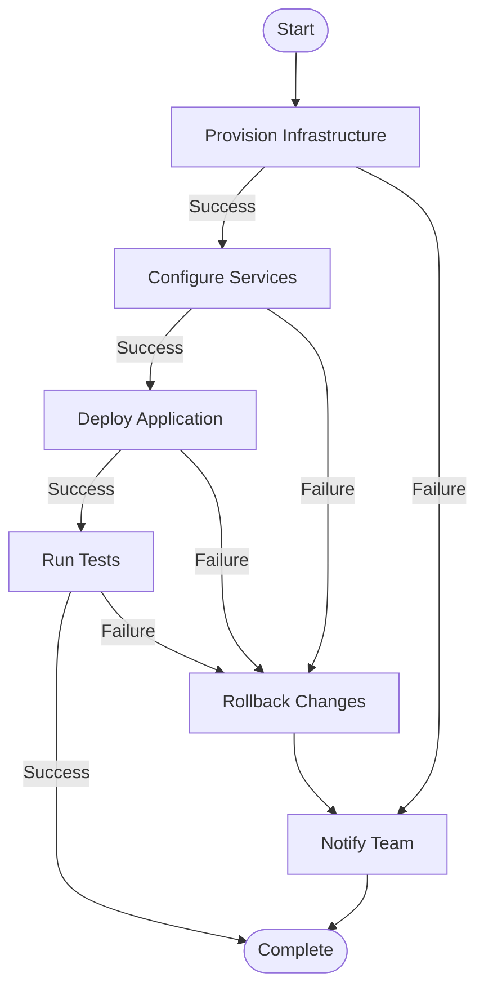
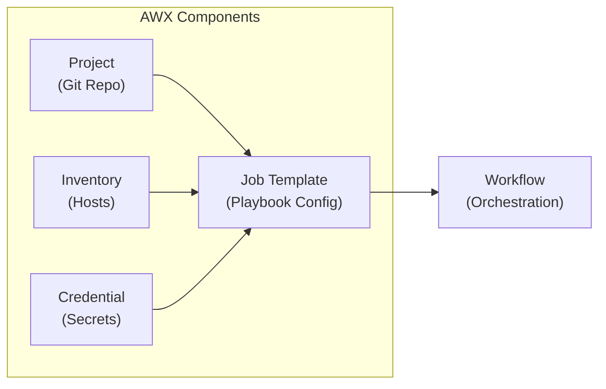
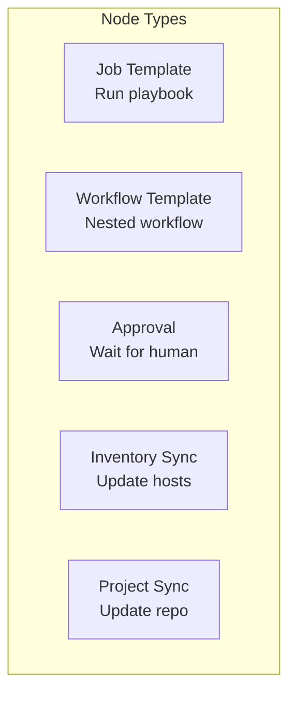
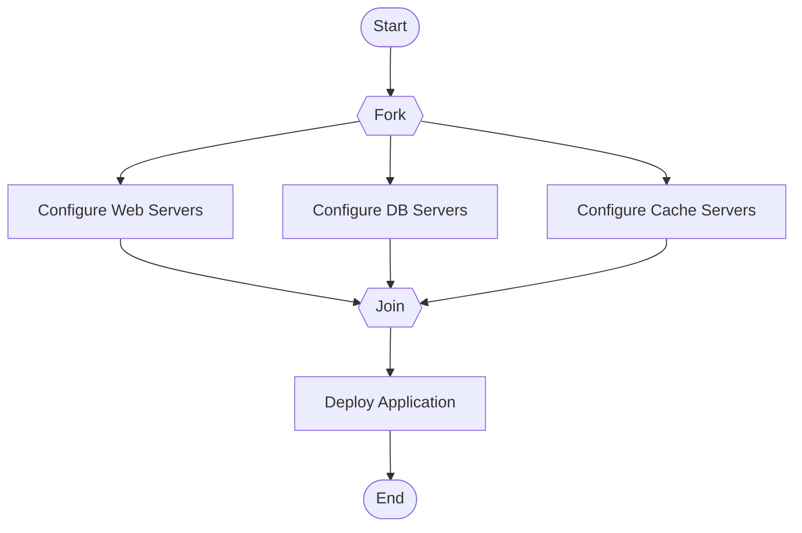
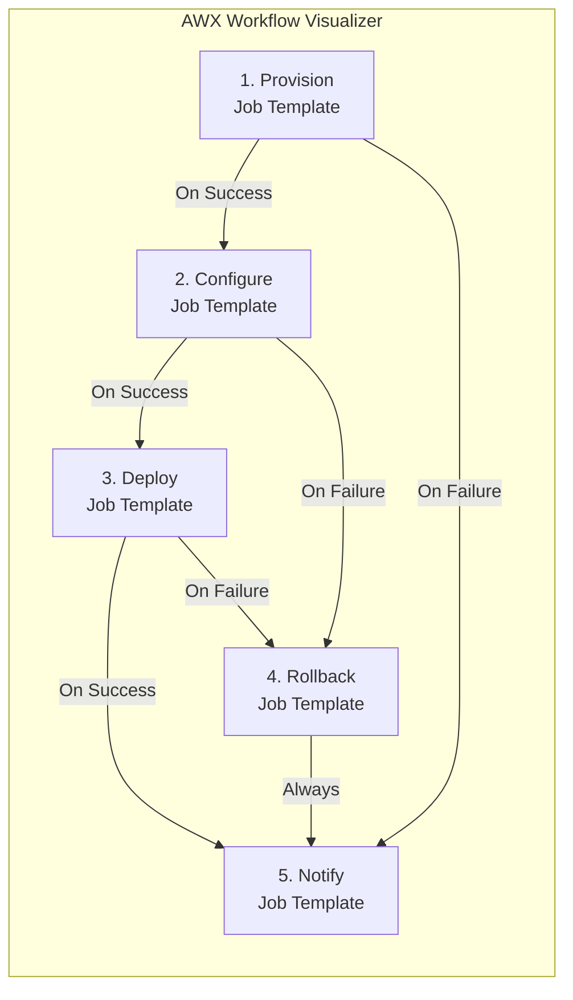
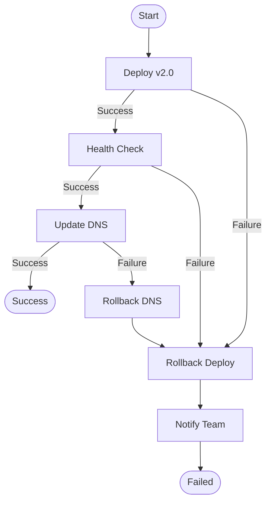

# How to Build Ansible AWX Workflows

Author: [nawazdhandala](https://github.com/nawazdhandala)

Tags: Ansible, AWX, Automation, Workflows

Description: A comprehensive guide to building Ansible AWX workflows for orchestrating complex automation tasks. Learn how to design, implement, and monitor multi-step automation pipelines with practical examples and best practices.

---

> AWX workflows transform scattered automation scripts into orchestrated pipelines. Instead of running playbooks manually in sequence, workflows handle dependencies, parallelism, and conditional execution automatically. This guide shows you how to build production-ready workflows from scratch.

Manual playbook execution does not scale. Workflows bring order to automation chaos.

---

## What is AWX?

AWX is the open-source upstream project for Red Hat Ansible Automation Platform (formerly Ansible Tower). It provides a web-based user interface, REST API, and task engine for managing Ansible automation at scale.

Key capabilities include:

- **Centralized playbook execution** - Run playbooks from a web interface or API
- **Role-based access control** - Define who can run what automation
- **Credential management** - Securely store and inject secrets
- **Job scheduling** - Schedule automation to run at specific times
- **Workflow orchestration** - Chain multiple playbooks with logic

---

## Understanding AWX Workflows

A workflow in AWX is a visual pipeline that chains multiple job templates together. Each node in the workflow can succeed, fail, or always run, allowing complex conditional logic.



---

## Workflow Components

Before building workflows, understand the building blocks that make up AWX automation.



### Projects

Projects link AWX to your Git repositories containing Ansible playbooks.

```yaml
# awx-resources/project.yml
---
- name: Create AWX Project
  awx.awx.project:
    name: "Infrastructure Automation"
    organization: "Default"
    scm_type: git
    scm_url: "https://github.com/myorg/ansible-playbooks.git"
    scm_branch: main
    scm_update_on_launch: true
    state: present
```

### Inventories

Inventories define the target hosts for your automation.

```yaml
# awx-resources/inventory.yml
---
- name: Create Dynamic Inventory
  awx.awx.inventory:
    name: "Production Servers"
    organization: "Default"
    state: present

- name: Add Inventory Source
  awx.awx.inventory_source:
    name: "AWS EC2"
    inventory: "Production Servers"
    source: ec2
    credential: "AWS Credential"
    update_on_launch: true
    overwrite: true
```

### Credentials

Credentials store sensitive data like SSH keys, cloud API tokens, and passwords.

```yaml
# awx-resources/credentials.yml
---
- name: Create Machine Credential
  awx.awx.credential:
    name: "SSH Key"
    organization: "Default"
    credential_type: "Machine"
    inputs:
      username: ansible
      ssh_key_data: "{{ lookup('file', '~/.ssh/id_rsa') }}"
    state: present

- name: Create AWS Credential
  awx.awx.credential:
    name: "AWS Credential"
    organization: "Default"
    credential_type: "Amazon Web Services"
    inputs:
      username: "{{ aws_access_key }}"
      password: "{{ aws_secret_key }}"
    state: present
```

### Job Templates

Job templates combine a project, inventory, and credentials to create a runnable automation task.

```yaml
# awx-resources/job-templates.yml
---
- name: Create Provision Template
  awx.awx.job_template:
    name: "Provision Infrastructure"
    organization: "Default"
    project: "Infrastructure Automation"
    playbook: "playbooks/provision.yml"
    inventory: "Production Servers"
    credentials:
      - "AWS Credential"
      - "SSH Key"
    extra_vars:
      environment: production
    state: present

- name: Create Configure Template
  awx.awx.job_template:
    name: "Configure Services"
    organization: "Default"
    project: "Infrastructure Automation"
    playbook: "playbooks/configure.yml"
    inventory: "Production Servers"
    credentials:
      - "SSH Key"
    state: present

- name: Create Deploy Template
  awx.awx.job_template:
    name: "Deploy Application"
    organization: "Default"
    project: "Infrastructure Automation"
    playbook: "playbooks/deploy.yml"
    inventory: "Production Servers"
    credentials:
      - "SSH Key"
    ask_variables_on_launch: true
    state: present
```

---

## Building Your First Workflow

Now let us create a complete deployment workflow that provisions infrastructure, configures services, deploys an application, and handles failures gracefully.

### Define the Workflow Template

```yaml
# awx-resources/workflow.yml
---
- name: Create Deployment Workflow
  awx.awx.workflow_job_template:
    name: "Full Deployment Pipeline"
    organization: "Default"
    description: "Complete infrastructure provisioning and application deployment"
    survey_enabled: true
    survey_spec:
      name: "Deployment Parameters"
      description: "Parameters for the deployment"
      spec:
        - question_name: "Application Version"
          variable: app_version
          type: text
          required: true
          default: "latest"
        - question_name: "Target Environment"
          variable: target_env
          type: multiplechoice
          choices:
            - development
            - staging
            - production
          required: true
          default: staging
    state: present
```

### Add Workflow Nodes

Workflow nodes define the execution order and conditional paths.

```yaml
# awx-resources/workflow-nodes.yml
---
# Node 1: Provision Infrastructure (starting node)
- name: Add Provision Node
  awx.awx.workflow_job_template_node:
    workflow_job_template: "Full Deployment Pipeline"
    identifier: provision
    unified_job_template: "Provision Infrastructure"
    organization: "Default"

# Node 2: Configure Services (runs after successful provision)
- name: Add Configure Node
  awx.awx.workflow_job_template_node:
    workflow_job_template: "Full Deployment Pipeline"
    identifier: configure
    unified_job_template: "Configure Services"
    organization: "Default"

# Link Configure to run after Provision succeeds
- name: Link Provision to Configure
  awx.awx.workflow_job_template_node:
    workflow_job_template: "Full Deployment Pipeline"
    identifier: provision
    success_nodes:
      - configure
    organization: "Default"

# Node 3: Deploy Application (runs after successful configure)
- name: Add Deploy Node
  awx.awx.workflow_job_template_node:
    workflow_job_template: "Full Deployment Pipeline"
    identifier: deploy
    unified_job_template: "Deploy Application"
    organization: "Default"

# Link Configure to Deploy
- name: Link Configure to Deploy
  awx.awx.workflow_job_template_node:
    workflow_job_template: "Full Deployment Pipeline"
    identifier: configure
    success_nodes:
      - deploy
    organization: "Default"

# Node 4: Rollback (runs on failure of configure or deploy)
- name: Add Rollback Node
  awx.awx.workflow_job_template_node:
    workflow_job_template: "Full Deployment Pipeline"
    identifier: rollback
    unified_job_template: "Rollback Changes"
    organization: "Default"

# Link failures to rollback
- name: Link Configure Failure to Rollback
  awx.awx.workflow_job_template_node:
    workflow_job_template: "Full Deployment Pipeline"
    identifier: configure
    failure_nodes:
      - rollback
    organization: "Default"

- name: Link Deploy Failure to Rollback
  awx.awx.workflow_job_template_node:
    workflow_job_template: "Full Deployment Pipeline"
    identifier: deploy
    failure_nodes:
      - rollback
    organization: "Default"

# Node 5: Notify Team (always runs at the end)
- name: Add Notify Node
  awx.awx.workflow_job_template_node:
    workflow_job_template: "Full Deployment Pipeline"
    identifier: notify
    unified_job_template: "Notify Team"
    organization: "Default"

# Rollback triggers notify
- name: Link Rollback to Notify
  awx.awx.workflow_job_template_node:
    workflow_job_template: "Full Deployment Pipeline"
    identifier: rollback
    always_nodes:
      - notify
    organization: "Default"

# Successful deploy also triggers notify
- name: Link Deploy Success to Notify
  awx.awx.workflow_job_template_node:
    workflow_job_template: "Full Deployment Pipeline"
    identifier: deploy
    success_nodes:
      - notify
    organization: "Default"
```

---

## Workflow Node Types

AWX supports different node types for various scenarios.



### Approval Nodes

Add manual approval gates to your workflows for change management compliance.

```yaml
# awx-resources/approval-workflow.yml
---
- name: Create Production Deployment with Approval
  awx.awx.workflow_job_template:
    name: "Production Deployment with Approval"
    organization: "Default"
    state: present

# Approval node
- name: Add Approval Node
  awx.awx.workflow_job_template_node:
    workflow_job_template: "Production Deployment with Approval"
    identifier: approval
    approval_node:
      name: "Production Deployment Approval"
      description: "Approve production deployment"
      timeout: 3600  # 1 hour timeout
    organization: "Default"

# Deploy only after approval
- name: Add Deploy After Approval
  awx.awx.workflow_job_template_node:
    workflow_job_template: "Production Deployment with Approval"
    identifier: deploy_prod
    unified_job_template: "Deploy Application"
    organization: "Default"

- name: Link Approval to Deploy
  awx.awx.workflow_job_template_node:
    workflow_job_template: "Production Deployment with Approval"
    identifier: approval
    success_nodes:
      - deploy_prod
    organization: "Default"
```

### Nested Workflows

Reuse existing workflows as nodes in larger workflows.

```yaml
# awx-resources/nested-workflow.yml
---
- name: Create Master Deployment Workflow
  awx.awx.workflow_job_template:
    name: "Multi-Region Deployment"
    organization: "Default"
    state: present

# US Region workflow
- name: Add US Region Node
  awx.awx.workflow_job_template_node:
    workflow_job_template: "Multi-Region Deployment"
    identifier: us_region
    unified_job_template: "Full Deployment Pipeline"
    extra_data:
      region: us-east-1
    organization: "Default"

# EU Region workflow (runs in parallel)
- name: Add EU Region Node
  awx.awx.workflow_job_template_node:
    workflow_job_template: "Multi-Region Deployment"
    identifier: eu_region
    unified_job_template: "Full Deployment Pipeline"
    extra_data:
      region: eu-west-1
    organization: "Default"
```

---

## Parallel Execution

Run multiple nodes simultaneously for faster execution.



### Implementing Parallel Nodes

```yaml
# awx-resources/parallel-workflow.yml
---
- name: Create Parallel Configuration Workflow
  awx.awx.workflow_job_template:
    name: "Parallel Server Configuration"
    organization: "Default"
    state: present

# Three parallel configuration nodes
- name: Add Web Server Config
  awx.awx.workflow_job_template_node:
    workflow_job_template: "Parallel Server Configuration"
    identifier: web_config
    unified_job_template: "Configure Web Servers"
    organization: "Default"

- name: Add DB Server Config
  awx.awx.workflow_job_template_node:
    workflow_job_template: "Parallel Server Configuration"
    identifier: db_config
    unified_job_template: "Configure Database Servers"
    organization: "Default"

- name: Add Cache Server Config
  awx.awx.workflow_job_template_node:
    workflow_job_template: "Parallel Server Configuration"
    identifier: cache_config
    unified_job_template: "Configure Cache Servers"
    organization: "Default"

# Convergence node - waits for all parallel nodes
- name: Add Deploy Node
  awx.awx.workflow_job_template_node:
    workflow_job_template: "Parallel Server Configuration"
    identifier: deploy
    unified_job_template: "Deploy Application"
    organization: "Default"
    all_parents_must_converge: true

# Link all parallel nodes to deploy
- name: Link Web to Deploy
  awx.awx.workflow_job_template_node:
    workflow_job_template: "Parallel Server Configuration"
    identifier: web_config
    success_nodes:
      - deploy
    organization: "Default"

- name: Link DB to Deploy
  awx.awx.workflow_job_template_node:
    workflow_job_template: "Parallel Server Configuration"
    identifier: db_config
    success_nodes:
      - deploy
    organization: "Default"

- name: Link Cache to Deploy
  awx.awx.workflow_job_template_node:
    workflow_job_template: "Parallel Server Configuration"
    identifier: cache_config
    success_nodes:
      - deploy
    organization: "Default"
```

---

## Variable Passing Between Nodes

Pass data from one workflow node to subsequent nodes using artifacts.

### Setting Artifacts in Playbook

```yaml
# playbooks/provision.yml
---
- name: Provision Infrastructure
  hosts: localhost
  gather_facts: false
  tasks:
    - name: Create EC2 Instance
      amazon.aws.ec2_instance:
        name: "web-server-{{ ansible_date_time.epoch }}"
        instance_type: t3.medium
        image_id: ami-12345678
        region: "{{ region }}"
        wait: true
      register: ec2_result

    - name: Set stats for downstream nodes
      ansible.builtin.set_stats:
        data:
          instance_id: "{{ ec2_result.instance_ids[0] }}"
          private_ip: "{{ ec2_result.instances[0].private_ip_address }}"
          public_ip: "{{ ec2_result.instances[0].public_ip_address }}"
        per_host: false
```

### Using Artifacts in Downstream Playbook

```yaml
# playbooks/configure.yml
---
- name: Configure Provisioned Server
  hosts: localhost
  gather_facts: false
  tasks:
    - name: Add host to inventory
      ansible.builtin.add_host:
        name: "{{ public_ip }}"
        groups: new_servers
        ansible_user: ubuntu
        ansible_ssh_private_key_file: /tmp/key.pem

- name: Configure the new server
  hosts: new_servers
  become: true
  tasks:
    - name: Install required packages
      ansible.builtin.package:
        name:
          - nginx
          - python3
          - docker.io
        state: present

    - name: Tag the instance
      delegate_to: localhost
      amazon.aws.ec2_tag:
        resource: "{{ instance_id }}"
        tags:
          Configured: "true"
```

---

## Workflow Visualizer

AWX provides a visual workflow editor. Here is how the workflow appears in the UI.



---

## API-Driven Workflow Management

Manage workflows programmatically using the AWX REST API.

### Launch Workflow via API

```bash
#!/bin/bash
# launch-workflow.sh

AWX_HOST="https://awx.example.com"
AWX_TOKEN="your-api-token"
WORKFLOW_ID=5

# Launch workflow with extra variables
curl -X POST \
  "${AWX_HOST}/api/v2/workflow_job_templates/${WORKFLOW_ID}/launch/" \
  -H "Authorization: Bearer ${AWX_TOKEN}" \
  -H "Content-Type: application/json" \
  -d '{
    "extra_vars": {
      "app_version": "v2.1.0",
      "target_env": "production"
    }
  }'
```

### Python Client for Workflow Management

```python
# awx_client.py
import requests
from typing import Dict, Any, Optional

class AWXClient:
    """Client for interacting with AWX REST API"""

    def __init__(self, host: str, token: str):
        self.host = host.rstrip('/')
        self.session = requests.Session()
        self.session.headers.update({
            'Authorization': f'Bearer {token}',
            'Content-Type': 'application/json'
        })

    def launch_workflow(
        self,
        workflow_id: int,
        extra_vars: Optional[Dict[str, Any]] = None
    ) -> Dict[str, Any]:
        """Launch a workflow job template"""
        url = f"{self.host}/api/v2/workflow_job_templates/{workflow_id}/launch/"
        payload = {}
        if extra_vars:
            payload['extra_vars'] = extra_vars

        response = self.session.post(url, json=payload)
        response.raise_for_status()
        return response.json()

    def get_workflow_job_status(self, job_id: int) -> Dict[str, Any]:
        """Get the status of a workflow job"""
        url = f"{self.host}/api/v2/workflow_jobs/{job_id}/"
        response = self.session.get(url)
        response.raise_for_status()
        return response.json()

    def wait_for_workflow(
        self,
        job_id: int,
        timeout: int = 3600,
        poll_interval: int = 10
    ) -> str:
        """Wait for workflow to complete and return final status"""
        import time

        start_time = time.time()
        while time.time() - start_time < timeout:
            status = self.get_workflow_job_status(job_id)
            if status['status'] in ['successful', 'failed', 'error', 'canceled']:
                return status['status']
            time.sleep(poll_interval)

        raise TimeoutError(f"Workflow {job_id} did not complete within {timeout} seconds")

    def get_workflow_nodes(self, job_id: int) -> list:
        """Get all nodes from a workflow job"""
        url = f"{self.host}/api/v2/workflow_jobs/{job_id}/workflow_nodes/"
        response = self.session.get(url)
        response.raise_for_status()
        return response.json()['results']


# Usage example
if __name__ == "__main__":
    client = AWXClient(
        host="https://awx.example.com",
        token="your-api-token"
    )

    # Launch deployment workflow
    result = client.launch_workflow(
        workflow_id=5,
        extra_vars={
            "app_version": "v2.1.0",
            "target_env": "staging"
        }
    )

    job_id = result['id']
    print(f"Workflow job started: {job_id}")

    # Wait for completion
    final_status = client.wait_for_workflow(job_id)
    print(f"Workflow completed with status: {final_status}")
```

---

## Workflow Notifications

Configure notifications to alert your team about workflow status.

```yaml
# awx-resources/notifications.yml
---
# Slack notification
- name: Create Slack Notification
  awx.awx.notification_template:
    name: "Slack Deployment Alerts"
    organization: "Default"
    notification_type: slack
    notification_configuration:
      token: "{{ slack_token }}"
      channels:
        - "#deployments"
    messages:
      started:
        message: "Workflow {{ job.name }} started"
      success:
        message: "Workflow {{ job.name }} completed successfully"
      error:
        message: "Workflow {{ job.name }} failed - {{ job.url }}"
    state: present

# Email notification
- name: Create Email Notification
  awx.awx.notification_template:
    name: "Email Deployment Alerts"
    organization: "Default"
    notification_type: email
    notification_configuration:
      host: smtp.example.com
      port: 587
      username: notifications@example.com
      password: "{{ smtp_password }}"
      sender: notifications@example.com
      recipients:
        - devops@example.com
        - oncall@example.com
      use_tls: true
    state: present

# Attach notifications to workflow
- name: Attach Notifications to Workflow
  awx.awx.workflow_job_template:
    name: "Full Deployment Pipeline"
    organization: "Default"
    notification_templates_started:
      - "Slack Deployment Alerts"
    notification_templates_success:
      - "Slack Deployment Alerts"
      - "Email Deployment Alerts"
    notification_templates_error:
      - "Slack Deployment Alerts"
      - "Email Deployment Alerts"
    state: present
```

---

## Scheduling Workflows

Schedule workflows to run automatically at specific times.

```yaml
# awx-resources/schedules.yml
---
# Daily backup workflow
- name: Create Daily Backup Schedule
  awx.awx.schedule:
    name: "Daily Backup"
    unified_job_template: "Backup Workflow"
    rrule: "DTSTART:20260130T020000Z RRULE:FREQ=DAILY;INTERVAL=1"
    enabled: true
    state: present

# Weekly maintenance window
- name: Create Weekly Maintenance Schedule
  awx.awx.schedule:
    name: "Weekly Maintenance"
    unified_job_template: "Maintenance Workflow"
    rrule: "DTSTART:20260201T060000Z RRULE:FREQ=WEEKLY;BYDAY=SU"
    extra_data:
      maintenance_mode: true
    enabled: true
    state: present

# Deploy to staging every business day at 6 PM
- name: Create Staging Deployment Schedule
  awx.awx.schedule:
    name: "Daily Staging Deploy"
    unified_job_template: "Full Deployment Pipeline"
    rrule: "DTSTART:20260130T180000Z RRULE:FREQ=WEEKLY;BYDAY=MO,TU,WE,TH,FR"
    extra_data:
      target_env: staging
      app_version: latest
    enabled: true
    state: present
```

---

## Error Handling Strategies

Build resilient workflows that handle failures gracefully.



### Implementing Retry Logic

```yaml
# awx-resources/job-templates-retry.yml
---
- name: Create Deploy Template with Retry
  awx.awx.job_template:
    name: "Deploy Application"
    organization: "Default"
    project: "Infrastructure Automation"
    playbook: "playbooks/deploy.yml"
    inventory: "Production Servers"
    credentials:
      - "SSH Key"
    job_tags: deploy
    # Retry configuration
    extra_vars:
      max_retries: 3
      retry_delay: 30
    state: present
```

### Playbook with Built-in Retry

```yaml
# playbooks/deploy-with-retry.yml
---
- name: Deploy Application with Retry Logic
  hosts: webservers
  become: true
  vars:
    max_retries: "{{ max_retries | default(3) }}"
    retry_delay: "{{ retry_delay | default(30) }}"

  tasks:
    - name: Deploy application
      block:
        - name: Pull latest container image
          community.docker.docker_image:
            name: "myapp:{{ app_version }}"
            source: pull

        - name: Deploy container
          community.docker.docker_container:
            name: myapp
            image: "myapp:{{ app_version }}"
            state: started
            restart_policy: unless-stopped
            ports:
              - "8080:8080"

        - name: Wait for health check
          ansible.builtin.uri:
            url: "http://localhost:8080/health"
            status_code: 200
          register: health_result
          until: health_result.status == 200
          retries: "{{ max_retries }}"
          delay: "{{ retry_delay }}"

      rescue:
        - name: Deployment failed - initiating rollback
          ansible.builtin.debug:
            msg: "Deployment failed, rolling back to previous version"

        - name: Rollback to previous version
          community.docker.docker_container:
            name: myapp
            image: "myapp:{{ previous_version | default('latest') }}"
            state: started
            restart_policy: unless-stopped

        - name: Fail the play to trigger workflow failure path
          ansible.builtin.fail:
            msg: "Deployment failed after {{ max_retries }} attempts"
```

---

## Monitoring Workflow Execution

Track workflow performance and identify bottlenecks.

### Workflow Metrics

```python
# workflow_metrics.py
"""
Export AWX workflow metrics to monitoring system
"""
import requests
from prometheus_client import Gauge, Counter, Histogram
from typing import Dict, Any

# Define Prometheus metrics
workflow_duration = Histogram(
    'awx_workflow_duration_seconds',
    'Workflow execution duration',
    ['workflow_name', 'status']
)

workflow_runs = Counter(
    'awx_workflow_runs_total',
    'Total workflow runs',
    ['workflow_name', 'status']
)

workflow_node_failures = Counter(
    'awx_workflow_node_failures_total',
    'Workflow node failures',
    ['workflow_name', 'node_name']
)

active_workflows = Gauge(
    'awx_active_workflows',
    'Currently running workflows',
    ['workflow_name']
)


class WorkflowMetricsCollector:
    """Collect metrics from AWX workflow jobs"""

    def __init__(self, awx_host: str, awx_token: str):
        self.host = awx_host.rstrip('/')
        self.session = requests.Session()
        self.session.headers['Authorization'] = f'Bearer {awx_token}'

    def collect_workflow_metrics(self, workflow_job_id: int) -> None:
        """Collect metrics for a completed workflow job"""

        # Get workflow job details
        job = self._get_workflow_job(workflow_job_id)
        workflow_name = job['name']
        status = job['status']

        # Record workflow run
        workflow_runs.labels(
            workflow_name=workflow_name,
            status=status
        ).inc()

        # Record duration if completed
        if job.get('elapsed'):
            workflow_duration.labels(
                workflow_name=workflow_name,
                status=status
            ).observe(job['elapsed'])

        # Check for node failures
        nodes = self._get_workflow_nodes(workflow_job_id)
        for node in nodes:
            if node.get('job') and node['summary_fields'].get('job', {}).get('status') == 'failed':
                node_name = node['summary_fields'].get('unified_job_template', {}).get('name', 'unknown')
                workflow_node_failures.labels(
                    workflow_name=workflow_name,
                    node_name=node_name
                ).inc()

    def update_active_workflows(self) -> None:
        """Update gauge of currently running workflows"""
        response = self.session.get(
            f"{self.host}/api/v2/workflow_jobs/",
            params={'status': 'running'}
        )
        response.raise_for_status()

        # Reset all active workflow gauges
        running_jobs = response.json()['results']
        workflow_counts: Dict[str, int] = {}

        for job in running_jobs:
            name = job['name']
            workflow_counts[name] = workflow_counts.get(name, 0) + 1

        for name, count in workflow_counts.items():
            active_workflows.labels(workflow_name=name).set(count)

    def _get_workflow_job(self, job_id: int) -> Dict[str, Any]:
        response = self.session.get(f"{self.host}/api/v2/workflow_jobs/{job_id}/")
        response.raise_for_status()
        return response.json()

    def _get_workflow_nodes(self, job_id: int) -> list:
        response = self.session.get(f"{self.host}/api/v2/workflow_jobs/{job_id}/workflow_nodes/")
        response.raise_for_status()
        return response.json()['results']
```

---

## GitOps for AWX Workflows

Manage AWX configurations as code using GitOps principles.

### Directory Structure

```
awx-config/
├── inventories/
│   ├── production.yml
│   └── staging.yml
├── credentials/
│   ├── aws.yml
│   └── ssh.yml
├── projects/
│   └── infrastructure.yml
├── job-templates/
│   ├── provision.yml
│   ├── configure.yml
│   └── deploy.yml
├── workflows/
│   ├── deployment-pipeline.yml
│   └── maintenance.yml
├── notifications/
│   └── slack.yml
├── schedules/
│   └── daily-backup.yml
└── playbook.yml
```

### Master Playbook

```yaml
# awx-config/playbook.yml
---
- name: Configure AWX Resources
  hosts: localhost
  connection: local
  gather_facts: false

  vars:
    awx_host: "{{ lookup('env', 'AWX_HOST') }}"
    awx_token: "{{ lookup('env', 'AWX_TOKEN') }}"

  module_defaults:
    group/awx.awx.awx:
      controller_host: "{{ awx_host }}"
      controller_oauthtoken: "{{ awx_token }}"
      validate_certs: true

  tasks:
    - name: Include credential configurations
      ansible.builtin.include_tasks: "credentials/{{ item }}"
      loop: "{{ lookup('fileglob', 'credentials/*.yml', wantlist=True) | map('basename') | list }}"
      tags: credentials

    - name: Include project configurations
      ansible.builtin.include_tasks: "projects/{{ item }}"
      loop: "{{ lookup('fileglob', 'projects/*.yml', wantlist=True) | map('basename') | list }}"
      tags: projects

    - name: Include inventory configurations
      ansible.builtin.include_tasks: "inventories/{{ item }}"
      loop: "{{ lookup('fileglob', 'inventories/*.yml', wantlist=True) | map('basename') | list }}"
      tags: inventories

    - name: Include job template configurations
      ansible.builtin.include_tasks: "job-templates/{{ item }}"
      loop: "{{ lookup('fileglob', 'job-templates/*.yml', wantlist=True) | map('basename') | list }}"
      tags: job-templates

    - name: Include workflow configurations
      ansible.builtin.include_tasks: "workflows/{{ item }}"
      loop: "{{ lookup('fileglob', 'workflows/*.yml', wantlist=True) | map('basename') | list }}"
      tags: workflows

    - name: Include notification configurations
      ansible.builtin.include_tasks: "notifications/{{ item }}"
      loop: "{{ lookup('fileglob', 'notifications/*.yml', wantlist=True) | map('basename') | list }}"
      tags: notifications

    - name: Include schedule configurations
      ansible.builtin.include_tasks: "schedules/{{ item }}"
      loop: "{{ lookup('fileglob', 'schedules/*.yml', wantlist=True) | map('basename') | list }}"
      tags: schedules
```

### CI/CD Pipeline

```yaml
# .github/workflows/awx-sync.yml
name: Sync AWX Configuration

on:
  push:
    branches: [main]
    paths:
      - 'awx-config/**'
  pull_request:
    branches: [main]
    paths:
      - 'awx-config/**'

jobs:
  lint:
    runs-on: ubuntu-latest
    steps:
      - uses: actions/checkout@v4

      - name: Install ansible-lint
        run: pip install ansible-lint

      - name: Lint AWX configurations
        run: ansible-lint awx-config/

  deploy:
    needs: lint
    runs-on: ubuntu-latest
    if: github.ref == 'refs/heads/main'

    steps:
      - uses: actions/checkout@v4

      - name: Install dependencies
        run: |
          pip install ansible awxkit
          ansible-galaxy collection install awx.awx

      - name: Deploy to AWX
        env:
          AWX_HOST: ${{ secrets.AWX_HOST }}
          AWX_TOKEN: ${{ secrets.AWX_TOKEN }}
        run: |
          cd awx-config
          ansible-playbook playbook.yml
```

---

## Best Practices

### Workflow Design

1. **Keep workflows modular** - Create reusable job templates that can be combined in different workflows
2. **Use meaningful names** - Name workflows and nodes clearly to indicate their purpose
3. **Implement proper error handling** - Always include rollback paths and notifications
4. **Use convergence wisely** - Enable `all_parents_must_converge` only when all parallel tasks must succeed

### Security

1. **Never hardcode credentials** - Use AWX credential management
2. **Use RBAC** - Define teams and permissions for workflow access
3. **Audit workflow runs** - Monitor who runs what and when
4. **Rotate credentials regularly** - Automate credential rotation

### Performance

1. **Parallelize where possible** - Independent tasks should run in parallel
2. **Limit inventory scope** - Use host limits to reduce execution time
3. **Cache project updates** - Avoid updating projects on every launch
4. **Monitor queue depth** - Scale execution nodes based on demand

### Maintenance

1. **Version control everything** - Store AWX configurations in Git
2. **Document workflows** - Use descriptions and comments
3. **Test in staging first** - Never deploy untested workflows to production
4. **Review regularly** - Audit and clean up unused workflows

---

## Conclusion

AWX workflows transform ad-hoc automation into production-grade orchestration. Key takeaways:

- **Workflows chain job templates** with conditional logic
- **Parallel execution** speeds up independent tasks
- **Variable passing** enables data flow between nodes
- **Approval nodes** add change management gates
- **API access** enables programmatic workflow management
- **GitOps** keeps configurations version-controlled

Start with simple linear workflows and progressively add complexity as your automation needs grow.

---

*Building automation pipelines? [OneUptime](https://oneuptime.com) provides monitoring for your infrastructure automation, alerting you when scheduled jobs fail or workflows encounter errors.*
