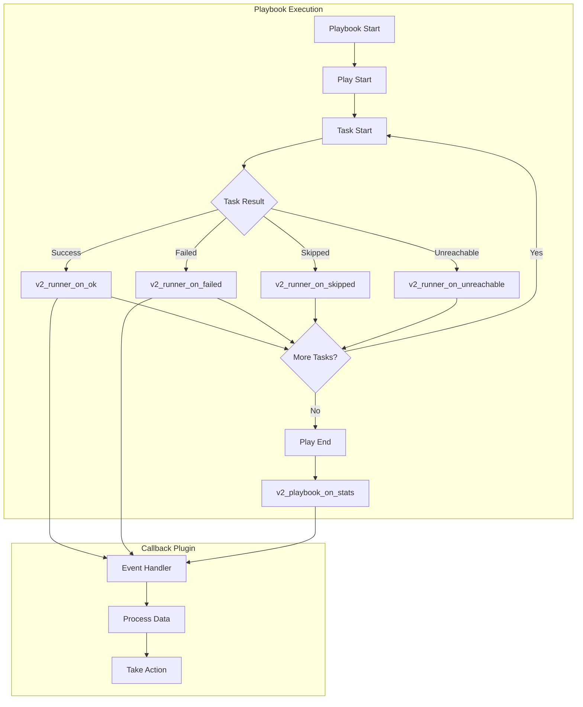
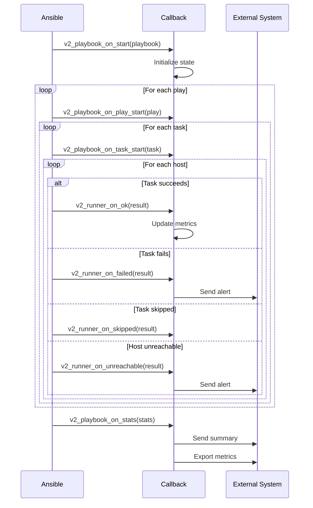

# How to Create Ansible Callback Plugins

Author: [nawazdhandala](https://github.com/nawazdhandala)

Tags: Ansible, Plugins, Automation, DevOps

Description: Learn how to build custom Ansible callback plugins for output formatting, notifications, and metrics collection with practical Python examples.

---

Ansible callback plugins let you hook into playbook execution events. They run whenever tasks start, succeed, fail, or finish. You can use them to customize output, send notifications to external systems, or collect execution metrics for monitoring.

This guide walks you through building callback plugins from scratch, covering the callback architecture, event types, and practical implementations for common use cases.

---

## Understanding Callback Plugin Architecture

Ansible triggers callbacks at specific points during playbook execution. Your plugin receives detailed information about hosts, tasks, and results at each event.



### Callback Event Types

| Event Method | When It Fires | Common Use Cases |
|-------------|---------------|------------------|
| `v2_playbook_on_start` | Playbook begins | Initialize logging, start timers |
| `v2_playbook_on_play_start` | Each play begins | Log play name, set context |
| `v2_playbook_on_task_start` | Each task begins | Track task progress |
| `v2_runner_on_ok` | Task succeeds | Log success, update metrics |
| `v2_runner_on_failed` | Task fails | Send alerts, log errors |
| `v2_runner_on_skipped` | Task skipped | Track conditional execution |
| `v2_runner_on_unreachable` | Host unreachable | Alert on connectivity issues |
| `v2_playbook_on_stats` | Playbook ends | Send summary, final metrics |

---

## Setting Up Your Development Environment

### Directory Structure

Ansible looks for callback plugins in specific locations. For development, use a local directory structure:

```
my-project/
├── ansible.cfg
├── callback_plugins/
│   └── my_callback.py
├── inventory/
│   └── hosts.yml
└── playbooks/
    └── deploy.yml
```

### Configure Ansible to Load Custom Plugins

```ini
# ansible.cfg
[defaults]
callback_plugins = ./callback_plugins
stdout_callback = my_callback
callback_whitelist = my_callback, timer
```

---

## Building Your First Callback Plugin

### Basic Plugin Structure

Every callback plugin inherits from `CallbackBase` and implements event handler methods:

```python
# callback_plugins/my_callback.py
from ansible.plugins.callback import CallbackBase
from datetime import datetime

DOCUMENTATION = '''
    name: my_callback
    type: notification
    short_description: Custom callback for logging and notifications
    description:
        - This callback logs playbook execution events
        - Sends notifications on failures
    requirements:
        - None
'''

class CallbackModule(CallbackBase):
    """Custom callback plugin for Ansible playbook events"""

    CALLBACK_VERSION = 2.0
    CALLBACK_TYPE = 'notification'
    CALLBACK_NAME = 'my_callback'
    CALLBACK_NEEDS_WHITELIST = True

    def __init__(self, display=None):
        super().__init__(display)
        self.start_time = None
        self.task_count = 0
        self.failed_tasks = []

    def v2_playbook_on_start(self, playbook):
        """Called when playbook execution begins"""
        self.start_time = datetime.now()
        self._display.banner(f"PLAYBOOK START: {playbook._file_name}")

    def v2_playbook_on_play_start(self, play):
        """Called when each play begins"""
        name = play.get_name().strip()
        self._display.banner(f"PLAY [{name}]")

    def v2_playbook_on_task_start(self, task, is_conditional):
        """Called when each task begins"""
        self.task_count += 1
        self._display.display(f"  TASK [{task.get_name()}]", color='cyan')

    def v2_runner_on_ok(self, result):
        """Called when a task succeeds"""
        host = result._host.get_name()
        task = result._task.get_name()
        self._display.display(f"    ok: [{host}] {task}", color='green')

    def v2_runner_on_failed(self, result, ignore_errors=False):
        """Called when a task fails"""
        host = result._host.get_name()
        task = result._task.get_name()

        self.failed_tasks.append({
            'host': host,
            'task': task,
            'result': result._result
        })

        if not ignore_errors:
            self._display.display(f"    FAILED: [{host}] {task}", color='red')
            if 'msg' in result._result:
                self._display.display(f"      Message: {result._result['msg']}", color='red')

    def v2_runner_on_skipped(self, result):
        """Called when a task is skipped"""
        host = result._host.get_name()
        self._display.display(f"    skipped: [{host}]", color='yellow')

    def v2_runner_on_unreachable(self, result):
        """Called when a host is unreachable"""
        host = result._host.get_name()
        self._display.display(f"    UNREACHABLE: [{host}]", color='red')

    def v2_playbook_on_stats(self, stats):
        """Called when playbook execution ends"""
        duration = datetime.now() - self.start_time

        self._display.banner("PLAYBOOK COMPLETE")
        self._display.display(f"Duration: {duration}")
        self._display.display(f"Tasks executed: {self.task_count}")

        if self.failed_tasks:
            self._display.display(f"Failed tasks: {len(self.failed_tasks)}", color='red')
```

---

## Custom Output Formatting

### JSON Output Callback

This callback outputs all events as JSON, making it easy to parse playbook results programmatically or pipe to other tools:

```python
# callback_plugins/json_output.py
import json
from datetime import datetime
from ansible.plugins.callback import CallbackBase

DOCUMENTATION = '''
    name: json_output
    type: stdout
    short_description: JSON formatted output
    description:
        - Outputs all playbook events as JSON lines
        - Useful for log aggregation and parsing
'''

class CallbackModule(CallbackBase):
    """JSON output callback plugin"""

    CALLBACK_VERSION = 2.0
    CALLBACK_TYPE = 'stdout'
    CALLBACK_NAME = 'json_output'

    def __init__(self, display=None):
        super().__init__(display)
        self.results = []
        self.current_play = None
        self.current_task = None

    def _emit_event(self, event_type, data):
        """Emit a JSON event to stdout"""
        event = {
            'timestamp': datetime.utcnow().isoformat() + 'Z',
            'event_type': event_type,
            'play': self.current_play,
            'task': self.current_task,
            **data
        }
        print(json.dumps(event))

    def v2_playbook_on_start(self, playbook):
        self._emit_event('playbook_start', {
            'playbook': playbook._file_name
        })

    def v2_playbook_on_play_start(self, play):
        self.current_play = play.get_name().strip()
        self._emit_event('play_start', {
            'hosts': play.hosts
        })

    def v2_playbook_on_task_start(self, task, is_conditional):
        self.current_task = task.get_name()
        self._emit_event('task_start', {
            'action': task.action,
            'is_conditional': is_conditional
        })

    def v2_runner_on_ok(self, result):
        self._emit_event('task_ok', {
            'host': result._host.get_name(),
            'changed': result._result.get('changed', False),
            'result': self._sanitize_result(result._result)
        })

    def v2_runner_on_failed(self, result, ignore_errors=False):
        self._emit_event('task_failed', {
            'host': result._host.get_name(),
            'ignore_errors': ignore_errors,
            'result': self._sanitize_result(result._result)
        })

    def v2_runner_on_skipped(self, result):
        self._emit_event('task_skipped', {
            'host': result._host.get_name(),
            'skip_reason': result._result.get('skip_reason', 'conditional')
        })

    def v2_runner_on_unreachable(self, result):
        self._emit_event('host_unreachable', {
            'host': result._host.get_name(),
            'result': self._sanitize_result(result._result)
        })

    def v2_playbook_on_stats(self, stats):
        summary = {}
        for host in stats.processed.keys():
            summary[host] = stats.summarize(host)

        self._emit_event('playbook_stats', {
            'summary': summary
        })

    def _sanitize_result(self, result):
        """Remove large or sensitive data from results"""
        sanitized = {}
        skip_keys = ['invocation', 'diff', 'stdout_lines', 'stderr_lines']

        for key, value in result.items():
            if key in skip_keys:
                continue
            if key.startswith('_'):
                continue
            sanitized[key] = value

        return sanitized
```

### Colorized Table Output

This callback formats output as tables with colors for better readability in terminals:

```python
# callback_plugins/table_output.py
from ansible.plugins.callback import CallbackBase
from datetime import datetime

DOCUMENTATION = '''
    name: table_output
    type: stdout
    short_description: Tabular output with colors
    description:
        - Displays playbook results in formatted tables
        - Uses ANSI colors for status indication
'''

class CallbackModule(CallbackBase):
    """Table formatted output callback"""

    CALLBACK_VERSION = 2.0
    CALLBACK_TYPE = 'stdout'
    CALLBACK_NAME = 'table_output'

    COLORS = {
        'ok': '\033[92m',
        'changed': '\033[93m',
        'failed': '\033[91m',
        'skipped': '\033[94m',
        'unreachable': '\033[95m',
        'reset': '\033[0m',
        'bold': '\033[1m'
    }

    def __init__(self, display=None):
        super().__init__(display)
        self.play_hosts = {}
        self.task_results = []

    def _color(self, text, color):
        """Apply ANSI color to text"""
        return f"{self.COLORS.get(color, '')}{text}{self.COLORS['reset']}"

    def _print_separator(self, char='-', width=80):
        print(char * width)

    def _print_header(self, text):
        print()
        self._print_separator('=')
        print(f"{self.COLORS['bold']}{text}{self.COLORS['reset']}")
        self._print_separator('=')

    def v2_playbook_on_play_start(self, play):
        self._print_header(f"PLAY: {play.get_name().strip()}")
        print(f"{'HOST':<30} {'STATUS':<15} {'CHANGED':<10} {'TASK'}")
        self._print_separator()

    def v2_playbook_on_task_start(self, task, is_conditional):
        self.current_task = task.get_name()

    def _print_result_row(self, host, status, changed, task):
        """Print a single result row"""
        status_colored = self._color(status.upper(), status)
        changed_str = 'yes' if changed else 'no'

        if changed:
            changed_str = self._color(changed_str, 'changed')

        print(f"{host:<30} {status_colored:<24} {changed_str:<19} {task}")

    def v2_runner_on_ok(self, result):
        host = result._host.get_name()
        changed = result._result.get('changed', False)
        status = 'changed' if changed else 'ok'
        self._print_result_row(host, status, changed, self.current_task)

    def v2_runner_on_failed(self, result, ignore_errors=False):
        host = result._host.get_name()
        self._print_result_row(host, 'failed', False, self.current_task)

        if 'msg' in result._result:
            print(f"  {self._color('Error:', 'failed')} {result._result['msg']}")

    def v2_runner_on_skipped(self, result):
        host = result._host.get_name()
        self._print_result_row(host, 'skipped', False, self.current_task)

    def v2_runner_on_unreachable(self, result):
        host = result._host.get_name()
        self._print_result_row(host, 'unreachable', False, self.current_task)

    def v2_playbook_on_stats(self, stats):
        self._print_header("PLAY RECAP")
        print(f"{'HOST':<30} {'OK':<10} {'CHANGED':<10} {'FAILED':<10} {'SKIPPED':<10} {'UNREACHABLE'}")
        self._print_separator()

        for host in sorted(stats.processed.keys()):
            s = stats.summarize(host)

            ok = self._color(str(s['ok']), 'ok')
            changed = self._color(str(s['changed']), 'changed') if s['changed'] else str(s['changed'])
            failed = self._color(str(s['failures']), 'failed') if s['failures'] else str(s['failures'])
            skipped = self._color(str(s['skipped']), 'skipped') if s['skipped'] else str(s['skipped'])
            unreachable = self._color(str(s['unreachable']), 'unreachable') if s['unreachable'] else str(s['unreachable'])

            print(f"{host:<30} {ok:<19} {changed:<19} {failed:<19} {skipped:<19} {unreachable}")

        self._print_separator()
```

---

## Notification Integration

### Slack Notification Callback

Send playbook execution notifications to Slack channels:

```python
# callback_plugins/slack_notify.py
import json
import os
from urllib.request import urlopen, Request
from urllib.error import URLError
from datetime import datetime
from ansible.plugins.callback import CallbackBase

DOCUMENTATION = '''
    name: slack_notify
    type: notification
    short_description: Send notifications to Slack
    description:
        - Posts playbook results to a Slack channel
        - Sends immediate alerts on failures
    options:
        webhook_url:
            description: Slack incoming webhook URL
            env:
                - name: SLACK_WEBHOOK_URL
            required: true
        channel:
            description: Slack channel to post to
            env:
                - name: SLACK_CHANNEL
            default: '#ansible'
        notify_on_success:
            description: Send notification on successful runs
            env:
                - name: SLACK_NOTIFY_SUCCESS
            default: false
'''

class CallbackModule(CallbackBase):
    """Slack notification callback plugin"""

    CALLBACK_VERSION = 2.0
    CALLBACK_TYPE = 'notification'
    CALLBACK_NAME = 'slack_notify'
    CALLBACK_NEEDS_WHITELIST = True

    def __init__(self, display=None):
        super().__init__(display)
        self.webhook_url = os.environ.get('SLACK_WEBHOOK_URL')
        self.channel = os.environ.get('SLACK_CHANNEL', '#ansible')
        self.notify_success = os.environ.get('SLACK_NOTIFY_SUCCESS', 'false').lower() == 'true'

        self.playbook_name = None
        self.start_time = None
        self.failed_hosts = {}
        self.unreachable_hosts = []

    def _send_slack_message(self, message, color='good'):
        """Send a message to Slack webhook"""
        if not self.webhook_url:
            self._display.warning("SLACK_WEBHOOK_URL not set, skipping notification")
            return

        payload = {
            'channel': self.channel,
            'username': 'Ansible',
            'icon_emoji': ':robot_face:',
            'attachments': [{
                'color': color,
                'text': message,
                'footer': f'Ansible Playbook | {datetime.utcnow().strftime("%Y-%m-%d %H:%M:%S UTC")}'
            }]
        }

        try:
            req = Request(
                self.webhook_url,
                data=json.dumps(payload).encode('utf-8'),
                headers={'Content-Type': 'application/json'}
            )
            urlopen(req, timeout=10)
        except URLError as e:
            self._display.warning(f"Failed to send Slack notification: {e}")

    def v2_playbook_on_start(self, playbook):
        self.playbook_name = playbook._file_name
        self.start_time = datetime.now()

    def v2_runner_on_failed(self, result, ignore_errors=False):
        if ignore_errors:
            return

        host = result._host.get_name()
        task = result._task.get_name()
        msg = result._result.get('msg', 'Unknown error')

        if host not in self.failed_hosts:
            self.failed_hosts[host] = []

        self.failed_hosts[host].append({
            'task': task,
            'message': msg
        })

        # Send immediate alert for failures
        alert_msg = f"*Task Failed*\n" \
                   f"Playbook: `{self.playbook_name}`\n" \
                   f"Host: `{host}`\n" \
                   f"Task: `{task}`\n" \
                   f"Error: {msg}"
        self._send_slack_message(alert_msg, color='danger')

    def v2_runner_on_unreachable(self, result):
        host = result._host.get_name()
        if host not in self.unreachable_hosts:
            self.unreachable_hosts.append(host)

    def v2_playbook_on_stats(self, stats):
        duration = datetime.now() - self.start_time
        hosts = sorted(stats.processed.keys())

        total_ok = sum(stats.summarize(h)['ok'] for h in hosts)
        total_changed = sum(stats.summarize(h)['changed'] for h in hosts)
        total_failed = sum(stats.summarize(h)['failures'] for h in hosts)
        total_unreachable = sum(stats.summarize(h)['unreachable'] for h in hosts)

        # Determine overall status
        if total_failed > 0 or total_unreachable > 0:
            status = 'FAILED'
            color = 'danger'
            emoji = ':x:'
        elif total_changed > 0:
            status = 'CHANGED'
            color = 'warning'
            emoji = ':large_orange_diamond:'
        else:
            status = 'SUCCESS'
            color = 'good'
            emoji = ':white_check_mark:'

        # Build summary message
        message = f"{emoji} *Playbook {status}*\n" \
                 f"Playbook: `{self.playbook_name}`\n" \
                 f"Duration: {duration}\n" \
                 f"Hosts: {len(hosts)}\n\n" \
                 f"*Results:*\n" \
                 f"  OK: {total_ok}\n" \
                 f"  Changed: {total_changed}\n" \
                 f"  Failed: {total_failed}\n" \
                 f"  Unreachable: {total_unreachable}"

        # Add failure details
        if self.failed_hosts:
            message += "\n\n*Failed Hosts:*"
            for host, failures in self.failed_hosts.items():
                message += f"\n  `{host}`: {len(failures)} failed task(s)"

        # Only send success notifications if configured
        if status == 'SUCCESS' and not self.notify_success:
            return

        self._send_slack_message(message, color=color)
```

### Webhook Callback for Generic HTTP Endpoints

Send events to any HTTP endpoint for integration with monitoring systems:

```python
# callback_plugins/webhook_notify.py
import json
import os
from urllib.request import urlopen, Request
from urllib.error import URLError
from datetime import datetime
from ansible.plugins.callback import CallbackBase

DOCUMENTATION = '''
    name: webhook_notify
    type: notification
    short_description: Send events to HTTP webhook
    description:
        - Posts playbook events to an HTTP endpoint
        - Supports custom headers and authentication
    options:
        webhook_url:
            description: HTTP endpoint URL
            env:
                - name: ANSIBLE_WEBHOOK_URL
            required: true
        webhook_token:
            description: Bearer token for authentication
            env:
                - name: ANSIBLE_WEBHOOK_TOKEN
'''

class CallbackModule(CallbackBase):
    """HTTP webhook notification callback"""

    CALLBACK_VERSION = 2.0
    CALLBACK_TYPE = 'notification'
    CALLBACK_NAME = 'webhook_notify'
    CALLBACK_NEEDS_WHITELIST = True

    def __init__(self, display=None):
        super().__init__(display)
        self.webhook_url = os.environ.get('ANSIBLE_WEBHOOK_URL')
        self.webhook_token = os.environ.get('ANSIBLE_WEBHOOK_TOKEN')
        self.playbook_id = datetime.utcnow().strftime('%Y%m%d%H%M%S')
        self.playbook_name = None

    def _send_event(self, event_type, data):
        """Send event to webhook endpoint"""
        if not self.webhook_url:
            return

        payload = {
            'event_type': event_type,
            'playbook_id': self.playbook_id,
            'playbook_name': self.playbook_name,
            'timestamp': datetime.utcnow().isoformat() + 'Z',
            'data': data
        }

        headers = {
            'Content-Type': 'application/json',
            'User-Agent': 'Ansible-Callback/1.0'
        }

        if self.webhook_token:
            headers['Authorization'] = f'Bearer {self.webhook_token}'

        try:
            req = Request(
                self.webhook_url,
                data=json.dumps(payload).encode('utf-8'),
                headers=headers
            )
            urlopen(req, timeout=5)
        except URLError as e:
            self._display.warning(f"Webhook notification failed: {e}")

    def v2_playbook_on_start(self, playbook):
        self.playbook_name = playbook._file_name
        self._send_event('playbook_started', {
            'file': playbook._file_name
        })

    def v2_runner_on_ok(self, result):
        self._send_event('task_completed', {
            'host': result._host.get_name(),
            'task': result._task.get_name(),
            'status': 'ok',
            'changed': result._result.get('changed', False)
        })

    def v2_runner_on_failed(self, result, ignore_errors=False):
        self._send_event('task_failed', {
            'host': result._host.get_name(),
            'task': result._task.get_name(),
            'status': 'failed',
            'ignore_errors': ignore_errors,
            'message': result._result.get('msg', '')
        })

    def v2_runner_on_unreachable(self, result):
        self._send_event('host_unreachable', {
            'host': result._host.get_name(),
            'message': result._result.get('msg', '')
        })

    def v2_playbook_on_stats(self, stats):
        summary = {}
        for host in stats.processed.keys():
            summary[host] = stats.summarize(host)

        self._send_event('playbook_completed', {
            'summary': summary,
            'total_hosts': len(stats.processed)
        })
```

---

## Metrics Collection

### Prometheus Metrics Callback

Export playbook execution metrics to Prometheus:

```python
# callback_plugins/prometheus_metrics.py
import os
import time
from datetime import datetime
from ansible.plugins.callback import CallbackBase

DOCUMENTATION = '''
    name: prometheus_metrics
    type: notification
    short_description: Export metrics to Prometheus
    description:
        - Writes metrics to a file for Prometheus node_exporter textfile collector
        - Tracks task duration, success/failure rates, and host statistics
    options:
        metrics_path:
            description: Path to write metrics file
            env:
                - name: ANSIBLE_PROMETHEUS_METRICS_PATH
            default: /var/lib/prometheus/node-exporter/ansible.prom
'''

class CallbackModule(CallbackBase):
    """Prometheus metrics callback plugin"""

    CALLBACK_VERSION = 2.0
    CALLBACK_TYPE = 'notification'
    CALLBACK_NAME = 'prometheus_metrics'
    CALLBACK_NEEDS_WHITELIST = True

    def __init__(self, display=None):
        super().__init__(display)
        self.metrics_path = os.environ.get(
            'ANSIBLE_PROMETHEUS_METRICS_PATH',
            '/var/lib/prometheus/node-exporter/ansible.prom'
        )

        self.playbook_name = None
        self.start_time = None
        self.task_start_times = {}

        # Metric counters
        self.metrics = {
            'tasks_total': 0,
            'tasks_ok': 0,
            'tasks_changed': 0,
            'tasks_failed': 0,
            'tasks_skipped': 0,
            'hosts_unreachable': 0,
            'task_duration_seconds': []
        }

    def v2_playbook_on_start(self, playbook):
        self.playbook_name = os.path.basename(playbook._file_name)
        self.start_time = time.time()

    def v2_playbook_on_task_start(self, task, is_conditional):
        task_uuid = task._uuid
        self.task_start_times[task_uuid] = time.time()

    def _record_task_duration(self, result):
        """Record task execution duration"""
        task_uuid = result._task._uuid
        if task_uuid in self.task_start_times:
            duration = time.time() - self.task_start_times[task_uuid]
            self.metrics['task_duration_seconds'].append(duration)
            del self.task_start_times[task_uuid]

    def v2_runner_on_ok(self, result):
        self.metrics['tasks_total'] += 1
        self.metrics['tasks_ok'] += 1

        if result._result.get('changed', False):
            self.metrics['tasks_changed'] += 1

        self._record_task_duration(result)

    def v2_runner_on_failed(self, result, ignore_errors=False):
        self.metrics['tasks_total'] += 1
        self.metrics['tasks_failed'] += 1
        self._record_task_duration(result)

    def v2_runner_on_skipped(self, result):
        self.metrics['tasks_total'] += 1
        self.metrics['tasks_skipped'] += 1

    def v2_runner_on_unreachable(self, result):
        self.metrics['hosts_unreachable'] += 1

    def v2_playbook_on_stats(self, stats):
        """Write metrics to file in Prometheus format"""
        total_duration = time.time() - self.start_time

        # Calculate average task duration
        durations = self.metrics['task_duration_seconds']
        avg_duration = sum(durations) / len(durations) if durations else 0

        # Build metrics output
        lines = [
            '# HELP ansible_playbook_duration_seconds Total playbook execution time',
            '# TYPE ansible_playbook_duration_seconds gauge',
            f'ansible_playbook_duration_seconds{{playbook="{self.playbook_name}"}} {total_duration:.3f}',
            '',
            '# HELP ansible_tasks_total Total number of tasks executed',
            '# TYPE ansible_tasks_total counter',
            f'ansible_tasks_total{{playbook="{self.playbook_name}"}} {self.metrics["tasks_total"]}',
            '',
            '# HELP ansible_tasks_ok Number of successful tasks',
            '# TYPE ansible_tasks_ok counter',
            f'ansible_tasks_ok{{playbook="{self.playbook_name}"}} {self.metrics["tasks_ok"]}',
            '',
            '# HELP ansible_tasks_changed Number of tasks that made changes',
            '# TYPE ansible_tasks_changed counter',
            f'ansible_tasks_changed{{playbook="{self.playbook_name}"}} {self.metrics["tasks_changed"]}',
            '',
            '# HELP ansible_tasks_failed Number of failed tasks',
            '# TYPE ansible_tasks_failed counter',
            f'ansible_tasks_failed{{playbook="{self.playbook_name}"}} {self.metrics["tasks_failed"]}',
            '',
            '# HELP ansible_tasks_skipped Number of skipped tasks',
            '# TYPE ansible_tasks_skipped counter',
            f'ansible_tasks_skipped{{playbook="{self.playbook_name}"}} {self.metrics["tasks_skipped"]}',
            '',
            '# HELP ansible_hosts_unreachable Number of unreachable hosts',
            '# TYPE ansible_hosts_unreachable gauge',
            f'ansible_hosts_unreachable{{playbook="{self.playbook_name}"}} {self.metrics["hosts_unreachable"]}',
            '',
            '# HELP ansible_task_duration_seconds_avg Average task duration',
            '# TYPE ansible_task_duration_seconds_avg gauge',
            f'ansible_task_duration_seconds_avg{{playbook="{self.playbook_name}"}} {avg_duration:.3f}',
            '',
            '# HELP ansible_last_run_timestamp Unix timestamp of last run',
            '# TYPE ansible_last_run_timestamp gauge',
            f'ansible_last_run_timestamp{{playbook="{self.playbook_name}"}} {time.time():.0f}',
        ]

        try:
            # Write to temporary file first, then rename for atomicity
            temp_path = self.metrics_path + '.tmp'
            with open(temp_path, 'w') as f:
                f.write('\n'.join(lines) + '\n')
            os.rename(temp_path, self.metrics_path)
        except IOError as e:
            self._display.warning(f"Failed to write metrics: {e}")
```

### OpenTelemetry Metrics Callback

Send metrics to an OpenTelemetry collector for centralized observability:

```python
# callback_plugins/otel_metrics.py
import os
import time
import json
from urllib.request import urlopen, Request
from urllib.error import URLError
from datetime import datetime
from ansible.plugins.callback import CallbackBase

DOCUMENTATION = '''
    name: otel_metrics
    type: notification
    short_description: Send metrics to OpenTelemetry collector
    description:
        - Exports playbook metrics using OTLP HTTP protocol
        - Integrates with OneUptime, Jaeger, or any OTLP-compatible backend
    options:
        otlp_endpoint:
            description: OTLP HTTP endpoint
            env:
                - name: OTLP_ENDPOINT
            default: http://localhost:4318
        otlp_token:
            description: Authentication token
            env:
                - name: OTLP_TOKEN
'''

class CallbackModule(CallbackBase):
    """OpenTelemetry metrics callback"""

    CALLBACK_VERSION = 2.0
    CALLBACK_TYPE = 'notification'
    CALLBACK_NAME = 'otel_metrics'
    CALLBACK_NEEDS_WHITELIST = True

    def __init__(self, display=None):
        super().__init__(display)
        self.endpoint = os.environ.get('OTLP_ENDPOINT', 'http://localhost:4318')
        self.token = os.environ.get('OTLP_TOKEN', '')

        self.playbook_name = None
        self.start_time = None
        self.task_metrics = []

    def _get_timestamp_nanos(self):
        """Get current time in nanoseconds"""
        return int(time.time() * 1e9)

    def _send_metrics(self, metrics_data):
        """Send metrics to OTLP endpoint"""
        url = f"{self.endpoint}/v1/metrics"

        headers = {
            'Content-Type': 'application/json'
        }
        if self.token:
            headers['x-oneuptime-token'] = self.token

        try:
            req = Request(
                url,
                data=json.dumps(metrics_data).encode('utf-8'),
                headers=headers
            )
            urlopen(req, timeout=10)
        except URLError as e:
            self._display.warning(f"Failed to send OTLP metrics: {e}")

    def v2_playbook_on_start(self, playbook):
        self.playbook_name = os.path.basename(playbook._file_name)
        self.start_time = time.time()

    def v2_runner_on_ok(self, result):
        self.task_metrics.append({
            'host': result._host.get_name(),
            'task': result._task.get_name(),
            'status': 'ok',
            'changed': result._result.get('changed', False)
        })

    def v2_runner_on_failed(self, result, ignore_errors=False):
        self.task_metrics.append({
            'host': result._host.get_name(),
            'task': result._task.get_name(),
            'status': 'failed',
            'ignore_errors': ignore_errors
        })

    def v2_playbook_on_stats(self, stats):
        """Build and send OTLP metrics payload"""
        duration = time.time() - self.start_time
        timestamp = self._get_timestamp_nanos()

        # Count metrics
        ok_count = sum(1 for m in self.task_metrics if m['status'] == 'ok')
        failed_count = sum(1 for m in self.task_metrics if m['status'] == 'failed')
        changed_count = sum(1 for m in self.task_metrics if m.get('changed', False))

        # Build OTLP metrics payload
        metrics_data = {
            'resourceMetrics': [{
                'resource': {
                    'attributes': [
                        {'key': 'service.name', 'value': {'stringValue': 'ansible'}},
                        {'key': 'playbook.name', 'value': {'stringValue': self.playbook_name}}
                    ]
                },
                'scopeMetrics': [{
                    'scope': {'name': 'ansible.callback'},
                    'metrics': [
                        {
                            'name': 'ansible.playbook.duration',
                            'unit': 's',
                            'gauge': {
                                'dataPoints': [{
                                    'asDouble': duration,
                                    'timeUnixNano': timestamp
                                }]
                            }
                        },
                        {
                            'name': 'ansible.tasks.total',
                            'sum': {
                                'dataPoints': [{
                                    'asInt': len(self.task_metrics),
                                    'timeUnixNano': timestamp
                                }],
                                'isMonotonic': True
                            }
                        },
                        {
                            'name': 'ansible.tasks.ok',
                            'sum': {
                                'dataPoints': [{
                                    'asInt': ok_count,
                                    'timeUnixNano': timestamp
                                }],
                                'isMonotonic': True
                            }
                        },
                        {
                            'name': 'ansible.tasks.failed',
                            'sum': {
                                'dataPoints': [{
                                    'asInt': failed_count,
                                    'timeUnixNano': timestamp
                                }],
                                'isMonotonic': True
                            }
                        },
                        {
                            'name': 'ansible.tasks.changed',
                            'sum': {
                                'dataPoints': [{
                                    'asInt': changed_count,
                                    'timeUnixNano': timestamp
                                }],
                                'isMonotonic': True
                            }
                        }
                    ]
                }]
            }]
        }

        self._send_metrics(metrics_data)
```

---

## Testing Your Callback Plugin

### Unit Testing

```python
# tests/test_callback.py
import unittest
from unittest.mock import Mock, MagicMock
from callback_plugins.my_callback import CallbackModule

class TestCallbackModule(unittest.TestCase):
    def setUp(self):
        self.callback = CallbackModule()
        self.callback._display = Mock()

    def test_playbook_on_start(self):
        playbook = Mock()
        playbook._file_name = 'test.yml'

        self.callback.v2_playbook_on_start(playbook)

        self.assertIsNotNone(self.callback.start_time)
        self.callback._display.banner.assert_called()

    def test_runner_on_failed(self):
        result = Mock()
        result._host.get_name.return_value = 'webserver1'
        result._task.get_name.return_value = 'Install nginx'
        result._result = {'msg': 'Package not found'}

        self.callback.v2_runner_on_failed(result)

        self.assertEqual(len(self.callback.failed_tasks), 1)
        self.assertEqual(self.callback.failed_tasks[0]['host'], 'webserver1')

    def test_stats_calculation(self):
        stats = Mock()
        stats.processed = {'host1': {}, 'host2': {}}
        stats.summarize.return_value = {
            'ok': 5,
            'changed': 2,
            'failures': 0,
            'skipped': 1,
            'unreachable': 0
        }

        self.callback.start_time = Mock()
        self.callback.v2_playbook_on_stats(stats)

        self.callback._display.banner.assert_called()

if __name__ == '__main__':
    unittest.main()
```

### Integration Testing

Create a test playbook and run it with your callback:

```yaml
# test_playbook.yml
- name: Test callback plugin
  hosts: localhost
  connection: local
  gather_facts: false

  tasks:
    - name: Successful task
      debug:
        msg: "This task succeeds"

    - name: Changed task
      command: echo "changed"
      changed_when: true

    - name: Skipped task
      debug:
        msg: "This is skipped"
      when: false

    - name: Failing task
      fail:
        msg: "Intentional failure"
      ignore_errors: true
```

Run the test:

```bash
ANSIBLE_CALLBACK_PLUGINS=./callback_plugins \
ANSIBLE_STDOUT_CALLBACK=my_callback \
ansible-playbook test_playbook.yml
```

---

## Callback Flow Diagram

Here is the complete flow of events in a callback plugin:



---

## Best Practices

1. **Handle exceptions gracefully** - Never let your callback crash the playbook. Wrap external calls in try/except blocks.

2. **Use environment variables for configuration** - Keep sensitive data like API keys and webhook URLs out of code.

3. **Make external calls non-blocking when possible** - Use timeouts and consider async patterns for high-frequency events.

4. **Filter sensitive data** - Ansible results can contain passwords and secrets. Sanitize before logging or sending externally.

5. **Use CALLBACK_NEEDS_WHITELIST** - Require explicit enabling to prevent accidental activation.

6. **Write idempotent handlers** - Callbacks may be called multiple times for retries. Handle duplicates gracefully.

7. **Document your plugin** - Include the DOCUMENTATION string for ansible-doc compatibility.

8. **Test with different playbook patterns** - Include handlers, blocks, rescues, and async tasks in your test suite.

---

Callback plugins give you full control over Ansible's execution lifecycle. Start with simple logging, then add notifications and metrics as your automation grows. The examples in this guide provide a foundation you can extend for your specific needs.

---

*Looking to monitor your Ansible automation alongside your applications? [OneUptime](https://oneuptime.com) provides OpenTelemetry-native observability for infrastructure automation, including metrics collection, alerting, and incident management.*

**Related Reading:**
- [How to Implement Custom Controllers and Operators in Kubernetes](https://oneuptime.com/blog/post/2026-01-06-kubernetes-custom-controllers-operators/view)
- [How to Structure Logs Properly in Python with OpenTelemetry](https://oneuptime.com/blog/post/2025-01-06-python-structured-logging-opentelemetry/view)
- [Introducing the OneUptime Terraform Provider](https://oneuptime.com/blog/post/2025-07-01-introducing-terraform-provider-for-oneuptime/view)
