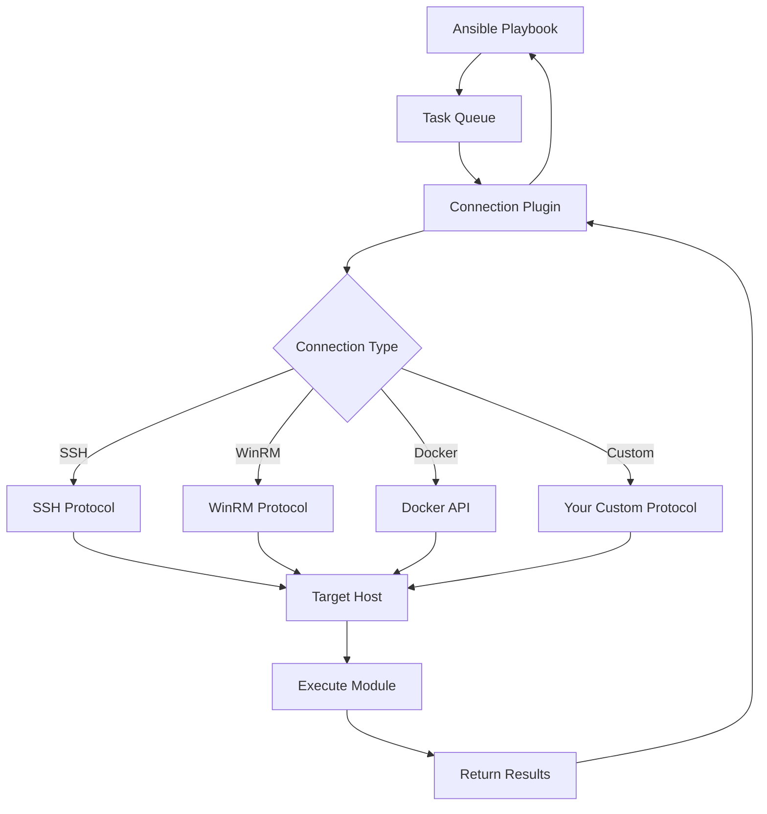
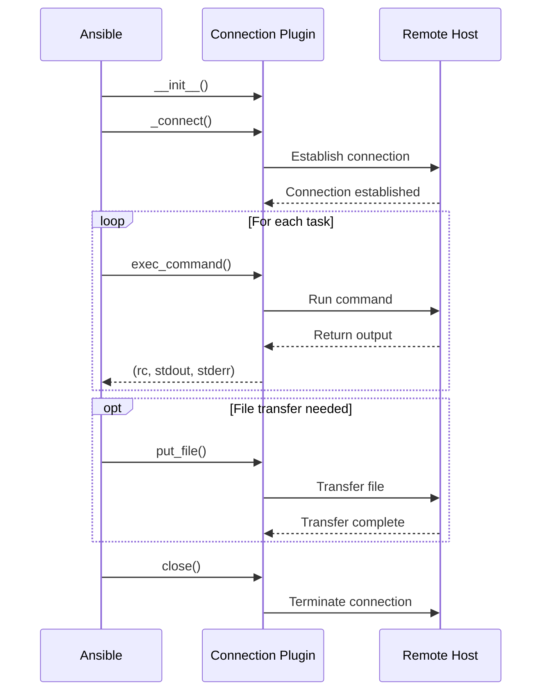
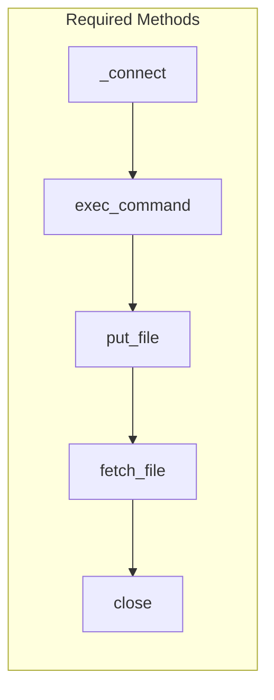
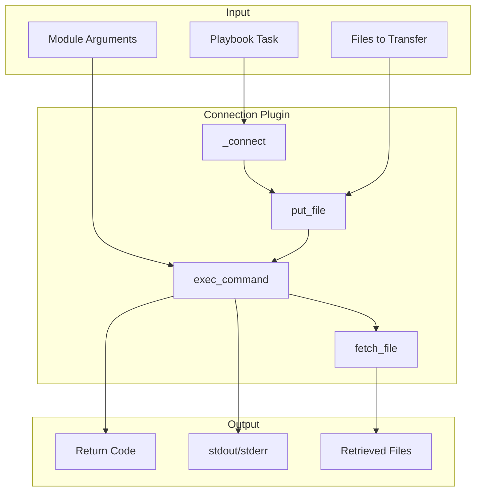

# How to Build Ansible Connection Plugins

Author: [nawazdhandala](https://github.com/nawazdhandala)

Tags: Ansible, Plugins, Automation, DevOps

Description: Learn how to create custom Ansible connection plugins to communicate with hosts using non-standard protocols, APIs, or proprietary systems beyond SSH and WinRM.

---

Ansible connects to managed hosts using connection plugins. By default, it uses SSH for Linux and WinRM for Windows, but what if your infrastructure requires something different? Perhaps you need to manage devices through a REST API, connect via a proprietary protocol, or interface with a container orchestration system.

Connection plugins are the answer. They define how Ansible communicates with remote hosts, and building your own opens up possibilities for managing any system that can accept commands.

## Understanding Connection Plugin Architecture

Before writing code, let us understand how connection plugins fit into the Ansible execution flow.



Connection plugins handle three core responsibilities:

1. **Establishing connections** to remote hosts
2. **Executing commands** on those hosts
3. **Transferring files** to and from hosts

Every connection plugin must implement these capabilities, regardless of the underlying transport mechanism.

## Connection Plugin Lifecycle

Understanding the lifecycle helps you design robust plugins that handle connections efficiently.



## Project Structure

Connection plugins live in a specific location within your Ansible setup:

```
my_ansible_collection/
├── plugins/
│   └── connection/
│       └── my_connection.py
├── tests/
│   └── unit/
│       └── plugins/
│           └── connection/
│               └── test_my_connection.py
└── galaxy.yml
```

For local development, you can place plugins in a `connection_plugins/` directory alongside your playbook, or configure `ansible.cfg` to point to your plugin directory.

## Building a REST API Connection Plugin

Let us build a practical connection plugin that communicates with hosts through a REST API. This pattern is common when managing cloud appliances, network devices with REST interfaces, or custom infrastructure platforms.

Here is the complete implementation with detailed explanations:

```python
#!/usr/bin/python
# -*- coding: utf-8 -*-

# Copyright: (c) 2026, Your Name <your.email@example.com>
# GNU General Public License v3.0+

from __future__ import absolute_import, division, print_function
__metaclass__ = type

DOCUMENTATION = r'''
---
name: rest_api
short_description: Connect to hosts via REST API
description:
    - This connection plugin communicates with remote hosts through a REST API
    - Useful for managing appliances, cloud devices, or custom platforms
    - Supports command execution and file transfers via API endpoints
version_added: "1.0.0"
author: Your Name (@yourgithub)

options:
    host:
        description: Target host address
        default: inventory_hostname
        vars:
            - name: inventory_hostname
            - name: ansible_host
    api_port:
        description: REST API port number
        default: 8443
        ini:
            - section: rest_api_connection
              key: api_port
        env:
            - name: ANSIBLE_REST_API_PORT
        vars:
            - name: ansible_rest_api_port
    api_token:
        description: Authentication token for API access
        required: true
        env:
            - name: ANSIBLE_REST_API_TOKEN
        vars:
            - name: ansible_rest_api_token
    verify_ssl:
        description: Whether to verify SSL certificates
        type: boolean
        default: true
        ini:
            - section: rest_api_connection
              key: verify_ssl
        env:
            - name: ANSIBLE_REST_API_VERIFY_SSL
        vars:
            - name: ansible_rest_api_verify_ssl
    timeout:
        description: Connection timeout in seconds
        type: integer
        default: 30
        ini:
            - section: rest_api_connection
              key: timeout
        vars:
            - name: ansible_rest_api_timeout
'''

EXAMPLES = r'''
# In your inventory file
[appliances]
device1 ansible_host=192.168.1.100 ansible_connection=rest_api

[appliances:vars]
ansible_rest_api_port=8443
ansible_rest_api_token="{{ lookup('env', 'API_TOKEN') }}"
ansible_rest_api_verify_ssl=false

# In ansible.cfg
[rest_api_connection]
api_port = 8443
verify_ssl = true
timeout = 60
'''

import base64
import json
import os
import tempfile
import urllib.request
import urllib.error
import ssl

from ansible.errors import AnsibleConnectionFailure, AnsibleFileNotFound
from ansible.plugins.connection import ConnectionBase
from ansible.utils.display import Display

display = Display()


class Connection(ConnectionBase):
    """REST API connection plugin for Ansible."""

    # Plugin transport identifier
    transport = 'rest_api'

    # Indicate this plugin has a persistent connection
    has_pipelining = False

    def __init__(self, *args, **kwargs):
        """Initialize the connection plugin."""
        super(Connection, self).__init__(*args, **kwargs)

        # Connection state
        self._connected = False
        self._api_base_url = None
        self._ssl_context = None

    def _build_api_url(self, endpoint):
        """Construct full API URL for an endpoint."""
        return f"{self._api_base_url}/{endpoint.lstrip('/')}"

    def _make_request(self, method, endpoint, data=None):
        """
        Make an HTTP request to the REST API.

        Args:
            method: HTTP method (GET, POST, PUT, DELETE)
            endpoint: API endpoint path
            data: Optional request body data

        Returns:
            Tuple of (response_code, response_body)
        """
        url = self._build_api_url(endpoint)
        headers = {
            'Authorization': f'Bearer {self.get_option("api_token")}',
            'Content-Type': 'application/json',
            'Accept': 'application/json',
        }

        request_body = None
        if data is not None:
            request_body = json.dumps(data).encode('utf-8')

        request = urllib.request.Request(
            url,
            data=request_body,
            headers=headers,
            method=method
        )

        try:
            timeout = self.get_option('timeout')
            response = urllib.request.urlopen(
                request,
                context=self._ssl_context,
                timeout=timeout
            )
            return response.getcode(), response.read().decode('utf-8')

        except urllib.error.HTTPError as e:
            return e.code, e.read().decode('utf-8')
        except urllib.error.URLError as e:
            raise AnsibleConnectionFailure(
                f"Failed to connect to {url}: {str(e)}"
            )

    def _connect(self):
        """
        Establish connection to the remote host.

        This method is called automatically before executing commands.
        """
        if self._connected:
            return self

        host = self.get_option('host')
        port = self.get_option('api_port')
        verify_ssl = self.get_option('verify_ssl')

        # Build the base API URL
        self._api_base_url = f"https://{host}:{port}/api/v1"

        # Configure SSL context
        self._ssl_context = ssl.create_default_context()
        if not verify_ssl:
            self._ssl_context.check_hostname = False
            self._ssl_context.verify_mode = ssl.CERT_NONE

        # Verify connectivity by hitting a health endpoint
        display.vvv(f"REST_API: Connecting to {self._api_base_url}", host=host)

        try:
            status_code, response = self._make_request('GET', '/health')
            if status_code not in (200, 204):
                raise AnsibleConnectionFailure(
                    f"API health check failed with status {status_code}"
                )
        except Exception as e:
            raise AnsibleConnectionFailure(
                f"Failed to establish connection: {str(e)}"
            )

        self._connected = True
        display.vvv(f"REST_API: Connected successfully", host=host)

        return self

    def exec_command(self, cmd, in_data=None, sudoable=True):
        """
        Execute a command on the remote host via API.

        Args:
            cmd: Command string to execute
            in_data: Optional stdin data
            sudoable: Whether privilege escalation is allowed

        Returns:
            Tuple of (return_code, stdout, stderr)
        """
        super(Connection, self).exec_command(cmd, in_data=in_data, sudoable=sudoable)

        display.vvv(f"REST_API: Executing command: {cmd}", host=self._play_context.remote_addr)

        # Prepare the command execution request
        payload = {
            'command': cmd,
            'timeout': self.get_option('timeout'),
        }

        if in_data:
            # Encode stdin data as base64 for API transport
            payload['stdin'] = base64.b64encode(in_data).decode('utf-8')

        # Execute command via API
        status_code, response_body = self._make_request(
            'POST',
            '/execute',
            data=payload
        )

        # Parse the response
        try:
            result = json.loads(response_body)
        except json.JSONDecodeError:
            return (
                1,
                b'',
                f"Invalid JSON response from API: {response_body}".encode('utf-8')
            )

        # Extract execution results
        return_code = result.get('return_code', 1)
        stdout = result.get('stdout', '').encode('utf-8')
        stderr = result.get('stderr', '').encode('utf-8')

        display.vvv(f"REST_API: Command returned {return_code}", host=self._play_context.remote_addr)

        return (return_code, stdout, stderr)

    def put_file(self, in_path, out_path):
        """
        Transfer a file to the remote host via API.

        Args:
            in_path: Local source file path
            out_path: Remote destination file path
        """
        super(Connection, self).put_file(in_path, out_path)

        display.vvv(f"REST_API: PUT {in_path} -> {out_path}", host=self._play_context.remote_addr)

        # Verify source file exists
        if not os.path.exists(in_path):
            raise AnsibleFileNotFound(f"File not found: {in_path}")

        # Read and encode file content
        with open(in_path, 'rb') as f:
            file_content = base64.b64encode(f.read()).decode('utf-8')

        # Get file metadata
        file_stat = os.stat(in_path)

        payload = {
            'path': out_path,
            'content': file_content,
            'mode': oct(file_stat.st_mode)[-3:],
            'encoding': 'base64',
        }

        status_code, response_body = self._make_request(
            'PUT',
            '/files',
            data=payload
        )

        if status_code not in (200, 201, 204):
            raise AnsibleConnectionFailure(
                f"Failed to transfer file: {response_body}"
            )

    def fetch_file(self, in_path, out_path):
        """
        Fetch a file from the remote host via API.

        Args:
            in_path: Remote source file path
            out_path: Local destination file path
        """
        super(Connection, self).fetch_file(in_path, out_path)

        display.vvv(f"REST_API: FETCH {in_path} -> {out_path}", host=self._play_context.remote_addr)

        # Request file from API
        status_code, response_body = self._make_request(
            'GET',
            f'/files?path={in_path}'
        )

        if status_code == 404:
            raise AnsibleFileNotFound(f"Remote file not found: {in_path}")

        if status_code != 200:
            raise AnsibleConnectionFailure(
                f"Failed to fetch file: {response_body}"
            )

        # Parse response and decode content
        try:
            result = json.loads(response_body)
            file_content = base64.b64decode(result.get('content', ''))
        except (json.JSONDecodeError, ValueError) as e:
            raise AnsibleConnectionFailure(
                f"Failed to decode file content: {str(e)}"
            )

        # Write to local destination
        with open(out_path, 'wb') as f:
            f.write(file_content)

    def close(self):
        """Close the connection to the remote host."""
        if self._connected:
            display.vvv(
                "REST_API: Closing connection",
                host=self._play_context.remote_addr
            )
            # Optionally notify the API that we are disconnecting
            try:
                self._make_request('POST', '/disconnect')
            except Exception:
                pass  # Ignore errors during cleanup

            self._connected = False

        super(Connection, self).close()
```

## Key Implementation Details

### The ConnectionBase Class

All connection plugins inherit from `ConnectionBase`. This base class provides the interface that Ansible expects and handles common functionality like option management.

### Required Methods

Every connection plugin must implement these four methods:



| Method | Purpose |
|--------|---------|
| `_connect()` | Establishes the connection to the remote host |
| `exec_command()` | Runs a command and returns (rc, stdout, stderr) |
| `put_file()` | Uploads a file to the remote host |
| `fetch_file()` | Downloads a file from the remote host |
| `close()` | Terminates the connection cleanly |

### Option Handling

The `DOCUMENTATION` block defines configuration options that users can set through multiple sources:

```python
options:
    api_port:
        description: REST API port number
        default: 8443
        ini:                              # ansible.cfg setting
            - section: rest_api_connection
              key: api_port
        env:                              # Environment variable
            - name: ANSIBLE_REST_API_PORT
        vars:                             # Inventory variable
            - name: ansible_rest_api_port
```

Access these options in your code using `self.get_option('api_port')`.

### Error Handling

Use specific exception classes for different error conditions:

```python
from ansible.errors import (
    AnsibleConnectionFailure,  # Connection problems
    AnsibleFileNotFound,       # Missing files
    AnsibleError,              # General errors
)
```

## Building a Container Connection Plugin

Here is a simpler example that connects to Docker containers:

```python
#!/usr/bin/python
# -*- coding: utf-8 -*-

from __future__ import absolute_import, division, print_function
__metaclass__ = type

DOCUMENTATION = r'''
---
name: docker_exec
short_description: Execute commands in Docker containers
description:
    - Run commands inside Docker containers using docker exec
    - Supports file transfers via docker cp
version_added: "1.0.0"
author: Your Name (@yourgithub)

options:
    container_name:
        description: Name or ID of the target container
        required: true
        vars:
            - name: ansible_docker_container
            - name: inventory_hostname
    docker_host:
        description: Docker daemon socket
        default: unix:///var/run/docker.sock
        env:
            - name: DOCKER_HOST
        vars:
            - name: ansible_docker_host
'''

import os
import subprocess
import shutil

from ansible.errors import AnsibleConnectionFailure, AnsibleFileNotFound
from ansible.plugins.connection import ConnectionBase
from ansible.utils.display import Display

display = Display()


class Connection(ConnectionBase):
    """Docker container connection plugin."""

    transport = 'docker_exec'
    has_pipelining = True

    def __init__(self, *args, **kwargs):
        super(Connection, self).__init__(*args, **kwargs)
        self._connected = False
        self._container = None

    def _connect(self):
        """Verify container exists and is running."""
        if self._connected:
            return self

        self._container = self.get_option('container_name')

        # Check if container is running
        result = subprocess.run(
            ['docker', 'inspect', '-f', '{{.State.Running}}', self._container],
            capture_output=True,
            text=True
        )

        if result.returncode != 0:
            raise AnsibleConnectionFailure(
                f"Container {self._container} not found"
            )

        if result.stdout.strip() != 'true':
            raise AnsibleConnectionFailure(
                f"Container {self._container} is not running"
            )

        self._connected = True
        display.vvv(f"DOCKER: Connected to container {self._container}")

        return self

    def exec_command(self, cmd, in_data=None, sudoable=True):
        """Execute a command in the container."""
        super(Connection, self).exec_command(cmd, in_data=in_data, sudoable=sudoable)

        display.vvv(f"DOCKER: Executing: {cmd}", host=self._container)

        # Build docker exec command
        docker_cmd = ['docker', 'exec']

        if in_data:
            docker_cmd.append('-i')

        docker_cmd.extend([self._container, '/bin/sh', '-c', cmd])

        # Execute command
        result = subprocess.run(
            docker_cmd,
            input=in_data,
            capture_output=True
        )

        return (result.returncode, result.stdout, result.stderr)

    def put_file(self, in_path, out_path):
        """Copy a file into the container."""
        super(Connection, self).put_file(in_path, out_path)

        display.vvv(f"DOCKER: PUT {in_path} -> {out_path}", host=self._container)

        if not os.path.exists(in_path):
            raise AnsibleFileNotFound(f"File not found: {in_path}")

        result = subprocess.run(
            ['docker', 'cp', in_path, f"{self._container}:{out_path}"],
            capture_output=True,
            text=True
        )

        if result.returncode != 0:
            raise AnsibleConnectionFailure(
                f"Failed to copy file: {result.stderr}"
            )

    def fetch_file(self, in_path, out_path):
        """Copy a file from the container."""
        super(Connection, self).fetch_file(in_path, out_path)

        display.vvv(f"DOCKER: FETCH {in_path} -> {out_path}", host=self._container)

        result = subprocess.run(
            ['docker', 'cp', f"{self._container}:{in_path}", out_path],
            capture_output=True,
            text=True
        )

        if result.returncode != 0:
            raise AnsibleFileNotFound(
                f"Failed to fetch file: {result.stderr}"
            )

    def close(self):
        """Close the connection."""
        self._connected = False
        super(Connection, self).close()
```

## Testing Your Connection Plugin

Create a test environment to validate your plugin:

```yaml
# inventory.yml
---
all:
  hosts:
    test_container:
      ansible_connection: docker_exec
      ansible_docker_container: my_test_container
```

```yaml
# test_playbook.yml
---
- name: Test Docker connection plugin
  hosts: test_container
  gather_facts: false

  tasks:
    - name: Run a simple command
      ansible.builtin.command: hostname
      register: hostname_result

    - name: Display hostname
      ansible.builtin.debug:
        var: hostname_result.stdout

    - name: Create a test file
      ansible.builtin.copy:
        content: "Hello from Ansible!"
        dest: /tmp/ansible_test.txt

    - name: Verify file exists
      ansible.builtin.stat:
        path: /tmp/ansible_test.txt
      register: file_stat

    - name: Assert file was created
      ansible.builtin.assert:
        that:
          - file_stat.stat.exists
```

Run the tests:

```bash
# Create a test container
docker run -d --name my_test_container alpine:latest sleep 3600

# Set up plugin location
mkdir -p connection_plugins
cp docker_exec.py connection_plugins/

# Configure Ansible to find the plugin
export ANSIBLE_CONNECTION_PLUGINS=./connection_plugins

# Run the playbook
ansible-playbook -i inventory.yml test_playbook.yml -vvv

# Clean up
docker rm -f my_test_container
```

## Advanced Features

### Pipelining Support

Pipelining improves performance by reducing the number of SSH connections. For custom plugins, set `has_pipelining = True` and implement command chaining:

```python
class Connection(ConnectionBase):
    has_pipelining = True

    def exec_command(self, cmd, in_data=None, sudoable=True):
        # When pipelining, Ansible sends the module as stdin
        # Your plugin should handle this appropriately
        if in_data:
            # Module code is being piped
            cmd = f"python - <<'ANSIBLE_MODULE_EOF'\n{in_data.decode()}\nANSIBLE_MODULE_EOF"

        # Execute the command
        ...
```

### Connection Persistence

For protocols with expensive connection setup, implement connection reuse:

```python
def _connect(self):
    if self._connected:
        return self

    # Check if we have a cached connection
    cache_key = f"{self._play_context.remote_addr}:{self._play_context.port}"

    if cache_key in CONNECTION_CACHE:
        self._connection = CONNECTION_CACHE[cache_key]
        self._connected = True
        return self

    # Establish new connection
    self._connection = self._establish_new_connection()
    CONNECTION_CACHE[cache_key] = self._connection
    self._connected = True

    return self
```

### Become Support

If your connection type supports privilege escalation:

```python
def exec_command(self, cmd, in_data=None, sudoable=True):
    if sudoable and self._play_context.become:
        become_method = self._play_context.become_method
        become_user = self._play_context.become_user

        if become_method == 'sudo':
            cmd = f"sudo -u {become_user} {cmd}"
        elif become_method == 'su':
            cmd = f"su - {become_user} -c '{cmd}'"

    # Execute the modified command
    ...
```

## Data Flow Overview

Understanding how data flows through your plugin helps with debugging:



## Debugging Tips

Enable verbose output to see connection plugin activity:

```bash
# Maximum verbosity shows connection details
ansible-playbook playbook.yml -vvvv

# Debug specific connection issues
ANSIBLE_DEBUG=1 ansible-playbook playbook.yml -vvv
```

Add strategic display messages in your plugin:

```python
from ansible.utils.display import Display
display = Display()

def exec_command(self, cmd, in_data=None, sudoable=True):
    display.vvv(f"MYPLUGIN: Executing: {cmd}")
    display.vvvv(f"MYPLUGIN: in_data size: {len(in_data) if in_data else 0}")

    # ... execution logic ...

    display.vvvv(f"MYPLUGIN: Return code: {rc}")
    display.vvvvv(f"MYPLUGIN: stdout: {stdout[:200]}")  # First 200 chars
```

## Common Pitfalls

**Forgetting to call parent methods.** Always call `super()` methods in `exec_command`, `put_file`, and `fetch_file`. The base class handles important setup.

**Blocking on slow operations.** Long-running commands can cause timeouts. Implement proper timeout handling and consider async execution for lengthy operations.

**Not handling binary data correctly.** Module code and file transfers may contain binary data. Always work with bytes, not strings, unless you explicitly need text.

**Ignoring check mode.** While connection plugins do not directly implement check mode, they should not interfere with it. Let the modules handle idempotency.

## Conclusion

Connection plugins extend Ansible to communicate with any system that can execute commands. Whether you need to manage network appliances via REST APIs, interact with containers through Docker commands, or connect to proprietary systems with custom protocols, the connection plugin interface provides everything you need.

Start with the basic template, implement the four required methods, and iterate. The patterns shown here will help you build production-ready plugins that integrate seamlessly with Ansible workflows.

Your infrastructure speaks its own language. Now Ansible can speak it too.
