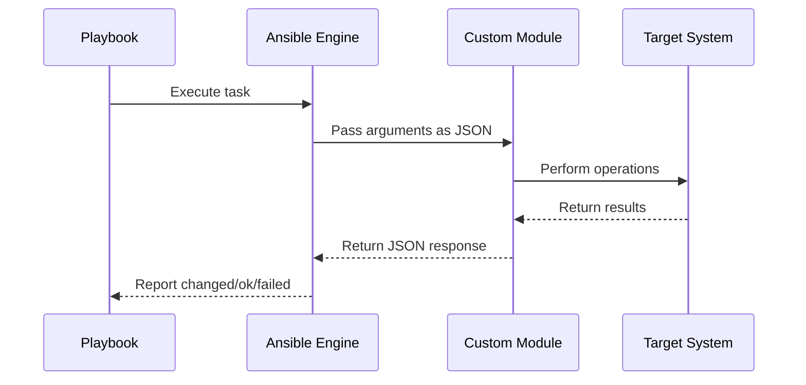

# How to Build Ansible Custom Modules

Author: [nawazdhandala](https://www.github.com/nawazdhandala)

Tags: Ansible, Automation, Python, DevOps, Infrastructure

Description: Create custom Ansible modules in Python for managing proprietary systems, APIs, and resources not covered by built-in modules.

---

Ansible ships with thousands of modules that cover most common infrastructure tasks. But what happens when you need to manage a proprietary system, interact with an internal API, or handle a resource that no existing module supports? That is where custom modules come in.

Building your own Ansible module is simpler than you might think. In this guide, we will walk through the process of creating a custom module from scratch, covering the essential patterns and best practices that will make your module production-ready.

## Understanding Ansible Module Architecture

Before diving into code, let us understand how Ansible modules work under the hood.



Ansible modules are standalone scripts that receive input as JSON, perform their work, and return results as JSON. They can be written in any language, but Python is the most common choice because Ansible provides a powerful helper library called `AnsibleModule`.

## Project Structure

A well-organized module follows this structure:

```
my_ansible_collection/
├── plugins/
│   └── modules/
│       └── my_custom_module.py
└── tests/
    └── unit/
        └── test_my_custom_module.py
```

For quick prototyping, you can also place modules in a `library/` directory next to your playbook.

## Building Your First Custom Module

Let us create a practical module that manages application configuration files. This module will create, update, or remove JSON configuration files with validation.

Here is the complete module implementation with inline comments explaining each section:

```python
#!/usr/bin/python
# -*- coding: utf-8 -*-

# Copyright: (c) 2026, Your Name <your.email@example.com>
# GNU General Public License v3.0+

from __future__ import absolute_import, division, print_function
__metaclass__ = type

# Documentation block that Ansible uses to generate help text
DOCUMENTATION = r'''
---
module: app_config
short_description: Manage JSON application configuration files
version_added: "1.0.0"
description:
    - Creates, updates, or removes JSON configuration files
    - Validates configuration against a schema before writing
    - Supports atomic writes to prevent corruption

options:
    path:
        description:
            - Path to the configuration file
        required: true
        type: str
    state:
        description:
            - Whether the config file should exist
        choices: ['present', 'absent']
        default: present
        type: str
    settings:
        description:
            - Dictionary of configuration settings to apply
        required: false
        type: dict
        default: {}
    backup:
        description:
            - Create a backup before modifying
        type: bool
        default: false

author:
    - Your Name (@yourgithub)
'''

EXAMPLES = r'''
# Create a new configuration file
- name: Create app configuration
  app_config:
    path: /etc/myapp/config.json
    state: present
    settings:
      database_host: localhost
      database_port: 5432
      debug_mode: false

# Remove a configuration file
- name: Remove old config
  app_config:
    path: /etc/myapp/old_config.json
    state: absent

# Update config with backup
- name: Update settings with backup
  app_config:
    path: /etc/myapp/config.json
    settings:
      log_level: debug
    backup: true
'''

RETURN = r'''
path:
    description: Path to the configuration file
    type: str
    returned: always
    sample: /etc/myapp/config.json
backup_file:
    description: Path to backup file if created
    type: str
    returned: when backup is enabled
    sample: /etc/myapp/config.json.2026-01-30@12:30:45
changed_keys:
    description: List of configuration keys that were modified
    type: list
    returned: when state is present
    sample: ['database_host', 'log_level']
'''

import json
import os
import shutil
from datetime import datetime

# Import the AnsibleModule helper class
from ansible.module_utils.basic import AnsibleModule


def load_existing_config(path):
    """Load existing configuration file or return empty dict."""
    if not os.path.exists(path):
        return {}

    try:
        with open(path, 'r') as f:
            return json.load(f)
    except json.JSONDecodeError:
        return {}


def create_backup(module, path):
    """Create a timestamped backup of the configuration file."""
    if not os.path.exists(path):
        return None

    timestamp = datetime.now().strftime('%Y-%m-%d@%H:%M:%S')
    backup_path = f"{path}.{timestamp}"

    try:
        shutil.copy2(path, backup_path)
        return backup_path
    except IOError as e:
        module.fail_json(msg=f"Failed to create backup: {str(e)}")


def write_config(module, path, config):
    """Write configuration to file atomically."""
    # Ensure parent directory exists
    parent_dir = os.path.dirname(path)
    if parent_dir and not os.path.exists(parent_dir):
        try:
            os.makedirs(parent_dir, mode=0o755)
        except OSError as e:
            module.fail_json(msg=f"Failed to create directory: {str(e)}")

    # Write to temp file first, then rename for atomic operation
    temp_path = f"{path}.tmp"
    try:
        with open(temp_path, 'w') as f:
            json.dump(config, f, indent=2, sort_keys=True)
            f.write('\n')  # Add trailing newline

        # Atomic rename
        os.rename(temp_path, path)
    except IOError as e:
        # Clean up temp file if it exists
        if os.path.exists(temp_path):
            os.remove(temp_path)
        module.fail_json(msg=f"Failed to write config: {str(e)}")


def run_module():
    """Main module execution logic."""
    # Define the argument specification
    module_args = dict(
        path=dict(type='str', required=True),
        state=dict(type='str', default='present', choices=['present', 'absent']),
        settings=dict(type='dict', default={}),
        backup=dict(type='bool', default=False),
    )

    # Initialize the AnsibleModule object
    module = AnsibleModule(
        argument_spec=module_args,
        supports_check_mode=True  # Enable dry-run support
    )

    # Extract parameters
    path = module.params['path']
    state = module.params['state']
    settings = module.params['settings']
    backup = module.params['backup']

    # Initialize result dictionary
    result = dict(
        changed=False,
        path=path,
    )

    # Handle absent state - remove the file
    if state == 'absent':
        if os.path.exists(path):
            result['changed'] = True
            if not module.check_mode:
                try:
                    os.remove(path)
                except OSError as e:
                    module.fail_json(msg=f"Failed to remove file: {str(e)}")

        module.exit_json(**result)

    # Handle present state - create or update config
    existing_config = load_existing_config(path)

    # Merge settings with existing config
    new_config = existing_config.copy()
    changed_keys = []

    for key, value in settings.items():
        if key not in existing_config or existing_config[key] != value:
            changed_keys.append(key)
            new_config[key] = value

    # Determine if changes are needed
    if changed_keys or not os.path.exists(path):
        result['changed'] = True
        result['changed_keys'] = changed_keys

        if not module.check_mode:
            # Create backup if requested
            if backup and os.path.exists(path):
                result['backup_file'] = create_backup(module, path)

            # Write the new configuration
            write_config(module, path, new_config)

    module.exit_json(**result)


def main():
    run_module()


if __name__ == '__main__':
    main()
```

## Key Concepts Explained

### The AnsibleModule Class

The `AnsibleModule` class handles argument parsing, validation, and output formatting. When you define `argument_spec`, Ansible automatically validates input types and required fields.

### Check Mode Support

By setting `supports_check_mode=True`, your module works with the `--check` flag. Always test `module.check_mode` before making actual changes.

### Idempotency

Good modules are idempotent. They only report `changed=True` when actual modifications occur. Our example compares existing values before writing.

### Error Handling

Use `module.fail_json(msg="error message")` for errors. This ensures proper JSON output and non-zero exit codes.

## Testing Your Module

Create a simple playbook to test the module:

```yaml
# test_playbook.yml
---
- name: Test custom module
  hosts: localhost
  gather_facts: false

  tasks:
    - name: Create test configuration
      app_config:
        path: /tmp/test_app_config.json
        state: present
        settings:
          server_name: production
          max_connections: 100
          features:
            - logging
            - metrics
      register: result

    - name: Display result
      debug:
        var: result

    - name: Verify idempotency
      app_config:
        path: /tmp/test_app_config.json
        settings:
          server_name: production
          max_connections: 100
      register: idempotent_result

    - name: Confirm no changes on second run
      assert:
        that:
          - not idempotent_result.changed
```

Run with verbose output to see module behavior:

```bash
# Place your module in the library directory
mkdir -p library
cp app_config.py library/

# Run the playbook
ansible-playbook test_playbook.yml -v
```

## Best Practices

When building production modules, keep these guidelines in mind:

**Always include documentation blocks.** The `DOCUMENTATION`, `EXAMPLES`, and `RETURN` sections are not optional. They help users understand your module and enable `ansible-doc` to display help.

**Support check mode.** Users expect `--check` to work. If your module cannot support it, set `supports_check_mode=False` explicitly.

**Return meaningful data.** Include relevant information in your return values. This allows users to register results and use them in subsequent tasks.

**Handle edge cases.** Consider what happens when files do not exist, permissions are wrong, or network calls fail. Graceful error messages save debugging time.

**Use module_utils for shared code.** If multiple modules share logic, place it in `module_utils/` and import it.

## Conclusion

Custom Ansible modules extend your automation capabilities beyond what built-in modules provide. By following the patterns shown here, you can create modules that integrate seamlessly with Ansible workflows.

Start simple with a basic module, get it working, then add features like check mode support and detailed return values. The Ansible community has excellent documentation and module development guidelines that cover advanced topics like module utilities, async operations, and Windows support.

Your infrastructure is unique. Your automation should be too.
