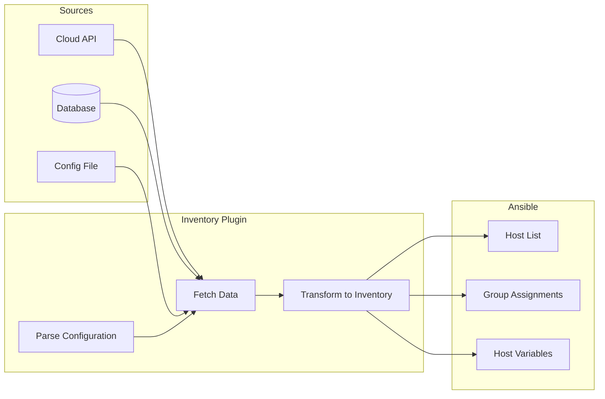
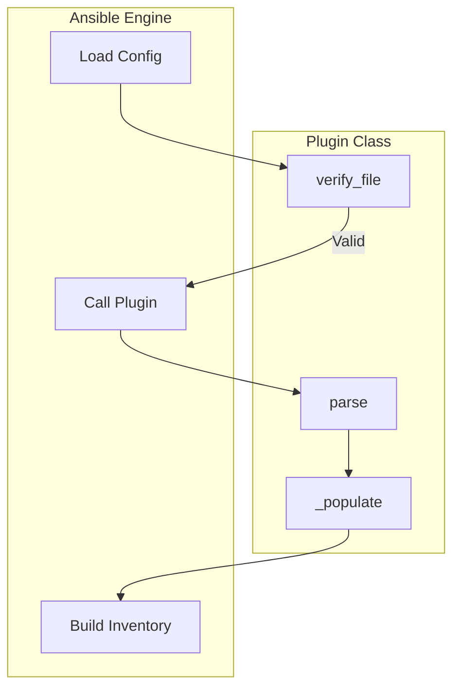
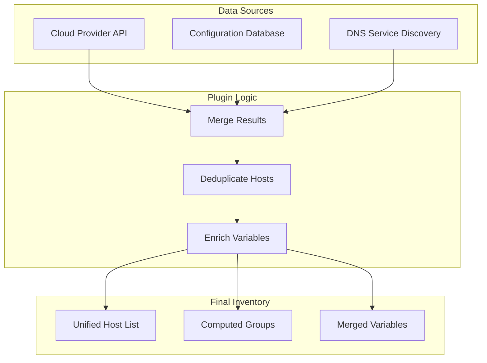
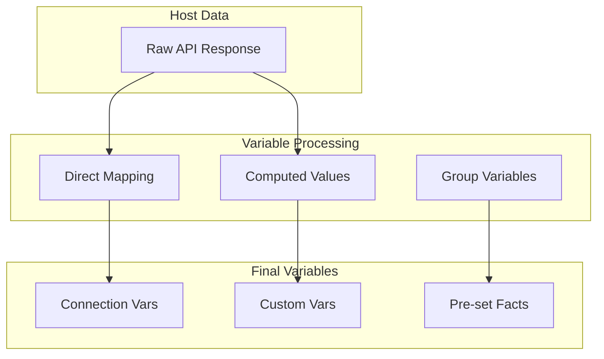

# How to Create Ansible Inventory Plugins

Author: [nawazdhandala](https://github.com/nawazdhandala)

Tags: Ansible, Inventory, Plugins, Dynamic

Description: Learn to build custom Ansible inventory plugins that dynamically discover hosts from any data source.

---

Static inventory files work fine for small environments. But when you manage hundreds of servers across cloud providers, container orchestrators, or internal CMDBs, you need dynamic inventory. Ansible inventory plugins let you pull host information from any data source in real time.

## How Inventory Plugins Work



When Ansible runs, it calls your inventory plugin with a configuration file. The plugin fetches data from external sources, transforms it into Ansible's inventory structure, and returns hosts, groups, and variables.

## Plugin Structure

Every inventory plugin follows the same basic structure:



| Method | Purpose |
|--------|---------|
| `verify_file()` | Check if the config file is valid for this plugin |
| `parse()` | Main entry point that fetches and processes data |
| `_populate()` | Helper to add hosts, groups, and variables |

## Creating Your First Inventory Plugin

Let's build a plugin that reads hosts from a JSON API. This example fetches server data from an internal service registry.

### Directory Setup

```bash
# Create the plugin directory structure
mkdir -p inventory_plugins
touch inventory_plugins/__init__.py
touch inventory_plugins/service_registry.py
```

### The Plugin Code

```python
# inventory_plugins/service_registry.py

from ansible.plugins.inventory import BaseInventoryPlugin, Constructable, Cacheable
from ansible.errors import AnsibleParserError
import json
import urllib.request
import urllib.error

DOCUMENTATION = r'''
    name: service_registry
    plugin_type: inventory
    short_description: Fetches inventory from a service registry API
    description:
        - This plugin fetches host information from an internal service registry.
        - Hosts are grouped by environment, role, and datacenter.
    options:
        plugin:
            description: Token that ensures this is a source file for the plugin.
            required: True
            choices: ['service_registry']
        api_url:
            description: URL of the service registry API.
            required: True
            env:
                - name: SERVICE_REGISTRY_URL
        api_token:
            description: Authentication token for the API.
            required: False
            env:
                - name: SERVICE_REGISTRY_TOKEN
        environment:
            description: Filter hosts by environment (prod, staging, dev).
            required: False
            default: all
'''

EXAMPLES = r'''
# service_registry.yml
plugin: service_registry
api_url: https://registry.internal.example.com/api/v1/hosts
api_token: "{{ lookup('env', 'REGISTRY_TOKEN') }}"
environment: prod
'''


class InventoryModule(BaseInventoryPlugin, Constructable, Cacheable):
    NAME = 'service_registry'

    def verify_file(self, path):
        """Verify that the config file is valid for this plugin."""
        valid = False
        if super(InventoryModule, self).verify_file(path):
            # Accept any file ending in service_registry.yml or .yaml
            if path.endswith(('service_registry.yml', 'service_registry.yaml')):
                valid = True
        return valid

    def parse(self, inventory, loader, path, cache=True):
        """Parse the inventory source and populate the inventory."""
        # Call parent parse method
        super(InventoryModule, self).parse(inventory, loader, path, cache)

        # Read and validate configuration
        self._read_config_data(path)

        # Get configuration options
        api_url = self.get_option('api_url')
        api_token = self.get_option('api_token')
        environment = self.get_option('environment')

        # Build cache key
        cache_key = self.get_cache_key(path)

        # Check cache
        user_cache_setting = self.get_option('cache')
        attempt_to_read_cache = user_cache_setting and cache
        cache_needs_update = user_cache_setting and not cache

        if attempt_to_read_cache:
            try:
                results = self._cache[cache_key]
            except KeyError:
                cache_needs_update = True

        if not attempt_to_read_cache or cache_needs_update:
            results = self._fetch_hosts(api_url, api_token, environment)

        if cache_needs_update:
            self._cache[cache_key] = results

        # Populate inventory with results
        self._populate(results)

    def _fetch_hosts(self, api_url, api_token, environment):
        """Fetch host data from the service registry API."""
        headers = {'Content-Type': 'application/json'}
        if api_token:
            headers['Authorization'] = f'Bearer {api_token}'

        # Add environment filter to URL if specified
        url = api_url
        if environment and environment != 'all':
            url = f'{api_url}?environment={environment}'

        try:
            request = urllib.request.Request(url, headers=headers)
            with urllib.request.urlopen(request, timeout=30) as response:
                data = json.loads(response.read().decode('utf-8'))
                return data.get('hosts', [])
        except urllib.error.URLError as e:
            raise AnsibleParserError(f'Failed to fetch from API: {e}')
        except json.JSONDecodeError as e:
            raise AnsibleParserError(f'Invalid JSON response: {e}')

    def _populate(self, hosts):
        """Populate the inventory with hosts, groups, and variables."""
        for host_data in hosts:
            hostname = host_data.get('hostname')
            if not hostname:
                continue

            # Add the host to inventory
            self.inventory.add_host(hostname)

            # Set host variables
            self._set_host_variables(hostname, host_data)

            # Add host to groups
            self._add_host_to_groups(hostname, host_data)

    def _set_host_variables(self, hostname, host_data):
        """Set variables on a host from the API response."""
        # Standard connection variables
        if host_data.get('ip_address'):
            self.inventory.set_variable(hostname, 'ansible_host', host_data['ip_address'])

        if host_data.get('ssh_port'):
            self.inventory.set_variable(hostname, 'ansible_port', host_data['ssh_port'])

        if host_data.get('ssh_user'):
            self.inventory.set_variable(hostname, 'ansible_user', host_data['ssh_user'])

        # Custom variables from metadata
        metadata = host_data.get('metadata', {})
        for key, value in metadata.items():
            self.inventory.set_variable(hostname, key, value)

        # Store all raw data as host_info variable
        self.inventory.set_variable(hostname, 'host_info', host_data)

    def _add_host_to_groups(self, hostname, host_data):
        """Add a host to appropriate groups based on its attributes."""
        # Group by environment
        environment = host_data.get('environment')
        if environment:
            group_name = f'env_{environment}'
            self.inventory.add_group(group_name)
            self.inventory.add_child(group_name, hostname)

        # Group by role
        role = host_data.get('role')
        if role:
            group_name = f'role_{role}'
            self.inventory.add_group(group_name)
            self.inventory.add_child(group_name, hostname)

        # Group by datacenter
        datacenter = host_data.get('datacenter')
        if datacenter:
            group_name = f'dc_{datacenter}'
            self.inventory.add_group(group_name)
            self.inventory.add_child(group_name, hostname)

        # Group by tags
        tags = host_data.get('tags', [])
        for tag in tags:
            group_name = f'tag_{tag}'
            self.inventory.add_group(group_name)
            self.inventory.add_child(group_name, hostname)
```

### Configuration File

Create the inventory source file that configures your plugin:

```yaml
# inventory/service_registry.yml
plugin: service_registry
api_url: https://registry.internal.example.com/api/v1/hosts
api_token: "{{ lookup('env', 'REGISTRY_TOKEN') }}"
environment: prod
cache: true
cache_plugin: jsonfile
cache_timeout: 3600
cache_connection: /tmp/ansible_inventory_cache
```

### Enabling the Plugin

Add the plugin path to your `ansible.cfg`:

```ini
[defaults]
inventory_plugins = ./inventory_plugins

[inventory]
enable_plugins = service_registry, host_list, yaml, ini
cache = True
cache_plugin = jsonfile
cache_timeout = 3600
cache_connection = /tmp/ansible_inventory_cache
```

## Dynamic Host Discovery Patterns

### Discovering Hosts from Multiple Sources



Here is a plugin that combines data from multiple sources:

```python
# inventory_plugins/multi_source.py

from ansible.plugins.inventory import BaseInventoryPlugin, Constructable
from ansible.errors import AnsibleParserError
import json
import urllib.request


class InventoryModule(BaseInventoryPlugin, Constructable):
    NAME = 'multi_source'

    def verify_file(self, path):
        valid = False
        if super(InventoryModule, self).verify_file(path):
            if path.endswith(('multi_source.yml', 'multi_source.yaml')):
                valid = True
        return valid

    def parse(self, inventory, loader, path, cache=True):
        super(InventoryModule, self).parse(inventory, loader, path, cache)
        self._read_config_data(path)

        sources = self.get_option('sources')
        all_hosts = {}

        # Fetch from each source
        for source in sources:
            source_type = source.get('type')
            hosts = self._fetch_from_source(source)

            # Merge hosts, with later sources taking precedence
            for hostname, data in hosts.items():
                if hostname in all_hosts:
                    all_hosts[hostname].update(data)
                    all_hosts[hostname]['sources'].append(source_type)
                else:
                    data['sources'] = [source_type]
                    all_hosts[hostname] = data

        # Populate inventory
        for hostname, data in all_hosts.items():
            self.inventory.add_host(hostname)

            for key, value in data.items():
                self.inventory.set_variable(hostname, key, value)

            # Add to groups based on attributes
            self._assign_groups(hostname, data)

    def _fetch_from_source(self, source):
        """Fetch hosts from a single source."""
        source_type = source.get('type')

        if source_type == 'api':
            return self._fetch_from_api(source)
        elif source_type == 'file':
            return self._fetch_from_file(source)
        elif source_type == 'consul':
            return self._fetch_from_consul(source)
        else:
            raise AnsibleParserError(f'Unknown source type: {source_type}')

    def _fetch_from_api(self, source):
        """Fetch hosts from an HTTP API."""
        url = source.get('url')
        headers = source.get('headers', {})

        request = urllib.request.Request(url)
        for key, value in headers.items():
            request.add_header(key, value)

        with urllib.request.urlopen(request, timeout=30) as response:
            data = json.loads(response.read().decode('utf-8'))

        hosts = {}
        for item in data:
            hostname = item.get('hostname') or item.get('name')
            if hostname:
                hosts[hostname] = item

        return hosts

    def _fetch_from_file(self, source):
        """Fetch hosts from a local JSON file."""
        filepath = source.get('path')

        with open(filepath, 'r') as f:
            data = json.load(f)

        hosts = {}
        for item in data:
            hostname = item.get('hostname') or item.get('name')
            if hostname:
                hosts[hostname] = item

        return hosts

    def _fetch_from_consul(self, source):
        """Fetch hosts from Consul service discovery."""
        consul_url = source.get('url', 'http://localhost:8500')
        service = source.get('service')

        url = f'{consul_url}/v1/catalog/service/{service}'

        with urllib.request.urlopen(url, timeout=30) as response:
            data = json.loads(response.read().decode('utf-8'))

        hosts = {}
        for node in data:
            hostname = node.get('Node')
            hosts[hostname] = {
                'ansible_host': node.get('Address'),
                'consul_service': service,
                'consul_tags': node.get('ServiceTags', []),
                'datacenter': node.get('Datacenter')
            }

        return hosts

    def _assign_groups(self, hostname, data):
        """Assign a host to groups based on its data."""
        # Group by each source that provided this host
        for source in data.get('sources', []):
            group = f'source_{source}'
            self.inventory.add_group(group)
            self.inventory.add_child(group, hostname)
```

## Generating Groups Dynamically

The `Constructable` mixin provides powerful group generation through the `compose`, `groups`, and `keyed_groups` features.

```python
# inventory_plugins/constructable_example.py

from ansible.plugins.inventory import BaseInventoryPlugin, Constructable
from ansible.errors import AnsibleParserError


DOCUMENTATION = r'''
    name: constructable_example
    plugin_type: inventory
    extends_documentation_fragment:
        - constructed
    options:
        plugin:
            required: True
            choices: ['constructable_example']
        data_file:
            description: Path to JSON data file
            required: True
'''


class InventoryModule(BaseInventoryPlugin, Constructable):
    NAME = 'constructable_example'

    def verify_file(self, path):
        valid = False
        if super(InventoryModule, self).verify_file(path):
            if path.endswith(('.yml', '.yaml')):
                valid = True
        return valid

    def parse(self, inventory, loader, path, cache=True):
        super(InventoryModule, self).parse(inventory, loader, path, cache)
        self._read_config_data(path)

        data_file = self.get_option('data_file')
        strict = self.get_option('strict')

        # Load host data
        import json
        with open(data_file, 'r') as f:
            hosts = json.load(f)

        for host_data in hosts:
            hostname = host_data.get('hostname')
            self.inventory.add_host(hostname)

            # Set all variables from the data
            for key, value in host_data.items():
                if key != 'hostname':
                    self.inventory.set_variable(hostname, key, value)

            # Use constructable features for dynamic groups
            # This reads compose, groups, and keyed_groups from config
            self._set_composite_vars(
                self.get_option('compose'),
                host_data,
                hostname,
                strict
            )
            self._add_host_to_composed_groups(
                self.get_option('groups'),
                host_data,
                hostname,
                strict
            )
            self._add_host_to_keyed_groups(
                self.get_option('keyed_groups'),
                host_data,
                hostname,
                strict
            )
```

Configure the constructable features in your inventory file:

```yaml
# inventory/constructable_example.yml
plugin: constructable_example
data_file: ./hosts.json

# Compose new variables from existing ones
compose:
  ansible_host: ip_address
  full_name: "hostname + '.' + domain"
  memory_gb: "memory_mb / 1024"

# Create groups based on conditions
groups:
  webservers: "'web' in role"
  databases: "'db' in role"
  production: "environment == 'prod'"
  high_memory: "memory_mb > 16000"
  needs_update: "os_version < '8.0'"

# Create groups from variable values
keyed_groups:
  - key: environment
    prefix: env
    separator: '_'
  - key: datacenter
    prefix: dc
  - key: os_family
    prefix: os
  - key: role
    prefix: role
```

## Variable Injection Strategies



### Setting Variables at Different Scopes

```python
def _populate_with_scoped_variables(self, hosts, group_vars):
    """Demonstrate variable scoping in inventory plugins."""

    # Create groups first
    for group_name in group_vars.keys():
        self.inventory.add_group(group_name)

        # Set group-level variables
        for var_name, var_value in group_vars[group_name].items():
            self.inventory.set_variable(group_name, var_name, var_value)

    for host_data in hosts:
        hostname = host_data.get('hostname')
        self.inventory.add_host(hostname)

        # Host variables override group variables
        # Set connection variables
        self.inventory.set_variable(hostname, 'ansible_host', host_data.get('ip'))
        self.inventory.set_variable(hostname, 'ansible_user', host_data.get('ssh_user', 'ansible'))

        # Set custom variables
        self.inventory.set_variable(hostname, 'server_id', host_data.get('id'))

        # Computed variables
        memory_gb = host_data.get('memory_mb', 0) / 1024
        self.inventory.set_variable(hostname, 'memory_gb', memory_gb)

        # Add to groups (host inherits group variables)
        role = host_data.get('role')
        if role:
            group_name = f'role_{role}'
            if group_name not in group_vars:
                self.inventory.add_group(group_name)
            self.inventory.add_child(group_name, hostname)
```

### Handling Sensitive Variables

```python
def _set_sensitive_variables(self, hostname, host_data, vault_client):
    """Fetch and set sensitive variables from a secrets manager."""

    # Get secrets path from host data
    secrets_path = host_data.get('secrets_path')
    if not secrets_path:
        return

    try:
        # Fetch secrets from vault
        secrets = vault_client.read(secrets_path)

        # Set sensitive connection variables
        if 'ssh_password' in secrets:
            self.inventory.set_variable(
                hostname,
                'ansible_password',
                secrets['ssh_password']
            )

        if 'become_password' in secrets:
            self.inventory.set_variable(
                hostname,
                'ansible_become_password',
                secrets['become_password']
            )

    except Exception as e:
        # Log warning but do not fail the entire inventory
        self.display.warning(f'Could not fetch secrets for {hostname}: {e}')
```

## Complete Example: Kubernetes Pod Inventory

Here is a full plugin that discovers pods from a Kubernetes cluster:

```python
# inventory_plugins/kubernetes_pods.py

from ansible.plugins.inventory import BaseInventoryPlugin, Constructable, Cacheable
from ansible.errors import AnsibleParserError
import json
import urllib.request
import ssl


DOCUMENTATION = r'''
    name: kubernetes_pods
    plugin_type: inventory
    short_description: Kubernetes pod inventory source
    description:
        - Fetches running pods from a Kubernetes cluster.
        - Groups pods by namespace, labels, and node.
    extends_documentation_fragment:
        - constructed
    options:
        plugin:
            required: True
            choices: ['kubernetes_pods']
        api_server:
            description: Kubernetes API server URL
            required: True
            env:
                - name: K8S_API_SERVER
        token:
            description: Bearer token for authentication
            required: True
            env:
                - name: K8S_TOKEN
        namespace:
            description: Namespace to query (empty for all namespaces)
            required: False
            default: ''
        label_selector:
            description: Label selector to filter pods
            required: False
            default: ''
        verify_ssl:
            description: Verify SSL certificates
            required: False
            default: True
'''


class InventoryModule(BaseInventoryPlugin, Constructable, Cacheable):
    NAME = 'kubernetes_pods'

    def verify_file(self, path):
        valid = False
        if super(InventoryModule, self).verify_file(path):
            if path.endswith(('kubernetes_pods.yml', 'kubernetes_pods.yaml', 'k8s.yml')):
                valid = True
        return valid

    def parse(self, inventory, loader, path, cache=True):
        super(InventoryModule, self).parse(inventory, loader, path, cache)
        self._read_config_data(path)

        api_server = self.get_option('api_server')
        token = self.get_option('token')
        namespace = self.get_option('namespace')
        label_selector = self.get_option('label_selector')
        verify_ssl = self.get_option('verify_ssl')
        strict = self.get_option('strict')

        # Fetch pods from Kubernetes
        pods = self._fetch_pods(api_server, token, namespace, label_selector, verify_ssl)

        # Populate inventory
        for pod in pods:
            self._add_pod(pod, strict)

    def _fetch_pods(self, api_server, token, namespace, label_selector, verify_ssl):
        """Fetch pods from the Kubernetes API."""
        if namespace:
            url = f'{api_server}/api/v1/namespaces/{namespace}/pods'
        else:
            url = f'{api_server}/api/v1/pods'

        if label_selector:
            url = f'{url}?labelSelector={label_selector}'

        headers = {
            'Authorization': f'Bearer {token}',
            'Accept': 'application/json'
        }

        request = urllib.request.Request(url, headers=headers)

        context = None
        if not verify_ssl:
            context = ssl.create_default_context()
            context.check_hostname = False
            context.verify_mode = ssl.CERT_NONE

        try:
            with urllib.request.urlopen(request, context=context, timeout=30) as response:
                data = json.loads(response.read().decode('utf-8'))
                return data.get('items', [])
        except urllib.error.URLError as e:
            raise AnsibleParserError(f'Failed to fetch pods: {e}')

    def _add_pod(self, pod, strict):
        """Add a pod to the inventory."""
        metadata = pod.get('metadata', {})
        spec = pod.get('spec', {})
        status = pod.get('status', {})

        pod_name = metadata.get('name')
        namespace = metadata.get('namespace')

        # Skip pods that are not running
        phase = status.get('phase')
        if phase != 'Running':
            return

        # Use namespace/pod_name as hostname
        hostname = f'{namespace}_{pod_name}'
        self.inventory.add_host(hostname)

        # Set connection variables for kubectl exec
        self.inventory.set_variable(hostname, 'ansible_connection', 'kubectl')
        self.inventory.set_variable(hostname, 'ansible_kubectl_pod', pod_name)
        self.inventory.set_variable(hostname, 'ansible_kubectl_namespace', namespace)

        # Get first container name
        containers = spec.get('containers', [])
        if containers:
            self.inventory.set_variable(
                hostname,
                'ansible_kubectl_container',
                containers[0].get('name')
            )

        # Set pod metadata as variables
        self.inventory.set_variable(hostname, 'pod_name', pod_name)
        self.inventory.set_variable(hostname, 'pod_namespace', namespace)
        self.inventory.set_variable(hostname, 'pod_node', spec.get('nodeName'))
        self.inventory.set_variable(hostname, 'pod_ip', status.get('podIP'))
        self.inventory.set_variable(hostname, 'pod_labels', metadata.get('labels', {}))
        self.inventory.set_variable(hostname, 'pod_annotations', metadata.get('annotations', {}))

        # Group by namespace
        ns_group = f'namespace_{namespace}'
        self.inventory.add_group(ns_group)
        self.inventory.add_child(ns_group, hostname)

        # Group by node
        node_name = spec.get('nodeName')
        if node_name:
            node_group = f'node_{node_name.replace(".", "_")}'
            self.inventory.add_group(node_group)
            self.inventory.add_child(node_group, hostname)

        # Group by labels
        labels = metadata.get('labels', {})
        for label_key, label_value in labels.items():
            # Sanitize label key and value for group name
            safe_key = label_key.replace('/', '_').replace('.', '_')
            safe_value = label_value.replace('/', '_').replace('.', '_')
            group_name = f'label_{safe_key}_{safe_value}'
            self.inventory.add_group(group_name)
            self.inventory.add_child(group_name, hostname)

        # Use constructable features
        host_vars = {
            'pod_name': pod_name,
            'pod_namespace': namespace,
            'pod_node': node_name,
            'pod_labels': labels
        }

        self._set_composite_vars(self.get_option('compose'), host_vars, hostname, strict)
        self._add_host_to_composed_groups(self.get_option('groups'), host_vars, hostname, strict)
        self._add_host_to_keyed_groups(self.get_option('keyed_groups'), host_vars, hostname, strict)
```

Configuration for the Kubernetes plugin:

```yaml
# inventory/kubernetes_pods.yml
plugin: kubernetes_pods
api_server: https://kubernetes.default.svc
token: "{{ lookup('file', '/var/run/secrets/kubernetes.io/serviceaccount/token') }}"
namespace: ''  # All namespaces
label_selector: 'app.kubernetes.io/managed-by=ansible'
verify_ssl: true

compose:
  ansible_python_interpreter: /usr/bin/python3

groups:
  frontend: "'frontend' in pod_labels.get('app', '')"
  backend: "'backend' in pod_labels.get('app', '')"

keyed_groups:
  - key: pod_labels.get('app.kubernetes.io/name', 'unknown')
    prefix: app
  - key: pod_labels.get('environment', 'unknown')
    prefix: env
```

## Testing Your Plugin

Create a test script to verify your plugin works correctly:

```python
#!/usr/bin/env python3
# test_plugin.py

import os
import sys
import json

# Add the inventory_plugins directory to path
sys.path.insert(0, './inventory_plugins')

from service_registry import InventoryModule

class MockInventory:
    def __init__(self):
        self.hosts = {}
        self.groups = {}
        self.host_vars = {}
        self.group_vars = {}

    def add_host(self, hostname):
        self.hosts[hostname] = True
        self.host_vars[hostname] = {}

    def add_group(self, group):
        if group not in self.groups:
            self.groups[group] = []

    def add_child(self, group, host):
        if group not in self.groups:
            self.groups[group] = []
        self.groups[group].append(host)

    def set_variable(self, host_or_group, key, value):
        if host_or_group in self.hosts:
            self.host_vars[host_or_group][key] = value
        else:
            if host_or_group not in self.group_vars:
                self.group_vars[host_or_group] = {}
            self.group_vars[host_or_group][key] = value


def test_plugin():
    plugin = InventoryModule()
    inventory = MockInventory()

    # Test verify_file
    assert plugin.verify_file('test_service_registry.yml') == True
    assert plugin.verify_file('test.yml') == False

    # Mock the fetch method for testing
    mock_hosts = [
        {
            'hostname': 'web-01.example.com',
            'ip_address': '10.0.1.10',
            'environment': 'prod',
            'role': 'webserver',
            'datacenter': 'us-east-1',
            'tags': ['critical', 'public'],
            'metadata': {'cpu_count': 4, 'memory_mb': 8192}
        },
        {
            'hostname': 'db-01.example.com',
            'ip_address': '10.0.2.20',
            'environment': 'prod',
            'role': 'database',
            'datacenter': 'us-east-1',
            'tags': ['critical'],
            'metadata': {'cpu_count': 8, 'memory_mb': 32768}
        }
    ]

    plugin.inventory = inventory
    plugin._populate(mock_hosts)

    # Verify hosts were added
    assert 'web-01.example.com' in inventory.hosts
    assert 'db-01.example.com' in inventory.hosts

    # Verify groups were created
    assert 'env_prod' in inventory.groups
    assert 'role_webserver' in inventory.groups
    assert 'role_database' in inventory.groups
    assert 'dc_us-east-1' in inventory.groups
    assert 'tag_critical' in inventory.groups

    # Verify variables were set
    assert inventory.host_vars['web-01.example.com']['ansible_host'] == '10.0.1.10'
    assert inventory.host_vars['db-01.example.com']['host_info']['memory_mb'] == 32768

    print('All tests passed!')

    # Print inventory structure
    print('\nGenerated Inventory:')
    print(json.dumps({
        'hosts': list(inventory.hosts.keys()),
        'groups': inventory.groups,
        'host_vars': inventory.host_vars
    }, indent=2))


if __name__ == '__main__':
    test_plugin()
```

Run the test:

```bash
python3 test_plugin.py
```

## Running the Inventory

Test your inventory plugin with Ansible:

```bash
# List all hosts
ansible-inventory -i inventory/service_registry.yml --list

# Show a graph of groups
ansible-inventory -i inventory/service_registry.yml --graph

# Test connectivity
ansible -i inventory/service_registry.yml all -m ping

# Run a playbook
ansible-playbook -i inventory/service_registry.yml site.yml
```

## Troubleshooting

Enable verbose output to debug inventory issues:

```bash
# Maximum verbosity
ansible-inventory -i inventory/service_registry.yml --list -vvvv

# Check for Python errors
ANSIBLE_DEBUG=1 ansible-inventory -i inventory/service_registry.yml --list
```

Common issues:

| Problem | Solution |
|---------|----------|
| Plugin not found | Check `inventory_plugins` path in ansible.cfg |
| Plugin not enabled | Add plugin name to `enable_plugins` list |
| Config file not recognized | Check `verify_file()` returns True for your filename |
| API connection fails | Verify URL and authentication token |
| Variables not set | Ensure `_read_config_data()` is called before `get_option()` |

---

Inventory plugins let you integrate Ansible with any data source. Start with the basic structure, add data fetching logic, and use the constructable mixin for flexible group generation. Test your plugin locally before deploying it to production automation workflows.
