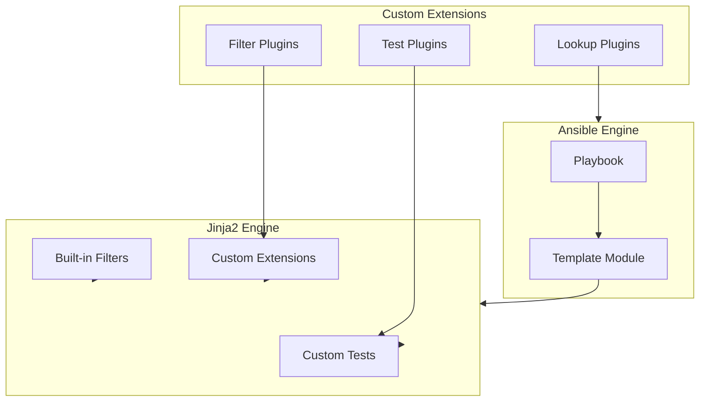
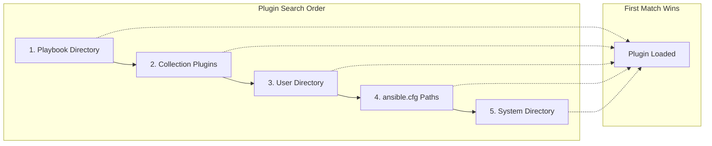
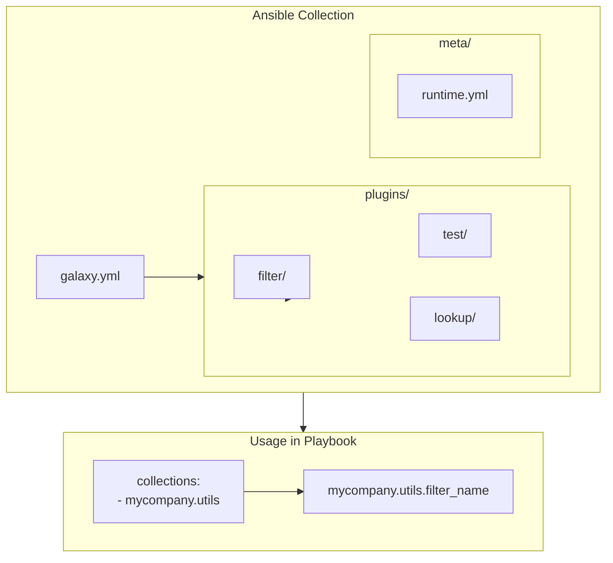
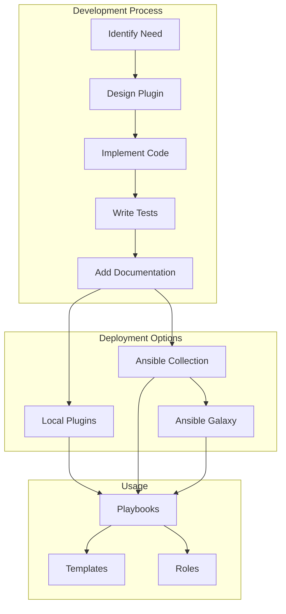

# How to Create Ansible Custom Jinja2 Extensions

Author: [nawazdhandala](https://github.com/nawazdhandala)

Tags: Ansible, Jinja2, Templates, Automation

Description: A comprehensive guide to creating custom Jinja2 extensions for Ansible, including filters, tests, and plugins that extend template functionality beyond built-in capabilities.

---

Ansible's templating engine, Jinja2, is powerful out of the box. However, complex automation workflows often require custom logic that built-in filters and tests cannot provide. This guide shows you how to create custom Jinja2 extensions that integrate seamlessly with Ansible.

## Why Create Custom Jinja2 Extensions?

While Ansible provides many built-in filters like `to_json`, `regex_replace`, and `default`, you may need custom functionality for:

- Domain-specific data transformations
- Complex string manipulations
- Custom validation logic
- Integration with external systems or APIs
- Reusable business logic across playbooks



## Understanding Ansible Plugin Architecture

Before creating custom extensions, you need to understand where Ansible looks for plugins.

### Plugin Search Paths

Ansible searches for plugins in these locations (in order of precedence):

1. `./filter_plugins/` - Adjacent to playbook
2. `~/.ansible/plugins/filter/` - User directory
3. `/usr/share/ansible/plugins/filter/` - System-wide
4. Configured paths in `ansible.cfg`



### Directory Structure

A well-organized project with custom plugins looks like this:

```
ansible-project/
├── ansible.cfg
├── inventory/
│   └── hosts.yml
├── playbooks/
│   └── deploy.yml
├── filter_plugins/
│   ├── __init__.py
│   └── custom_filters.py
├── test_plugins/
│   ├── __init__.py
│   └── custom_tests.py
└── templates/
    └── config.j2
```

## Creating Custom Filter Plugins

Filter plugins transform data within Jinja2 templates. Let's start with a basic example.

### Basic Filter Plugin

Create a file at `filter_plugins/custom_filters.py`:

```python
#!/usr/bin/env python3
"""Custom Ansible filter plugins for data transformation."""

from __future__ import absolute_import, division, print_function
__metaclass__ = type

import re
import hashlib
from typing import Any, Dict, List, Optional


class FilterModule:
    """Custom filters for Ansible."""

    def filters(self) -> Dict[str, callable]:
        """Return a dictionary mapping filter names to functions."""
        return {
            'normalize_hostname': self.normalize_hostname,
            'mask_sensitive': self.mask_sensitive,
            'to_environment': self.to_environment,
            'extract_version': self.extract_version,
        }

    def normalize_hostname(self, hostname: str) -> str:
        """
        Normalize a hostname to lowercase with only alphanumeric and hyphens.

        Example:
            {{ 'My_Server.01' | normalize_hostname }}
            Result: my-server-01
        """
        # Convert to lowercase
        normalized = hostname.lower()
        # Replace underscores and dots with hyphens
        normalized = re.sub(r'[_.]', '-', normalized)
        # Remove any characters that are not alphanumeric or hyphens
        normalized = re.sub(r'[^a-z0-9-]', '', normalized)
        # Remove consecutive hyphens
        normalized = re.sub(r'-+', '-', normalized)
        # Remove leading and trailing hyphens
        normalized = normalized.strip('-')
        return normalized

    def mask_sensitive(
        self,
        value: str,
        visible_chars: int = 4,
        mask_char: str = '*'
    ) -> str:
        """
        Mask sensitive data, showing only the last few characters.

        Example:
            {{ api_key | mask_sensitive(4) }}
            Result: ************abcd
        """
        if not value or len(value) <= visible_chars:
            return mask_char * 8

        masked_length = len(value) - visible_chars
        return (mask_char * masked_length) + value[-visible_chars:]

    def to_environment(self, data: Dict[str, Any], prefix: str = '') -> str:
        """
        Convert a dictionary to environment variable format.

        Example:
            {{ {'db_host': 'localhost', 'db_port': 5432} | to_environment('APP') }}
            Result:
              APP_DB_HOST=localhost
              APP_DB_PORT=5432
        """
        lines = []
        for key, value in sorted(data.items()):
            env_key = key.upper().replace('-', '_')
            if prefix:
                env_key = f"{prefix}_{env_key}"

            # Handle different value types
            if isinstance(value, bool):
                env_value = 'true' if value else 'false'
            elif isinstance(value, (list, dict)):
                import json
                env_value = json.dumps(value)
            else:
                env_value = str(value)

            lines.append(f"{env_key}={env_value}")

        return '\n'.join(lines)

    def extract_version(self, version_string: str) -> Dict[str, int]:
        """
        Extract semantic version components from a version string.

        Example:
            {{ 'v1.2.3-beta' | extract_version }}
            Result: {'major': 1, 'minor': 2, 'patch': 3}
        """
        # Remove common prefixes
        cleaned = re.sub(r'^[vV]', '', version_string)
        # Extract version numbers
        match = re.match(r'(\d+)\.(\d+)\.(\d+)', cleaned)

        if match:
            return {
                'major': int(match.group(1)),
                'minor': int(match.group(2)),
                'patch': int(match.group(3))
            }

        return {'major': 0, 'minor': 0, 'patch': 0}
```

### Using Custom Filters in Playbooks

```yaml
---
- name: Demonstrate custom filters
  hosts: all
  vars:
    server_name: "Production_Server.01"
    api_key: "sk-1234567890abcdef"
    app_config:
      db_host: "postgres.example.com"
      db_port: 5432
      debug_mode: false
    app_version: "v2.1.0-rc1"

  tasks:
    - name: Display normalized hostname
      ansible.builtin.debug:
        msg: "Normalized: {{ server_name | normalize_hostname }}"
      # Output: Normalized: production-server-01

    - name: Display masked API key
      ansible.builtin.debug:
        msg: "API Key: {{ api_key | mask_sensitive(4) }}"
      # Output: API Key: **************cdef

    - name: Generate environment variables
      ansible.builtin.debug:
        msg: |
          {{ app_config | to_environment('MYAPP') }}
      # Output:
      #   MYAPP_DB_HOST=postgres.example.com
      #   MYAPP_DB_PORT=5432
      #   MYAPP_DEBUG_MODE=false

    - name: Extract version components
      ansible.builtin.debug:
        msg: "Major version: {{ (app_version | extract_version).major }}"
      # Output: Major version: 2
```

## Creating Advanced Filter Plugins

Let's create more sophisticated filters for real-world scenarios.

### Network and Infrastructure Filters

```python
#!/usr/bin/env python3
"""Network-related Ansible filter plugins."""

from __future__ import absolute_import, division, print_function
__metaclass__ = type

import ipaddress
import socket
from typing import Any, Dict, List, Optional, Union


class FilterModule:
    """Network filters for infrastructure automation."""

    def filters(self) -> Dict[str, callable]:
        return {
            'cidr_to_netmask': self.cidr_to_netmask,
            'ip_in_network': self.ip_in_network,
            'next_ip': self.next_ip,
            'network_hosts': self.network_hosts,
            'split_cidr': self.split_cidr,
        }

    def cidr_to_netmask(self, cidr: str) -> str:
        """
        Convert CIDR notation to subnet mask.

        Example:
            {{ '192.168.1.0/24' | cidr_to_netmask }}
            Result: 255.255.255.0
        """
        try:
            network = ipaddress.ip_network(cidr, strict=False)
            return str(network.netmask)
        except ValueError as e:
            raise ValueError(f"Invalid CIDR notation: {cidr}") from e

    def ip_in_network(self, ip: str, network: str) -> bool:
        """
        Check if an IP address is within a network range.

        Example:
            {{ '192.168.1.50' | ip_in_network('192.168.1.0/24') }}
            Result: True
        """
        try:
            ip_obj = ipaddress.ip_address(ip)
            network_obj = ipaddress.ip_network(network, strict=False)
            return ip_obj in network_obj
        except ValueError:
            return False

    def next_ip(self, ip: str, offset: int = 1) -> str:
        """
        Get the next IP address with optional offset.

        Example:
            {{ '192.168.1.10' | next_ip(5) }}
            Result: 192.168.1.15
        """
        try:
            ip_obj = ipaddress.ip_address(ip)
            return str(ip_obj + offset)
        except ValueError as e:
            raise ValueError(f"Invalid IP address: {ip}") from e

    def network_hosts(
        self,
        cidr: str,
        count: Optional[int] = None,
        offset: int = 0
    ) -> List[str]:
        """
        Get a list of host IPs from a network CIDR.

        Example:
            {{ '192.168.1.0/30' | network_hosts }}
            Result: ['192.168.1.1', '192.168.1.2']
        """
        try:
            network = ipaddress.ip_network(cidr, strict=False)
            hosts = list(network.hosts())

            # Apply offset
            if offset > 0:
                hosts = hosts[offset:]

            # Limit count if specified
            if count is not None:
                hosts = hosts[:count]

            return [str(ip) for ip in hosts]
        except ValueError as e:
            raise ValueError(f"Invalid CIDR notation: {cidr}") from e

    def split_cidr(self, cidr: str) -> Dict[str, str]:
        """
        Split a CIDR into its components.

        Example:
            {{ '10.0.0.0/16' | split_cidr }}
            Result: {
                'network': '10.0.0.0',
                'prefix': '16',
                'netmask': '255.255.0.0',
                'broadcast': '10.0.255.255',
                'first_host': '10.0.0.1',
                'last_host': '10.0.255.254',
                'num_hosts': 65534
            }
        """
        try:
            network = ipaddress.ip_network(cidr, strict=False)
            hosts = list(network.hosts())

            return {
                'network': str(network.network_address),
                'prefix': str(network.prefixlen),
                'netmask': str(network.netmask),
                'broadcast': str(network.broadcast_address),
                'first_host': str(hosts[0]) if hosts else str(network.network_address),
                'last_host': str(hosts[-1]) if hosts else str(network.broadcast_address),
                'num_hosts': len(hosts)
            }
        except ValueError as e:
            raise ValueError(f"Invalid CIDR notation: {cidr}") from e
```

### Data Transformation Filters

```python
#!/usr/bin/env python3
"""Data transformation Ansible filter plugins."""

from __future__ import absolute_import, division, print_function
__metaclass__ = type

import json
import yaml
import base64
import hashlib
from typing import Any, Dict, List, Optional


class FilterModule:
    """Data transformation filters."""

    def filters(self) -> Dict[str, callable]:
        return {
            'deep_merge': self.deep_merge,
            'flatten_dict': self.flatten_dict,
            'unflatten_dict': self.unflatten_dict,
            'to_ini': self.to_ini,
            'hash_dict': self.hash_dict,
        }

    def deep_merge(
        self,
        base: Dict[str, Any],
        override: Dict[str, Any]
    ) -> Dict[str, Any]:
        """
        Deep merge two dictionaries, with override taking precedence.

        Example:
            {{ base_config | deep_merge(env_config) }}
        """
        result = base.copy()

        for key, value in override.items():
            if (
                key in result
                and isinstance(result[key], dict)
                and isinstance(value, dict)
            ):
                result[key] = self.deep_merge(result[key], value)
            else:
                result[key] = value

        return result

    def flatten_dict(
        self,
        data: Dict[str, Any],
        separator: str = '_',
        parent_key: str = ''
    ) -> Dict[str, Any]:
        """
        Flatten a nested dictionary into a single level.

        Example:
            {{ nested_config | flatten_dict('.') }}
            Input: {'database': {'host': 'localhost', 'port': 5432}}
            Result: {'database.host': 'localhost', 'database.port': 5432}
        """
        items = []

        for key, value in data.items():
            new_key = f"{parent_key}{separator}{key}" if parent_key else key

            if isinstance(value, dict):
                items.extend(
                    self.flatten_dict(value, separator, new_key).items()
                )
            else:
                items.append((new_key, value))

        return dict(items)

    def unflatten_dict(
        self,
        data: Dict[str, Any],
        separator: str = '_'
    ) -> Dict[str, Any]:
        """
        Unflatten a flat dictionary into nested structure.

        Example:
            {{ flat_config | unflatten_dict('.') }}
            Input: {'database.host': 'localhost', 'database.port': 5432}
            Result: {'database': {'host': 'localhost', 'port': 5432}}
        """
        result = {}

        for key, value in data.items():
            parts = key.split(separator)
            current = result

            for part in parts[:-1]:
                if part not in current:
                    current[part] = {}
                current = current[part]

            current[parts[-1]] = value

        return result

    def to_ini(
        self,
        data: Dict[str, Any],
        section: Optional[str] = None
    ) -> str:
        """
        Convert a dictionary to INI file format.

        Example:
            {{ config | to_ini('settings') }}
        """
        lines = []

        if section:
            lines.append(f"[{section}]")

        for key, value in sorted(data.items()):
            if isinstance(value, dict):
                # Handle nested dict as a new section
                lines.append(f"\n[{key}]")
                for sub_key, sub_value in sorted(value.items()):
                    lines.append(f"{sub_key} = {sub_value}")
            elif isinstance(value, bool):
                lines.append(f"{key} = {'true' if value else 'false'}")
            elif isinstance(value, list):
                lines.append(f"{key} = {','.join(str(v) for v in value)}")
            else:
                lines.append(f"{key} = {value}")

        return '\n'.join(lines)

    def hash_dict(
        self,
        data: Dict[str, Any],
        algorithm: str = 'sha256'
    ) -> str:
        """
        Generate a hash of a dictionary for change detection.

        Example:
            {{ config | hash_dict('md5') }}
        """
        # Sort and serialize for consistent hashing
        serialized = json.dumps(data, sort_keys=True)

        if algorithm == 'md5':
            return hashlib.md5(serialized.encode()).hexdigest()
        elif algorithm == 'sha1':
            return hashlib.sha1(serialized.encode()).hexdigest()
        elif algorithm == 'sha256':
            return hashlib.sha256(serialized.encode()).hexdigest()
        else:
            raise ValueError(f"Unsupported hash algorithm: {algorithm}")
```

## Creating Custom Test Plugins

Test plugins allow custom boolean checks in Jinja2 conditionals.

### Test Plugin Structure

Create `test_plugins/custom_tests.py`:

```python
#!/usr/bin/env python3
"""Custom Ansible test plugins for validation."""

from __future__ import absolute_import, division, print_function
__metaclass__ = type

import re
import ipaddress
from typing import Any, Dict, List, Optional


class TestModule:
    """Custom tests for Ansible."""

    def tests(self) -> Dict[str, callable]:
        """Return a dictionary mapping test names to functions."""
        return {
            'valid_hostname': self.is_valid_hostname,
            'valid_email': self.is_valid_email,
            'valid_cidr': self.is_valid_cidr,
            'valid_semver': self.is_valid_semver,
            'production_host': self.is_production_host,
            'contains_secrets': self.contains_secrets,
        }

    def is_valid_hostname(self, hostname: str) -> bool:
        """
        Test if a string is a valid hostname.

        Example:
            
        """
        if not hostname or len(hostname) > 253:
            return False

        # Remove trailing dot if present
        if hostname.endswith('.'):
            hostname = hostname[:-1]

        # Check each label
        labels = hostname.split('.')

        # RFC 1123 pattern for hostname labels
        pattern = re.compile(r'^[a-zA-Z0-9]([a-zA-Z0-9-]*[a-zA-Z0-9])?$')

        return all(
            label and len(label) <= 63 and pattern.match(label)
            for label in labels
        )

    def is_valid_email(self, email: str) -> bool:
        """
        Test if a string is a valid email address.

        Example:
            
        """
        pattern = re.compile(
            r'^[a-zA-Z0-9._%+-]+@[a-zA-Z0-9.-]+\.[a-zA-Z]{2,}$'
        )
        return bool(pattern.match(email))

    def is_valid_cidr(self, cidr: str) -> bool:
        """
        Test if a string is valid CIDR notation.

        Example:
            
        """
        try:
            ipaddress.ip_network(cidr, strict=False)
            return True
        except ValueError:
            return False

    def is_valid_semver(self, version: str) -> bool:
        """
        Test if a string is valid semantic versioning.

        Example:
            
        """
        # Remove optional 'v' prefix
        if version.startswith('v') or version.startswith('V'):
            version = version[1:]

        pattern = re.compile(
            r'^(0|[1-9]\d*)\.(0|[1-9]\d*)\.(0|[1-9]\d*)'
            r'(?:-((?:0|[1-9]\d*|\d*[a-zA-Z-][0-9a-zA-Z-]*)'
            r'(?:\.(?:0|[1-9]\d*|\d*[a-zA-Z-][0-9a-zA-Z-]*))*))?'
            r'(?:\+([0-9a-zA-Z-]+(?:\.[0-9a-zA-Z-]+)*))?$'
        )
        return bool(pattern.match(version))

    def is_production_host(self, hostname: str) -> bool:
        """
        Test if a hostname indicates a production environment.

        Example:
            
        """
        production_indicators = ['prod', 'prd', 'production', 'live']
        hostname_lower = hostname.lower()

        return any(
            indicator in hostname_lower
            for indicator in production_indicators
        )

    def contains_secrets(self, data: Any) -> bool:
        """
        Test if data appears to contain secret values.

        Example:
            
        """
        secret_patterns = [
            r'password',
            r'secret',
            r'api[_-]?key',
            r'token',
            r'credential',
            r'private[_-]?key',
        ]

        def check_value(value: Any) -> bool:
            if isinstance(value, str):
                for pattern in secret_patterns:
                    if re.search(pattern, value, re.IGNORECASE):
                        return True
            elif isinstance(value, dict):
                for k, v in value.items():
                    # Check both keys and values
                    if check_value(k) or check_value(v):
                        return True
            elif isinstance(value, list):
                return any(check_value(item) for item in value)
            return False

        return check_value(data)
```

### Using Custom Tests in Playbooks

```yaml
---
- name: Demonstrate custom tests
  hosts: all
  vars:
    server_hostname: "web-prod-01.example.com"
    admin_email: "admin@example.com"
    network_cidr: "10.0.0.0/24"
    app_version: "v2.1.0"
    invalid_version: "not-a-version"

  tasks:
    - name: Validate hostname
      ansible.builtin.debug:
        msg: "{{ server_hostname }} is a valid hostname"
      when: server_hostname is valid_hostname

    - name: Check production environment
      ansible.builtin.debug:
        msg: "Running on production host!"
      when: inventory_hostname is production_host

    - name: Validate network configuration
      ansible.builtin.fail:
        msg: "Invalid CIDR notation: {{ network_cidr }}"
      when: network_cidr is not valid_cidr

    - name: Version validation
      ansible.builtin.debug:
        msg: >
          Version {{ app_version }} is
          {{ 'valid' if app_version is valid_semver else 'invalid' }}

    - name: Email validation
      ansible.builtin.assert:
        that:
          - admin_email is valid_email
        fail_msg: "Invalid email address provided"
        success_msg: "Email validation passed"
```

## Creating Lookup Plugins with Jinja2 Integration

Lookup plugins fetch data from external sources and can be used in templates.

### Custom Lookup Plugin

Create `lookup_plugins/config_store.py`:

```python
#!/usr/bin/env python3
"""Custom lookup plugin for configuration management."""

from __future__ import absolute_import, division, print_function
__metaclass__ = type

DOCUMENTATION = r'''
---
name: config_store
author: Your Name
short_description: Retrieve values from a config store
description:
    - This lookup retrieves configuration values from a local JSON/YAML store.
    - Supports nested key access using dot notation.
options:
    key:
        description: The configuration key to look up.
        required: True
    default:
        description: Default value if key is not found.
        required: False
    store_path:
        description: Path to the configuration store file.
        required: False
        default: './config_store.yml'
'''

EXAMPLES = r'''
- name: Get database host
  debug:
    msg: "{{ lookup('config_store', 'database.host') }}"

- name: Get with default
  debug:
    msg: "{{ lookup('config_store', 'missing.key', default='fallback') }}"
'''

import os
import json
import yaml
from typing import Any, Dict, List, Optional

from ansible.errors import AnsibleError
from ansible.plugins.lookup import LookupBase
from ansible.utils.display import Display

display = Display()


class LookupModule(LookupBase):
    """Lookup plugin for configuration store."""

    def run(
        self,
        terms: List[str],
        variables: Optional[Dict] = None,
        **kwargs
    ) -> List[Any]:
        """
        Run the lookup.

        Args:
            terms: List of keys to look up
            variables: Ansible variables
            **kwargs: Additional arguments (default, store_path)

        Returns:
            List of values for each term
        """
        default = kwargs.get('default', None)
        store_path = kwargs.get('store_path', './config_store.yml')

        # Load configuration store
        config = self._load_config_store(store_path)

        results = []
        for term in terms:
            value = self._get_nested_value(config, term, default)
            results.append(value)

        return results

    def _load_config_store(self, path: str) -> Dict[str, Any]:
        """Load configuration from file."""
        if not os.path.exists(path):
            display.warning(f"Config store not found: {path}")
            return {}

        try:
            with open(path, 'r') as f:
                if path.endswith('.json'):
                    return json.load(f)
                else:
                    return yaml.safe_load(f) or {}
        except Exception as e:
            raise AnsibleError(f"Failed to load config store: {e}")

    def _get_nested_value(
        self,
        data: Dict[str, Any],
        key: str,
        default: Any
    ) -> Any:
        """Get a value using dot notation for nested keys."""
        keys = key.split('.')
        current = data

        for k in keys:
            if isinstance(current, dict) and k in current:
                current = current[k]
            else:
                return default

        return current
```

### Using Lookup Plugins

```yaml
---
- name: Use custom lookup plugin
  hosts: all
  vars:
    db_host: "{{ lookup('config_store', 'database.host', default='localhost') }}"
    db_port: "{{ lookup('config_store', 'database.port', default=5432) }}"

  tasks:
    - name: Display configuration
      ansible.builtin.debug:
        msg: "Database: {{ db_host }}:{{ db_port }}"

    - name: Get multiple values
      ansible.builtin.debug:
        msg: >
          API endpoint: {{ lookup('config_store', 'api.endpoint') }}
          API version: {{ lookup('config_store', 'api.version', default='v1') }}
```

## Creating an Ansible Collection with Custom Extensions

For reusable, distributable extensions, package them as an Ansible Collection.

### Collection Structure

```
collections/
└── ansible_collections/
    └── mycompany/
        └── utils/
            ├── galaxy.yml
            ├── plugins/
            │   ├── filter/
            │   │   ├── __init__.py
            │   │   └── custom_filters.py
            │   ├── test/
            │   │   ├── __init__.py
            │   │   └── custom_tests.py
            │   └── lookup/
            │       ├── __init__.py
            │       └── config_store.py
            ├── README.md
            └── meta/
                └── runtime.yml
```

### galaxy.yml Configuration

```yaml
namespace: mycompany
name: utils
version: 1.0.0
readme: README.md
authors:
  - Your Name <your.email@example.com>
description: Custom Ansible utilities including filters, tests, and lookups
license:
  - MIT
tags:
  - utilities
  - filters
  - templates
dependencies: {}
repository: https://github.com/mycompany/ansible-collection-utils
```

### Using Collection Plugins

```yaml
---
- name: Use collection plugins
  hosts: all
  collections:
    - mycompany.utils

  tasks:
    - name: Use filter from collection
      ansible.builtin.debug:
        msg: "{{ my_hostname | mycompany.utils.normalize_hostname }}"

    - name: Use test from collection
      ansible.builtin.debug:
        msg: "Valid!"
      when: my_email is mycompany.utils.valid_email
```



## Testing Custom Extensions

Always test your custom plugins to ensure reliability.

### Unit Testing Filters

Create `tests/test_filters.py`:

```python
#!/usr/bin/env python3
"""Unit tests for custom Ansible filter plugins."""

import pytest
import sys
import os

# Add plugin path
sys.path.insert(0, os.path.join(os.path.dirname(__file__), '..', 'filter_plugins'))

from custom_filters import FilterModule


class TestFilterModule:
    """Test cases for FilterModule."""

    @pytest.fixture
    def filter_module(self):
        """Create FilterModule instance."""
        return FilterModule()

    def test_normalize_hostname_basic(self, filter_module):
        """Test basic hostname normalization."""
        assert filter_module.normalize_hostname('MyServer') == 'myserver'
        assert filter_module.normalize_hostname('My_Server') == 'my-server'
        assert filter_module.normalize_hostname('My.Server.01') == 'my-server-01'

    def test_normalize_hostname_special_chars(self, filter_module):
        """Test hostname normalization with special characters."""
        assert filter_module.normalize_hostname('Server@#$123') == 'server123'
        assert filter_module.normalize_hostname('--Server--') == 'server'

    def test_mask_sensitive_default(self, filter_module):
        """Test sensitive data masking with defaults."""
        result = filter_module.mask_sensitive('mysecretpassword')
        assert result.endswith('word')
        assert '*' in result

    def test_mask_sensitive_custom(self, filter_module):
        """Test sensitive data masking with custom parameters."""
        result = filter_module.mask_sensitive('secret', visible_chars=2, mask_char='#')
        assert result == '####et'

    def test_to_environment(self, filter_module):
        """Test dictionary to environment conversion."""
        data = {'db_host': 'localhost', 'db_port': 5432}
        result = filter_module.to_environment(data, 'APP')

        assert 'APP_DB_HOST=localhost' in result
        assert 'APP_DB_PORT=5432' in result

    def test_extract_version(self, filter_module):
        """Test semantic version extraction."""
        result = filter_module.extract_version('v1.2.3-beta')
        assert result == {'major': 1, 'minor': 2, 'patch': 3}

        result = filter_module.extract_version('2.0.0')
        assert result == {'major': 2, 'minor': 0, 'patch': 0}


class TestNetworkFilters:
    """Test cases for network filter plugins."""

    @pytest.fixture
    def filter_module(self):
        from network_filters import FilterModule
        return FilterModule()

    def test_cidr_to_netmask(self, filter_module):
        """Test CIDR to netmask conversion."""
        assert filter_module.cidr_to_netmask('192.168.1.0/24') == '255.255.255.0'
        assert filter_module.cidr_to_netmask('10.0.0.0/8') == '255.0.0.0'
        assert filter_module.cidr_to_netmask('172.16.0.0/16') == '255.255.0.0'

    def test_ip_in_network(self, filter_module):
        """Test IP in network check."""
        assert filter_module.ip_in_network('192.168.1.50', '192.168.1.0/24') is True
        assert filter_module.ip_in_network('192.168.2.50', '192.168.1.0/24') is False

    def test_next_ip(self, filter_module):
        """Test next IP calculation."""
        assert filter_module.next_ip('192.168.1.10') == '192.168.1.11'
        assert filter_module.next_ip('192.168.1.10', 5) == '192.168.1.15'


if __name__ == '__main__':
    pytest.main([__file__, '-v'])
```

### Integration Testing with Molecule

Create `molecule/default/converge.yml`:

```yaml
---
- name: Test custom filters and tests
  hosts: all
  gather_facts: false
  vars:
    test_hostname: "Test_Server.01"
    test_email: "test@example.com"
    test_version: "v1.2.3"

  tasks:
    - name: Test normalize_hostname filter
      ansible.builtin.assert:
        that:
          - test_hostname | normalize_hostname == 'test-server-01'
        fail_msg: "normalize_hostname filter failed"

    - name: Test valid_email test
      ansible.builtin.assert:
        that:
          - test_email is valid_email
        fail_msg: "valid_email test failed"

    - name: Test extract_version filter
      ansible.builtin.assert:
        that:
          - (test_version | extract_version).major == 1
          - (test_version | extract_version).minor == 2
          - (test_version | extract_version).patch == 3
        fail_msg: "extract_version filter failed"
```

## Best Practices for Custom Extensions

### Error Handling

Always provide meaningful error messages:

```python
def safe_filter(self, value: Any, parameter: str) -> Any:
    """Example filter with proper error handling."""
    if value is None:
        raise AnsibleFilterError(
            f"safe_filter requires a non-null value, got None"
        )

    if not isinstance(parameter, str):
        raise AnsibleFilterTypeError(
            f"parameter must be a string, got {type(parameter).__name__}"
        )

    try:
        # Process the value
        return self._process(value, parameter)
    except ValueError as e:
        raise AnsibleFilterError(f"Processing failed: {e}")
```

### Documentation

Document your plugins using Ansible's documentation format:

```python
DOCUMENTATION = r'''
---
name: my_filter
author: Your Name (@github_username)
short_description: Brief description
description:
    - Detailed description of what the filter does.
    - Can span multiple lines.
options:
    parameter1:
        description: What this parameter does.
        type: str
        required: true
    parameter2:
        description: Optional parameter.
        type: int
        default: 10
'''

EXAMPLES = r'''
# Simple usage
{{ value | my_filter('param') }}

# With all options
{{ value | my_filter('param', parameter2=20) }}
'''

RETURN = r'''
_value:
    description: The transformed value.
    type: str
    sample: 'transformed-value'
'''
```

### Performance Considerations

```python
import functools

class FilterModule:
    """Filters with caching for expensive operations."""

    @functools.lru_cache(maxsize=128)
    def expensive_lookup(self, key: str) -> str:
        """Cache results of expensive operations."""
        # Expensive operation here
        return result

    def batch_process(self, items: List[str]) -> List[str]:
        """Process items in batch for efficiency."""
        # Process all items at once instead of one by one
        return [self._transform(item) for item in items]
```

## Real-World Example: Kubernetes Configuration Generator

Let's create a comprehensive example that generates Kubernetes configurations.

### Complete Filter Plugin

```python
#!/usr/bin/env python3
"""Kubernetes configuration filter plugins."""

from __future__ import absolute_import, division, print_function
__metaclass__ = type

import base64
import json
import yaml
import hashlib
from typing import Any, Dict, List, Optional


class FilterModule:
    """Kubernetes-focused filters for Ansible."""

    def filters(self) -> Dict[str, callable]:
        return {
            'k8s_secret_encode': self.k8s_secret_encode,
            'k8s_labels': self.k8s_labels,
            'k8s_resource_name': self.k8s_resource_name,
            'k8s_env_from_dict': self.k8s_env_from_dict,
            'k8s_config_hash': self.k8s_config_hash,
        }

    def k8s_secret_encode(self, data: Dict[str, str]) -> Dict[str, str]:
        """
        Base64 encode all values in a dictionary for K8s secrets.

        Example:
            {{ secret_data | k8s_secret_encode }}
        """
        return {
            key: base64.b64encode(str(value).encode()).decode()
            for key, value in data.items()
        }

    def k8s_labels(
        self,
        name: str,
        app: str,
        version: str,
        extra_labels: Optional[Dict[str, str]] = None
    ) -> Dict[str, str]:
        """
        Generate standard Kubernetes labels.

        Example:
            {{ 'myapp' | k8s_labels('frontend', 'v1.0.0') }}
        """
        labels = {
            'app.kubernetes.io/name': name,
            'app.kubernetes.io/instance': app,
            'app.kubernetes.io/version': version,
            'app.kubernetes.io/managed-by': 'ansible',
        }

        if extra_labels:
            labels.update(extra_labels)

        return labels

    def k8s_resource_name(
        self,
        name: str,
        suffix: Optional[str] = None,
        max_length: int = 63
    ) -> str:
        """
        Create a valid Kubernetes resource name.

        Example:
            {{ 'My Application Service' | k8s_resource_name('svc') }}
            Result: my-application-service-svc
        """
        import re

        # Convert to lowercase and replace spaces/underscores
        result = name.lower()
        result = re.sub(r'[\s_]+', '-', result)

        # Remove invalid characters
        result = re.sub(r'[^a-z0-9-]', '', result)

        # Remove consecutive hyphens
        result = re.sub(r'-+', '-', result)

        # Add suffix if provided
        if suffix:
            result = f"{result}-{suffix}"

        # Trim to max length while keeping valid
        result = result[:max_length].strip('-')

        return result

    def k8s_env_from_dict(
        self,
        data: Dict[str, Any],
        prefix: str = ''
    ) -> List[Dict[str, str]]:
        """
        Convert a dictionary to Kubernetes env var format.

        Example:
            {{ config | k8s_env_from_dict }}
            Result:
              - name: KEY1
                value: "value1"
              - name: KEY2
                value: "value2"
        """
        env_vars = []

        for key, value in sorted(data.items()):
            env_name = key.upper().replace('-', '_')
            if prefix:
                env_name = f"{prefix}_{env_name}"

            env_vars.append({
                'name': env_name,
                'value': str(value)
            })

        return env_vars

    def k8s_config_hash(self, config: Dict[str, Any]) -> str:
        """
        Generate a hash for config change detection (for pod restarts).

        Example:
            {{ configmap_data | k8s_config_hash }}
            Use in annotation: checksum/config: {{ config | k8s_config_hash }}
        """
        serialized = json.dumps(config, sort_keys=True)
        return hashlib.sha256(serialized.encode()).hexdigest()[:16]
```

### Using the Kubernetes Filters

```yaml
---
- name: Generate Kubernetes manifests
  hosts: localhost
  gather_facts: false
  vars:
    app_name: "My Web Application"
    app_version: "1.2.3"
    config_data:
      database_url: "postgres://db:5432/app"
      redis_url: "redis://cache:6379"
      log_level: "info"
    secret_data:
      api_key: "super-secret-key"
      db_password: "secret123"

  tasks:
    - name: Generate ConfigMap
      ansible.builtin.template:
        src: configmap.yml.j2
        dest: "./output/configmap.yml"

    - name: Generate Secret
      ansible.builtin.template:
        src: secret.yml.j2
        dest: "./output/secret.yml"

    - name: Generate Deployment
      ansible.builtin.template:
        src: deployment.yml.j2
        dest: "./output/deployment.yml"
```

Template `templates/deployment.yml.j2`:

```yaml
apiVersion: apps/v1
kind: Deployment
metadata:
  name: {{ app_name | k8s_resource_name }}
  labels:
    {{ app_name | k8s_labels(app_name | k8s_resource_name, app_version) | to_nice_yaml | indent(4) }}
  annotations:
    checksum/config: {{ config_data | k8s_config_hash }}
spec:
  replicas: 3
  selector:
    matchLabels:
      app.kubernetes.io/name: {{ app_name | k8s_resource_name }}
  template:
    metadata:
      labels:
        {{ app_name | k8s_labels(app_name | k8s_resource_name, app_version) | to_nice_yaml | indent(8) }}
    spec:
      containers:
        - name: {{ app_name | k8s_resource_name }}
          image: myregistry/{{ app_name | k8s_resource_name }}:{{ app_version }}
          env:
            {{ config_data | k8s_env_from_dict('APP') | to_nice_yaml | indent(12) }}
```

## Summary

Creating custom Jinja2 extensions for Ansible allows you to:

- Encapsulate complex logic in reusable filters
- Create domain-specific validation with custom tests
- Fetch data from external sources with lookup plugins
- Package and distribute your extensions as collections



By following the patterns and practices outlined in this guide, you can extend Ansible's templating capabilities to meet any automation requirement while maintaining clean, testable, and maintainable code.

## Additional Resources

- [Ansible Developer Guide - Developing Plugins](https://docs.ansible.com/ansible/latest/dev_guide/developing_plugins.html)
- [Jinja2 Template Designer Documentation](https://jinja.palletsprojects.com/templates/)
- [Ansible Collections Documentation](https://docs.ansible.com/ansible/latest/collections_guide/index.html)
