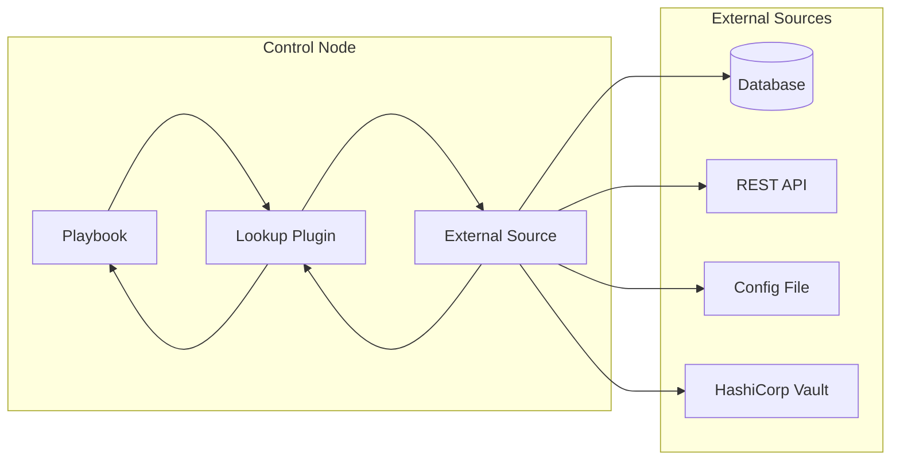

# How to Implement Ansible Lookup Plugins

Author: [nawazdhandala](https://github.com/nawazdhandala)

Tags: Ansible, Plugins, Automation, Python

Description: Build custom Ansible lookup plugins to fetch data from external sources like databases, APIs, and files during playbook execution.

---

Lookup plugins let you pull data from external sources into your Ansible playbooks at runtime. Unlike modules that run on remote hosts, lookups execute on the control node and inject values directly into your tasks and templates. This makes them perfect for fetching secrets, configuration data, or dynamic inventory information.

## How Lookup Plugins Work



### Built-in vs Custom Lookups

| Lookup Type | Use Case | Example |
|------------|----------|---------|
| file | Read local file contents | `lookup('file', '/etc/passwd')` |
| env | Read environment variables | `lookup('env', 'HOME')` |
| password | Generate or retrieve passwords | `lookup('password', 'creds.txt')` |
| template | Render Jinja2 templates | `lookup('template', 'config.j2')` |
| url | Fetch data from HTTP endpoints | `lookup('url', 'https://api.example.com')` |
| Custom | Your specific data sources | `lookup('my_plugin', 'key')` |

## The Anatomy of a Lookup Plugin

Every lookup plugin extends the `LookupBase` class and implements a `run` method. Here is the minimal structure:

```python
# plugins/lookup/my_lookup.py
from ansible.plugins.lookup import LookupBase

class LookupModule(LookupBase):
    def run(self, terms, variables=None, **kwargs):
        # terms: list of arguments passed to the lookup
        # variables: all Ansible variables in scope
        # kwargs: additional keyword arguments

        results = []
        for term in terms:
            # Process each term and append result
            results.append(self.process_term(term))

        return results

    def process_term(self, term):
        # Your lookup logic here
        return term.upper()
```

### Key Components

| Component | Description |
|-----------|-------------|
| `LookupBase` | Base class providing utility methods and caching |
| `run()` | Main entry point, must return a list |
| `terms` | List of arguments from the playbook |
| `variables` | Dictionary of all available Ansible variables |
| `kwargs` | Additional options like `wantlist`, `errors` |

## Creating Your First Lookup Plugin

Let's build a lookup that reads configuration from a JSON file. This demonstrates the core concepts you'll use in every plugin.

### Directory Structure

```
my_collection/
├── plugins/
│   └── lookup/
│       └── json_config.py
└── tests/
    └── unit/
        └── plugins/
            └── lookup/
                └── test_json_config.py
```

### The JSON Config Lookup

This plugin reads values from a JSON configuration file using dot notation for nested keys:

```python
# plugins/lookup/json_config.py
"""
Lookup plugin to read values from JSON config files using dot notation.

Example:
    - debug:
        msg: "{{ lookup('json_config', 'database.host', config_file='app.json') }}"
"""

from __future__ import absolute_import, division, print_function
__metaclass__ = type

DOCUMENTATION = r"""
name: json_config
author: Your Name
short_description: Read values from JSON configuration files
description:
    - This lookup returns values from JSON files using dot notation paths.
    - Nested keys are accessed using dots, e.g., 'database.host'.
options:
    _terms:
        description: Dot-notation path to the value (e.g., 'database.host').
        required: true
    config_file:
        description: Path to the JSON configuration file.
        required: true
        type: string
    default:
        description: Default value if key is not found.
        required: false
        type: string
        default: null
"""

EXAMPLES = r"""
- name: Get database host from config
  debug:
    msg: "{{ lookup('json_config', 'database.host', config_file='config.json') }}"

- name: Get nested value with default
  debug:
    msg: "{{ lookup('json_config', 'cache.ttl', config_file='config.json', default='3600') }}"
"""

RETURN = r"""
_raw:
    description: Value from the JSON config file.
    type: raw
"""

import json
import os

from ansible.errors import AnsibleError
from ansible.plugins.lookup import LookupBase
from ansible.module_utils.common.text.converters import to_text


class LookupModule(LookupBase):
    """Lookup plugin for reading JSON configuration files."""

    def run(self, terms, variables=None, **kwargs):
        """
        Main entry point for the lookup plugin.

        Args:
            terms: List of dot-notation paths to look up
            variables: Ansible variables available in the current scope
            kwargs: Additional options (config_file, default)

        Returns:
            List of values corresponding to each term
        """
        # Set options from kwargs - this handles default values and validation
        self.set_options(var_options=variables, direct=kwargs)

        # Get the config file path from options
        config_file = self.get_option('config_file')
        default_value = self.get_option('default')

        if not config_file:
            raise AnsibleError("config_file option is required")

        # Resolve the config file path relative to the playbook
        config_path = self._find_config_file(config_file, variables)

        # Load the JSON data
        config_data = self._load_json_file(config_path)

        # Process each term and collect results
        results = []
        for term in terms:
            value = self._get_nested_value(config_data, term, default_value)
            results.append(value)

        return results

    def _find_config_file(self, config_file, variables):
        """
        Find the config file, checking multiple locations.

        The search order is:
        1. Absolute path as given
        2. Relative to playbook directory
        3. Relative to role files directory
        """
        # If it's an absolute path and exists, use it directly
        if os.path.isabs(config_file) and os.path.exists(config_file):
            return config_file

        # Try relative to playbook directory
        if variables:
            playbook_dir = variables.get('playbook_dir', '')
            if playbook_dir:
                full_path = os.path.join(playbook_dir, config_file)
                if os.path.exists(full_path):
                    return full_path

            # Try relative to role files directory
            role_path = variables.get('role_path', '')
            if role_path:
                full_path = os.path.join(role_path, 'files', config_file)
                if os.path.exists(full_path):
                    return full_path

        # Use the find_file_in_search_path method from LookupBase
        # This searches through Ansible's standard lookup paths
        found_path = self.find_file_in_search_path(variables, 'files', config_file)
        if found_path:
            return found_path

        raise AnsibleError(f"Could not find config file: {config_file}")

    def _load_json_file(self, file_path):
        """Load and parse a JSON file."""
        try:
            with open(file_path, 'r') as f:
                return json.load(f)
        except json.JSONDecodeError as e:
            raise AnsibleError(f"Invalid JSON in {file_path}: {e}")
        except IOError as e:
            raise AnsibleError(f"Failed to read {file_path}: {e}")

    def _get_nested_value(self, data, path, default=None):
        """
        Get a nested value from a dictionary using dot notation.

        Args:
            data: The dictionary to search
            path: Dot-notation path (e.g., 'database.host')
            default: Value to return if path not found

        Returns:
            The value at the path, or the default
        """
        keys = path.split('.')
        current = data

        for key in keys:
            if isinstance(current, dict) and key in current:
                current = current[key]
            else:
                if default is not None:
                    return default
                raise AnsibleError(f"Key not found in config: {path}")

        return current
```

### Using the Plugin

Create a sample configuration file:

```json
{
    "database": {
        "host": "db.example.com",
        "port": 5432,
        "credentials": {
            "username": "app_user",
            "password": "secret123"
        }
    },
    "cache": {
        "enabled": true,
        "ttl": 3600
    }
}
```

Use the lookup in your playbook:

```yaml
---
- name: Configure application
  hosts: app_servers
  vars:
    db_host: "{{ lookup('json_config', 'database.host', config_file='app.json') }}"
    db_user: "{{ lookup('json_config', 'database.credentials.username', config_file='app.json') }}"
    cache_ttl: "{{ lookup('json_config', 'cache.ttl', config_file='app.json', default='1800') }}"

  tasks:
    - name: Show configuration
      debug:
        msg: "Database: {{ db_user }}@{{ db_host }}, Cache TTL: {{ cache_ttl }}"
```

## Understanding the run Method

The `run` method is the heart of every lookup plugin. Let's examine its parameters and return value in detail.

### Parameters Breakdown

```python
def run(self, terms, variables=None, **kwargs):
    """
    Args:
        terms (list): Arguments passed to the lookup. Even a single argument
                      becomes a one-element list.

        variables (dict): All Ansible variables in scope, including:
            - inventory variables
            - playbook variables
            - registered variables
            - facts
            - magic variables (playbook_dir, role_path, etc.)

        **kwargs: Options passed to the lookup, including:
            - wantlist: If True, return a list even for single values
            - errors: Error handling mode ('strict', 'warn', 'ignore')
            - Any custom options defined in DOCUMENTATION
    """
```

### Return Value Requirements

Lookups must always return a list. The Jinja2 integration handles conversion:

```python
# Correct - always return a list
def run(self, terms, variables=None, **kwargs):
    return ['value1', 'value2']

# If returning a single value, wrap it in a list
def run(self, terms, variables=None, **kwargs):
    return [self.get_single_value()]

# For lookups that naturally return lists per term
def run(self, terms, variables=None, **kwargs):
    results = []
    for term in terms:
        results.append(self.lookup_value(term))
    return results
```

### The wantlist Option

When users call your lookup with `wantlist=True`, they want a list even if there's only one result. Handle this properly:

```python
def run(self, terms, variables=None, **kwargs):
    # Check if wantlist is requested
    wantlist = kwargs.get('wantlist', False)

    results = []
    for term in terms:
        value = self.lookup_value(term)

        # If value is a list and wantlist is False, flatten it
        if isinstance(value, list) and not wantlist:
            results.extend(value)
        else:
            results.append(value)

    return results
```

Usage in playbooks:

```yaml
# Without wantlist - returns first element if single value
- set_fact:
    single_value: "{{ lookup('my_lookup', 'key') }}"

# With wantlist - always returns a list
- set_fact:
    value_list: "{{ lookup('my_lookup', 'key', wantlist=True) }}"

# Using query() - equivalent to lookup with wantlist=True
- set_fact:
    value_list: "{{ query('my_lookup', 'key') }}"
```

## Building an API Lookup Plugin

Let's create a more practical example, a lookup that fetches data from a REST API.

```python
# plugins/lookup/rest_api.py
"""
Lookup plugin for fetching data from REST APIs.

Example:
    - debug:
        msg: "{{ lookup('rest_api', '/users/1', base_url='https://api.example.com') }}"
"""

from __future__ import absolute_import, division, print_function
__metaclass__ = type

DOCUMENTATION = r"""
name: rest_api
author: Your Name
short_description: Fetch data from REST APIs
description:
    - This lookup makes HTTP requests to REST APIs and returns the response.
    - Supports authentication via headers or query parameters.
options:
    _terms:
        description: API endpoint path (e.g., '/users/1').
        required: true
    base_url:
        description: Base URL of the API (e.g., 'https://api.example.com').
        required: true
        type: string
    headers:
        description: Dictionary of HTTP headers to include.
        required: false
        type: dict
        default: {}
    timeout:
        description: Request timeout in seconds.
        required: false
        type: int
        default: 30
    validate_certs:
        description: Whether to validate SSL certificates.
        required: false
        type: bool
        default: true
"""

EXAMPLES = r"""
- name: Fetch user from API
  debug:
    msg: "{{ lookup('rest_api', '/users/1', base_url='https://api.example.com') }}"

- name: Fetch with authentication
  debug:
    msg: "{{ lookup('rest_api', '/data', base_url='https://api.example.com', headers={'Authorization': 'Bearer ' + api_token}) }}"
"""

import json

from ansible.errors import AnsibleError
from ansible.plugins.lookup import LookupBase
from ansible.module_utils.urls import open_url
from ansible.module_utils.six.moves.urllib.error import HTTPError, URLError


class LookupModule(LookupBase):
    """Lookup plugin for REST API requests."""

    def run(self, terms, variables=None, **kwargs):
        """Fetch data from REST API endpoints."""
        self.set_options(var_options=variables, direct=kwargs)

        base_url = self.get_option('base_url')
        headers = self.get_option('headers') or {}
        timeout = self.get_option('timeout')
        validate_certs = self.get_option('validate_certs')

        if not base_url:
            raise AnsibleError("base_url option is required")

        # Ensure base_url doesn't end with a slash
        base_url = base_url.rstrip('/')

        # Add default headers
        if 'Accept' not in headers:
            headers['Accept'] = 'application/json'

        results = []
        for term in terms:
            # Build the full URL
            endpoint = term if term.startswith('/') else '/' + term
            url = base_url + endpoint

            try:
                response = self._make_request(url, headers, timeout, validate_certs)
                results.append(response)
            except AnsibleError:
                raise
            except Exception as e:
                raise AnsibleError(f"Unexpected error fetching {url}: {e}")

        return results

    def _make_request(self, url, headers, timeout, validate_certs):
        """
        Make an HTTP GET request and return the parsed JSON response.

        Args:
            url: Full URL to request
            headers: Dictionary of HTTP headers
            timeout: Request timeout in seconds
            validate_certs: Whether to validate SSL certificates

        Returns:
            Parsed JSON response as a Python object
        """
        try:
            response = open_url(
                url,
                headers=headers,
                timeout=timeout,
                validate_certs=validate_certs,
                method='GET'
            )

            content = response.read()

            # Try to parse as JSON
            try:
                return json.loads(content)
            except json.JSONDecodeError:
                # Return raw content if not JSON
                return content.decode('utf-8')

        except HTTPError as e:
            raise AnsibleError(f"HTTP error {e.code} fetching {url}: {e.reason}")
        except URLError as e:
            raise AnsibleError(f"URL error fetching {url}: {e.reason}")
        except TimeoutError:
            raise AnsibleError(f"Timeout fetching {url}")
```

### Usage Examples

```yaml
---
- name: Work with REST API data
  hosts: localhost
  gather_facts: false
  vars:
    api_url: "https://jsonplaceholder.typicode.com"

  tasks:
    - name: Fetch a single user
      debug:
        msg: "User name: {{ lookup('rest_api', '/users/1', base_url=api_url).name }}"

    - name: Fetch multiple endpoints in one lookup
      debug:
        msg: "{{ item.title }}"
      loop: "{{ query('rest_api', '/posts/1', '/posts/2', base_url=api_url) }}"

    - name: Fetch with custom headers
      vars:
        auth_headers:
          Authorization: "Bearer {{ vault_api_token }}"
          X-Request-ID: "{{ ansible_date_time.iso8601 }}"
      debug:
        msg: "{{ lookup('rest_api', '/protected/data', base_url=api_url, headers=auth_headers) }}"
```

## Implementing Error Handling

Proper error handling makes your lookup plugins robust and user-friendly.

### Error Modes

Ansible lookups support three error modes:

| Mode | Behavior |
|------|----------|
| `strict` | Raise an exception and fail the task (default) |
| `warn` | Log a warning and return an empty list |
| `ignore` | Silently return an empty list |

### Implementing Error Modes

```python
from ansible.errors import AnsibleError
from ansible.utils.display import Display

display = Display()


class LookupModule(LookupBase):

    def run(self, terms, variables=None, **kwargs):
        self.set_options(var_options=variables, direct=kwargs)

        # Get error handling mode from kwargs
        errors = kwargs.get('errors', 'strict')

        results = []
        for term in terms:
            try:
                value = self._lookup_value(term)
                results.append(value)
            except Exception as e:
                results.append(self._handle_error(term, e, errors))

        return results

    def _handle_error(self, term, error, error_mode):
        """
        Handle errors according to the specified mode.

        Args:
            term: The term that caused the error
            error: The exception that was raised
            error_mode: One of 'strict', 'warn', or 'ignore'

        Returns:
            None for warn/ignore modes

        Raises:
            AnsibleError for strict mode
        """
        error_msg = f"Error looking up '{term}': {error}"

        if error_mode == 'strict':
            raise AnsibleError(error_msg)
        elif error_mode == 'warn':
            display.warning(error_msg)
            return None
        else:  # ignore
            return None

    def _lookup_value(self, term):
        """Implement your lookup logic here."""
        # This might raise an exception
        pass
```

### Usage with Error Modes

```yaml
# Strict mode (default) - fails on error
- debug:
    msg: "{{ lookup('my_lookup', 'missing_key') }}"

# Warn mode - logs warning and continues
- debug:
    msg: "{{ lookup('my_lookup', 'missing_key', errors='warn') | default('fallback') }}"

# Ignore mode - silently continues
- debug:
    msg: "{{ lookup('my_lookup', 'missing_key', errors='ignore') | default('fallback') }}"
```

## Implementing Caching

Caching prevents redundant lookups and improves playbook performance. This is especially important for API lookups or database queries.

### Cache Strategies

| Strategy | Use Case | Implementation |
|----------|----------|----------------|
| Instance cache | Cache within single lookup call | Instance variable |
| Run cache | Cache across tasks in a play | Class variable or external cache |
| Persistent cache | Cache across playbook runs | File-based or external cache |

### Instance-Level Caching

```python
class LookupModule(LookupBase):

    def run(self, terms, variables=None, **kwargs):
        self.set_options(var_options=variables, direct=kwargs)

        # Initialize cache for this lookup call
        self._cache = {}

        results = []
        for term in terms:
            # Check cache first
            if term in self._cache:
                results.append(self._cache[term])
            else:
                value = self._expensive_lookup(term)
                self._cache[term] = value
                results.append(value)

        return results

    def _expensive_lookup(self, term):
        """Simulate an expensive operation like an API call."""
        # Your lookup logic here
        pass
```

### Run-Level Caching with TTL

For caching that persists across multiple task invocations:

```python
import time
from ansible.plugins.lookup import LookupBase
from ansible.errors import AnsibleError

# Module-level cache shared across lookup instances
_LOOKUP_CACHE = {}


class LookupModule(LookupBase):
    """Lookup with time-based caching."""

    # Default cache TTL in seconds
    DEFAULT_CACHE_TTL = 300

    def run(self, terms, variables=None, **kwargs):
        self.set_options(var_options=variables, direct=kwargs)

        # Get cache settings from options
        cache_enabled = kwargs.get('cache', True)
        cache_ttl = kwargs.get('cache_ttl', self.DEFAULT_CACHE_TTL)

        results = []
        for term in terms:
            if cache_enabled:
                value = self._get_cached_or_fetch(term, cache_ttl)
            else:
                value = self._fetch_value(term)
            results.append(value)

        return results

    def _get_cached_or_fetch(self, term, ttl):
        """
        Get value from cache if valid, otherwise fetch and cache it.

        Args:
            term: The lookup term
            ttl: Cache time-to-live in seconds

        Returns:
            The cached or freshly fetched value
        """
        cache_key = self._make_cache_key(term)
        current_time = time.time()

        # Check if we have a valid cached value
        if cache_key in _LOOKUP_CACHE:
            cached_value, cached_time = _LOOKUP_CACHE[cache_key]
            if current_time - cached_time < ttl:
                return cached_value

        # Fetch fresh value and cache it
        value = self._fetch_value(term)
        _LOOKUP_CACHE[cache_key] = (value, current_time)

        return value

    def _make_cache_key(self, term):
        """Create a unique cache key for the term."""
        # Include any relevant options in the cache key
        base_url = self.get_option('base_url') or ''
        return f"{base_url}:{term}"

    def _fetch_value(self, term):
        """Fetch the value (implement your lookup logic here)."""
        pass
```

### Usage with Caching

```yaml
# Caching enabled with default TTL
- debug:
    msg: "{{ lookup('cached_api', '/users/1', base_url='https://api.example.com') }}"

# Custom cache TTL (in seconds)
- debug:
    msg: "{{ lookup('cached_api', '/users/1', base_url='https://api.example.com', cache_ttl=60) }}"

# Disable caching for fresh data
- debug:
    msg: "{{ lookup('cached_api', '/users/1', base_url='https://api.example.com', cache=false) }}"
```

## Database Lookup Plugin

Here's a complete example of a lookup that queries a PostgreSQL database:

```python
# plugins/lookup/postgres_query.py
"""
Lookup plugin for querying PostgreSQL databases.

Example:
    - debug:
        msg: "{{ lookup('postgres_query', 'SELECT name FROM users WHERE id = 1') }}"
"""

from __future__ import absolute_import, division, print_function
__metaclass__ = type

DOCUMENTATION = r"""
name: postgres_query
author: Your Name
short_description: Query PostgreSQL databases
description:
    - Execute SQL queries against PostgreSQL and return results.
    - Returns a list of dictionaries, one per row.
options:
    _terms:
        description: SQL query to execute.
        required: true
    host:
        description: Database host.
        required: false
        type: string
        default: localhost
    port:
        description: Database port.
        required: false
        type: int
        default: 5432
    database:
        description: Database name.
        required: true
        type: string
    user:
        description: Database user.
        required: true
        type: string
    password:
        description: Database password.
        required: true
        type: string
    single_value:
        description: If true, return only the first column of the first row.
        required: false
        type: bool
        default: false
"""

EXAMPLES = r"""
- name: Query for a single value
  debug:
    msg: "{{ lookup('postgres_query', 'SELECT count(*) FROM users', database='mydb', user='app', password=db_pass, single_value=true) }}"

- name: Query for rows
  debug:
    msg: "{{ item.name }} - {{ item.email }}"
  loop: "{{ query('postgres_query', 'SELECT name, email FROM users LIMIT 10', database='mydb', user='app', password=db_pass) }}"
"""

from ansible.errors import AnsibleError
from ansible.plugins.lookup import LookupBase

try:
    import psycopg2
    import psycopg2.extras
    HAS_PSYCOPG2 = True
except ImportError:
    HAS_PSYCOPG2 = False


class LookupModule(LookupBase):
    """Lookup plugin for PostgreSQL queries."""

    def run(self, terms, variables=None, **kwargs):
        if not HAS_PSYCOPG2:
            raise AnsibleError(
                "The postgres_query lookup requires the psycopg2 library. "
                "Install it with: pip install psycopg2-binary"
            )

        self.set_options(var_options=variables, direct=kwargs)

        # Get connection parameters
        conn_params = {
            'host': self.get_option('host'),
            'port': self.get_option('port'),
            'database': self.get_option('database'),
            'user': self.get_option('user'),
            'password': self.get_option('password'),
        }

        # Validate required parameters
        for param in ['database', 'user', 'password']:
            if not conn_params.get(param):
                raise AnsibleError(f"The '{param}' option is required")

        single_value = self.get_option('single_value')

        results = []

        # Create connection
        try:
            conn = psycopg2.connect(**conn_params)
            # Use RealDictCursor to get results as dictionaries
            cursor = conn.cursor(cursor_factory=psycopg2.extras.RealDictCursor)

            for term in terms:
                query_result = self._execute_query(cursor, term, single_value)
                results.append(query_result)

            cursor.close()
            conn.close()

        except psycopg2.Error as e:
            raise AnsibleError(f"Database error: {e}")

        return results

    def _execute_query(self, cursor, query, single_value):
        """
        Execute a SQL query and return results.

        Args:
            cursor: Database cursor
            query: SQL query string
            single_value: If True, return only first column of first row

        Returns:
            Query results as a list of dicts, or a single value
        """
        try:
            cursor.execute(query)
            rows = cursor.fetchall()

            if single_value:
                if rows and len(rows) > 0:
                    # Return the first column of the first row
                    first_row = dict(rows[0])
                    first_key = list(first_row.keys())[0]
                    return first_row[first_key]
                return None

            # Convert RealDictRow objects to regular dicts
            return [dict(row) for row in rows]

        except psycopg2.Error as e:
            raise AnsibleError(f"Query error: {e}")
```

## Testing Your Lookup Plugins

### Unit Tests

Create comprehensive unit tests for your lookup plugins:

```python
# tests/unit/plugins/lookup/test_json_config.py
import pytest
import json
import os
import tempfile

from ansible.errors import AnsibleError

# Import the lookup module
from plugins.lookup.json_config import LookupModule


class TestJsonConfigLookup:
    """Unit tests for the json_config lookup plugin."""

    @pytest.fixture
    def lookup(self):
        """Create a lookup instance for testing."""
        return LookupModule()

    @pytest.fixture
    def config_file(self):
        """Create a temporary config file for testing."""
        config = {
            "database": {
                "host": "localhost",
                "port": 5432,
                "credentials": {
                    "username": "testuser",
                    "password": "testpass"
                }
            },
            "features": {
                "cache": True,
                "debug": False
            }
        }

        with tempfile.NamedTemporaryFile(
            mode='w',
            suffix='.json',
            delete=False
        ) as f:
            json.dump(config, f)
            temp_path = f.name

        yield temp_path

        # Cleanup after test
        os.unlink(temp_path)

    def test_simple_lookup(self, lookup, config_file):
        """Test looking up a simple key."""
        result = lookup.run(
            ['database.host'],
            variables={'playbook_dir': os.path.dirname(config_file)},
            config_file=config_file
        )

        assert result == ['localhost']

    def test_nested_lookup(self, lookup, config_file):
        """Test looking up nested keys."""
        result = lookup.run(
            ['database.credentials.username'],
            variables={'playbook_dir': os.path.dirname(config_file)},
            config_file=config_file
        )

        assert result == ['testuser']

    def test_multiple_terms(self, lookup, config_file):
        """Test looking up multiple keys at once."""
        result = lookup.run(
            ['database.host', 'database.port'],
            variables={'playbook_dir': os.path.dirname(config_file)},
            config_file=config_file
        )

        assert result == ['localhost', 5432]

    def test_missing_key_with_default(self, lookup, config_file):
        """Test that missing keys return the default value."""
        result = lookup.run(
            ['nonexistent.key'],
            variables={'playbook_dir': os.path.dirname(config_file)},
            config_file=config_file,
            default='fallback'
        )

        assert result == ['fallback']

    def test_missing_key_without_default(self, lookup, config_file):
        """Test that missing keys raise an error when no default is set."""
        with pytest.raises(AnsibleError) as exc_info:
            lookup.run(
                ['nonexistent.key'],
                variables={'playbook_dir': os.path.dirname(config_file)},
                config_file=config_file
            )

        assert 'Key not found' in str(exc_info.value)

    def test_missing_config_file(self, lookup):
        """Test that a missing config file raises an error."""
        with pytest.raises(AnsibleError) as exc_info:
            lookup.run(
                ['any.key'],
                variables={},
                config_file='/nonexistent/path/config.json'
            )

        assert 'Could not find config file' in str(exc_info.value)

    def test_invalid_json(self, lookup):
        """Test handling of invalid JSON files."""
        with tempfile.NamedTemporaryFile(
            mode='w',
            suffix='.json',
            delete=False
        ) as f:
            f.write('{ invalid json }')
            temp_path = f.name

        try:
            with pytest.raises(AnsibleError) as exc_info:
                lookup.run(
                    ['any.key'],
                    variables={},
                    config_file=temp_path
                )

            assert 'Invalid JSON' in str(exc_info.value)
        finally:
            os.unlink(temp_path)
```

### Running Tests

```bash
# Run tests with pytest
pytest tests/unit/plugins/lookup/ -v

# Run with coverage
pytest tests/unit/plugins/lookup/ --cov=plugins/lookup --cov-report=html
```

## Best Practices

### Documentation

Always include complete DOCUMENTATION, EXAMPLES, and RETURN sections:

```python
DOCUMENTATION = r"""
name: my_lookup
author: Your Name <your.email@example.com>
version_added: "1.0.0"
short_description: One-line description
description:
    - Detailed description of what the lookup does.
    - Additional details about behavior.
options:
    _terms:
        description: Description of the terms argument.
        required: true
    my_option:
        description: Description of this option.
        required: false
        type: string
        default: "default_value"
        env:
            - name: MY_LOOKUP_OPTION
        ini:
            - section: my_lookup
              key: my_option
notes:
    - Additional notes about the plugin.
    - Compatibility information.
seealso:
    - module: ansible.builtin.file
    - ref: playbooks_lookups
      description: Using lookups in playbooks
"""

EXAMPLES = r"""
- name: Basic usage
  debug:
    msg: "{{ lookup('my_lookup', 'term1') }}"

- name: With options
  debug:
    msg: "{{ lookup('my_lookup', 'term1', my_option='value') }}"
"""

RETURN = r"""
_raw:
    description: Description of return value.
    type: list
    elements: string
"""
```

### Security Considerations

```python
class LookupModule(LookupBase):

    def run(self, terms, variables=None, **kwargs):
        # Never log sensitive data
        # BAD: display.vvv(f"Password: {password}")
        # GOOD: display.vvv(f"Connecting to database as user {username}")

        # Validate and sanitize inputs
        for term in terms:
            if not self._is_valid_term(term):
                raise AnsibleError(f"Invalid term: {term}")

        # Use parameterized queries for databases
        # BAD: cursor.execute(f"SELECT * FROM users WHERE id = {user_id}")
        # GOOD: cursor.execute("SELECT * FROM users WHERE id = %s", (user_id,))

        pass

    def _is_valid_term(self, term):
        """Validate that a term is safe to use."""
        # Implement your validation logic
        return True
```

### Performance Tips

| Tip | Description |
|-----|-------------|
| Batch operations | Fetch multiple values in one call when possible |
| Cache aggressively | Cache API responses and database queries |
| Lazy loading | Only import heavy dependencies when needed |
| Connection pooling | Reuse database connections across lookups |
| Async where possible | Use async I/O for network operations |

## Distributing Your Plugins

### As Part of a Collection

```yaml
# galaxy.yml
namespace: myorg
name: mytools
version: 1.0.0
readme: README.md

build_ignore:
  - '*.tar.gz'
  - tests/
```

Directory structure:

```
myorg/
└── mytools/
    ├── galaxy.yml
    ├── plugins/
    │   └── lookup/
    │       ├── json_config.py
    │       ├── rest_api.py
    │       └── postgres_query.py
    └── README.md
```

Build and publish:

```bash
# Build the collection
ansible-galaxy collection build

# Publish to Galaxy
ansible-galaxy collection publish myorg-mytools-1.0.0.tar.gz --api-key=<your-key>
```

### Standalone Plugin

For standalone plugins, place them in one of these locations:

```bash
# Project-specific (relative to playbook)
./lookup_plugins/my_lookup.py

# User-wide
~/.ansible/plugins/lookup/my_lookup.py

# System-wide
/usr/share/ansible/plugins/lookup/my_lookup.py
```

Configure in `ansible.cfg`:

```ini
[defaults]
lookup_plugins = ./lookup_plugins:/custom/path/lookup_plugins
```

---

Lookup plugins give you the power to integrate Ansible with any data source. Start with the JSON config example, then adapt the patterns shown here for your specific needs. Focus on proper error handling, caching for performance, and comprehensive documentation to make your plugins production-ready. The key is to always return a list from the `run` method and handle the `wantlist` option appropriately for consistent behavior across playbooks.
