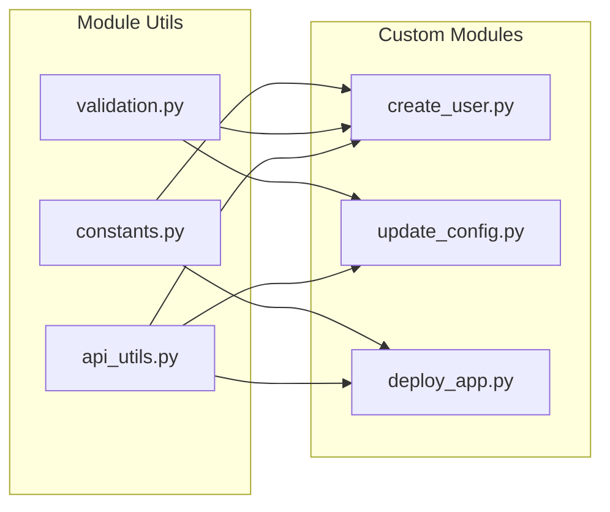
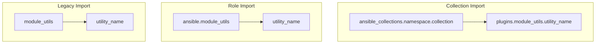

# How to Implement Ansible Module Utils

Author: [nawazdhandala](https://github.com/nawazdhandala)

Tags: Ansible, Automation, Python, DevOps

Description: Learn how to create reusable Python utility libraries for your Ansible modules, enabling code sharing and reducing duplication across your automation projects.

---

When you build custom Ansible modules, you often find yourself writing the same code over and over. Module utils solve this problem by letting you create shared Python libraries that any module can import. This guide walks you through implementing module utils from scratch, with practical examples you can adapt for your own infrastructure automation.

## What Are Module Utils?

Module utils are Python files that contain helper functions, classes, and constants used by multiple Ansible modules. Instead of duplicating code across modules, you write it once in a module util and import it wherever needed.



### Key Benefits

| Benefit | Description |
|---------|-------------|
| Code Reuse | Write common functions once, use everywhere |
| Easier Testing | Test utilities independently from modules |
| Maintainability | Fix bugs in one place instead of many |
| Consistency | Standardize how modules interact with APIs |
| Smaller Modules | Keep module files focused on their specific task |

## Project Structure

A well-organized Ansible collection with module utils follows this structure:

```
my_collection/
├── plugins/
│   ├── modules/
│   │   ├── my_module.py
│   │   └── another_module.py
│   └── module_utils/
│       ├── __init__.py
│       ├── api_client.py
│       ├── validators.py
│       └── helpers.py
├── tests/
│   └── unit/
│       └── plugins/
│           └── module_utils/
│               └── test_api_client.py
└── galaxy.yml
```

## Creating Your First Module Util

Let's build a practical example: an API client utility for managing cloud resources.

### Basic API Client Utility

This utility provides a reusable HTTP client with authentication, retry logic, and error handling.

```python
# plugins/module_utils/api_client.py

from __future__ import absolute_import, division, print_function
__metaclass__ = type

import json
import time
from ansible.module_utils.urls import open_url
from ansible.module_utils.six.moves.urllib.error import HTTPError, URLError

# Constants for the API client configuration
DEFAULT_TIMEOUT = 30
MAX_RETRIES = 3
RETRY_DELAY = 2


class APIClientError(Exception):
    """Custom exception for API client errors."""

    def __init__(self, message, status_code=None, response=None):
        super(APIClientError, self).__init__(message)
        self.status_code = status_code
        self.response = response


class APIClient:
    """
    Reusable API client for interacting with REST APIs.

    This class handles authentication, request formatting,
    retry logic, and error handling.
    """

    def __init__(self, base_url, api_key=None, token=None, timeout=DEFAULT_TIMEOUT):
        """
        Initialize the API client.

        Args:
            base_url: The base URL for the API (e.g., https://api.example.com)
            api_key: Optional API key for authentication
            token: Optional bearer token for authentication
            timeout: Request timeout in seconds
        """
        # Remove trailing slash for consistent URL building
        self.base_url = base_url.rstrip('/')
        self.api_key = api_key
        self.token = token
        self.timeout = timeout

    def _build_headers(self, extra_headers=None):
        """
        Build request headers including authentication.

        Args:
            extra_headers: Additional headers to include

        Returns:
            Dictionary of headers
        """
        headers = {
            'Content-Type': 'application/json',
            'Accept': 'application/json',
        }

        # Add authentication header based on available credentials
        if self.token:
            headers['Authorization'] = 'Bearer {0}'.format(self.token)
        elif self.api_key:
            headers['X-API-Key'] = self.api_key

        # Merge any extra headers provided by the caller
        if extra_headers:
            headers.update(extra_headers)

        return headers

    def _make_request(self, method, endpoint, data=None, params=None):
        """
        Make an HTTP request with retry logic.

        Args:
            method: HTTP method (GET, POST, PUT, DELETE)
            endpoint: API endpoint path
            data: Request body data (will be JSON encoded)
            params: Query parameters

        Returns:
            Parsed JSON response

        Raises:
            APIClientError: If the request fails after retries
        """
        # Build the full URL
        url = '{0}{1}'.format(self.base_url, endpoint)

        # Add query parameters if provided
        if params:
            query_string = '&'.join(
                '{0}={1}'.format(k, v) for k, v in params.items()
            )
            url = '{0}?{1}'.format(url, query_string)

        headers = self._build_headers()
        body = json.dumps(data) if data else None

        last_error = None

        # Retry loop for handling transient failures
        for attempt in range(MAX_RETRIES):
            try:
                response = open_url(
                    url,
                    method=method,
                    headers=headers,
                    data=body,
                    timeout=self.timeout,
                    validate_certs=True
                )

                # Parse and return the response
                response_body = response.read()
                if response_body:
                    return json.loads(response_body)
                return {}

            except HTTPError as e:
                # Don't retry client errors (4xx)
                if 400 <= e.code < 500:
                    error_body = e.read()
                    raise APIClientError(
                        'API request failed: {0}'.format(error_body),
                        status_code=e.code,
                        response=error_body
                    )
                last_error = e

            except URLError as e:
                last_error = e

            # Wait before retrying (exponential backoff)
            if attempt < MAX_RETRIES - 1:
                time.sleep(RETRY_DELAY * (attempt + 1))

        # All retries exhausted
        raise APIClientError(
            'API request failed after {0} retries: {1}'.format(
                MAX_RETRIES, str(last_error)
            )
        )

    def get(self, endpoint, params=None):
        """Perform a GET request."""
        return self._make_request('GET', endpoint, params=params)

    def post(self, endpoint, data=None):
        """Perform a POST request."""
        return self._make_request('POST', endpoint, data=data)

    def put(self, endpoint, data=None):
        """Perform a PUT request."""
        return self._make_request('PUT', endpoint, data=data)

    def delete(self, endpoint):
        """Perform a DELETE request."""
        return self._make_request('DELETE', endpoint)
```

### Validation Utility

This utility provides common validation functions for module parameters.

```python
# plugins/module_utils/validators.py

from __future__ import absolute_import, division, print_function
__metaclass__ = type

import re

# Regex patterns for common validations
EMAIL_PATTERN = re.compile(r'^[a-zA-Z0-9._%+-]+@[a-zA-Z0-9.-]+\.[a-zA-Z]{2,}$')
HOSTNAME_PATTERN = re.compile(r'^[a-zA-Z0-9]([a-zA-Z0-9-]{0,61}[a-zA-Z0-9])?(\.[a-zA-Z0-9]([a-zA-Z0-9-]{0,61}[a-zA-Z0-9])?)*$')
UUID_PATTERN = re.compile(r'^[0-9a-f]{8}-[0-9a-f]{4}-[0-9a-f]{4}-[0-9a-f]{4}-[0-9a-f]{12}$', re.IGNORECASE)


class ValidationError(Exception):
    """Exception raised when validation fails."""
    pass


def validate_email(email):
    """
    Validate an email address format.

    Args:
        email: The email address to validate

    Returns:
        True if valid

    Raises:
        ValidationError: If the email format is invalid
    """
    if not email or not EMAIL_PATTERN.match(email):
        raise ValidationError('Invalid email format: {0}'.format(email))
    return True


def validate_hostname(hostname):
    """
    Validate a hostname format.

    Args:
        hostname: The hostname to validate

    Returns:
        True if valid

    Raises:
        ValidationError: If the hostname format is invalid
    """
    if not hostname or len(hostname) > 253:
        raise ValidationError('Invalid hostname: {0}'.format(hostname))

    if not HOSTNAME_PATTERN.match(hostname):
        raise ValidationError('Invalid hostname format: {0}'.format(hostname))

    return True


def validate_uuid(uuid_string):
    """
    Validate a UUID format.

    Args:
        uuid_string: The UUID to validate

    Returns:
        True if valid

    Raises:
        ValidationError: If the UUID format is invalid
    """
    if not uuid_string or not UUID_PATTERN.match(uuid_string):
        raise ValidationError('Invalid UUID format: {0}'.format(uuid_string))
    return True


def validate_port(port):
    """
    Validate a network port number.

    Args:
        port: The port number to validate

    Returns:
        True if valid

    Raises:
        ValidationError: If the port is out of range
    """
    try:
        port_int = int(port)
        if not 1 <= port_int <= 65535:
            raise ValidationError('Port must be between 1 and 65535: {0}'.format(port))
    except (TypeError, ValueError):
        raise ValidationError('Port must be a valid integer: {0}'.format(port))

    return True


def validate_required_params(module, required_params):
    """
    Validate that all required parameters are present.

    Args:
        module: The Ansible module instance
        required_params: List of parameter names that are required

    Raises:
        ValidationError: If any required parameter is missing
    """
    missing = []
    for param in required_params:
        if module.params.get(param) is None:
            missing.append(param)

    if missing:
        raise ValidationError(
            'Missing required parameters: {0}'.format(', '.join(missing))
        )


def validate_mutually_exclusive(module, param_groups):
    """
    Validate that mutually exclusive parameters are not both set.

    Args:
        module: The Ansible module instance
        param_groups: List of tuples containing mutually exclusive params

    Raises:
        ValidationError: If mutually exclusive params are both set
    """
    for group in param_groups:
        set_params = [p for p in group if module.params.get(p) is not None]
        if len(set_params) > 1:
            raise ValidationError(
                'Parameters are mutually exclusive: {0}'.format(', '.join(set_params))
            )
```

### Helper Functions Utility

This utility contains common helper functions used across modules.

```python
# plugins/module_utils/helpers.py

from __future__ import absolute_import, division, print_function
__metaclass__ = type

import hashlib


def dict_diff(old_dict, new_dict):
    """
    Compare two dictionaries and return the differences.

    Args:
        old_dict: The original dictionary
        new_dict: The new dictionary

    Returns:
        Dictionary with keys: added, removed, changed
    """
    old_keys = set(old_dict.keys())
    new_keys = set(new_dict.keys())

    return {
        'added': {k: new_dict[k] for k in new_keys - old_keys},
        'removed': {k: old_dict[k] for k in old_keys - new_keys},
        'changed': {
            k: {'old': old_dict[k], 'new': new_dict[k]}
            for k in old_keys & new_keys
            if old_dict[k] != new_dict[k]
        }
    }


def has_changes(diff_result):
    """
    Check if a diff result contains any changes.

    Args:
        diff_result: Result from dict_diff function

    Returns:
        True if there are any changes
    """
    return bool(diff_result['added'] or diff_result['removed'] or diff_result['changed'])


def filter_none_values(data):
    """
    Remove None values from a dictionary.

    Args:
        data: Dictionary to filter

    Returns:
        New dictionary without None values
    """
    if not isinstance(data, dict):
        return data

    return {k: v for k, v in data.items() if v is not None}


def generate_resource_id(prefix, *args):
    """
    Generate a consistent resource ID from input values.

    Args:
        prefix: Prefix for the ID
        *args: Values to include in the hash

    Returns:
        String ID in format: prefix-hash
    """
    hash_input = '-'.join(str(arg) for arg in args)
    hash_value = hashlib.sha256(hash_input.encode()).hexdigest()[:12]
    return '{0}-{1}'.format(prefix, hash_value)


def merge_dicts(*dicts):
    """
    Merge multiple dictionaries, with later dicts taking precedence.

    Args:
        *dicts: Dictionaries to merge

    Returns:
        Merged dictionary
    """
    result = {}
    for d in dicts:
        if d:
            result.update(d)
    return result


def normalize_tags(tags):
    """
    Normalize tags to a consistent format.

    Accepts tags as either a dict or a list of key=value strings.

    Args:
        tags: Tags in dict or list format

    Returns:
        Dictionary of tags
    """
    if tags is None:
        return {}

    if isinstance(tags, dict):
        return tags

    # Convert list of "key=value" strings to dict
    result = {}
    for tag in tags:
        if '=' in tag:
            key, value = tag.split('=', 1)
            result[key.strip()] = value.strip()

    return result


def format_error_message(operation, resource_type, resource_id, error):
    """
    Create a consistent error message format.

    Args:
        operation: The operation that failed (create, update, delete)
        resource_type: Type of resource
        resource_id: Resource identifier
        error: The error that occurred

    Returns:
        Formatted error message string
    """
    return 'Failed to {0} {1} "{2}": {3}'.format(
        operation, resource_type, resource_id, str(error)
    )
```

## Using Module Utils in a Custom Module

Now let's see how to import and use these utilities in an actual Ansible module.

```python
# plugins/modules/cloud_instance.py

from __future__ import absolute_import, division, print_function
__metaclass__ = type

DOCUMENTATION = r'''
---
module: cloud_instance
short_description: Manage cloud compute instances
description:
    - Create, update, or delete cloud compute instances
    - Uses shared utilities for API communication and validation
options:
    name:
        description: Name of the instance
        type: str
        required: true
    state:
        description: Desired state of the instance
        type: str
        choices: ['present', 'absent']
        default: present
    instance_type:
        description: Instance type/size
        type: str
        default: small
    api_url:
        description: URL of the cloud API
        type: str
        required: true
    api_key:
        description: API key for authentication
        type: str
        required: true
        no_log: true
    tags:
        description: Tags to apply to the instance
        type: dict
        default: {}
author:
    - Your Name (@username)
'''

EXAMPLES = r'''
- name: Create a new instance
  cloud_instance:
    name: web-server-01
    state: present
    instance_type: medium
    api_url: https://api.cloud.example.com
    api_key: "{{ cloud_api_key }}"
    tags:
      environment: production
      team: platform

- name: Delete an instance
  cloud_instance:
    name: old-server
    state: absent
    api_url: https://api.cloud.example.com
    api_key: "{{ cloud_api_key }}"
'''

RETURN = r'''
instance:
    description: Instance details
    type: dict
    returned: when state is present
    sample:
        id: inst-abc123
        name: web-server-01
        status: running
changed:
    description: Whether any changes were made
    type: bool
    returned: always
'''

from ansible.module_utils.basic import AnsibleModule

# Import our custom module utils
# These imports reference the module_utils directory in the collection
from ansible_collections.myorg.cloud.plugins.module_utils.api_client import (
    APIClient,
    APIClientError
)
from ansible_collections.myorg.cloud.plugins.module_utils.validators import (
    validate_hostname,
    ValidationError
)
from ansible_collections.myorg.cloud.plugins.module_utils.helpers import (
    dict_diff,
    has_changes,
    filter_none_values,
    normalize_tags,
    format_error_message
)


def get_instance(client, name):
    """
    Retrieve an instance by name.

    Args:
        client: APIClient instance
        name: Instance name

    Returns:
        Instance data dict or None if not found
    """
    try:
        instances = client.get('/instances', params={'name': name})
        if instances and len(instances) > 0:
            return instances[0]
    except APIClientError:
        pass
    return None


def create_instance(client, name, instance_type, tags):
    """
    Create a new instance.

    Args:
        client: APIClient instance
        name: Instance name
        instance_type: Type/size of instance
        tags: Tags dictionary

    Returns:
        Created instance data
    """
    payload = filter_none_values({
        'name': name,
        'instance_type': instance_type,
        'tags': tags
    })

    return client.post('/instances', data=payload)


def update_instance(client, instance_id, updates):
    """
    Update an existing instance.

    Args:
        client: APIClient instance
        instance_id: ID of the instance to update
        updates: Dictionary of fields to update

    Returns:
        Updated instance data
    """
    payload = filter_none_values(updates)
    return client.put('/instances/{0}'.format(instance_id), data=payload)


def delete_instance(client, instance_id):
    """
    Delete an instance.

    Args:
        client: APIClient instance
        instance_id: ID of the instance to delete
    """
    client.delete('/instances/{0}'.format(instance_id))


def run_module():
    """Main module execution."""

    # Define module arguments
    module_args = dict(
        name=dict(type='str', required=True),
        state=dict(type='str', default='present', choices=['present', 'absent']),
        instance_type=dict(type='str', default='small'),
        api_url=dict(type='str', required=True),
        api_key=dict(type='str', required=True, no_log=True),
        tags=dict(type='dict', default={})
    )

    # Initialize the module
    module = AnsibleModule(
        argument_spec=module_args,
        supports_check_mode=True
    )

    # Extract parameters
    name = module.params['name']
    state = module.params['state']
    instance_type = module.params['instance_type']
    api_url = module.params['api_url']
    api_key = module.params['api_key']
    tags = normalize_tags(module.params['tags'])

    # Initialize result
    result = dict(
        changed=False,
        instance={}
    )

    # Validate the instance name
    try:
        validate_hostname(name)
    except ValidationError as e:
        module.fail_json(msg=str(e))

    # Create API client using our module util
    client = APIClient(api_url, api_key=api_key)

    try:
        # Get current instance state
        current_instance = get_instance(client, name)

        if state == 'present':
            if current_instance is None:
                # Instance does not exist, create it
                if not module.check_mode:
                    result['instance'] = create_instance(
                        client, name, instance_type, tags
                    )
                result['changed'] = True
            else:
                # Instance exists, check if updates needed
                desired = {
                    'instance_type': instance_type,
                    'tags': tags
                }
                current = {
                    'instance_type': current_instance.get('instance_type'),
                    'tags': current_instance.get('tags', {})
                }

                diff = dict_diff(current, desired)

                if has_changes(diff):
                    if not module.check_mode:
                        result['instance'] = update_instance(
                            client,
                            current_instance['id'],
                            desired
                        )
                    else:
                        result['instance'] = current_instance
                    result['changed'] = True
                    result['diff'] = diff
                else:
                    result['instance'] = current_instance

        elif state == 'absent':
            if current_instance is not None:
                if not module.check_mode:
                    delete_instance(client, current_instance['id'])
                result['changed'] = True

    except APIClientError as e:
        module.fail_json(
            msg=format_error_message('manage', 'instance', name, e)
        )

    module.exit_json(**result)


def main():
    run_module()


if __name__ == '__main__':
    main()
```

## Import Path Reference

Understanding how to import module utils is crucial. The import path depends on whether you are working with a collection or a standalone role.



| Context | Import Statement |
|---------|-----------------|
| Collection | `from ansible_collections.myorg.cloud.plugins.module_utils.api_client import APIClient` |
| Role (library/) | `from ansible.module_utils.api_client import APIClient` |
| Ansible Core | `from ansible.module_utils.basic import AnsibleModule` |

## Testing Module Utils

Testing utilities independently makes debugging easier and increases confidence in your code.

### Unit Test Example

```python
# tests/unit/plugins/module_utils/test_validators.py

import pytest
from ansible_collections.myorg.cloud.plugins.module_utils.validators import (
    validate_email,
    validate_hostname,
    validate_port,
    ValidationError
)


class TestValidateEmail:
    """Tests for email validation."""

    def test_valid_email(self):
        """Valid email addresses should pass."""
        assert validate_email('user@example.com') is True
        assert validate_email('user.name+tag@example.co.uk') is True

    def test_invalid_email_missing_at(self):
        """Email without @ should fail."""
        with pytest.raises(ValidationError) as exc:
            validate_email('userexample.com')
        assert 'Invalid email format' in str(exc.value)

    def test_invalid_email_empty(self):
        """Empty email should fail."""
        with pytest.raises(ValidationError):
            validate_email('')

    def test_invalid_email_none(self):
        """None email should fail."""
        with pytest.raises(ValidationError):
            validate_email(None)


class TestValidateHostname:
    """Tests for hostname validation."""

    def test_valid_hostname(self):
        """Valid hostnames should pass."""
        assert validate_hostname('server01') is True
        assert validate_hostname('web-server.example.com') is True
        assert validate_hostname('a') is True

    def test_invalid_hostname_too_long(self):
        """Hostname exceeding 253 characters should fail."""
        long_hostname = 'a' * 254
        with pytest.raises(ValidationError):
            validate_hostname(long_hostname)

    def test_invalid_hostname_special_chars(self):
        """Hostname with invalid characters should fail."""
        with pytest.raises(ValidationError):
            validate_hostname('server_01')


class TestValidatePort:
    """Tests for port validation."""

    def test_valid_ports(self):
        """Valid port numbers should pass."""
        assert validate_port(80) is True
        assert validate_port(443) is True
        assert validate_port(1) is True
        assert validate_port(65535) is True
        assert validate_port('8080') is True

    def test_invalid_port_zero(self):
        """Port 0 should fail."""
        with pytest.raises(ValidationError):
            validate_port(0)

    def test_invalid_port_negative(self):
        """Negative port should fail."""
        with pytest.raises(ValidationError):
            validate_port(-1)

    def test_invalid_port_too_high(self):
        """Port above 65535 should fail."""
        with pytest.raises(ValidationError):
            validate_port(65536)

    def test_invalid_port_string(self):
        """Non-numeric string should fail."""
        with pytest.raises(ValidationError):
            validate_port('abc')
```

### Running Tests

```bash
# Run tests with pytest
pytest tests/unit/plugins/module_utils/ -v

# Run with coverage
pytest tests/unit/plugins/module_utils/ --cov=plugins/module_utils --cov-report=html

# Run specific test file
pytest tests/unit/plugins/module_utils/test_validators.py -v
```

## Advanced Patterns

### Connection State Management

For utilities that need to maintain connection state across multiple operations:

```python
# plugins/module_utils/connection_pool.py

from __future__ import absolute_import, division, print_function
__metaclass__ = type

import threading


class ConnectionPool:
    """
    Thread-safe connection pool for database or API connections.

    Maintains a pool of reusable connections to reduce
    the overhead of creating new connections.
    """

    _instance = None
    _lock = threading.Lock()

    def __new__(cls):
        """Singleton pattern implementation."""
        if cls._instance is None:
            with cls._lock:
                if cls._instance is None:
                    cls._instance = super(ConnectionPool, cls).__new__(cls)
                    cls._instance._connections = {}
        return cls._instance

    def get_connection(self, key, factory_func):
        """
        Get or create a connection.

        Args:
            key: Unique identifier for the connection
            factory_func: Function to create new connection if needed

        Returns:
            The connection object
        """
        if key not in self._connections:
            with self._lock:
                if key not in self._connections:
                    self._connections[key] = factory_func()
        return self._connections[key]

    def remove_connection(self, key):
        """Remove a connection from the pool."""
        with self._lock:
            self._connections.pop(key, None)

    def clear(self):
        """Clear all connections."""
        with self._lock:
            self._connections.clear()
```

### Configuration Management

Centralize configuration handling across modules:

```python
# plugins/module_utils/config.py

from __future__ import absolute_import, division, print_function
__metaclass__ = type

import os


class ModuleConfig:
    """
    Configuration manager for module utils.

    Reads configuration from environment variables,
    module parameters, or configuration files.
    """

    # Default configuration values
    DEFAULTS = {
        'api_timeout': 30,
        'max_retries': 3,
        'verify_ssl': True,
        'debug': False,
    }

    # Environment variable prefix
    ENV_PREFIX = 'ANSIBLE_CLOUD_'

    def __init__(self, module_params=None):
        """
        Initialize configuration.

        Args:
            module_params: Parameters from Ansible module
        """
        self._config = dict(self.DEFAULTS)
        self._load_from_env()

        if module_params:
            self._load_from_params(module_params)

    def _load_from_env(self):
        """Load configuration from environment variables."""
        env_mapping = {
            'API_TIMEOUT': 'api_timeout',
            'MAX_RETRIES': 'max_retries',
            'VERIFY_SSL': 'verify_ssl',
            'DEBUG': 'debug',
        }

        for env_suffix, config_key in env_mapping.items():
            env_var = '{0}{1}'.format(self.ENV_PREFIX, env_suffix)
            value = os.environ.get(env_var)

            if value is not None:
                # Convert string values to appropriate types
                if config_key in ('api_timeout', 'max_retries'):
                    value = int(value)
                elif config_key in ('verify_ssl', 'debug'):
                    value = value.lower() in ('true', '1', 'yes')

                self._config[config_key] = value

    def _load_from_params(self, params):
        """Load configuration from module parameters."""
        for key in self.DEFAULTS:
            if key in params and params[key] is not None:
                self._config[key] = params[key]

    def get(self, key, default=None):
        """Get a configuration value."""
        return self._config.get(key, default)

    def __getattr__(self, name):
        """Allow attribute-style access to config values."""
        if name.startswith('_'):
            raise AttributeError(name)
        return self._config.get(name)
```

## Debugging Module Utils

When things go wrong, these techniques help identify issues.

### Enable Debug Logging

```python
# plugins/module_utils/debug.py

from __future__ import absolute_import, division, print_function
__metaclass__ = type

import os
import sys
import json
from datetime import datetime


class DebugLogger:
    """
    Debug logger for module utils.

    Writes debug information to a file when enabled
    via environment variable.
    """

    def __init__(self, name):
        """
        Initialize the logger.

        Args:
            name: Name of the module or util being logged
        """
        self.name = name
        self.enabled = os.environ.get('ANSIBLE_MODULE_DEBUG', '').lower() == 'true'
        self.log_file = os.environ.get(
            'ANSIBLE_MODULE_DEBUG_FILE',
            '/tmp/ansible_module_debug.log'
        )

    def log(self, message, data=None):
        """
        Write a debug log entry.

        Args:
            message: Log message
            data: Optional data to include (will be JSON serialized)
        """
        if not self.enabled:
            return

        timestamp = datetime.now().isoformat()
        entry = {
            'timestamp': timestamp,
            'module': self.name,
            'message': message,
        }

        if data is not None:
            try:
                entry['data'] = data
            except (TypeError, ValueError):
                entry['data'] = str(data)

        try:
            with open(self.log_file, 'a') as f:
                f.write(json.dumps(entry) + '\n')
        except IOError:
            pass


# Usage in module utils
debug = DebugLogger('api_client')
debug.log('Making request', {'url': url, 'method': method})
```

### Common Issues and Solutions

| Issue | Cause | Solution |
|-------|-------|----------|
| Import Error | Wrong import path | Use full collection path for imports |
| Module Not Found | Module util not in path | Verify file location in module_utils/ |
| Circular Import | Utils importing each other | Restructure to avoid circular deps |
| Attribute Error | Missing __metaclass__ | Add `__metaclass__ = type` declaration |

## Best Practices

Following these practices will help you build maintainable module utils.

1. **Keep Utils Focused**: Each utility file should have a single responsibility. Do not combine unrelated functions.

2. **Document Everything**: Add docstrings to all classes and functions. Future you will thank present you.

3. **Handle Errors Gracefully**: Create custom exception classes and provide meaningful error messages.

4. **Support Check Mode**: Utilities should work correctly when modules run in check mode.

5. **Avoid Global State**: Minimize the use of global variables. Pass dependencies explicitly.

6. **Write Tests First**: Test utilities independently from modules. This catches bugs early.

7. **Use Type Hints**: Even though Ansible supports older Python, type hints improve code clarity.

```python
# Example of well-documented, focused utility
def sanitize_resource_name(name, max_length=63, allowed_chars=None):
    """
    Sanitize a resource name to meet common cloud provider requirements.

    Converts the name to lowercase, replaces invalid characters with
    hyphens, and truncates to the maximum allowed length.

    Args:
        name: The original resource name
        max_length: Maximum allowed length (default: 63 for Kubernetes)
        allowed_chars: Set of allowed characters (default: alphanumeric and hyphen)

    Returns:
        Sanitized name string

    Example:
        >>> sanitize_resource_name("My_Web_Server!")
        'my-web-server'
    """
    if allowed_chars is None:
        allowed_chars = set('abcdefghijklmnopqrstuvwxyz0123456789-')

    # Convert to lowercase
    result = name.lower()

    # Replace invalid characters with hyphens
    sanitized = []
    for char in result:
        if char in allowed_chars:
            sanitized.append(char)
        else:
            sanitized.append('-')

    result = ''.join(sanitized)

    # Remove consecutive hyphens
    while '--' in result:
        result = result.replace('--', '-')

    # Remove leading/trailing hyphens
    result = result.strip('-')

    # Truncate to max length
    return result[:max_length]
```

---

Module utils transform how you write Ansible modules. Instead of copying code between modules, you build a library of tested, reliable utilities. Start with simple helpers like validation functions, then add more sophisticated utilities as your needs grow. The investment in well-structured module utils pays off quickly as your collection expands.
