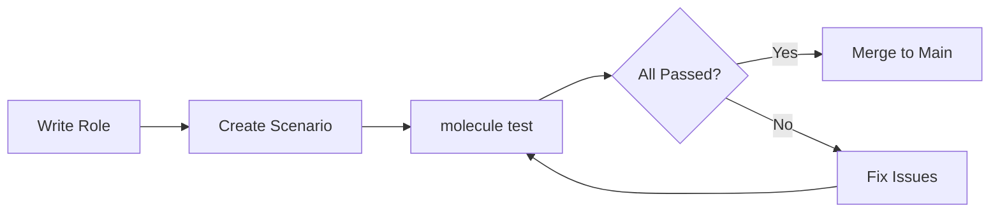
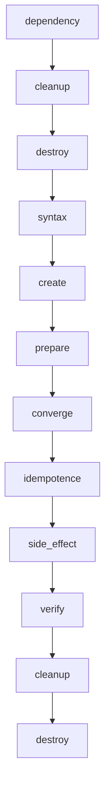

# How to Create Ansible Molecule Scenarios

Author: [nawazdhandala](https://github.com/nawazdhandala)

Tags: Ansible, Molecule, Testing, Automation

Description: A practical guide to creating and managing Molecule scenarios for testing Ansible roles across different platforms, drivers, and configurations.

---

Testing Ansible roles without Molecule is like deploying code without a CI pipeline. You might get lucky, but eventually something breaks in production that worked fine on your laptop. Molecule provides a framework for testing roles in isolated environments before they touch real infrastructure.

## What Is Molecule?

Molecule is Ansible's official testing framework. It spins up temporary instances, runs your role against them, verifies the results, and tears everything down. The entire process is repeatable and can run in CI.



## Installing Molecule

Install Molecule with your preferred driver. Docker is the most common choice for local development:

```bash
pip install molecule molecule-docker

# For other drivers
pip install molecule-vagrant
pip install molecule-podman
pip install molecule-ec2
```

Verify the installation:

```bash
molecule --version
```

## Molecule Test Lifecycle

When you run `molecule test`, it executes a sequence of actions. Understanding this lifecycle helps you debug failures and customize behavior.



Each stage serves a purpose:

| Stage | What It Does |
| --- | --- |
| **dependency** | Install role dependencies from Galaxy or other sources |
| **cleanup** | Pre-test cleanup (custom tasks you define) |
| **destroy** | Remove any existing test instances |
| **syntax** | Check playbook syntax with ansible-playbook --syntax-check |
| **create** | Spin up test instances using the configured driver |
| **prepare** | Run preparation tasks before the role (install prerequisites) |
| **converge** | Execute your role against the instances |
| **idempotence** | Run converge again to verify no changes occur |
| **side_effect** | Optional tasks for complex scenarios (failover testing) |
| **verify** | Run tests to validate the role worked correctly |
| **cleanup** | Post-test cleanup tasks |
| **destroy** | Tear down test instances |

## Creating Your First Scenario

Initialize a new role with Molecule:

```bash
molecule init role my_role --driver-name docker
```

Or add Molecule to an existing role:

```bash
cd my_existing_role
molecule init scenario --driver-name docker
```

This creates the default scenario structure:

```
my_role/
├── defaults/
├── handlers/
├── meta/
├── molecule/
│   └── default/
│       ├── converge.yml
│       ├── molecule.yml
│       └── verify.yml
├── tasks/
├── templates/
└── vars/
```

## The molecule.yml Configuration

The `molecule.yml` file is the heart of each scenario. Here is a complete example with Docker:

```yaml
---
dependency:
  name: galaxy
  options:
    requirements-file: requirements.yml

driver:
  name: docker

platforms:
  - name: ubuntu-jammy
    image: ubuntu:22.04
    pre_build_image: false
    dockerfile: ../resources/Dockerfile.j2
    privileged: true
    volumes:
      - /sys/fs/cgroup:/sys/fs/cgroup:rw
    command: /lib/systemd/systemd
    cgroupns_mode: host

  - name: rocky-9
    image: rockylinux:9
    pre_build_image: false
    dockerfile: ../resources/Dockerfile.j2
    privileged: true
    volumes:
      - /sys/fs/cgroup:/sys/fs/cgroup:rw
    command: /usr/sbin/init
    cgroupns_mode: host

provisioner:
  name: ansible
  inventory:
    group_vars:
      all:
        my_role_config_option: "test_value"
    host_vars:
      ubuntu-jammy:
        my_role_package: "nginx"
      rocky-9:
        my_role_package: "httpd"
  playbooks:
    prepare: prepare.yml
    converge: converge.yml
    verify: verify.yml
  env:
    ANSIBLE_VERBOSITY: 1
  lint:
    name: ansible-lint

verifier:
  name: ansible

scenario:
  name: default
  test_sequence:
    - dependency
    - cleanup
    - destroy
    - syntax
    - create
    - prepare
    - converge
    - idempotence
    - verify
    - cleanup
    - destroy
```

## The Converge Playbook

The `converge.yml` playbook applies your role to the test instances:

```yaml
---
- name: Converge
  hosts: all
  become: true
  vars:
    my_role_enable_feature: true
    my_role_port: 8080
  tasks:
    - name: Include my_role
      ansible.builtin.include_role:
        name: my_role
```

## The Verify Playbook

The `verify.yml` playbook runs tests to confirm your role worked:

```yaml
---
- name: Verify
  hosts: all
  become: true
  gather_facts: true
  tasks:
    - name: Check that nginx service is running
      ansible.builtin.service:
        name: "{{ 'nginx' if ansible_os_family == 'Debian' else 'httpd' }}"
        state: started
      check_mode: true
      register: service_status
      failed_when: service_status.changed

    - name: Verify config file exists
      ansible.builtin.stat:
        path: /etc/myapp/config.yml
      register: config_file
      failed_when: not config_file.stat.exists

    - name: Check config file content
      ansible.builtin.slurp:
        src: /etc/myapp/config.yml
      register: config_content

    - name: Validate config has correct values
      ansible.builtin.assert:
        that:
          - "'port: 8080' in (config_content.content | b64decode)"
          - "'enabled: true' in (config_content.content | b64decode)"
        fail_msg: "Config file does not contain expected values"
        success_msg: "Config file validated successfully"

    - name: Test that port is listening
      ansible.builtin.wait_for:
        port: 8080
        timeout: 10
```

## The Prepare Playbook

Use `prepare.yml` to set up prerequisites your role expects:

```yaml
---
- name: Prepare
  hosts: all
  become: true
  tasks:
    - name: Install Python for Ansible
      ansible.builtin.raw: |
        test -e /usr/bin/python3 || (apt-get update && apt-get install -y python3)
      changed_when: false
      when: ansible_os_family == 'Debian'

    - name: Create required directories
      ansible.builtin.file:
        path: /opt/prerequisites
        state: directory
        mode: '0755'

    - name: Install common dependencies
      ansible.builtin.package:
        name:
          - curl
          - ca-certificates
        state: present
```

## Multi-Scenario Testing

Real roles need testing across multiple configurations. Create separate scenarios for different test cases.

### Scenario Structure

```
molecule/
├── default/
│   ├── converge.yml
│   ├── molecule.yml
│   └── verify.yml
├── clustered/
│   ├── converge.yml
│   ├── molecule.yml
│   └── verify.yml
├── upgrade/
│   ├── converge.yml
│   ├── molecule.yml
│   ├── prepare.yml
│   └── verify.yml
└── resources/
    └── Dockerfile.j2
```

### Creating Additional Scenarios

```bash
molecule init scenario clustered --driver-name docker
molecule init scenario upgrade --driver-name docker
```

### Default Scenario: Single Node

```yaml
# molecule/default/molecule.yml
---
dependency:
  name: galaxy

driver:
  name: docker

platforms:
  - name: instance
    image: ubuntu:22.04
    pre_build_image: true

provisioner:
  name: ansible

verifier:
  name: ansible

scenario:
  name: default
```

### Clustered Scenario: Multiple Nodes

```yaml
# molecule/clustered/molecule.yml
---
dependency:
  name: galaxy

driver:
  name: docker

platforms:
  - name: node1
    image: ubuntu:22.04
    groups:
      - cluster
      - primary
    networks:
      - name: cluster-net

  - name: node2
    image: ubuntu:22.04
    groups:
      - cluster
      - secondary
    networks:
      - name: cluster-net

  - name: node3
    image: ubuntu:22.04
    groups:
      - cluster
      - secondary
    networks:
      - name: cluster-net

provisioner:
  name: ansible
  inventory:
    group_vars:
      cluster:
        cluster_mode: true
        cluster_members:
          - node1
          - node2
          - node3
    host_vars:
      node1:
        cluster_role: primary
      node2:
        cluster_role: secondary
      node3:
        cluster_role: secondary

verifier:
  name: ansible
```

### Clustered Converge Playbook

```yaml
# molecule/clustered/converge.yml
---
- name: Converge primary node
  hosts: primary
  become: true
  tasks:
    - name: Include role for primary
      ansible.builtin.include_role:
        name: my_role
      vars:
        my_role_is_primary: true

- name: Converge secondary nodes
  hosts: secondary
  become: true
  tasks:
    - name: Include role for secondary
      ansible.builtin.include_role:
        name: my_role
      vars:
        my_role_is_primary: false
        my_role_primary_host: node1
```

### Upgrade Scenario: Test Upgrades

```yaml
# molecule/upgrade/molecule.yml
---
dependency:
  name: galaxy

driver:
  name: docker

platforms:
  - name: upgrade-test
    image: ubuntu:22.04
    pre_build_image: true

provisioner:
  name: ansible

verifier:
  name: ansible

scenario:
  name: upgrade
  test_sequence:
    - dependency
    - destroy
    - create
    - prepare        # Install old version
    - converge       # Upgrade to new version
    - verify         # Check upgrade succeeded
    - destroy
```

### Upgrade Prepare Playbook

```yaml
# molecule/upgrade/prepare.yml
---
- name: Prepare - Install previous version
  hosts: all
  become: true
  tasks:
    - name: Install previous version of the application
      ansible.builtin.apt:
        deb: "https://releases.example.com/myapp/1.9.0/myapp_1.9.0_amd64.deb"
      when: ansible_os_family == 'Debian'

    - name: Verify old version is installed
      ansible.builtin.command: myapp --version
      register: version_check
      failed_when: "'1.9.0' not in version_check.stdout"
      changed_when: false
```

## Different Drivers

### Docker Driver

Best for fast, local testing. Limited systemd support without extra configuration.

```yaml
driver:
  name: docker

platforms:
  - name: centos-stream-9
    image: quay.io/centos/centos:stream9
    pre_build_image: true
```

### Podman Driver

Rootless container testing, good for CI environments that restrict Docker:

```yaml
driver:
  name: podman

platforms:
  - name: fedora-39
    image: fedora:39
    pre_build_image: true
    rootless: true
```

### Vagrant Driver

Full VM testing with real systemd. Slower but more realistic:

```yaml
driver:
  name: vagrant
  provider:
    name: virtualbox

platforms:
  - name: ubuntu-jammy
    box: ubuntu/jammy64
    memory: 2048
    cpus: 2
```

### EC2 Driver

Test on real AWS instances:

```yaml
driver:
  name: ec2

platforms:
  - name: rhel-9
    image: ami-0c55b159cbfafe1f0
    instance_type: t3.medium
    vpc_subnet_id: subnet-12345678
    key_name: molecule-key
    security_group_name: molecule-sg
```

### Delegated Driver

For custom infrastructure (existing servers, cloud APIs):

```yaml
driver:
  name: delegated
  options:
    managed: false

platforms:
  - name: existing-server
    ansible_host: 10.0.0.50
```

## Running Molecule Commands

### Full Test Suite

```bash
molecule test
```

### Run Specific Scenario

```bash
molecule test --scenario-name clustered
molecule test --scenario-name upgrade
```

### Development Workflow

During development, use individual commands to iterate faster:

```bash
# Create instances
molecule create

# Run your role
molecule converge

# Run again to check idempotence
molecule converge

# Verify results
molecule verify

# SSH into instance for debugging
molecule login

# Destroy when done
molecule destroy
```

### Keep Instances Running

```bash
# Run test but skip destroy
molecule test --destroy=never

# Later, clean up manually
molecule destroy
```

## Debugging Failed Tests

### Increase Verbosity

```yaml
# molecule.yml
provisioner:
  name: ansible
  env:
    ANSIBLE_VERBOSITY: 3
```

Or from the command line:

```bash
molecule --debug test
```

### Login to Instance

```bash
# Default instance
molecule login

# Specific instance
molecule login --host node2
```

### Check Instance State

```bash
molecule list
```

Output:

```
Instance Name    Driver Name    Provisioner Name    Scenario Name    Created    Converged
---------------  -------------  ------------------  ---------------  ---------  -----------
ubuntu-jammy     docker         ansible             default          true       true
rocky-9          docker         ansible             default          true       true
```

## CI/CD Integration

### GitHub Actions

```yaml
# .github/workflows/molecule.yml
name: Molecule Tests

on:
  push:
    branches: [main]
  pull_request:
    branches: [main]

jobs:
  molecule:
    runs-on: ubuntu-latest
    strategy:
      fail-fast: false
      matrix:
        scenario:
          - default
          - clustered
          - upgrade
    steps:
      - uses: actions/checkout@v4

      - name: Set up Python
        uses: actions/setup-python@v5
        with:
          python-version: '3.11'

      - name: Install dependencies
        run: |
          pip install molecule molecule-docker ansible ansible-lint

      - name: Run Molecule
        run: molecule test --scenario-name ${{ matrix.scenario }}
```

### GitLab CI

```yaml
# .gitlab-ci.yml
molecule:
  image: python:3.11
  services:
    - docker:dind
  variables:
    DOCKER_HOST: tcp://docker:2375
  before_script:
    - pip install molecule molecule-docker ansible
  script:
    - molecule test
  parallel:
    matrix:
      - MOLECULE_SCENARIO: [default, clustered, upgrade]
```

## Testing with Ansible Lint

Integrate ansible-lint into your Molecule workflow:

```yaml
# molecule.yml
provisioner:
  name: ansible
  lint:
    name: ansible-lint
    options:
      c: .ansible-lint
```

Create `.ansible-lint` configuration:

```yaml
# .ansible-lint
skip_list:
  - yaml[line-length]
  - name[casing]

warn_list:
  - experimental

exclude_paths:
  - molecule/
```

## Shared Resources

Place reusable files in `molecule/resources/`:

### Custom Dockerfile

```dockerfile
# molecule/resources/Dockerfile.j2
FROM {{ item.image }}

RUN if [ -f /etc/debian_version ]; then \
      apt-get update && \
      apt-get install -y systemd systemd-sysv python3 python3-apt sudo && \
      apt-get clean; \
    elif [ -f /etc/redhat-release ]; then \
      dnf install -y systemd python3 sudo && \
      dnf clean all; \
    fi

RUN (cd /lib/systemd/system/sysinit.target.wants/; for i in *; do [ $i == systemd-tmpfiles-setup.service ] || rm -f $i; done)

VOLUME ["/sys/fs/cgroup"]
CMD ["/lib/systemd/systemd"]
```

### Shared Variables

```yaml
# molecule/resources/group_vars/all.yml
common_packages:
  - vim
  - curl
  - wget
```

## Best Practices

### 1. Test Real Scenarios

Do not just test that your role runs. Test that it produces working infrastructure:

```yaml
# Bad: Only checks file exists
- name: Check config exists
  ansible.builtin.stat:
    path: /etc/myapp.conf
  register: config

# Good: Validates the service actually works
- name: Test HTTP endpoint responds
  ansible.builtin.uri:
    url: http://localhost:8080/health
    status_code: 200
```

### 2. Test Idempotence

Make sure running your role twice produces zero changes:

```yaml
scenario:
  test_sequence:
    - converge
    - idempotence  # This must pass
```

### 3. Use Matrix Testing

Test across multiple OS versions in CI:

```yaml
strategy:
  matrix:
    distro:
      - ubuntu:22.04
      - ubuntu:24.04
      - rockylinux:9
      - debian:12
```

### 4. Fast Feedback Loops

Use `pre_build_image: true` when possible to skip image building:

```yaml
platforms:
  - name: quick-test
    image: geerlingguy/docker-ubuntu2204-ansible
    pre_build_image: true
```

### 5. Isolate Test Data

Never use production credentials or real endpoints in tests:

```yaml
provisioner:
  inventory:
    group_vars:
      all:
        api_endpoint: "http://mock-api:8080"
        api_key: "test-key-not-real"
```

## Common Patterns

### Testing Handlers

Force handlers to run during verify:

```yaml
# converge.yml
- name: Converge
  hosts: all
  tasks:
    - name: Include role
      ansible.builtin.include_role:
        name: my_role

    - name: Force all notified handlers to run
      ansible.builtin.meta: flush_handlers
```

### Testing with Real Services

When your role needs a database or message queue:

```yaml
platforms:
  - name: app-server
    image: ubuntu:22.04
    networks:
      - name: test-net

  - name: postgres
    image: postgres:15
    networks:
      - name: test-net
    env:
      POSTGRES_PASSWORD: testpass
      POSTGRES_DB: myapp
```

### Skip Destroy on Failure

Keep instances for debugging when tests fail:

```bash
molecule test --destroy=never || molecule login
```

---

Molecule turns Ansible role development from guesswork into a repeatable process. Start with a default scenario using Docker, add scenarios as your role grows in complexity, and run everything in CI. The upfront investment pays off the first time you catch a bug before it reaches production.
