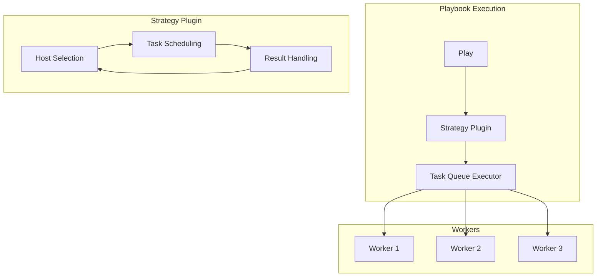
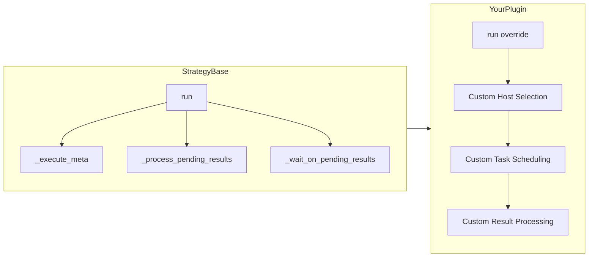
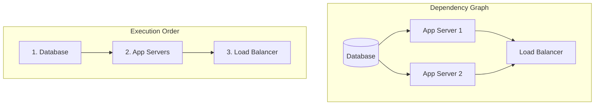
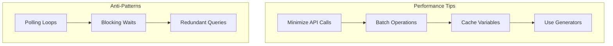

# How to Build Ansible Strategy Plugins

Author: [nawazdhandala](https://github.com/nawazdhandala)

Tags: Ansible, Plugins, Strategy, Automation

Description: A comprehensive guide to building custom Ansible strategy plugins that control task execution flow, including parallel execution, custom scheduling, and advanced host management patterns.

---

Ansible strategy plugins control how tasks execute across your inventory. While built-in strategies like `linear`, `free`, and `serial` cover common use cases, custom strategy plugins let you implement specialized execution patterns that match your infrastructure requirements.

## Understanding Strategy Plugins

Strategy plugins sit at the heart of Ansible's execution engine. They determine the order and parallelism of task execution across hosts.



### Built-in Strategies

| Strategy | Behavior |
|----------|----------|
| linear | Execute task on all hosts before moving to next task |
| free | Execute tasks as fast as possible per host, no waiting |
| serial | Execute play in batches of hosts |
| host_pinned | Like free, but tasks stay on same worker |

## Strategy Plugin Architecture



A strategy plugin inherits from `StrategyBase` and overrides the `run()` method to implement custom execution logic.

## Creating Your First Strategy Plugin

### Directory Structure

```bash
# Create plugin directory
mkdir -p ~/.ansible/plugins/strategy

# Or in your project
mkdir -p plugins/strategy
```

Configure Ansible to find your plugins:

```ini
# ansible.cfg
[defaults]
strategy_plugins = ./plugins/strategy
```

### Basic Plugin Template

Create `plugins/strategy/weighted.py`:

```python
"""
Weighted Strategy Plugin
Executes tasks on hosts based on assigned weights,
prioritizing higher-weight hosts first.
"""

from __future__ import absolute_import, division, print_function
__metaclass__ = type

DOCUMENTATION = """
    name: weighted
    short_description: Execute tasks prioritized by host weight
    description:
        - Tasks execute on hosts ordered by their 'weight' variable
        - Higher weight hosts are processed first
        - Useful for canary deployments or tiered rollouts
    author: Your Name
    version_added: "2.16"
    options:
        weight_var:
            description: Variable name containing host weight
            default: weight
            env:
                - name: ANSIBLE_WEIGHTED_STRATEGY_VAR
            ini:
                - section: weighted_strategy
                  key: weight_var
"""

from ansible.plugins.strategy import StrategyBase
from ansible.utils.display import Display

display = Display()


class StrategyModule(StrategyBase):
    """
    Strategy that executes tasks on hosts ordered by weight.
    """

    def __init__(self, tqm):
        super(StrategyModule, self).__init__(tqm)
        self._weight_var = 'weight'

    def _get_host_weight(self, host, play_context, task_vars):
        """Extract weight from host variables."""
        weight = task_vars.get(self._weight_var, 0)
        try:
            return int(weight)
        except (ValueError, TypeError):
            return 0

    def run(self, iterator, play_context):
        """
        Main execution loop implementing weighted host ordering.
        """
        result = self._tqm.RUN_OK

        # Get all hosts for this play
        hosts = self._inventory.get_hosts(iterator._play.hosts)

        if not hosts:
            display.warning("No hosts in play")
            return result

        # Build host weight mapping
        host_weights = []
        for host in hosts:
            task_vars = self._variable_manager.get_vars(
                play=iterator._play,
                host=host
            )
            weight = self._get_host_weight(host, play_context, task_vars)
            host_weights.append((host, weight))
            display.v(f"Host {host.name} has weight {weight}")

        # Sort by weight descending
        host_weights.sort(key=lambda x: x[1], reverse=True)
        sorted_hosts = [h[0] for h in host_weights]

        display.display(
            f"Execution order: {[h.name for h in sorted_hosts]}"
        )

        # Execute tasks using parent class methods
        work_to_do = True
        while work_to_do and not self._tqm._terminated:

            hosts_left = self.get_hosts_left(iterator)
            if not hosts_left:
                break

            # Process each host in weighted order
            for host in sorted_hosts:
                if host not in hosts_left:
                    continue

                # Get next task for host
                task_action = iterator.get_next_task_for_host(host)
                task = task_action[0]

                if task is None:
                    continue

                # Check for any pending results
                self._process_pending_results(iterator)

                # Queue task for execution
                self._queue_task(host, task, task_vars, play_context)

            # Wait for results
            results = self._wait_on_pending_results(iterator)

            # Process results
            for result_item in results:
                self._process_pending_results(iterator)

            # Check if more work remains
            work_to_do = False
            for host in hosts_left:
                task_action = iterator.get_next_task_for_host(host, peek=True)
                if task_action[0] is not None:
                    work_to_do = True
                    break

        return super(StrategyModule, self).run(iterator, play_context)
```

### Using Your Strategy

```yaml
# playbook.yml
- name: Weighted deployment
  hosts: webservers
  strategy: weighted
  vars:
    weight_var: priority

  tasks:
    - name: Deploy application
      ansible.builtin.copy:
        src: app/
        dest: /opt/app/

    - name: Restart service
      ansible.builtin.service:
        name: myapp
        state: restarted
```

Define weights in inventory:

```ini
# inventory.ini
[webservers]
web1 priority=100
web2 priority=50
web3 priority=10
```

## Advanced Strategy: Rolling Canary Deployment

This strategy implements a canary deployment pattern with configurable stages.

```python
"""
Canary Strategy Plugin
Implements staged rollout with health checks between stages.
"""

from __future__ import absolute_import, division, print_function
__metaclass__ = type

DOCUMENTATION = """
    name: canary
    short_description: Staged canary deployment strategy
    description:
        - Deploys to hosts in configurable stages
        - Waits for health checks between stages
        - Automatically rolls back on failure
    author: Your Name
    version_added: "2.16"
    options:
        canary_stages:
            description: List of percentages for each stage
            default: [10, 50, 100]
            type: list
        health_check_task:
            description: Task name to use for health verification
            default: health_check
        rollback_on_failure:
            description: Whether to trigger rollback on failures
            default: true
            type: bool
"""

import time
from ansible.plugins.strategy import StrategyBase
from ansible.utils.display import Display
from ansible.errors import AnsibleError

display = Display()


class StrategyModule(StrategyBase):
    """
    Canary deployment strategy with staged rollout.
    """

    def __init__(self, tqm):
        super(StrategyModule, self).__init__(tqm)
        self._canary_stages = [10, 50, 100]
        self._health_check_delay = 30
        self._rollback_on_failure = True
        self._failed_hosts = set()

    def _calculate_stage_hosts(self, hosts, percentage):
        """Calculate hosts for given percentage."""
        count = max(1, int(len(hosts) * percentage / 100))
        return hosts[:count]

    def _run_health_check(self, hosts, iterator, play_context):
        """
        Execute health check task on specified hosts.
        Returns True if all hosts pass.
        """
        display.display(
            f"Running health checks on {len(hosts)} hosts..."
        )

        # Find health check task in iterator
        for host in hosts:
            task_vars = self._variable_manager.get_vars(
                play=iterator._play,
                host=host
            )

            # Simple connectivity check
            try:
                # Queue a ping task
                self._queue_task(
                    host,
                    self._create_ping_task(),
                    task_vars,
                    play_context
                )
            except Exception as e:
                display.error(f"Health check failed for {host.name}: {e}")
                return False

        # Wait for results
        results = self._wait_on_pending_results(iterator)

        for result in results:
            if result.is_failed():
                display.error(
                    f"Health check failed: {result._host.name}"
                )
                self._failed_hosts.add(result._host)
                return False

        return True

    def _create_ping_task(self):
        """Create a simple ping task for health checking."""
        from ansible.playbook.task import Task
        return Task.load({
            'name': 'Health check ping',
            'ping': {}
        })

    def run(self, iterator, play_context):
        """
        Execute canary deployment strategy.
        """
        result = self._tqm.RUN_OK

        hosts = self._inventory.get_hosts(iterator._play.hosts)

        if not hosts:
            display.warning("No hosts in play")
            return result

        display.banner(
            f"CANARY DEPLOYMENT: {len(hosts)} hosts, "
            f"stages: {self._canary_stages}"
        )

        # Track completed hosts across stages
        completed_hosts = set()

        for stage_idx, percentage in enumerate(self._canary_stages):
            stage_num = stage_idx + 1
            stage_hosts = self._calculate_stage_hosts(hosts, percentage)

            # Filter out already completed hosts
            new_hosts = [h for h in stage_hosts if h not in completed_hosts]

            if not new_hosts:
                display.display(f"Stage {stage_num}: No new hosts")
                continue

            display.banner(
                f"STAGE {stage_num}/{len(self._canary_stages)}: "
                f"{len(new_hosts)} hosts ({percentage}%)"
            )
            display.display(
                f"Deploying to: {[h.name for h in new_hosts]}"
            )

            # Execute tasks on stage hosts
            for host in new_hosts:
                work_to_do = True

                while work_to_do and not self._tqm._terminated:
                    task_action = iterator.get_next_task_for_host(host)
                    task = task_action[0]

                    if task is None:
                        work_to_do = False
                        continue

                    task_vars = self._variable_manager.get_vars(
                        play=iterator._play,
                        host=host,
                        task=task
                    )

                    self._queue_task(host, task, task_vars, play_context)
                    self._process_pending_results(iterator)

                # Wait for this host to complete
                self._wait_on_pending_results(iterator)
                completed_hosts.add(host)

            # Health check after stage (except final stage)
            if stage_idx < len(self._canary_stages) - 1:
                display.display(
                    f"Waiting {self._health_check_delay}s before health check..."
                )
                time.sleep(self._health_check_delay)

                if not self._run_health_check(
                    list(completed_hosts), iterator, play_context
                ):
                    if self._rollback_on_failure:
                        display.error("Health check failed! Stopping deployment.")
                        return self._tqm.RUN_FAILED_HOSTS
                    else:
                        display.warning(
                            "Health check failed but continuing..."
                        )

        display.banner("CANARY DEPLOYMENT COMPLETE")
        return result
```

## Strategy: Dependency-Aware Execution

Execute tasks respecting dependencies between hosts.



```python
"""
Dependency Strategy Plugin
Executes tasks respecting host dependencies.
"""

from __future__ import absolute_import, division, print_function
__metaclass__ = type

DOCUMENTATION = """
    name: dependency
    short_description: Dependency-aware task execution
    description:
        - Respects 'depends_on' host variable
        - Waits for dependencies to complete before proceeding
        - Supports complex dependency graphs
    author: Your Name
    version_added: "2.16"
"""

from collections import defaultdict
from ansible.plugins.strategy import StrategyBase
from ansible.utils.display import Display
from ansible.errors import AnsibleError

display = Display()


class StrategyModule(StrategyBase):
    """
    Strategy that respects host dependencies.
    """

    def __init__(self, tqm):
        super(StrategyModule, self).__init__(tqm)
        self._completed_hosts = set()
        self._dependency_graph = {}

    def _build_dependency_graph(self, hosts, iterator):
        """Build dependency graph from host variables."""
        graph = defaultdict(list)
        reverse_graph = defaultdict(list)

        for host in hosts:
            task_vars = self._variable_manager.get_vars(
                play=iterator._play,
                host=host
            )

            depends_on = task_vars.get('depends_on', [])
            if isinstance(depends_on, str):
                depends_on = [depends_on]

            for dep in depends_on:
                graph[host.name].append(dep)
                reverse_graph[dep].append(host.name)

        return graph, reverse_graph

    def _get_ready_hosts(self, hosts, graph):
        """Get hosts with all dependencies satisfied."""
        ready = []

        for host in hosts:
            if host.name in self._completed_hosts:
                continue

            deps = graph.get(host.name, [])
            if all(d in self._completed_hosts for d in deps):
                ready.append(host)
            else:
                pending_deps = [
                    d for d in deps
                    if d not in self._completed_hosts
                ]
                display.vv(
                    f"{host.name} waiting on: {pending_deps}"
                )

        return ready

    def _detect_cycles(self, graph, hosts):
        """Detect circular dependencies."""
        visited = set()
        rec_stack = set()

        def dfs(node):
            visited.add(node)
            rec_stack.add(node)

            for neighbor in graph.get(node, []):
                if neighbor not in visited:
                    if dfs(neighbor):
                        return True
                elif neighbor in rec_stack:
                    return True

            rec_stack.remove(node)
            return False

        for host in hosts:
            if host.name not in visited:
                if dfs(host.name):
                    return True

        return False

    def run(self, iterator, play_context):
        """
        Execute tasks respecting host dependencies.
        """
        result = self._tqm.RUN_OK

        hosts = self._inventory.get_hosts(iterator._play.hosts)
        host_map = {h.name: h for h in hosts}

        if not hosts:
            return result

        # Build dependency graph
        graph, reverse_graph = self._build_dependency_graph(
            hosts, iterator
        )

        display.v(f"Dependency graph: {dict(graph)}")

        # Check for cycles
        if self._detect_cycles(graph, hosts):
            raise AnsibleError(
                "Circular dependency detected in host graph"
            )

        # Display execution plan
        display.banner("DEPENDENCY-AWARE EXECUTION")
        display.display(f"Total hosts: {len(hosts)}")
        for host in hosts:
            deps = graph.get(host.name, [])
            if deps:
                display.display(f"  {host.name} -> {deps}")
            else:
                display.display(f"  {host.name} (no dependencies)")

        # Execute in dependency order
        while len(self._completed_hosts) < len(hosts):
            ready_hosts = self._get_ready_hosts(hosts, graph)

            if not ready_hosts:
                pending = [
                    h.name for h in hosts
                    if h.name not in self._completed_hosts
                ]
                raise AnsibleError(
                    f"Deadlock detected. Pending hosts: {pending}"
                )

            display.display(
                f"\nExecuting batch: {[h.name for h in ready_hosts]}"
            )

            # Execute tasks on ready hosts in parallel
            for host in ready_hosts:
                self._execute_host_tasks(
                    host, iterator, play_context
                )

            # Wait for batch to complete
            self._wait_on_pending_results(iterator)

            # Mark hosts as completed
            for host in ready_hosts:
                self._completed_hosts.add(host.name)
                display.display(f"Completed: {host.name}")

        return result

    def _execute_host_tasks(self, host, iterator, play_context):
        """Execute all tasks for a single host."""
        work_to_do = True

        while work_to_do:
            task_action = iterator.get_next_task_for_host(host)
            task = task_action[0]

            if task is None:
                work_to_do = False
                continue

            task_vars = self._variable_manager.get_vars(
                play=iterator._play,
                host=host,
                task=task
            )

            self._queue_task(host, task, task_vars, play_context)
            self._process_pending_results(iterator)
```

Usage with inventory:

```yaml
# inventory.yml
all:
  children:
    databases:
      hosts:
        db1:
          ansible_host: 192.168.1.10

    application:
      hosts:
        app1:
          ansible_host: 192.168.1.20
          depends_on:
            - db1
        app2:
          ansible_host: 192.168.1.21
          depends_on:
            - db1

    loadbalancers:
      hosts:
        lb1:
          ansible_host: 192.168.1.30
          depends_on:
            - app1
            - app2
```

## Strategy: Rate-Limited Execution

Control execution rate to avoid overwhelming infrastructure.

```python
"""
Rate Limited Strategy Plugin
Controls task execution rate across hosts.
"""

from __future__ import absolute_import, division, print_function
__metaclass__ = type

DOCUMENTATION = """
    name: rate_limited
    short_description: Rate-limited task execution
    description:
        - Limits concurrent task execution
        - Configurable delay between tasks
        - Prevents infrastructure overload
    author: Your Name
    version_added: "2.16"
    options:
        rate_limit:
            description: Maximum concurrent tasks
            default: 5
            type: int
            env:
                - name: ANSIBLE_RATE_LIMIT
        task_delay:
            description: Delay in seconds between task batches
            default: 1.0
            type: float
            env:
                - name: ANSIBLE_TASK_DELAY
"""

import time
from ansible.plugins.strategy.linear import StrategyModule as LinearStrategy
from ansible.utils.display import Display

display = Display()


class StrategyModule(LinearStrategy):
    """
    Rate-limited strategy extending linear execution.
    """

    def __init__(self, tqm):
        super(StrategyModule, self).__init__(tqm)
        self._rate_limit = 5
        self._task_delay = 1.0
        self._active_tasks = 0
        self._load_options()

    def _load_options(self):
        """Load configuration options."""
        import os

        rate_limit = os.environ.get('ANSIBLE_RATE_LIMIT')
        if rate_limit:
            self._rate_limit = int(rate_limit)

        task_delay = os.environ.get('ANSIBLE_TASK_DELAY')
        if task_delay:
            self._task_delay = float(task_delay)

        display.display(
            f"Rate limiting: max {self._rate_limit} concurrent, "
            f"{self._task_delay}s delay"
        )

    def _queue_task(self, host, task, task_vars, play_context):
        """Queue task with rate limiting."""
        # Wait if at rate limit
        while self._active_tasks >= self._rate_limit:
            display.vvv(
                f"Rate limit reached ({self._active_tasks}/"
                f"{self._rate_limit}), waiting..."
            )
            time.sleep(0.1)
            self._process_pending_results(None)

        self._active_tasks += 1
        display.vvv(
            f"Queuing task for {host.name} "
            f"({self._active_tasks}/{self._rate_limit} active)"
        )

        # Add configured delay
        if self._task_delay > 0:
            time.sleep(self._task_delay)

        return super(StrategyModule, self)._queue_task(
            host, task, task_vars, play_context
        )

    def _process_pending_results(self, iterator, one_pass=False):
        """Process results and update active task count."""
        results = super(StrategyModule, self)._process_pending_results(
            iterator, one_pass
        )

        if results:
            self._active_tasks = max(0, self._active_tasks - len(results))

        return results
```

## Testing Strategy Plugins

### Unit Testing

```python
# tests/test_weighted_strategy.py
import pytest
from unittest.mock import MagicMock, patch
from plugins.strategy.weighted import StrategyModule


class TestWeightedStrategy:
    """Tests for weighted strategy plugin."""

    def setup_method(self):
        """Set up test fixtures."""
        self.tqm = MagicMock()
        self.tqm._terminated = False
        self.tqm.RUN_OK = 0

    def test_host_weight_extraction(self):
        """Test weight extraction from variables."""
        strategy = StrategyModule(self.tqm)

        host = MagicMock()
        host.name = 'test_host'

        play_context = MagicMock()
        task_vars = {'weight': 100}

        weight = strategy._get_host_weight(
            host, play_context, task_vars
        )

        assert weight == 100

    def test_default_weight(self):
        """Test default weight when not specified."""
        strategy = StrategyModule(self.tqm)

        host = MagicMock()
        play_context = MagicMock()
        task_vars = {}

        weight = strategy._get_host_weight(
            host, play_context, task_vars
        )

        assert weight == 0

    def test_invalid_weight_handling(self):
        """Test handling of invalid weight values."""
        strategy = StrategyModule(self.tqm)

        host = MagicMock()
        play_context = MagicMock()
        task_vars = {'weight': 'invalid'}

        weight = strategy._get_host_weight(
            host, play_context, task_vars
        )

        assert weight == 0


class TestDependencyStrategy:
    """Tests for dependency strategy plugin."""

    def test_cycle_detection(self):
        """Test circular dependency detection."""
        from plugins.strategy.dependency import StrategyModule

        tqm = MagicMock()
        strategy = StrategyModule(tqm)

        # Create circular dependency
        graph = {
            'host1': ['host2'],
            'host2': ['host3'],
            'host3': ['host1']
        }

        hosts = [MagicMock(name=f'host{i}') for i in range(1, 4)]
        for i, h in enumerate(hosts):
            h.name = f'host{i+1}'

        has_cycle = strategy._detect_cycles(graph, hosts)
        assert has_cycle is True

    def test_valid_dependency_graph(self):
        """Test valid dependency graph."""
        from plugins.strategy.dependency import StrategyModule

        tqm = MagicMock()
        strategy = StrategyModule(tqm)

        graph = {
            'app1': ['db1'],
            'app2': ['db1'],
            'lb1': ['app1', 'app2']
        }

        hosts = [MagicMock() for _ in range(4)]
        for i, name in enumerate(['db1', 'app1', 'app2', 'lb1']):
            hosts[i].name = name

        has_cycle = strategy._detect_cycles(graph, hosts)
        assert has_cycle is False
```

### Integration Testing

```yaml
# test_playbook.yml
- name: Test weighted strategy
  hosts: all
  strategy: weighted
  gather_facts: false

  tasks:
    - name: Record execution order
      ansible.builtin.debug:
        msg: "Executing on {{ inventory_hostname }}"
      register: execution_result

    - name: Verify order
      ansible.builtin.assert:
        that:
          - execution_result is defined
```

Run integration tests:

```bash
# Test with specific inventory
ansible-playbook test_playbook.yml \
    -i test_inventory.yml \
    -v

# Run with debug output
ANSIBLE_DEBUG=1 ansible-playbook test_playbook.yml \
    -i test_inventory.yml
```

## Best Practices

### Error Handling

```python
def run(self, iterator, play_context):
    """Strategy run with proper error handling."""
    try:
        result = self._execute_strategy(iterator, play_context)
    except AnsibleError:
        # Re-raise Ansible errors
        raise
    except Exception as e:
        display.error(f"Strategy error: {e}")
        import traceback
        display.vvv(traceback.format_exc())
        return self._tqm.RUN_ERROR

    return result
```

### Logging and Debugging

```python
from ansible.utils.display import Display

display = Display()

# Verbosity levels
display.display("Always shown")     # No flag
display.v("Shown with -v")          # -v
display.vv("Shown with -vv")        # -vv
display.vvv("Shown with -vvv")      # -vvv
display.debug("Debug output")       # ANSIBLE_DEBUG=1
display.warning("Warning message")
display.error("Error message")
```

### Configuration Options

```python
DOCUMENTATION = """
    name: my_strategy
    options:
        my_option:
            description: Description of option
            default: default_value
            type: string
            env:
                - name: ANSIBLE_MY_OPTION
            ini:
                - section: my_strategy
                  key: my_option
            vars:
                - name: ansible_my_option
"""

def __init__(self, tqm):
    super().__init__(tqm)
    # Options are automatically loaded from DOCUMENTATION
    self._my_option = self.get_option('my_option')
```

### Performance Considerations



1. **Cache host variables** - Avoid repeated lookups
2. **Batch result processing** - Process multiple results together
3. **Use iterators** - Avoid loading all tasks into memory
4. **Minimize state** - Keep strategy instance lightweight

## Debugging Strategies

Enable verbose debugging:

```bash
# Maximum verbosity
ansible-playbook playbook.yml -vvvv

# Debug mode
ANSIBLE_DEBUG=1 ansible-playbook playbook.yml

# Strategy-specific debug
ANSIBLE_STRATEGY_PLUGINS=./plugins/strategy \
ANSIBLE_DEBUG=1 \
ansible-playbook playbook.yml -vvv
```

Add debug output to your plugin:

```python
import os

class StrategyModule(StrategyBase):
    def __init__(self, tqm):
        super().__init__(tqm)
        self._debug = os.environ.get('ANSIBLE_DEBUG', False)

    def _debug_log(self, msg):
        if self._debug:
            display.debug(f"[STRATEGY] {msg}")
```

---

Strategy plugins give you complete control over Ansible's task execution engine. Start with simple modifications to existing strategies, then build more complex patterns as needed. The key is understanding the iterator and task queue mechanisms that form Ansible's execution core. Use the built-in strategies as reference implementations and always test thoroughly before deploying custom strategies to production.
