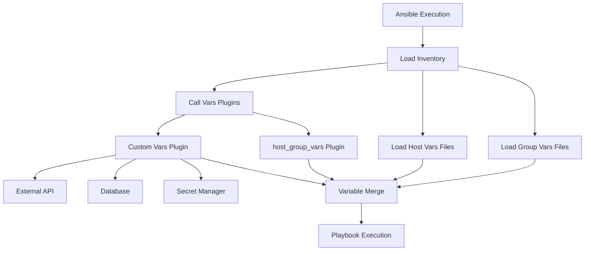
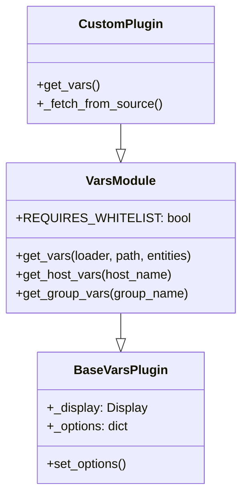
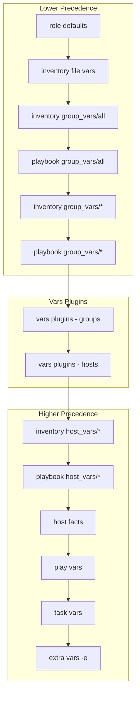

# How to Build Ansible Vars Plugins

Author: [nawazdhandala](https://github.com/nawazdhandala)

Tags: Ansible, Plugins, Variables, Automation

Description: Learn how to build custom Ansible vars plugins to dynamically inject variables from external sources like databases, APIs, cloud services, and secret managers during playbook execution.

---

Ansible vars plugins are one of the most powerful extension points in the Ansible ecosystem. They allow you to dynamically inject variables into your playbook execution from virtually any source - databases, REST APIs, cloud metadata services, secret managers, or custom configuration systems. Unlike static variable files, vars plugins execute at runtime and can pull fresh data on every playbook run.

This guide walks through the architecture of vars plugins, shows you how to build custom ones from scratch, and covers real-world patterns for integrating with external systems.

## Understanding Vars Plugins

Vars plugins sit in the Ansible variable loading pipeline. They are called by Ansible to provide variables for hosts and groups during playbook execution.



Vars plugins run at specific stages:

- **Inventory stage**: When the inventory is parsed
- **Task stage**: Just before tasks execute (if configured)

The built-in `host_group_vars` plugin is what loads variables from your `group_vars/` and `host_vars/` directories. Custom vars plugins follow the same pattern but can source data from anywhere.

## Vars Plugin Architecture

Every vars plugin must inherit from `VarsModule` and implement specific methods:



Key attributes:

- `REQUIRES_WHITELIST`: If `True`, the plugin must be explicitly enabled in ansible.cfg
- `get_vars()`: Main method that returns a dictionary of variables
- `loader`: Ansible's data loader for reading files
- `path`: The inventory path being processed
- `entities`: List of hosts or groups to get variables for

## Basic Vars Plugin Structure

Here is the minimal structure for a vars plugin:

```python
# plugins/vars/custom_vars.py
"""
Custom vars plugin that loads variables from an external source
"""

from ansible.plugins.vars import BaseVarsPlugin
from ansible.inventory.host import Host
from ansible.inventory.group import Group

DOCUMENTATION = '''
name: custom_vars
version_added: "2.10"
short_description: Load variables from external source
description:
    - This vars plugin loads variables from an external data source
    - Variables are loaded for both hosts and groups
options:
    api_url:
        description: URL of the external API
        env:
            - name: ANSIBLE_CUSTOM_VARS_API_URL
        ini:
            - section: custom_vars
              key: api_url
        required: true
'''


class VarsModule(BaseVarsPlugin):
    """
    Custom vars plugin implementation
    """

    REQUIRES_WHITELIST = True

    def get_vars(self, loader, path, entities, cache=True):
        """
        Returns variables for the given entities (hosts or groups)

        Args:
            loader: Ansible data loader
            path: Inventory source path
            entities: List of Host or Group objects
            cache: Whether to use cached data

        Returns:
            dict: Variables to inject
        """
        super(VarsModule, self).get_vars(loader, path, entities)

        data = {}

        for entity in entities:
            if isinstance(entity, Host):
                # Load host-specific variables
                host_vars = self._get_host_vars(entity.name)
                data.update(host_vars)
            elif isinstance(entity, Group):
                # Load group-specific variables
                group_vars = self._get_group_vars(entity.name)
                data.update(group_vars)

        return data

    def _get_host_vars(self, host_name):
        """Fetch variables for a specific host"""
        # Implement your data fetching logic here
        return {}

    def _get_group_vars(self, group_name):
        """Fetch variables for a specific group"""
        # Implement your data fetching logic here
        return {}
```

## Building a Database-Backed Vars Plugin

A common use case is loading configuration from a database. This example uses PostgreSQL:

```python
# plugins/vars/postgres_vars.py
"""
Load Ansible variables from PostgreSQL database
"""

from ansible.plugins.vars import BaseVarsPlugin
from ansible.inventory.host import Host
from ansible.inventory.group import Group
from ansible.errors import AnsibleError

try:
    import psycopg2
    import psycopg2.extras
    HAS_PSYCOPG2 = True
except ImportError:
    HAS_PSYCOPG2 = False


DOCUMENTATION = '''
name: postgres_vars
version_added: "2.10"
short_description: Load variables from PostgreSQL
description:
    - Fetches host and group variables from a PostgreSQL database
    - Supports caching to reduce database load
requirements:
    - psycopg2
options:
    db_host:
        description: PostgreSQL server hostname
        env:
            - name: PGHOST
        ini:
            - section: postgres_vars
              key: host
        default: localhost
    db_port:
        description: PostgreSQL server port
        env:
            - name: PGPORT
        ini:
            - section: postgres_vars
              key: port
        default: 5432
    db_name:
        description: Database name
        env:
            - name: PGDATABASE
        ini:
            - section: postgres_vars
              key: database
        required: true
    db_user:
        description: Database user
        env:
            - name: PGUSER
        ini:
            - section: postgres_vars
              key: user
        required: true
    db_password:
        description: Database password
        env:
            - name: PGPASSWORD
        ini:
            - section: postgres_vars
              key: password
        required: true
'''


class VarsModule(BaseVarsPlugin):
    """
    Loads variables from PostgreSQL database
    """

    REQUIRES_WHITELIST = True

    def __init__(self):
        super(VarsModule, self).__init__()
        self._cache = {}
        self._connection = None

    def _get_connection(self):
        """Create database connection"""
        if not HAS_PSYCOPG2:
            raise AnsibleError("psycopg2 is required for postgres_vars plugin")

        if self._connection is None:
            try:
                self._connection = psycopg2.connect(
                    host=self.get_option('db_host'),
                    port=self.get_option('db_port'),
                    dbname=self.get_option('db_name'),
                    user=self.get_option('db_user'),
                    password=self.get_option('db_password')
                )
            except psycopg2.Error as e:
                raise AnsibleError(f"Failed to connect to PostgreSQL: {e}")

        return self._connection

    def get_vars(self, loader, path, entities, cache=True):
        """Load variables for hosts and groups"""
        super(VarsModule, self).get_vars(loader, path, entities)

        data = {}

        for entity in entities:
            entity_name = entity.name

            # Check cache first
            if cache and entity_name in self._cache:
                data.update(self._cache[entity_name])
                continue

            if isinstance(entity, Host):
                vars_data = self._fetch_host_vars(entity_name)
            elif isinstance(entity, Group):
                vars_data = self._fetch_group_vars(entity_name)
            else:
                continue

            if cache:
                self._cache[entity_name] = vars_data

            data.update(vars_data)

        return data

    def _fetch_host_vars(self, host_name):
        """Query host variables from database"""
        conn = self._get_connection()

        query = """
            SELECT variable_name, variable_value
            FROM ansible_host_vars
            WHERE host_name = %s
        """

        try:
            with conn.cursor(cursor_factory=psycopg2.extras.DictCursor) as cur:
                cur.execute(query, (host_name,))
                rows = cur.fetchall()

                variables = {}
                for row in rows:
                    # Handle JSON values
                    value = row['variable_value']
                    if isinstance(value, str):
                        try:
                            import json
                            value = json.loads(value)
                        except (json.JSONDecodeError, TypeError):
                            pass
                    variables[row['variable_name']] = value

                return variables

        except psycopg2.Error as e:
            self._display.warning(f"Failed to fetch host vars for {host_name}: {e}")
            return {}

    def _fetch_group_vars(self, group_name):
        """Query group variables from database"""
        conn = self._get_connection()

        query = """
            SELECT variable_name, variable_value
            FROM ansible_group_vars
            WHERE group_name = %s
        """

        try:
            with conn.cursor(cursor_factory=psycopg2.extras.DictCursor) as cur:
                cur.execute(query, (group_name,))
                rows = cur.fetchall()

                variables = {}
                for row in rows:
                    value = row['variable_value']
                    if isinstance(value, str):
                        try:
                            import json
                            value = json.loads(value)
                        except (json.JSONDecodeError, TypeError):
                            pass
                    variables[row['variable_name']] = value

                return variables

        except psycopg2.Error as e:
            self._display.warning(f"Failed to fetch group vars for {group_name}: {e}")
            return {}

    def __del__(self):
        """Clean up database connection"""
        if self._connection:
            self._connection.close()
```

Database schema for the above plugin:

```sql
-- Create tables for Ansible variables
CREATE TABLE ansible_host_vars (
    id SERIAL PRIMARY KEY,
    host_name VARCHAR(255) NOT NULL,
    variable_name VARCHAR(255) NOT NULL,
    variable_value JSONB,
    created_at TIMESTAMP DEFAULT CURRENT_TIMESTAMP,
    updated_at TIMESTAMP DEFAULT CURRENT_TIMESTAMP,
    UNIQUE(host_name, variable_name)
);

CREATE TABLE ansible_group_vars (
    id SERIAL PRIMARY KEY,
    group_name VARCHAR(255) NOT NULL,
    variable_name VARCHAR(255) NOT NULL,
    variable_value JSONB,
    created_at TIMESTAMP DEFAULT CURRENT_TIMESTAMP,
    updated_at TIMESTAMP DEFAULT CURRENT_TIMESTAMP,
    UNIQUE(group_name, variable_name)
);

-- Create indexes for faster lookups
CREATE INDEX idx_host_vars_host ON ansible_host_vars(host_name);
CREATE INDEX idx_group_vars_group ON ansible_group_vars(group_name);

-- Example data
INSERT INTO ansible_host_vars (host_name, variable_name, variable_value)
VALUES
    ('web01.example.com', 'nginx_worker_processes', '4'),
    ('web01.example.com', 'nginx_sites', '["site1.com", "site2.com"]'),
    ('db01.example.com', 'postgresql_max_connections', '200');

INSERT INTO ansible_group_vars (group_name, variable_name, variable_value)
VALUES
    ('webservers', 'http_port', '80'),
    ('webservers', 'https_port', '443'),
    ('databases', 'backup_enabled', 'true');
```

## Building an API-Backed Vars Plugin

This example fetches variables from a REST API:

```python
# plugins/vars/api_vars.py
"""
Load Ansible variables from REST API
"""

from ansible.plugins.vars import BaseVarsPlugin
from ansible.inventory.host import Host
from ansible.inventory.group import Group
from ansible.errors import AnsibleError
from ansible.module_utils.urls import open_url
import json


DOCUMENTATION = '''
name: api_vars
version_added: "2.10"
short_description: Load variables from REST API
description:
    - Fetches host and group variables from a REST API endpoint
    - Supports authentication via API key or Bearer token
options:
    api_url:
        description: Base URL of the configuration API
        env:
            - name: ANSIBLE_API_VARS_URL
        ini:
            - section: api_vars
              key: url
        required: true
    api_token:
        description: API authentication token
        env:
            - name: ANSIBLE_API_VARS_TOKEN
        ini:
            - section: api_vars
              key: token
    timeout:
        description: API request timeout in seconds
        type: int
        default: 30
        ini:
            - section: api_vars
              key: timeout
    validate_certs:
        description: Validate SSL certificates
        type: bool
        default: true
        ini:
            - section: api_vars
              key: validate_certs
'''


class VarsModule(BaseVarsPlugin):
    """
    Fetches variables from a REST API
    """

    REQUIRES_WHITELIST = True

    def __init__(self):
        super(VarsModule, self).__init__()
        self._cache = {}

    def get_vars(self, loader, path, entities, cache=True):
        """Load variables for hosts and groups from API"""
        super(VarsModule, self).get_vars(loader, path, entities)

        data = {}

        for entity in entities:
            entity_name = entity.name
            entity_type = 'host' if isinstance(entity, Host) else 'group'

            cache_key = f"{entity_type}:{entity_name}"

            if cache and cache_key in self._cache:
                data.update(self._cache[cache_key])
                continue

            vars_data = self._fetch_vars(entity_type, entity_name)

            if cache:
                self._cache[cache_key] = vars_data

            data.update(vars_data)

        return data

    def _fetch_vars(self, entity_type, entity_name):
        """Fetch variables from API endpoint"""
        api_url = self.get_option('api_url')
        api_token = self.get_option('api_token')
        timeout = self.get_option('timeout')
        validate_certs = self.get_option('validate_certs')

        # Build endpoint URL
        # Expected API format: /api/v1/vars/{hosts|groups}/{name}
        endpoint = f"{api_url.rstrip('/')}/api/v1/vars/{entity_type}s/{entity_name}"

        headers = {
            'Accept': 'application/json',
            'Content-Type': 'application/json'
        }

        if api_token:
            headers['Authorization'] = f"Bearer {api_token}"

        try:
            response = open_url(
                endpoint,
                headers=headers,
                timeout=timeout,
                validate_certs=validate_certs
            )

            data = json.loads(response.read().decode('utf-8'))

            # Expect API response format: {"variables": {...}}
            return data.get('variables', {})

        except Exception as e:
            # Log warning but do not fail - missing vars is not fatal
            self._display.vvv(f"API vars: No data for {entity_type} {entity_name}: {e}")
            return {}
```

Example API response format:

```json
{
    "entity_type": "host",
    "entity_name": "web01.example.com",
    "variables": {
        "nginx_worker_processes": 4,
        "nginx_client_max_body_size": "50m",
        "application_env": "production",
        "feature_flags": {
            "new_dashboard": true,
            "api_v2": false
        }
    }
}
```

## Building a Secret Manager Vars Plugin

Integrating with HashiCorp Vault for secrets:

```python
# plugins/vars/vault_vars.py
"""
Load secrets from HashiCorp Vault
"""

from ansible.plugins.vars import BaseVarsPlugin
from ansible.inventory.host import Host
from ansible.inventory.group import Group
from ansible.errors import AnsibleError

try:
    import hvac
    HAS_HVAC = True
except ImportError:
    HAS_HVAC = False


DOCUMENTATION = '''
name: vault_vars
version_added: "2.10"
short_description: Load secrets from HashiCorp Vault
description:
    - Fetches secrets from HashiCorp Vault KV store
    - Supports both KV v1 and v2 secret engines
requirements:
    - hvac
options:
    vault_addr:
        description: Vault server address
        env:
            - name: VAULT_ADDR
        ini:
            - section: vault_vars
              key: addr
        required: true
    vault_token:
        description: Vault authentication token
        env:
            - name: VAULT_TOKEN
        ini:
            - section: vault_vars
              key: token
    vault_role_id:
        description: AppRole role ID for authentication
        env:
            - name: VAULT_ROLE_ID
        ini:
            - section: vault_vars
              key: role_id
    vault_secret_id:
        description: AppRole secret ID for authentication
        env:
            - name: VAULT_SECRET_ID
        ini:
            - section: vault_vars
              key: secret_id
    mount_point:
        description: KV secrets engine mount point
        default: secret
        ini:
            - section: vault_vars
              key: mount_point
    kv_version:
        description: KV secrets engine version (1 or 2)
        type: int
        default: 2
        ini:
            - section: vault_vars
              key: kv_version
    secret_path_prefix:
        description: Path prefix for secrets
        default: ansible
        ini:
            - section: vault_vars
              key: secret_path_prefix
'''


class VarsModule(BaseVarsPlugin):
    """
    Loads secrets from HashiCorp Vault
    """

    REQUIRES_WHITELIST = True

    def __init__(self):
        super(VarsModule, self).__init__()
        self._client = None
        self._cache = {}

    def _get_client(self):
        """Initialize Vault client with authentication"""
        if not HAS_HVAC:
            raise AnsibleError("hvac library is required for vault_vars plugin")

        if self._client is not None:
            return self._client

        vault_addr = self.get_option('vault_addr')
        vault_token = self.get_option('vault_token')
        role_id = self.get_option('vault_role_id')
        secret_id = self.get_option('vault_secret_id')

        self._client = hvac.Client(url=vault_addr)

        # Authenticate
        if vault_token:
            self._client.token = vault_token
        elif role_id and secret_id:
            # AppRole authentication
            response = self._client.auth.approle.login(
                role_id=role_id,
                secret_id=secret_id
            )
            self._client.token = response['auth']['client_token']
        else:
            raise AnsibleError(
                "Vault authentication required: provide token or AppRole credentials"
            )

        if not self._client.is_authenticated():
            raise AnsibleError("Failed to authenticate with Vault")

        return self._client

    def get_vars(self, loader, path, entities, cache=True):
        """Load secrets for hosts and groups"""
        super(VarsModule, self).get_vars(loader, path, entities)

        data = {}

        for entity in entities:
            entity_name = entity.name
            entity_type = 'hosts' if isinstance(entity, Host) else 'groups'

            cache_key = f"{entity_type}/{entity_name}"

            if cache and cache_key in self._cache:
                data.update(self._cache[cache_key])
                continue

            secrets = self._fetch_secrets(entity_type, entity_name)

            if cache:
                self._cache[cache_key] = secrets

            data.update(secrets)

        return data

    def _fetch_secrets(self, entity_type, entity_name):
        """Fetch secrets from Vault"""
        client = self._get_client()
        mount_point = self.get_option('mount_point')
        kv_version = self.get_option('kv_version')
        prefix = self.get_option('secret_path_prefix')

        # Build secret path: ansible/hosts/hostname or ansible/groups/groupname
        secret_path = f"{prefix}/{entity_type}/{entity_name}"

        try:
            if kv_version == 2:
                response = client.secrets.kv.v2.read_secret_version(
                    path=secret_path,
                    mount_point=mount_point
                )
                return response['data']['data']
            else:
                response = client.secrets.kv.v1.read_secret(
                    path=secret_path,
                    mount_point=mount_point
                )
                return response['data']

        except hvac.exceptions.InvalidPath:
            # No secrets at this path - that is okay
            self._display.vvv(f"No Vault secrets at path: {secret_path}")
            return {}
        except Exception as e:
            self._display.warning(f"Failed to fetch Vault secrets: {e}")
            return {}
```

## Configuring Vars Plugins

Enable your custom vars plugins in ansible.cfg:

```ini
# ansible.cfg
[defaults]
# Add custom plugin directory
vars_plugins = ./plugins/vars

# Enable specific vars plugins (comma-separated)
vars_plugins_enabled = host_group_vars, postgres_vars, vault_vars

# Control when vars plugins run
# 'inventory' = when inventory is loaded
# 'task' = just before each task (slower but fresher data)
run_vars_plugins = inventory

[postgres_vars]
host = db.example.com
port = 5432
database = ansible_config
user = ansible
# password set via PGPASSWORD environment variable

[api_vars]
url = https://config.example.com
timeout = 30
validate_certs = true

[vault_vars]
addr = https://vault.example.com:8200
mount_point = secret
kv_version = 2
secret_path_prefix = ansible
```

## Variable Precedence with Vars Plugins

Understanding where vars plugin variables fit in Ansible's precedence:



Vars plugins load after group_vars files but before host_vars files. This means:

- Vars from your plugin can be overridden by host_vars files
- Extra vars (`-e`) always win
- Plugin vars override inventory file variables

## Caching Strategies

Implement efficient caching to reduce external calls:

```python
# plugins/vars/cached_api_vars.py
"""
Vars plugin with advanced caching
"""

from ansible.plugins.vars import BaseVarsPlugin
from ansible.inventory.host import Host
from ansible.inventory.group import Group
import time
import hashlib
import json
import os


class VarsModule(BaseVarsPlugin):
    """
    Vars plugin with file-based caching
    """

    REQUIRES_WHITELIST = True

    def __init__(self):
        super(VarsModule, self).__init__()
        self._memory_cache = {}
        self._cache_dir = os.path.expanduser('~/.ansible/vars_cache')
        self._cache_ttl = 300  # 5 minutes

    def _get_cache_path(self, key):
        """Generate cache file path for a key"""
        key_hash = hashlib.md5(key.encode()).hexdigest()
        return os.path.join(self._cache_dir, f"{key_hash}.json")

    def _read_cache(self, key):
        """Read from file cache if valid"""
        cache_path = self._get_cache_path(key)

        if not os.path.exists(cache_path):
            return None

        try:
            with open(cache_path, 'r') as f:
                cached = json.load(f)

            # Check TTL
            if time.time() - cached['timestamp'] > self._cache_ttl:
                return None

            return cached['data']

        except (json.JSONDecodeError, KeyError):
            return None

    def _write_cache(self, key, data):
        """Write to file cache"""
        os.makedirs(self._cache_dir, exist_ok=True)
        cache_path = self._get_cache_path(key)

        with open(cache_path, 'w') as f:
            json.dump({
                'timestamp': time.time(),
                'data': data
            }, f)

    def get_vars(self, loader, path, entities, cache=True):
        """Load variables with caching"""
        super(VarsModule, self).get_vars(loader, path, entities)

        data = {}

        for entity in entities:
            entity_name = entity.name
            entity_type = 'host' if isinstance(entity, Host) else 'group'
            cache_key = f"{entity_type}:{entity_name}"

            # Check memory cache first
            if cache and cache_key in self._memory_cache:
                data.update(self._memory_cache[cache_key])
                continue

            # Check file cache
            if cache:
                cached_data = self._read_cache(cache_key)
                if cached_data is not None:
                    self._memory_cache[cache_key] = cached_data
                    data.update(cached_data)
                    continue

            # Fetch fresh data
            vars_data = self._fetch_vars(entity_type, entity_name)

            # Update caches
            if cache:
                self._memory_cache[cache_key] = vars_data
                self._write_cache(cache_key, vars_data)

            data.update(vars_data)

        return data

    def _fetch_vars(self, entity_type, entity_name):
        """Fetch variables from external source"""
        # Implement your data fetching logic
        return {}
```

## Error Handling Best Practices

Vars plugins should be resilient - a failure to fetch external data should not necessarily fail the entire playbook:

```python
# plugins/vars/resilient_vars.py
"""
Resilient vars plugin with proper error handling
"""

from ansible.plugins.vars import BaseVarsPlugin
from ansible.inventory.host import Host
from ansible.inventory.group import Group
from ansible.errors import AnsibleError
import time


class VarsModule(BaseVarsPlugin):
    """
    Resilient vars plugin with retry logic
    """

    REQUIRES_WHITELIST = True

    def __init__(self):
        super(VarsModule, self).__init__()
        self._max_retries = 3
        self._retry_delay = 1

    def get_vars(self, loader, path, entities, cache=True):
        """Load variables with error handling"""
        super(VarsModule, self).get_vars(loader, path, entities)

        data = {}

        for entity in entities:
            try:
                vars_data = self._fetch_with_retry(entity)
                data.update(vars_data)

            except AnsibleError:
                # Re-raise Ansible errors (configuration issues)
                raise

            except Exception as e:
                # Log but continue for other errors
                entity_name = entity.name
                self._display.warning(
                    f"Failed to fetch vars for {entity_name}: {e}. "
                    "Continuing with empty vars."
                )

        return data

    def _fetch_with_retry(self, entity):
        """Fetch with exponential backoff retry"""
        last_error = None

        for attempt in range(self._max_retries):
            try:
                if isinstance(entity, Host):
                    return self._fetch_host_vars(entity.name)
                elif isinstance(entity, Group):
                    return self._fetch_group_vars(entity.name)
                return {}

            except Exception as e:
                last_error = e
                if attempt < self._max_retries - 1:
                    delay = self._retry_delay * (2 ** attempt)
                    self._display.vvv(
                        f"Retry {attempt + 1}/{self._max_retries} "
                        f"after {delay}s: {e}"
                    )
                    time.sleep(delay)

        raise last_error

    def _fetch_host_vars(self, host_name):
        """Override in subclass"""
        return {}

    def _fetch_group_vars(self, group_name):
        """Override in subclass"""
        return {}
```

## Testing Vars Plugins

Create unit tests for your vars plugins:

```python
# tests/test_postgres_vars.py
"""
Unit tests for postgres_vars plugin
"""

import pytest
from unittest.mock import Mock, patch, MagicMock
from ansible.inventory.host import Host
from ansible.inventory.group import Group

# Import the plugin module
import sys
sys.path.insert(0, './plugins/vars')
from postgres_vars import VarsModule


class TestPostgresVarsPlugin:
    """Test cases for PostgreSQL vars plugin"""

    @pytest.fixture
    def plugin(self):
        """Create plugin instance"""
        plugin = VarsModule()
        # Mock options
        plugin.get_option = Mock(side_effect=lambda x: {
            'db_host': 'localhost',
            'db_port': 5432,
            'db_name': 'test_db',
            'db_user': 'test_user',
            'db_password': 'test_pass'
        }.get(x))
        return plugin

    @pytest.fixture
    def mock_host(self):
        """Create mock Host object"""
        host = Mock(spec=Host)
        host.name = 'test-host.example.com'
        return host

    @pytest.fixture
    def mock_group(self):
        """Create mock Group object"""
        group = Mock(spec=Group)
        group.name = 'webservers'
        return group

    @patch('postgres_vars.psycopg2')
    def test_fetch_host_vars(self, mock_psycopg2, plugin, mock_host):
        """Test fetching host variables"""
        # Setup mock cursor
        mock_cursor = MagicMock()
        mock_cursor.fetchall.return_value = [
            {'variable_name': 'nginx_port', 'variable_value': '80'},
            {'variable_name': 'app_env', 'variable_value': '"production"'}
        ]
        mock_cursor.__enter__ = Mock(return_value=mock_cursor)
        mock_cursor.__exit__ = Mock(return_value=False)

        mock_conn = MagicMock()
        mock_conn.cursor.return_value = mock_cursor
        mock_psycopg2.connect.return_value = mock_conn

        # Test
        loader = Mock()
        result = plugin.get_vars(loader, '/inventory', [mock_host])

        assert 'nginx_port' in result
        assert result['nginx_port'] == '80'

    @patch('postgres_vars.psycopg2')
    def test_connection_error_handling(self, mock_psycopg2, plugin, mock_host):
        """Test handling of connection errors"""
        mock_psycopg2.connect.side_effect = Exception("Connection refused")
        mock_psycopg2.Error = Exception

        plugin._display = Mock()

        loader = Mock()
        # Should not raise, just log warning
        result = plugin.get_vars(loader, '/inventory', [mock_host])

        assert result == {} or plugin._display.warning.called

    def test_caching(self, plugin, mock_host):
        """Test that caching works"""
        plugin._cache = {'test-host.example.com': {'cached_var': 'value'}}

        loader = Mock()
        result = plugin.get_vars(loader, '/inventory', [mock_host], cache=True)

        assert result['cached_var'] == 'value'
```

Run tests with pytest:

```bash
# Install test dependencies
pip install pytest pytest-mock

# Run tests
pytest tests/test_postgres_vars.py -v
```

## Real-World Example: Multi-Source Vars Plugin

Here is a complete example that combines multiple data sources:

```python
# plugins/vars/multi_source_vars.py
"""
Load variables from multiple sources with priority
"""

from ansible.plugins.vars import BaseVarsPlugin
from ansible.inventory.host import Host
from ansible.inventory.group import Group
from ansible.module_utils.urls import open_url
import json
import os


DOCUMENTATION = '''
name: multi_source_vars
version_added: "2.10"
short_description: Load variables from multiple sources
description:
    - Aggregates variables from multiple sources
    - Sources are checked in priority order
    - Later sources override earlier ones
options:
    sources:
        description: List of source configurations
        type: list
        required: true
        ini:
            - section: multi_source_vars
              key: sources
'''


class VarsModule(BaseVarsPlugin):
    """
    Multi-source vars plugin
    """

    REQUIRES_WHITELIST = True

    def __init__(self):
        super(VarsModule, self).__init__()
        self._cache = {}

    def get_vars(self, loader, path, entities, cache=True):
        """Load and merge variables from all sources"""
        super(VarsModule, self).get_vars(loader, path, entities)

        merged_data = {}

        for entity in entities:
            entity_name = entity.name
            entity_type = 'host' if isinstance(entity, Host) else 'group'

            cache_key = f"{entity_type}:{entity_name}"

            if cache and cache_key in self._cache:
                merged_data.update(self._cache[cache_key])
                continue

            # Collect vars from all sources
            entity_vars = {}

            # Source 1: Environment variables with prefix
            env_vars = self._load_from_env(entity_type, entity_name)
            entity_vars.update(env_vars)

            # Source 2: Local JSON files
            file_vars = self._load_from_files(entity_type, entity_name)
            entity_vars.update(file_vars)

            # Source 3: Remote API (highest priority)
            api_vars = self._load_from_api(entity_type, entity_name)
            entity_vars.update(api_vars)

            if cache:
                self._cache[cache_key] = entity_vars

            merged_data.update(entity_vars)

        return merged_data

    def _load_from_env(self, entity_type, entity_name):
        """Load variables from environment"""
        prefix = f"ANSIBLE_VAR_{entity_type.upper()}_{entity_name.upper().replace('.', '_').replace('-', '_')}_"

        vars_data = {}
        for key, value in os.environ.items():
            if key.startswith(prefix):
                var_name = key[len(prefix):].lower()
                # Try to parse as JSON
                try:
                    vars_data[var_name] = json.loads(value)
                except json.JSONDecodeError:
                    vars_data[var_name] = value

        return vars_data

    def _load_from_files(self, entity_type, entity_name):
        """Load variables from local JSON files"""
        search_paths = [
            f"./vars/{entity_type}s/{entity_name}.json",
            f"/etc/ansible/vars/{entity_type}s/{entity_name}.json"
        ]

        for path in search_paths:
            if os.path.exists(path):
                try:
                    with open(path, 'r') as f:
                        return json.load(f)
                except Exception as e:
                    self._display.vvv(f"Failed to load {path}: {e}")

        return {}

    def _load_from_api(self, entity_type, entity_name):
        """Load variables from API"""
        api_url = os.environ.get('ANSIBLE_VARS_API_URL')
        if not api_url:
            return {}

        endpoint = f"{api_url}/vars/{entity_type}s/{entity_name}"

        try:
            response = open_url(endpoint, timeout=10)
            data = json.loads(response.read().decode('utf-8'))
            return data.get('variables', {})
        except Exception as e:
            self._display.vvv(f"API fetch failed for {entity_name}: {e}")
            return {}
```

## Directory Structure

Organize your vars plugins following Ansible conventions:

```
project/
|-- ansible.cfg
|-- inventory/
|   |-- hosts
|   |-- group_vars/
|   |-- host_vars/
|-- playbooks/
|   |-- site.yml
|-- plugins/
|   |-- vars/
|   |   |-- __init__.py
|   |   |-- postgres_vars.py
|   |   |-- api_vars.py
|   |   |-- vault_vars.py
|-- tests/
|   |-- test_postgres_vars.py
|   |-- test_api_vars.py
|-- requirements.txt
```

## Debugging Vars Plugins

Use Ansible's verbose mode to debug your vars plugins:

```bash
# Show vars plugin activity
ansible-playbook playbook.yml -vvv

# Show all variables for a host
ansible -m debug -a "var=hostvars[inventory_hostname]" hostname

# List all available vars plugins
ansible-doc -t vars -l

# View vars plugin documentation
ansible-doc -t vars postgres_vars
```

Add debug output in your plugin:

```python
def get_vars(self, loader, path, entities, cache=True):
    self._display.vvv(f"vars plugin called with entities: {entities}")

    for entity in entities:
        self._display.vvv(f"Processing entity: {entity.name}")
        # ... rest of implementation
```

---

Vars plugins unlock dynamic configuration management in Ansible. Instead of maintaining static YAML files, you can centralize configuration in databases, pull secrets from vault systems, or fetch real-time data from APIs. Start with a simple implementation, add caching for performance, and build in proper error handling for production use. The examples in this guide provide templates you can adapt for your specific infrastructure needs.

