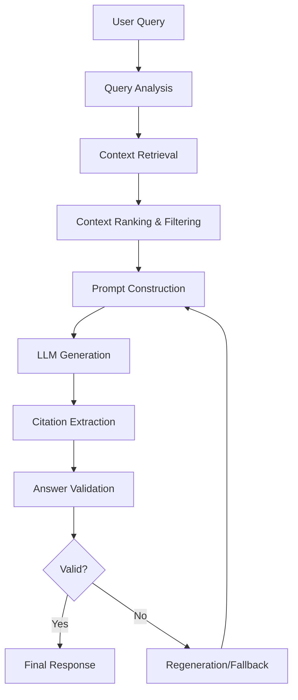
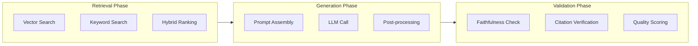
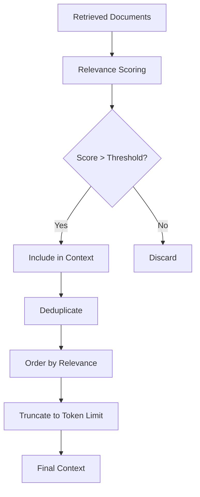
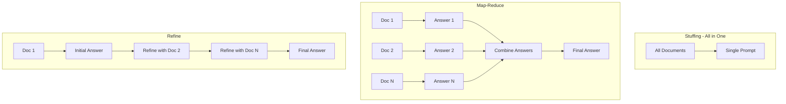
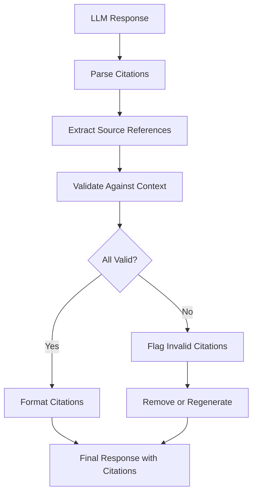
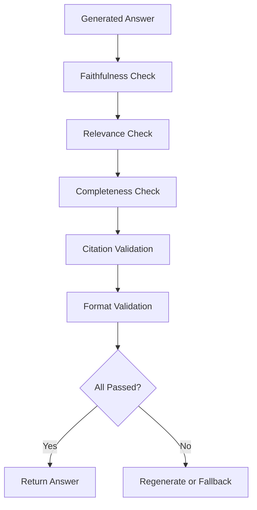
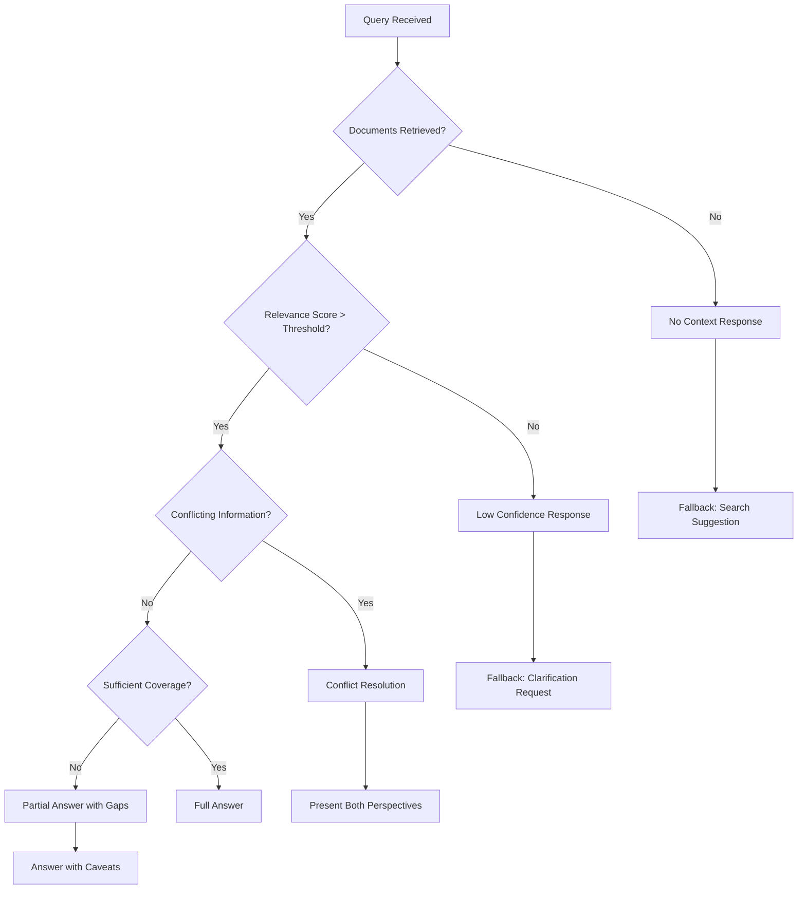
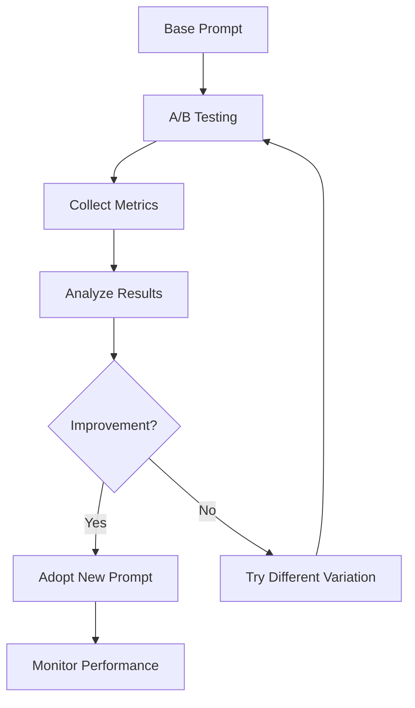

# How to Create Answer Generation

Author: [nawazdhandala](https://github.com/nawazdhandala)

Tags: RAG, Answer Generation, LLM, Natural Language Generation

Description: Learn to implement answer generation for RAG systems with context grounding, citation handling, and response quality optimization.

---

Answer generation is the final and most critical stage of a Retrieval-Augmented Generation (RAG) pipeline. After retrieving relevant documents, you need to synthesize them into a coherent, accurate, and well-cited response. This guide covers the complete implementation of answer generation - from prompt engineering to validation.

---

## Table of Contents

1. Understanding Answer Generation in RAG
2. The Answer Generation Pipeline
3. Prompt Engineering Fundamentals
4. Context Integration Strategies
5. Citation Generation
6. Answer Validation
7. Handling Edge Cases
8. Production Implementation
9. Quality Optimization
10. Summary

---

## 1. Understanding Answer Generation in RAG

Answer generation transforms retrieved context into human-readable responses. Unlike pure LLM generation, RAG answer generation must:

| Requirement | Description |
|------------|-------------|
| **Ground responses in context** | Only use information from retrieved documents |
| **Maintain attribution** | Cite sources for claims |
| **Handle conflicts** | Resolve contradictions between sources |
| **Acknowledge gaps** | Admit when information is insufficient |
| **Stay focused** | Answer the specific question asked |

The key challenge is balancing faithfulness to source material with generating fluent, helpful responses.

---

## 2. The Answer Generation Pipeline



Each stage has specific responsibilities:



---

## 3. Prompt Engineering Fundamentals

### Basic Answer Generation Prompt

```python
from typing import List, Dict
from dataclasses import dataclass

@dataclass
class RetrievedDocument:
    content: str
    source: str
    relevance_score: float
    metadata: Dict

def build_basic_prompt(
    query: str,
    documents: List[RetrievedDocument]
) -> str:
    """Build a basic answer generation prompt."""

    # Format context with source identifiers
    context_parts = []
    for i, doc in enumerate(documents, 1):
        context_parts.append(
            f"[Source {i}] ({doc.source})\n{doc.content}"
        )

    formatted_context = "\n\n".join(context_parts)

    prompt = f"""You are a helpful assistant that answers questions based on the provided context.

CONTEXT:
{formatted_context}

INSTRUCTIONS:
1. Answer the question using ONLY information from the context above
2. Cite sources using [Source N] format when making claims
3. If the context does not contain enough information, say so clearly
4. Do not make up information not present in the context

QUESTION: {query}

ANSWER:"""

    return prompt
```

### Advanced Prompt with Role and Constraints

```python
def build_advanced_prompt(
    query: str,
    documents: List[RetrievedDocument],
    system_context: str = "",
    output_format: str = "paragraph"
) -> Dict[str, str]:
    """Build a structured prompt with system and user messages."""

    # Format documents with metadata
    context_sections = []
    for i, doc in enumerate(documents, 1):
        section = f"""[Source {i}]
Title: {doc.metadata.get('title', 'Unknown')}
URL: {doc.source}
Last Updated: {doc.metadata.get('updated_at', 'Unknown')}

{doc.content}
---"""
        context_sections.append(section)

    system_prompt = f"""You are an expert assistant specializing in providing accurate, well-sourced answers.

{system_context}

CORE PRINCIPLES:
1. ACCURACY: Only state facts directly supported by the provided sources
2. ATTRIBUTION: Always cite the source number [Source N] for each claim
3. TRANSPARENCY: Clearly indicate uncertainty or information gaps
4. RELEVANCE: Focus on directly answering the question asked
5. CLARITY: Use clear, concise language

OUTPUT FORMAT: {output_format}

When information conflicts between sources:
- Acknowledge the discrepancy
- Present both perspectives with their sources
- If one source is more authoritative or recent, note this"""

    user_prompt = f"""RETRIEVED CONTEXT:
{chr(10).join(context_sections)}

USER QUESTION: {query}

Provide a comprehensive answer based on the context above. Remember to cite sources."""

    return {
        "system": system_prompt,
        "user": user_prompt
    }
```

### Prompt Templates for Different Use Cases

```python
class PromptTemplates:
    """Collection of prompt templates for different scenarios."""

    FACTUAL_QA = """Answer the following question using only the provided context.
Be precise and cite your sources.

Context:
{context}

Question: {query}

Answer with citations:"""

    SUMMARIZATION = """Synthesize the key information from the following sources
into a coherent summary that addresses the user's query.

Sources:
{context}

Query: {query}

Summary (cite sources inline):"""

    COMPARISON = """Compare and contrast information from the provided sources
to answer the user's question.

Sources:
{context}

Question: {query}

Comparison (note which source each point comes from):"""

    STEP_BY_STEP = """Using the provided documentation, create a step-by-step guide
that answers the user's question.

Documentation:
{context}

Question: {query}

Step-by-step answer (cite the source for each step):"""

    CONVERSATIONAL = """You are having a helpful conversation with the user.
Use the retrieved context to inform your response, but maintain a natural tone.

Context (for your reference):
{context}

User: {query}

Assistant (use context but be conversational):"""


def select_template(query_type: str) -> str:
    """Select appropriate template based on query analysis."""
    templates = {
        "factual": PromptTemplates.FACTUAL_QA,
        "summary": PromptTemplates.SUMMARIZATION,
        "comparison": PromptTemplates.COMPARISON,
        "howto": PromptTemplates.STEP_BY_STEP,
        "chat": PromptTemplates.CONVERSATIONAL
    }
    return templates.get(query_type, PromptTemplates.FACTUAL_QA)
```

---

## 4. Context Integration Strategies

Effective context integration ensures the LLM has the right information in the right format.

### Context Ranking and Filtering



```python
from typing import List, Tuple
import hashlib

class ContextManager:
    """Manages context preparation for answer generation."""

    def __init__(
        self,
        max_tokens: int = 4000,
        relevance_threshold: float = 0.5,
        dedup_similarity: float = 0.9
    ):
        self.max_tokens = max_tokens
        self.relevance_threshold = relevance_threshold
        self.dedup_similarity = dedup_similarity

    def prepare_context(
        self,
        documents: List[RetrievedDocument],
        query: str
    ) -> List[RetrievedDocument]:
        """Prepare documents for context injection."""

        # Step 1: Filter by relevance threshold
        relevant_docs = [
            doc for doc in documents
            if doc.relevance_score >= self.relevance_threshold
        ]

        # Step 2: Remove duplicates
        deduped_docs = self._deduplicate(relevant_docs)

        # Step 3: Sort by relevance (highest first)
        sorted_docs = sorted(
            deduped_docs,
            key=lambda d: d.relevance_score,
            reverse=True
        )

        # Step 4: Truncate to fit token budget
        final_docs = self._truncate_to_budget(sorted_docs)

        return final_docs

    def _deduplicate(
        self,
        documents: List[RetrievedDocument]
    ) -> List[RetrievedDocument]:
        """Remove near-duplicate documents."""
        seen_hashes = set()
        unique_docs = []

        for doc in documents:
            # Create content hash for deduplication
            content_hash = hashlib.md5(
                doc.content.strip().lower().encode()
            ).hexdigest()

            if content_hash not in seen_hashes:
                seen_hashes.add(content_hash)
                unique_docs.append(doc)

        return unique_docs

    def _truncate_to_budget(
        self,
        documents: List[RetrievedDocument]
    ) -> List[RetrievedDocument]:
        """Truncate documents to fit within token budget."""
        # Approximate token count (4 chars per token)
        total_tokens = 0
        selected_docs = []

        for doc in documents:
            doc_tokens = len(doc.content) // 4
            if total_tokens + doc_tokens <= self.max_tokens:
                selected_docs.append(doc)
                total_tokens += doc_tokens
            else:
                # Truncate last document to fit
                remaining_tokens = self.max_tokens - total_tokens
                if remaining_tokens > 100:  # Minimum useful context
                    truncated_content = doc.content[:remaining_tokens * 4]
                    truncated_doc = RetrievedDocument(
                        content=truncated_content + "...",
                        source=doc.source,
                        relevance_score=doc.relevance_score,
                        metadata=doc.metadata
                    )
                    selected_docs.append(truncated_doc)
                break

        return selected_docs
```

### Context Window Strategies



```python
import asyncio
from abc import ABC, abstractmethod

class ContextStrategy(ABC):
    """Base class for context integration strategies."""

    @abstractmethod
    async def generate(
        self,
        query: str,
        documents: List[RetrievedDocument],
        llm_client
    ) -> str:
        pass


class StuffingStrategy(ContextStrategy):
    """Put all documents in a single prompt."""

    async def generate(
        self,
        query: str,
        documents: List[RetrievedDocument],
        llm_client
    ) -> str:
        prompt = build_basic_prompt(query, documents)
        return await llm_client.complete(prompt)


class MapReduceStrategy(ContextStrategy):
    """Process documents separately, then combine answers."""

    async def generate(
        self,
        query: str,
        documents: List[RetrievedDocument],
        llm_client
    ) -> str:
        # Map: Generate answer from each document
        map_tasks = []
        for doc in documents:
            map_prompt = f"""Based on this source, answer: {query}

Source: {doc.content}

Answer (be specific, cite details from source):"""
            map_tasks.append(llm_client.complete(map_prompt))

        partial_answers = await asyncio.gather(*map_tasks)

        # Reduce: Combine partial answers
        reduce_prompt = f"""Combine these partial answers into a single comprehensive response.
Remove redundancy and resolve any conflicts.

Question: {query}

Partial Answers:
{chr(10).join(f'Answer {i+1}: {a}' for i, a in enumerate(partial_answers))}

Combined Answer:"""

        return await llm_client.complete(reduce_prompt)


class RefineStrategy(ContextStrategy):
    """Iteratively refine answer with each document."""

    async def generate(
        self,
        query: str,
        documents: List[RetrievedDocument],
        llm_client
    ) -> str:
        if not documents:
            return "No relevant documents found."

        # Initial answer from first document
        initial_prompt = f"""Answer this question based on the source:

Question: {query}
Source: {documents[0].content}

Answer:"""
        current_answer = await llm_client.complete(initial_prompt)

        # Refine with remaining documents
        for doc in documents[1:]:
            refine_prompt = f"""Improve this answer using the new source.
Add new information, correct errors, and maintain citations.

Question: {query}
Current Answer: {current_answer}
New Source: {doc.content}

Refined Answer:"""
            current_answer = await llm_client.complete(refine_prompt)

        return current_answer
```

---

## 5. Citation Generation

Citations are essential for trustworthy RAG responses. They allow users to verify claims and explore source material.

### Citation Extraction Pipeline



```python
import re
from typing import List, Tuple, Optional
from dataclasses import dataclass

@dataclass
class Citation:
    source_id: int
    source_url: str
    source_title: str
    cited_text: str
    position: Tuple[int, int]  # Start and end position in answer

class CitationProcessor:
    """Process and validate citations in generated answers."""

    def __init__(self):
        # Matches [Source N] or [N] patterns
        self.citation_pattern = re.compile(r'\[(?:Source\s*)?(\d+)\]')

    def extract_citations(
        self,
        answer: str,
        documents: List[RetrievedDocument]
    ) -> Tuple[str, List[Citation]]:
        """Extract and validate citations from answer."""

        citations = []
        matches = list(self.citation_pattern.finditer(answer))

        for match in matches:
            source_id = int(match.group(1))

            # Validate source exists
            if 1 <= source_id <= len(documents):
                doc = documents[source_id - 1]
                citation = Citation(
                    source_id=source_id,
                    source_url=doc.source,
                    source_title=doc.metadata.get('title', f'Source {source_id}'),
                    cited_text=self._get_surrounding_text(answer, match),
                    position=(match.start(), match.end())
                )
                citations.append(citation)

        return answer, citations

    def _get_surrounding_text(
        self,
        text: str,
        match: re.Match,
        window: int = 100
    ) -> str:
        """Get text surrounding a citation for context."""
        start = max(0, match.start() - window)
        end = min(len(text), match.end() + window)
        return text[start:end]

    def format_citations_as_footnotes(
        self,
        answer: str,
        citations: List[Citation]
    ) -> str:
        """Convert inline citations to footnotes."""

        # Create footnotes section
        unique_sources = {}
        for citation in citations:
            if citation.source_id not in unique_sources:
                unique_sources[citation.source_id] = citation

        footnotes = "\n\n---\n**Sources:**\n"
        for source_id in sorted(unique_sources.keys()):
            citation = unique_sources[source_id]
            footnotes += f"\n[{source_id}] [{citation.source_title}]({citation.source_url})"

        return answer + footnotes

    def format_citations_inline(
        self,
        answer: str,
        citations: List[Citation]
    ) -> str:
        """Convert citations to clickable inline links."""

        result = answer
        # Process in reverse order to maintain positions
        for citation in sorted(citations, key=lambda c: c.position[0], reverse=True):
            link = f"[[{citation.source_id}]]({citation.source_url})"
            result = (
                result[:citation.position[0]] +
                link +
                result[citation.position[1]:]
            )

        return result
```

### Forcing Citations Through Prompting

```python
def build_citation_enforcing_prompt(
    query: str,
    documents: List[RetrievedDocument]
) -> str:
    """Build a prompt that enforces citation generation."""

    context_parts = []
    for i, doc in enumerate(documents, 1):
        context_parts.append(f"[{i}] {doc.content}")

    prompt = f"""Answer the question using ONLY the provided sources.
Every factual claim MUST have a citation in [N] format.

SOURCES:
{chr(10).join(context_parts)}

RULES:
1. EVERY sentence with a factual claim must end with a citation [N]
2. If you cannot find information in the sources, write "Information not found in sources"
3. Do not make claims without citations
4. You may cite multiple sources for one claim: [1][3]

EXAMPLE FORMAT:
The system uses PostgreSQL for data storage [1]. It supports both REST and GraphQL APIs [2][3].

QUESTION: {query}

ANSWER (with citations):"""

    return prompt
```

### Citation Verification

```python
from sentence_transformers import SentenceTransformer
import numpy as np

class CitationVerifier:
    """Verify that citations actually support their claims."""

    def __init__(self, model_name: str = "all-MiniLM-L6-v2"):
        self.model = SentenceTransformer(model_name)
        self.similarity_threshold = 0.5

    def verify_citation(
        self,
        claim: str,
        source_content: str
    ) -> Tuple[bool, float]:
        """Check if source content supports the claim."""

        # Encode claim and source
        claim_embedding = self.model.encode(claim)
        source_embedding = self.model.encode(source_content)

        # Calculate similarity
        similarity = np.dot(claim_embedding, source_embedding) / (
            np.linalg.norm(claim_embedding) * np.linalg.norm(source_embedding)
        )

        is_supported = similarity >= self.similarity_threshold
        return is_supported, float(similarity)

    def verify_all_citations(
        self,
        answer: str,
        citations: List[Citation],
        documents: List[RetrievedDocument]
    ) -> List[Tuple[Citation, bool, float]]:
        """Verify all citations in an answer."""

        results = []
        for citation in citations:
            doc = documents[citation.source_id - 1]
            is_valid, score = self.verify_citation(
                citation.cited_text,
                doc.content
            )
            results.append((citation, is_valid, score))

        return results
```

---

## 6. Answer Validation

Validation ensures generated answers are accurate, complete, and properly grounded.

### Validation Pipeline



```python
from enum import Enum
from typing import NamedTuple

class ValidationResult(Enum):
    PASS = "pass"
    FAIL = "fail"
    WARNING = "warning"

class ValidationReport(NamedTuple):
    faithfulness: ValidationResult
    relevance: ValidationResult
    completeness: ValidationResult
    citations: ValidationResult
    overall_score: float
    issues: List[str]

class AnswerValidator:
    """Validate generated answers for quality and accuracy."""

    def __init__(self, llm_client, embedding_model):
        self.llm_client = llm_client
        self.embedding_model = embedding_model

    async def validate(
        self,
        query: str,
        answer: str,
        documents: List[RetrievedDocument]
    ) -> ValidationReport:
        """Run all validation checks."""

        issues = []

        # Run validations
        faithfulness = await self._check_faithfulness(answer, documents)
        relevance = await self._check_relevance(query, answer)
        completeness = await self._check_completeness(query, answer, documents)
        citations = self._check_citations(answer, documents)

        # Collect issues
        if faithfulness == ValidationResult.FAIL:
            issues.append("Answer contains claims not supported by sources")
        if relevance == ValidationResult.FAIL:
            issues.append("Answer does not address the question")
        if completeness == ValidationResult.FAIL:
            issues.append("Answer is incomplete")
        if citations == ValidationResult.FAIL:
            issues.append("Missing or invalid citations")

        # Calculate overall score
        scores = {
            ValidationResult.PASS: 1.0,
            ValidationResult.WARNING: 0.5,
            ValidationResult.FAIL: 0.0
        }
        overall_score = (
            scores[faithfulness] * 0.4 +
            scores[relevance] * 0.3 +
            scores[completeness] * 0.2 +
            scores[citations] * 0.1
        )

        return ValidationReport(
            faithfulness=faithfulness,
            relevance=relevance,
            completeness=completeness,
            citations=citations,
            overall_score=overall_score,
            issues=issues
        )

    async def _check_faithfulness(
        self,
        answer: str,
        documents: List[RetrievedDocument]
    ) -> ValidationResult:
        """Check if answer is grounded in source documents."""

        context = "\n".join(doc.content for doc in documents)

        prompt = f"""Analyze if the answer is faithful to the source documents.
Check for:
1. Fabricated information not in sources
2. Misrepresented facts
3. Unsupported claims

Sources:
{context}

Answer to check:
{answer}

Is the answer faithful to the sources? Reply with:
- "FAITHFUL" if all claims are supported
- "UNFAITHFUL" if there are unsupported claims
- "PARTIALLY_FAITHFUL" if mostly supported with minor issues

Judgment:"""

        result = await self.llm_client.complete(prompt)
        result = result.strip().upper()

        if "UNFAITHFUL" in result:
            return ValidationResult.FAIL
        elif "PARTIALLY" in result:
            return ValidationResult.WARNING
        return ValidationResult.PASS

    async def _check_relevance(
        self,
        query: str,
        answer: str
    ) -> ValidationResult:
        """Check if answer addresses the question."""

        prompt = f"""Does this answer address the question?

Question: {query}

Answer: {answer}

Reply with:
- "RELEVANT" if the answer directly addresses the question
- "PARTIALLY_RELEVANT" if it addresses some aspects
- "NOT_RELEVANT" if it does not address the question

Judgment:"""

        result = await self.llm_client.complete(prompt)
        result = result.strip().upper()

        if "NOT_RELEVANT" in result:
            return ValidationResult.FAIL
        elif "PARTIALLY" in result:
            return ValidationResult.WARNING
        return ValidationResult.PASS

    async def _check_completeness(
        self,
        query: str,
        answer: str,
        documents: List[RetrievedDocument]
    ) -> ValidationResult:
        """Check if answer is complete given available information."""

        context = "\n".join(doc.content for doc in documents)

        prompt = f"""Given the available sources, is this answer complete?

Question: {query}

Available Sources:
{context}

Answer:
{answer}

Reply with:
- "COMPLETE" if the answer covers all relevant information from sources
- "INCOMPLETE" if important information from sources is missing
- "PARTIAL" if some relevant information is missing

Judgment:"""

        result = await self.llm_client.complete(prompt)
        result = result.strip().upper()

        if "INCOMPLETE" in result:
            return ValidationResult.FAIL
        elif "PARTIAL" in result:
            return ValidationResult.WARNING
        return ValidationResult.PASS

    def _check_citations(
        self,
        answer: str,
        documents: List[RetrievedDocument]
    ) -> ValidationResult:
        """Check citation presence and validity."""

        citation_pattern = re.compile(r'\[(?:Source\s*)?(\d+)\]')
        citations = citation_pattern.findall(answer)

        if not citations:
            return ValidationResult.FAIL

        # Check if cited sources exist
        max_source = len(documents)
        invalid_citations = [c for c in citations if int(c) > max_source or int(c) < 1]

        if invalid_citations:
            return ValidationResult.FAIL
        if len(citations) < 2:  # Expect multiple citations for good grounding
            return ValidationResult.WARNING

        return ValidationResult.PASS
```

---

## 7. Handling Edge Cases

RAG systems must gracefully handle scenarios where retrieval or generation fails.

### Edge Case Decision Tree



```python
class EdgeCaseHandler:
    """Handle edge cases in answer generation."""

    def __init__(self, llm_client):
        self.llm_client = llm_client
        self.min_relevance_score = 0.5
        self.min_documents = 1

    async def generate_with_fallbacks(
        self,
        query: str,
        documents: List[RetrievedDocument]
    ) -> Tuple[str, str]:  # Returns (answer, confidence_level)
        """Generate answer with appropriate fallbacks."""

        # Case 1: No documents retrieved
        if not documents:
            return await self._handle_no_context(query), "no_context"

        # Case 2: Low relevance documents
        relevant_docs = [
            d for d in documents
            if d.relevance_score >= self.min_relevance_score
        ]
        if not relevant_docs:
            return await self._handle_low_relevance(query, documents), "low_confidence"

        # Case 3: Check for conflicting information
        has_conflicts = await self._detect_conflicts(relevant_docs)
        if has_conflicts:
            return await self._handle_conflicts(query, relevant_docs), "conflicting"

        # Case 4: Check coverage
        coverage = await self._assess_coverage(query, relevant_docs)
        if coverage < 0.7:
            return await self._handle_partial_coverage(
                query, relevant_docs, coverage
            ), "partial"

        # Case 5: Normal generation
        return await self._generate_full_answer(query, relevant_docs), "high_confidence"

    async def _handle_no_context(self, query: str) -> str:
        """Handle case when no documents are retrieved."""
        return f"""I could not find any relevant information in the knowledge base to answer your question: "{query}"

This could mean:
- The topic is not covered in our documentation
- Try rephrasing your question with different keywords
- The information might be in a different section

Would you like me to help you search for related topics?"""

    async def _handle_low_relevance(
        self,
        query: str,
        documents: List[RetrievedDocument]
    ) -> str:
        """Handle case when documents have low relevance."""

        # Still attempt to provide some information
        context = "\n".join(d.content[:500] for d in documents[:2])

        prompt = f"""The user asked: {query}

I found some possibly related information, but it may not directly answer the question:
{context}

Generate a response that:
1. Acknowledges the information may not be directly relevant
2. Shares what related information was found
3. Asks for clarification if needed

Response:"""

        return await self.llm_client.complete(prompt)

    async def _detect_conflicts(
        self,
        documents: List[RetrievedDocument]
    ) -> bool:
        """Detect if documents contain conflicting information."""

        if len(documents) < 2:
            return False

        context = "\n---\n".join(
            f"Source {i+1}: {d.content}"
            for i, d in enumerate(documents)
        )

        prompt = f"""Analyze these sources for conflicting information.

{context}

Do these sources contain contradictory information? Reply with only YES or NO."""

        result = await self.llm_client.complete(prompt)
        return "YES" in result.upper()

    async def _handle_conflicts(
        self,
        query: str,
        documents: List[RetrievedDocument]
    ) -> str:
        """Handle conflicting information from sources."""

        context = "\n---\n".join(
            f"[Source {i+1}] ({d.source}):\n{d.content}"
            for i, d in enumerate(documents)
        )

        prompt = f"""The sources contain some conflicting information.

{context}

Question: {query}

Provide an answer that:
1. Presents the different perspectives
2. Cites which source says what
3. Notes the discrepancy for the user
4. If possible, indicate which might be more reliable (e.g., more recent)

Answer:"""

        return await self.llm_client.complete(prompt)

    async def _assess_coverage(
        self,
        query: str,
        documents: List[RetrievedDocument]
    ) -> float:
        """Assess how well documents cover the query."""

        context = "\n".join(d.content for d in documents)

        prompt = f"""Rate how well these sources can answer the question.

Question: {query}

Sources:
{context}

Rate from 0.0 to 1.0:
- 1.0 = Sources fully cover the question
- 0.5 = Sources partially cover the question
- 0.0 = Sources do not cover the question

Reply with only a number between 0.0 and 1.0:"""

        result = await self.llm_client.complete(prompt)
        try:
            return float(result.strip())
        except ValueError:
            return 0.5

    async def _handle_partial_coverage(
        self,
        query: str,
        documents: List[RetrievedDocument],
        coverage: float
    ) -> str:
        """Handle case when sources only partially cover the query."""

        context = "\n---\n".join(
            f"[Source {i+1}]:\n{d.content}"
            for i, d in enumerate(documents)
        )

        prompt = f"""Answer this question with the available information, noting gaps.

Question: {query}

Available Sources:
{context}

Provide an answer that:
1. Shares what information IS available (with citations)
2. Clearly states what aspects of the question cannot be answered
3. Does not make up information to fill gaps

Answer:"""

        return await self.llm_client.complete(prompt)

    async def _generate_full_answer(
        self,
        query: str,
        documents: List[RetrievedDocument]
    ) -> str:
        """Generate a full answer when conditions are good."""

        prompt = build_basic_prompt(query, documents)
        return await self.llm_client.complete(prompt)
```

---

## 8. Production Implementation

A complete production-ready answer generation service:

```python
import asyncio
import logging
from typing import Optional
from dataclasses import dataclass
import time

logger = logging.getLogger(__name__)

@dataclass
class GenerationConfig:
    max_tokens: int = 1000
    temperature: float = 0.3
    context_limit: int = 4000
    min_relevance: float = 0.5
    enable_validation: bool = True
    enable_citations: bool = True
    retry_on_failure: bool = True
    max_retries: int = 2

@dataclass
class GenerationResult:
    answer: str
    citations: List[Citation]
    confidence: str
    validation_report: Optional[ValidationReport]
    latency_ms: float
    tokens_used: int

class AnswerGenerationService:
    """Production answer generation service."""

    def __init__(
        self,
        llm_client,
        retriever,
        config: GenerationConfig = None
    ):
        self.llm_client = llm_client
        self.retriever = retriever
        self.config = config or GenerationConfig()
        self.context_manager = ContextManager(
            max_tokens=self.config.context_limit,
            relevance_threshold=self.config.min_relevance
        )
        self.citation_processor = CitationProcessor()
        self.validator = AnswerValidator(llm_client, None)
        self.edge_case_handler = EdgeCaseHandler(llm_client)

    async def generate_answer(
        self,
        query: str,
        conversation_history: List[Dict] = None
    ) -> GenerationResult:
        """Generate an answer for a query."""

        start_time = time.time()

        try:
            # Step 1: Retrieve documents
            documents = await self.retriever.retrieve(query)
            logger.info(f"Retrieved {len(documents)} documents for query")

            # Step 2: Prepare context
            prepared_docs = self.context_manager.prepare_context(
                documents, query
            )

            # Step 3: Generate answer with edge case handling
            answer, confidence = await self.edge_case_handler.generate_with_fallbacks(
                query, prepared_docs
            )

            # Step 4: Process citations
            citations = []
            if self.config.enable_citations and prepared_docs:
                answer, citations = self.citation_processor.extract_citations(
                    answer, prepared_docs
                )
                answer = self.citation_processor.format_citations_as_footnotes(
                    answer, citations
                )

            # Step 5: Validate answer
            validation_report = None
            if self.config.enable_validation and confidence == "high_confidence":
                validation_report = await self.validator.validate(
                    query, answer, prepared_docs
                )

                # Retry if validation fails
                if (
                    validation_report.overall_score < 0.6 and
                    self.config.retry_on_failure
                ):
                    logger.warning("Validation failed, regenerating...")
                    answer, confidence = await self._regenerate_with_feedback(
                        query, prepared_docs, validation_report
                    )

            latency_ms = (time.time() - start_time) * 1000

            return GenerationResult(
                answer=answer,
                citations=citations,
                confidence=confidence,
                validation_report=validation_report,
                latency_ms=latency_ms,
                tokens_used=len(answer) // 4  # Approximate
            )

        except Exception as e:
            logger.error(f"Error generating answer: {e}")
            latency_ms = (time.time() - start_time) * 1000
            return GenerationResult(
                answer="I encountered an error while generating an answer. Please try again.",
                citations=[],
                confidence="error",
                validation_report=None,
                latency_ms=latency_ms,
                tokens_used=0
            )

    async def _regenerate_with_feedback(
        self,
        query: str,
        documents: List[RetrievedDocument],
        validation_report: ValidationReport
    ) -> Tuple[str, str]:
        """Regenerate answer incorporating validation feedback."""

        issues_text = "\n".join(f"- {issue}" for issue in validation_report.issues)

        context = "\n".join(
            f"[Source {i+1}]: {d.content}"
            for i, d in enumerate(documents)
        )

        prompt = f"""Previous answer had issues:
{issues_text}

Please generate an improved answer that addresses these issues.

Sources:
{context}

Question: {query}

Improved Answer (with citations):"""

        answer = await self.llm_client.complete(prompt)
        return answer, "regenerated"
```

### API Endpoint Example

```python
from fastapi import FastAPI, HTTPException
from pydantic import BaseModel

app = FastAPI()

class QueryRequest(BaseModel):
    query: str
    conversation_id: Optional[str] = None

class QueryResponse(BaseModel):
    answer: str
    sources: List[Dict]
    confidence: str
    latency_ms: float

# Initialize service
generation_service = AnswerGenerationService(
    llm_client=get_llm_client(),
    retriever=get_retriever(),
    config=GenerationConfig(
        enable_validation=True,
        enable_citations=True
    )
)

@app.post("/api/v1/ask", response_model=QueryResponse)
async def ask_question(request: QueryRequest):
    """Answer a question using RAG."""

    result = await generation_service.generate_answer(request.query)

    sources = [
        {
            "id": c.source_id,
            "url": c.source_url,
            "title": c.source_title
        }
        for c in result.citations
    ]

    return QueryResponse(
        answer=result.answer,
        sources=sources,
        confidence=result.confidence,
        latency_ms=result.latency_ms
    )
```

---

## 9. Quality Optimization

### Prompt Optimization Strategies



```python
class PromptOptimizer:
    """Optimize prompts through experimentation."""

    def __init__(self, metrics_store):
        self.metrics_store = metrics_store
        self.variants = {}

    def register_variant(
        self,
        name: str,
        prompt_template: str,
        weight: float = 1.0
    ):
        """Register a prompt variant for testing."""
        self.variants[name] = {
            "template": prompt_template,
            "weight": weight,
            "metrics": {
                "total_uses": 0,
                "avg_faithfulness": 0.0,
                "avg_relevance": 0.0,
                "avg_user_rating": 0.0
            }
        }

    def select_variant(self) -> Tuple[str, str]:
        """Select a prompt variant using weighted random selection."""
        import random

        total_weight = sum(v["weight"] for v in self.variants.values())
        r = random.uniform(0, total_weight)

        cumulative = 0
        for name, variant in self.variants.items():
            cumulative += variant["weight"]
            if r <= cumulative:
                return name, variant["template"]

        # Fallback
        name = list(self.variants.keys())[0]
        return name, self.variants[name]["template"]

    def record_feedback(
        self,
        variant_name: str,
        faithfulness: float,
        relevance: float,
        user_rating: Optional[float] = None
    ):
        """Record feedback for a variant."""
        if variant_name not in self.variants:
            return

        variant = self.variants[variant_name]
        n = variant["metrics"]["total_uses"]

        # Update running averages
        variant["metrics"]["total_uses"] = n + 1
        variant["metrics"]["avg_faithfulness"] = (
            (variant["metrics"]["avg_faithfulness"] * n + faithfulness) / (n + 1)
        )
        variant["metrics"]["avg_relevance"] = (
            (variant["metrics"]["avg_relevance"] * n + relevance) / (n + 1)
        )

        if user_rating is not None:
            variant["metrics"]["avg_user_rating"] = (
                (variant["metrics"]["avg_user_rating"] * n + user_rating) / (n + 1)
            )

        # Adjust weights based on performance
        self._update_weights()

    def _update_weights(self):
        """Update variant weights based on performance."""
        for name, variant in self.variants.items():
            if variant["metrics"]["total_uses"] < 10:
                continue  # Need minimum samples

            # Calculate composite score
            score = (
                variant["metrics"]["avg_faithfulness"] * 0.4 +
                variant["metrics"]["avg_relevance"] * 0.4 +
                variant["metrics"]["avg_user_rating"] * 0.2
            )

            # Adjust weight (with bounds)
            variant["weight"] = max(0.1, min(10.0, score * 2))
```

### Quality Metrics Dashboard

```python
@dataclass
class QualityMetrics:
    faithfulness_score: float
    relevance_score: float
    citation_accuracy: float
    response_latency_p50: float
    response_latency_p99: float
    error_rate: float
    user_satisfaction: float

class MetricsCollector:
    """Collect and aggregate quality metrics."""

    def __init__(self):
        self.metrics_buffer = []

    def record(
        self,
        result: GenerationResult,
        user_feedback: Optional[float] = None
    ):
        """Record metrics for a generation."""
        self.metrics_buffer.append({
            "timestamp": time.time(),
            "latency_ms": result.latency_ms,
            "confidence": result.confidence,
            "validation": result.validation_report,
            "user_feedback": user_feedback,
            "has_citations": len(result.citations) > 0
        })

    def get_dashboard_metrics(
        self,
        window_minutes: int = 60
    ) -> QualityMetrics:
        """Calculate dashboard metrics for a time window."""
        cutoff = time.time() - (window_minutes * 60)
        recent = [m for m in self.metrics_buffer if m["timestamp"] > cutoff]

        if not recent:
            return QualityMetrics(0, 0, 0, 0, 0, 0, 0)

        # Calculate aggregates
        latencies = sorted([m["latency_ms"] for m in recent])
        validations = [
            m["validation"] for m in recent
            if m["validation"] is not None
        ]
        feedbacks = [
            m["user_feedback"] for m in recent
            if m["user_feedback"] is not None
        ]

        return QualityMetrics(
            faithfulness_score=np.mean([
                1.0 if v.faithfulness.value == "pass" else 0.0
                for v in validations
            ]) if validations else 0,
            relevance_score=np.mean([
                1.0 if v.relevance.value == "pass" else 0.0
                for v in validations
            ]) if validations else 0,
            citation_accuracy=np.mean([
                1.0 if m["has_citations"] else 0.0
                for m in recent
            ]),
            response_latency_p50=latencies[len(latencies) // 2],
            response_latency_p99=latencies[int(len(latencies) * 0.99)],
            error_rate=np.mean([
                1.0 if m["confidence"] == "error" else 0.0
                for m in recent
            ]),
            user_satisfaction=np.mean(feedbacks) if feedbacks else 0
        )
```

---

## 10. Summary

| Component | Purpose | Key Considerations |
|-----------|---------|-------------------|
| **Prompt Engineering** | Structure LLM input | Clear instructions, role definition, output format |
| **Context Integration** | Provide relevant information | Deduplication, ranking, token limits |
| **Citation Generation** | Enable verification | Inline references, source linking, validation |
| **Answer Validation** | Ensure quality | Faithfulness, relevance, completeness checks |
| **Edge Case Handling** | Graceful degradation | No context, conflicts, partial coverage |
| **Production Service** | Reliable operation | Error handling, retries, monitoring |
| **Quality Optimization** | Continuous improvement | A/B testing, metrics, feedback loops |

Answer generation is where RAG systems deliver value. By combining solid prompt engineering with robust validation and graceful error handling, you can build systems that users trust for accurate, well-sourced information.

---

**Related Reading:**

- [What is RAG? Retrieval-Augmented Generation Explained](https://oneuptime.com/blog/post/2025-08-20-what-is-rag/view)
- [Vector Embeddings for Search and Retrieval](https://oneuptime.com/blog/post/2025-08-21-vector-embeddings/view)
- [Building Production LLM Applications](https://oneuptime.com/blog/post/2025-09-01-production-llm-apps/view)