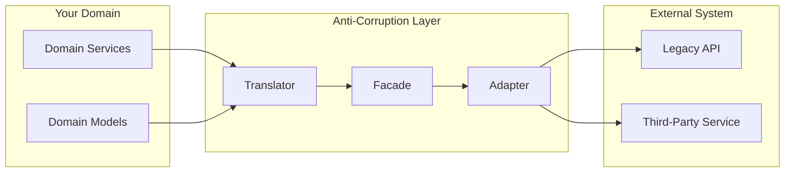
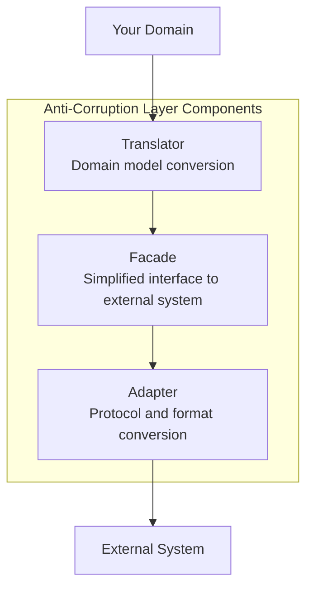
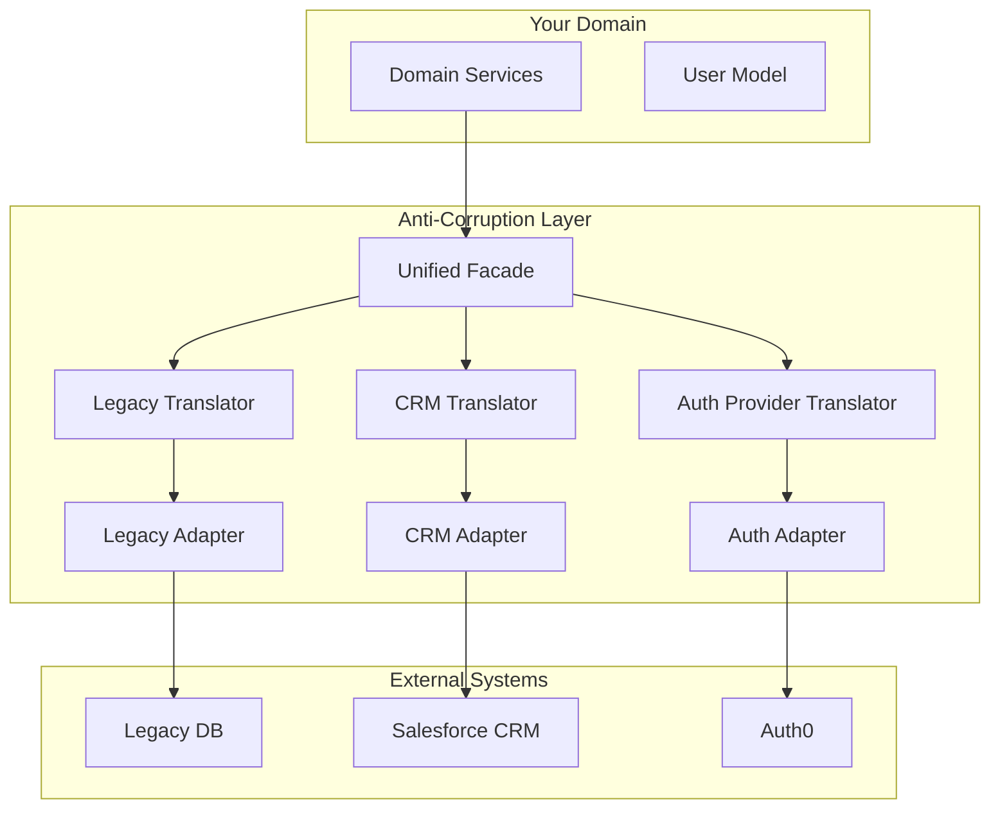

# How to Build the Anti-Corruption Layer Pattern

Author: [nawazdhandala](https://github.com/nawazdhandala)

Tags: Architecture, Microservices, Domain-Driven Design, Integration, Patterns

Description: A practical guide to implementing the Anti-Corruption Layer pattern for protecting your domain model when integrating with legacy systems, third-party APIs, and external services.

---

Your clean domain model does not need to know that the legacy system stores names as `FIRST_NM` and `LAST_NM` in uppercase. It does not need to understand that dates come back as strings in six different formats depending on which endpoint you call. The Anti-Corruption Layer (ACL) exists to protect your bounded context from the mess of external systems.

## What is the Anti-Corruption Layer?

The Anti-Corruption Layer is a pattern from Domain-Driven Design that creates a boundary between your system and external systems. It translates between two different domain models, preventing external concepts from leaking into your codebase.



Think of the ACL as a translator at a border crossing. Your domain speaks one language, the external system speaks another. The ACL handles all the translation so both sides can remain blissfully ignorant of each other.

## When You Need an Anti-Corruption Layer

Build an ACL when:

- Integrating with legacy systems that use different naming conventions or data structures
- Consuming third-party APIs with models that do not match your domain
- Migrating from a monolith where you need to isolate new services from old code
- Working with multiple external systems that represent the same concept differently
- Protecting your domain from breaking changes in external APIs

Skip the ACL when:

- The external system's model genuinely matches your domain
- You are building a thin wrapper with no business logic
- The integration is temporary and will be removed soon

## Core Components of an ACL

An Anti-Corruption Layer typically has three components working together:



**Translator**: Converts between your domain model and the external model. This is where the core logic lives.

**Facade**: Provides a simplified interface to the external system, hiding complexity and exposing only what your domain needs.

**Adapter**: Handles protocol-level concerns like HTTP calls, authentication, retry logic, and error handling.

## Building the Translator Layer

The translator is the heart of the ACL. Here is a production-ready example for integrating with a legacy user management system.

### Define Your Clean Domain Model

This is the model your application uses internally. It follows your domain language and conventions.

```typescript
// domain/models/User.ts
export interface User {
  id: string;
  email: string;
  fullName: string;
  status: UserStatus;
  createdAt: Date;
  lastLoginAt: Date | null;
  preferences: UserPreferences;
}

export enum UserStatus {
  Active = 'active',
  Inactive = 'inactive',
  Pending = 'pending',
  Suspended = 'suspended',
}

export interface UserPreferences {
  timezone: string;
  language: string;
  emailNotifications: boolean;
  theme: 'light' | 'dark' | 'system';
}
```

### Define the External System Model

This represents the data structure from the legacy system. Keep it separate from your domain.

```typescript
// acl/legacy/LegacyUserTypes.ts
export interface LegacyUserRecord {
  USER_ID: number;
  EMAIL_ADDR: string;
  FIRST_NM: string;
  LAST_NM: string;
  MIDDLE_NM: string | null;
  STAT_CD: string;
  CRTD_DT: string;       // Format: 'YYYYMMDD'
  LST_LGN_TS: string;    // Format: 'YYYY-MM-DD HH:mm:ss' or empty string
  TZ_CD: string;
  LANG_CD: string;
  EMAIL_NOTIF_FLG: 'Y' | 'N';
  THEME_PREF: string;
}
```

### Implement the Translator

The translator handles all conversions between these two models. Notice how it encapsulates all the messy mapping logic.

```typescript
// acl/translators/UserTranslator.ts
import { User, UserStatus, UserPreferences } from '../../domain/models/User';
import { LegacyUserRecord } from '../legacy/LegacyUserTypes';

export class UserTranslator {
  // Convert from legacy format to your domain model
  fromLegacy(legacy: LegacyUserRecord): User {
    return {
      id: String(legacy.USER_ID),
      email: legacy.EMAIL_ADDR.toLowerCase().trim(),
      fullName: this.buildFullName(legacy),
      status: this.mapStatus(legacy.STAT_CD),
      createdAt: this.parseLegacyDate(legacy.CRTD_DT),
      lastLoginAt: this.parseLegacyTimestamp(legacy.LST_LGN_TS),
      preferences: this.mapPreferences(legacy),
    };
  }

  // Convert from your domain model back to legacy format
  toLegacy(user: User): LegacyUserRecord {
    const nameParts = this.splitFullName(user.fullName);

    return {
      USER_ID: parseInt(user.id, 10),
      EMAIL_ADDR: user.email.toUpperCase(),
      FIRST_NM: nameParts.first.toUpperCase(),
      LAST_NM: nameParts.last.toUpperCase(),
      MIDDLE_NM: nameParts.middle?.toUpperCase() || null,
      STAT_CD: this.reverseMapStatus(user.status),
      CRTD_DT: this.formatLegacyDate(user.createdAt),
      LST_LGN_TS: user.lastLoginAt
        ? this.formatLegacyTimestamp(user.lastLoginAt)
        : '',
      TZ_CD: user.preferences.timezone,
      LANG_CD: user.preferences.language.toUpperCase(),
      EMAIL_NOTIF_FLG: user.preferences.emailNotifications ? 'Y' : 'N',
      THEME_PREF: user.preferences.theme.toUpperCase(),
    };
  }

  // Status mapping from legacy codes to domain enum
  private mapStatus(legacyCode: string): UserStatus {
    const statusMap: Record<string, UserStatus> = {
      'A': UserStatus.Active,
      'I': UserStatus.Inactive,
      'P': UserStatus.Pending,
      'S': UserStatus.Suspended,
      'D': UserStatus.Inactive, // Deleted users treated as inactive
    };

    const status = statusMap[legacyCode];
    if (!status) {
      console.warn(`Unknown legacy status code: ${legacyCode}, defaulting to Inactive`);
      return UserStatus.Inactive;
    }
    return status;
  }

  // Reverse status mapping for writes back to legacy
  private reverseMapStatus(status: UserStatus): string {
    const reverseMap: Record<UserStatus, string> = {
      [UserStatus.Active]: 'A',
      [UserStatus.Inactive]: 'I',
      [UserStatus.Pending]: 'P',
      [UserStatus.Suspended]: 'S',
    };
    return reverseMap[status];
  }

  // Parse legacy date format YYYYMMDD into Date object
  private parseLegacyDate(dateStr: string): Date {
    if (!dateStr || dateStr.length !== 8) {
      return new Date(0);
    }
    const year = parseInt(dateStr.substring(0, 4), 10);
    const month = parseInt(dateStr.substring(4, 6), 10) - 1;
    const day = parseInt(dateStr.substring(6, 8), 10);
    return new Date(year, month, day);
  }

  // Parse legacy timestamp or return null for empty strings
  private parseLegacyTimestamp(timestamp: string): Date | null {
    if (!timestamp || timestamp.trim() === '') {
      return null;
    }
    const parsed = new Date(timestamp);
    return isNaN(parsed.getTime()) ? null : parsed;
  }

  // Format Date back to legacy YYYYMMDD format
  private formatLegacyDate(date: Date): string {
    const year = date.getFullYear();
    const month = String(date.getMonth() + 1).padStart(2, '0');
    const day = String(date.getDate()).padStart(2, '0');
    return `${year}${month}${day}`;
  }

  // Format Date to legacy timestamp format
  private formatLegacyTimestamp(date: Date): string {
    return date.toISOString().replace('T', ' ').substring(0, 19);
  }

  // Build full name from legacy name fields
  private buildFullName(legacy: LegacyUserRecord): string {
    const parts = [legacy.FIRST_NM, legacy.MIDDLE_NM, legacy.LAST_NM]
      .filter(Boolean)
      .map(part => this.titleCase(part as string));
    return parts.join(' ');
  }

  // Split full name back into parts for legacy system
  private splitFullName(fullName: string): { first: string; middle: string | null; last: string } {
    const parts = fullName.trim().split(/\s+/);

    if (parts.length === 1) {
      return { first: parts[0], middle: null, last: '' };
    }
    if (parts.length === 2) {
      return { first: parts[0], middle: null, last: parts[1] };
    }
    return {
      first: parts[0],
      middle: parts.slice(1, -1).join(' '),
      last: parts[parts.length - 1],
    };
  }

  // Convert uppercase legacy names to title case
  private titleCase(str: string): string {
    return str.toLowerCase().replace(/\b\w/g, c => c.toUpperCase());
  }

  // Map legacy preference fields to domain preferences object
  private mapPreferences(legacy: LegacyUserRecord): UserPreferences {
    return {
      timezone: legacy.TZ_CD || 'UTC',
      language: legacy.LANG_CD?.toLowerCase() || 'en',
      emailNotifications: legacy.EMAIL_NOTIF_FLG === 'Y',
      theme: this.mapTheme(legacy.THEME_PREF),
    };
  }

  // Map legacy theme codes to domain theme type
  private mapTheme(legacyTheme: string): 'light' | 'dark' | 'system' {
    const themeMap: Record<string, 'light' | 'dark' | 'system'> = {
      'LT': 'light',
      'DK': 'dark',
      'SY': 'system',
      'LIGHT': 'light',
      'DARK': 'dark',
      'SYSTEM': 'system',
    };
    return themeMap[legacyTheme?.toUpperCase()] || 'system';
  }
}
```

## Building the Adapter Layer

The adapter handles all communication with the external system. It deals with HTTP requests, authentication, retries, and error handling.

```typescript
// acl/adapters/LegacyUserAdapter.ts
import axios, { AxiosInstance, AxiosError } from 'axios';
import { LegacyUserRecord } from '../legacy/LegacyUserTypes';

export interface LegacyUserAdapterConfig {
  baseUrl: string;
  apiKey: string;
  timeoutMs: number;
  maxRetries: number;
}

export class LegacyUserAdapter {
  private client: AxiosInstance;
  private maxRetries: number;

  constructor(config: LegacyUserAdapterConfig) {
    this.maxRetries = config.maxRetries;

    // Configure axios client with base settings
    this.client = axios.create({
      baseURL: config.baseUrl,
      timeout: config.timeoutMs,
      headers: {
        'X-API-Key': config.apiKey,
        'Content-Type': 'application/json',
      },
    });

    // Add response interceptor for logging
    this.client.interceptors.response.use(
      response => response,
      error => this.handleError(error)
    );
  }

  // Fetch a single user by ID from the legacy system
  async fetchUser(userId: string): Promise<LegacyUserRecord | null> {
    try {
      const response = await this.retryRequest(
        () => this.client.get<LegacyUserRecord>(`/users/${userId}`)
      );
      return response.data;
    } catch (error) {
      if (this.isNotFoundError(error)) {
        return null;
      }
      throw error;
    }
  }

  // Fetch multiple users with pagination
  async fetchUsers(page: number, pageSize: number): Promise<LegacyUserRecord[]> {
    const response = await this.retryRequest(
      () => this.client.get<{ records: LegacyUserRecord[] }>('/users', {
        params: { page, limit: pageSize },
      })
    );
    return response.data.records;
  }

  // Update a user in the legacy system
  async updateUser(userId: string, data: Partial<LegacyUserRecord>): Promise<LegacyUserRecord> {
    const response = await this.retryRequest(
      () => this.client.put<LegacyUserRecord>(`/users/${userId}`, data)
    );
    return response.data;
  }

  // Create a new user in the legacy system
  async createUser(data: Omit<LegacyUserRecord, 'USER_ID'>): Promise<LegacyUserRecord> {
    const response = await this.retryRequest(
      () => this.client.post<LegacyUserRecord>('/users', data)
    );
    return response.data;
  }

  // Retry logic with exponential backoff
  private async retryRequest<T>(
    request: () => Promise<T>,
    attempt: number = 1
  ): Promise<T> {
    try {
      return await request();
    } catch (error) {
      if (attempt >= this.maxRetries || !this.isRetryableError(error)) {
        throw error;
      }

      const delayMs = Math.min(1000 * Math.pow(2, attempt - 1), 10000);
      console.log(`Retry attempt ${attempt} after ${delayMs}ms`);

      await this.delay(delayMs);
      return this.retryRequest(request, attempt + 1);
    }
  }

  // Check if error is retryable (network issues, 5xx errors)
  private isRetryableError(error: unknown): boolean {
    if (error instanceof AxiosError) {
      if (!error.response) return true; // Network error
      return error.response.status >= 500;
    }
    return false;
  }

  // Check if error is a 404 not found
  private isNotFoundError(error: unknown): boolean {
    return error instanceof AxiosError && error.response?.status === 404;
  }

  // Transform errors into domain-specific exceptions
  private handleError(error: AxiosError): never {
    const status = error.response?.status;
    const message = error.message;

    console.error('Legacy API error:', {
      status,
      message,
      url: error.config?.url,
    });

    throw error;
  }

  private delay(ms: number): Promise<void> {
    return new Promise(resolve => setTimeout(resolve, ms));
  }
}
```

## Building the Facade Layer

The facade provides a clean interface that your domain services use. It combines the adapter and translator, exposing operations in terms of your domain model.

```typescript
// acl/facades/UserFacade.ts
import { User } from '../../domain/models/User';
import { UserTranslator } from '../translators/UserTranslator';
import { LegacyUserAdapter } from '../adapters/LegacyUserAdapter';

export class UserFacade {
  private translator: UserTranslator;
  private adapter: LegacyUserAdapter;

  constructor(adapter: LegacyUserAdapter) {
    this.translator = new UserTranslator();
    this.adapter = adapter;
  }

  // Get a user by ID, returning your domain model
  async getUser(userId: string): Promise<User | null> {
    const legacyUser = await this.adapter.fetchUser(userId);

    if (!legacyUser) {
      return null;
    }

    return this.translator.fromLegacy(legacyUser);
  }

  // Get multiple users with pagination
  async getUsers(page: number, pageSize: number = 50): Promise<User[]> {
    const legacyUsers = await this.adapter.fetchUsers(page, pageSize);
    return legacyUsers.map(legacy => this.translator.fromLegacy(legacy));
  }

  // Update a user, accepting your domain model
  async updateUser(user: User): Promise<User> {
    const legacyData = this.translator.toLegacy(user);
    const updated = await this.adapter.updateUser(user.id, legacyData);
    return this.translator.fromLegacy(updated);
  }

  // Create a new user from your domain model
  async createUser(user: Omit<User, 'id'>): Promise<User> {
    // Generate a temporary user object for translation
    const tempUser = { ...user, id: '0' } as User;
    const legacyData = this.translator.toLegacy(tempUser);

    // Remove USER_ID since legacy system generates it
    const { USER_ID, ...createData } = legacyData;

    const created = await this.adapter.createUser(createData);
    return this.translator.fromLegacy(created);
  }
}
```

## Using the ACL in Your Application

Here is how your domain services consume the facade. Notice how the domain code has no knowledge of the legacy system.

```typescript
// domain/services/UserService.ts
import { User, UserStatus } from '../models/User';
import { UserFacade } from '../../acl/facades/UserFacade';

export class UserService {
  constructor(private userFacade: UserFacade) {}

  async getUserById(userId: string): Promise<User | null> {
    return this.userFacade.getUser(userId);
  }

  async activateUser(userId: string): Promise<User> {
    const user = await this.userFacade.getUser(userId);

    if (!user) {
      throw new Error(`User not found: ${userId}`);
    }

    if (user.status === UserStatus.Active) {
      return user;
    }

    const updatedUser: User = {
      ...user,
      status: UserStatus.Active,
    };

    return this.userFacade.updateUser(updatedUser);
  }

  async getActiveUsers(page: number): Promise<User[]> {
    const users = await this.userFacade.getUsers(page);
    return users.filter(user => user.status === UserStatus.Active);
  }
}
```

## Handling Multiple External Systems

Real applications often integrate with multiple external systems that represent the same concept differently. The ACL pattern handles this by creating separate translators for each system.



### Unified Facade for Multiple Sources

This facade aggregates data from multiple external systems into a single domain object.

```typescript
// acl/facades/UnifiedUserFacade.ts
import { User, UserStatus } from '../../domain/models/User';
import { UserTranslator } from '../translators/UserTranslator';
import { CrmContactTranslator } from '../translators/CrmContactTranslator';
import { AuthUserTranslator } from '../translators/AuthUserTranslator';
import { LegacyUserAdapter } from '../adapters/LegacyUserAdapter';
import { CrmAdapter } from '../adapters/CrmAdapter';
import { AuthAdapter } from '../adapters/AuthAdapter';

export class UnifiedUserFacade {
  private legacyTranslator: UserTranslator;
  private crmTranslator: CrmContactTranslator;
  private authTranslator: AuthUserTranslator;

  constructor(
    private legacyAdapter: LegacyUserAdapter,
    private crmAdapter: CrmAdapter,
    private authAdapter: AuthAdapter
  ) {
    this.legacyTranslator = new UserTranslator();
    this.crmTranslator = new CrmContactTranslator();
    this.authTranslator = new AuthUserTranslator();
  }

  // Get enriched user by combining data from multiple sources
  async getEnrichedUser(userId: string): Promise<User | null> {
    // Fetch from all sources in parallel
    const [legacyUser, crmContact, authUser] = await Promise.all([
      this.legacyAdapter.fetchUser(userId),
      this.crmAdapter.fetchContact(userId).catch(() => null),
      this.authAdapter.fetchUser(userId).catch(() => null),
    ]);

    if (!legacyUser) {
      return null;
    }

    // Start with legacy as the base
    let user = this.legacyTranslator.fromLegacy(legacyUser);

    // Enrich with CRM data if available
    if (crmContact) {
      const crmUser = this.crmTranslator.fromCrm(crmContact);
      user = this.mergeUserData(user, crmUser);
    }

    // Override auth-related fields from auth provider
    if (authUser) {
      const authData = this.authTranslator.fromAuth(authUser);
      user = {
        ...user,
        email: authData.email, // Auth provider is source of truth for email
        lastLoginAt: authData.lastLoginAt,
      };
    }

    return user;
  }

  // Merge user data, preferring non-null values from enrichment source
  private mergeUserData(base: User, enrichment: Partial<User>): User {
    return {
      ...base,
      ...Object.fromEntries(
        Object.entries(enrichment).filter(([_, value]) => value != null)
      ),
    } as User;
  }
}
```

## Testing Your Anti-Corruption Layer

Test the ACL at multiple levels: unit tests for translators, integration tests for adapters, and contract tests for the full layer.

### Unit Testing Translators

Translator tests verify that mapping logic handles all edge cases correctly.

```typescript
// tests/acl/translators/UserTranslator.test.ts
import { UserTranslator } from '../../../acl/translators/UserTranslator';
import { UserStatus } from '../../../domain/models/User';
import { LegacyUserRecord } from '../../../acl/legacy/LegacyUserTypes';

describe('UserTranslator', () => {
  let translator: UserTranslator;

  beforeEach(() => {
    translator = new UserTranslator();
  });

  describe('fromLegacy', () => {
    it('converts legacy user to domain model', () => {
      const legacy: LegacyUserRecord = {
        USER_ID: 12345,
        EMAIL_ADDR: 'JOHN.DOE@EXAMPLE.COM',
        FIRST_NM: 'JOHN',
        LAST_NM: 'DOE',
        MIDDLE_NM: null,
        STAT_CD: 'A',
        CRTD_DT: '20230115',
        LST_LGN_TS: '2024-01-20 14:30:00',
        TZ_CD: 'America/New_York',
        LANG_CD: 'EN',
        EMAIL_NOTIF_FLG: 'Y',
        THEME_PREF: 'DK',
      };

      const user = translator.fromLegacy(legacy);

      expect(user.id).toBe('12345');
      expect(user.email).toBe('john.doe@example.com');
      expect(user.fullName).toBe('John Doe');
      expect(user.status).toBe(UserStatus.Active);
      expect(user.preferences.theme).toBe('dark');
      expect(user.preferences.emailNotifications).toBe(true);
    });

    it('handles missing middle name', () => {
      const legacy: LegacyUserRecord = {
        USER_ID: 1,
        EMAIL_ADDR: 'TEST@TEST.COM',
        FIRST_NM: 'JANE',
        LAST_NM: 'SMITH',
        MIDDLE_NM: 'MARIE',
        STAT_CD: 'A',
        CRTD_DT: '20230101',
        LST_LGN_TS: '',
        TZ_CD: 'UTC',
        LANG_CD: 'EN',
        EMAIL_NOTIF_FLG: 'N',
        THEME_PREF: 'LT',
      };

      const user = translator.fromLegacy(legacy);

      expect(user.fullName).toBe('Jane Marie Smith');
      expect(user.lastLoginAt).toBeNull();
    });

    it('maps unknown status codes to inactive', () => {
      const legacy = createLegacyUser({ STAT_CD: 'X' });
      const user = translator.fromLegacy(legacy);
      expect(user.status).toBe(UserStatus.Inactive);
    });
  });

  describe('toLegacy', () => {
    it('converts domain user back to legacy format', () => {
      const user = {
        id: '12345',
        email: 'john.doe@example.com',
        fullName: 'John Doe',
        status: UserStatus.Active,
        createdAt: new Date('2023-01-15'),
        lastLoginAt: new Date('2024-01-20T14:30:00Z'),
        preferences: {
          timezone: 'America/New_York',
          language: 'en',
          emailNotifications: true,
          theme: 'dark' as const,
        },
      };

      const legacy = translator.toLegacy(user);

      expect(legacy.USER_ID).toBe(12345);
      expect(legacy.EMAIL_ADDR).toBe('JOHN.DOE@EXAMPLE.COM');
      expect(legacy.FIRST_NM).toBe('JOHN');
      expect(legacy.LAST_NM).toBe('DOE');
      expect(legacy.STAT_CD).toBe('A');
      expect(legacy.EMAIL_NOTIF_FLG).toBe('Y');
    });

    it('round-trips data correctly', () => {
      const original = createLegacyUser({});
      const domain = translator.fromLegacy(original);
      const roundTripped = translator.toLegacy(domain);

      expect(roundTripped.USER_ID).toBe(original.USER_ID);
      expect(roundTripped.EMAIL_ADDR).toBe(original.EMAIL_ADDR);
      expect(roundTripped.STAT_CD).toBe(original.STAT_CD);
    });
  });
});

// Helper to create test legacy users with defaults
function createLegacyUser(overrides: Partial<LegacyUserRecord>): LegacyUserRecord {
  return {
    USER_ID: 1,
    EMAIL_ADDR: 'TEST@EXAMPLE.COM',
    FIRST_NM: 'TEST',
    LAST_NM: 'USER',
    MIDDLE_NM: null,
    STAT_CD: 'A',
    CRTD_DT: '20230101',
    LST_LGN_TS: '',
    TZ_CD: 'UTC',
    LANG_CD: 'EN',
    EMAIL_NOTIF_FLG: 'Y',
    THEME_PREF: 'SYSTEM',
    ...overrides,
  };
}
```

### Integration Testing with Mock Servers

Test the adapter against a mock server to verify HTTP behavior.

```typescript
// tests/acl/adapters/LegacyUserAdapter.integration.test.ts
import { setupServer } from 'msw/node';
import { http, HttpResponse } from 'msw';
import { LegacyUserAdapter } from '../../../acl/adapters/LegacyUserAdapter';

const server = setupServer();

beforeAll(() => server.listen());
afterEach(() => server.resetHandlers());
afterAll(() => server.close());

describe('LegacyUserAdapter', () => {
  let adapter: LegacyUserAdapter;

  beforeEach(() => {
    adapter = new LegacyUserAdapter({
      baseUrl: 'http://legacy-api.test',
      apiKey: 'test-key',
      timeoutMs: 5000,
      maxRetries: 3,
    });
  });

  it('fetches user successfully', async () => {
    const mockUser = {
      USER_ID: 123,
      EMAIL_ADDR: 'TEST@TEST.COM',
      FIRST_NM: 'TEST',
      LAST_NM: 'USER',
      STAT_CD: 'A',
    };

    server.use(
      http.get('http://legacy-api.test/users/123', () => {
        return HttpResponse.json(mockUser);
      })
    );

    const result = await adapter.fetchUser('123');
    expect(result?.USER_ID).toBe(123);
  });

  it('returns null for 404 responses', async () => {
    server.use(
      http.get('http://legacy-api.test/users/999', () => {
        return new HttpResponse(null, { status: 404 });
      })
    );

    const result = await adapter.fetchUser('999');
    expect(result).toBeNull();
  });

  it('retries on server errors', async () => {
    let attempts = 0;

    server.use(
      http.get('http://legacy-api.test/users/123', () => {
        attempts++;
        if (attempts < 3) {
          return new HttpResponse(null, { status: 500 });
        }
        return HttpResponse.json({ USER_ID: 123 });
      })
    );

    const result = await adapter.fetchUser('123');
    expect(result?.USER_ID).toBe(123);
    expect(attempts).toBe(3);
  });
});
```

## Monitoring Your ACL

Add observability to track translation errors and external system health.

```typescript
// acl/monitoring/AclMetrics.ts
import { Counter, Histogram, Gauge } from 'prom-client';

export class AclMetrics {
  // Count translation operations by source system and success/failure
  private translationCounter = new Counter({
    name: 'acl_translations_total',
    help: 'Total number of translation operations',
    labelNames: ['source', 'direction', 'status'],
  });

  // Track translation latency
  private translationDuration = new Histogram({
    name: 'acl_translation_duration_seconds',
    help: 'Time spent translating between models',
    labelNames: ['source', 'direction'],
    buckets: [0.001, 0.005, 0.01, 0.05, 0.1],
  });

  // Track external system call latency
  private externalCallDuration = new Histogram({
    name: 'acl_external_call_duration_seconds',
    help: 'Time spent calling external systems',
    labelNames: ['system', 'operation'],
    buckets: [0.1, 0.25, 0.5, 1, 2.5, 5, 10],
  });

  // Track data quality issues
  private dataQualityIssues = new Counter({
    name: 'acl_data_quality_issues_total',
    help: 'Count of data quality issues encountered during translation',
    labelNames: ['source', 'field', 'issue_type'],
  });

  recordTranslation(source: string, direction: 'inbound' | 'outbound', success: boolean, durationMs: number): void {
    this.translationCounter.inc({ source, direction, status: success ? 'success' : 'failure' });
    this.translationDuration.observe({ source, direction }, durationMs / 1000);
  }

  recordExternalCall(system: string, operation: string, durationMs: number): void {
    this.externalCallDuration.observe({ system, operation }, durationMs / 1000);
  }

  recordDataQualityIssue(source: string, field: string, issueType: string): void {
    this.dataQualityIssues.inc({ source, field, issue_type: issueType });
  }
}
```

### Instrumented Translator

Wrap your translator with metrics collection.

```typescript
// acl/translators/InstrumentedUserTranslator.ts
import { User } from '../../domain/models/User';
import { LegacyUserRecord } from '../legacy/LegacyUserTypes';
import { UserTranslator } from './UserTranslator';
import { AclMetrics } from '../monitoring/AclMetrics';

export class InstrumentedUserTranslator {
  constructor(
    private translator: UserTranslator,
    private metrics: AclMetrics
  ) {}

  fromLegacy(legacy: LegacyUserRecord): User {
    const start = Date.now();
    let success = true;

    try {
      const result = this.translator.fromLegacy(legacy);

      // Check for data quality issues
      this.checkDataQuality(legacy);

      return result;
    } catch (error) {
      success = false;
      throw error;
    } finally {
      this.metrics.recordTranslation('legacy', 'inbound', success, Date.now() - start);
    }
  }

  toLegacy(user: User): LegacyUserRecord {
    const start = Date.now();
    let success = true;

    try {
      return this.translator.toLegacy(user);
    } catch (error) {
      success = false;
      throw error;
    } finally {
      this.metrics.recordTranslation('legacy', 'outbound', success, Date.now() - start);
    }
  }

  private checkDataQuality(legacy: LegacyUserRecord): void {
    if (!legacy.EMAIL_ADDR?.includes('@')) {
      this.metrics.recordDataQualityIssue('legacy', 'email', 'invalid_format');
    }
    if (!legacy.CRTD_DT || legacy.CRTD_DT.length !== 8) {
      this.metrics.recordDataQualityIssue('legacy', 'created_date', 'invalid_format');
    }
  }
}
```

## Common Pitfalls and How to Avoid Them

**Pitfall 1: Leaky Abstractions**

The ACL should completely hide external system details. If your domain code needs to know about legacy field names or codes, the abstraction is leaking.

**Pitfall 2: Bidirectional Coupling**

Changes in your domain model should not require changes to external systems, and vice versa. The translator should absorb all differences.

**Pitfall 3: Missing Error Translation**

External systems throw their own error types. Translate these into domain-specific exceptions so your code does not catch `AxiosError` everywhere.

**Pitfall 4: Incomplete Testing**

Test edge cases in your translator: null values, empty strings, unknown codes, malformed data. These are where bugs hide.

**Pitfall 5: Performance Bottleneck**

The ACL adds overhead. Cache translated results when appropriate, and batch external system calls when possible.

## Summary

The Anti-Corruption Layer protects your domain from external system complexity. Build it in three layers:

1. **Adapter**: Handles protocol-level concerns (HTTP, auth, retries)
2. **Translator**: Converts between domain models and external formats
3. **Facade**: Exposes clean operations in your domain's language

Test each layer independently. Monitor translation metrics and data quality. When integrating with multiple systems, create separate translators and merge data in the facade.

Your domain code should never know it is talking to a legacy system from 1998 that stores everything in uppercase with two-letter codes. That is what the Anti-Corruption Layer is for.
