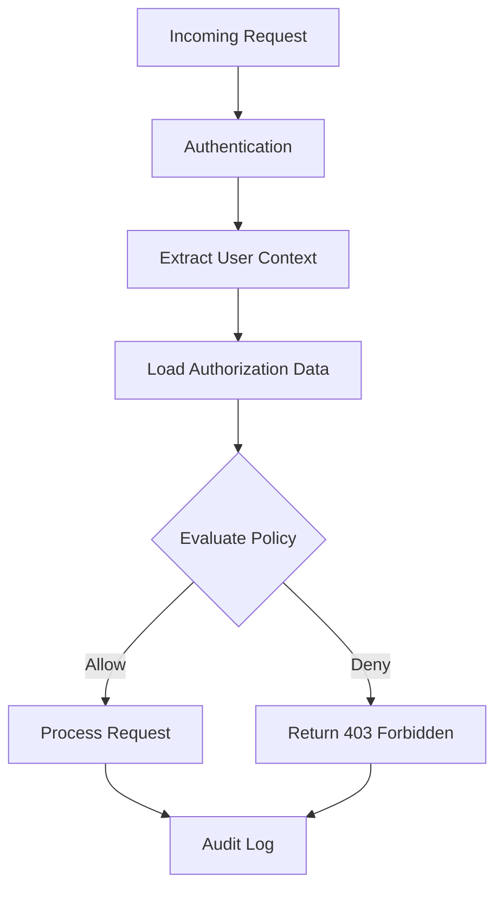
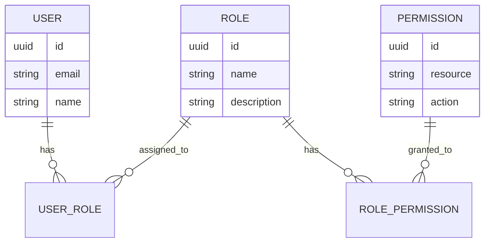
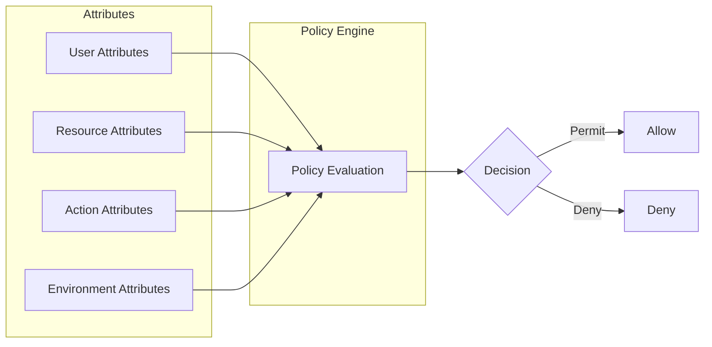
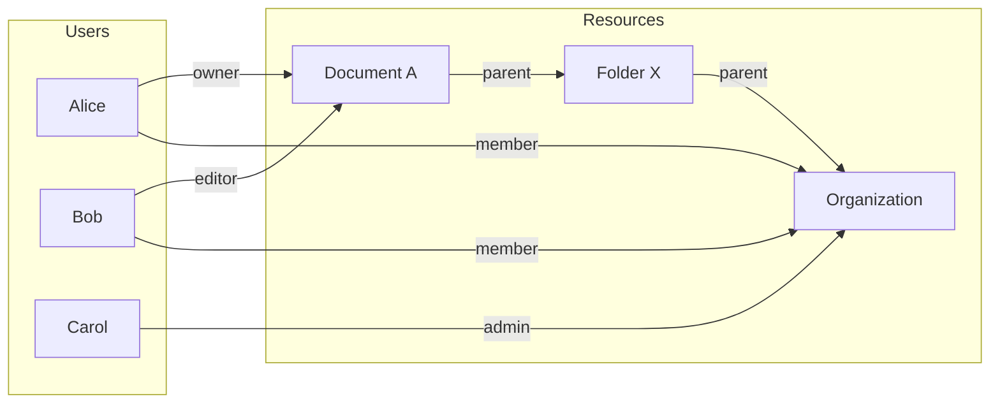
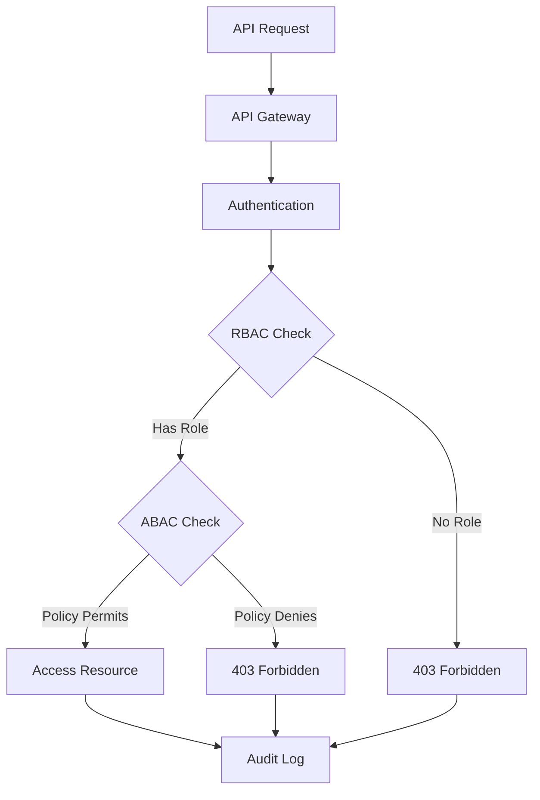
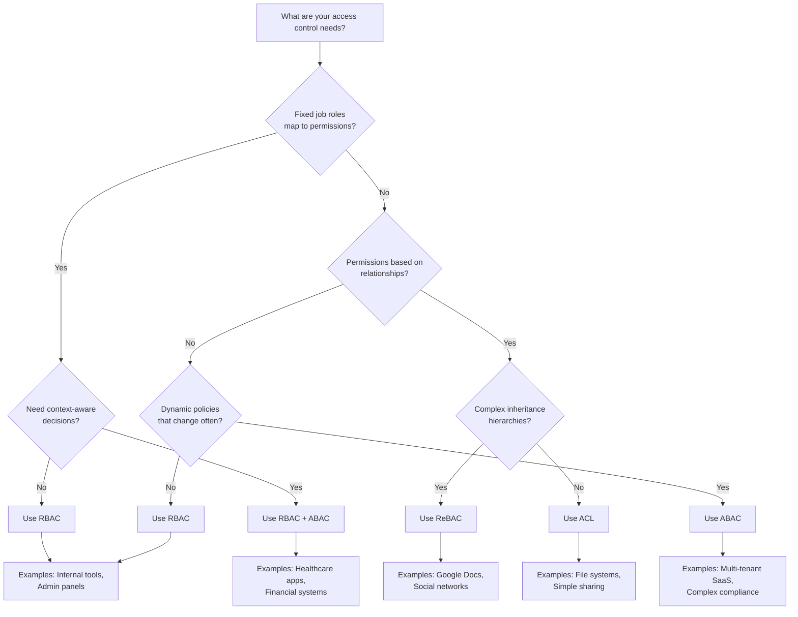

# How to Implement API Authorization Patterns

Author: [nawazdhandala](https://github.com/nawazdhandala)

Tags: API, Security, Authorization, RBAC, ABAC, Backend, Node.js, Python

Description: A comprehensive guide to implementing API authorization patterns including RBAC, ABAC, and ReBAC with production-ready code examples and decision frameworks.

---

Authentication tells you who someone is. Authorization tells you what they can do. While authentication gets most of the attention, authorization is where security models either shine or fall apart. This guide covers the major API authorization patterns, when to use each, and how to implement them in production.

## Authorization Patterns Overview

Before diving into code, understand what each pattern offers:

| Pattern | Best For | Complexity | Flexibility |
|---------|----------|------------|-------------|
| **RBAC** | Simple apps with fixed roles | Low | Low |
| **ABAC** | Dynamic, context-aware decisions | High | High |
| **ReBAC** | Social apps, shared resources | Medium | Medium |
| **ACL** | File systems, individual resources | Low | Medium |
| **Policy-Based** | Complex enterprise requirements | High | Very High |

## The Authorization Decision Flow

Understanding how authorization decisions flow through your system helps you design better architectures.



## Role-Based Access Control (RBAC)

RBAC assigns permissions to roles, then assigns roles to users. It works well when your access patterns map cleanly to job functions.

### RBAC Data Model



### Implementing RBAC in Node.js

This implementation uses a class-based approach with in-memory storage. In production, you would replace the in-memory maps with database queries.

```javascript
// rbac.js - Role-Based Access Control implementation
class RBAC {
  constructor() {
    // Store roles and their associated permissions
    // Format: { roleName: Set(['resource:action', ...]) }
    this.roles = new Map();

    // Store user-to-role assignments
    // Format: { userId: Set(['roleName', ...]) }
    this.userRoles = new Map();
  }

  // Define a role with its permissions
  // permissions should be an array of strings like ['posts:read', 'posts:write']
  defineRole(roleName, permissions) {
    this.roles.set(roleName, new Set(permissions));
  }

  // Assign a role to a user
  assignRole(userId, roleName) {
    if (!this.roles.has(roleName)) {
      throw new Error(`Role ${roleName} does not exist`);
    }

    if (!this.userRoles.has(userId)) {
      this.userRoles.set(userId, new Set());
    }

    this.userRoles.get(userId).add(roleName);
  }

  // Remove a role from a user
  revokeRole(userId, roleName) {
    const roles = this.userRoles.get(userId);
    if (roles) {
      roles.delete(roleName);
    }
  }

  // Check if a user has a specific permission
  // permission format: 'resource:action' e.g., 'posts:delete'
  hasPermission(userId, permission) {
    const userRoleSet = this.userRoles.get(userId);

    if (!userRoleSet) {
      return false;
    }

    // Check each role the user has
    for (const roleName of userRoleSet) {
      const rolePermissions = this.roles.get(roleName);

      if (rolePermissions && rolePermissions.has(permission)) {
        return true;
      }

      // Check for wildcard permissions like 'posts:*' or '*:read'
      if (this.checkWildcard(rolePermissions, permission)) {
        return true;
      }
    }

    return false;
  }

  // Handle wildcard permission matching
  checkWildcard(permissions, requested) {
    if (!permissions) return false;

    const [resource, action] = requested.split(':');

    // Check for full wildcard
    if (permissions.has('*:*')) return true;

    // Check for resource wildcard (e.g., 'posts:*')
    if (permissions.has(`${resource}:*`)) return true;

    // Check for action wildcard (e.g., '*:read')
    if (permissions.has(`*:${action}`)) return true;

    return false;
  }

  // Get all permissions for a user (useful for debugging)
  getUserPermissions(userId) {
    const userRoleSet = this.userRoles.get(userId);
    const allPermissions = new Set();

    if (!userRoleSet) return allPermissions;

    for (const roleName of userRoleSet) {
      const rolePermissions = this.roles.get(roleName);
      if (rolePermissions) {
        rolePermissions.forEach(p => allPermissions.add(p));
      }
    }

    return allPermissions;
  }
}

// Initialize RBAC with common roles
const rbac = new RBAC();

// Define roles with their permissions
rbac.defineRole('viewer', [
  'posts:read',
  'comments:read',
  'profiles:read'
]);

rbac.defineRole('editor', [
  'posts:read',
  'posts:write',
  'posts:update',
  'comments:read',
  'comments:write',
  'profiles:read'
]);

rbac.defineRole('admin', [
  '*:*'  // Full access to everything
]);

rbac.defineRole('moderator', [
  'posts:read',
  'posts:update',
  'posts:delete',
  'comments:*',  // All comment operations
  'users:read',
  'users:suspend'
]);

module.exports = rbac;
```

### Express Middleware for RBAC

Create middleware that checks permissions on each route.

```javascript
// middleware/authorize.js
const rbac = require('./rbac');

// Creates middleware that checks if user has required permission
// Usage: app.delete('/posts/:id', authorize('posts:delete'), handler)
function authorize(permission) {
  return (req, res, next) => {
    // Assumes authentication middleware has already set req.user
    const userId = req.user?.id;

    if (!userId) {
      return res.status(401).json({
        error: 'Authentication required'
      });
    }

    if (!rbac.hasPermission(userId, permission)) {
      // Log the authorization failure for security monitoring
      console.warn(`Authorization denied: user=${userId} permission=${permission}`);

      return res.status(403).json({
        error: 'Insufficient permissions',
        required: permission
      });
    }

    next();
  };
}

// Check multiple permissions (user must have ALL)
function authorizeAll(...permissions) {
  return (req, res, next) => {
    const userId = req.user?.id;

    if (!userId) {
      return res.status(401).json({ error: 'Authentication required' });
    }

    const missing = permissions.filter(p => !rbac.hasPermission(userId, p));

    if (missing.length > 0) {
      return res.status(403).json({
        error: 'Insufficient permissions',
        missing: missing
      });
    }

    next();
  };
}

// Check multiple permissions (user must have ANY)
function authorizeAny(...permissions) {
  return (req, res, next) => {
    const userId = req.user?.id;

    if (!userId) {
      return res.status(401).json({ error: 'Authentication required' });
    }

    const hasAny = permissions.some(p => rbac.hasPermission(userId, p));

    if (!hasAny) {
      return res.status(403).json({
        error: 'Insufficient permissions',
        required: `One of: ${permissions.join(', ')}`
      });
    }

    next();
  };
}

module.exports = { authorize, authorizeAll, authorizeAny };
```

### Using RBAC in Routes

```javascript
// routes/posts.js
const express = require('express');
const router = express.Router();
const { authorize, authorizeAny } = require('../middleware/authorize');

// Anyone with posts:read can list posts
router.get('/', authorize('posts:read'), async (req, res) => {
  const posts = await Post.findAll();
  res.json(posts);
});

// Creating posts requires posts:write
router.post('/', authorize('posts:write'), async (req, res) => {
  const post = await Post.create({
    ...req.body,
    authorId: req.user.id
  });
  res.status(201).json(post);
});

// Updating requires posts:update
router.put('/:id', authorize('posts:update'), async (req, res) => {
  const post = await Post.findByPk(req.params.id);

  if (!post) {
    return res.status(404).json({ error: 'Post not found' });
  }

  await post.update(req.body);
  res.json(post);
});

// Deleting requires posts:delete
router.delete('/:id', authorize('posts:delete'), async (req, res) => {
  const post = await Post.findByPk(req.params.id);

  if (!post) {
    return res.status(404).json({ error: 'Post not found' });
  }

  await post.destroy();
  res.status(204).send();
});

// Publishing requires either posts:publish OR admin rights
router.post('/:id/publish', authorizeAny('posts:publish', 'admin:*'), async (req, res) => {
  const post = await Post.findByPk(req.params.id);
  await post.update({ status: 'published', publishedAt: new Date() });
  res.json(post);
});

module.exports = router;
```

## Attribute-Based Access Control (ABAC)

ABAC makes decisions based on attributes of the user, resource, action, and environment. It handles complex scenarios that RBAC cannot express.

### ABAC Concepts



### Implementing ABAC in Python

This implementation provides a flexible policy engine that evaluates rules against attributes.

```python
# abac.py - Attribute-Based Access Control implementation
from dataclasses import dataclass
from typing import Any, Callable, Dict, List, Optional
from datetime import datetime, time
from enum import Enum


class Decision(Enum):
    """Possible authorization decisions"""
    PERMIT = "permit"
    DENY = "deny"
    NOT_APPLICABLE = "not_applicable"


@dataclass
class AccessRequest:
    """Represents an authorization request with all relevant attributes"""
    # User attributes
    user_id: str
    user_role: str
    user_department: str
    user_clearance: int

    # Resource attributes
    resource_type: str
    resource_id: str
    resource_owner: str
    resource_classification: str

    # Action being performed
    action: str

    # Environment attributes
    ip_address: str
    request_time: datetime

    # Additional custom attributes
    custom: Dict[str, Any] = None


class Policy:
    """
    A policy that can evaluate access requests.
    Policies consist of conditions and an effect (permit/deny).
    """
    def __init__(
        self,
        name: str,
        effect: Decision,
        conditions: List[Callable[[AccessRequest], bool]],
        priority: int = 0
    ):
        self.name = name
        self.effect = effect
        self.conditions = conditions
        self.priority = priority

    def evaluate(self, request: AccessRequest) -> Decision:
        """
        Evaluate this policy against the request.
        Returns the effect if all conditions match, NOT_APPLICABLE otherwise.
        """
        try:
            # All conditions must be true for the policy to apply
            if all(condition(request) for condition in self.conditions):
                return self.effect
            return Decision.NOT_APPLICABLE
        except Exception as e:
            # If any condition throws, policy doesn't apply
            print(f"Policy {self.name} evaluation error: {e}")
            return Decision.NOT_APPLICABLE


class ABACEngine:
    """
    The ABAC policy decision point.
    Evaluates all policies and combines their decisions.
    """
    def __init__(self, default_decision: Decision = Decision.DENY):
        self.policies: List[Policy] = []
        self.default_decision = default_decision

    def add_policy(self, policy: Policy):
        """Add a policy to the engine"""
        self.policies.append(policy)
        # Keep policies sorted by priority (higher priority first)
        self.policies.sort(key=lambda p: p.priority, reverse=True)

    def evaluate(self, request: AccessRequest) -> tuple[Decision, str]:
        """
        Evaluate all policies against the request.
        Returns (decision, reason) tuple.
        Uses deny-overrides combining algorithm.
        """
        applicable_policies = []

        for policy in self.policies:
            decision = policy.evaluate(request)

            if decision != Decision.NOT_APPLICABLE:
                applicable_policies.append((policy, decision))

                # Deny-overrides: any deny immediately returns deny
                if decision == Decision.DENY:
                    return Decision.DENY, f"Denied by policy: {policy.name}"

        # If any policy permitted, allow access
        for policy, decision in applicable_policies:
            if decision == Decision.PERMIT:
                return Decision.PERMIT, f"Permitted by policy: {policy.name}"

        # No applicable policies, use default
        return self.default_decision, "No applicable policy found"


# Common condition builders for reusable policy components
class Conditions:
    """Factory methods for common conditions"""

    @staticmethod
    def user_has_role(*roles: str):
        """Check if user has any of the specified roles"""
        def condition(req: AccessRequest) -> bool:
            return req.user_role in roles
        return condition

    @staticmethod
    def user_in_department(*departments: str):
        """Check if user is in any of the specified departments"""
        def condition(req: AccessRequest) -> bool:
            return req.user_department in departments
        return condition

    @staticmethod
    def resource_type_is(*types: str):
        """Check if resource is any of the specified types"""
        def condition(req: AccessRequest) -> bool:
            return req.resource_type in types
        return condition

    @staticmethod
    def action_is(*actions: str):
        """Check if action is any of the specified actions"""
        def condition(req: AccessRequest) -> bool:
            return req.action in actions
        return condition

    @staticmethod
    def is_resource_owner():
        """Check if user owns the resource"""
        def condition(req: AccessRequest) -> bool:
            return req.user_id == req.resource_owner
        return condition

    @staticmethod
    def during_business_hours(start: int = 9, end: int = 17):
        """Check if request is during business hours"""
        def condition(req: AccessRequest) -> bool:
            hour = req.request_time.hour
            return start <= hour < end
        return condition

    @staticmethod
    def clearance_at_least(level: int):
        """Check if user has sufficient clearance level"""
        def condition(req: AccessRequest) -> bool:
            return req.user_clearance >= level
        return condition

    @staticmethod
    def from_internal_network(*prefixes: str):
        """Check if request comes from internal IP ranges"""
        def condition(req: AccessRequest) -> bool:
            return any(req.ip_address.startswith(p) for p in prefixes)
        return condition

    @staticmethod
    def classification_at_most(classification: str):
        """Check resource classification against allowed levels"""
        levels = {"public": 0, "internal": 1, "confidential": 2, "secret": 3}
        def condition(req: AccessRequest) -> bool:
            return levels.get(req.resource_classification, 999) <= levels.get(classification, 0)
        return condition


# Example: Setting up ABAC for a document management system
def setup_document_abac() -> ABACEngine:
    """Configure ABAC engine for a document management system"""
    engine = ABACEngine(default_decision=Decision.DENY)

    # Policy 1: Admins can do anything
    engine.add_policy(Policy(
        name="admin-full-access",
        effect=Decision.PERMIT,
        conditions=[
            Conditions.user_has_role("admin")
        ],
        priority=100
    ))

    # Policy 2: Users can read public documents
    engine.add_policy(Policy(
        name="public-read-access",
        effect=Decision.PERMIT,
        conditions=[
            Conditions.resource_type_is("document"),
            Conditions.action_is("read"),
            Conditions.classification_at_most("public")
        ],
        priority=50
    ))

    # Policy 3: Users can edit their own documents
    engine.add_policy(Policy(
        name="owner-edit-access",
        effect=Decision.PERMIT,
        conditions=[
            Conditions.resource_type_is("document"),
            Conditions.action_is("read", "update", "delete"),
            Conditions.is_resource_owner()
        ],
        priority=60
    ))

    # Policy 4: Finance can access financial documents during business hours
    engine.add_policy(Policy(
        name="finance-department-access",
        effect=Decision.PERMIT,
        conditions=[
            Conditions.user_in_department("finance"),
            Conditions.resource_type_is("financial_report"),
            Conditions.action_is("read"),
            Conditions.during_business_hours(9, 18)
        ],
        priority=70
    ))

    # Policy 5: Confidential docs require level 2+ clearance
    engine.add_policy(Policy(
        name="confidential-clearance-required",
        effect=Decision.DENY,
        conditions=[
            Conditions.classification_at_most("secret"),  # confidential or secret
            lambda req: req.resource_classification in ("confidential", "secret"),
            lambda req: req.user_clearance < 2
        ],
        priority=90
    ))

    # Policy 6: No access from external network to sensitive resources
    engine.add_policy(Policy(
        name="external-network-restriction",
        effect=Decision.DENY,
        conditions=[
            lambda req: not req.ip_address.startswith(("10.", "192.168.", "172.16.")),
            Conditions.classification_at_most("secret"),
            lambda req: req.resource_classification != "public"
        ],
        priority=95
    ))

    return engine
```

### FastAPI Integration for ABAC

```python
# api/dependencies.py
from fastapi import Depends, HTTPException, Request
from datetime import datetime
from abac import ABACEngine, AccessRequest, Decision, setup_document_abac


# Initialize the ABAC engine at startup
abac_engine = setup_document_abac()


async def get_current_user(request: Request):
    """Extract user from authentication token (simplified)"""
    # In production, validate JWT and fetch user details
    return {
        "id": request.headers.get("X-User-ID"),
        "role": request.headers.get("X-User-Role", "user"),
        "department": request.headers.get("X-User-Department", "general"),
        "clearance": int(request.headers.get("X-User-Clearance", "0"))
    }


def abac_authorize(resource_type: str, action: str):
    """
    Dependency factory for ABAC authorization.
    Returns a dependency that checks authorization for the specified resource type and action.
    """
    async def check_authorization(
        request: Request,
        user: dict = Depends(get_current_user),
        resource_id: str = None,
        resource_owner: str = None,
        resource_classification: str = "internal"
    ):
        # Build the access request with all attributes
        access_request = AccessRequest(
            user_id=user["id"],
            user_role=user["role"],
            user_department=user["department"],
            user_clearance=user["clearance"],
            resource_type=resource_type,
            resource_id=resource_id or "unknown",
            resource_owner=resource_owner or "unknown",
            resource_classification=resource_classification,
            action=action,
            ip_address=request.client.host,
            request_time=datetime.now()
        )

        decision, reason = abac_engine.evaluate(access_request)

        if decision != Decision.PERMIT:
            raise HTTPException(
                status_code=403,
                detail={
                    "error": "Access denied",
                    "reason": reason,
                    "resource": resource_type,
                    "action": action
                }
            )

        return access_request

    return check_authorization


# api/routes/documents.py
from fastapi import APIRouter, Depends, Path
from api.dependencies import abac_authorize

router = APIRouter(prefix="/documents", tags=["documents"])


@router.get("/{document_id}")
async def get_document(
    document_id: str = Path(...),
    auth: AccessRequest = Depends(abac_authorize("document", "read"))
):
    """Retrieve a document - authorization handled by ABAC"""
    document = await Document.get(document_id)
    return document


@router.put("/{document_id}")
async def update_document(
    document_id: str = Path(...),
    update: DocumentUpdate,
    auth: AccessRequest = Depends(abac_authorize("document", "update"))
):
    """Update a document - authorization handled by ABAC"""
    document = await Document.get(document_id)
    await document.update(update)
    return document


@router.delete("/{document_id}")
async def delete_document(
    document_id: str = Path(...),
    auth: AccessRequest = Depends(abac_authorize("document", "delete"))
):
    """Delete a document - authorization handled by ABAC"""
    await Document.delete(document_id)
    return {"status": "deleted"}
```

## Relationship-Based Access Control (ReBAC)

ReBAC determines access based on relationships between users and resources. It excels in social apps and collaborative tools where permissions depend on connections.

### ReBAC Concepts



### Implementing ReBAC with a Graph Model

```javascript
// rebac.js - Relationship-Based Access Control implementation
class ReBAC {
  constructor() {
    // Store relationships as adjacency list
    // Format: { 'user:alice': { 'document:123': Set(['owner', 'editor']), ... } }
    this.relationships = new Map();

    // Define how permissions inherit through relationships
    // Format: { relationshipType: { impliedPermission: true } }
    this.permissionImplications = {
      owner: { read: true, write: true, delete: true, share: true },
      editor: { read: true, write: true },
      viewer: { read: true },
      admin: { read: true, write: true, delete: true, share: true, manage: true },
      member: { read: true }
    };

    // Define parent relationship for inheritance
    // Resources inherit permissions through parent relationships
    this.parentRelations = new Map();
  }

  // Create a tuple key for consistent relationship storage
  createKey(subjectType, subjectId) {
    return `${subjectType}:${subjectId}`;
  }

  // Add a relationship between subject and object
  addRelationship(subjectType, subjectId, relation, objectType, objectId) {
    const subjectKey = this.createKey(subjectType, subjectId);
    const objectKey = this.createKey(objectType, objectId);

    if (!this.relationships.has(subjectKey)) {
      this.relationships.set(subjectKey, new Map());
    }

    const subjectRelations = this.relationships.get(subjectKey);

    if (!subjectRelations.has(objectKey)) {
      subjectRelations.set(objectKey, new Set());
    }

    subjectRelations.get(objectKey).add(relation);
  }

  // Remove a relationship
  removeRelationship(subjectType, subjectId, relation, objectType, objectId) {
    const subjectKey = this.createKey(subjectType, subjectId);
    const objectKey = this.createKey(objectType, objectId);

    const subjectRelations = this.relationships.get(subjectKey);
    if (subjectRelations) {
      const objectRelations = subjectRelations.get(objectKey);
      if (objectRelations) {
        objectRelations.delete(relation);
      }
    }
  }

  // Set parent relationship for inheritance
  setParent(childType, childId, parentType, parentId) {
    const childKey = this.createKey(childType, childId);
    const parentKey = this.createKey(parentType, parentId);
    this.parentRelations.set(childKey, parentKey);
  }

  // Get direct relationships between subject and object
  getDirectRelationships(subjectType, subjectId, objectType, objectId) {
    const subjectKey = this.createKey(subjectType, subjectId);
    const objectKey = this.createKey(objectType, objectId);

    const subjectRelations = this.relationships.get(subjectKey);
    if (!subjectRelations) return new Set();

    return subjectRelations.get(objectKey) || new Set();
  }

  // Check if subject has permission on object (including inheritance)
  hasPermission(subjectType, subjectId, permission, objectType, objectId) {
    // Check direct relationships first
    const directRelations = this.getDirectRelationships(
      subjectType, subjectId, objectType, objectId
    );

    for (const relation of directRelations) {
      const implications = this.permissionImplications[relation];
      if (implications && implications[permission]) {
        return { allowed: true, via: `direct:${relation}` };
      }
    }

    // Check inherited permissions through parent hierarchy
    const objectKey = this.createKey(objectType, objectId);
    let currentParent = this.parentRelations.get(objectKey);
    let depth = 0;
    const maxDepth = 10; // Prevent infinite loops

    while (currentParent && depth < maxDepth) {
      const [parentType, parentId] = currentParent.split(':');

      const parentRelations = this.getDirectRelationships(
        subjectType, subjectId, parentType, parentId
      );

      for (const relation of parentRelations) {
        const implications = this.permissionImplications[relation];
        if (implications && implications[permission]) {
          return { allowed: true, via: `inherited:${relation}@${currentParent}` };
        }
      }

      currentParent = this.parentRelations.get(currentParent);
      depth++;
    }

    return { allowed: false, via: null };
  }

  // List all objects a subject has a specific permission on
  listAccessibleObjects(subjectType, subjectId, permission) {
    const subjectKey = this.createKey(subjectType, subjectId);
    const accessible = [];

    const subjectRelations = this.relationships.get(subjectKey);
    if (!subjectRelations) return accessible;

    for (const [objectKey, relations] of subjectRelations) {
      for (const relation of relations) {
        const implications = this.permissionImplications[relation];
        if (implications && implications[permission]) {
          const [objectType, objectId] = objectKey.split(':');
          accessible.push({ type: objectType, id: objectId, via: relation });
          break;
        }
      }
    }

    return accessible;
  }

  // List all subjects that have a specific permission on an object
  listSubjectsWithAccess(objectType, objectId, permission) {
    const objectKey = this.createKey(objectType, objectId);
    const subjects = [];

    for (const [subjectKey, objectRelations] of this.relationships) {
      const relations = objectRelations.get(objectKey);
      if (relations) {
        for (const relation of relations) {
          const implications = this.permissionImplications[relation];
          if (implications && implications[permission]) {
            const [subjectType, subjectId] = subjectKey.split(':');
            subjects.push({ type: subjectType, id: subjectId, via: relation });
            break;
          }
        }
      }
    }

    return subjects;
  }
}

// Example usage for a Google Docs-like system
function setupCollaborativeDocsReBAC() {
  const rebac = new ReBAC();

  // Create organization structure
  rebac.addRelationship('user', 'alice', 'admin', 'org', 'acme-corp');
  rebac.addRelationship('user', 'bob', 'member', 'org', 'acme-corp');
  rebac.addRelationship('user', 'carol', 'member', 'org', 'acme-corp');

  // Create folder structure
  rebac.addRelationship('user', 'alice', 'owner', 'folder', 'projects');
  rebac.setParent('folder', 'projects', 'org', 'acme-corp');

  // Create documents
  rebac.addRelationship('user', 'alice', 'owner', 'document', 'q4-report');
  rebac.addRelationship('user', 'bob', 'editor', 'document', 'q4-report');
  rebac.setParent('document', 'q4-report', 'folder', 'projects');

  // Check permissions
  console.log(rebac.hasPermission('user', 'alice', 'delete', 'document', 'q4-report'));
  // { allowed: true, via: 'direct:owner' }

  console.log(rebac.hasPermission('user', 'bob', 'write', 'document', 'q4-report'));
  // { allowed: true, via: 'direct:editor' }

  console.log(rebac.hasPermission('user', 'carol', 'read', 'document', 'q4-report'));
  // { allowed: true, via: 'inherited:member@org:acme-corp' }

  return rebac;
}

module.exports = { ReBAC, setupCollaborativeDocsReBAC };
```

### Express API with ReBAC

```javascript
// routes/sharing.js
const express = require('express');
const router = express.Router();
const { ReBAC } = require('../rebac');

const rebac = new ReBAC();

// Middleware to check ReBAC permissions
function requirePermission(resourceType, permission) {
  return async (req, res, next) => {
    const userId = req.user.id;
    const resourceId = req.params.id;

    const result = rebac.hasPermission('user', userId, permission, resourceType, resourceId);

    if (!result.allowed) {
      return res.status(403).json({
        error: 'Access denied',
        resource: `${resourceType}:${resourceId}`,
        permission: permission
      });
    }

    // Attach authorization info for auditing
    req.authz = result;
    next();
  };
}

// Share a document with another user
router.post('/documents/:id/share', requirePermission('document', 'share'), async (req, res) => {
  const { userId, role } = req.body;
  const documentId = req.params.id;

  // Validate the role
  const validRoles = ['viewer', 'editor'];
  if (!validRoles.includes(role)) {
    return res.status(400).json({ error: 'Invalid role' });
  }

  // Add the relationship
  rebac.addRelationship('user', userId, role, 'document', documentId);

  res.json({
    message: 'Document shared successfully',
    document: documentId,
    sharedWith: userId,
    role: role
  });
});

// Remove sharing
router.delete('/documents/:id/share/:userId', requirePermission('document', 'share'), async (req, res) => {
  const { id: documentId, userId } = req.params;

  // Remove all relationships between user and document
  for (const role of ['owner', 'editor', 'viewer']) {
    rebac.removeRelationship('user', userId, role, 'document', documentId);
  }

  res.json({
    message: 'Sharing removed',
    document: documentId,
    user: userId
  });
});

// List who has access to a document
router.get('/documents/:id/access', requirePermission('document', 'read'), async (req, res) => {
  const documentId = req.params.id;

  const subjects = rebac.listSubjectsWithAccess('document', documentId, 'read');

  res.json({
    document: documentId,
    accessList: subjects
  });
});

// List all documents a user can access
router.get('/users/:userId/accessible-documents', async (req, res) => {
  // Only allow users to see their own accessible documents, or admins
  if (req.user.id !== req.params.userId && req.user.role !== 'admin') {
    return res.status(403).json({ error: 'Access denied' });
  }

  const documents = rebac.listAccessibleObjects('user', req.params.userId, 'read');

  res.json({
    user: req.params.userId,
    documents: documents.filter(d => d.type === 'document')
  });
});

module.exports = router;
```

## Combining Patterns: A Practical Architecture

Real applications often combine multiple patterns. Here is an architecture that uses RBAC for coarse-grained access and ABAC for fine-grained decisions.



### Combined Authorization Service

```javascript
// services/authorization.js
const rbac = require('./rbac');
const { ABACEngine, AccessRequest, Decision } = require('./abac');
const { ReBAC } = require('./rebac');

class AuthorizationService {
  constructor() {
    this.rbac = rbac;
    this.abac = new ABACEngine();
    this.rebac = new ReBAC();

    this.setupPolicies();
  }

  setupPolicies() {
    // Configure ABAC policies
    // ... (as shown in ABAC section)
  }

  // Main authorization method that combines all patterns
  async authorize(context) {
    const {
      userId,
      userRole,
      userAttributes,
      resourceType,
      resourceId,
      resourceAttributes,
      action,
      environment
    } = context;

    // Step 1: RBAC - Check if user's role allows this action type
    const permission = `${resourceType}:${action}`;
    if (!this.rbac.hasPermission(userId, permission)) {
      return {
        allowed: false,
        reason: 'Role does not permit this action',
        method: 'RBAC'
      };
    }

    // Step 2: ReBAC - Check if user has relationship with resource
    const relationship = this.rebac.hasPermission(
      'user', userId, action, resourceType, resourceId
    );

    // If resource requires relationship and user doesn't have one
    if (resourceAttributes.requiresRelationship && !relationship.allowed) {
      return {
        allowed: false,
        reason: 'No relationship with resource',
        method: 'ReBAC'
      };
    }

    // Step 3: ABAC - Check attribute-based policies
    const accessRequest = new AccessRequest({
      userId,
      userRole,
      ...userAttributes,
      resourceType,
      resourceId,
      ...resourceAttributes,
      action,
      ...environment
    });

    const [decision, reason] = this.abac.evaluate(accessRequest);

    if (decision !== Decision.PERMIT) {
      return {
        allowed: false,
        reason: reason,
        method: 'ABAC'
      };
    }

    // All checks passed
    return {
      allowed: true,
      reason: 'Access granted',
      methods: ['RBAC', 'ReBAC', 'ABAC']
    };
  }
}

module.exports = new AuthorizationService();
```

## Performance Considerations

Authorization happens on every request. Keep it fast with these patterns.

### Caching Authorization Decisions

```javascript
// cache/authz-cache.js
class AuthorizationCache {
  constructor(options = {}) {
    this.cache = new Map();
    this.ttlMs = options.ttlMs || 60000; // Default 1 minute
    this.maxSize = options.maxSize || 10000;
  }

  // Generate a cache key from authorization context
  generateKey(context) {
    return JSON.stringify({
      userId: context.userId,
      resourceType: context.resourceType,
      resourceId: context.resourceId,
      action: context.action
    });
  }

  get(context) {
    const key = this.generateKey(context);
    const entry = this.cache.get(key);

    if (!entry) return null;

    // Check if entry has expired
    if (Date.now() > entry.expiresAt) {
      this.cache.delete(key);
      return null;
    }

    return entry.decision;
  }

  set(context, decision) {
    // Evict oldest entries if cache is full
    if (this.cache.size >= this.maxSize) {
      const firstKey = this.cache.keys().next().value;
      this.cache.delete(firstKey);
    }

    const key = this.generateKey(context);
    this.cache.set(key, {
      decision,
      expiresAt: Date.now() + this.ttlMs
    });
  }

  // Invalidate cache for a specific user
  invalidateUser(userId) {
    for (const [key] of this.cache) {
      if (key.includes(`"userId":"${userId}"`)) {
        this.cache.delete(key);
      }
    }
  }

  // Invalidate cache for a specific resource
  invalidateResource(resourceType, resourceId) {
    for (const [key] of this.cache) {
      if (key.includes(`"resourceType":"${resourceType}"`) &&
          key.includes(`"resourceId":"${resourceId}"`)) {
        this.cache.delete(key);
      }
    }
  }

  clear() {
    this.cache.clear();
  }
}

module.exports = new AuthorizationCache();
```

### Pre-computing Permissions

For frequently accessed resources, pre-compute and store effective permissions.

```javascript
// services/permission-materializer.js
class PermissionMaterializer {
  constructor(db, rebac) {
    this.db = db;
    this.rebac = rebac;
  }

  // Materialize all permissions for a user into a lookup table
  async materializeUserPermissions(userId) {
    const permissions = [];

    // Get all resources user has direct access to
    const directAccess = this.rebac.listAccessibleObjects('user', userId, 'read');

    for (const resource of directAccess) {
      const perms = this.rebac.getEffectivePermissions('user', userId, resource.type, resource.id);
      permissions.push({
        userId,
        resourceType: resource.type,
        resourceId: resource.id,
        permissions: Array.from(perms),
        via: resource.via
      });
    }

    // Store in database for fast lookup
    await this.db.query(`
      DELETE FROM materialized_permissions WHERE user_id = $1
    `, [userId]);

    for (const perm of permissions) {
      await this.db.query(`
        INSERT INTO materialized_permissions (user_id, resource_type, resource_id, permissions, via)
        VALUES ($1, $2, $3, $4, $5)
      `, [perm.userId, perm.resourceType, perm.resourceId, perm.permissions, perm.via]);
    }

    return permissions;
  }

  // Fast lookup from materialized table
  async checkPermission(userId, resourceType, resourceId, permission) {
    const result = await this.db.query(`
      SELECT permissions FROM materialized_permissions
      WHERE user_id = $1 AND resource_type = $2 AND resource_id = $3
    `, [userId, resourceType, resourceId]);

    if (result.rows.length === 0) return false;

    return result.rows[0].permissions.includes(permission);
  }
}

module.exports = PermissionMaterializer;
```

## Security Best Practices

### 1. Default Deny

Always deny access by default and explicitly grant permissions.

```javascript
// Good: Explicit allow
function authorize(userId, permission) {
  if (hasExplicitPermission(userId, permission)) {
    return true;
  }
  return false; // Default deny
}

// Bad: Explicit deny (easy to miss cases)
function authorize(userId, permission) {
  if (isExplicitlyDenied(userId, permission)) {
    return false;
  }
  return true; // Default allow - dangerous!
}
```

### 2. Audit Everything

Log all authorization decisions for security monitoring.

```javascript
// middleware/audit.js
async function auditAuthorizationDecision(context, decision) {
  const auditEntry = {
    timestamp: new Date().toISOString(),
    userId: context.userId,
    action: context.action,
    resourceType: context.resourceType,
    resourceId: context.resourceId,
    decision: decision.allowed ? 'ALLOW' : 'DENY',
    reason: decision.reason,
    method: decision.method,
    ipAddress: context.environment?.ipAddress,
    userAgent: context.environment?.userAgent
  };

  // Write to audit log (use append-only storage)
  await auditLog.append(auditEntry);

  // Alert on suspicious patterns
  if (!decision.allowed) {
    await detectSuspiciousActivity(auditEntry);
  }
}
```

### 3. Separate Authorization Logic

Keep authorization logic separate from business logic.

```javascript
// Good: Separated concerns
router.delete('/posts/:id',
  authenticate,
  authorize('posts:delete'),
  async (req, res) => {
    // Only business logic here
    await Post.delete(req.params.id);
    res.status(204).send();
  }
);

// Bad: Mixed concerns
router.delete('/posts/:id', async (req, res) => {
  // Authorization mixed with business logic
  const user = await authenticate(req);
  const post = await Post.findById(req.params.id);

  if (user.role !== 'admin' && post.authorId !== user.id) {
    return res.status(403).send();
  }

  await post.delete();
  res.status(204).send();
});
```

## Testing Authorization

Write comprehensive tests for your authorization logic.

```javascript
// tests/authorization.test.js
const { describe, it, expect, beforeEach } = require('@jest/globals');
const rbac = require('../rbac');

describe('RBAC Authorization', () => {
  beforeEach(() => {
    // Reset state before each test
    rbac.reset();

    // Setup test roles
    rbac.defineRole('editor', ['posts:read', 'posts:write']);
    rbac.defineRole('admin', ['*:*']);
  });

  describe('Basic permissions', () => {
    it('should allow editor to read posts', () => {
      rbac.assignRole('user-1', 'editor');
      expect(rbac.hasPermission('user-1', 'posts:read')).toBe(true);
    });

    it('should deny editor from deleting posts', () => {
      rbac.assignRole('user-1', 'editor');
      expect(rbac.hasPermission('user-1', 'posts:delete')).toBe(false);
    });

    it('should allow admin to do anything', () => {
      rbac.assignRole('user-1', 'admin');
      expect(rbac.hasPermission('user-1', 'posts:delete')).toBe(true);
      expect(rbac.hasPermission('user-1', 'users:ban')).toBe(true);
    });
  });

  describe('Role assignment', () => {
    it('should throw when assigning non-existent role', () => {
      expect(() => {
        rbac.assignRole('user-1', 'non-existent');
      }).toThrow('Role non-existent does not exist');
    });

    it('should handle multiple roles', () => {
      rbac.defineRole('moderator', ['comments:delete']);
      rbac.assignRole('user-1', 'editor');
      rbac.assignRole('user-1', 'moderator');

      expect(rbac.hasPermission('user-1', 'posts:write')).toBe(true);
      expect(rbac.hasPermission('user-1', 'comments:delete')).toBe(true);
    });
  });

  describe('Edge cases', () => {
    it('should deny permissions for unknown users', () => {
      expect(rbac.hasPermission('unknown-user', 'posts:read')).toBe(false);
    });

    it('should handle role revocation', () => {
      rbac.assignRole('user-1', 'editor');
      expect(rbac.hasPermission('user-1', 'posts:write')).toBe(true);

      rbac.revokeRole('user-1', 'editor');
      expect(rbac.hasPermission('user-1', 'posts:write')).toBe(false);
    });
  });
});
```

## Choosing the Right Pattern

Use this decision tree to select the appropriate authorization pattern for your use case.



## Summary

Effective API authorization requires choosing the right pattern for your use case:

- **RBAC** works well for applications with clear role hierarchies and predictable permission sets
- **ABAC** handles complex, context-dependent decisions but requires more infrastructure
- **ReBAC** excels when permissions flow through relationships between entities
- **Combining patterns** gives you the flexibility to handle both coarse and fine-grained access control

Start simple with RBAC, add ABAC policies as complexity grows, and consider ReBAC if your app involves sharing or collaboration. Whatever you choose, always default to deny, audit decisions, and test thoroughly.

The code examples in this guide are production-ready starting points. Adapt them to your specific needs, add proper error handling, and integrate with your existing authentication system.
