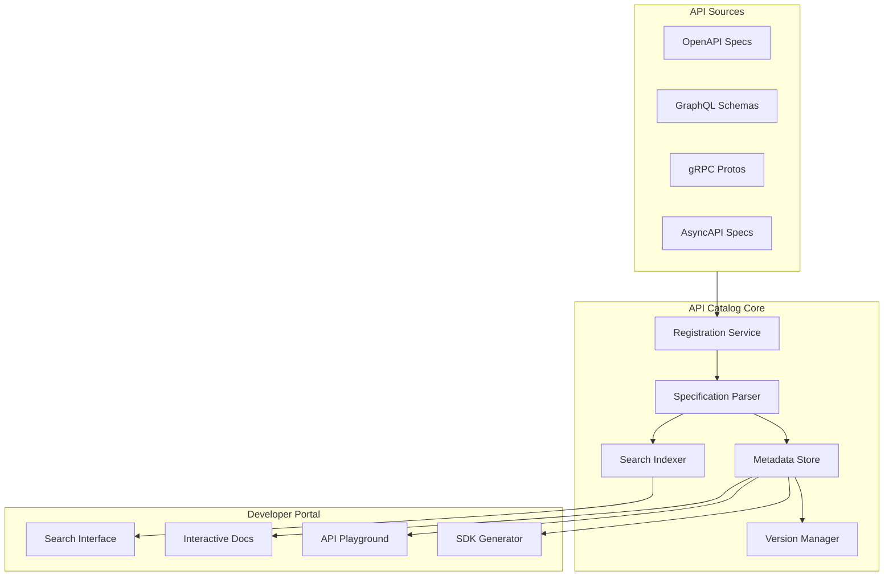
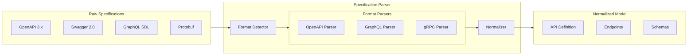
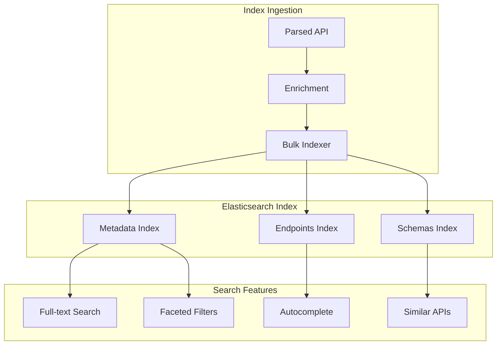
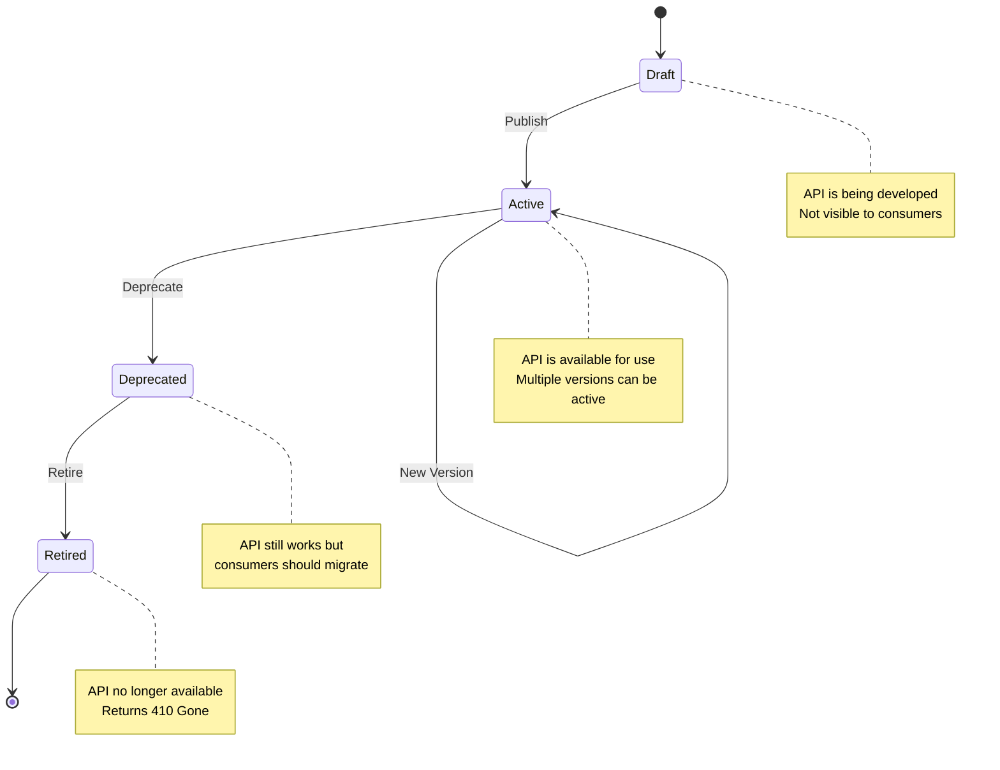
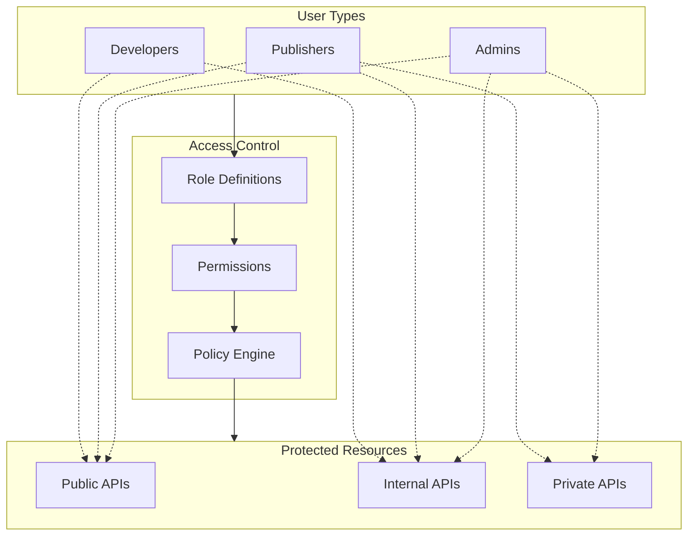

# How to Implement API Catalog

Author: [nawazdhandala](https://github.com/nawazdhandala)

Tags: Platform Engineering, API Catalog, Developer Portal, API Management

Description: Learn to implement API catalogs for developer portals with specification indexing, search capabilities, and interactive documentation for API discovery.

---

API catalogs serve as the central hub where developers discover, understand, and integrate with your organization's APIs. A well-implemented API catalog transforms scattered API documentation into a unified, searchable, and interactive experience. This guide walks through building a robust API catalog system from the ground up.

## Understanding API Catalog Architecture

Before diving into implementation, let's understand the core components that make up an API catalog system.



The architecture consists of three layers: API sources feed into the catalog core, which processes and indexes specifications, and the developer portal consumes this data to provide discovery and interaction features.

## API Registration System

The registration system accepts API specifications from various sources and validates them before processing.

### Registration Service Implementation

```typescript
// src/catalog/registration.service.ts
import { Injectable } from '@nestjs/common';
import { APISpecification, RegistrationResult, APIFormat } from './types';
import { SpecificationParser } from './parser.service';
import { SearchIndexer } from './indexer.service';
import { MetadataStore } from './metadata.service';

@Injectable()
export class RegistrationService {
  constructor(
    private parser: SpecificationParser,
    private indexer: SearchIndexer,
    private metadataStore: MetadataStore,
  ) {}

  async registerAPI(
    spec: string,
    format: APIFormat,
    metadata: APIMetadata,
  ): Promise<RegistrationResult> {
    // Step 1: Validate the specification
    const validation = await this.parser.validate(spec, format);
    if (!validation.isValid) {
      return {
        success: false,
        errors: validation.errors,
      };
    }

    // Step 2: Parse the specification
    const parsedSpec = await this.parser.parse(spec, format);

    // Step 3: Generate unique API identifier
    const apiId = this.generateAPIId(metadata.name, metadata.version);

    // Step 4: Store metadata and specification
    const storedAPI = await this.metadataStore.save({
      id: apiId,
      name: metadata.name,
      version: metadata.version,
      format: format,
      specification: parsedSpec,
      owner: metadata.owner,
      team: metadata.team,
      tags: metadata.tags,
      visibility: metadata.visibility,
      createdAt: new Date(),
      updatedAt: new Date(),
    });

    // Step 5: Index for search
    await this.indexer.indexAPI(storedAPI);

    return {
      success: true,
      apiId: apiId,
      endpoints: parsedSpec.endpoints.length,
    };
  }

  private generateAPIId(name: string, version: string): string {
    const sanitizedName = name.toLowerCase().replace(/[^a-z0-9]/g, '-');
    return `${sanitizedName}-v${version}`;
  }
}
```

This service orchestrates the entire registration flow. It validates incoming specifications, parses them into a normalized format, stores the metadata, and indexes the API for search. The unique identifier generation ensures consistent naming across versions.

### Registration API Controller

```typescript
// src/catalog/registration.controller.ts
import { Controller, Post, Body, UseGuards, HttpStatus } from '@nestjs/common';
import { RegistrationService } from './registration.service';
import { AuthGuard } from '../auth/auth.guard';
import { RolesGuard } from '../auth/roles.guard';
import { Roles } from '../auth/roles.decorator';

interface RegisterAPIRequest {
  specification: string;
  format: 'openapi' | 'graphql' | 'grpc' | 'asyncapi';
  metadata: {
    name: string;
    version: string;
    description: string;
    owner: string;
    team: string;
    tags: string[];
    visibility: 'public' | 'internal' | 'private';
  };
}

@Controller('api/catalog')
@UseGuards(AuthGuard, RolesGuard)
export class RegistrationController {
  constructor(private registrationService: RegistrationService) {}

  @Post('register')
  @Roles('api-publisher', 'admin')
  async registerAPI(@Body() request: RegisterAPIRequest) {
    const result = await this.registrationService.registerAPI(
      request.specification,
      request.format,
      request.metadata,
    );

    if (!result.success) {
      return {
        statusCode: HttpStatus.BAD_REQUEST,
        message: 'API registration failed',
        errors: result.errors,
      };
    }

    return {
      statusCode: HttpStatus.CREATED,
      message: 'API registered successfully',
      data: {
        apiId: result.apiId,
        endpoints: result.endpoints,
      },
    };
  }
}
```

The controller exposes the registration endpoint with role-based access control. Only users with `api-publisher` or `admin` roles can register new APIs, ensuring proper governance.

## Specification Parsing

Different API formats require different parsing strategies. A unified parser abstraction handles this complexity.



### Parser Implementation

```typescript
// src/catalog/parser.service.ts
import { Injectable } from '@nestjs/common';
import SwaggerParser from '@apidevtools/swagger-parser';
import { buildSchema, introspectionFromSchema } from 'graphql';
import { NormalizedAPI, Endpoint, Schema, APIFormat } from './types';

@Injectable()
export class SpecificationParser {
  async validate(
    spec: string,
    format: APIFormat,
  ): Promise<{ isValid: boolean; errors: string[] }> {
    try {
      switch (format) {
        case 'openapi':
          await SwaggerParser.validate(JSON.parse(spec));
          break;
        case 'graphql':
          buildSchema(spec);
          break;
        default:
          throw new Error(`Unsupported format: ${format}`);
      }
      return { isValid: true, errors: [] };
    } catch (error) {
      return { isValid: false, errors: [error.message] };
    }
  }

  async parse(spec: string, format: APIFormat): Promise<NormalizedAPI> {
    switch (format) {
      case 'openapi':
        return this.parseOpenAPI(spec);
      case 'graphql':
        return this.parseGraphQL(spec);
      default:
        throw new Error(`Unsupported format: ${format}`);
    }
  }

  private async parseOpenAPI(spec: string): Promise<NormalizedAPI> {
    const parsed = await SwaggerParser.dereference(JSON.parse(spec));
    const endpoints: Endpoint[] = [];
    const schemas: Schema[] = [];

    // Extract endpoints from paths
    for (const [path, methods] of Object.entries(parsed.paths || {})) {
      for (const [method, operation] of Object.entries(methods)) {
        if (['get', 'post', 'put', 'patch', 'delete'].includes(method)) {
          endpoints.push({
            path,
            method: method.toUpperCase(),
            operationId: operation.operationId,
            summary: operation.summary,
            description: operation.description,
            tags: operation.tags || [],
            parameters: this.extractParameters(operation),
            requestBody: this.extractRequestBody(operation),
            responses: this.extractResponses(operation),
          });
        }
      }
    }

    // Extract schemas from components
    for (const [name, schema] of Object.entries(
      parsed.components?.schemas || {},
    )) {
      schemas.push({
        name,
        type: schema.type,
        properties: schema.properties,
        required: schema.required,
        description: schema.description,
      });
    }

    return {
      title: parsed.info.title,
      description: parsed.info.description,
      version: parsed.info.version,
      baseUrl: parsed.servers?.[0]?.url,
      endpoints,
      schemas,
    };
  }

  private async parseGraphQL(spec: string): Promise<NormalizedAPI> {
    const schema = buildSchema(spec);
    const introspection = introspectionFromSchema(schema);
    const endpoints: Endpoint[] = [];

    // Extract queries as endpoints
    const queryType = introspection.__schema.types.find(
      (t) => t.name === 'Query',
    );
    if (queryType && queryType.fields) {
      for (const field of queryType.fields) {
        endpoints.push({
          path: `/graphql`,
          method: 'POST',
          operationId: `query_${field.name}`,
          summary: field.description || `Query: ${field.name}`,
          description: field.description,
          tags: ['Query'],
          parameters: field.args.map((arg) => ({
            name: arg.name,
            type: this.getGraphQLTypeName(arg.type),
            required: arg.type.kind === 'NON_NULL',
          })),
          responses: [],
        });
      }
    }

    return {
      title: 'GraphQL API',
      description: 'GraphQL Schema',
      version: '1.0.0',
      baseUrl: '/graphql',
      endpoints,
      schemas: [],
    };
  }

  private getGraphQLTypeName(type: any): string {
    if (type.name) return type.name;
    if (type.ofType) return this.getGraphQLTypeName(type.ofType);
    return 'Unknown';
  }

  private extractParameters(operation: any): any[] {
    return (operation.parameters || []).map((param) => ({
      name: param.name,
      in: param.in,
      required: param.required,
      type: param.schema?.type,
      description: param.description,
    }));
  }

  private extractRequestBody(operation: any): any {
    if (!operation.requestBody) return null;
    const content = operation.requestBody.content;
    const mediaType = Object.keys(content)[0];
    return {
      mediaType,
      schema: content[mediaType]?.schema,
      required: operation.requestBody.required,
    };
  }

  private extractResponses(operation: any): any[] {
    return Object.entries(operation.responses || {}).map(
      ([status, response]: [string, any]) => ({
        status,
        description: response.description,
        schema: response.content?.['application/json']?.schema,
      }),
    );
  }
}
```

The parser handles multiple specification formats through a unified interface. It normalizes different formats into a common data model, making it easier for downstream components to work with APIs regardless of their original format.

## Search Indexing

Effective search is critical for API discovery. Elasticsearch provides powerful full-text search capabilities for the catalog.



### Search Indexer Implementation

```typescript
// src/catalog/indexer.service.ts
import { Injectable } from '@nestjs/common';
import { Client } from '@elastic/elasticsearch';
import { StoredAPI, SearchResult } from './types';

@Injectable()
export class SearchIndexer {
  private client: Client;
  private readonly INDEX_NAME = 'api-catalog';

  constructor() {
    this.client = new Client({
      node: process.env.ELASTICSEARCH_URL || 'http://localhost:9200',
    });
    this.ensureIndex();
  }

  private async ensureIndex() {
    const exists = await this.client.indices.exists({ index: this.INDEX_NAME });
    if (!exists) {
      await this.client.indices.create({
        index: this.INDEX_NAME,
        body: {
          settings: {
            analysis: {
              analyzer: {
                api_analyzer: {
                  type: 'custom',
                  tokenizer: 'standard',
                  filter: ['lowercase', 'edge_ngram_filter'],
                },
              },
              filter: {
                edge_ngram_filter: {
                  type: 'edge_ngram',
                  min_gram: 2,
                  max_gram: 20,
                },
              },
            },
          },
          mappings: {
            properties: {
              id: { type: 'keyword' },
              name: {
                type: 'text',
                analyzer: 'api_analyzer',
                fields: { keyword: { type: 'keyword' } },
              },
              description: { type: 'text' },
              version: { type: 'keyword' },
              owner: { type: 'keyword' },
              team: { type: 'keyword' },
              tags: { type: 'keyword' },
              visibility: { type: 'keyword' },
              endpoints: {
                type: 'nested',
                properties: {
                  path: { type: 'text' },
                  method: { type: 'keyword' },
                  summary: { type: 'text' },
                  tags: { type: 'keyword' },
                },
              },
              createdAt: { type: 'date' },
              updatedAt: { type: 'date' },
            },
          },
        },
      });
    }
  }

  async indexAPI(api: StoredAPI): Promise<void> {
    await this.client.index({
      index: this.INDEX_NAME,
      id: api.id,
      body: {
        id: api.id,
        name: api.name,
        description: api.specification.description,
        version: api.version,
        owner: api.owner,
        team: api.team,
        tags: api.tags,
        visibility: api.visibility,
        endpoints: api.specification.endpoints.map((e) => ({
          path: e.path,
          method: e.method,
          summary: e.summary,
          tags: e.tags,
        })),
        createdAt: api.createdAt,
        updatedAt: api.updatedAt,
      },
    });
  }

  async search(
    query: string,
    filters: SearchFilters,
    page: number = 1,
    pageSize: number = 20,
  ): Promise<SearchResult> {
    const must: any[] = [];
    const filter: any[] = [];

    // Full-text search across multiple fields
    if (query) {
      must.push({
        multi_match: {
          query,
          fields: [
            'name^3',
            'description^2',
            'tags^2',
            'endpoints.path',
            'endpoints.summary',
          ],
          type: 'best_fields',
          fuzziness: 'AUTO',
        },
      });
    }

    // Apply filters
    if (filters.team) {
      filter.push({ term: { team: filters.team } });
    }
    if (filters.tags && filters.tags.length > 0) {
      filter.push({ terms: { tags: filters.tags } });
    }
    if (filters.visibility) {
      filter.push({ term: { visibility: filters.visibility } });
    }

    const response = await this.client.search({
      index: this.INDEX_NAME,
      body: {
        from: (page - 1) * pageSize,
        size: pageSize,
        query: {
          bool: {
            must: must.length > 0 ? must : [{ match_all: {} }],
            filter,
          },
        },
        highlight: {
          fields: {
            name: {},
            description: {},
            'endpoints.summary': {},
          },
        },
        aggs: {
          teams: { terms: { field: 'team', size: 50 } },
          tags: { terms: { field: 'tags', size: 100 } },
          visibility: { terms: { field: 'visibility' } },
        },
      },
    });

    return {
      total: response.hits.total.value,
      page,
      pageSize,
      results: response.hits.hits.map((hit) => ({
        ...hit._source,
        score: hit._score,
        highlights: hit.highlight,
      })),
      facets: {
        teams: response.aggregations.teams.buckets,
        tags: response.aggregations.tags.buckets,
        visibility: response.aggregations.visibility.buckets,
      },
    };
  }

  async autocomplete(prefix: string): Promise<string[]> {
    const response = await this.client.search({
      index: this.INDEX_NAME,
      body: {
        size: 0,
        suggest: {
          api_suggest: {
            prefix,
            completion: {
              field: 'name',
              size: 10,
              skip_duplicates: true,
            },
          },
        },
      },
    });

    return response.suggest.api_suggest[0].options.map((opt) => opt.text);
  }

  async deleteAPI(apiId: string): Promise<void> {
    await this.client.delete({
      index: this.INDEX_NAME,
      id: apiId,
    });
  }
}

interface SearchFilters {
  team?: string;
  tags?: string[];
  visibility?: 'public' | 'internal' | 'private';
}
```

The indexer creates a custom Elasticsearch index with edge n-gram analysis for autocomplete functionality. The search method supports full-text queries with field boosting, faceted filters for narrowing results, and aggregations for building filter options in the UI.

## API Versioning

Proper versioning ensures backward compatibility and helps developers manage API lifecycle transitions.



### Version Manager Implementation

```typescript
// src/catalog/version.service.ts
import { Injectable } from '@nestjs/common';
import { MetadataStore } from './metadata.service';
import { SearchIndexer } from './indexer.service';
import { APIVersion, VersionStatus, VersionComparison } from './types';
import * as semver from 'semver';

@Injectable()
export class VersionManager {
  constructor(
    private metadataStore: MetadataStore,
    private indexer: SearchIndexer,
  ) {}

  async createVersion(
    apiName: string,
    version: string,
    specification: any,
  ): Promise<APIVersion> {
    // Validate semver format
    if (!semver.valid(version)) {
      throw new Error(`Invalid version format: ${version}. Use semantic versioning.`);
    }

    // Get existing versions
    const existingVersions = await this.metadataStore.getVersions(apiName);

    // Determine version status based on existing versions
    let status: VersionStatus = 'draft';
    if (existingVersions.length === 0) {
      status = 'active';
    }

    // Check for breaking changes
    const latestActive = existingVersions.find((v) => v.status === 'active');
    let breakingChanges: string[] = [];
    if (latestActive) {
      breakingChanges = await this.detectBreakingChanges(
        latestActive.specification,
        specification,
      );
    }

    const newVersion: APIVersion = {
      apiName,
      version,
      status,
      specification,
      breakingChanges,
      createdAt: new Date(),
      publishedAt: null,
      deprecatedAt: null,
      retiredAt: null,
    };

    await this.metadataStore.saveVersion(newVersion);
    return newVersion;
  }

  async publishVersion(apiName: string, version: string): Promise<APIVersion> {
    const apiVersion = await this.metadataStore.getVersion(apiName, version);
    if (!apiVersion) {
      throw new Error(`Version ${version} not found for API ${apiName}`);
    }

    apiVersion.status = 'active';
    apiVersion.publishedAt = new Date();

    await this.metadataStore.saveVersion(apiVersion);
    await this.indexer.indexAPI({
      id: `${apiName}-v${version}`,
      name: apiName,
      version,
      specification: apiVersion.specification,
      // ... other fields
    } as any);

    return apiVersion;
  }

  async deprecateVersion(
    apiName: string,
    version: string,
    sunsetDate: Date,
    migrationGuide?: string,
  ): Promise<APIVersion> {
    const apiVersion = await this.metadataStore.getVersion(apiName, version);
    if (!apiVersion) {
      throw new Error(`Version ${version} not found for API ${apiName}`);
    }

    apiVersion.status = 'deprecated';
    apiVersion.deprecatedAt = new Date();
    apiVersion.sunsetDate = sunsetDate;
    apiVersion.migrationGuide = migrationGuide;

    await this.metadataStore.saveVersion(apiVersion);
    return apiVersion;
  }

  async retireVersion(apiName: string, version: string): Promise<void> {
    const apiVersion = await this.metadataStore.getVersion(apiName, version);
    if (!apiVersion) {
      throw new Error(`Version ${version} not found for API ${apiName}`);
    }

    apiVersion.status = 'retired';
    apiVersion.retiredAt = new Date();

    await this.metadataStore.saveVersion(apiVersion);
    await this.indexer.deleteAPI(`${apiName}-v${version}`);
  }

  async compareVersions(
    apiName: string,
    fromVersion: string,
    toVersion: string,
  ): Promise<VersionComparison> {
    const from = await this.metadataStore.getVersion(apiName, fromVersion);
    const to = await this.metadataStore.getVersion(apiName, toVersion);

    if (!from || !to) {
      throw new Error('One or both versions not found');
    }

    const addedEndpoints = to.specification.endpoints.filter(
      (e) =>
        !from.specification.endpoints.some(
          (f) => f.path === e.path && f.method === e.method,
        ),
    );

    const removedEndpoints = from.specification.endpoints.filter(
      (e) =>
        !to.specification.endpoints.some(
          (t) => t.path === e.path && t.method === e.method,
        ),
    );

    const modifiedEndpoints = to.specification.endpoints.filter((e) => {
      const fromEndpoint = from.specification.endpoints.find(
        (f) => f.path === e.path && f.method === e.method,
      );
      if (!fromEndpoint) return false;
      return JSON.stringify(fromEndpoint) !== JSON.stringify(e);
    });

    return {
      fromVersion,
      toVersion,
      addedEndpoints,
      removedEndpoints,
      modifiedEndpoints,
      breakingChanges: await this.detectBreakingChanges(
        from.specification,
        to.specification,
      ),
    };
  }

  private async detectBreakingChanges(
    oldSpec: any,
    newSpec: any,
  ): Promise<string[]> {
    const breakingChanges: string[] = [];

    // Check for removed endpoints
    for (const endpoint of oldSpec.endpoints) {
      const exists = newSpec.endpoints.some(
        (e) => e.path === endpoint.path && e.method === endpoint.method,
      );
      if (!exists) {
        breakingChanges.push(
          `Removed endpoint: ${endpoint.method} ${endpoint.path}`,
        );
      }
    }

    // Check for removed required parameters
    for (const oldEndpoint of oldSpec.endpoints) {
      const newEndpoint = newSpec.endpoints.find(
        (e) => e.path === oldEndpoint.path && e.method === oldEndpoint.method,
      );
      if (newEndpoint) {
        for (const param of oldEndpoint.parameters || []) {
          const newParam = newEndpoint.parameters?.find(
            (p) => p.name === param.name,
          );
          if (!newParam) {
            breakingChanges.push(
              `Removed parameter '${param.name}' from ${oldEndpoint.method} ${oldEndpoint.path}`,
            );
          }
        }

        // Check for new required parameters
        for (const param of newEndpoint.parameters || []) {
          const oldParam = oldEndpoint.parameters?.find(
            (p) => p.name === param.name,
          );
          if (!oldParam && param.required) {
            breakingChanges.push(
              `Added required parameter '${param.name}' to ${newEndpoint.method} ${newEndpoint.path}`,
            );
          }
        }
      }
    }

    return breakingChanges;
  }

  async getVersionHistory(apiName: string): Promise<APIVersion[]> {
    const versions = await this.metadataStore.getVersions(apiName);
    return versions.sort((a, b) => semver.compare(b.version, a.version));
  }
}
```

The version manager handles the complete lifecycle of API versions. It validates semantic versioning, detects breaking changes between versions, and manages status transitions. The comparison feature helps developers understand what changed between versions.

## Access Control

Role-based access control ensures APIs are only visible to authorized users.



### Access Control Implementation

```typescript
// src/catalog/access-control.service.ts
import { Injectable, ForbiddenException } from '@nestjs/common';

interface User {
  id: string;
  roles: string[];
  teams: string[];
}

interface APIResource {
  id: string;
  visibility: 'public' | 'internal' | 'private';
  owner: string;
  team: string;
}

type Permission = 'read' | 'write' | 'delete' | 'publish';

@Injectable()
export class AccessControlService {
  private rolePermissions: Record<string, Permission[]> = {
    admin: ['read', 'write', 'delete', 'publish'],
    'api-publisher': ['read', 'write', 'publish'],
    developer: ['read'],
    guest: ['read'],
  };

  private visibilityRoles: Record<string, string[]> = {
    public: ['admin', 'api-publisher', 'developer', 'guest'],
    internal: ['admin', 'api-publisher', 'developer'],
    private: ['admin', 'api-publisher'],
  };

  canAccess(user: User, resource: APIResource, permission: Permission): boolean {
    // Admins can do everything
    if (user.roles.includes('admin')) {
      return true;
    }

    // Check visibility-based access
    const allowedRoles = this.visibilityRoles[resource.visibility];
    const hasVisibilityAccess = user.roles.some((role) =>
      allowedRoles.includes(role),
    );
    if (!hasVisibilityAccess) {
      return false;
    }

    // For private APIs, check team membership
    if (resource.visibility === 'private') {
      if (!user.teams.includes(resource.team)) {
        return false;
      }
    }

    // Check permission based on role
    const userPermissions = user.roles.flatMap(
      (role) => this.rolePermissions[role] || [],
    );
    return userPermissions.includes(permission);
  }

  enforceAccess(
    user: User,
    resource: APIResource,
    permission: Permission,
  ): void {
    if (!this.canAccess(user, resource, permission)) {
      throw new ForbiddenException(
        `User ${user.id} does not have ${permission} access to API ${resource.id}`,
      );
    }
  }

  filterByAccess(user: User, apis: APIResource[]): APIResource[] {
    return apis.filter((api) => this.canAccess(user, api, 'read'));
  }
}

// Access control guard for endpoints
import { Injectable, CanActivate, ExecutionContext } from '@nestjs/common';
import { Reflector } from '@nestjs/core';

@Injectable()
export class APIAccessGuard implements CanActivate {
  constructor(
    private reflector: Reflector,
    private accessControl: AccessControlService,
  ) {}

  async canActivate(context: ExecutionContext): Promise<boolean> {
    const request = context.switchToHttp().getRequest();
    const user = request.user;
    const apiId = request.params.apiId;
    const permission =
      this.reflector.get<Permission>('permission', context.getHandler()) ||
      'read';

    // Fetch the API resource
    const api = await this.fetchAPIResource(apiId);
    if (!api) {
      return false;
    }

    return this.accessControl.canAccess(user, api, permission);
  }

  private async fetchAPIResource(apiId: string): Promise<APIResource | null> {
    // Implementation to fetch API from metadata store
    return null;
  }
}
```

The access control system combines role-based permissions with visibility levels. Public APIs are accessible to all authenticated users, internal APIs require developer or higher roles, and private APIs are restricted to team members. The guard integrates with the NestJS framework to protect API endpoints.

## Interactive Documentation

The documentation component renders API specifications as interactive documentation with try-it functionality.

```typescript
// src/portal/documentation.service.ts
import { Injectable } from '@nestjs/common';
import { MetadataStore } from '../catalog/metadata.service';

interface DocumentationPage {
  api: {
    name: string;
    version: string;
    description: string;
    baseUrl: string;
  };
  endpoints: EndpointDocumentation[];
  schemas: SchemaDocumentation[];
  examples: CodeExample[];
}

interface EndpointDocumentation {
  path: string;
  method: string;
  summary: string;
  description: string;
  parameters: ParameterDoc[];
  requestBody: RequestBodyDoc | null;
  responses: ResponseDoc[];
  codeExamples: Record<string, string>;
}

@Injectable()
export class DocumentationService {
  constructor(private metadataStore: MetadataStore) {}

  async generateDocumentation(
    apiName: string,
    version: string,
  ): Promise<DocumentationPage> {
    const api = await this.metadataStore.getVersion(apiName, version);
    if (!api) {
      throw new Error(`API ${apiName} version ${version} not found`);
    }

    const endpoints = api.specification.endpoints.map((endpoint) => ({
      ...endpoint,
      codeExamples: this.generateCodeExamples(
        endpoint,
        api.specification.baseUrl,
      ),
    }));

    return {
      api: {
        name: apiName,
        version,
        description: api.specification.description,
        baseUrl: api.specification.baseUrl,
      },
      endpoints,
      schemas: api.specification.schemas,
      examples: this.generateAPIExamples(api.specification),
    };
  }

  private generateCodeExamples(
    endpoint: any,
    baseUrl: string,
  ): Record<string, string> {
    const url = `${baseUrl}${endpoint.path}`;

    return {
      curl: this.generateCurlExample(endpoint, url),
      javascript: this.generateJavaScriptExample(endpoint, url),
      python: this.generatePythonExample(endpoint, url),
      go: this.generateGoExample(endpoint, url),
    };
  }

  private generateCurlExample(endpoint: any, url: string): string {
    let curl = `curl -X ${endpoint.method} "${url}"`;
    curl += ` \\\n  -H "Authorization: Bearer YOUR_API_KEY"`;
    curl += ` \\\n  -H "Content-Type: application/json"`;

    if (endpoint.requestBody) {
      const exampleBody = this.generateExampleBody(endpoint.requestBody.schema);
      curl += ` \\\n  -d '${JSON.stringify(exampleBody, null, 2)}'`;
    }

    return curl;
  }

  private generateJavaScriptExample(endpoint: any, url: string): string {
    let code = `const response = await fetch("${url}", {\n`;
    code += `  method: "${endpoint.method}",\n`;
    code += `  headers: {\n`;
    code += `    "Authorization": "Bearer YOUR_API_KEY",\n`;
    code += `    "Content-Type": "application/json",\n`;
    code += `  },\n`;

    if (endpoint.requestBody) {
      const exampleBody = this.generateExampleBody(endpoint.requestBody.schema);
      code += `  body: JSON.stringify(${JSON.stringify(exampleBody, null, 4)}),\n`;
    }

    code += `});\n\n`;
    code += `const data = await response.json();\n`;
    code += `console.log(data);`;

    return code;
  }

  private generatePythonExample(endpoint: any, url: string): string {
    let code = `import requests\n\n`;
    code += `url = "${url}"\n`;
    code += `headers = {\n`;
    code += `    "Authorization": "Bearer YOUR_API_KEY",\n`;
    code += `    "Content-Type": "application/json",\n`;
    code += `}\n\n`;

    if (endpoint.requestBody) {
      const exampleBody = this.generateExampleBody(endpoint.requestBody.schema);
      code += `payload = ${JSON.stringify(exampleBody, null, 4)}\n\n`;
      code += `response = requests.${endpoint.method.toLowerCase()}(url, headers=headers, json=payload)\n`;
    } else {
      code += `response = requests.${endpoint.method.toLowerCase()}(url, headers=headers)\n`;
    }

    code += `print(response.json())`;

    return code;
  }

  private generateGoExample(endpoint: any, url: string): string {
    let code = `package main\n\n`;
    code += `import (\n`;
    code += `    "bytes"\n`;
    code += `    "encoding/json"\n`;
    code += `    "fmt"\n`;
    code += `    "net/http"\n`;
    code += `)\n\n`;
    code += `func main() {\n`;
    code += `    url := "${url}"\n\n`;

    if (endpoint.requestBody) {
      const exampleBody = this.generateExampleBody(endpoint.requestBody.schema);
      code += `    payload := map[string]interface{}${JSON.stringify(exampleBody)}\n`;
      code += `    jsonData, _ := json.Marshal(payload)\n`;
      code += `    req, _ := http.NewRequest("${endpoint.method}", url, bytes.NewBuffer(jsonData))\n`;
    } else {
      code += `    req, _ := http.NewRequest("${endpoint.method}", url, nil)\n`;
    }

    code += `    req.Header.Set("Authorization", "Bearer YOUR_API_KEY")\n`;
    code += `    req.Header.Set("Content-Type", "application/json")\n\n`;
    code += `    client := &http.Client{}\n`;
    code += `    resp, _ := client.Do(req)\n`;
    code += `    defer resp.Body.Close()\n\n`;
    code += `    var result map[string]interface{}\n`;
    code += `    json.NewDecoder(resp.Body).Decode(&result)\n`;
    code += `    fmt.Println(result)\n`;
    code += `}`;

    return code;
  }

  private generateExampleBody(schema: any): any {
    if (!schema) return {};

    const example: any = {};
    for (const [key, prop] of Object.entries(schema.properties || {})) {
      example[key] = this.generateExampleValue(prop as any);
    }
    return example;
  }

  private generateExampleValue(prop: any): any {
    switch (prop.type) {
      case 'string':
        return prop.example || 'string';
      case 'integer':
      case 'number':
        return prop.example || 0;
      case 'boolean':
        return prop.example || true;
      case 'array':
        return [this.generateExampleValue(prop.items)];
      case 'object':
        return this.generateExampleBody(prop);
      default:
        return null;
    }
  }

  private generateAPIExamples(specification: any): CodeExample[] {
    // Generate common use case examples
    return [];
  }
}

interface CodeExample {
  title: string;
  description: string;
  code: string;
  language: string;
}
```

The documentation service transforms API specifications into developer-friendly documentation with code examples in multiple languages. This removes friction when developers want to integrate with your APIs.

## Complete Data Model

Here is the database schema that supports the entire catalog system:

```typescript
// src/catalog/types.ts

export type APIFormat = 'openapi' | 'graphql' | 'grpc' | 'asyncapi';
export type VersionStatus = 'draft' | 'active' | 'deprecated' | 'retired';
export type Visibility = 'public' | 'internal' | 'private';

export interface APIMetadata {
  name: string;
  version: string;
  description?: string;
  owner: string;
  team: string;
  tags: string[];
  visibility: Visibility;
}

export interface StoredAPI {
  id: string;
  name: string;
  version: string;
  format: APIFormat;
  specification: NormalizedAPI;
  owner: string;
  team: string;
  tags: string[];
  visibility: Visibility;
  createdAt: Date;
  updatedAt: Date;
}

export interface NormalizedAPI {
  title: string;
  description: string;
  version: string;
  baseUrl: string;
  endpoints: Endpoint[];
  schemas: Schema[];
}

export interface Endpoint {
  path: string;
  method: string;
  operationId: string;
  summary: string;
  description: string;
  tags: string[];
  parameters: Parameter[];
  requestBody: RequestBody | null;
  responses: Response[];
}

export interface Parameter {
  name: string;
  in: 'path' | 'query' | 'header' | 'cookie';
  required: boolean;
  type: string;
  description: string;
}

export interface RequestBody {
  mediaType: string;
  schema: any;
  required: boolean;
}

export interface Response {
  status: string;
  description: string;
  schema: any;
}

export interface Schema {
  name: string;
  type: string;
  properties: Record<string, any>;
  required: string[];
  description: string;
}

export interface APIVersion {
  apiName: string;
  version: string;
  status: VersionStatus;
  specification: NormalizedAPI;
  breakingChanges: string[];
  createdAt: Date;
  publishedAt: Date | null;
  deprecatedAt: Date | null;
  retiredAt: Date | null;
  sunsetDate?: Date;
  migrationGuide?: string;
}

export interface RegistrationResult {
  success: boolean;
  apiId?: string;
  endpoints?: number;
  errors?: string[];
}

export interface SearchResult {
  total: number;
  page: number;
  pageSize: number;
  results: SearchHit[];
  facets: {
    teams: Facet[];
    tags: Facet[];
    visibility: Facet[];
  };
}

export interface SearchHit {
  id: string;
  name: string;
  description: string;
  version: string;
  score: number;
  highlights: Record<string, string[]>;
}

export interface Facet {
  key: string;
  doc_count: number;
}

export interface VersionComparison {
  fromVersion: string;
  toVersion: string;
  addedEndpoints: Endpoint[];
  removedEndpoints: Endpoint[];
  modifiedEndpoints: Endpoint[];
  breakingChanges: string[];
}
```

## CI/CD Integration

Automate API registration through your CI/CD pipeline for consistent catalog updates.

```yaml
# .github/workflows/api-catalog-sync.yml
name: Sync API to Catalog

on:
  push:
    branches: [main]
    paths:
      - 'api/openapi.yaml'
      - 'api/schema.graphql'

jobs:
  sync-catalog:
    runs-on: ubuntu-latest
    steps:
      - uses: actions/checkout@v4

      - name: Validate OpenAPI Specification
        run: |
          npm install -g @stoplight/spectral-cli
          spectral lint api/openapi.yaml

      - name: Extract API Version
        id: version
        run: |
          VERSION=$(yq '.info.version' api/openapi.yaml)
          echo "version=$VERSION" >> $GITHUB_OUTPUT

      - name: Register API in Catalog
        run: |
          curl -X POST "${{ secrets.CATALOG_API_URL }}/api/catalog/register" \
            -H "Authorization: Bearer ${{ secrets.CATALOG_API_KEY }}" \
            -H "Content-Type: application/json" \
            -d @- << EOF
          {
            "specification": $(cat api/openapi.yaml | yq -o=json),
            "format": "openapi",
            "metadata": {
              "name": "${{ github.event.repository.name }}",
              "version": "${{ steps.version.outputs.version }}",
              "description": "API for ${{ github.event.repository.name }}",
              "owner": "${{ github.actor }}",
              "team": "${{ github.repository_owner }}",
              "tags": ["automated", "ci-cd"],
              "visibility": "internal"
            }
          }
          EOF

      - name: Notify on Failure
        if: failure()
        uses: slackapi/slack-github-action@v1
        with:
          payload: |
            {
              "text": "API catalog sync failed for ${{ github.repository }}"
            }
        env:
          SLACK_WEBHOOK_URL: ${{ secrets.SLACK_WEBHOOK }}
```

This workflow validates API specifications before registration, extracts version information automatically, and registers the API in the catalog on every merge to main.

## Summary

Building an effective API catalog requires careful attention to several key areas:

1. **Registration** - Accept multiple specification formats and validate thoroughly before storing
2. **Parsing** - Normalize different API formats into a unified model for consistent handling
3. **Search** - Use full-text search with faceted filtering for effective API discovery
4. **Versioning** - Track version history, detect breaking changes, and manage lifecycle states
5. **Access Control** - Implement role-based permissions with visibility levels for proper governance
6. **Documentation** - Generate interactive documentation with code examples in multiple languages

The architecture presented here provides a solid foundation that scales with your organization's API portfolio. Start with the core components and add features incrementally based on your team's needs.
