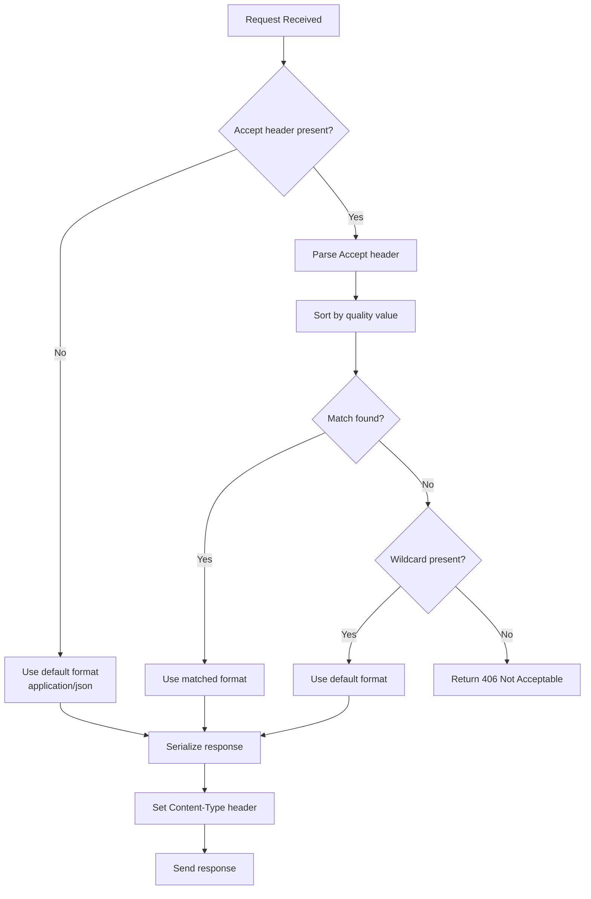
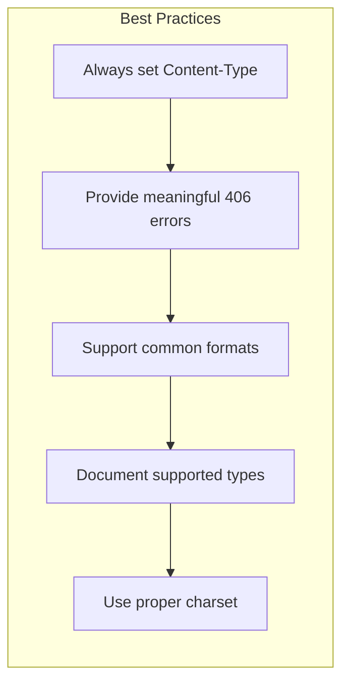

# How to Create API Content Negotiation

Author: [nawazdhandala](https://github.com/nawazdhandala)

Tags: REST API, Content Negotiation, API Design, HTTP Headers, Web Development, Backend Development, Express.js, Node.js

Description: Learn how to implement content negotiation in your APIs to serve different response formats like JSON, XML, and CSV based on client preferences.

---

Content negotiation lets your API serve the same resource in multiple formats. A single endpoint can return JSON for web applications, XML for legacy systems, and CSV for spreadsheet users. The client tells your server what format it wants, and your server responds accordingly.

This is how HTTP was designed to work. Instead of creating separate endpoints like `/api/users.json` and `/api/users.xml`, you create one endpoint that adapts to client needs through HTTP headers.

## How Content Negotiation Works

The client sends an `Accept` header specifying which media types it can handle, ordered by preference. The server examines this header and picks the best match from the formats it supports.

```mermaid
sequenceDiagram
    participant Client
    participant Server
    participant Handler

    Client->>Server: GET /api/users<br/>Accept: application/json, application/xml;q=0.9
    Server->>Server: Parse Accept header
    Server->>Server: Match against supported formats
    Server->>Handler: Request with selected format
    Handler->>Server: Raw data
    Server->>Server: Serialize to JSON
    Server->>Client: 200 OK<br/>Content-Type: application/json<br/>[{"id": 1, "name": "Alice"}]
```

The `q` parameter (quality value) indicates preference from 0 to 1. In the example above, the client prefers JSON (implicit q=1.0) over XML (q=0.9).

## Implementing Content Negotiation in Express.js

Express provides a built-in `res.format()` method that handles content negotiation. Here is a complete implementation that supports JSON, XML, and plain text formats.

```javascript
// Import required dependencies for the Express server
const express = require('express');
const app = express();

// Sample user data that we will serve in multiple formats
const users = [
  { id: 1, name: 'Alice Johnson', email: 'alice@example.com', role: 'admin' },
  { id: 2, name: 'Bob Smith', email: 'bob@example.com', role: 'user' },
  { id: 3, name: 'Carol White', email: 'carol@example.com', role: 'user' }
];

// Helper function to convert JavaScript objects to XML format
// This creates a simple but valid XML structure from any object
function toXml(data, rootElement = 'root') {
  const items = Array.isArray(data) ? data : [data];
  const itemName = rootElement === 'users' ? 'user' : 'item';

  let xml = `<?xml version="1.0" encoding="UTF-8"?>\n<${rootElement}>\n`;

  for (const item of items) {
    xml += `  <${itemName}>\n`;
    for (const [key, value] of Object.entries(item)) {
      xml += `    <${key}>${escapeXml(String(value))}</${key}>\n`;
    }
    xml += `  </${itemName}>\n`;
  }

  xml += `</${rootElement}>`;
  return xml;
}

// Escape special XML characters to prevent injection
function escapeXml(text) {
  return text
    .replace(/&/g, '&amp;')
    .replace(/</g, '&lt;')
    .replace(/>/g, '&gt;')
    .replace(/"/g, '&quot;')
    .replace(/'/g, '&apos;');
}

// GET /api/users endpoint with content negotiation
// The server checks the Accept header and responds with the appropriate format
app.get('/api/users', (req, res) => {
  res.format({
    // Handle JSON requests (application/json)
    'application/json': () => {
      res.json(users);
    },

    // Handle XML requests (application/xml or text/xml)
    'application/xml': () => {
      res.type('application/xml');
      res.send(toXml(users, 'users'));
    },

    // Handle plain text requests (text/plain)
    'text/plain': () => {
      const text = users
        .map(u => `${u.id}: ${u.name} <${u.email}> [${u.role}]`)
        .join('\n');
      res.type('text/plain');
      res.send(text);
    },

    // Default handler when no format matches
    // Returns 406 Not Acceptable with a list of supported formats
    default: () => {
      res.status(406).json({
        error: 'Not Acceptable',
        message: 'Supported formats: application/json, application/xml, text/plain',
        supportedTypes: ['application/json', 'application/xml', 'text/plain']
      });
    }
  });
});

app.listen(3000, () => {
  console.log('Server running on port 3000');
});
```

## Testing Content Negotiation with curl

Test your implementation by sending requests with different Accept headers.

```bash
# Request JSON format (most common)
curl -H "Accept: application/json" http://localhost:3000/api/users

# Request XML format for legacy system integration
curl -H "Accept: application/xml" http://localhost:3000/api/users

# Request plain text for simple debugging
curl -H "Accept: text/plain" http://localhost:3000/api/users

# Request unsupported format to test 406 response
curl -H "Accept: application/yaml" http://localhost:3000/api/users
```

## Adding CSV Support for Data Export

Many clients need to export data to spreadsheets. Adding CSV support is straightforward.

```javascript
// Helper function to convert objects to CSV format
// Handles proper escaping of commas and quotes in field values
function toCsv(data) {
  if (!Array.isArray(data) || data.length === 0) {
    return '';
  }

  // Extract column headers from the first object
  const headers = Object.keys(data[0]);

  // Create header row
  const headerRow = headers.join(',');

  // Create data rows with proper escaping
  const dataRows = data.map(item => {
    return headers.map(header => {
      const value = String(item[header] || '');
      // Escape values containing commas, quotes, or newlines
      if (value.includes(',') || value.includes('"') || value.includes('\n')) {
        return `"${value.replace(/"/g, '""')}"`;
      }
      return value;
    }).join(',');
  });

  return [headerRow, ...dataRows].join('\n');
}

// Extended endpoint with CSV support
app.get('/api/users', (req, res) => {
  res.format({
    'application/json': () => res.json(users),
    'application/xml': () => {
      res.type('application/xml');
      res.send(toXml(users, 'users'));
    },
    'text/csv': () => {
      // Set filename header so browsers download as a file
      res.setHeader('Content-Disposition', 'attachment; filename="users.csv"');
      res.type('text/csv');
      res.send(toCsv(users));
    },
    'text/plain': () => {
      const text = users.map(u => `${u.id}: ${u.name}`).join('\n');
      res.type('text/plain');
      res.send(text);
    },
    default: () => {
      res.status(406).json({
        error: 'Not Acceptable',
        supportedTypes: ['application/json', 'application/xml', 'text/csv', 'text/plain']
      });
    }
  });
});
```

## Building a Reusable Content Negotiation Middleware

For production applications, you want content negotiation logic that works across all endpoints. Here is a middleware-based approach.

```javascript
// Middleware factory that creates content negotiation handlers
// Pass in serializers for each content type you want to support
function contentNegotiation(serializers) {
  return (req, res, next) => {
    // Store the original json method
    const originalJson = res.json.bind(res);

    // Override res.json to add content negotiation
    res.negotiate = function(data) {
      const formatHandlers = {};

      // Build format handlers from provided serializers
      for (const [contentType, serializer] of Object.entries(serializers)) {
        formatHandlers[contentType] = () => {
          const result = serializer(data);
          res.type(contentType);
          res.send(result);
        };
      }

      // Add default JSON handler if not specified
      if (!formatHandlers['application/json']) {
        formatHandlers['application/json'] = () => originalJson(data);
      }

      // Add 406 handler for unsupported formats
      formatHandlers.default = () => {
        res.status(406).json({
          error: 'Not Acceptable',
          supportedTypes: Object.keys(serializers)
        });
      };

      res.format(formatHandlers);
    };

    next();
  };
}

// Configure serializers for different content types
const serializers = {
  'application/json': (data) => JSON.stringify(data),
  'application/xml': (data) => toXml(data, 'response'),
  'text/csv': (data) => toCsv(Array.isArray(data) ? data : [data]),
  'text/plain': (data) => JSON.stringify(data, null, 2)
};

// Apply middleware to all routes
app.use(contentNegotiation(serializers));

// Now any route can use res.negotiate()
app.get('/api/users', (req, res) => {
  res.negotiate(users);
});

app.get('/api/users/:id', (req, res) => {
  const user = users.find(u => u.id === parseInt(req.params.id));
  if (!user) {
    return res.status(404).json({ error: 'User not found' });
  }
  res.negotiate(user);
});
```

## Content Negotiation Decision Flow

When a request comes in, your server needs to decide which format to use. This flowchart shows the decision process.



## Handling Quality Values and Wildcards

Production APIs need to properly parse the Accept header, including quality values and wildcards. Here is a robust parser.

```javascript
// Parse the Accept header into an array of media types with quality values
// Handles formats like: application/json, text/xml;q=0.9, */*;q=0.1
function parseAcceptHeader(acceptHeader) {
  if (!acceptHeader) {
    return [{ type: '*/*', quality: 1.0 }];
  }

  return acceptHeader
    .split(',')
    .map(part => {
      const [mediaType, ...params] = part.trim().split(';');

      // Extract quality value, defaulting to 1.0
      let quality = 1.0;
      for (const param of params) {
        const [key, value] = param.trim().split('=');
        if (key === 'q') {
          quality = parseFloat(value);
        }
      }

      return {
        type: mediaType.trim().toLowerCase(),
        quality
      };
    })
    // Sort by quality value descending
    .sort((a, b) => b.quality - a.quality);
}

// Find the best matching content type from supported formats
function selectContentType(acceptTypes, supportedTypes) {
  for (const { type, quality } of acceptTypes) {
    // Skip if quality is 0 (explicitly rejected)
    if (quality === 0) continue;

    // Check for exact match
    if (supportedTypes.includes(type)) {
      return type;
    }

    // Check for type wildcard (e.g., text/*)
    if (type.endsWith('/*')) {
      const prefix = type.slice(0, -1);
      const match = supportedTypes.find(t => t.startsWith(prefix));
      if (match) return match;
    }

    // Check for full wildcard
    if (type === '*/*') {
      return supportedTypes[0];
    }
  }

  return null;
}

// Usage example
app.get('/api/data', (req, res) => {
  const supportedTypes = ['application/json', 'application/xml', 'text/csv'];
  const acceptTypes = parseAcceptHeader(req.get('Accept'));
  const selectedType = selectContentType(acceptTypes, supportedTypes);

  if (!selectedType) {
    return res.status(406).json({
      error: 'Not Acceptable',
      requested: req.get('Accept'),
      supported: supportedTypes
    });
  }

  // Proceed with selected content type
  res.type(selectedType);
  // ... serialize and send response
});
```

## Vendor-Specific Media Types

For API versioning through content negotiation, you can use vendor-specific media types. This approach combines content negotiation with version selection.

```javascript
// Define vendor-specific media types for versioning
// Format: application/vnd.{vendor}.{version}+{format}
const mediaTypeHandlers = {
  // Version 1 of the API
  'application/vnd.myapi.v1+json': {
    version: 1,
    serialize: (data) => {
      // V1 format uses 'full_name' field
      return JSON.stringify(data.map(user => ({
        id: user.id,
        full_name: user.name,
        email: user.email
      })));
    }
  },

  // Version 2 of the API
  'application/vnd.myapi.v2+json': {
    version: 2,
    serialize: (data) => {
      // V2 format splits name into first_name and last_name
      return JSON.stringify(data.map(user => {
        const [firstName, lastName] = user.name.split(' ');
        return {
          id: user.id,
          first_name: firstName,
          last_name: lastName,
          email: user.email,
          role: user.role
        };
      }));
    }
  },

  // Default JSON format (latest version)
  'application/json': {
    version: 2,
    serialize: (data) => JSON.stringify(data)
  }
};

app.get('/api/users', (req, res) => {
  const acceptTypes = parseAcceptHeader(req.get('Accept'));
  const supportedTypes = Object.keys(mediaTypeHandlers);
  const selectedType = selectContentType(acceptTypes, supportedTypes);

  if (!selectedType) {
    return res.status(406).json({
      error: 'Not Acceptable',
      supportedVersions: ['v1', 'v2'],
      supportedFormats: supportedTypes
    });
  }

  const handler = mediaTypeHandlers[selectedType];
  res.type(selectedType);
  res.send(handler.serialize(users));
});
```

Clients can now request specific API versions.

```bash
# Request version 1 of the API
curl -H "Accept: application/vnd.myapi.v1+json" http://localhost:3000/api/users

# Request version 2 of the API
curl -H "Accept: application/vnd.myapi.v2+json" http://localhost:3000/api/users
```

## Content Negotiation in Other Languages

Here is how to implement content negotiation in Python with Flask and in Go with the standard library.

### Python Flask Implementation

```python
# Flask implementation with content negotiation
# Uses the request.accept_mimetypes object for matching

from flask import Flask, request, Response, jsonify
import json
import csv
from io import StringIO

app = Flask(__name__)

users = [
    {'id': 1, 'name': 'Alice Johnson', 'email': 'alice@example.com'},
    {'id': 2, 'name': 'Bob Smith', 'email': 'bob@example.com'}
]

def to_xml(data):
    """Convert a list of dictionaries to XML format."""
    xml = '<?xml version="1.0" encoding="UTF-8"?>\n<users>\n'
    for item in data:
        xml += '  <user>\n'
        for key, value in item.items():
            xml += f'    <{key}>{value}</{key}>\n'
        xml += '  </user>\n'
    xml += '</users>'
    return xml

def to_csv(data):
    """Convert a list of dictionaries to CSV format."""
    if not data:
        return ''
    output = StringIO()
    writer = csv.DictWriter(output, fieldnames=data[0].keys())
    writer.writeheader()
    writer.writerows(data)
    return output.getvalue()

@app.route('/api/users')
def get_users():
    # Check what content type the client accepts
    # The best_match method returns the best matching type from the list
    best = request.accept_mimetypes.best_match(
        ['application/json', 'application/xml', 'text/csv'],
        default='application/json'
    )

    if best == 'application/json':
        return jsonify(users)
    elif best == 'application/xml':
        return Response(to_xml(users), mimetype='application/xml')
    elif best == 'text/csv':
        response = Response(to_csv(users), mimetype='text/csv')
        response.headers['Content-Disposition'] = 'attachment; filename=users.csv'
        return response
    else:
        return jsonify({'error': 'Not Acceptable'}), 406

if __name__ == '__main__':
    app.run(port=3000)
```

### Go Implementation

```go
// Go implementation with content negotiation
// Uses standard library for HTTP handling

package main

import (
    "encoding/csv"
    "encoding/json"
    "encoding/xml"
    "net/http"
    "strings"
)

type User struct {
    ID    int    `json:"id" xml:"id"`
    Name  string `json:"name" xml:"name"`
    Email string `json:"email" xml:"email"`
}

type UsersXML struct {
    XMLName xml.Name `xml:"users"`
    Users   []User   `xml:"user"`
}

var users = []User{
    {ID: 1, Name: "Alice Johnson", Email: "alice@example.com"},
    {ID: 2, Name: "Bob Smith", Email: "bob@example.com"},
}

// parseAccept extracts media types from the Accept header
// Returns them in order of preference
func parseAccept(accept string) []string {
    if accept == "" {
        return []string{"application/json"}
    }

    parts := strings.Split(accept, ",")
    types := make([]string, 0, len(parts))

    for _, part := range parts {
        // Remove quality parameters for simplicity
        mediaType := strings.TrimSpace(strings.Split(part, ";")[0])
        types = append(types, mediaType)
    }

    return types
}

// selectType finds the first supported type from the accept list
func selectType(acceptTypes []string, supported []string) string {
    for _, accept := range acceptTypes {
        for _, sup := range supported {
            if accept == sup || accept == "*/*" {
                return sup
            }
        }
    }
    return ""
}

func usersHandler(w http.ResponseWriter, r *http.Request) {
    supported := []string{"application/json", "application/xml", "text/csv"}
    acceptTypes := parseAccept(r.Header.Get("Accept"))
    contentType := selectType(acceptTypes, supported)

    switch contentType {
    case "application/json":
        w.Header().Set("Content-Type", "application/json")
        json.NewEncoder(w).Encode(users)

    case "application/xml":
        w.Header().Set("Content-Type", "application/xml")
        xml.NewEncoder(w).Encode(UsersXML{Users: users})

    case "text/csv":
        w.Header().Set("Content-Type", "text/csv")
        w.Header().Set("Content-Disposition", "attachment; filename=users.csv")
        writer := csv.NewWriter(w)
        writer.Write([]string{"id", "name", "email"})
        for _, u := range users {
            writer.Write([]string{
                string(rune(u.ID + '0')),
                u.Name,
                u.Email,
            })
        }
        writer.Flush()

    default:
        w.Header().Set("Content-Type", "application/json")
        w.WriteHeader(http.StatusNotAcceptable)
        json.NewEncoder(w).Encode(map[string]interface{}{
            "error":     "Not Acceptable",
            "supported": supported,
        })
    }
}

func main() {
    http.HandleFunc("/api/users", usersHandler)
    http.ListenAndServe(":3000", nil)
}
```

## Best Practices for Production

Follow these guidelines when implementing content negotiation in production APIs.



### 1. Always Return the Content-Type Header

Every response must include a `Content-Type` header so clients know how to parse the response.

```javascript
// Always set Content-Type explicitly
app.get('/api/data', (req, res) => {
  res.type('application/json');
  res.json(data);
});
```

### 2. Provide Helpful 406 Responses

When you cannot satisfy the Accept header, return a 406 status with information about supported formats.

```javascript
// Helpful 406 response
res.status(406).json({
  error: 'Not Acceptable',
  message: 'The requested content type is not supported',
  requested: req.get('Accept'),
  supported: ['application/json', 'application/xml', 'text/csv'],
  documentation: 'https://api.example.com/docs/content-types'
});
```

### 3. Include Character Encoding

Always specify the character encoding for text-based formats.

```javascript
// Include charset in Content-Type
res.type('application/json; charset=utf-8');
res.type('application/xml; charset=utf-8');
res.type('text/csv; charset=utf-8');
```

### 4. Handle Missing Accept Headers

Browsers and some clients do not send Accept headers. Default to JSON for maximum compatibility.

```javascript
// Default to JSON when Accept header is missing
const acceptHeader = req.get('Accept') || 'application/json';
```

### 5. Document Your Supported Formats

Include content negotiation details in your API documentation.

```javascript
// Add supported types to OPTIONS response
app.options('/api/users', (req, res) => {
  res.setHeader('Allow', 'GET, POST, OPTIONS');
  res.setHeader('Accept', 'application/json, application/xml, text/csv');
  res.status(204).end();
});
```

## Common Pitfalls to Avoid

Do not fall into these traps when implementing content negotiation.

**Ignoring the Vary header**: When your response changes based on the Accept header, include `Vary: Accept` so caches work correctly.

```javascript
// Tell caches that response varies by Accept header
app.get('/api/users', (req, res) => {
  res.setHeader('Vary', 'Accept');
  // ... rest of the handler
});
```

**Mixing URL extensions with content negotiation**: Pick one approach. Either use `/users.json` and `/users.xml`, or use content negotiation with `/users`. Mixing both creates confusion.

**Not testing all formats**: Write integration tests for each supported content type. A broken XML serializer will frustrate clients who depend on it.

## Summary

Content negotiation is a powerful HTTP feature that lets your API serve multiple formats from a single endpoint. Key takeaways:

- Use the `Accept` header to let clients request their preferred format
- Support common formats: JSON for web clients, XML for enterprise integrations, CSV for data export
- Return 406 Not Acceptable when you cannot satisfy the request, with helpful error messages
- Use vendor-specific media types for API versioning through content negotiation
- Always set the `Content-Type` and `Vary` headers in your responses
- Default to JSON when no Accept header is provided

By implementing proper content negotiation, you create APIs that work seamlessly with diverse clients without maintaining separate endpoints for each format.
