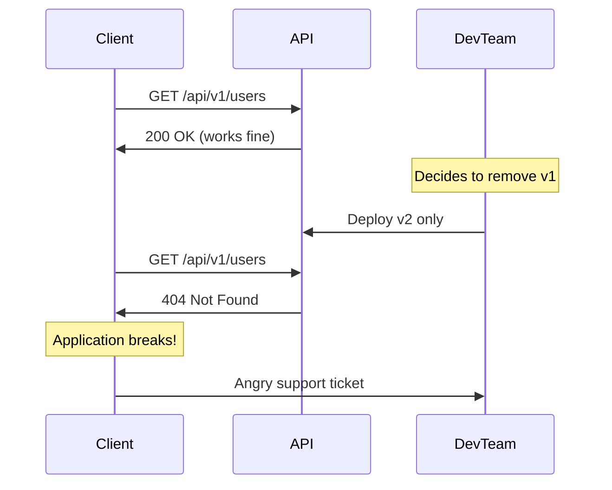
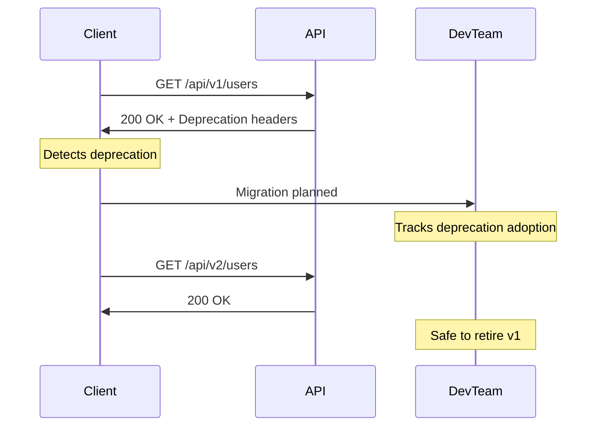
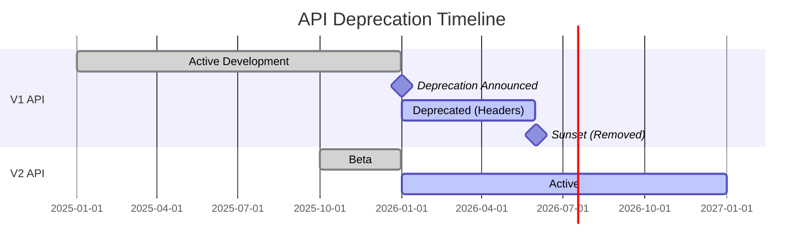

# How to Create API Deprecation Headers

Author: [nawazdhandala](https://github.com/nawazdhandala)

Tags: API, REST API, HTTP Headers, Deprecation, API Versioning, Backend Development, Web Development, API Lifecycle

Description: A practical guide to implementing API deprecation headers that warn clients about upcoming changes while giving them time to migrate gracefully.

---

When you maintain a public API, you eventually need to retire old endpoints. Maybe the response format is outdated, the endpoint has security issues, or you simply designed a better version. The challenge is communicating these changes to your API consumers without breaking their integrations overnight.

API deprecation headers solve this problem by embedding sunset information directly into HTTP responses. Clients can programmatically detect deprecated endpoints and take action before they stop working.

This guide covers the standard headers, implementation patterns across multiple languages, and monitoring strategies to track deprecation adoption.

## The Problem: Silent Breakage

Without proper deprecation communication, API retirement looks like this:



With deprecation headers, clients get advance warning:



## Standard Deprecation Headers

Two HTTP headers form the backbone of API deprecation communication: `Deprecation` and `Sunset`. Both are defined in RFC 8594.

### The Deprecation Header

The `Deprecation` header indicates that an endpoint is deprecated. It can contain either a boolean value or a timestamp indicating when the deprecation was announced.

```
Deprecation: true
```

Or with a timestamp:

```
Deprecation: Sun, 01 Jan 2026 00:00:00 GMT
```

### The Sunset Header

The `Sunset` header specifies when the endpoint will stop working. This gives clients a concrete deadline for migration.

```
Sunset: Sun, 01 Jun 2026 00:00:00 GMT
```

### The Link Header

The `Link` header points clients to migration documentation or the replacement endpoint.

```
Link: </api/v2/users>; rel="successor-version"
Link: </docs/migration/v1-to-v2>; rel="deprecation"; type="text/html"
```

## Basic Implementation in Node.js

Here is a middleware approach for Express.js that adds deprecation headers based on configuration.

```javascript
// deprecation-middleware.js
// Middleware that automatically adds deprecation headers to responses
// based on a configuration object defining deprecated routes

const express = require('express');

// Configuration object defining which endpoints are deprecated
// and their sunset dates. Store this in a config file or database.
const deprecationConfig = {
    '/api/v1/users': {
        deprecated: true,
        deprecatedAt: '2026-01-01T00:00:00Z',
        sunsetAt: '2026-06-01T00:00:00Z',
        successor: '/api/v2/users',
        migrationDoc: '/docs/migration/users-v1-to-v2'
    },
    '/api/v1/orders': {
        deprecated: true,
        deprecatedAt: '2025-12-01T00:00:00Z',
        sunsetAt: '2026-03-01T00:00:00Z',
        successor: '/api/v2/orders',
        migrationDoc: '/docs/migration/orders-v1-to-v2'
    }
};

function deprecationMiddleware(req, res, next) {
    // Store the original send function so we can intercept it
    const originalSend = res.send;

    res.send = function(body) {
        // Check if the current path matches any deprecated endpoint
        const config = findDeprecationConfig(req.path);

        if (config) {
            // Add the Deprecation header with the timestamp
            res.set('Deprecation', formatHttpDate(config.deprecatedAt));

            // Add the Sunset header to indicate removal date
            res.set('Sunset', formatHttpDate(config.sunsetAt));

            // Add Link headers for documentation and successor
            const links = [];
            if (config.successor) {
                links.push(`<${config.successor}>; rel="successor-version"`);
            }
            if (config.migrationDoc) {
                links.push(`<${config.migrationDoc}>; rel="deprecation"; type="text/html"`);
            }
            if (links.length > 0) {
                res.set('Link', links.join(', '));
            }
        }

        // Call the original send function
        return originalSend.call(this, body);
    };

    next();
}

// Helper function to find deprecation config for a path
// Supports exact matches and prefix matching for versioned APIs
function findDeprecationConfig(path) {
    // First try exact match
    if (deprecationConfig[path]) {
        return deprecationConfig[path];
    }

    // Then try prefix matching for paths with IDs
    // e.g., /api/v1/users/123 should match /api/v1/users
    for (const [pattern, config] of Object.entries(deprecationConfig)) {
        if (path.startsWith(pattern + '/') || path === pattern) {
            return config;
        }
    }

    return null;
}

// Format a date string as HTTP-date format (RFC 7231)
// Example output: "Sun, 01 Jun 2026 00:00:00 GMT"
function formatHttpDate(isoDate) {
    const date = new Date(isoDate);
    return date.toUTCString();
}

module.exports = deprecationMiddleware;
```

Now let's see how to use this middleware in your Express application.

```javascript
// app.js
// Main Express application with deprecation middleware

const express = require('express');
const deprecationMiddleware = require('./deprecation-middleware');

const app = express();

// Apply deprecation middleware globally
// This will add headers to all responses for deprecated endpoints
app.use(deprecationMiddleware);

// V1 endpoint - deprecated but still functional
app.get('/api/v1/users/:id', (req, res) => {
    const user = getUserById(req.params.id);

    // V1 returns the old response format
    res.json({
        id: user.id,
        full_name: `${user.firstName} ${user.lastName}`,
        email: user.email
    });
});

// V2 endpoint - current version
app.get('/api/v2/users/:id', (req, res) => {
    const user = getUserById(req.params.id);

    // V2 returns the new response format
    res.json({
        id: user.id,
        firstName: user.firstName,
        lastName: user.lastName,
        email: user.email,
        createdAt: user.createdAt,
        updatedAt: user.updatedAt
    });
});

app.listen(3000, () => {
    console.log('Server running on port 3000');
});
```

## Python Flask Implementation

Here is the same pattern implemented in Python using Flask.

```python
# deprecation.py
# Flask extension for adding deprecation headers to API responses

from flask import Flask, request, g
from functools import wraps
from datetime import datetime
from email.utils import formatdate
from time import mktime

# Configuration for deprecated endpoints
# In production, load this from a database or config file
DEPRECATION_CONFIG = {
    '/api/v1/users': {
        'deprecated': True,
        'deprecated_at': datetime(2026, 1, 1),
        'sunset_at': datetime(2026, 6, 1),
        'successor': '/api/v2/users',
        'migration_doc': '/docs/migration/users-v1-to-v2'
    },
    '/api/v1/products': {
        'deprecated': True,
        'deprecated_at': datetime(2025, 11, 1),
        'sunset_at': datetime(2026, 2, 1),
        'successor': '/api/v2/products',
        'migration_doc': '/docs/migration/products-v1-to-v2'
    }
}


def format_http_date(dt):
    """
    Convert a datetime object to HTTP-date format.
    HTTP-date format: "Sun, 01 Jun 2026 00:00:00 GMT"
    """
    stamp = mktime(dt.timetuple())
    return formatdate(timeval=stamp, localtime=False, usegmt=True)


def find_deprecation_config(path):
    """
    Find deprecation configuration for a given path.
    Supports both exact matches and prefix matches.
    """
    # Try exact match first
    if path in DEPRECATION_CONFIG:
        return DEPRECATION_CONFIG[path]

    # Try prefix matching for paths with IDs
    for pattern, config in DEPRECATION_CONFIG.items():
        if path.startswith(pattern + '/') or path == pattern:
            return config

    return None


def add_deprecation_headers(response):
    """
    Add deprecation headers to a Flask response object.
    Call this function in an after_request handler.
    """
    config = find_deprecation_config(request.path)

    if config and config.get('deprecated'):
        # Add Deprecation header with the announcement date
        response.headers['Deprecation'] = format_http_date(config['deprecated_at'])

        # Add Sunset header with the removal date
        response.headers['Sunset'] = format_http_date(config['sunset_at'])

        # Build Link header with successor and documentation
        links = []
        if config.get('successor'):
            links.append(f'<{config["successor"]}>; rel="successor-version"')
        if config.get('migration_doc'):
            links.append(f'<{config["migration_doc"]}>; rel="deprecation"; type="text/html"')

        if links:
            response.headers['Link'] = ', '.join(links)

    return response
```

Now let's create the Flask application that uses this deprecation module.

```python
# app.py
# Flask application with deprecation headers

from flask import Flask, jsonify
from deprecation import add_deprecation_headers

app = Flask(__name__)


# Register the after_request handler to add deprecation headers
@app.after_request
def after_request(response):
    return add_deprecation_headers(response)


# V1 endpoint - deprecated
@app.route('/api/v1/users/<int:user_id>', methods=['GET'])
def get_user_v1(user_id):
    user = fetch_user_from_database(user_id)

    # V1 response format
    return jsonify({
        'id': user.id,
        'full_name': f"{user.first_name} {user.last_name}",
        'email': user.email
    })


# V2 endpoint - current version
@app.route('/api/v2/users/<int:user_id>', methods=['GET'])
def get_user_v2(user_id):
    user = fetch_user_from_database(user_id)

    # V2 response format with additional fields
    return jsonify({
        'id': user.id,
        'firstName': user.first_name,
        'lastName': user.last_name,
        'email': user.email,
        'createdAt': user.created_at.isoformat(),
        'updatedAt': user.updated_at.isoformat()
    })


if __name__ == '__main__':
    app.run(debug=True)
```

## Go Implementation

Here is how to implement deprecation headers in a Go HTTP server.

```go
// deprecation.go
// HTTP middleware for adding deprecation headers in Go

package main

import (
	"net/http"
	"strings"
	"time"
)

// DeprecationConfig holds information about a deprecated endpoint
type DeprecationConfig struct {
	Deprecated   bool
	DeprecatedAt time.Time
	SunsetAt     time.Time
	Successor    string
	MigrationDoc string
}

// DeprecationRegistry stores configuration for all deprecated endpoints
type DeprecationRegistry struct {
	configs map[string]*DeprecationConfig
}

// NewDeprecationRegistry creates a new registry with default configuration
func NewDeprecationRegistry() *DeprecationRegistry {
	return &DeprecationRegistry{
		configs: make(map[string]*DeprecationConfig),
	}
}

// Register adds a deprecated endpoint to the registry
func (r *DeprecationRegistry) Register(path string, config *DeprecationConfig) {
	r.configs[path] = config
}

// FindConfig looks up deprecation config for a given path
// Supports exact matches and prefix matches
func (r *DeprecationRegistry) FindConfig(path string) *DeprecationConfig {
	// Try exact match
	if config, ok := r.configs[path]; ok {
		return config
	}

	// Try prefix match for paths with IDs
	for pattern, config := range r.configs {
		if strings.HasPrefix(path, pattern+"/") || path == pattern {
			return config
		}
	}

	return nil
}

// Middleware creates an HTTP middleware that adds deprecation headers
func (r *DeprecationRegistry) Middleware(next http.Handler) http.Handler {
	return http.HandlerFunc(func(w http.ResponseWriter, req *http.Request) {
		config := r.FindConfig(req.URL.Path)

		if config != nil && config.Deprecated {
			// Add Deprecation header with HTTP-date format
			w.Header().Set("Deprecation", config.DeprecatedAt.UTC().Format(http.TimeFormat))

			// Add Sunset header
			w.Header().Set("Sunset", config.SunsetAt.UTC().Format(http.TimeFormat))

			// Build Link header
			var links []string
			if config.Successor != "" {
				links = append(links, "<"+config.Successor+">; rel=\"successor-version\"")
			}
			if config.MigrationDoc != "" {
				links = append(links, "<"+config.MigrationDoc+">; rel=\"deprecation\"; type=\"text/html\"")
			}
			if len(links) > 0 {
				w.Header().Set("Link", strings.Join(links, ", "))
			}
		}

		next.ServeHTTP(w, req)
	})
}
```

Now the main application file.

```go
// main.go
// Go HTTP server with deprecation middleware

package main

import (
	"encoding/json"
	"net/http"
	"time"
)

func main() {
	// Create deprecation registry and configure deprecated endpoints
	registry := NewDeprecationRegistry()

	registry.Register("/api/v1/users", &DeprecationConfig{
		Deprecated:   true,
		DeprecatedAt: time.Date(2026, 1, 1, 0, 0, 0, 0, time.UTC),
		SunsetAt:     time.Date(2026, 6, 1, 0, 0, 0, 0, time.UTC),
		Successor:    "/api/v2/users",
		MigrationDoc: "/docs/migration/users-v1-to-v2",
	})

	// Create router
	mux := http.NewServeMux()

	// V1 endpoint - deprecated
	mux.HandleFunc("/api/v1/users/", handleUsersV1)

	// V2 endpoint - current version
	mux.HandleFunc("/api/v2/users/", handleUsersV2)

	// Wrap with deprecation middleware
	handler := registry.Middleware(mux)

	http.ListenAndServe(":8080", handler)
}

// UserV1Response is the legacy response format
type UserV1Response struct {
	ID       int    `json:"id"`
	FullName string `json:"full_name"`
	Email    string `json:"email"`
}

// UserV2Response is the current response format
type UserV2Response struct {
	ID        int    `json:"id"`
	FirstName string `json:"firstName"`
	LastName  string `json:"lastName"`
	Email     string `json:"email"`
	CreatedAt string `json:"createdAt"`
	UpdatedAt string `json:"updatedAt"`
}

func handleUsersV1(w http.ResponseWriter, r *http.Request) {
	user := fetchUserFromDatabase(r.URL.Path)

	response := UserV1Response{
		ID:       user.ID,
		FullName: user.FirstName + " " + user.LastName,
		Email:    user.Email,
	}

	w.Header().Set("Content-Type", "application/json")
	json.NewEncoder(w).Encode(response)
}

func handleUsersV2(w http.ResponseWriter, r *http.Request) {
	user := fetchUserFromDatabase(r.URL.Path)

	response := UserV2Response{
		ID:        user.ID,
		FirstName: user.FirstName,
		LastName:  user.LastName,
		Email:     user.Email,
		CreatedAt: user.CreatedAt.Format(time.RFC3339),
		UpdatedAt: user.UpdatedAt.Format(time.RFC3339),
	}

	w.Header().Set("Content-Type", "application/json")
	json.NewEncoder(w).Encode(response)
}
```

## Client-Side Detection

Clients should monitor for deprecation headers and alert developers. Here is a JavaScript example.

```javascript
// api-client.js
// HTTP client wrapper that detects and logs deprecation warnings

class APIClient {
    constructor(baseURL) {
        this.baseURL = baseURL;
        this.deprecationHandlers = [];
    }

    // Register a callback to be notified when deprecated endpoints are used
    onDeprecation(handler) {
        this.deprecationHandlers.push(handler);
    }

    // Main fetch method that wraps the native fetch API
    async fetch(path, options = {}) {
        const url = `${this.baseURL}${path}`;
        const response = await fetch(url, options);

        // Check for deprecation headers after every request
        this.checkDeprecation(path, response);

        return response;
    }

    // Inspect response headers for deprecation information
    checkDeprecation(path, response) {
        const deprecation = response.headers.get('Deprecation');
        const sunset = response.headers.get('Sunset');
        const link = response.headers.get('Link');

        if (deprecation) {
            const info = {
                path: path,
                deprecatedAt: deprecation,
                sunsetAt: sunset,
                links: this.parseLinks(link)
            };

            // Log warning to console
            console.warn(
                `API Deprecation Warning: ${path} is deprecated. ` +
                `Sunset date: ${sunset || 'not specified'}`
            );

            // Notify registered handlers
            this.deprecationHandlers.forEach(handler => handler(info));
        }
    }

    // Parse the Link header into an object
    parseLinks(linkHeader) {
        if (!linkHeader) return {};

        const links = {};
        const parts = linkHeader.split(',');

        parts.forEach(part => {
            const match = part.match(/<([^>]+)>;\s*rel="([^"]+)"/);
            if (match) {
                links[match[2]] = match[1];
            }
        });

        return links;
    }
}

// Usage example
const api = new APIClient('https://api.example.com');

// Register a handler to track deprecation in your monitoring system
api.onDeprecation(info => {
    // Send to your monitoring/alerting system
    sendToMonitoring({
        type: 'api_deprecation',
        endpoint: info.path,
        sunset: info.sunsetAt,
        successor: info.links['successor-version']
    });
});

// Make API calls as usual
const response = await api.fetch('/api/v1/users/123');
const user = await response.json();
```

## Including Deprecation in Response Body

Sometimes you want to include deprecation warnings in the response body as well. This helps clients that may not inspect headers.

```javascript
// response-formatter.js
// Utility to add deprecation metadata to JSON responses

function formatDeprecatedResponse(data, deprecationConfig) {
    // Only add metadata if the endpoint is deprecated
    if (!deprecationConfig || !deprecationConfig.deprecated) {
        return data;
    }

    return {
        // Include the original data
        ...data,

        // Add a _meta object with deprecation information
        // Using underscore prefix to indicate metadata
        _meta: {
            deprecated: true,
            deprecatedAt: deprecationConfig.deprecatedAt,
            sunsetAt: deprecationConfig.sunsetAt,
            message: `This endpoint is deprecated and will be removed on ${deprecationConfig.sunsetAt}. ` +
                     `Please migrate to ${deprecationConfig.successor}.`,
            links: {
                successor: deprecationConfig.successor,
                documentation: deprecationConfig.migrationDoc
            }
        }
    };
}

// Example usage in an Express route
app.get('/api/v1/users/:id', (req, res) => {
    const user = getUserById(req.params.id);
    const config = getDeprecationConfig('/api/v1/users');

    const response = formatDeprecatedResponse({
        id: user.id,
        full_name: `${user.firstName} ${user.lastName}`,
        email: user.email
    }, config);

    res.json(response);
});
```

The response will look like this:

```json
{
    "id": 123,
    "full_name": "John Doe",
    "email": "john@example.com",
    "_meta": {
        "deprecated": true,
        "deprecatedAt": "2026-01-01T00:00:00Z",
        "sunsetAt": "2026-06-01T00:00:00Z",
        "message": "This endpoint is deprecated and will be removed on 2026-06-01T00:00:00Z. Please migrate to /api/v2/users.",
        "links": {
            "successor": "/api/v2/users",
            "documentation": "/docs/migration/users-v1-to-v2"
        }
    }
}
```

## Monitoring Deprecation Usage

Tracking which clients still use deprecated endpoints helps you decide when it's safe to remove them. Here is a monitoring approach.

```javascript
// deprecation-monitor.js
// Express middleware that logs deprecated endpoint usage for monitoring

const deprecationMetrics = new Map();

function deprecationMonitor(req, res, next) {
    const originalSend = res.send;

    res.send = function(body) {
        // Check if this response includes deprecation headers
        const isDeprecated = res.get('Deprecation');

        if (isDeprecated) {
            // Extract client identifier from request
            const clientId = req.headers['x-client-id'] ||
                           req.headers['authorization']?.split(' ')[1] ||
                           'anonymous';

            // Build metric key
            const metricKey = `${req.method}:${req.path}`;

            // Update metrics
            if (!deprecationMetrics.has(metricKey)) {
                deprecationMetrics.set(metricKey, {
                    endpoint: req.path,
                    method: req.method,
                    totalCalls: 0,
                    uniqueClients: new Set(),
                    lastUsed: null
                });
            }

            const metric = deprecationMetrics.get(metricKey);
            metric.totalCalls++;
            metric.uniqueClients.add(clientId);
            metric.lastUsed = new Date().toISOString();

            // Log for external monitoring systems
            console.log(JSON.stringify({
                type: 'deprecated_endpoint_usage',
                timestamp: new Date().toISOString(),
                endpoint: req.path,
                method: req.method,
                clientId: clientId,
                userAgent: req.headers['user-agent']
            }));
        }

        return originalSend.call(this, body);
    };

    next();
}

// Endpoint to expose deprecation metrics
function getDeprecationMetrics(req, res) {
    const metrics = [];

    deprecationMetrics.forEach((value, key) => {
        metrics.push({
            endpoint: value.endpoint,
            method: value.method,
            totalCalls: value.totalCalls,
            uniqueClients: value.uniqueClients.size,
            lastUsed: value.lastUsed
        });
    });

    res.json({
        generatedAt: new Date().toISOString(),
        metrics: metrics
    });
}

module.exports = { deprecationMonitor, getDeprecationMetrics };
```

## Deprecation Timeline Strategy

A good deprecation strategy follows a predictable timeline.



Here is how to implement timeline-based deprecation status.

```python
# timeline_deprecation.py
# Time-aware deprecation configuration

from datetime import datetime
from enum import Enum


class DeprecationStatus(Enum):
    ACTIVE = "active"
    DEPRECATED = "deprecated"
    SUNSET = "sunset"


class TimelineDeprecation:
    """
    Manages deprecation status based on configured timelines.
    Automatically transitions between states based on current date.
    """

    def __init__(self, deprecated_at=None, sunset_at=None):
        self.deprecated_at = deprecated_at
        self.sunset_at = sunset_at

    def get_status(self):
        """
        Determine current deprecation status based on timeline.
        Returns ACTIVE, DEPRECATED, or SUNSET.
        """
        now = datetime.utcnow()

        # Check if past sunset date
        if self.sunset_at and now >= self.sunset_at:
            return DeprecationStatus.SUNSET

        # Check if past deprecation date
        if self.deprecated_at and now >= self.deprecated_at:
            return DeprecationStatus.DEPRECATED

        return DeprecationStatus.ACTIVE

    def days_until_sunset(self):
        """Calculate days remaining until sunset."""
        if not self.sunset_at:
            return None

        now = datetime.utcnow()
        if now >= self.sunset_at:
            return 0

        return (self.sunset_at - now).days


# Configuration with timeline
ENDPOINT_TIMELINE = {
    '/api/v1/users': TimelineDeprecation(
        deprecated_at=datetime(2026, 1, 1),
        sunset_at=datetime(2026, 6, 1)
    ),
    '/api/v1/orders': TimelineDeprecation(
        deprecated_at=datetime(2025, 12, 1),
        sunset_at=datetime(2026, 3, 1)
    )
}


def get_endpoint_status(path):
    """
    Get the current deprecation status for an endpoint.
    Returns status and days until sunset if applicable.
    """
    timeline = ENDPOINT_TIMELINE.get(path)

    if not timeline:
        return {
            'status': DeprecationStatus.ACTIVE,
            'days_until_sunset': None
        }

    return {
        'status': timeline.get_status(),
        'days_until_sunset': timeline.days_until_sunset()
    }
```

## Handling Sunset: Returning 410 Gone

Once an endpoint reaches its sunset date, return HTTP 410 Gone instead of 404 Not Found. This tells clients the resource existed but was intentionally removed.

```javascript
// sunset-handler.js
// Middleware that returns 410 Gone for sunset endpoints

const sunsetConfig = {
    '/api/v1/legacy': {
        sunsetAt: new Date('2025-06-01'),
        successor: '/api/v2/modern',
        migrationDoc: '/docs/migration/legacy-to-modern'
    }
};

function sunsetHandler(req, res, next) {
    const config = sunsetConfig[req.path];

    if (config && new Date() >= config.sunsetAt) {
        // Return 410 Gone with helpful information
        res.status(410).json({
            error: 'Gone',
            message: 'This API endpoint has been retired.',
            retiredAt: config.sunsetAt.toISOString(),
            successor: config.successor,
            documentation: config.migrationDoc
        });
        return;
    }

    next();
}

module.exports = sunsetHandler;
```

## Testing Deprecation Headers

Automated tests should verify deprecation headers are present and correct.

```python
# test_deprecation.py
# pytest tests for deprecation headers

import pytest
from datetime import datetime
from app import app


@pytest.fixture
def client():
    app.config['TESTING'] = True
    with app.test_client() as client:
        yield client


class TestDeprecationHeaders:
    """Test suite for API deprecation headers."""

    def test_deprecated_endpoint_has_deprecation_header(self, client):
        """Deprecated endpoints should include the Deprecation header."""
        response = client.get('/api/v1/users/1')

        assert response.status_code == 200
        assert 'Deprecation' in response.headers

    def test_deprecated_endpoint_has_sunset_header(self, client):
        """Deprecated endpoints should include the Sunset header."""
        response = client.get('/api/v1/users/1')

        assert response.status_code == 200
        assert 'Sunset' in response.headers

        # Verify sunset date is in the future
        sunset_date = parse_http_date(response.headers['Sunset'])
        assert sunset_date > datetime.utcnow()

    def test_deprecated_endpoint_has_link_header(self, client):
        """Deprecated endpoints should include Link header with successor."""
        response = client.get('/api/v1/users/1')

        assert response.status_code == 200
        assert 'Link' in response.headers
        assert 'successor-version' in response.headers['Link']

    def test_active_endpoint_no_deprecation_headers(self, client):
        """Active endpoints should not have deprecation headers."""
        response = client.get('/api/v2/users/1')

        assert response.status_code == 200
        assert 'Deprecation' not in response.headers
        assert 'Sunset' not in response.headers

    def test_sunset_endpoint_returns_410(self, client):
        """Sunset endpoints should return 410 Gone."""
        # Assuming /api/v0/legacy is past its sunset date
        response = client.get('/api/v0/legacy/resource')

        assert response.status_code == 410
        data = response.get_json()
        assert 'successor' in data


def parse_http_date(date_string):
    """Parse HTTP-date format to datetime."""
    from email.utils import parsedate_to_datetime
    return parsedate_to_datetime(date_string)
```

## Best Practices

1. **Announce deprecation early.** Give clients at least 6 months notice before sunset. For major APIs, 12 months is better.

2. **Use standard headers.** Stick to `Deprecation`, `Sunset`, and `Link` headers as defined in RFC 8594. Clients may already have tooling for these.

3. **Include body warnings.** Not all clients inspect headers. Add deprecation metadata to response bodies as well.

4. **Monitor usage.** Track which clients still use deprecated endpoints. Reach out to heavy users directly before sunset.

5. **Provide migration docs.** The `Link` header should point to clear, actionable migration documentation.

6. **Return 410 after sunset.** Don't just 404. A 410 Gone response with migration info helps confused developers.

7. **Version your deprecation config.** Store deprecation configuration in version control so you can track when decisions were made.

8. **Automate header injection.** Use middleware to add deprecation headers consistently. Don't rely on developers remembering to add them manually.

## Conclusion

API deprecation headers transform endpoint retirement from a breaking change into a managed migration. By using standard headers like `Deprecation` and `Sunset`, you give clients programmatic access to lifecycle information. Combined with monitoring and clear documentation, this approach lets you evolve your API while maintaining trust with your consumers.

Start by adding deprecation middleware to your existing deprecated endpoints. Monitor usage, reach out to clients still using old versions, and only sunset endpoints once you have confirmed low or zero usage. Your API consumers will appreciate the transparency.
