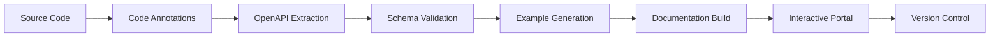
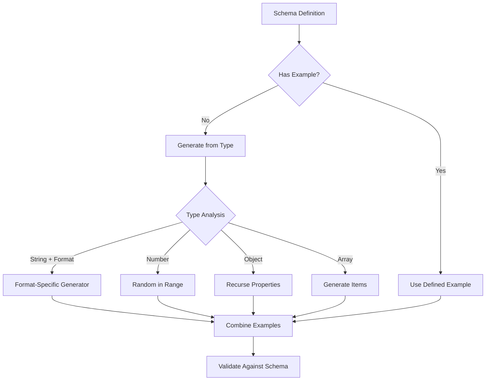
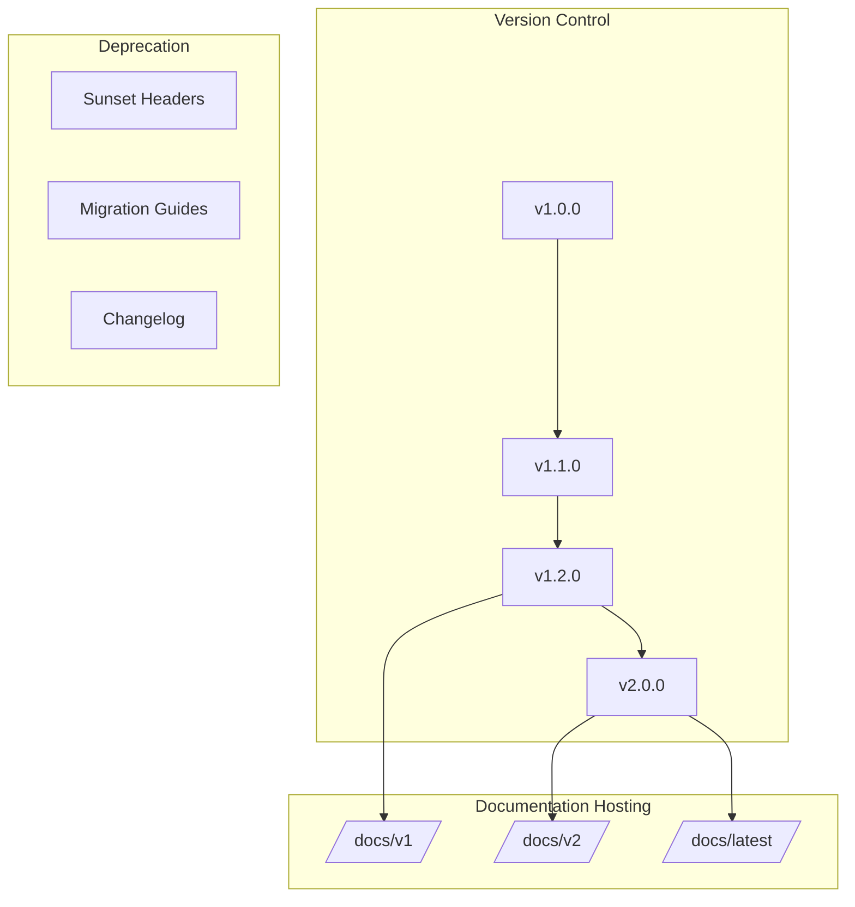
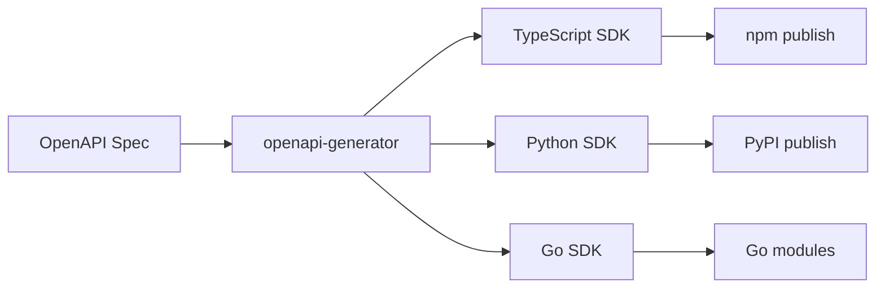

# How to Implement API Documentation Generation

Author: [nawazdhandala](https://github.com/nawazdhandala)

Tags: Developer Experience, API Documentation, OpenAPI, Developer Portal

Description: Learn to implement automated API documentation generation with OpenAPI extraction, example generation, and interactive documentation for API discovery.

---

Well-documented APIs are the foundation of great developer experience. Manual documentation quickly becomes outdated as APIs evolve, creating friction for consumers and support burden for maintainers. Automated documentation generation solves this by keeping docs synchronized with your actual API implementation.

This guide covers the complete pipeline for generating, hosting, and versioning API documentation - from code annotations to interactive developer portals.

## The Documentation Generation Pipeline

Before diving into implementation, let's understand the full documentation pipeline:



Each stage transforms your API code into consumable documentation that stays current with every deployment.

## OpenAPI Specification Generation

### Approach 1: Code-First with Annotations

The code-first approach extracts OpenAPI specifications directly from your source code using annotations. This keeps documentation close to implementation.

#### Express.js with swagger-jsdoc

```javascript
// swagger-config.js
const swaggerJsdoc = require('swagger-jsdoc');

const options = {
  definition: {
    openapi: '3.0.3',
    info: {
      title: 'User Management API',
      version: '1.0.0',
      description: 'API for managing users, authentication, and permissions',
      contact: {
        name: 'API Support',
        email: 'api@example.com',
      },
      license: {
        name: 'MIT',
        url: 'https://opensource.org/licenses/MIT',
      },
    },
    servers: [
      {
        url: 'https://api.example.com/v1',
        description: 'Production server',
      },
      {
        url: 'https://staging-api.example.com/v1',
        description: 'Staging server',
      },
    ],
    components: {
      securitySchemes: {
        bearerAuth: {
          type: 'http',
          scheme: 'bearer',
          bearerFormat: 'JWT',
        },
        apiKey: {
          type: 'apiKey',
          in: 'header',
          name: 'X-API-Key',
        },
      },
    },
  },
  // Path to files containing annotations
  apis: ['./routes/*.js', './models/*.js'],
};

const openapiSpecification = swaggerJsdoc(options);
module.exports = openapiSpecification;
```

#### Annotating Routes

```javascript
// routes/users.js

/**
 * @openapi
 * components:
 *   schemas:
 *     User:
 *       type: object
 *       required:
 *         - email
 *         - name
 *       properties:
 *         id:
 *           type: string
 *           format: uuid
 *           description: Unique user identifier
 *           example: "550e8400-e29b-41d4-a716-446655440000"
 *         email:
 *           type: string
 *           format: email
 *           description: User email address
 *           example: "user@example.com"
 *         name:
 *           type: string
 *           minLength: 1
 *           maxLength: 100
 *           description: Full name of the user
 *           example: "Jane Smith"
 *         role:
 *           type: string
 *           enum: [admin, user, guest]
 *           default: user
 *           description: User role for access control
 *         createdAt:
 *           type: string
 *           format: date-time
 *           description: Account creation timestamp
 *         metadata:
 *           type: object
 *           additionalProperties: true
 *           description: Custom user metadata
 *
 *     UserCreate:
 *       type: object
 *       required:
 *         - email
 *         - name
 *         - password
 *       properties:
 *         email:
 *           type: string
 *           format: email
 *         name:
 *           type: string
 *           minLength: 1
 *           maxLength: 100
 *         password:
 *           type: string
 *           format: password
 *           minLength: 8
 *           description: Must contain uppercase, lowercase, and number
 *         role:
 *           type: string
 *           enum: [admin, user, guest]
 *           default: user
 *
 *     Error:
 *       type: object
 *       properties:
 *         code:
 *           type: string
 *           description: Error code for programmatic handling
 *         message:
 *           type: string
 *           description: Human-readable error message
 *         details:
 *           type: array
 *           items:
 *             type: object
 *             properties:
 *               field:
 *                 type: string
 *               message:
 *                 type: string
 */

/**
 * @openapi
 * /users:
 *   get:
 *     summary: List all users
 *     description: |
 *       Retrieves a paginated list of users. Results can be filtered
 *       by role and sorted by creation date.
 *
 *       **Rate Limit:** 100 requests per minute
 *     operationId: listUsers
 *     tags:
 *       - Users
 *     security:
 *       - bearerAuth: []
 *     parameters:
 *       - name: page
 *         in: query
 *         description: Page number for pagination
 *         schema:
 *           type: integer
 *           minimum: 1
 *           default: 1
 *       - name: limit
 *         in: query
 *         description: Number of items per page
 *         schema:
 *           type: integer
 *           minimum: 1
 *           maximum: 100
 *           default: 20
 *       - name: role
 *         in: query
 *         description: Filter by user role
 *         schema:
 *           type: string
 *           enum: [admin, user, guest]
 *       - name: sort
 *         in: query
 *         description: Sort order
 *         schema:
 *           type: string
 *           enum: [createdAt, -createdAt, name, -name]
 *           default: -createdAt
 *     responses:
 *       200:
 *         description: Successful response with user list
 *         content:
 *           application/json:
 *             schema:
 *               type: object
 *               properties:
 *                 data:
 *                   type: array
 *                   items:
 *                     $ref: '#/components/schemas/User'
 *                 pagination:
 *                   type: object
 *                   properties:
 *                     page:
 *                       type: integer
 *                     limit:
 *                       type: integer
 *                     total:
 *                       type: integer
 *                     totalPages:
 *                       type: integer
 *             example:
 *               data:
 *                 - id: "550e8400-e29b-41d4-a716-446655440000"
 *                   email: "jane@example.com"
 *                   name: "Jane Smith"
 *                   role: "admin"
 *                   createdAt: "2024-01-15T10:30:00Z"
 *               pagination:
 *                 page: 1
 *                 limit: 20
 *                 total: 150
 *                 totalPages: 8
 *       401:
 *         description: Authentication required
 *         content:
 *           application/json:
 *             schema:
 *               $ref: '#/components/schemas/Error'
 *       403:
 *         description: Insufficient permissions
 */
router.get('/', authenticate, async (req, res) => {
  const { page = 1, limit = 20, role, sort = '-createdAt' } = req.query;

  const users = await userService.list({ page, limit, role, sort });
  res.json(users);
});

/**
 * @openapi
 * /users:
 *   post:
 *     summary: Create a new user
 *     description: |
 *       Creates a new user account. Requires admin privileges.
 *
 *       A verification email will be sent to the provided address.
 *     operationId: createUser
 *     tags:
 *       - Users
 *     security:
 *       - bearerAuth: []
 *     requestBody:
 *       required: true
 *       content:
 *         application/json:
 *           schema:
 *             $ref: '#/components/schemas/UserCreate'
 *           examples:
 *             basic:
 *               summary: Basic user creation
 *               value:
 *                 email: "newuser@example.com"
 *                 name: "New User"
 *                 password: "SecurePass123"
 *             admin:
 *               summary: Create admin user
 *               value:
 *                 email: "admin@example.com"
 *                 name: "Admin User"
 *                 password: "SecurePass123"
 *                 role: "admin"
 *     responses:
 *       201:
 *         description: User created successfully
 *         content:
 *           application/json:
 *             schema:
 *               $ref: '#/components/schemas/User'
 *         headers:
 *           Location:
 *             description: URL of the created resource
 *             schema:
 *               type: string
 *               format: uri
 *       400:
 *         description: Validation error
 *         content:
 *           application/json:
 *             schema:
 *               $ref: '#/components/schemas/Error'
 *             example:
 *               code: "VALIDATION_ERROR"
 *               message: "Request validation failed"
 *               details:
 *                 - field: "email"
 *                   message: "Email already exists"
 *       401:
 *         description: Authentication required
 *       403:
 *         description: Admin privileges required
 */
router.post('/', authenticate, requireAdmin, async (req, res) => {
  const user = await userService.create(req.body);
  res.status(201).location(`/users/${user.id}`).json(user);
});
```

### Approach 2: FastAPI with Python Type Hints

Python's FastAPI generates OpenAPI specs automatically from type hints and Pydantic models:

```python
# models.py
from pydantic import BaseModel, Field, EmailStr
from typing import Optional, List
from datetime import datetime
from enum import Enum

class UserRole(str, Enum):
    admin = "admin"
    user = "user"
    guest = "guest"

class UserBase(BaseModel):
    email: EmailStr = Field(
        ...,
        description="User email address",
        example="user@example.com"
    )
    name: str = Field(
        ...,
        min_length=1,
        max_length=100,
        description="Full name of the user",
        example="Jane Smith"
    )
    role: UserRole = Field(
        default=UserRole.user,
        description="User role for access control"
    )

class UserCreate(UserBase):
    password: str = Field(
        ...,
        min_length=8,
        description="Must contain uppercase, lowercase, and number",
        example="SecurePass123"
    )

class User(UserBase):
    id: str = Field(
        ...,
        description="Unique user identifier",
        example="550e8400-e29b-41d4-a716-446655440000"
    )
    created_at: datetime = Field(
        ...,
        description="Account creation timestamp"
    )

    class Config:
        json_schema_extra = {
            "example": {
                "id": "550e8400-e29b-41d4-a716-446655440000",
                "email": "jane@example.com",
                "name": "Jane Smith",
                "role": "admin",
                "created_at": "2024-01-15T10:30:00Z"
            }
        }

class PaginatedResponse(BaseModel):
    data: List[User]
    page: int
    limit: int
    total: int
    total_pages: int
```

```python
# routes.py
from fastapi import FastAPI, Query, Path, HTTPException, Depends, status
from fastapi.security import HTTPBearer, HTTPAuthorizationCredentials
from typing import Optional

app = FastAPI(
    title="User Management API",
    description="""
    API for managing users, authentication, and permissions.

    ## Features
    - User CRUD operations
    - Role-based access control
    - Pagination and filtering

    ## Authentication
    All endpoints require Bearer token authentication.
    """,
    version="1.0.0",
    contact={
        "name": "API Support",
        "email": "api@example.com",
    },
    license_info={
        "name": "MIT",
        "url": "https://opensource.org/licenses/MIT",
    },
)

security = HTTPBearer()

@app.get(
    "/users",
    response_model=PaginatedResponse,
    summary="List all users",
    description="""
    Retrieves a paginated list of users. Results can be filtered
    by role and sorted by creation date.

    **Rate Limit:** 100 requests per minute
    """,
    responses={
        401: {"description": "Authentication required"},
        403: {"description": "Insufficient permissions"},
    },
    tags=["Users"],
)
async def list_users(
    page: int = Query(
        default=1,
        ge=1,
        description="Page number for pagination"
    ),
    limit: int = Query(
        default=20,
        ge=1,
        le=100,
        description="Number of items per page"
    ),
    role: Optional[UserRole] = Query(
        default=None,
        description="Filter by user role"
    ),
    sort: str = Query(
        default="-created_at",
        regex="^-?(created_at|name)$",
        description="Sort order"
    ),
    credentials: HTTPAuthorizationCredentials = Depends(security),
):
    users = await user_service.list(page=page, limit=limit, role=role, sort=sort)
    return users

@app.post(
    "/users",
    response_model=User,
    status_code=status.HTTP_201_CREATED,
    summary="Create a new user",
    description="""
    Creates a new user account. Requires admin privileges.

    A verification email will be sent to the provided address.
    """,
    responses={
        400: {
            "description": "Validation error",
            "content": {
                "application/json": {
                    "example": {
                        "code": "VALIDATION_ERROR",
                        "message": "Email already exists"
                    }
                }
            }
        },
        401: {"description": "Authentication required"},
        403: {"description": "Admin privileges required"},
    },
    tags=["Users"],
)
async def create_user(
    user_data: UserCreate,
    credentials: HTTPAuthorizationCredentials = Depends(security),
):
    return await user_service.create(user_data)
```

### Exporting the OpenAPI Specification

```python
# export_openapi.py
import json
import yaml
from main import app

# Export as JSON
with open("openapi.json", "w") as f:
    json.dump(app.openapi(), f, indent=2)

# Export as YAML
with open("openapi.yaml", "w") as f:
    yaml.dump(app.openapi(), f, sort_keys=False)
```

## Example Generation from Code

Good documentation includes realistic examples. Here is how to generate them automatically:



### Example Generator Implementation

```javascript
// example-generator.js
const { faker } = require('@faker-js/faker');

class OpenAPIExampleGenerator {
  constructor(spec) {
    this.spec = spec;
    this.schemas = spec.components?.schemas || {};
  }

  generateForSchema(schemaName) {
    const schema = this.schemas[schemaName];
    if (!schema) {
      throw new Error(`Schema '${schemaName}' not found`);
    }
    return this.generateFromSchema(schema);
  }

  generateFromSchema(schema, depth = 0) {
    // Prevent infinite recursion
    if (depth > 10) return null;

    // Handle $ref
    if (schema.$ref) {
      const refName = schema.$ref.split('/').pop();
      return this.generateForSchema(refName);
    }

    // Use existing example if provided
    if (schema.example !== undefined) {
      return schema.example;
    }

    // Generate based on type
    switch (schema.type) {
      case 'string':
        return this.generateString(schema);
      case 'integer':
      case 'number':
        return this.generateNumber(schema);
      case 'boolean':
        return faker.datatype.boolean();
      case 'array':
        return this.generateArray(schema, depth);
      case 'object':
        return this.generateObject(schema, depth);
      default:
        // Handle oneOf, anyOf, allOf
        if (schema.oneOf) {
          return this.generateFromSchema(schema.oneOf[0], depth);
        }
        if (schema.anyOf) {
          return this.generateFromSchema(schema.anyOf[0], depth);
        }
        if (schema.allOf) {
          return schema.allOf.reduce((acc, subSchema) => {
            return { ...acc, ...this.generateFromSchema(subSchema, depth) };
          }, {});
        }
        return null;
    }
  }

  generateString(schema) {
    // Handle enum
    if (schema.enum) {
      return schema.enum[0];
    }

    // Handle format
    switch (schema.format) {
      case 'uuid':
        return faker.string.uuid();
      case 'email':
        return faker.internet.email();
      case 'uri':
      case 'url':
        return faker.internet.url();
      case 'date':
        return faker.date.recent().toISOString().split('T')[0];
      case 'date-time':
        return faker.date.recent().toISOString();
      case 'password':
        return 'SecurePassword123!';
      case 'byte':
        return Buffer.from(faker.lorem.word()).toString('base64');
      case 'ipv4':
        return faker.internet.ipv4();
      case 'ipv6':
        return faker.internet.ipv6();
      default:
        // Use pattern if available
        if (schema.pattern) {
          return this.generateFromPattern(schema.pattern);
        }
        // Generate based on field name hints
        const minLength = schema.minLength || 1;
        const maxLength = schema.maxLength || 50;
        return faker.lorem.words(Math.ceil(maxLength / 10)).substring(0, maxLength);
    }
  }

  generateNumber(schema) {
    const min = schema.minimum ?? 0;
    const max = schema.maximum ?? 1000;

    if (schema.type === 'integer') {
      return faker.number.int({ min, max });
    }
    return faker.number.float({ min, max, fractionDigits: 2 });
  }

  generateArray(schema, depth) {
    const minItems = schema.minItems || 1;
    const maxItems = Math.min(schema.maxItems || 3, 5);
    const count = faker.number.int({ min: minItems, max: maxItems });

    if (!schema.items) return [];

    return Array.from({ length: count }, () =>
      this.generateFromSchema(schema.items, depth + 1)
    );
  }

  generateObject(schema, depth) {
    const result = {};
    const properties = schema.properties || {};
    const required = schema.required || [];

    for (const [propName, propSchema] of Object.entries(properties)) {
      // Always include required properties
      // Include optional properties 50% of the time
      if (required.includes(propName) || Math.random() > 0.5) {
        result[propName] = this.generateFromSchema(propSchema, depth + 1);
      }
    }

    return result;
  }

  // Generate examples for all endpoints
  generateAllExamples() {
    const examples = {};

    for (const [path, methods] of Object.entries(this.spec.paths || {})) {
      examples[path] = {};

      for (const [method, operation] of Object.entries(methods)) {
        if (['get', 'post', 'put', 'patch', 'delete'].includes(method)) {
          examples[path][method] = {
            request: this.generateRequestExample(operation),
            responses: this.generateResponseExamples(operation),
          };
        }
      }
    }

    return examples;
  }

  generateRequestExample(operation) {
    const example = {};

    // Path and query parameters
    if (operation.parameters) {
      example.parameters = {};
      for (const param of operation.parameters) {
        if (param.schema) {
          example.parameters[param.name] = this.generateFromSchema(param.schema);
        }
      }
    }

    // Request body
    if (operation.requestBody?.content?.['application/json']?.schema) {
      example.body = this.generateFromSchema(
        operation.requestBody.content['application/json'].schema
      );
    }

    return example;
  }

  generateResponseExamples(operation) {
    const examples = {};

    for (const [status, response] of Object.entries(operation.responses || {})) {
      if (response.content?.['application/json']?.schema) {
        examples[status] = this.generateFromSchema(
          response.content['application/json'].schema
        );
      }
    }

    return examples;
  }
}

module.exports = OpenAPIExampleGenerator;
```

## Interactive Documentation Hosting

### Using Swagger UI

```javascript
// swagger-ui-setup.js
const express = require('express');
const swaggerUi = require('swagger-ui-express');
const openapiSpec = require('./openapi.json');

const app = express();

// Custom Swagger UI options
const swaggerOptions = {
  customCss: `
    .swagger-ui .topbar { display: none }
    .swagger-ui .info { margin: 30px 0 }
    .swagger-ui .scheme-container { padding: 15px 0 }
  `,
  customSiteTitle: 'API Documentation',
  customfavIcon: '/favicon.ico',
  swaggerOptions: {
    persistAuthorization: true,
    displayRequestDuration: true,
    filter: true,
    showExtensions: true,
    showCommonExtensions: true,
    tryItOutEnabled: true,
    requestSnippetsEnabled: true,
    requestSnippets: {
      generators: {
        curl_bash: { title: 'cURL (bash)', syntax: 'bash' },
        curl_powershell: { title: 'cURL (PowerShell)', syntax: 'powershell' },
        curl_cmd: { title: 'cURL (CMD)', syntax: 'bash' },
        node_fetch: { title: 'Node.js (fetch)', syntax: 'javascript' },
        python_requests: { title: 'Python (requests)', syntax: 'python' },
      },
      defaultExpanded: true,
      languages: null,
    },
  },
};

app.use('/docs', swaggerUi.serve, swaggerUi.setup(openapiSpec, swaggerOptions));

// Serve raw OpenAPI spec
app.get('/openapi.json', (req, res) => {
  res.json(openapiSpec);
});

app.get('/openapi.yaml', (req, res) => {
  const yaml = require('js-yaml');
  res.type('text/yaml').send(yaml.dump(openapiSpec));
});
```

### Using Redoc for Static Documentation

```html
<!-- docs/index.html -->
<!DOCTYPE html>
<html>
<head>
  <title>API Documentation</title>
  <meta charset="utf-8"/>
  <meta name="viewport" content="width=device-width, initial-scale=1">
  <link href="https://fonts.googleapis.com/css?family=Montserrat:300,400,700|Roboto:300,400,700" rel="stylesheet">
  <style>
    body { margin: 0; padding: 0; }
  </style>
</head>
<body>
  <redoc
    spec-url='/openapi.json'
    expand-responses="200,201"
    hide-download-button="false"
    hide-hostname="false"
    path-in-middle-panel="true"
    native-scrollbars="true"
    required-props-first="true"
    sort-props-alphabetically="false"
    untrusted-spec="false"
    theme='{
      "colors": {
        "primary": { "main": "#32329f" }
      },
      "typography": {
        "fontSize": "15px",
        "headings": { "fontFamily": "Montserrat, sans-serif" }
      },
      "sidebar": {
        "width": "260px"
      }
    }'
  ></redoc>
  <script src="https://cdn.redoc.ly/redoc/latest/bundles/redoc.standalone.js"></script>
</body>
</html>
```

## Documentation Versioning

### Version Management Strategy



### Multi-Version Documentation Server

```javascript
// versioned-docs.js
const express = require('express');
const swaggerUi = require('swagger-ui-express');
const path = require('path');
const fs = require('fs');

const app = express();

// Load all available versions
const specsDir = path.join(__dirname, 'specs');
const versions = fs.readdirSync(specsDir)
  .filter(f => f.endsWith('.json'))
  .map(f => f.replace('.json', ''))
  .sort((a, b) => b.localeCompare(a, undefined, { numeric: true }));

const latestVersion = versions[0];

// Version selector middleware
app.get('/docs', (req, res) => {
  res.send(`
    <!DOCTYPE html>
    <html>
    <head>
      <title>API Documentation</title>
      <style>
        body { font-family: sans-serif; max-width: 800px; margin: 50px auto; }
        .version-list { list-style: none; padding: 0; }
        .version-list li { margin: 10px 0; }
        .version-list a {
          display: inline-block;
          padding: 10px 20px;
          background: #0066cc;
          color: white;
          text-decoration: none;
          border-radius: 4px;
        }
        .version-list a:hover { background: #0052a3; }
        .latest { background: #28a745 !important; }
        .deprecated { background: #dc3545 !important; }
      </style>
    </head>
    <body>
      <h1>API Documentation</h1>
      <h2>Available Versions</h2>
      <ul class="version-list">
        ${versions.map(v => `
          <li>
            <a href="/docs/${v}" class="${v === latestVersion ? 'latest' : ''}">
              ${v} ${v === latestVersion ? '(latest)' : ''}
            </a>
          </li>
        `).join('')}
      </ul>
    </body>
    </html>
  `);
});

// Serve each version
versions.forEach(version => {
  const spec = require(path.join(specsDir, `${version}.json`));

  app.use(
    `/docs/${version}`,
    swaggerUi.serve,
    swaggerUi.setup(spec, {
      customSiteTitle: `API Docs ${version}`,
    })
  );

  app.get(`/specs/${version}.json`, (req, res) => res.json(spec));
});

// Redirect /docs/latest to current version
app.get('/docs/latest', (req, res) => {
  res.redirect(`/docs/${latestVersion}`);
});

// Deprecation headers middleware
app.use((req, res, next) => {
  const versionMatch = req.path.match(/\/v(\d+)\//);
  if (versionMatch) {
    const requestedVersion = `v${versionMatch[1]}`;
    if (requestedVersion !== latestVersion) {
      res.set('Deprecation', 'true');
      res.set('Sunset', 'Sat, 31 Dec 2025 23:59:59 GMT');
      res.set('Link', `</docs/${latestVersion}>; rel="successor-version"`);
    }
  }
  next();
});
```

### Changelog Generation

```javascript
// changelog-generator.js
const diff = require('deep-diff');
const semver = require('semver');

class ChangelogGenerator {
  constructor(oldSpec, newSpec) {
    this.oldSpec = oldSpec;
    this.newSpec = newSpec;
    this.changes = {
      breaking: [],
      additions: [],
      modifications: [],
      deprecations: [],
    };
  }

  generate() {
    this.compareEndpoints();
    this.compareSchemas();
    this.compareSecuritySchemes();

    return this.formatChangelog();
  }

  compareEndpoints() {
    const oldPaths = Object.keys(this.oldSpec.paths || {});
    const newPaths = Object.keys(this.newSpec.paths || {});

    // Find removed endpoints (breaking)
    for (const path of oldPaths) {
      if (!newPaths.includes(path)) {
        this.changes.breaking.push({
          type: 'endpoint_removed',
          path,
          description: `Endpoint ${path} has been removed`,
        });
      }
    }

    // Find added endpoints
    for (const path of newPaths) {
      if (!oldPaths.includes(path)) {
        const methods = Object.keys(this.newSpec.paths[path])
          .filter(m => ['get', 'post', 'put', 'patch', 'delete'].includes(m));

        this.changes.additions.push({
          type: 'endpoint_added',
          path,
          methods,
          description: `New endpoint ${path} (${methods.join(', ').toUpperCase()})`,
        });
      }
    }

    // Compare existing endpoints
    for (const path of oldPaths.filter(p => newPaths.includes(p))) {
      this.compareEndpointMethods(path);
    }
  }

  compareEndpointMethods(path) {
    const oldMethods = this.oldSpec.paths[path];
    const newMethods = this.newSpec.paths[path];

    for (const method of Object.keys(oldMethods)) {
      if (!['get', 'post', 'put', 'patch', 'delete'].includes(method)) continue;

      if (!newMethods[method]) {
        this.changes.breaking.push({
          type: 'method_removed',
          path,
          method: method.toUpperCase(),
          description: `${method.toUpperCase()} ${path} has been removed`,
        });
        continue;
      }

      // Check for parameter changes
      this.compareParameters(path, method, oldMethods[method], newMethods[method]);

      // Check for response changes
      this.compareResponses(path, method, oldMethods[method], newMethods[method]);
    }
  }

  compareParameters(path, method, oldOp, newOp) {
    const oldParams = oldOp.parameters || [];
    const newParams = newOp.parameters || [];

    // Check for removed required parameters (breaking)
    for (const oldParam of oldParams) {
      const newParam = newParams.find(p => p.name === oldParam.name && p.in === oldParam.in);

      if (!newParam) {
        this.changes.modifications.push({
          type: 'parameter_removed',
          path,
          method: method.toUpperCase(),
          parameter: oldParam.name,
          description: `Parameter '${oldParam.name}' removed from ${method.toUpperCase()} ${path}`,
        });
      }
    }

    // Check for new required parameters (breaking)
    for (const newParam of newParams) {
      const oldParam = oldParams.find(p => p.name === newParam.name && p.in === newParam.in);

      if (!oldParam && newParam.required) {
        this.changes.breaking.push({
          type: 'required_parameter_added',
          path,
          method: method.toUpperCase(),
          parameter: newParam.name,
          description: `New required parameter '${newParam.name}' added to ${method.toUpperCase()} ${path}`,
        });
      } else if (!oldParam) {
        this.changes.additions.push({
          type: 'parameter_added',
          path,
          method: method.toUpperCase(),
          parameter: newParam.name,
          description: `New optional parameter '${newParam.name}' added to ${method.toUpperCase()} ${path}`,
        });
      }
    }
  }

  formatChangelog() {
    const lines = ['# API Changelog\n'];

    if (this.changes.breaking.length > 0) {
      lines.push('## Breaking Changes\n');
      for (const change of this.changes.breaking) {
        lines.push(`- ${change.description}`);
      }
      lines.push('');
    }

    if (this.changes.additions.length > 0) {
      lines.push('## New Features\n');
      for (const change of this.changes.additions) {
        lines.push(`- ${change.description}`);
      }
      lines.push('');
    }

    if (this.changes.modifications.length > 0) {
      lines.push('## Changes\n');
      for (const change of this.changes.modifications) {
        lines.push(`- ${change.description}`);
      }
      lines.push('');
    }

    if (this.changes.deprecations.length > 0) {
      lines.push('## Deprecations\n');
      for (const change of this.changes.deprecations) {
        lines.push(`- ${change.description}`);
      }
    }

    return lines.join('\n');
  }
}

module.exports = ChangelogGenerator;
```

## CI/CD Integration

### GitHub Actions Workflow

```yaml
# .github/workflows/api-docs.yml
name: API Documentation

on:
  push:
    branches: [main]
    paths:
      - 'src/routes/**'
      - 'src/models/**'
      - 'openapi/**'
  pull_request:
    branches: [main]

jobs:
  generate-docs:
    runs-on: ubuntu-latest

    steps:
      - uses: actions/checkout@v4

      - name: Setup Node.js
        uses: actions/setup-node@v4
        with:
          node-version: '20'
          cache: 'npm'

      - name: Install dependencies
        run: npm ci

      - name: Generate OpenAPI spec
        run: npm run generate:openapi

      - name: Validate OpenAPI spec
        run: npx @redocly/cli lint openapi.json

      - name: Check for breaking changes
        if: github.event_name == 'pull_request'
        run: |
          git fetch origin main
          git show origin/main:openapi.json > openapi-main.json
          npx oasdiff breaking openapi-main.json openapi.json

      - name: Generate changelog
        if: github.event_name == 'pull_request'
        run: |
          git fetch origin main
          git show origin/main:openapi.json > openapi-main.json
          node scripts/generate-changelog.js openapi-main.json openapi.json > CHANGELOG.md
          cat CHANGELOG.md >> $GITHUB_STEP_SUMMARY

      - name: Build documentation
        run: npm run build:docs

      - name: Upload artifact
        uses: actions/upload-artifact@v4
        with:
          name: api-docs
          path: docs/build

      - name: Deploy to GitHub Pages
        if: github.ref == 'refs/heads/main'
        uses: peaceiris/actions-gh-pages@v3
        with:
          github_token: ${{ secrets.GITHUB_TOKEN }}
          publish_dir: docs/build

  validate-examples:
    runs-on: ubuntu-latest

    steps:
      - uses: actions/checkout@v4

      - name: Setup Node.js
        uses: actions/setup-node@v4
        with:
          node-version: '20'

      - name: Install dependencies
        run: npm ci

      - name: Validate examples against schemas
        run: |
          node scripts/validate-examples.js openapi.json
```

### Schema Validation Script

```javascript
// scripts/validate-examples.js
const Ajv = require('ajv');
const addFormats = require('ajv-formats');
const spec = require(process.argv[2] || '../openapi.json');

const ajv = new Ajv({ allErrors: true, strict: false });
addFormats(ajv);

// Add OpenAPI schemas
for (const [name, schema] of Object.entries(spec.components?.schemas || {})) {
  ajv.addSchema(schema, `#/components/schemas/${name}`);
}

let hasErrors = false;

// Validate all examples
for (const [path, methods] of Object.entries(spec.paths || {})) {
  for (const [method, operation] of Object.entries(methods)) {
    if (!['get', 'post', 'put', 'patch', 'delete'].includes(method)) continue;

    // Validate request body examples
    const requestBody = operation.requestBody?.content?.['application/json'];
    if (requestBody?.example && requestBody?.schema) {
      const validate = ajv.compile(requestBody.schema);
      if (!validate(requestBody.example)) {
        console.error(`Invalid request example: ${method.toUpperCase()} ${path}`);
        console.error(validate.errors);
        hasErrors = true;
      }
    }

    // Validate response examples
    for (const [status, response] of Object.entries(operation.responses || {})) {
      const content = response.content?.['application/json'];
      if (content?.example && content?.schema) {
        const validate = ajv.compile(content.schema);
        if (!validate(content.example)) {
          console.error(`Invalid response example: ${method.toUpperCase()} ${path} (${status})`);
          console.error(validate.errors);
          hasErrors = true;
        }
      }
    }
  }
}

if (hasErrors) {
  process.exit(1);
} else {
  console.log('All examples are valid');
}
```

## SDK Generation

### Automated SDK Generation Pipeline



```yaml
# .github/workflows/sdk-generation.yml
name: Generate SDKs

on:
  release:
    types: [published]

jobs:
  generate-typescript-sdk:
    runs-on: ubuntu-latest
    steps:
      - uses: actions/checkout@v4

      - name: Generate TypeScript SDK
        run: |
          docker run --rm \
            -v ${PWD}:/local openapitools/openapi-generator-cli generate \
            -i /local/openapi.json \
            -g typescript-fetch \
            -o /local/sdks/typescript \
            --additional-properties=npmName=@myapi/client,npmVersion=${{ github.ref_name }}

      - name: Publish to npm
        run: |
          cd sdks/typescript
          npm publish --access public
        env:
          NODE_AUTH_TOKEN: ${{ secrets.NPM_TOKEN }}

  generate-python-sdk:
    runs-on: ubuntu-latest
    steps:
      - uses: actions/checkout@v4

      - name: Generate Python SDK
        run: |
          docker run --rm \
            -v ${PWD}:/local openapitools/openapi-generator-cli generate \
            -i /local/openapi.json \
            -g python \
            -o /local/sdks/python \
            --additional-properties=packageName=myapi_client,packageVersion=${{ github.ref_name }}

      - name: Publish to PyPI
        run: |
          cd sdks/python
          pip install build twine
          python -m build
          twine upload dist/*
        env:
          TWINE_USERNAME: __token__
          TWINE_PASSWORD: ${{ secrets.PYPI_TOKEN }}
```

## Summary

| Component | Tool/Approach | Purpose |
|-----------|---------------|---------|
| **Spec Generation** | swagger-jsdoc, FastAPI | Extract OpenAPI from code |
| **Examples** | Faker.js, custom generator | Realistic API examples |
| **Interactive Docs** | Swagger UI, Redoc | Try-it-out documentation |
| **Versioning** | Multi-version server | Support multiple API versions |
| **Changelog** | Schema diff tools | Track API changes |
| **Validation** | AJV, Redocly CLI | Ensure spec correctness |
| **SDK Generation** | openapi-generator | Client libraries |
| **CI/CD** | GitHub Actions | Automated pipeline |

Automated API documentation generation ensures your docs stay synchronized with your implementation. By combining code annotations, schema validation, example generation, and CI/CD integration, you create a documentation system that scales with your API and provides an excellent developer experience.

The key principles are:
- Keep documentation close to code through annotations
- Validate everything automatically in CI
- Generate examples that match your schemas
- Version your documentation alongside your API
- Automate SDK generation for consistent client libraries
