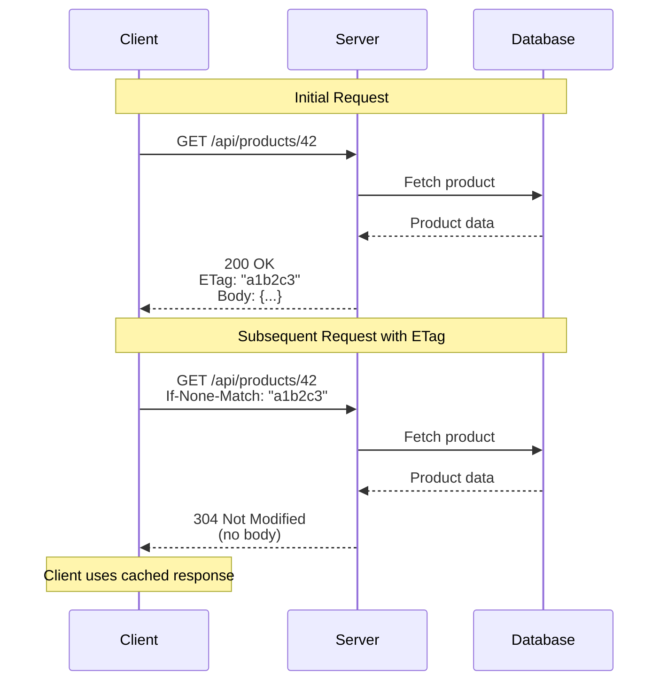
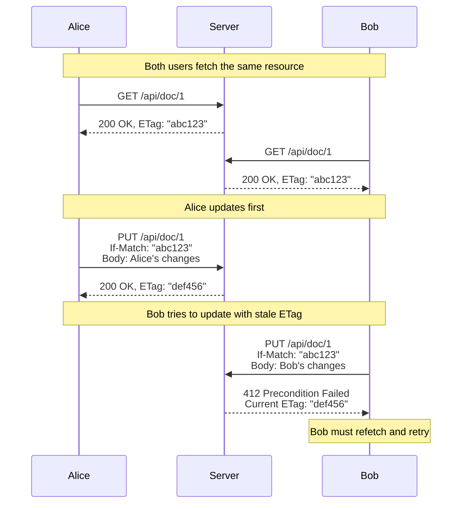

# How to Implement API ETag Headers

Author: [nawazdhandala](https://github.com/nawazdhandala)

Tags: HTTP, ETag, API, Caching, Performance, REST, Concurrency

Description: A practical guide to implementing ETag headers in REST APIs covering hash generation, conditional requests, optimistic concurrency control, and production-ready patterns for Node.js, Python, and Go.

---

ETag headers solve two critical problems in API development: efficient cache validation and optimistic concurrency control. When a client has a cached response, ETags let the server respond with a lightweight 304 Not Modified instead of retransmitting the entire payload. When multiple clients edit the same resource, ETags prevent lost updates by detecting conflicts before they happen.

This guide walks through ETag implementation from first principles, with production-ready code examples you can deploy today.

## Table of Contents

1. What ETags Are and Why They Matter
2. Strong vs Weak ETags
3. Generating ETags from Content
4. Handling Conditional GET Requests
5. Implementing Optimistic Concurrency Control
6. Framework-Specific Implementations
7. Testing Your ETag Implementation
8. Common Mistakes and How to Avoid Them

---

## 1. What ETags Are and Why They Matter

An ETag (Entity Tag) is a unique identifier for a specific version of a resource. Think of it as a fingerprint for your API response. When the response changes, the fingerprint changes.

The flow works like this:



The benefits are significant:

| Metric | Without ETags | With ETags |
|--------|---------------|------------|
| Bandwidth per cached request | Full payload (1-100KB) | Headers only (~500 bytes) |
| Server CPU (serialization) | Full JSON encoding | Hash comparison only |
| Client CPU (parsing) | Full JSON parsing | None for 304 |
| Database load | Full query | Full query (but can optimize) |

---

## 2. Strong vs Weak ETags

ETags come in two flavors, and choosing the right one matters.

**Strong ETags** guarantee byte-for-byte equality. If two responses have the same strong ETag, they are identical down to every character, including whitespace.

**Weak ETags** (prefixed with `W/`) indicate semantic equivalence. The responses mean the same thing but might differ in formatting, compression, or other non-semantic ways.

```mermaid
flowchart TB
    subgraph Strong["Strong ETag"]
        S1["Response A<br/>{\"id\":1,\"name\":\"Widget\"}"]
        S2["Response B<br/>{\"id\":1,\"name\":\"Widget\"}"]
        S3["Same bytes = Same ETag"]
        S1 --> S3
        S2 --> S3
    end

    subgraph Weak["Weak ETag (W/)"]
        W1["Response A<br/>{\"id\":1,\"name\":\"Widget\"}"]
        W2["Response B<br/>{ \"id\": 1, \"name\": \"Widget\" }"]
        W3["Same meaning = Same ETag"]
        W1 --> W3
        W2 --> W3
    end
```

Here is when to use each:

| ETag Type | Use Case | Example |
|-----------|----------|---------|
| Strong | Binary files, exact content matching | Images, downloads, static JSON |
| Strong | PUT/PATCH operations (If-Match) | Update operations requiring exact match |
| Weak | HTML pages with dynamic timestamps | Pages with "generated at" footers |
| Weak | Responses with non-deterministic JSON key order | Database results that may serialize differently |

---

## 3. Generating ETags from Content

The most reliable way to generate ETags is by hashing the response content. Here are production-ready implementations in multiple languages.

### Node.js Implementation

This function generates a strong ETag from any JavaScript value by hashing its JSON representation.

```javascript
const crypto = require('crypto');

// Generate a strong ETag from content
// Uses SHA-256 truncated to 32 hex characters for a good balance
// between uniqueness and header size
function generateETag(content) {
  // Convert content to a consistent string representation
  // Note: JSON.stringify key order depends on insertion order in modern JS
  // For guaranteed consistency, use a library like fast-json-stable-stringify
  const contentString = typeof content === 'string'
    ? content
    : JSON.stringify(content);

  // Create SHA-256 hash and take first 32 characters
  const hash = crypto
    .createHash('sha256')
    .update(contentString, 'utf8')
    .digest('hex')
    .substring(0, 32);

  // Strong ETag format: quoted string
  return `"${hash}"`;
}

// Generate a weak ETag when byte-for-byte equality is not guaranteed
function generateWeakETag(content, version) {
  const hash = crypto
    .createHash('md5')
    .update(JSON.stringify(content), 'utf8')
    .digest('hex')
    .substring(0, 16);

  // Weak ETag format: W/ prefix followed by quoted string
  return `W/"${version}-${hash}"`;
}

// Example usage
const product = { id: 42, name: 'Widget', price: 29.99 };
console.log(generateETag(product));      // "8f14e45fceea167a5a36dedd4bea2543"
console.log(generateWeakETag(product, 'v1')); // W/"v1-a1b2c3d4e5f67890"
```

### Python Implementation

Python's hashlib provides the same functionality with slightly different syntax.

```python
import hashlib
import json
from typing import Any, Union

def generate_etag(content: Any) -> str:
    """
    Generate a strong ETag from content.

    Args:
        content: Any JSON-serializable value

    Returns:
        Strong ETag string in format "hash"
    """
    # Convert to JSON string with sorted keys for consistency
    # sort_keys=True ensures the same dict always produces the same hash
    if isinstance(content, str):
        content_string = content
    else:
        content_string = json.dumps(content, sort_keys=True, separators=(',', ':'))

    # SHA-256 hash truncated to 32 characters
    hash_value = hashlib.sha256(content_string.encode('utf-8')).hexdigest()[:32]

    return f'"{hash_value}"'

def generate_weak_etag(content: Any, version: str) -> str:
    """
    Generate a weak ETag for semantically equivalent content.

    Args:
        content: Any JSON-serializable value
        version: Version string to include in ETag

    Returns:
        Weak ETag string in format W/"version-hash"
    """
    content_string = json.dumps(content, sort_keys=True, separators=(',', ':'))
    hash_value = hashlib.md5(content_string.encode('utf-8')).hexdigest()[:16]

    return f'W/"{version}-{hash_value}"'

# Example usage
product = {"id": 42, "name": "Widget", "price": 29.99}
print(generate_etag(product))           # "8f14e45fceea167a5a36dedd4bea2543"
print(generate_weak_etag(product, "v1")) # W/"v1-a1b2c3d4e5f67890"
```

### Go Implementation

Go's standard library handles this cleanly with the crypto package.

```go
package etag

import (
    "crypto/sha256"
    "encoding/hex"
    "encoding/json"
    "fmt"
)

// GenerateETag creates a strong ETag from any value.
// The value must be JSON-serializable.
func GenerateETag(content interface{}) (string, error) {
    // Marshal to JSON for consistent string representation
    // Go's json.Marshal produces consistent output for the same input
    data, err := json.Marshal(content)
    if err != nil {
        return "", fmt.Errorf("failed to marshal content: %w", err)
    }

    // Compute SHA-256 hash
    hash := sha256.Sum256(data)

    // Convert to hex string and truncate to 32 characters
    hashStr := hex.EncodeToString(hash[:])[:32]

    // Return strong ETag format
    return fmt.Sprintf(`"%s"`, hashStr), nil
}

// GenerateWeakETag creates a weak ETag for semantic equivalence.
func GenerateWeakETag(content interface{}, version string) (string, error) {
    data, err := json.Marshal(content)
    if err != nil {
        return "", fmt.Errorf("failed to marshal content: %w", err)
    }

    hash := sha256.Sum256(data)
    hashStr := hex.EncodeToString(hash[:])[:16]

    // Return weak ETag format with W/ prefix
    return fmt.Sprintf(`W/"%s-%s"`, version, hashStr), nil
}
```

---

## 4. Handling Conditional GET Requests

When a client sends `If-None-Match` with a cached ETag, your server should return 304 Not Modified if the content has not changed. This is where you save bandwidth.

### Complete Express.js Middleware

This middleware handles the full conditional GET flow with proper header precedence.

```javascript
const crypto = require('crypto');

// Middleware factory for conditional GET support
// Wraps any async function that returns response data
function conditionalGet(fetchData) {
  return async (req, res, next) => {
    try {
      // Fetch the current data from database or service
      const data = await fetchData(req);

      // Handle case where resource does not exist
      if (!data) {
        return res.status(404).json({ error: 'Resource not found' });
      }

      // Generate ETag from current data
      const currentETag = generateETag(data);

      // Get Last-Modified if available (database timestamp)
      const lastModified = data.updatedAt
        ? new Date(data.updatedAt)
        : new Date();

      // Set response headers before checking conditions
      res.set('ETag', currentETag);
      res.set('Last-Modified', lastModified.toUTCString());
      res.set('Cache-Control', 'private, must-revalidate');

      // Check If-None-Match header (ETag-based validation)
      // This takes precedence over If-Modified-Since per HTTP spec
      const clientETag = req.get('If-None-Match');

      if (clientETag) {
        // Handle multiple ETags: If-None-Match: "abc", "def", "ghi"
        const clientETags = clientETag
          .split(',')
          .map(tag => tag.trim());

        // Check if any client ETag matches current
        // Also handle wildcard * which matches any ETag
        if (clientETags.includes('*') || clientETags.includes(currentETag)) {
          // Content unchanged, return 304 with no body
          return res.status(304).end();
        }
      }

      // Check If-Modified-Since header (time-based validation)
      // Only check if If-None-Match was not present
      const clientModifiedSince = req.get('If-Modified-Since');

      if (clientModifiedSince && !clientETag) {
        const clientDate = new Date(clientModifiedSince);

        // Compare timestamps (with 1 second tolerance for rounding)
        if (lastModified.getTime() <= clientDate.getTime() + 1000) {
          return res.status(304).end();
        }
      }

      // Content has changed or no conditional headers present
      // Send full response
      res.json(data);

    } catch (error) {
      next(error);
    }
  };
}

function generateETag(content) {
  const hash = crypto
    .createHash('sha256')
    .update(JSON.stringify(content), 'utf8')
    .digest('hex')
    .substring(0, 32);
  return `"${hash}"`;
}

// Usage in Express routes
const express = require('express');
const app = express();

// Fetch product by ID with conditional GET support
app.get('/api/products/:id', conditionalGet(async (req) => {
  const product = await db.products.findById(req.params.id);
  return product;
}));

// Fetch user profile with conditional GET support
app.get('/api/users/:id/profile', conditionalGet(async (req) => {
  const profile = await db.profiles.findByUserId(req.params.id);
  return profile;
}));
```

### FastAPI Implementation

Python's FastAPI handles this elegantly with dependency injection.

```python
from fastapi import FastAPI, Request, Response, HTTPException, Depends
from fastapi.responses import JSONResponse
import hashlib
import json
from datetime import datetime
from typing import Any, Optional, Callable
from functools import wraps

app = FastAPI()

def generate_etag(content: Any) -> str:
    """Generate strong ETag from content."""
    content_string = json.dumps(content, sort_keys=True, separators=(',', ':'))
    hash_value = hashlib.sha256(content_string.encode('utf-8')).hexdigest()[:32]
    return f'"{hash_value}"'

def parse_etag_header(header: Optional[str]) -> list[str]:
    """Parse If-None-Match header into list of ETags."""
    if not header:
        return []
    # Handle multiple ETags: "abc", "def", "ghi"
    return [tag.strip() for tag in header.split(',')]

async def check_conditional_get(
    request: Request,
    content: Any,
    last_modified: Optional[datetime] = None
) -> Optional[Response]:
    """
    Check conditional GET headers and return 304 if appropriate.

    Returns None if full response should be sent.
    Returns Response(304) if content unchanged.
    """
    current_etag = generate_etag(content)

    # Check If-None-Match header
    if_none_match = request.headers.get('If-None-Match')
    client_etags = parse_etag_header(if_none_match)

    if client_etags:
        if '*' in client_etags or current_etag in client_etags:
            # Return 304 with ETag header but no body
            return Response(
                status_code=304,
                headers={
                    'ETag': current_etag,
                    'Cache-Control': 'private, must-revalidate'
                }
            )

    # Check If-Modified-Since only if If-None-Match not present
    if_modified_since = request.headers.get('If-Modified-Since')

    if if_modified_since and not if_none_match and last_modified:
        try:
            # Parse HTTP date format
            client_date = datetime.strptime(
                if_modified_since,
                '%a, %d %b %Y %H:%M:%S GMT'
            )
            if last_modified <= client_date:
                return Response(
                    status_code=304,
                    headers={
                        'ETag': current_etag,
                        'Last-Modified': last_modified.strftime('%a, %d %b %Y %H:%M:%S GMT')
                    }
                )
        except ValueError:
            # Invalid date format, ignore header
            pass

    return None

@app.get('/api/products/{product_id}')
async def get_product(product_id: int, request: Request):
    # Fetch product from database
    product = await db.products.find_by_id(product_id)

    if not product:
        raise HTTPException(status_code=404, detail='Product not found')

    # Check for conditional GET
    not_modified = await check_conditional_get(
        request,
        product.dict(),
        product.updated_at
    )

    if not_modified:
        return not_modified

    # Generate headers for full response
    etag = generate_etag(product.dict())
    headers = {
        'ETag': etag,
        'Last-Modified': product.updated_at.strftime('%a, %d %b %Y %H:%M:%S GMT'),
        'Cache-Control': 'private, must-revalidate'
    }

    return JSONResponse(content=product.dict(), headers=headers)
```

---

## 5. Implementing Optimistic Concurrency Control

ETags shine brightest when preventing lost updates. When two users edit the same resource simultaneously, ETags detect the conflict and prevent the second write from silently overwriting the first.



### Express.js Implementation

This handler requires clients to provide the current ETag when updating resources.

```javascript
const express = require('express');
const app = express();

app.use(express.json());

// PUT handler with optimistic concurrency control
app.put('/api/documents/:id', async (req, res) => {
  const docId = req.params.id;
  const clientETag = req.get('If-Match');

  // Require If-Match header for updates
  // This prevents accidental overwrites from clients unaware of ETags
  if (!clientETag) {
    return res.status(428).json({
      error: 'Precondition Required',
      message: 'If-Match header is required for PUT requests',
      hint: 'Fetch the resource first to get its current ETag'
    });
  }

  // Fetch current document
  const currentDoc = await db.documents.findById(docId);

  if (!currentDoc) {
    return res.status(404).json({
      error: 'Not Found',
      message: `Document ${docId} does not exist`
    });
  }

  // Calculate current ETag
  const currentETag = generateETag(currentDoc);

  // Compare ETags
  // Strip quotes if present for comparison
  const normalizedClientETag = clientETag.replace(/^W\//, '');

  if (normalizedClientETag !== currentETag) {
    // Conflict detected: resource was modified since client fetched it
    return res.status(412).json({
      error: 'Precondition Failed',
      message: 'Resource has been modified by another request',
      currentETag: currentETag,
      yourETag: clientETag,
      hint: 'Refetch the resource and reapply your changes'
    });
  }

  // ETags match - safe to update
  const updatedDoc = await db.documents.update(docId, {
    ...req.body,
    updatedAt: new Date()
  });

  // Calculate new ETag for updated document
  const newETag = generateETag(updatedDoc);

  res.set('ETag', newETag);
  res.json(updatedDoc);
});

// PATCH handler with same pattern
// PATCH is for partial updates, but concurrency control works the same
app.patch('/api/documents/:id', async (req, res) => {
  const docId = req.params.id;
  const clientETag = req.get('If-Match');

  if (!clientETag) {
    return res.status(428).json({
      error: 'Precondition Required',
      message: 'If-Match header is required for PATCH requests'
    });
  }

  const currentDoc = await db.documents.findById(docId);

  if (!currentDoc) {
    return res.status(404).json({ error: 'Not Found' });
  }

  const currentETag = generateETag(currentDoc);

  if (clientETag !== currentETag) {
    return res.status(412).json({
      error: 'Precondition Failed',
      currentETag: currentETag
    });
  }

  // Apply partial update
  const updatedDoc = await db.documents.update(docId, {
    ...currentDoc,
    ...req.body,
    updatedAt: new Date()
  });

  const newETag = generateETag(updatedDoc);
  res.set('ETag', newETag);
  res.json(updatedDoc);
});
```

### Handling the 412 Response on the Client

Clients need to handle 412 responses gracefully. Here is a robust client implementation.

```javascript
// Client-side fetch wrapper with ETag support
class APIClient {
  constructor(baseUrl) {
    this.baseUrl = baseUrl;
    this.etagCache = new Map(); // Store ETags for resources
  }

  async get(path) {
    const url = `${this.baseUrl}${path}`;
    const cachedETag = this.etagCache.get(path);

    const headers = {};
    if (cachedETag) {
      headers['If-None-Match'] = cachedETag.etag;
    }

    const response = await fetch(url, { headers });

    if (response.status === 304) {
      // Not modified, return cached data
      return {
        data: cachedETag.data,
        etag: cachedETag.etag,
        fromCache: true
      };
    }

    if (!response.ok) {
      throw new Error(`GET ${path} failed: ${response.status}`);
    }

    const data = await response.json();
    const etag = response.headers.get('ETag');

    // Cache the response and ETag
    this.etagCache.set(path, { data, etag });

    return { data, etag, fromCache: false };
  }

  async update(path, data, etag) {
    const url = `${this.baseUrl}${path}`;

    const response = await fetch(url, {
      method: 'PUT',
      headers: {
        'Content-Type': 'application/json',
        'If-Match': etag
      },
      body: JSON.stringify(data)
    });

    if (response.status === 412) {
      // Conflict detected
      const error = await response.json();
      throw new ConflictError(error.currentETag, error.message);
    }

    if (response.status === 428) {
      throw new Error('Server requires If-Match header');
    }

    if (!response.ok) {
      throw new Error(`PUT ${path} failed: ${response.status}`);
    }

    const updatedData = await response.json();
    const newETag = response.headers.get('ETag');

    // Update cache with new data and ETag
    this.etagCache.set(path, { data: updatedData, etag: newETag });

    return { data: updatedData, etag: newETag };
  }

  // Retry update with automatic refetch on conflict
  async updateWithRetry(path, transformFn, maxRetries = 3) {
    for (let attempt = 0; attempt < maxRetries; attempt++) {
      try {
        // Fetch current state
        const { data, etag } = await this.get(path);

        // Apply transformation
        const updatedData = transformFn(data);

        // Attempt update
        return await this.update(path, updatedData, etag);

      } catch (error) {
        if (error instanceof ConflictError && attempt < maxRetries - 1) {
          // Conflict, retry with fresh data
          console.log(`Conflict detected, retrying (attempt ${attempt + 2})`);
          continue;
        }
        throw error;
      }
    }
  }
}

class ConflictError extends Error {
  constructor(currentETag, message) {
    super(message);
    this.name = 'ConflictError';
    this.currentETag = currentETag;
  }
}

// Usage example
const api = new APIClient('https://api.example.com');

// Simple flow
const { data: product, etag } = await api.get('/products/42');
product.price = 39.99;
await api.update('/products/42', product, etag);

// With automatic retry on conflict
await api.updateWithRetry('/products/42', (product) => ({
  ...product,
  price: product.price * 1.1 // Increase price by 10%
}));
```

---

## 6. Framework-Specific Implementations

### Django REST Framework

Django REST Framework provides built-in ETag support through the `@etag` decorator.

```python
from rest_framework.views import APIView
from rest_framework.response import Response
from rest_framework.decorators import api_view
from django.utils.decorators import method_decorator
from django.views.decorators.http import etag, condition
import hashlib
import json

def calculate_product_etag(request, product_id):
    """
    Calculate ETag for a product.
    Called before the view to check If-None-Match.
    """
    try:
        product = Product.objects.get(id=product_id)
        content = {
            'id': product.id,
            'name': product.name,
            'price': str(product.price),
            'updated_at': product.updated_at.isoformat()
        }
        hash_value = hashlib.sha256(
            json.dumps(content, sort_keys=True).encode()
        ).hexdigest()[:32]
        return hash_value
    except Product.DoesNotExist:
        return None

def get_product_last_modified(request, product_id):
    """Get last modified timestamp for a product."""
    try:
        product = Product.objects.get(id=product_id)
        return product.updated_at
    except Product.DoesNotExist:
        return None

class ProductDetailView(APIView):
    @method_decorator(condition(
        etag_func=calculate_product_etag,
        last_modified_func=get_product_last_modified
    ))
    def get(self, request, product_id):
        """
        GET with automatic ETag support.
        Django handles 304 responses automatically when decorated.
        """
        product = Product.objects.get(id=product_id)
        serializer = ProductSerializer(product)
        return Response(serializer.data)

    def put(self, request, product_id):
        """PUT with manual ETag concurrency control."""
        client_etag = request.headers.get('If-Match')

        if not client_etag:
            return Response(
                {'error': 'If-Match header required'},
                status=428
            )

        product = Product.objects.get(id=product_id)
        current_etag = f'"{calculate_product_etag(request, product_id)}"'

        if client_etag != current_etag:
            return Response(
                {
                    'error': 'Precondition Failed',
                    'current_etag': current_etag
                },
                status=412
            )

        serializer = ProductSerializer(product, data=request.data)
        serializer.is_valid(raise_exception=True)
        serializer.save()

        new_etag = f'"{calculate_product_etag(request, product_id)}"'
        response = Response(serializer.data)
        response['ETag'] = new_etag
        return response
```

### Go with Chi Router

Go's explicit error handling makes ETag implementation straightforward.

```go
package main

import (
    "crypto/sha256"
    "encoding/hex"
    "encoding/json"
    "net/http"
    "strings"

    "github.com/go-chi/chi/v5"
)

type Product struct {
    ID        int     `json:"id"`
    Name      string  `json:"name"`
    Price     float64 `json:"price"`
    UpdatedAt string  `json:"updated_at"`
}

// generateETag creates a strong ETag from a product
func generateETag(p *Product) string {
    data, _ := json.Marshal(p)
    hash := sha256.Sum256(data)
    return `"` + hex.EncodeToString(hash[:])[:32] + `"`
}

// parseIfNoneMatch extracts ETags from the If-None-Match header
func parseIfNoneMatch(header string) []string {
    if header == "" {
        return nil
    }
    tags := strings.Split(header, ",")
    result := make([]string, 0, len(tags))
    for _, tag := range tags {
        result = append(result, strings.TrimSpace(tag))
    }
    return result
}

func GetProduct(w http.ResponseWriter, r *http.Request) {
    productID := chi.URLParam(r, "id")

    // Fetch product from database
    product, err := db.FindProduct(productID)
    if err != nil {
        http.Error(w, "Product not found", http.StatusNotFound)
        return
    }

    // Generate current ETag
    currentETag := generateETag(product)

    // Set response headers
    w.Header().Set("ETag", currentETag)
    w.Header().Set("Cache-Control", "private, must-revalidate")

    // Check If-None-Match header
    clientETags := parseIfNoneMatch(r.Header.Get("If-None-Match"))
    for _, clientETag := range clientETags {
        if clientETag == "*" || clientETag == currentETag {
            // Content unchanged, return 304
            w.WriteHeader(http.StatusNotModified)
            return
        }
    }

    // Send full response
    w.Header().Set("Content-Type", "application/json")
    json.NewEncoder(w).Encode(product)
}

func UpdateProduct(w http.ResponseWriter, r *http.Request) {
    productID := chi.URLParam(r, "id")
    clientETag := r.Header.Get("If-Match")

    // Require If-Match header
    if clientETag == "" {
        w.Header().Set("Content-Type", "application/json")
        w.WriteHeader(http.StatusPreconditionRequired)
        json.NewEncoder(w).Encode(map[string]string{
            "error": "If-Match header required",
        })
        return
    }

    // Fetch current product
    product, err := db.FindProduct(productID)
    if err != nil {
        http.Error(w, "Product not found", http.StatusNotFound)
        return
    }

    // Compare ETags
    currentETag := generateETag(product)
    if clientETag != currentETag {
        w.Header().Set("Content-Type", "application/json")
        w.WriteHeader(http.StatusPreconditionFailed)
        json.NewEncoder(w).Encode(map[string]string{
            "error":       "Precondition Failed",
            "currentETag": currentETag,
        })
        return
    }

    // Parse and apply update
    var updatedProduct Product
    if err := json.NewDecoder(r.Body).Decode(&updatedProduct); err != nil {
        http.Error(w, "Invalid JSON", http.StatusBadRequest)
        return
    }

    // Save to database
    savedProduct, err := db.UpdateProduct(productID, &updatedProduct)
    if err != nil {
        http.Error(w, "Update failed", http.StatusInternalServerError)
        return
    }

    // Return updated product with new ETag
    newETag := generateETag(savedProduct)
    w.Header().Set("ETag", newETag)
    w.Header().Set("Content-Type", "application/json")
    json.NewEncoder(w).Encode(savedProduct)
}

func main() {
    r := chi.NewRouter()
    r.Get("/api/products/{id}", GetProduct)
    r.Put("/api/products/{id}", UpdateProduct)
    http.ListenAndServe(":8080", r)
}
```

---

## 7. Testing Your ETag Implementation

Proper tests ensure your ETag logic handles edge cases correctly.

### Jest Tests for Node.js

```javascript
const request = require('supertest');
const app = require('./app');

describe('ETag Implementation', () => {
  let productETag;

  describe('GET /api/products/:id', () => {
    it('should return ETag header on first request', async () => {
      const response = await request(app)
        .get('/api/products/1')
        .expect(200);

      expect(response.headers['etag']).toBeDefined();
      expect(response.headers['etag']).toMatch(/^"[a-f0-9]{32}"$/);

      productETag = response.headers['etag'];
    });

    it('should return 304 when If-None-Match matches', async () => {
      const response = await request(app)
        .get('/api/products/1')
        .set('If-None-Match', productETag)
        .expect(304);

      // 304 responses should have no body
      expect(response.body).toEqual({});
      // But should still include ETag
      expect(response.headers['etag']).toBe(productETag);
    });

    it('should return 200 when If-None-Match does not match', async () => {
      const response = await request(app)
        .get('/api/products/1')
        .set('If-None-Match', '"stale-etag-12345"')
        .expect(200);

      expect(response.body).toBeDefined();
      expect(response.body.id).toBe(1);
    });

    it('should handle multiple ETags in If-None-Match', async () => {
      const response = await request(app)
        .get('/api/products/1')
        .set('If-None-Match', `"wrong1", ${productETag}, "wrong2"`)
        .expect(304);
    });

    it('should handle wildcard * in If-None-Match', async () => {
      const response = await request(app)
        .get('/api/products/1')
        .set('If-None-Match', '*')
        .expect(304);
    });
  });

  describe('PUT /api/products/:id', () => {
    it('should return 428 when If-Match is missing', async () => {
      const response = await request(app)
        .put('/api/products/1')
        .send({ name: 'Updated Product' })
        .expect(428);

      expect(response.body.error).toBe('Precondition Required');
    });

    it('should return 412 when If-Match does not match', async () => {
      const response = await request(app)
        .put('/api/products/1')
        .set('If-Match', '"stale-etag-12345"')
        .send({ name: 'Updated Product' })
        .expect(412);

      expect(response.body.error).toBe('Precondition Failed');
      expect(response.body.currentETag).toBeDefined();
    });

    it('should update when If-Match matches', async () => {
      // First get current ETag
      const getResponse = await request(app)
        .get('/api/products/1')
        .expect(200);

      const currentETag = getResponse.headers['etag'];

      // Then update with correct ETag
      const putResponse = await request(app)
        .put('/api/products/1')
        .set('If-Match', currentETag)
        .send({ name: 'Updated Product', price: 49.99 })
        .expect(200);

      // New ETag should be different
      expect(putResponse.headers['etag']).toBeDefined();
      expect(putResponse.headers['etag']).not.toBe(currentETag);
    });
  });
});
```

### Pytest Tests for Python

```python
import pytest
from fastapi.testclient import TestClient
from app import app

client = TestClient(app)

class TestETagImplementation:
    product_etag = None

    def test_get_returns_etag_header(self):
        response = client.get('/api/products/1')
        assert response.status_code == 200
        assert 'etag' in response.headers
        assert response.headers['etag'].startswith('"')
        assert response.headers['etag'].endswith('"')

        TestETagImplementation.product_etag = response.headers['etag']

    def test_returns_304_when_etag_matches(self):
        response = client.get(
            '/api/products/1',
            headers={'If-None-Match': self.product_etag}
        )
        assert response.status_code == 304
        assert response.content == b''

    def test_returns_200_when_etag_does_not_match(self):
        response = client.get(
            '/api/products/1',
            headers={'If-None-Match': '"stale-etag"'}
        )
        assert response.status_code == 200
        assert response.json()['id'] == 1

    def test_put_requires_if_match_header(self):
        response = client.put(
            '/api/products/1',
            json={'name': 'Updated'}
        )
        assert response.status_code == 428

    def test_put_returns_412_on_etag_mismatch(self):
        response = client.put(
            '/api/products/1',
            headers={'If-Match': '"wrong-etag"'},
            json={'name': 'Updated'}
        )
        assert response.status_code == 412
        assert 'currentETag' in response.json()

    def test_put_succeeds_with_correct_etag(self):
        # Get current ETag
        get_response = client.get('/api/products/1')
        current_etag = get_response.headers['etag']

        # Update with correct ETag
        put_response = client.put(
            '/api/products/1',
            headers={'If-Match': current_etag},
            json={'name': 'Updated', 'price': 49.99}
        )
        assert put_response.status_code == 200
        assert put_response.headers['etag'] != current_etag
```

---

## 8. Common Mistakes and How to Avoid Them

### Mistake 1: Non-Deterministic ETag Generation

If your ETag changes between identical requests, caching breaks completely.

```javascript
// WRONG: Includes timestamp that changes every request
function badETag(product) {
  return `"${product.id}-${Date.now()}"`;
}

// WRONG: JSON.stringify with objects that have random key order
function badETag2(product) {
  // Object key order is not guaranteed in older JS engines
  return `"${hash(JSON.stringify(product))}"`;
}

// CORRECT: Use stable serialization
const stableStringify = require('fast-json-stable-stringify');

function goodETag(product) {
  // Keys are always sorted alphabetically
  return `"${hash(stableStringify(product))}"`;
}
```

### Mistake 2: Forgetting Quotes in ETag Values

ETags must be enclosed in double quotes per the HTTP specification.

```javascript
// WRONG: No quotes
res.set('ETag', 'abc123');

// WRONG: Wrong quote style
res.set('ETag', "'abc123'");

// CORRECT: Double quotes
res.set('ETag', '"abc123"');

// CORRECT: Weak ETag with W/ prefix and quotes
res.set('ETag', 'W/"abc123"');
```

### Mistake 3: Not Handling Multiple ETags in If-None-Match

Clients can send multiple ETags in a single header.

```javascript
// WRONG: Only checks exact match
const clientETag = req.get('If-None-Match');
if (clientETag === currentETag) {
  return res.status(304).end();
}

// CORRECT: Parse and check all ETags
const clientETags = req.get('If-None-Match')
  ?.split(',')
  .map(tag => tag.trim()) || [];

if (clientETags.includes(currentETag) || clientETags.includes('*')) {
  return res.status(304).end();
}
```

### Mistake 4: Computing ETag After Sending Headers

You must set the ETag header before calling res.json() or res.send().

```javascript
// WRONG: Headers already sent
app.get('/api/product/:id', async (req, res) => {
  const product = await getProduct(req.params.id);
  res.json(product);
  res.set('ETag', generateETag(product)); // Too late!
});

// CORRECT: Set headers first
app.get('/api/product/:id', async (req, res) => {
  const product = await getProduct(req.params.id);
  const etag = generateETag(product);
  res.set('ETag', etag);
  res.json(product);
});
```

### Mistake 5: Caching Database Queries for 304 Responses

ETags save bandwidth, but your server still needs to check if the data changed. Naive implementations fetch data even for 304 responses.

```javascript
// BASIC: Always fetches full data
app.get('/api/products/:id', async (req, res) => {
  const product = await db.products.findById(req.params.id); // DB query
  const etag = generateETag(product);

  if (req.get('If-None-Match') === etag) {
    return res.status(304).end();
  }
  res.set('ETag', etag);
  res.json(product);
});

// OPTIMIZED: Store ETag in database, check before fetching
app.get('/api/products/:id', async (req, res) => {
  const clientETag = req.get('If-None-Match');

  if (clientETag) {
    // Quick check: just fetch ETag column
    const storedETag = await db.products.getETag(req.params.id);
    if (clientETag === storedETag) {
      res.set('ETag', storedETag);
      return res.status(304).end();
    }
  }

  // Full fetch only if ETags do not match
  const product = await db.products.findById(req.params.id);
  const etag = generateETag(product);
  res.set('ETag', etag);
  res.json(product);
});
```

---

## Summary

ETags are a simple but powerful HTTP feature that delivers real benefits:

1. **Bandwidth savings**: 304 responses transmit no body
2. **Lost update prevention**: If-Match catches concurrent modifications
3. **Cache validation**: Clients can efficiently check if their cache is fresh

The implementation checklist:

- Generate ETags from content hash using SHA-256
- Use strong ETags for exact matching, weak ETags for semantic equivalence
- Handle If-None-Match for GET requests (return 304)
- Handle If-Match for PUT/PATCH requests (return 412 on mismatch, 428 if missing)
- Parse multiple ETags in conditional headers
- Always include quotes around ETag values
- Test edge cases: multiple ETags, wildcard, missing headers

Start with GET support to reduce bandwidth costs, then add PUT/PATCH support for optimistic concurrency when you need it.

---

*Need to monitor your API performance and cache hit rates? [OneUptime](https://oneuptime.com) provides comprehensive API observability including response time tracking, cache efficiency metrics, and custom dashboards. Set up alerts when your 304 response rate drops or when concurrency conflicts spike.*
