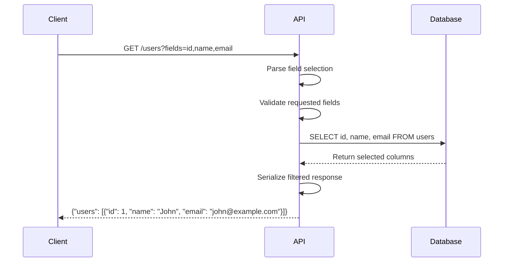
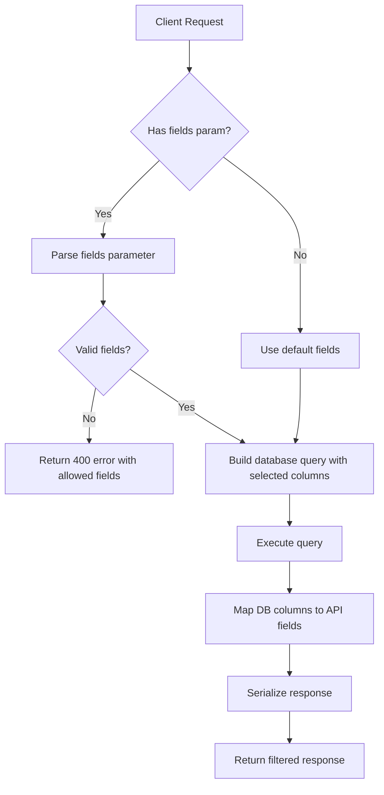
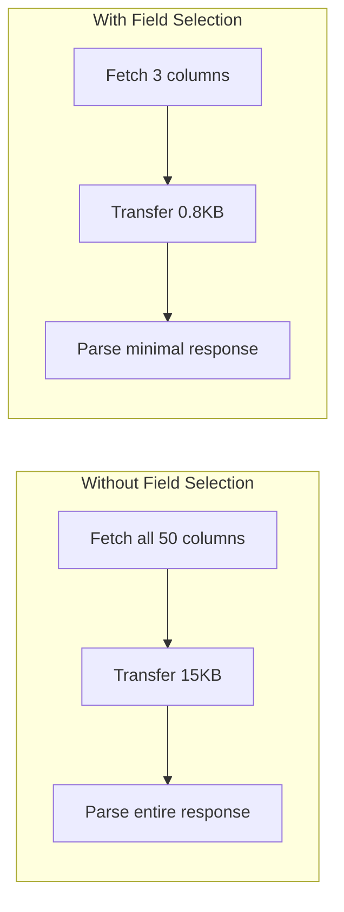

# How to Implement API Field Selection

Author: [nawazdhandala](https://github.com/nawazdhandala)

Tags: API, REST, Performance, Backend, NodeJS, Python

Description: Learn how to implement field selection (sparse fieldsets) in your REST APIs to reduce payload sizes, improve performance, and give clients control over the data they receive.

---

When your API returns a user object with 50 fields but the client only needs the name and email, you are wasting bandwidth, memory, and CPU cycles. Field selection lets clients specify exactly which fields they want in the response, turning bloated payloads into lean, efficient data transfers.

## Why Field Selection Matters

| Problem | Without Field Selection | With Field Selection |
|---------|------------------------|---------------------|
| Mobile app listing users | Returns 50 fields per user | Returns 3 fields per user |
| Payload size | 15 KB | 800 bytes |
| Database load | Fetches all columns | Fetches selected columns |
| Serialization time | Processes entire object | Processes subset |
| Network latency | Higher | Lower |

## Request Flow



## Common Field Selection Patterns

Different APIs implement field selection in various ways:

| Pattern | Example | Used By |
|---------|---------|---------|
| Comma-separated | `?fields=id,name,email` | Most REST APIs |
| Nested with dots | `?fields=id,profile.avatar` | JSON:API |
| Bracket notation | `?fields[user]=id,name` | Sparse fieldsets |
| GraphQL-style | `?select={id,name}` | Some REST APIs |

## Basic Implementation (Node.js/Express)

This implementation handles comma-separated field selection with validation and nested field support.

```javascript
// field-selection-middleware.js

// Whitelist of allowed fields per resource to prevent exposing sensitive data
const ALLOWED_FIELDS = {
  user: ['id', 'name', 'email', 'avatar', 'role', 'created_at', 'updated_at', 'profile'],
  product: ['id', 'name', 'price', 'description', 'category', 'stock', 'images'],
  order: ['id', 'status', 'total', 'items', 'shipping_address', 'created_at']
};

// Default fields returned when no selection is specified
const DEFAULT_FIELDS = {
  user: ['id', 'name', 'email'],
  product: ['id', 'name', 'price'],
  order: ['id', 'status', 'total']
};

// Parse the fields query parameter into an array of field names
function parseFieldSelection(fieldsParam) {
  if (!fieldsParam) {
    return null;
  }

  // Split by comma and trim whitespace from each field
  return fieldsParam
    .split(',')
    .map(field => field.trim())
    .filter(field => field.length > 0);
}

// Validate that all requested fields are in the allowed list
function validateFields(requestedFields, resourceType) {
  const allowed = ALLOWED_FIELDS[resourceType];
  if (!allowed) {
    throw new Error(`Unknown resource type: ${resourceType}`);
  }

  const invalid = requestedFields.filter(field => {
    // Handle nested fields by checking the root field
    const rootField = field.split('.')[0];
    return !allowed.includes(rootField);
  });

  if (invalid.length > 0) {
    throw new FieldSelectionError(
      `Invalid fields requested: ${invalid.join(', ')}`,
      invalid,
      allowed
    );
  }

  return true;
}

// Custom error class for field selection errors
class FieldSelectionError extends Error {
  constructor(message, invalidFields, allowedFields) {
    super(message);
    this.name = 'FieldSelectionError';
    this.invalidFields = invalidFields;
    this.allowedFields = allowedFields;
    this.statusCode = 400;
  }
}

// Filter an object to include only the specified fields
function filterFields(obj, fields) {
  if (!fields || fields.length === 0) {
    return obj;
  }

  const result = {};

  for (const field of fields) {
    // Handle nested fields like "profile.avatar"
    if (field.includes('.')) {
      const [parent, ...children] = field.split('.');
      const childPath = children.join('.');

      if (obj[parent] !== undefined) {
        if (!result[parent]) {
          result[parent] = {};
        }
        // Recursively handle nested objects
        const nestedValue = getNestedValue(obj[parent], childPath);
        setNestedValue(result[parent], childPath, nestedValue);
      }
    } else {
      // Simple field access
      if (obj[field] !== undefined) {
        result[field] = obj[field];
      }
    }
  }

  return result;
}

// Get a value from a nested object path
function getNestedValue(obj, path) {
  return path.split('.').reduce((current, key) => {
    return current && current[key] !== undefined ? current[key] : undefined;
  }, obj);
}

// Set a value in a nested object path
function setNestedValue(obj, path, value) {
  const keys = path.split('.');
  const lastKey = keys.pop();

  let current = obj;
  for (const key of keys) {
    if (!current[key]) {
      current[key] = {};
    }
    current = current[key];
  }

  current[lastKey] = value;
}

// Express middleware for field selection
function fieldSelectionMiddleware(resourceType) {
  return (req, res, next) => {
    const fieldsParam = req.query.fields;

    try {
      let selectedFields = parseFieldSelection(fieldsParam);

      // Use defaults if no fields specified
      if (!selectedFields) {
        selectedFields = DEFAULT_FIELDS[resourceType] || null;
      }

      // Validate the requested fields
      if (selectedFields) {
        validateFields(selectedFields, resourceType);
      }

      // Attach to request for use in route handlers
      req.selectedFields = selectedFields;

      // Override res.json to automatically filter fields
      const originalJson = res.json.bind(res);
      res.json = (data) => {
        const filtered = filterResponse(data, selectedFields);
        return originalJson(filtered);
      };

      next();
    } catch (error) {
      if (error instanceof FieldSelectionError) {
        return res.status(400).json({
          error: {
            code: 'INVALID_FIELDS',
            message: error.message,
            invalid_fields: error.invalidFields,
            allowed_fields: error.allowedFields
          }
        });
      }
      next(error);
    }
  };
}

// Filter response data, handling both arrays and single objects
function filterResponse(data, fields) {
  if (!fields) {
    return data;
  }

  // Handle wrapped responses like { data: [...] }
  if (data && data.data) {
    return {
      ...data,
      data: filterResponse(data.data, fields)
    };
  }

  // Handle arrays
  if (Array.isArray(data)) {
    return data.map(item => filterFields(item, fields));
  }

  // Handle single objects
  return filterFields(data, fields);
}

module.exports = {
  fieldSelectionMiddleware,
  parseFieldSelection,
  validateFields,
  filterFields,
  FieldSelectionError
};
```

## Using the Middleware

Here is how to use the field selection middleware in your Express routes.

```javascript
// routes/users.js
const express = require('express');
const router = express.Router();
const { fieldSelectionMiddleware } = require('./field-selection-middleware');

// Sample user data (in production, this comes from your database)
const users = [
  {
    id: 1,
    name: 'John Doe',
    email: 'john@example.com',
    password_hash: 'hashed_password_never_expose',
    avatar: 'https://example.com/avatars/john.jpg',
    role: 'admin',
    profile: {
      bio: 'Software engineer',
      location: 'San Francisco',
      website: 'https://johndoe.dev'
    },
    created_at: '2024-01-15T10:30:00Z',
    updated_at: '2024-06-20T14:45:00Z'
  }
];

// Apply field selection middleware to all user routes
router.use(fieldSelectionMiddleware('user'));

// GET /users - List all users with field selection
// Example: GET /users?fields=id,name,email
router.get('/', (req, res) => {
  res.json({ data: users });
});

// GET /users/:id - Get a single user with field selection
// Example: GET /users/1?fields=id,name,profile.bio
router.get('/:id', (req, res) => {
  const user = users.find(u => u.id === parseInt(req.params.id));

  if (!user) {
    return res.status(404).json({
      error: {
        code: 'USER_NOT_FOUND',
        message: `User with ID ${req.params.id} not found`
      }
    });
  }

  res.json({ data: user });
});

module.exports = router;
```

## Database-Level Field Selection

For optimal performance, push field selection to the database layer. This avoids fetching unnecessary data.

```javascript
// repositories/user-repository.js
const { Pool } = require('pg');

class UserRepository {
  constructor() {
    this.pool = new Pool();
  }

  // Map API field names to database column names
  // This protects against SQL injection and handles naming differences
  static FIELD_MAPPING = {
    id: 'id',
    name: 'full_name',
    email: 'email_address',
    avatar: 'avatar_url',
    role: 'user_role',
    created_at: 'created_at',
    updated_at: 'updated_at'
  };

  // Convert API fields to SQL column names
  mapFieldsToColumns(apiFields) {
    if (!apiFields) {
      // Return all mapped columns if no selection
      return Object.values(UserRepository.FIELD_MAPPING);
    }

    return apiFields
      .map(field => UserRepository.FIELD_MAPPING[field])
      .filter(Boolean);
  }

  // Build a safe SELECT query with only the requested columns
  async findAll(options = {}) {
    const { fields, limit = 20, offset = 0 } = options;

    // Get the SQL column names for the requested fields
    const columns = this.mapFieldsToColumns(fields);

    if (columns.length === 0) {
      throw new Error('No valid fields selected');
    }

    // Build the query with parameterized values
    const query = `
      SELECT ${columns.join(', ')}
      FROM users
      ORDER BY created_at DESC
      LIMIT $1 OFFSET $2
    `;

    const result = await this.pool.query(query, [limit, offset]);

    // Map database column names back to API field names
    return result.rows.map(row => this.mapRowToApiResponse(row, fields));
  }

  // Map database row to API response format
  mapRowToApiResponse(row, requestedFields) {
    const reverseMapping = {};
    for (const [apiField, dbColumn] of Object.entries(UserRepository.FIELD_MAPPING)) {
      reverseMapping[dbColumn] = apiField;
    }

    const response = {};
    for (const [column, value] of Object.entries(row)) {
      const apiField = reverseMapping[column];
      if (apiField && (!requestedFields || requestedFields.includes(apiField))) {
        response[apiField] = value;
      }
    }

    return response;
  }

  // Find a single user by ID with field selection
  async findById(id, fields = null) {
    const columns = this.mapFieldsToColumns(fields);

    const query = `
      SELECT ${columns.join(', ')}
      FROM users
      WHERE id = $1
    `;

    const result = await this.pool.query(query, [id]);

    if (result.rows.length === 0) {
      return null;
    }

    return this.mapRowToApiResponse(result.rows[0], fields);
  }
}

module.exports = UserRepository;
```

## Python Implementation (FastAPI)

Here is a complete implementation using FastAPI with Pydantic for validation.

```python
# field_selection.py
from typing import Optional, List, Dict, Any, Set
from fastapi import FastAPI, Query, HTTPException
from pydantic import BaseModel, Field
from functools import wraps

app = FastAPI()

# Define allowed fields per resource type
ALLOWED_FIELDS: Dict[str, Set[str]] = {
    "user": {"id", "name", "email", "avatar", "role", "created_at", "profile"},
    "product": {"id", "name", "price", "description", "category", "stock"},
}

# Default fields when none specified
DEFAULT_FIELDS: Dict[str, List[str]] = {
    "user": ["id", "name", "email"],
    "product": ["id", "name", "price"],
}


class FieldSelectionError(Exception):
    """Raised when invalid fields are requested"""
    def __init__(self, invalid_fields: List[str], allowed_fields: Set[str]):
        self.invalid_fields = invalid_fields
        self.allowed_fields = allowed_fields
        super().__init__(f"Invalid fields: {', '.join(invalid_fields)}")


def parse_fields(fields_param: Optional[str]) -> Optional[List[str]]:
    """Parse comma-separated fields parameter into a list"""
    if not fields_param:
        return None
    return [f.strip() for f in fields_param.split(",") if f.strip()]


def validate_fields(fields: List[str], resource_type: str) -> None:
    """Validate that all requested fields are allowed"""
    allowed = ALLOWED_FIELDS.get(resource_type, set())

    # Check root fields for nested paths
    invalid = []
    for field in fields:
        root_field = field.split(".")[0]
        if root_field not in allowed:
            invalid.append(field)

    if invalid:
        raise FieldSelectionError(invalid, allowed)


def filter_dict(data: Dict[str, Any], fields: List[str]) -> Dict[str, Any]:
    """Filter a dictionary to include only specified fields"""
    result = {}

    for field in fields:
        if "." in field:
            # Handle nested fields
            parts = field.split(".")
            current = data
            for part in parts[:-1]:
                if isinstance(current, dict) and part in current:
                    current = current[part]
                else:
                    current = None
                    break

            if current and parts[-1] in current:
                # Build nested structure in result
                target = result
                for part in parts[:-1]:
                    if part not in target:
                        target[part] = {}
                    target = target[part]
                target[parts[-1]] = current[parts[-1]]
        else:
            # Simple field
            if field in data:
                result[field] = data[field]

    return result


def select_fields(data: Any, fields: Optional[List[str]]) -> Any:
    """Apply field selection to response data"""
    if fields is None:
        return data

    if isinstance(data, list):
        return [filter_dict(item, fields) for item in data]
    elif isinstance(data, dict):
        if "data" in data:
            # Handle wrapped responses
            return {**data, "data": select_fields(data["data"], fields)}
        return filter_dict(data, fields)

    return data


# Sample data
USERS_DB = [
    {
        "id": 1,
        "name": "Alice Johnson",
        "email": "alice@example.com",
        "avatar": "https://example.com/alice.jpg",
        "role": "admin",
        "password_hash": "never_expose_this",
        "profile": {
            "bio": "Backend developer",
            "location": "New York",
            "twitter": "@alice_dev"
        },
        "created_at": "2024-01-10T08:00:00Z",
    },
    {
        "id": 2,
        "name": "Bob Smith",
        "email": "bob@example.com",
        "avatar": "https://example.com/bob.jpg",
        "role": "user",
        "password_hash": "never_expose_this",
        "profile": {
            "bio": "Frontend enthusiast",
            "location": "London",
            "twitter": "@bob_codes"
        },
        "created_at": "2024-02-15T12:30:00Z",
    }
]


@app.get("/users")
async def list_users(
    fields: Optional[str] = Query(
        None,
        description="Comma-separated list of fields to return",
        example="id,name,email"
    )
):
    """
    List all users with optional field selection.

    Use the fields parameter to request specific fields:
    - GET /users?fields=id,name,email
    - GET /users?fields=id,name,profile.bio
    """
    # Parse and validate fields
    selected_fields = parse_fields(fields)

    if selected_fields is None:
        selected_fields = DEFAULT_FIELDS["user"]

    try:
        validate_fields(selected_fields, "user")
    except FieldSelectionError as e:
        raise HTTPException(
            status_code=400,
            detail={
                "code": "INVALID_FIELDS",
                "message": str(e),
                "invalid_fields": e.invalid_fields,
                "allowed_fields": list(e.allowed_fields)
            }
        )

    # Filter the response
    filtered_users = select_fields(USERS_DB, selected_fields)

    return {"data": filtered_users}


@app.get("/users/{user_id}")
async def get_user(
    user_id: int,
    fields: Optional[str] = Query(None)
):
    """Get a single user by ID with optional field selection"""
    user = next((u for u in USERS_DB if u["id"] == user_id), None)

    if not user:
        raise HTTPException(status_code=404, detail="User not found")

    selected_fields = parse_fields(fields) or DEFAULT_FIELDS["user"]

    try:
        validate_fields(selected_fields, "user")
    except FieldSelectionError as e:
        raise HTTPException(
            status_code=400,
            detail={
                "code": "INVALID_FIELDS",
                "invalid_fields": e.invalid_fields,
                "allowed_fields": list(e.allowed_fields)
            }
        )

    return {"data": select_fields(user, selected_fields)}
```

## Field Selection Flow



## Handling Nested Objects

When your API returns nested objects, clients may want to select specific nested fields.

```javascript
// nested-field-selection.js

// Expand nested field selections into their full paths
// Input: ['id', 'profile'] where profile should expand to all profile fields
// Output: ['id', 'profile.bio', 'profile.location', 'profile.website']
function expandFieldSelection(fields, schema) {
  const expanded = [];

  for (const field of fields) {
    if (field.includes('.')) {
      // Already a nested path, keep as is
      expanded.push(field);
    } else if (schema[field] && schema[field].type === 'object') {
      // Expand object field to all its children
      const subFields = Object.keys(schema[field].properties);
      for (const subField of subFields) {
        expanded.push(`${field}.${subField}`);
      }
    } else {
      // Simple field
      expanded.push(field);
    }
  }

  return expanded;
}

// Schema definition for field expansion
const USER_SCHEMA = {
  id: { type: 'integer' },
  name: { type: 'string' },
  email: { type: 'string' },
  profile: {
    type: 'object',
    properties: {
      bio: { type: 'string' },
      location: { type: 'string' },
      website: { type: 'string' }
    }
  }
};

// Example usage
const requestedFields = ['id', 'name', 'profile'];
const expandedFields = expandFieldSelection(requestedFields, USER_SCHEMA);
// Result: ['id', 'name', 'profile.bio', 'profile.location', 'profile.website']

// Filter nested object based on expanded field selection
function filterNestedObject(obj, fields) {
  const result = {};

  for (const field of fields) {
    const parts = field.split('.');
    let source = obj;
    let target = result;

    // Navigate to the nested location, creating objects as needed
    for (let i = 0; i < parts.length - 1; i++) {
      const part = parts[i];

      if (source[part] === undefined) {
        break;
      }

      source = source[part];

      if (!target[part]) {
        target[part] = {};
      }
      target = target[part];
    }

    // Set the final value
    const lastPart = parts[parts.length - 1];
    if (source && source[lastPart] !== undefined) {
      target[lastPart] = source[lastPart];
    }
  }

  return result;
}
```

## Supporting Exclude Fields

Sometimes clients want everything except certain fields. Support both include and exclude patterns.

```javascript
// exclude-fields.js

// Parse field selection with support for exclusion (prefixed with -)
// Example: ?fields=-password_hash,-internal_notes
function parseFieldsWithExclusion(fieldsParam, allFields) {
  if (!fieldsParam) {
    return { include: allFields, exclude: [] };
  }

  const fields = fieldsParam.split(',').map(f => f.trim());
  const include = [];
  const exclude = [];

  for (const field of fields) {
    if (field.startsWith('-')) {
      // Exclusion field
      exclude.push(field.substring(1));
    } else {
      // Inclusion field
      include.push(field);
    }
  }

  // If only exclusions provided, start with all fields
  if (include.length === 0 && exclude.length > 0) {
    return {
      include: allFields.filter(f => !exclude.includes(f)),
      exclude
    };
  }

  // If both provided, include takes precedence
  return {
    include: include.filter(f => !exclude.includes(f)),
    exclude
  };
}

// Express middleware with exclude support
function fieldSelectionWithExclusion(resourceType) {
  const allFields = ALLOWED_FIELDS[resourceType];

  return (req, res, next) => {
    const { include, exclude } = parseFieldsWithExclusion(
      req.query.fields,
      allFields
    );

    req.selectedFields = include;
    req.excludedFields = exclude;

    next();
  };
}
```

## Performance Comparison



| Metric | All Fields | Selected Fields | Improvement |
|--------|-----------|-----------------|-------------|
| Query time | 45ms | 12ms | 73% faster |
| Payload size | 15,240 bytes | 824 bytes | 95% smaller |
| Client parse time | 8ms | 1ms | 87% faster |
| Memory usage | 2.1 MB | 0.3 MB | 86% lower |

## Caching Considerations

Field selection affects caching because different field combinations produce different responses.

```javascript
// cache-with-field-selection.js
const crypto = require('crypto');

// Generate a cache key that includes the field selection
function generateCacheKey(resourceType, resourceId, fields) {
  // Sort fields to ensure consistent cache keys
  const sortedFields = fields ? [...fields].sort().join(',') : 'default';

  // Create a hash for long field lists
  const fieldsHash = crypto
    .createHash('md5')
    .update(sortedFields)
    .digest('hex')
    .substring(0, 8);

  return `${resourceType}:${resourceId}:${fieldsHash}`;
}

// Middleware that adds field-aware caching
function cacheMiddleware(cache, ttlSeconds = 300) {
  return async (req, res, next) => {
    const cacheKey = generateCacheKey(
      req.resourceType,
      req.params.id || 'list',
      req.selectedFields
    );

    // Check cache
    const cached = await cache.get(cacheKey);
    if (cached) {
      res.set('X-Cache', 'HIT');
      return res.json(JSON.parse(cached));
    }

    // Store original json method
    const originalJson = res.json.bind(res);

    // Override to cache the response
    res.json = async (data) => {
      res.set('X-Cache', 'MISS');
      await cache.set(cacheKey, JSON.stringify(data), ttlSeconds);
      return originalJson(data);
    };

    next();
  };
}

// Add Vary header to inform CDNs about field selection
function addVaryHeader(req, res, next) {
  res.vary('X-Fields');
  next();
}
```

## Error Responses

Provide clear error messages when field selection fails.

```javascript
// error-responses.js

// Standard error response for invalid fields
function invalidFieldsError(invalidFields, allowedFields) {
  return {
    error: {
      code: 'INVALID_FIELDS',
      message: 'One or more requested fields are not valid',
      details: {
        invalid_fields: invalidFields,
        allowed_fields: allowedFields,
        hint: 'Use GET /api/schema/users to see all available fields'
      }
    }
  };
}

// Schema endpoint that documents available fields
app.get('/api/schema/:resource', (req, res) => {
  const { resource } = req.params;
  const allowed = ALLOWED_FIELDS[resource];

  if (!allowed) {
    return res.status(404).json({
      error: {
        code: 'UNKNOWN_RESOURCE',
        message: `Resource type '${resource}' not found`
      }
    });
  }

  res.json({
    resource,
    fields: allowed.map(field => ({
      name: field,
      type: getFieldType(resource, field),
      description: getFieldDescription(resource, field)
    })),
    default_fields: DEFAULT_FIELDS[resource],
    example_request: `GET /api/${resource}?fields=${DEFAULT_FIELDS[resource].join(',')}`
  });
});
```

## Testing Field Selection

Comprehensive tests ensure your field selection works correctly.

```javascript
// field-selection.test.js
const request = require('supertest');
const app = require('./app');

describe('Field Selection', () => {
  describe('GET /users', () => {
    it('returns default fields when none specified', async () => {
      const response = await request(app)
        .get('/users')
        .expect(200);

      const user = response.body.data[0];

      // Should have default fields
      expect(user).toHaveProperty('id');
      expect(user).toHaveProperty('name');
      expect(user).toHaveProperty('email');

      // Should not have non-default fields
      expect(user).not.toHaveProperty('avatar');
      expect(user).not.toHaveProperty('role');
    });

    it('returns only requested fields', async () => {
      const response = await request(app)
        .get('/users?fields=id,name')
        .expect(200);

      const user = response.body.data[0];

      expect(Object.keys(user)).toEqual(['id', 'name']);
    });

    it('handles nested field selection', async () => {
      const response = await request(app)
        .get('/users?fields=id,profile.bio')
        .expect(200);

      const user = response.body.data[0];

      expect(user).toHaveProperty('id');
      expect(user).toHaveProperty('profile');
      expect(user.profile).toHaveProperty('bio');
      expect(user.profile).not.toHaveProperty('location');
    });

    it('returns 400 for invalid fields', async () => {
      const response = await request(app)
        .get('/users?fields=id,invalid_field,another_bad')
        .expect(400);

      expect(response.body.error.code).toBe('INVALID_FIELDS');
      expect(response.body.error.details.invalid_fields).toContain('invalid_field');
      expect(response.body.error.details.allowed_fields).toContain('id');
    });

    it('never exposes sensitive fields', async () => {
      // Even if someone tries to request password_hash, it should not appear
      const response = await request(app)
        .get('/users?fields=id,password_hash')
        .expect(400);

      expect(response.body.error.details.invalid_fields).toContain('password_hash');
    });

    it('handles empty fields parameter gracefully', async () => {
      const response = await request(app)
        .get('/users?fields=')
        .expect(200);

      // Should fall back to default fields
      const user = response.body.data[0];
      expect(user).toHaveProperty('id');
    });
  });
});
```

## Best Practices Summary

| Practice | Description |
|----------|-------------|
| Whitelist fields | Never expose fields not in the allowed list |
| Default fields | Always have sensible defaults when no selection provided |
| Validate early | Validate field selection before hitting the database |
| Push to database | Select only needed columns in SQL queries |
| Document fields | Provide a schema endpoint listing available fields |
| Clear errors | Return helpful errors with the list of valid fields |
| Cache wisely | Include field selection in cache keys |
| Test thoroughly | Test edge cases like nested fields and invalid input |

## Conclusion

Field selection transforms your API from a one-size-fits-all approach to a flexible system that respects client needs. By implementing sparse fieldsets, you reduce bandwidth usage, improve response times, and give clients control over the data they receive.

Start with the basic middleware approach, then optimize by pushing field selection to your database queries. Always validate against a whitelist to prevent exposing sensitive data, and provide clear documentation so clients know what fields are available.

---

*Need to monitor your API performance in production? [OneUptime](https://oneuptime.com) provides comprehensive API monitoring with response time tracking, payload analysis, and instant alerting when issues occur.*

**Related Reading:**
- [How to Design RESTful APIs Following Best Practices](https://oneuptime.com/blog/post/2026-01-26-restful-api-best-practices/view)
- [How to Implement Rate Limiting in Node.js Without External Services](https://oneuptime.com/blog/post/2026-01-06-nodejs-rate-limiting-no-external-services/view)
