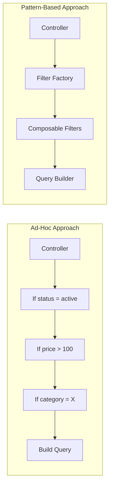
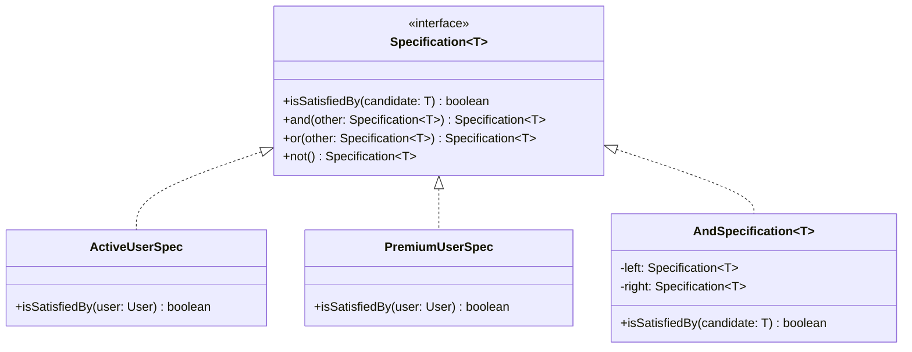
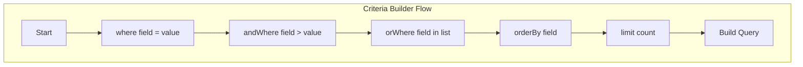
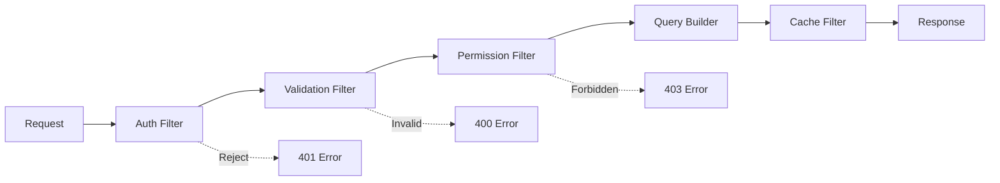
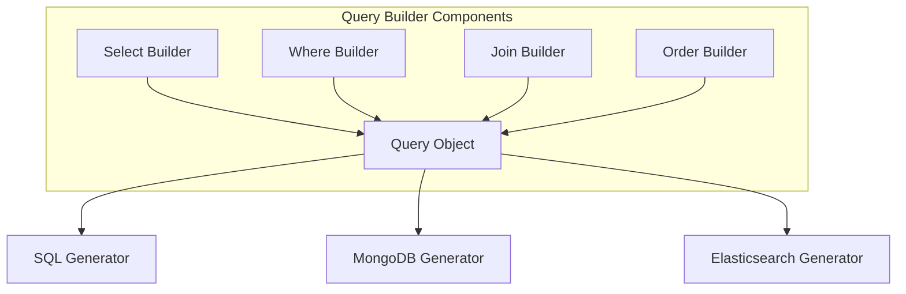

# How to Create API Filtering Patterns

Author: [nawazdhandala](https://github.com/nawazdhandala)

Tags: API Design, Design Patterns, Backend, TypeScript, Python, Software Architecture

Description: Learn how to implement reusable API filtering patterns including the Specification Pattern, Criteria Pattern, and Filter Chain to build flexible, composable query systems.

---

Building API endpoints that support filtering seems straightforward until requirements grow. What starts as a simple `?status=active` parameter evolves into complex queries with multiple conditions, nested logic, and dynamic combinations. This is where filtering patterns shine. Instead of writing ad-hoc filter code for each endpoint, you build composable systems that handle complexity gracefully.

## The Problem with Ad-Hoc Filtering

Most APIs start with hardcoded filter logic. Each endpoint has its own implementation, and adding new filters means modifying existing code. This approach creates several problems:

1. Filter logic spreads across the codebase
2. Testing becomes difficult as filters multiply
3. Combining filters requires custom code for each combination
4. Business rules get buried in controller methods



## Pattern 1: The Specification Pattern

The Specification Pattern encapsulates filter logic into reusable, combinable objects. Each specification represents a single business rule that can be combined with others using AND, OR, and NOT operations.

This pattern is particularly useful when you have complex business rules that need to be reused across different parts of your application.



The following TypeScript implementation shows how to build a complete specification system with support for composing filters together.

```typescript
// specification.ts
// Base specification interface and implementation for composable filters

// Generic specification interface that works with any entity type
interface Specification<T> {
  isSatisfiedBy(candidate: T): boolean;
  and(other: Specification<T>): Specification<T>;
  or(other: Specification<T>): Specification<T>;
  not(): Specification<T>;
  // Convert to database query conditions
  toQuery(): QueryCondition;
}

// Represents a database query condition
interface QueryCondition {
  field?: string;
  operator?: string;
  value?: unknown;
  and?: QueryCondition[];
  or?: QueryCondition[];
  not?: QueryCondition;
}

// Abstract base class with default combination methods
abstract class BaseSpecification<T> implements Specification<T> {
  abstract isSatisfiedBy(candidate: T): boolean;
  abstract toQuery(): QueryCondition;

  // Combine two specifications with AND logic
  and(other: Specification<T>): Specification<T> {
    return new AndSpecification(this, other);
  }

  // Combine two specifications with OR logic
  or(other: Specification<T>): Specification<T> {
    return new OrSpecification(this, other);
  }

  // Negate the specification
  not(): Specification<T> {
    return new NotSpecification(this);
  }
}

// Combines two specifications requiring both to be satisfied
class AndSpecification<T> extends BaseSpecification<T> {
  constructor(
    private left: Specification<T>,
    private right: Specification<T>
  ) {
    super();
  }

  isSatisfiedBy(candidate: T): boolean {
    return (
      this.left.isSatisfiedBy(candidate) &&
      this.right.isSatisfiedBy(candidate)
    );
  }

  toQuery(): QueryCondition {
    return {
      and: [this.left.toQuery(), this.right.toQuery()]
    };
  }
}

// Combines two specifications requiring either to be satisfied
class OrSpecification<T> extends BaseSpecification<T> {
  constructor(
    private left: Specification<T>,
    private right: Specification<T>
  ) {
    super();
  }

  isSatisfiedBy(candidate: T): boolean {
    return (
      this.left.isSatisfiedBy(candidate) ||
      this.right.isSatisfiedBy(candidate)
    );
  }

  toQuery(): QueryCondition {
    return {
      or: [this.left.toQuery(), this.right.toQuery()]
    };
  }
}

// Negates a specification
class NotSpecification<T> extends BaseSpecification<T> {
  constructor(private spec: Specification<T>) {
    super();
  }

  isSatisfiedBy(candidate: T): boolean {
    return !this.spec.isSatisfiedBy(candidate);
  }

  toQuery(): QueryCondition {
    return {
      not: this.spec.toQuery()
    };
  }
}
```

Now let's create concrete specifications for a user entity. Each specification encapsulates a single business rule.

```typescript
// user-specifications.ts
// Concrete specifications for filtering users

interface User {
  id: string;
  email: string;
  status: 'active' | 'inactive' | 'suspended';
  plan: 'free' | 'basic' | 'premium' | 'enterprise';
  createdAt: Date;
  lastLoginAt: Date | null;
  totalSpend: number;
}

// Filters users by their account status
class UserStatusSpecification extends BaseSpecification<User> {
  constructor(private status: User['status']) {}

  isSatisfiedBy(user: User): boolean {
    return user.status === this.status;
  }

  toQuery(): QueryCondition {
    return {
      field: 'status',
      operator: 'eq',
      value: this.status
    };
  }
}

// Filters users by subscription plan
class UserPlanSpecification extends BaseSpecification<User> {
  constructor(private plans: User['plan'][]) {}

  isSatisfiedBy(user: User): boolean {
    return this.plans.includes(user.plan);
  }

  toQuery(): QueryCondition {
    return {
      field: 'plan',
      operator: 'in',
      value: this.plans
    };
  }
}

// Filters users who registered after a specific date
class UserCreatedAfterSpecification extends BaseSpecification<User> {
  constructor(private date: Date) {}

  isSatisfiedBy(user: User): boolean {
    return user.createdAt > this.date;
  }

  toQuery(): QueryCondition {
    return {
      field: 'created_at',
      operator: 'gt',
      value: this.date.toISOString()
    };
  }
}

// Filters users who have not logged in for a specified number of days
class InactiveUserSpecification extends BaseSpecification<User> {
  constructor(private daysInactive: number) {}

  isSatisfiedBy(user: User): boolean {
    if (!user.lastLoginAt) {
      return true; // Never logged in counts as inactive
    }
    const daysSinceLogin = Math.floor(
      (Date.now() - user.lastLoginAt.getTime()) / (1000 * 60 * 60 * 24)
    );
    return daysSinceLogin > this.daysInactive;
  }

  toQuery(): QueryCondition {
    const cutoffDate = new Date();
    cutoffDate.setDate(cutoffDate.getDate() - this.daysInactive);
    return {
      or: [
        { field: 'last_login_at', operator: 'is_null', value: true },
        { field: 'last_login_at', operator: 'lt', value: cutoffDate.toISOString() }
      ]
    };
  }
}

// Filters high-value users based on total spend threshold
class HighValueUserSpecification extends BaseSpecification<User> {
  constructor(private minimumSpend: number) {}

  isSatisfiedBy(user: User): boolean {
    return user.totalSpend >= this.minimumSpend;
  }

  toQuery(): QueryCondition {
    return {
      field: 'total_spend',
      operator: 'gte',
      value: this.minimumSpend
    };
  }
}
```

Here's how to use these specifications in an API endpoint to build complex, reusable filters.

```typescript
// user-controller.ts
// API endpoint using specification pattern for filtering

import { Router, Request, Response } from 'express';

const router = Router();

// Factory function to create specifications from query parameters
function buildUserSpecification(query: Record<string, string>): Specification<User> | null {
  const specs: Specification<User>[] = [];

  // Build individual specifications based on query params
  if (query.status) {
    specs.push(new UserStatusSpecification(query.status as User['status']));
  }

  if (query.plan) {
    const plans = query.plan.split(',') as User['plan'][];
    specs.push(new UserPlanSpecification(plans));
  }

  if (query.created_after) {
    specs.push(new UserCreatedAfterSpecification(new Date(query.created_after)));
  }

  if (query.inactive_days) {
    specs.push(new InactiveUserSpecification(parseInt(query.inactive_days, 10)));
  }

  if (query.min_spend) {
    specs.push(new HighValueUserSpecification(parseFloat(query.min_spend)));
  }

  // Combine all specifications with AND logic
  if (specs.length === 0) {
    return null;
  }

  return specs.reduce((combined, spec) => combined.and(spec));
}

// GET /users endpoint with specification-based filtering
router.get('/users', async (req: Request, res: Response) => {
  const specification = buildUserSpecification(req.query as Record<string, string>);

  // Convert specification to database query
  const queryCondition = specification ? specification.toQuery() : {};

  // Use the query condition to fetch filtered results
  const users = await userRepository.findByCondition(queryCondition);

  res.json({
    data: users,
    filters: queryCondition
  });
});

// Example: Business rule for users eligible for a retention campaign
// Combines multiple specifications into a reusable business rule
function getRetentionCampaignEligibility(): Specification<User> {
  const isActive = new UserStatusSpecification('active');
  const isPaidUser = new UserPlanSpecification(['basic', 'premium', 'enterprise']);
  const isInactive = new InactiveUserSpecification(30);
  const isHighValue = new HighValueUserSpecification(100);

  // Active paid users who haven't logged in for 30 days and have spent over $100
  return isActive.and(isPaidUser).and(isInactive).and(isHighValue);
}

export default router;
```

---

## Pattern 2: The Criteria Pattern

The Criteria Pattern provides a fluent API for building filter conditions. Unlike the Specification Pattern which focuses on individual rules, the Criteria Pattern emphasizes building queries through method chaining.

This pattern works well when you want a more SQL-like syntax for constructing filters.



The following Python implementation demonstrates a flexible criteria builder that supports various filter operations.

```python
# criteria.py
# Fluent criteria builder for constructing API filters

from typing import Any, List, Dict, Optional, TypeVar, Generic
from dataclasses import dataclass, field
from enum import Enum

class Operator(Enum):
    """Supported comparison operators for filter conditions"""
    EQ = "eq"           # Equal
    NE = "ne"           # Not equal
    GT = "gt"           # Greater than
    GTE = "gte"         # Greater than or equal
    LT = "lt"           # Less than
    LTE = "lte"         # Less than or equal
    IN = "in"           # In list
    NOT_IN = "not_in"   # Not in list
    LIKE = "like"       # Pattern matching
    IS_NULL = "is_null" # Null check
    BETWEEN = "between" # Range check


@dataclass
class Condition:
    """Represents a single filter condition"""
    field: str
    operator: Operator
    value: Any
    connector: str = "AND"  # AND or OR


@dataclass
class CriteriaResult:
    """Result of building criteria into a query"""
    where_clause: str
    parameters: List[Any]
    order_by: Optional[str] = None
    limit: Optional[int] = None
    offset: Optional[int] = None


class Criteria:
    """
    Fluent builder for constructing filter criteria.

    Example usage:
        criteria = (Criteria()
            .where("status", Operator.EQ, "active")
            .and_where("price", Operator.GTE, 100)
            .or_where("featured", Operator.EQ, True)
            .order_by("created_at", "DESC")
            .limit(20))
    """

    def __init__(self):
        self._conditions: List[Condition] = []
        self._order_by: List[tuple] = []
        self._limit: Optional[int] = None
        self._offset: Optional[int] = None
        self._allowed_fields: set = set()

    def allow_fields(self, fields: List[str]) -> "Criteria":
        """
        Restrict which fields can be filtered.
        This prevents injection of unauthorized field names.
        """
        self._allowed_fields = set(fields)
        return self

    def _validate_field(self, field: str) -> None:
        """Ensure field is in the allowed list if restrictions are set"""
        if self._allowed_fields and field not in self._allowed_fields:
            raise ValueError(f"Field '{field}' is not allowed for filtering")

    def where(self, field: str, operator: Operator, value: Any) -> "Criteria":
        """Add the first filter condition"""
        self._validate_field(field)
        self._conditions.append(Condition(field, operator, value, "AND"))
        return self

    def and_where(self, field: str, operator: Operator, value: Any) -> "Criteria":
        """Add a condition with AND logic"""
        self._validate_field(field)
        self._conditions.append(Condition(field, operator, value, "AND"))
        return self

    def or_where(self, field: str, operator: Operator, value: Any) -> "Criteria":
        """Add a condition with OR logic"""
        self._validate_field(field)
        self._conditions.append(Condition(field, operator, value, "OR"))
        return self

    def order_by(self, field: str, direction: str = "ASC") -> "Criteria":
        """Add sorting criteria"""
        self._validate_field(field)
        direction = direction.upper()
        if direction not in ("ASC", "DESC"):
            raise ValueError("Direction must be ASC or DESC")
        self._order_by.append((field, direction))
        return self

    def limit(self, count: int) -> "Criteria":
        """Set maximum number of results"""
        if count < 1:
            raise ValueError("Limit must be positive")
        self._limit = count
        return self

    def offset(self, count: int) -> "Criteria":
        """Set number of results to skip"""
        if count < 0:
            raise ValueError("Offset cannot be negative")
        self._offset = count
        return self

    def build(self) -> CriteriaResult:
        """
        Convert criteria to SQL-compatible format.
        Returns parameterized query components to prevent SQL injection.
        """
        if not self._conditions:
            return CriteriaResult(
                where_clause="1=1",
                parameters=[],
                order_by=self._build_order_by(),
                limit=self._limit,
                offset=self._offset
            )

        clauses = []
        parameters = []

        for i, condition in enumerate(self._conditions):
            clause, params = self._build_condition(condition, len(parameters))

            # First condition doesn't need a connector
            if i == 0:
                clauses.append(clause)
            else:
                clauses.append(f"{condition.connector} {clause}")

            parameters.extend(params)

        return CriteriaResult(
            where_clause=" ".join(clauses),
            parameters=parameters,
            order_by=self._build_order_by(),
            limit=self._limit,
            offset=self._offset
        )

    def _build_condition(self, condition: Condition, param_offset: int) -> tuple:
        """Build a single condition into SQL format"""
        field = condition.field
        op = condition.operator
        value = condition.value

        # Map operators to SQL syntax
        operator_map = {
            Operator.EQ: ("=", [value]),
            Operator.NE: ("!=", [value]),
            Operator.GT: (">", [value]),
            Operator.GTE: (">=", [value]),
            Operator.LT: ("<", [value]),
            Operator.LTE: ("<=", [value]),
            Operator.LIKE: ("LIKE", [value]),
            Operator.IS_NULL: ("IS NULL" if value else "IS NOT NULL", []),
        }

        if op == Operator.IN:
            placeholders = ", ".join([f"${i}" for i in range(
                param_offset + 1, param_offset + 1 + len(value)
            )])
            return f"{field} IN ({placeholders})", list(value)

        if op == Operator.NOT_IN:
            placeholders = ", ".join([f"${i}" for i in range(
                param_offset + 1, param_offset + 1 + len(value)
            )])
            return f"{field} NOT IN ({placeholders})", list(value)

        if op == Operator.BETWEEN:
            return f"{field} BETWEEN ${param_offset + 1} AND ${param_offset + 2}", list(value)

        sql_op, params = operator_map[op]
        if params:
            return f"{field} {sql_op} ${param_offset + 1}", params
        return f"{field} {sql_op}", params

    def _build_order_by(self) -> Optional[str]:
        """Build ORDER BY clause"""
        if not self._order_by:
            return None
        parts = [f"{field} {direction}" for field, direction in self._order_by]
        return ", ".join(parts)
```

Here's how to use the Criteria pattern in a FastAPI endpoint.

```python
# routes.py
# FastAPI endpoint using the Criteria pattern

from fastapi import FastAPI, Query, HTTPException
from typing import Optional, List
from criteria import Criteria, Operator

app = FastAPI()

# Define allowed fields for the products endpoint
PRODUCT_FIELDS = ["name", "category", "price", "status", "created_at", "stock"]


def parse_criteria_from_params(
    status: Optional[str] = None,
    category: Optional[str] = None,
    min_price: Optional[float] = None,
    max_price: Optional[float] = None,
    in_stock: Optional[bool] = None,
    search: Optional[str] = None,
    sort_by: Optional[str] = None,
    sort_dir: Optional[str] = "ASC",
    page: int = 1,
    per_page: int = 20
) -> Criteria:
    """
    Parse query parameters into a Criteria object.
    This centralizes filter logic and validation.
    """
    criteria = Criteria().allow_fields(PRODUCT_FIELDS)

    # Add conditions based on provided parameters
    if status:
        criteria.where("status", Operator.EQ, status)

    if category:
        # Support multiple categories separated by commas
        categories = [c.strip() for c in category.split(",")]
        if len(categories) == 1:
            criteria.and_where("category", Operator.EQ, categories[0])
        else:
            criteria.and_where("category", Operator.IN, categories)

    if min_price is not None:
        criteria.and_where("price", Operator.GTE, min_price)

    if max_price is not None:
        criteria.and_where("price", Operator.LTE, max_price)

    if in_stock is not None:
        if in_stock:
            criteria.and_where("stock", Operator.GT, 0)
        else:
            criteria.and_where("stock", Operator.EQ, 0)

    if search:
        # Add wildcard search on name field
        criteria.and_where("name", Operator.LIKE, f"%{search}%")

    # Add sorting
    if sort_by and sort_by in PRODUCT_FIELDS:
        criteria.order_by(sort_by, sort_dir or "ASC")
    else:
        criteria.order_by("created_at", "DESC")

    # Add pagination
    criteria.limit(min(per_page, 100))  # Cap at 100 per page
    criteria.offset((page - 1) * per_page)

    return criteria


@app.get("/products")
async def list_products(
    status: Optional[str] = Query(None, description="Filter by status"),
    category: Optional[str] = Query(None, description="Filter by category (comma-separated)"),
    min_price: Optional[float] = Query(None, ge=0, description="Minimum price"),
    max_price: Optional[float] = Query(None, ge=0, description="Maximum price"),
    in_stock: Optional[bool] = Query(None, description="Filter by stock availability"),
    search: Optional[str] = Query(None, max_length=100, description="Search in name"),
    sort_by: Optional[str] = Query(None, description="Field to sort by"),
    sort_dir: Optional[str] = Query("ASC", regex="^(ASC|DESC)$"),
    page: int = Query(1, ge=1),
    per_page: int = Query(20, ge=1, le=100)
):
    """
    List products with filtering, sorting, and pagination.

    Example requests:
    - GET /products?status=active&category=electronics
    - GET /products?min_price=50&max_price=200&in_stock=true
    - GET /products?search=laptop&sort_by=price&sort_dir=DESC
    """
    try:
        criteria = parse_criteria_from_params(
            status=status,
            category=category,
            min_price=min_price,
            max_price=max_price,
            in_stock=in_stock,
            search=search,
            sort_by=sort_by,
            sort_dir=sort_dir,
            page=page,
            per_page=per_page
        )

        result = criteria.build()

        # Execute query using the built criteria
        products = await product_repository.find_by_criteria(result)
        total = await product_repository.count_by_criteria(result)

        return {
            "data": products,
            "pagination": {
                "page": page,
                "per_page": per_page,
                "total": total,
                "total_pages": (total + per_page - 1) // per_page
            },
            "applied_filters": {
                "where": result.where_clause,
                "order_by": result.order_by
            }
        }
    except ValueError as e:
        raise HTTPException(status_code=400, detail=str(e))
```

---

## Pattern 3: The Filter Chain Pattern

The Filter Chain Pattern processes requests through a sequence of filter handlers. Each handler can modify the query, validate input, or short-circuit the chain. This pattern is useful when filters have dependencies or need to execute in a specific order.



The following implementation shows a filter chain that processes API requests through multiple stages.

```typescript
// filter-chain.ts
// Implementation of the filter chain pattern for API requests

// Context passed through the filter chain
interface FilterContext {
  // Original request parameters
  params: Record<string, unknown>;
  // User making the request
  user: {
    id: string;
    role: string;
    permissions: string[];
  } | null;
  // Built query conditions
  conditions: QueryCondition[];
  // Metadata about the filtering process
  metadata: {
    appliedFilters: string[];
    skippedFilters: string[];
    errors: string[];
  };
  // Flag to stop chain execution
  shouldStop: boolean;
  // HTTP status code if chain should stop
  statusCode?: number;
  // Error message if chain should stop
  errorMessage?: string;
}

interface QueryCondition {
  field: string;
  operator: string;
  value: unknown;
}

// Base interface for filter handlers
interface FilterHandler {
  // Process the context and optionally modify it
  handle(context: FilterContext): Promise<FilterContext>;
  // Set the next handler in the chain
  setNext(handler: FilterHandler): FilterHandler;
}

// Abstract base class for filter handlers
abstract class BaseFilterHandler implements FilterHandler {
  protected nextHandler: FilterHandler | null = null;

  setNext(handler: FilterHandler): FilterHandler {
    this.nextHandler = handler;
    return handler;
  }

  async handle(context: FilterContext): Promise<FilterContext> {
    // Process this handler's logic
    const processedContext = await this.process(context);

    // If chain should stop, return immediately
    if (processedContext.shouldStop) {
      return processedContext;
    }

    // Pass to next handler if exists
    if (this.nextHandler) {
      return this.nextHandler.handle(processedContext);
    }

    return processedContext;
  }

  // Subclasses implement their specific logic here
  protected abstract process(context: FilterContext): Promise<FilterContext>;
}

// Validates that required parameters are present
class RequiredParamsFilter extends BaseFilterHandler {
  constructor(private requiredParams: string[]) {
    super();
  }

  protected async process(context: FilterContext): Promise<FilterContext> {
    const missing = this.requiredParams.filter(
      param => !(param in context.params) || context.params[param] === undefined
    );

    if (missing.length > 0) {
      context.shouldStop = true;
      context.statusCode = 400;
      context.errorMessage = `Missing required parameters: ${missing.join(', ')}`;
      return context;
    }

    context.metadata.appliedFilters.push('RequiredParamsFilter');
    return context;
  }
}

// Applies permission-based filtering
class PermissionFilter extends BaseFilterHandler {
  constructor(
    private requiredPermission: string,
    private ownershipField?: string
  ) {
    super();
  }

  protected async process(context: FilterContext): Promise<FilterContext> {
    if (!context.user) {
      context.shouldStop = true;
      context.statusCode = 401;
      context.errorMessage = 'Authentication required';
      return context;
    }

    const hasPermission = context.user.permissions.includes(this.requiredPermission);
    const isAdmin = context.user.role === 'admin';

    // Admins bypass permission checks
    if (isAdmin) {
      context.metadata.appliedFilters.push('PermissionFilter (admin bypass)');
      return context;
    }

    // Users without permission can only see their own resources
    if (!hasPermission && this.ownershipField) {
      context.conditions.push({
        field: this.ownershipField,
        operator: 'eq',
        value: context.user.id
      });
      context.metadata.appliedFilters.push('PermissionFilter (ownership restricted)');
      return context;
    }

    if (!hasPermission) {
      context.shouldStop = true;
      context.statusCode = 403;
      context.errorMessage = `Permission '${this.requiredPermission}' required`;
      return context;
    }

    context.metadata.appliedFilters.push('PermissionFilter');
    return context;
  }
}

// Applies default filters based on user role
class RoleBasedDefaultsFilter extends BaseFilterHandler {
  constructor(
    private roleDefaults: Record<string, QueryCondition[]>
  ) {
    super();
  }

  protected async process(context: FilterContext): Promise<FilterContext> {
    if (!context.user) {
      context.metadata.skippedFilters.push('RoleBasedDefaultsFilter (no user)');
      return context;
    }

    const defaults = this.roleDefaults[context.user.role];
    if (defaults) {
      context.conditions.push(...defaults);
      context.metadata.appliedFilters.push(`RoleBasedDefaultsFilter (${context.user.role})`);
    }

    return context;
  }
}

// Parses and validates query parameters into conditions
class QueryParamFilter extends BaseFilterHandler {
  constructor(
    private allowedFields: string[],
    private fieldTypes: Record<string, 'string' | 'number' | 'boolean' | 'date'>
  ) {
    super();
  }

  protected async process(context: FilterContext): Promise<FilterContext> {
    for (const [key, value] of Object.entries(context.params)) {
      // Parse field name and operator from key
      const match = key.match(/^(\w+)(?:_(eq|ne|gt|gte|lt|lte|in|contains))?$/);
      if (!match) continue;

      const [, field, operator = 'eq'] = match;

      // Skip if field not allowed
      if (!this.allowedFields.includes(field)) {
        context.metadata.skippedFilters.push(`QueryParamFilter (${field} not allowed)`);
        continue;
      }

      // Validate and convert value type
      const convertedValue = this.convertValue(field, value);
      if (convertedValue === null) {
        context.metadata.errors.push(`Invalid value for ${field}`);
        continue;
      }

      context.conditions.push({
        field,
        operator,
        value: convertedValue
      });
    }

    context.metadata.appliedFilters.push('QueryParamFilter');
    return context;
  }

  private convertValue(field: string, value: unknown): unknown {
    const type = this.fieldTypes[field] || 'string';

    switch (type) {
      case 'number':
        const num = Number(value);
        return isNaN(num) ? null : num;
      case 'boolean':
        if (value === 'true') return true;
        if (value === 'false') return false;
        return null;
      case 'date':
        const date = new Date(value as string);
        return isNaN(date.getTime()) ? null : date;
      default:
        return String(value);
    }
  }
}

// Limits results based on subscription tier
class RateLimitFilter extends BaseFilterHandler {
  constructor(
    private tierLimits: Record<string, number>
  ) {
    super();
  }

  protected async process(context: FilterContext): Promise<FilterContext> {
    const tier = context.user?.role || 'anonymous';
    const limit = this.tierLimits[tier] || this.tierLimits['default'] || 100;

    // Enforce maximum limit regardless of what user requests
    const requestedLimit = context.params['limit'] as number || limit;
    context.params['limit'] = Math.min(requestedLimit, limit);

    context.metadata.appliedFilters.push(`RateLimitFilter (max: ${limit})`);
    return context;
  }
}
```

Here's how to assemble and use the filter chain in an API endpoint.

```typescript
// order-routes.ts
// Using filter chain pattern for order listing endpoint

import { Router, Request, Response } from 'express';

const router = Router();

// Build the filter chain for order listing
function buildOrderFilterChain(): FilterHandler {
  // Define role-based default filters
  const roleDefaults = {
    // Regular users only see their own orders by default
    user: [{ field: 'status', operator: 'ne', value: 'internal' }],
    // Support staff sees all non-internal orders
    support: [{ field: 'status', operator: 'ne', value: 'internal' }],
    // Admins see everything (no defaults)
    admin: []
  };

  // Define rate limits by user tier
  const tierLimits = {
    anonymous: 10,
    user: 50,
    support: 200,
    admin: 1000,
    default: 20
  };

  // Assemble the chain
  const requiredParams = new RequiredParamsFilter([]);
  const permission = new PermissionFilter('orders:read', 'user_id');
  const roleDefaults_ = new RoleBasedDefaultsFilter(roleDefaults);
  const queryParams = new QueryParamFilter(
    ['status', 'created_at', 'total', 'user_id'],
    { status: 'string', created_at: 'date', total: 'number', user_id: 'string' }
  );
  const rateLimit = new RateLimitFilter(tierLimits);

  // Chain handlers together
  requiredParams
    .setNext(permission)
    .setNext(roleDefaults_)
    .setNext(queryParams)
    .setNext(rateLimit);

  return requiredParams;
}

router.get('/orders', async (req: Request, res: Response) => {
  // Initialize context with request data
  const context: FilterContext = {
    params: req.query as Record<string, unknown>,
    user: req.user || null,  // Populated by auth middleware
    conditions: [],
    metadata: {
      appliedFilters: [],
      skippedFilters: [],
      errors: []
    },
    shouldStop: false
  };

  // Run the filter chain
  const filterChain = buildOrderFilterChain();
  const result = await filterChain.handle(context);

  // Check if chain was stopped due to error
  if (result.shouldStop) {
    return res.status(result.statusCode || 500).json({
      error: result.errorMessage,
      metadata: result.metadata
    });
  }

  // Build and execute query from conditions
  const query = buildQueryFromConditions(result.conditions);
  const orders = await orderRepository.findByQuery(query, {
    limit: result.params['limit'] as number,
    offset: result.params['offset'] as number
  });

  res.json({
    data: orders,
    metadata: result.metadata
  });
});

// Helper to convert conditions to database query
function buildQueryFromConditions(conditions: QueryCondition[]): object {
  const where: Record<string, unknown> = {};

  for (const condition of conditions) {
    const { field, operator, value } = condition;

    switch (operator) {
      case 'eq':
        where[field] = value;
        break;
      case 'ne':
        where[field] = { $ne: value };
        break;
      case 'gt':
        where[field] = { $gt: value };
        break;
      case 'gte':
        where[field] = { $gte: value };
        break;
      case 'lt':
        where[field] = { $lt: value };
        break;
      case 'lte':
        where[field] = { $lte: value };
        break;
      case 'in':
        where[field] = { $in: value };
        break;
      case 'contains':
        where[field] = { $regex: value, $options: 'i' };
        break;
    }
  }

  return where;
}

export default router;
```

---

## Pattern 4: The Query Builder Pattern

The Query Builder Pattern provides a declarative way to construct database queries. It separates the query construction logic from the execution, making queries testable and reusable.



This pattern is especially powerful when your API needs to support multiple database backends or when you want to provide a consistent filtering interface across different data stores.

```typescript
// query-builder.ts
// Database-agnostic query builder for API filtering

type WhereOperator = '=' | '!=' | '>' | '>=' | '<' | '<=' | 'IN' | 'NOT IN' | 'LIKE' | 'BETWEEN' | 'IS NULL' | 'IS NOT NULL';
type JoinType = 'INNER' | 'LEFT' | 'RIGHT' | 'FULL';
type OrderDirection = 'ASC' | 'DESC';

interface WhereClause {
  field: string;
  operator: WhereOperator;
  value: unknown;
  connector: 'AND' | 'OR';
}

interface JoinClause {
  type: JoinType;
  table: string;
  alias?: string;
  on: {
    leftField: string;
    rightField: string;
  };
}

interface OrderClause {
  field: string;
  direction: OrderDirection;
  nulls?: 'FIRST' | 'LAST';
}

class QueryBuilder {
  private _select: string[] = ['*'];
  private _from: string = '';
  private _fromAlias?: string;
  private _where: WhereClause[] = [];
  private _joins: JoinClause[] = [];
  private _orderBy: OrderClause[] = [];
  private _groupBy: string[] = [];
  private _having: WhereClause[] = [];
  private _limit?: number;
  private _offset?: number;
  private _distinct: boolean = false;

  // Start building a SELECT query
  static select(...fields: string[]): QueryBuilder {
    const builder = new QueryBuilder();
    builder._select = fields.length > 0 ? fields : ['*'];
    return builder;
  }

  // Set the main table
  from(table: string, alias?: string): QueryBuilder {
    this._from = table;
    this._fromAlias = alias;
    return this;
  }

  // Add DISTINCT keyword
  distinct(): QueryBuilder {
    this._distinct = true;
    return this;
  }

  // Add a WHERE condition
  where(field: string, operator: WhereOperator, value: unknown): QueryBuilder {
    this._where.push({ field, operator, value, connector: 'AND' });
    return this;
  }

  // Add an AND WHERE condition
  andWhere(field: string, operator: WhereOperator, value: unknown): QueryBuilder {
    this._where.push({ field, operator, value, connector: 'AND' });
    return this;
  }

  // Add an OR WHERE condition
  orWhere(field: string, operator: WhereOperator, value: unknown): QueryBuilder {
    this._where.push({ field, operator, value, connector: 'OR' });
    return this;
  }

  // Add a grouped WHERE condition (for complex OR logic)
  whereGroup(callback: (builder: QueryBuilder) => void, connector: 'AND' | 'OR' = 'AND'): QueryBuilder {
    const groupBuilder = new QueryBuilder();
    callback(groupBuilder);

    // Merge the group's where clauses as a nested group
    if (groupBuilder._where.length > 0) {
      this._where.push({
        field: '__group__',
        operator: '=',
        value: groupBuilder._where,
        connector
      });
    }
    return this;
  }

  // Add a JOIN clause
  join(table: string, leftField: string, rightField: string, type: JoinType = 'INNER', alias?: string): QueryBuilder {
    this._joins.push({
      type,
      table,
      alias,
      on: { leftField, rightField }
    });
    return this;
  }

  leftJoin(table: string, leftField: string, rightField: string, alias?: string): QueryBuilder {
    return this.join(table, leftField, rightField, 'LEFT', alias);
  }

  // Add ORDER BY clause
  orderBy(field: string, direction: OrderDirection = 'ASC', nulls?: 'FIRST' | 'LAST'): QueryBuilder {
    this._orderBy.push({ field, direction, nulls });
    return this;
  }

  // Add GROUP BY clause
  groupBy(...fields: string[]): QueryBuilder {
    this._groupBy.push(...fields);
    return this;
  }

  // Add HAVING clause
  having(field: string, operator: WhereOperator, value: unknown): QueryBuilder {
    this._having.push({ field, operator, value, connector: 'AND' });
    return this;
  }

  // Set LIMIT
  limit(count: number): QueryBuilder {
    this._limit = count;
    return this;
  }

  // Set OFFSET
  offset(count: number): QueryBuilder {
    this._offset = count;
    return this;
  }

  // Build to SQL format
  toSQL(): { sql: string; params: unknown[] } {
    const params: unknown[] = [];
    let paramIndex = 1;

    // SELECT clause
    let sql = 'SELECT ';
    if (this._distinct) {
      sql += 'DISTINCT ';
    }
    sql += this._select.join(', ');

    // FROM clause
    sql += ` FROM ${this._from}`;
    if (this._fromAlias) {
      sql += ` AS ${this._fromAlias}`;
    }

    // JOIN clauses
    for (const join of this._joins) {
      sql += ` ${join.type} JOIN ${join.table}`;
      if (join.alias) {
        sql += ` AS ${join.alias}`;
      }
      sql += ` ON ${join.on.leftField} = ${join.on.rightField}`;
    }

    // WHERE clause
    if (this._where.length > 0) {
      const { clause, newParams, newIndex } = this.buildWhereClause(this._where, paramIndex);
      sql += ` WHERE ${clause}`;
      params.push(...newParams);
      paramIndex = newIndex;
    }

    // GROUP BY clause
    if (this._groupBy.length > 0) {
      sql += ` GROUP BY ${this._groupBy.join(', ')}`;
    }

    // HAVING clause
    if (this._having.length > 0) {
      const { clause, newParams } = this.buildWhereClause(this._having, paramIndex);
      sql += ` HAVING ${clause}`;
      params.push(...newParams);
    }

    // ORDER BY clause
    if (this._orderBy.length > 0) {
      const orderParts = this._orderBy.map(o => {
        let part = `${o.field} ${o.direction}`;
        if (o.nulls) {
          part += ` NULLS ${o.nulls}`;
        }
        return part;
      });
      sql += ` ORDER BY ${orderParts.join(', ')}`;
    }

    // LIMIT and OFFSET
    if (this._limit !== undefined) {
      sql += ` LIMIT $${paramIndex++}`;
      params.push(this._limit);
    }
    if (this._offset !== undefined) {
      sql += ` OFFSET $${paramIndex++}`;
      params.push(this._offset);
    }

    return { sql, params };
  }

  private buildWhereClause(
    clauses: WhereClause[],
    startIndex: number
  ): { clause: string; newParams: unknown[]; newIndex: number } {
    const parts: string[] = [];
    const newParams: unknown[] = [];
    let paramIndex = startIndex;

    for (let i = 0; i < clauses.length; i++) {
      const clause = clauses[i];
      let part = '';

      // Handle grouped conditions
      if (clause.field === '__group__') {
        const groupClauses = clause.value as WhereClause[];
        const { clause: groupClause, newParams: groupParams, newIndex } =
          this.buildWhereClause(groupClauses, paramIndex);
        part = `(${groupClause})`;
        newParams.push(...groupParams);
        paramIndex = newIndex;
      } else {
        // Handle regular conditions
        switch (clause.operator) {
          case 'IN':
          case 'NOT IN':
            const values = clause.value as unknown[];
            const placeholders = values.map(() => `$${paramIndex++}`).join(', ');
            part = `${clause.field} ${clause.operator} (${placeholders})`;
            newParams.push(...values);
            break;
          case 'BETWEEN':
            const [low, high] = clause.value as [unknown, unknown];
            part = `${clause.field} BETWEEN $${paramIndex++} AND $${paramIndex++}`;
            newParams.push(low, high);
            break;
          case 'IS NULL':
          case 'IS NOT NULL':
            part = `${clause.field} ${clause.operator}`;
            break;
          default:
            part = `${clause.field} ${clause.operator} $${paramIndex++}`;
            newParams.push(clause.value);
        }
      }

      // Add connector for non-first clauses
      if (i > 0) {
        parts.push(`${clause.connector} ${part}`);
      } else {
        parts.push(part);
      }
    }

    return { clause: parts.join(' '), newParams, newIndex: paramIndex };
  }

  // Clone the builder for reuse
  clone(): QueryBuilder {
    const cloned = new QueryBuilder();
    cloned._select = [...this._select];
    cloned._from = this._from;
    cloned._fromAlias = this._fromAlias;
    cloned._where = [...this._where];
    cloned._joins = [...this._joins];
    cloned._orderBy = [...this._orderBy];
    cloned._groupBy = [...this._groupBy];
    cloned._having = [...this._having];
    cloned._limit = this._limit;
    cloned._offset = this._offset;
    cloned._distinct = this._distinct;
    return cloned;
  }
}
```

Here's how to use the query builder in practice.

```typescript
// product-search.ts
// Using the query builder for a product search endpoint

interface ProductSearchParams {
  category?: string;
  minPrice?: number;
  maxPrice?: number;
  brands?: string[];
  inStock?: boolean;
  search?: string;
  sortBy?: string;
  sortDir?: 'ASC' | 'DESC';
  page?: number;
  perPage?: number;
}

function buildProductSearchQuery(params: ProductSearchParams): { sql: string; params: unknown[] } {
  const query = QueryBuilder
    .select(
      'p.id',
      'p.name',
      'p.price',
      'p.stock_quantity',
      'c.name AS category_name',
      'b.name AS brand_name'
    )
    .from('products', 'p')
    .leftJoin('categories', 'p.category_id', 'c.id', 'c')
    .leftJoin('brands', 'p.brand_id', 'b.id', 'b');

  // Apply filters based on provided parameters
  if (params.category) {
    query.where('c.slug', '=', params.category);
  }

  if (params.minPrice !== undefined) {
    query.andWhere('p.price', '>=', params.minPrice);
  }

  if (params.maxPrice !== undefined) {
    query.andWhere('p.price', '<=', params.maxPrice);
  }

  if (params.brands && params.brands.length > 0) {
    query.andWhere('b.slug', 'IN', params.brands);
  }

  if (params.inStock === true) {
    query.andWhere('p.stock_quantity', '>', 0);
  } else if (params.inStock === false) {
    query.andWhere('p.stock_quantity', '=', 0);
  }

  if (params.search) {
    // Search in name and description with OR logic
    query.whereGroup((group) => {
      group
        .where('p.name', 'LIKE', `%${params.search}%`)
        .orWhere('p.description', 'LIKE', `%${params.search}%`);
    });
  }

  // Sorting
  const sortField = params.sortBy || 'p.created_at';
  const sortDir = params.sortDir || 'DESC';
  query.orderBy(sortField, sortDir);

  // Pagination
  const page = params.page || 1;
  const perPage = Math.min(params.perPage || 20, 100);
  query.limit(perPage).offset((page - 1) * perPage);

  return query.toSQL();
}

// Example usage in an Express route
router.get('/products/search', async (req: Request, res: Response) => {
  const searchParams: ProductSearchParams = {
    category: req.query.category as string,
    minPrice: req.query.min_price ? parseFloat(req.query.min_price as string) : undefined,
    maxPrice: req.query.max_price ? parseFloat(req.query.max_price as string) : undefined,
    brands: req.query.brands ? (req.query.brands as string).split(',') : undefined,
    inStock: req.query.in_stock === 'true' ? true : req.query.in_stock === 'false' ? false : undefined,
    search: req.query.q as string,
    sortBy: req.query.sort_by as string,
    sortDir: (req.query.sort_dir as 'ASC' | 'DESC') || 'DESC',
    page: parseInt(req.query.page as string) || 1,
    perPage: parseInt(req.query.per_page as string) || 20
  };

  const { sql, params } = buildProductSearchQuery(searchParams);

  const products = await db.query(sql, params);

  res.json({
    data: products.rows,
    query: {
      sql,
      params
    }
  });
});
```

---

## Choosing the Right Pattern

Each pattern has its strengths. Use this guide to pick the right one for your situation.

| Pattern | Best For | Complexity | Reusability |
|---------|----------|------------|-------------|
| Specification | Business rules, domain logic | Medium | High |
| Criteria | Simple CRUD APIs, SQL-like queries | Low | Medium |
| Filter Chain | Multi-step validation, middleware-like processing | High | High |
| Query Builder | Complex queries, multiple backends | Medium | High |

You can also combine patterns. For example, use the Filter Chain for request processing and validation, then pass the validated parameters to a Query Builder for database access. Or use Specifications for business rules and convert them to Criteria for database queries.

---

## Performance Tips

When implementing filtering patterns, keep these performance considerations in mind.

### Index Your Filterable Fields

Every field you expose for filtering should have an appropriate database index. Without indexes, filters cause full table scans.

```sql
-- Create indexes for commonly filtered fields
CREATE INDEX idx_products_category ON products(category_id);
CREATE INDEX idx_products_price ON products(price);
CREATE INDEX idx_products_status ON products(status);

-- Composite index for common filter combinations
CREATE INDEX idx_products_category_price ON products(category_id, price);
```

### Limit Query Complexity

Prevent abuse by restricting the number of filters and operators.

```typescript
// config.ts
const FILTER_LIMITS = {
  maxConditions: 10,       // Maximum number of filter conditions
  maxInValues: 50,         // Maximum values in IN clause
  maxJoins: 3,             // Maximum number of joins
  maxSortFields: 3,        // Maximum sort fields
  maxPageSize: 100         // Maximum results per page
};

function validateFilterLimits(conditions: QueryCondition[]): void {
  if (conditions.length > FILTER_LIMITS.maxConditions) {
    throw new Error(`Maximum ${FILTER_LIMITS.maxConditions} filter conditions allowed`);
  }

  for (const condition of conditions) {
    if (condition.operator === 'in' && Array.isArray(condition.value)) {
      if (condition.value.length > FILTER_LIMITS.maxInValues) {
        throw new Error(`Maximum ${FILTER_LIMITS.maxInValues} values in IN clause`);
      }
    }
  }
}
```

### Cache Common Queries

For frequently used filter combinations, implement caching.

```typescript
// cache.ts
import { createHash } from 'crypto';

function buildCacheKey(params: Record<string, unknown>): string {
  // Create deterministic hash of filter parameters
  const normalized = JSON.stringify(
    Object.entries(params)
      .sort(([a], [b]) => a.localeCompare(b))
      .filter(([, v]) => v !== undefined)
  );
  return createHash('md5').update(normalized).digest('hex');
}

async function cachedQuery<T>(
  cacheKey: string,
  ttlSeconds: number,
  queryFn: () => Promise<T>
): Promise<T> {
  const cached = await redis.get(cacheKey);
  if (cached) {
    return JSON.parse(cached);
  }

  const result = await queryFn();
  await redis.setex(cacheKey, ttlSeconds, JSON.stringify(result));
  return result;
}
```

---

## Conclusion

API filtering patterns transform ad-hoc query code into maintainable, testable systems. The Specification Pattern excels at encapsulating business rules. The Criteria Pattern provides a fluent interface for building queries. The Filter Chain Pattern handles multi-step processing with validation. The Query Builder Pattern creates database-agnostic queries.

Start simple. If your API has a handful of filters, the Criteria Pattern is enough. As complexity grows, adopt Specifications for business rules and the Filter Chain for request processing. The Query Builder becomes valuable when you need to support multiple data stores or complex joins.

The investment in these patterns pays off as your API scales. New filters become a matter of adding new specification classes or chain handlers, not modifying existing code.

---

*Building APIs that need monitoring? [OneUptime](https://oneuptime.com) provides comprehensive API monitoring with response time tracking, error alerting, and uptime dashboards.*
