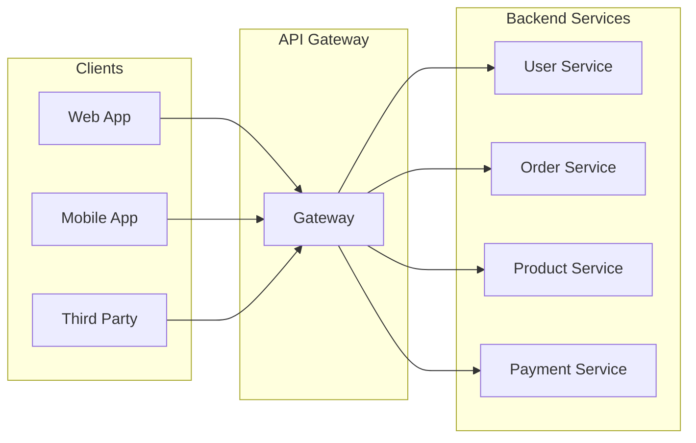
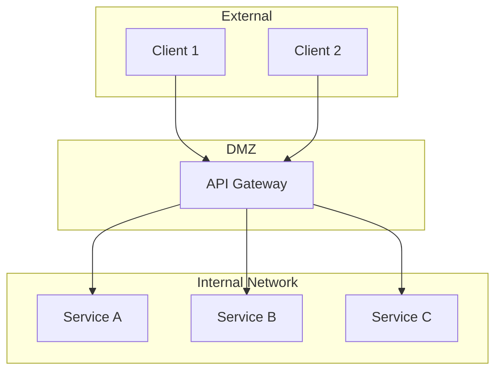
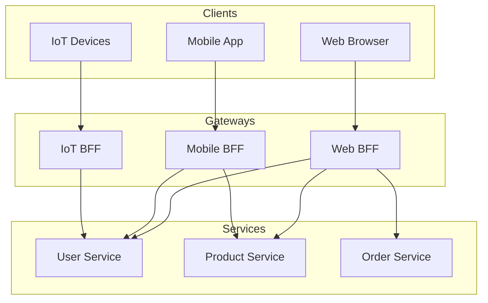
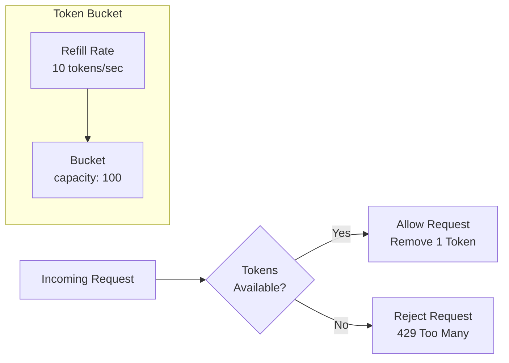
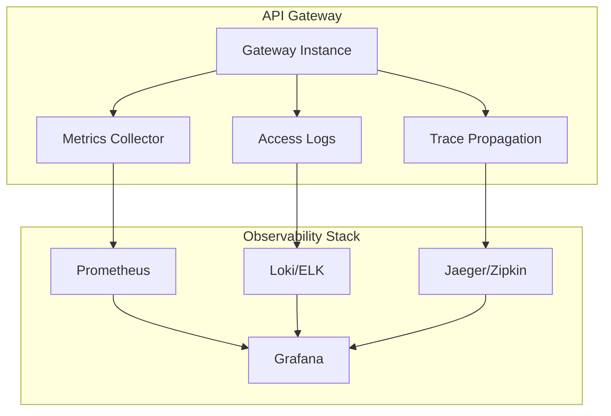
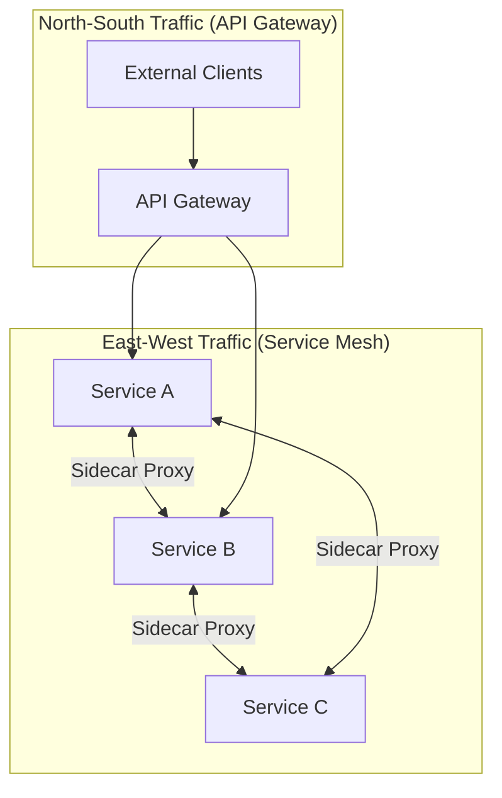

# How to Build API Gateway Architecture

Author: [nawazdhandala](https://github.com/nawazdhandala)

Tags: API Gateway, Microservices, Architecture, Backend

Description: Learn how to design API gateway architecture for routing, authentication, and rate limiting.

---

In a microservices architecture, clients need to communicate with multiple services. Without a unified entry point, this becomes chaotic: clients must know every service endpoint, handle different protocols, and manage cross-cutting concerns like authentication repeatedly. An **API Gateway** solves this by acting as the single entry point for all client requests.

This guide covers the core patterns for building a production-ready API gateway: routing, authentication, rate limiting, and request/response transformation. We will explore implementations using Kong, NGINX, and AWS API Gateway.

---

## Table of Contents

1. What is an API Gateway?
2. Core Responsibilities
3. Architecture Patterns
4. Routing Strategies
5. Authentication and Authorization
6. Rate Limiting
7. Request and Response Transformation
8. Kong Gateway Implementation
9. NGINX as an API Gateway
10. AWS API Gateway
11. Monitoring and Observability
12. Best Practices
13. Common Pitfalls

---

## 1. What is an API Gateway?

An API Gateway is a server that acts as the single entry point for all client requests in a microservices architecture. Instead of clients communicating directly with individual services, they send all requests to the gateway, which then routes them to the appropriate backend service.



The gateway handles cross-cutting concerns that would otherwise be duplicated across every service:

| Concern | Without Gateway | With Gateway |
|---------|-----------------|--------------|
| Authentication | Every service implements auth | Centralized at gateway |
| Rate Limiting | Per-service implementation | Single policy engine |
| SSL Termination | Each service manages certs | Gateway handles TLS |
| Request Logging | Scattered logs | Unified access logs |
| Protocol Translation | Clients adapt per service | Gateway normalizes |

---

## 2. Core Responsibilities

### Traffic Management
- **Routing**: Direct requests to appropriate backend services
- **Load Balancing**: Distribute traffic across service instances
- **Circuit Breaking**: Prevent cascade failures when services are unhealthy

### Security
- **Authentication**: Verify client identity (API keys, JWT, OAuth)
- **Authorization**: Enforce access policies
- **SSL/TLS Termination**: Handle encryption at the edge

### Request Processing
- **Rate Limiting**: Protect services from overload
- **Request Validation**: Reject malformed requests early
- **Transformation**: Modify requests/responses (headers, body, format)

### Observability
- **Logging**: Centralized access logs
- **Metrics**: Latency, error rates, throughput
- **Tracing**: Distributed trace propagation

---

## 3. Architecture Patterns

### Single Gateway Pattern

All traffic flows through one gateway instance (or cluster). Simple to manage but can become a bottleneck.



### Backend for Frontend (BFF) Pattern

Separate gateways for different client types. Each BFF is optimized for its client's specific needs.



### Micro Gateway Pattern

Deploy lightweight gateways alongside each service or service group. Reduces central bottleneck but increases operational complexity.

---

## 4. Routing Strategies

Routing determines how incoming requests map to backend services. Common strategies include:

### Path-Based Routing

Route based on URL path prefix:

```yaml
# Kong declarative configuration
# Routes requests to different backend services based on URL path
services:
  # User service handles all /users/* requests
  - name: user-service
    url: http://user-service:8080
    routes:
      - name: user-routes
        paths:
          - /users
          - /users/
        strip_path: false

  # Order service handles all /orders/* requests
  - name: order-service
    url: http://order-service:8080
    routes:
      - name: order-routes
        paths:
          - /orders
          - /orders/
        strip_path: false

  # Product service handles all /products/* requests
  - name: product-service
    url: http://product-service:8080
    routes:
      - name: product-routes
        paths:
          - /products
          - /products/
        strip_path: false
```

### Header-Based Routing

Route based on request headers (useful for versioning or A/B testing):

```nginx
# NGINX configuration for header-based routing
# Routes to different service versions based on X-API-Version header

upstream user_service_v1 {
    server user-service-v1:8080;
}

upstream user_service_v2 {
    server user-service-v2:8080;
}

server {
    listen 80;

    location /users {
        # Route based on API version header
        # Default to v1 if no version specified
        set $backend user_service_v1;

        if ($http_x_api_version = "v2") {
            set $backend user_service_v2;
        }

        proxy_pass http://$backend;
        proxy_set_header Host $host;
        proxy_set_header X-Real-IP $remote_addr;
        proxy_set_header X-Forwarded-For $proxy_add_x_forwarded_for;
    }
}
```

### Method-Based Routing

Route based on HTTP method:

```yaml
# Kong route configuration
# Separates read and write operations to different service instances
routes:
  # Read operations go to read replicas for better scalability
  - name: users-read
    service: user-service-read
    methods:
      - GET
      - HEAD
    paths:
      - /users

  # Write operations go to primary instance
  - name: users-write
    service: user-service-write
    methods:
      - POST
      - PUT
      - PATCH
      - DELETE
    paths:
      - /users
```

---

## 5. Authentication and Authorization

### API Key Authentication

Simple but effective for service-to-service or third-party integrations:

```javascript
// Node.js Express middleware for API key validation
const crypto = require('crypto');

// In-memory store for demonstration
// Use Redis or database in production for scalability
const apiKeys = new Map([
    ['key_abc123', { clientId: 'mobile-app', tier: 'premium' }],
    ['key_xyz789', { clientId: 'partner-api', tier: 'basic' }]
]);

/**
 * Middleware to validate API keys
 * Expects key in X-API-Key header or api_key query param
 */
function validateApiKey(req, res, next) {
    // Extract API key from header or query parameter
    const apiKey = req.headers['x-api-key'] || req.query.api_key;

    // Return 401 if no API key provided
    if (!apiKey) {
        return res.status(401).json({
            error: 'missing_api_key',
            message: 'API key is required. Provide via X-API-Key header.'
        });
    }

    // Look up the API key in our store
    const keyData = apiKeys.get(apiKey);

    // Return 401 if API key is invalid
    if (!keyData) {
        return res.status(401).json({
            error: 'invalid_api_key',
            message: 'The provided API key is not valid.'
        });
    }

    // Attach client info to request for downstream use
    // Backend services can use this for authorization decisions
    req.client = keyData;
    next();
}

module.exports = { validateApiKey };
```

### JWT Authentication

Industry standard for stateless authentication:

```javascript
// JWT authentication middleware for API Gateway
const jwt = require('jsonwebtoken');

// Configuration loaded from environment variables
const JWT_CONFIG = {
    secret: process.env.JWT_SECRET,
    algorithms: ['HS256', 'RS256'],
    issuer: 'auth.example.com',
    audience: 'api.example.com'
};

/**
 * Middleware to validate JWT tokens
 * Expects token in Authorization: Bearer <token> header
 */
function validateJWT(req, res, next) {
    const authHeader = req.headers.authorization;

    // Check for Authorization header with Bearer scheme
    if (!authHeader || !authHeader.startsWith('Bearer ')) {
        return res.status(401).json({
            error: 'missing_token',
            message: 'Authorization header with Bearer token is required.'
        });
    }

    // Extract token from "Bearer <token>" format
    const token = authHeader.substring(7);

    try {
        // Verify token signature, expiration, issuer, and audience
        const decoded = jwt.verify(token, JWT_CONFIG.secret, {
            algorithms: JWT_CONFIG.algorithms,
            issuer: JWT_CONFIG.issuer,
            audience: JWT_CONFIG.audience
        });

        // Attach decoded payload to request for downstream services
        req.user = {
            id: decoded.sub,
            email: decoded.email,
            roles: decoded.roles || [],
            scopes: decoded.scopes || []
        };

        next();
    } catch (error) {
        // Handle specific JWT errors with appropriate messages
        if (error.name === 'TokenExpiredError') {
            return res.status(401).json({
                error: 'token_expired',
                message: 'The token has expired. Please obtain a new token.'
            });
        }

        if (error.name === 'JsonWebTokenError') {
            return res.status(401).json({
                error: 'invalid_token',
                message: 'The token is malformed or invalid.'
            });
        }

        return res.status(401).json({
            error: 'authentication_failed',
            message: 'Token validation failed.'
        });
    }
}

/**
 * Middleware factory for role-based access control
 * @param {string[]} allowedRoles - Roles that can access the resource
 */
function requireRoles(allowedRoles) {
    return (req, res, next) => {
        // Ensure user is authenticated first
        if (!req.user) {
            return res.status(401).json({
                error: 'unauthenticated',
                message: 'Authentication is required.'
            });
        }

        // Check if user has at least one of the allowed roles
        const userRoles = req.user.roles || [];
        const hasRole = allowedRoles.some(role => userRoles.includes(role));

        if (!hasRole) {
            return res.status(403).json({
                error: 'forbidden',
                message: `Required roles: ${allowedRoles.join(', ')}`
            });
        }

        next();
    };
}

module.exports = { validateJWT, requireRoles };
```

### Kong JWT Plugin Configuration

```yaml
# Kong plugin configuration for JWT authentication
# Enables JWT validation at the gateway level
plugins:
  - name: jwt
    service: user-service
    config:
      # Where to look for the token
      header_names:
        - Authorization
      # Claims to validate automatically
      claims_to_verify:
        - exp  # Expiration time
        - nbf  # Not before
      # Claim used to identify the consumer
      key_claim_name: iss
      # Run JWT validation on preflight requests
      run_on_preflight: true

# Consumer with JWT credentials
consumers:
  - username: mobile-app
    jwt_secrets:
      - key: mobile-app-key
        algorithm: HS256
        secret: your-256-bit-secret
```

---

## 6. Rate Limiting

Rate limiting protects your services from abuse and ensures fair resource allocation.

### Token Bucket Algorithm



### Node.js Rate Limiter Implementation

```javascript
// Distributed rate limiter using Redis sliding window algorithm
const Redis = require('ioredis');

// Redis client for distributed rate limiting
// Enables rate limiting across multiple gateway instances
const redis = new Redis({
    host: process.env.REDIS_HOST || 'localhost',
    port: process.env.REDIS_PORT || 6379,
    password: process.env.REDIS_PASSWORD
});

/**
 * Sliding window rate limiter using Redis sorted sets
 * More accurate than fixed window, handles boundary edge cases
 */
class SlidingWindowRateLimiter {
    /**
     * @param {Object} options - Configuration options
     * @param {number} options.windowMs - Time window in milliseconds
     * @param {number} options.maxRequests - Maximum requests per window
     * @param {string} options.keyPrefix - Redis key prefix for namespacing
     */
    constructor(options) {
        this.windowMs = options.windowMs || 60000;      // Default: 1 minute
        this.maxRequests = options.maxRequests || 100;  // Default: 100 requests
        this.keyPrefix = options.keyPrefix || 'ratelimit';
    }

    /**
     * Check if request should be allowed
     * @param {string} identifier - Unique client identifier (IP, user ID, API key)
     * @returns {Promise<{allowed: boolean, remaining: number, resetAt: number}>}
     */
    async checkLimit(identifier) {
        const now = Date.now();
        const windowStart = now - this.windowMs;
        const key = `${this.keyPrefix}:${identifier}`;

        // Use Redis pipeline for atomic operations
        // This ensures accurate counting under concurrent requests
        const pipeline = redis.pipeline();

        // Remove entries outside the current window
        pipeline.zremrangebyscore(key, 0, windowStart);

        // Count current requests in window
        pipeline.zcard(key);

        // Add current request with timestamp as score
        // Random suffix ensures uniqueness for multiple requests at same ms
        pipeline.zadd(key, now, `${now}:${Math.random()}`);

        // Set expiry to automatically clean up old keys
        pipeline.expire(key, Math.ceil(this.windowMs / 1000) + 1);

        const results = await pipeline.exec();
        const currentCount = results[1][1];  // Result of zcard

        // Calculate response values
        const allowed = currentCount < this.maxRequests;
        const remaining = Math.max(0, this.maxRequests - currentCount - 1);
        const resetAt = now + this.windowMs;

        return { allowed, remaining, resetAt, currentCount };
    }
}

/**
 * Express middleware factory for rate limiting
 * @param {Object} options - Rate limiter configuration
 */
function createRateLimitMiddleware(options = {}) {
    const limiter = new SlidingWindowRateLimiter(options);

    // Function to extract client identifier
    // Priority: API key > User ID > IP address
    const getIdentifier = options.keyGenerator || ((req) => {
        return req.headers['x-api-key']
            || req.user?.id
            || req.ip
            || req.connection.remoteAddress;
    });

    return async (req, res, next) => {
        const identifier = getIdentifier(req);

        try {
            const result = await limiter.checkLimit(identifier);

            // Set rate limit headers following IETF draft standard
            res.set({
                'X-RateLimit-Limit': options.maxRequests || 100,
                'X-RateLimit-Remaining': result.remaining,
                'X-RateLimit-Reset': Math.ceil(result.resetAt / 1000),
                'RateLimit-Policy': `${options.maxRequests || 100};w=${Math.ceil((options.windowMs || 60000) / 1000)}`
            });

            // Reject request if limit exceeded
            if (!result.allowed) {
                res.set('Retry-After', Math.ceil((options.windowMs || 60000) / 1000));
                return res.status(429).json({
                    error: 'rate_limit_exceeded',
                    message: 'Too many requests. Please slow down.',
                    retryAfter: Math.ceil((options.windowMs || 60000) / 1000)
                });
            }

            next();
        } catch (error) {
            // Fail open: if Redis is unavailable, allow the request
            // Log error for monitoring and alerting
            console.error('Rate limiter error:', error);
            next();
        }
    };
}

module.exports = { SlidingWindowRateLimiter, createRateLimitMiddleware };
```

### Kong Rate Limiting Configuration

```yaml
# Kong rate limiting plugin configuration
# Implements distributed rate limiting with Redis backend
plugins:
  - name: rate-limiting
    service: api-service
    config:
      # Limits per time window
      second: 10
      minute: 100
      hour: 1000

      # Policy: local (single node), cluster, or redis
      # Use redis for distributed deployments
      policy: redis

      # Redis configuration for distributed limiting
      redis_host: redis.example.com
      redis_port: 6379
      redis_password: ${REDIS_PASSWORD}
      redis_database: 0

      # What to use as the rate limit key
      # Options: consumer, credential, ip, header, path
      limit_by: credential

      # Include rate limit headers in response
      hide_client_headers: false

      # Fail open if Redis is unavailable
      fault_tolerant: true
```

### Tiered Rate Limits

```yaml
# Different rate limits for different consumer tiers
# Enables monetization through API tiers
consumers:
  - username: free-tier
    plugins:
      - name: rate-limiting
        config:
          minute: 60
          hour: 1000

  - username: pro-tier
    plugins:
      - name: rate-limiting
        config:
          minute: 600
          hour: 10000

  - username: enterprise-tier
    plugins:
      - name: rate-limiting
        config:
          minute: 6000
          hour: 100000
```

---

## 7. Request and Response Transformation

### Request Transformation

Modify incoming requests before they reach backend services:

```javascript
// Express middleware for request transformation
// Normalizes and enriches requests before routing to backends

/**
 * Generate a unique correlation ID for request tracing
 * Uses timestamp and random component for uniqueness
 */
function generateCorrelationId() {
    const timestamp = Date.now().toString(36);
    const randomPart = Math.random().toString(36).substring(2, 10);
    return `${timestamp}-${randomPart}`;
}

/**
 * Request transformation middleware factory
 * @param {Object} transformations - Transformation configuration
 */
function transformRequest(transformations) {
    return (req, res, next) => {
        // Add correlation ID for distributed tracing
        // Only add if not already present (from upstream load balancer)
        if (!req.headers['x-correlation-id']) {
            req.headers['x-correlation-id'] = generateCorrelationId();
        }

        // Add request timestamp for latency calculations
        req.headers['x-request-timestamp'] = Date.now().toString();

        // Add gateway identifier for debugging
        req.headers['x-forwarded-by'] = 'api-gateway';

        // Apply custom header transformations
        if (transformations.headers) {
            for (const [key, value] of Object.entries(transformations.headers)) {
                // Support both static values and functions
                if (typeof value === 'function') {
                    req.headers[key] = value(req);
                } else {
                    req.headers[key] = value;
                }
            }
        }

        // Transform request body if needed
        if (transformations.body && req.body) {
            req.body = transformations.body(req.body, req);
        }

        // Transform query parameters
        if (transformations.query && req.query) {
            req.query = transformations.query(req.query, req);
        }

        next();
    };
}

// Example usage: detect client type and add metadata
app.use('/api', transformRequest({
    headers: {
        // Dynamically detect mobile vs web clients
        'x-client-type': (req) => req.headers['user-agent']?.includes('Mobile') ? 'mobile' : 'web',
        'x-api-version': 'v2'
    },
    body: (body, req) => {
        // Add metadata to all request bodies
        return {
            ...body,
            _meta: {
                requestedAt: new Date().toISOString(),
                clientIp: req.ip
            }
        };
    }
}));
```

### Response Transformation

```javascript
// Middleware to transform responses before sending to client
// Useful for hiding internal details, adding metadata, format conversion

/**
 * Recursively remove specified fields from object
 * Handles nested objects and arrays
 */
function removeFields(obj, fields) {
    if (Array.isArray(obj)) {
        return obj.map(item => removeFields(item, fields));
    }

    if (obj && typeof obj === 'object') {
        const result = {};
        for (const [key, value] of Object.entries(obj)) {
            if (!fields.includes(key)) {
                result[key] = removeFields(value, fields);
            }
        }
        return result;
    }

    return obj;
}

/**
 * Rename fields in object based on mapping
 * Useful for converting internal naming to public API conventions
 */
function renameFields(obj, mapping) {
    if (Array.isArray(obj)) {
        return obj.map(item => renameFields(item, mapping));
    }

    if (obj && typeof obj === 'object') {
        const result = {};
        for (const [key, value] of Object.entries(obj)) {
            const newKey = mapping[key] || key;
            result[newKey] = renameFields(value, mapping);
        }
        return result;
    }

    return obj;
}

/**
 * Response transformation middleware factory
 * @param {Object} options - Transformation options
 */
function transformResponse(options = {}) {
    return (req, res, next) => {
        // Store original json method
        const originalJson = res.json.bind(res);

        // Override json method to intercept responses
        res.json = (body) => {
            let transformed = body;

            // Remove internal fields that should not be exposed
            if (options.removeFields && Array.isArray(options.removeFields)) {
                transformed = removeFields(transformed, options.removeFields);
            }

            // Rename fields (internal to public API names)
            if (options.renameFields) {
                transformed = renameFields(transformed, options.renameFields);
            }

            // Wrap response in standard envelope
            if (options.envelope) {
                transformed = {
                    success: res.statusCode < 400,
                    data: transformed,
                    meta: {
                        requestId: req.headers['x-correlation-id'],
                        timestamp: new Date().toISOString(),
                        version: options.apiVersion || 'v1'
                    }
                };
            }

            // Add pagination metadata for list responses
            if (options.pagination && Array.isArray(body)) {
                transformed.meta.pagination = {
                    total: body.length,
                    page: parseInt(req.query.page) || 1,
                    perPage: parseInt(req.query.per_page) || 20
                };
            }

            return originalJson(transformed);
        };

        next();
    };
}

// Example usage: standardize API responses
app.use('/api', transformResponse({
    envelope: true,
    apiVersion: 'v2',
    // Remove internal fields from all responses
    removeFields: ['_id', '__v', 'internalNotes', 'passwordHash'],
    // Convert camelCase to snake_case for public API
    renameFields: {
        'createdAt': 'created_at',
        'updatedAt': 'updated_at',
        'userId': 'user_id'
    }
}));
```

### Kong Transformer Plugin

```yaml
# Kong request/response transformer plugin
# Declarative transformation without custom code
plugins:
  - name: request-transformer
    service: backend-service
    config:
      # Add headers and query params to all requests
      add:
        headers:
          - "X-Gateway-Version:1.0"
          - "X-Request-Start:$(now)"
        querystring:
          - "gateway=true"
      # Remove sensitive headers before forwarding
      remove:
        headers:
          - "X-Internal-Token"
      # Rename headers for backend compatibility
      rename:
        headers:
          - "Authorization:X-Auth-Token"
      # Replace headers with new values
      replace:
        headers:
          - "Host:internal-service.local"

  - name: response-transformer
    service: backend-service
    config:
      # Remove headers that expose internal details
      remove:
        headers:
          - "X-Powered-By"
          - "Server"
        json:
          - "internal_id"
          - "debug_info"
      # Add standard response headers
      add:
        headers:
          - "X-Response-Time:$(latency)"
      # Rename internal headers to public names
      rename:
        headers:
          - "X-Backend-Server:X-Served-By"
```

---

## 8. Kong Gateway Implementation

Kong is a popular open-source API gateway built on NGINX with a plugin ecosystem.

### Installation with Docker

```yaml
# docker-compose.yml for Kong with PostgreSQL
# Production-ready setup with health checks and persistent storage
version: '3.8'

services:
  # PostgreSQL database for Kong configuration
  kong-database:
    image: postgres:15-alpine
    environment:
      POSTGRES_USER: kong
      POSTGRES_DB: kong
      POSTGRES_PASSWORD: ${KONG_PG_PASSWORD:-kongpassword}
    volumes:
      - kong-data:/var/lib/postgresql/data
    healthcheck:
      test: ["CMD", "pg_isready", "-U", "kong"]
      interval: 10s
      timeout: 5s
      retries: 5

  # Run database migrations before starting Kong
  kong-migration:
    image: kong:3.5
    command: kong migrations bootstrap
    depends_on:
      kong-database:
        condition: service_healthy
    environment:
      KONG_DATABASE: postgres
      KONG_PG_HOST: kong-database
      KONG_PG_USER: kong
      KONG_PG_PASSWORD: ${KONG_PG_PASSWORD:-kongpassword}

  # Kong gateway service
  kong:
    image: kong:3.5
    depends_on:
      kong-migration:
        condition: service_completed_successfully
    environment:
      KONG_DATABASE: postgres
      KONG_PG_HOST: kong-database
      KONG_PG_USER: kong
      KONG_PG_PASSWORD: ${KONG_PG_PASSWORD:-kongpassword}
      # Log to stdout/stderr for container logging
      KONG_PROXY_ACCESS_LOG: /dev/stdout
      KONG_ADMIN_ACCESS_LOG: /dev/stdout
      KONG_PROXY_ERROR_LOG: /dev/stderr
      KONG_ADMIN_ERROR_LOG: /dev/stderr
      # Listen on all interfaces
      KONG_ADMIN_LISTEN: 0.0.0.0:8001
      KONG_PROXY_LISTEN: 0.0.0.0:8000, 0.0.0.0:8443 ssl
    ports:
      - "8000:8000"   # Proxy HTTP
      - "8443:8443"   # Proxy HTTPS
      - "8001:8001"   # Admin API
    healthcheck:
      test: ["CMD", "kong", "health"]
      interval: 10s
      timeout: 5s
      retries: 5

volumes:
  kong-data:
```

### Full Kong Configuration Example

```yaml
# kong.yml - Declarative configuration for Kong
# Load with: kong config db_import kong.yml
_format_version: "3.0"

# Define backend services with connection settings
services:
  - name: user-service
    url: http://user-service:8080
    connect_timeout: 5000
    write_timeout: 60000
    read_timeout: 60000
    retries: 3

  - name: order-service
    url: http://order-service:8080
    connect_timeout: 5000
    write_timeout: 60000
    read_timeout: 60000
    retries: 3

  - name: product-service
    url: http://product-service:8080
    connect_timeout: 5000
    write_timeout: 60000
    read_timeout: 60000
    retries: 3

# Define routes mapping URLs to services
routes:
  - name: user-routes
    service: user-service
    paths:
      - /api/v1/users
    methods:
      - GET
      - POST
      - PUT
      - DELETE
    strip_path: false
    preserve_host: true

  - name: order-routes
    service: order-service
    paths:
      - /api/v1/orders
    methods:
      - GET
      - POST
      - PUT
      - DELETE
    strip_path: false

  - name: product-routes
    service: product-service
    paths:
      - /api/v1/products
    methods:
      - GET
      - POST
      - PUT
      - DELETE
    strip_path: false

# Global plugins applied to all services
plugins:
  # CORS configuration for browser clients
  - name: cors
    config:
      origins:
        - "https://app.example.com"
        - "https://admin.example.com"
      methods:
        - GET
        - POST
        - PUT
        - PATCH
        - DELETE
        - OPTIONS
      headers:
        - Authorization
        - Content-Type
        - X-Request-ID
      exposed_headers:
        - X-RateLimit-Limit
        - X-RateLimit-Remaining
      credentials: true
      max_age: 3600

  # Request ID for distributed tracing
  - name: correlation-id
    config:
      header_name: X-Request-ID
      generator: uuid
      echo_downstream: true

  # Access logging
  - name: file-log
    config:
      path: /var/log/kong/access.log
      reopen: true

  # Prometheus metrics endpoint
  - name: prometheus
    config:
      per_consumer: true
      status_code_metrics: true
      latency_metrics: true

# Service-specific plugins
plugins:
  # JWT authentication for user service
  - name: jwt
    service: user-service
    config:
      header_names:
        - Authorization
      claims_to_verify:
        - exp

  # Rate limiting for order service
  - name: rate-limiting
    service: order-service
    config:
      minute: 100
      hour: 1000
      policy: redis
      redis_host: redis
      redis_port: 6379

# Consumer definitions for API clients
consumers:
  - username: mobile-app
    custom_id: mobile-app-001

  - username: web-app
    custom_id: web-app-001

# API key credentials
keyauth_credentials:
  - consumer: mobile-app
    key: mobile-api-key-12345

  - consumer: web-app
    key: web-api-key-67890

# JWT credentials
jwt_secrets:
  - consumer: mobile-app
    key: mobile-jwt-key
    algorithm: HS256
    secret: your-jwt-secret-for-mobile
```

---

## 9. NGINX as an API Gateway

NGINX can function as a lightweight, high-performance API gateway.

### Complete NGINX Gateway Configuration

```nginx
# nginx.conf - Full API Gateway configuration
# Optimized for high-performance API routing

# Worker processes based on CPU cores
worker_processes auto;
error_log /var/log/nginx/error.log warn;
pid /var/run/nginx.pid;

events {
    # Maximum concurrent connections per worker
    worker_connections 4096;
    # Efficient connection handling on Linux
    use epoll;
    # Accept multiple connections at once
    multi_accept on;
}

http {
    # Basic settings
    include /etc/nginx/mime.types;
    default_type application/json;

    # Detailed logging format for API analytics
    log_format api_gateway '$remote_addr - $remote_user [$time_local] '
                           '"$request" $status $body_bytes_sent '
                           '"$http_referer" "$http_user_agent" '
                           'rt=$request_time uct="$upstream_connect_time" '
                           'uht="$upstream_header_time" urt="$upstream_response_time" '
                           'rid="$request_id"';

    access_log /var/log/nginx/access.log api_gateway;

    # Performance tuning
    sendfile on;
    tcp_nopush on;
    tcp_nodelay on;
    keepalive_timeout 65;
    keepalive_requests 1000;

    # Gzip compression for JSON responses
    gzip on;
    gzip_types application/json application/xml text/plain;
    gzip_min_length 1000;

    # Rate limiting zones
    # $binary_remote_addr uses less memory than $remote_addr
    limit_req_zone $binary_remote_addr zone=api_limit:10m rate=10r/s;
    limit_req_zone $http_x_api_key zone=api_key_limit:10m rate=100r/s;

    # Connection limiting per client
    limit_conn_zone $binary_remote_addr zone=conn_limit:10m;

    # Upstream definitions with load balancing
    upstream user_service {
        # Least connections load balancing
        least_conn;
        server user-service-1:8080 weight=5;
        server user-service-2:8080 weight=5;
        server user-service-3:8080 backup;  # Failover server

        # Keep connections open to upstream
        keepalive 32;
    }

    upstream order_service {
        least_conn;
        server order-service-1:8080;
        server order-service-2:8080;

        keepalive 32;
    }

    upstream product_service {
        # Session persistence based on client IP
        ip_hash;
        server product-service-1:8080;
        server product-service-2:8080;

        keepalive 32;
    }

    # API key validation map
    # In production, use auth_request to validate against a service
    map $http_x_api_key $api_key_valid {
        default 0;
        "valid-api-key-123" 1;
        "valid-api-key-456" 1;
    }

    # Main server block
    server {
        listen 80;
        listen 443 ssl http2;
        server_name api.example.com;

        # SSL configuration with modern settings
        ssl_certificate /etc/nginx/ssl/api.example.com.crt;
        ssl_certificate_key /etc/nginx/ssl/api.example.com.key;
        ssl_protocols TLSv1.2 TLSv1.3;
        ssl_ciphers ECDHE-ECDSA-AES128-GCM-SHA256:ECDHE-RSA-AES128-GCM-SHA256;
        ssl_prefer_server_ciphers off;
        ssl_session_cache shared:SSL:10m;
        ssl_session_timeout 1d;

        # Security headers
        add_header X-Request-ID $request_id always;
        add_header X-Content-Type-Options nosniff always;
        add_header X-Frame-Options DENY always;

        # Hide server information
        server_tokens off;

        # Request size limits
        client_max_body_size 10m;
        client_body_buffer_size 128k;

        # Health check endpoint for load balancers
        location /health {
            access_log off;
            return 200 '{"status":"healthy","timestamp":"$time_iso8601"}';
        }

        # API version 1 routes
        location /api/v1/ {
            # Apply rate limiting with burst handling
            limit_req zone=api_limit burst=20 nodelay;
            limit_conn conn_limit 10;

            # API key validation
            if ($api_key_valid = 0) {
                return 401 '{"error":"invalid_api_key","message":"Valid API key required"}';
            }

            # Common proxy settings
            proxy_http_version 1.1;
            proxy_set_header Host $host;
            proxy_set_header X-Real-IP $remote_addr;
            proxy_set_header X-Forwarded-For $proxy_add_x_forwarded_for;
            proxy_set_header X-Forwarded-Proto $scheme;
            proxy_set_header X-Request-ID $request_id;
            proxy_set_header Connection "";

            # Timeouts
            proxy_connect_timeout 5s;
            proxy_send_timeout 60s;
            proxy_read_timeout 60s;

            # User service routes
            location /api/v1/users {
                proxy_pass http://user_service;
            }

            # Order service routes
            location /api/v1/orders {
                proxy_pass http://order_service;
            }

            # Product service routes with caching
            location /api/v1/products {
                proxy_pass http://product_service;

                # Cache GET requests for products
                proxy_cache_valid 200 5m;
                proxy_cache_use_stale error timeout updating;
            }
        }

        # Custom error responses
        error_page 429 = @rate_limited;
        location @rate_limited {
            default_type application/json;
            return 429 '{"error":"rate_limit_exceeded","message":"Too many requests","retry_after":60}';
        }

        error_page 500 502 503 504 = @server_error;
        location @server_error {
            default_type application/json;
            return 500 '{"error":"internal_error","message":"Service temporarily unavailable"}';
        }
    }
}
```

---

## 10. AWS API Gateway

AWS API Gateway is a fully managed service for creating, deploying, and managing APIs.

### CloudFormation/SAM Template

```yaml
# template.yaml - AWS SAM template for API Gateway
# Deploys a complete API Gateway with Lambda authorizer
AWSTemplateFormatVersion: '2010-09-09'
Transform: AWS::Serverless-2016-10-31
Description: API Gateway for microservices architecture

Parameters:
  Environment:
    Type: String
    Default: dev
    AllowedValues:
      - dev
      - staging
      - prod

  UserServiceEndpoint:
    Type: String
    Description: HTTP endpoint for user service

  OrderServiceEndpoint:
    Type: String
    Description: HTTP endpoint for order service

Globals:
  Api:
    OpenApiVersion: '3.0.1'

Resources:
  # API Gateway REST API
  ApiGateway:
    Type: AWS::ApiGateway::RestApi
    Properties:
      Name: !Sub '${Environment}-microservices-api'
      Description: API Gateway for microservices
      EndpointConfiguration:
        Types:
          - REGIONAL
      Policy:
        Version: '2012-10-17'
        Statement:
          - Effect: Allow
            Principal: '*'
            Action: execute-api:Invoke
            Resource: !Sub 'arn:aws:execute-api:${AWS::Region}:${AWS::AccountId}:*/*'

  # API Key for client authentication
  ApiKey:
    Type: AWS::ApiGateway::ApiKey
    Properties:
      Name: !Sub '${Environment}-api-key'
      Enabled: true
      StageKeys:
        - RestApiId: !Ref ApiGateway
          StageName: !Ref ApiStage

  # Usage plan with rate limiting and quotas
  UsagePlan:
    Type: AWS::ApiGateway::UsagePlan
    Properties:
      UsagePlanName: !Sub '${Environment}-standard-plan'
      Description: Standard usage plan with rate limiting
      ApiStages:
        - ApiId: !Ref ApiGateway
          Stage: !Ref ApiStage
      # Daily quota
      Quota:
        Limit: 10000
        Period: DAY
      # Rate limiting
      Throttle:
        BurstLimit: 100
        RateLimit: 50

  # Associate API key with usage plan
  UsagePlanKey:
    Type: AWS::ApiGateway::UsagePlanKey
    Properties:
      KeyId: !Ref ApiKey
      KeyType: API_KEY
      UsagePlanId: !Ref UsagePlan

  # Lambda authorizer for JWT validation
  JwtAuthorizer:
    Type: AWS::ApiGateway::Authorizer
    Properties:
      Name: JwtAuthorizer
      Type: TOKEN
      RestApiId: !Ref ApiGateway
      IdentitySource: method.request.header.Authorization
      AuthorizerUri: !Sub 'arn:aws:apigateway:${AWS::Region}:lambda:path/2015-03-31/functions/${AuthorizerFunction.Arn}/invocations'
      # Cache authorization for 5 minutes
      AuthorizerResultTtlInSeconds: 300

  # Lambda function for JWT validation
  AuthorizerFunction:
    Type: AWS::Serverless::Function
    Properties:
      FunctionName: !Sub '${Environment}-jwt-authorizer'
      Runtime: nodejs18.x
      Handler: authorizer.handler
      CodeUri: ./authorizer
      Environment:
        Variables:
          JWT_SECRET: '{{resolve:secretsmanager:jwt-secret:SecretString:key}}'
      Policies:
        - Version: '2012-10-17'
          Statement:
            - Effect: Allow
              Action:
                - secretsmanager:GetSecretValue
              Resource: !Sub 'arn:aws:secretsmanager:${AWS::Region}:${AWS::AccountId}:secret:jwt-secret-*'

  # Users resource
  UsersResource:
    Type: AWS::ApiGateway::Resource
    Properties:
      RestApiId: !Ref ApiGateway
      ParentId: !GetAtt ApiGateway.RootResourceId
      PathPart: users

  # Users GET method with JWT auth
  UsersGetMethod:
    Type: AWS::ApiGateway::Method
    Properties:
      RestApiId: !Ref ApiGateway
      ResourceId: !Ref UsersResource
      HttpMethod: GET
      AuthorizationType: CUSTOM
      AuthorizerId: !Ref JwtAuthorizer
      ApiKeyRequired: true
      Integration:
        Type: HTTP_PROXY
        IntegrationHttpMethod: GET
        Uri: !Sub '${UserServiceEndpoint}/users'
        ConnectionType: INTERNET
        IntegrationResponses:
          - StatusCode: 200
        # Pass request ID to backend
        RequestParameters:
          integration.request.header.X-Request-ID: context.requestId
      MethodResponses:
        - StatusCode: 200

  # Orders resource
  OrdersResource:
    Type: AWS::ApiGateway::Resource
    Properties:
      RestApiId: !Ref ApiGateway
      ParentId: !GetAtt ApiGateway.RootResourceId
      PathPart: orders

  # Orders POST method with body transformation
  OrdersPostMethod:
    Type: AWS::ApiGateway::Method
    Properties:
      RestApiId: !Ref ApiGateway
      ResourceId: !Ref OrdersResource
      HttpMethod: POST
      AuthorizationType: CUSTOM
      AuthorizerId: !Ref JwtAuthorizer
      ApiKeyRequired: true
      Integration:
        Type: HTTP_PROXY
        IntegrationHttpMethod: POST
        Uri: !Sub '${OrderServiceEndpoint}/orders'
        ConnectionType: INTERNET
        # Transform request to add context
        RequestTemplates:
          application/json: |
            {
              "body": $input.json('$'),
              "requestContext": {
                "requestId": "$context.requestId",
                "identity": {
                  "sourceIp": "$context.identity.sourceIp",
                  "userAgent": "$context.identity.userAgent"
                }
              }
            }

  # API Stage with logging and throttling
  ApiStage:
    Type: AWS::ApiGateway::Stage
    Properties:
      RestApiId: !Ref ApiGateway
      DeploymentId: !Ref ApiDeployment
      StageName: !Ref Environment
      Description: !Sub '${Environment} stage'
      MethodSettings:
        - ResourcePath: '/*'
          HttpMethod: '*'
          MetricsEnabled: true
          DataTraceEnabled: true
          LoggingLevel: INFO
          ThrottlingBurstLimit: 100
          ThrottlingRateLimit: 50
      Variables:
        environment: !Ref Environment

  # API Deployment
  ApiDeployment:
    Type: AWS::ApiGateway::Deployment
    DependsOn:
      - UsersGetMethod
      - OrdersPostMethod
    Properties:
      RestApiId: !Ref ApiGateway
      Description: API Deployment

  # CloudWatch Log Group for API Gateway
  ApiLogGroup:
    Type: AWS::Logs::LogGroup
    Properties:
      LogGroupName: !Sub '/aws/apigateway/${Environment}-microservices-api'
      RetentionInDays: 30

Outputs:
  ApiEndpoint:
    Description: API Gateway endpoint URL
    Value: !Sub 'https://${ApiGateway}.execute-api.${AWS::Region}.amazonaws.com/${Environment}'
    Export:
      Name: !Sub '${Environment}-ApiEndpoint'

  ApiKeyId:
    Description: API Key ID
    Value: !Ref ApiKey
```

### Lambda Authorizer (JWT Validation)

```javascript
// authorizer/authorizer.js
// Lambda authorizer for validating JWT tokens
const jwt = require('jsonwebtoken');

const JWT_SECRET = process.env.JWT_SECRET;

/**
 * Lambda authorizer for API Gateway
 * Validates JWT tokens and returns IAM policy
 * @param {Object} event - API Gateway authorizer event
 * @returns {Object} IAM policy document
 */
exports.handler = async (event) => {
    console.log('Auth event:', JSON.stringify(event, null, 2));

    // Extract token from Authorization header
    const token = extractToken(event.authorizationToken);

    if (!token) {
        console.log('No token provided');
        throw new Error('Unauthorized');
    }

    try {
        // Verify JWT token signature and claims
        const decoded = jwt.verify(token, JWT_SECRET, {
            algorithms: ['HS256'],
            issuer: 'auth.example.com'
        });

        console.log('Token valid for user:', decoded.sub);

        // Generate allow policy with user context
        return generatePolicy(decoded.sub, 'Allow', event.methodArn, {
            userId: decoded.sub,
            email: decoded.email,
            roles: JSON.stringify(decoded.roles || [])
        });

    } catch (error) {
        console.log('Token validation failed:', error.message);

        if (error.name === 'TokenExpiredError') {
            // Return deny policy for expired tokens
            return generatePolicy('anonymous', 'Deny', event.methodArn);
        }

        // Throw error for invalid tokens (results in 401)
        throw new Error('Unauthorized');
    }
};

/**
 * Extract Bearer token from Authorization header
 * @param {string} authHeader - Authorization header value
 * @returns {string|null} Token or null if not found
 */
function extractToken(authHeader) {
    if (!authHeader) return null;

    const parts = authHeader.split(' ');
    if (parts.length !== 2 || parts[0] !== 'Bearer') {
        return null;
    }

    return parts[1];
}

/**
 * Generate IAM policy document for API Gateway
 * @param {string} principalId - User identifier
 * @param {string} effect - Allow or Deny
 * @param {string} resource - API Gateway resource ARN
 * @param {Object} context - Additional context to pass to backend
 * @returns {Object} IAM policy document
 */
function generatePolicy(principalId, effect, resource, context = {}) {
    const policy = {
        principalId,
        policyDocument: {
            Version: '2012-10-17',
            Statement: [{
                Action: 'execute-api:Invoke',
                Effect: effect,
                Resource: resource
            }]
        }
    };

    // Add context (passed to backend via $context.authorizer)
    if (Object.keys(context).length > 0) {
        policy.context = context;
    }

    return policy;
}
```

---

## 11. Monitoring and Observability



### Key Metrics to Track

```javascript
// metrics.js - Custom Prometheus metrics for API Gateway
const prometheus = require('prom-client');

// Create a registry for all metrics
const register = new prometheus.Registry();

// Add default Node.js metrics (CPU, memory, event loop)
prometheus.collectDefaultMetrics({ register });

// Request duration histogram with percentile buckets
const httpRequestDuration = new prometheus.Histogram({
    name: 'http_request_duration_seconds',
    help: 'Duration of HTTP requests in seconds',
    labelNames: ['method', 'route', 'status_code', 'service'],
    // Buckets optimized for API latency SLOs
    buckets: [0.001, 0.005, 0.01, 0.025, 0.05, 0.1, 0.25, 0.5, 1, 2.5, 5, 10]
});
register.registerMetric(httpRequestDuration);

// Request counter for throughput and error rate
const httpRequestTotal = new prometheus.Counter({
    name: 'http_requests_total',
    help: 'Total number of HTTP requests',
    labelNames: ['method', 'route', 'status_code', 'service']
});
register.registerMetric(httpRequestTotal);

// Active connections gauge for capacity planning
const activeConnections = new prometheus.Gauge({
    name: 'http_active_connections',
    help: 'Number of active HTTP connections',
    labelNames: ['service']
});
register.registerMetric(activeConnections);

// Rate limit hits counter for abuse detection
const rateLimitHits = new prometheus.Counter({
    name: 'rate_limit_hits_total',
    help: 'Total number of rate limit hits',
    labelNames: ['client_id', 'route']
});
register.registerMetric(rateLimitHits);

// Upstream response time for backend health monitoring
const upstreamDuration = new prometheus.Histogram({
    name: 'upstream_request_duration_seconds',
    help: 'Duration of upstream service requests',
    labelNames: ['service', 'status_code'],
    buckets: [0.01, 0.025, 0.05, 0.1, 0.25, 0.5, 1, 2.5, 5]
});
register.registerMetric(upstreamDuration);

/**
 * Middleware to collect request metrics
 * @param {string} serviceName - Name of the gateway service
 */
function metricsMiddleware(serviceName) {
    return (req, res, next) => {
        const start = process.hrtime.bigint();
        activeConnections.inc({ service: serviceName });

        // Capture metrics on response finish
        res.on('finish', () => {
            const duration = Number(process.hrtime.bigint() - start) / 1e9;
            const labels = {
                method: req.method,
                route: req.route?.path || req.path,
                status_code: res.statusCode,
                service: serviceName
            };

            httpRequestDuration.observe(labels, duration);
            httpRequestTotal.inc(labels);
            activeConnections.dec({ service: serviceName });
        });

        next();
    };
}

module.exports = {
    register,
    metricsMiddleware,
    httpRequestDuration,
    httpRequestTotal,
    rateLimitHits,
    upstreamDuration
};
```

---

## 12. Best Practices

### Design Principles

1. **Keep the gateway thin**: Handle only cross-cutting concerns. Business logic belongs in services.

2. **Design for failure**: Implement circuit breakers, timeouts, and fallbacks.

3. **Version your APIs**: Use URL paths (`/v1/`, `/v2/`) or headers for versioning.

4. **Secure by default**: Enable authentication, rate limiting, and TLS from day one.

5. **Cache strategically**: Cache responses at the gateway level for read-heavy endpoints.

### Configuration Checklist

```yaml
# Production readiness checklist for API Gateway
gateway_config:
  security:
    - tls_enabled: true
    - tls_min_version: "1.2"
    - api_key_required: true
    - jwt_validation: true
    - cors_configured: true
    - security_headers: true

  resilience:
    - circuit_breaker: enabled
    - retry_policy: configured
    - timeout_settings: defined
    - fallback_responses: configured

  performance:
    - connection_pooling: enabled
    - keepalive: configured
    - gzip_compression: enabled
    - response_caching: where_appropriate

  observability:
    - access_logging: enabled
    - metrics_export: prometheus
    - distributed_tracing: enabled
    - health_checks: configured

  rate_limiting:
    - global_limits: defined
    - per_client_limits: defined
    - burst_handling: configured
```

### Service Mesh vs API Gateway



| Aspect | API Gateway | Service Mesh |
|--------|-------------|--------------|
| Traffic Type | North-South (external to internal) | East-West (service to service) |
| Deployment | Edge of network | Alongside each service |
| Primary Use | External API management | Internal service communication |
| Examples | Kong, AWS API Gateway, NGINX | Istio, Linkerd, Consul Connect |

---

## 13. Common Pitfalls

### 1. Gateway as a Monolith

**Problem**: Putting too much logic in the gateway (data transformation, aggregation, business rules).

**Solution**: Keep the gateway focused on routing and cross-cutting concerns. Use dedicated services for complex transformations.

### 2. Single Point of Failure

**Problem**: Running a single gateway instance.

**Solution**: Deploy multiple gateway instances behind a load balancer. Use health checks and auto-scaling.

```yaml
# Kubernetes deployment for high availability
apiVersion: apps/v1
kind: Deployment
metadata:
  name: api-gateway
spec:
  # Multiple replicas for high availability
  replicas: 3
  selector:
    matchLabels:
      app: api-gateway
  template:
    spec:
      # Spread pods across nodes for fault tolerance
      affinity:
        podAntiAffinity:
          preferredDuringSchedulingIgnoredDuringExecution:
            - weight: 100
              podAffinityTerm:
                labelSelector:
                  matchLabels:
                    app: api-gateway
                topologyKey: kubernetes.io/hostname
      containers:
        - name: gateway
          image: kong:3.5
          resources:
            requests:
              cpu: "500m"
              memory: "512Mi"
            limits:
              cpu: "2000m"
              memory: "2Gi"
          # Readiness probe for load balancer
          readinessProbe:
            httpGet:
              path: /health
              port: 8000
            initialDelaySeconds: 5
            periodSeconds: 10
          # Liveness probe for restart on failure
          livenessProbe:
            httpGet:
              path: /health
              port: 8000
            initialDelaySeconds: 15
            periodSeconds: 20
```

### 3. Missing Timeout Configuration

**Problem**: Requests hang indefinitely when backend services are slow.

**Solution**: Configure explicit timeouts at every level.

```javascript
// Timeout configuration for API Gateway
const gatewayConfig = {
    // Connection timeout (establishing connection)
    connectTimeout: 5000,  // 5 seconds

    // Socket timeout (waiting for data)
    socketTimeout: 30000,  // 30 seconds

    // Total request timeout
    requestTimeout: 60000,  // 60 seconds

    // Retry configuration
    retries: {
        maxRetries: 3,
        retryDelay: 1000,  // 1 second between retries
        retryOn: [502, 503, 504]  // Only retry on gateway errors
    }
};
```

### 4. Insufficient Rate Limiting

**Problem**: No protection against traffic spikes or abuse.

**Solution**: Implement layered rate limiting.

```yaml
# Layered rate limiting strategy
rate_limits:
  # Global limit protects infrastructure
  global:
    requests_per_second: 10000

  # Per-IP limit prevents single source abuse
  per_ip:
    requests_per_minute: 100

  # Per-API-key limit enforces plan quotas
  per_api_key:
    requests_per_hour: 1000

  # Per-route limit protects expensive endpoints
  per_route:
    /api/v1/search:
      requests_per_minute: 30
    /api/v1/export:
      requests_per_minute: 5
```

### 5. Poor Error Handling

**Problem**: Exposing internal errors or stack traces to clients.

**Solution**: Standardize error responses and hide internal details.

```javascript
// Standardized error handler for API Gateway
function errorHandler(err, req, res, next) {
    // Log full error internally for debugging
    console.error('Gateway error:', {
        error: err.message,
        stack: err.stack,
        requestId: req.headers['x-request-id'],
        path: req.path
    });

    // Return sanitized response to client
    const statusCode = err.statusCode || 500;
    const response = {
        error: {
            code: err.code || 'INTERNAL_ERROR',
            // Hide internal details for 5xx errors
            message: statusCode >= 500
                ? 'An unexpected error occurred'
                : err.message,
            requestId: req.headers['x-request-id']
        }
    };

    // Only include details in non-production environments
    if (process.env.NODE_ENV !== 'production' && err.details) {
        response.error.details = err.details;
    }

    res.status(statusCode).json(response);
}
```

---

## Summary

An API gateway is essential for managing microservices at scale. The key components are:

| Component | Purpose |
|-----------|---------|
| Routing | Direct traffic to appropriate services |
| Authentication | Verify client identity centrally |
| Rate Limiting | Protect services from overload |
| Transformation | Normalize requests and responses |
| Observability | Monitor gateway health and performance |

Choose your gateway based on your needs:

- **Kong**: Feature-rich, plugin ecosystem, good for complex requirements
- **NGINX**: High performance, lightweight, good for simpler use cases
- **AWS API Gateway**: Fully managed, integrates with AWS services, good for serverless

Start simple with basic routing and authentication, then add features as your needs grow. Always prioritize security and observability from the beginning.

---

**Related Reading:**

- [Microservices Architecture Patterns](https://microservices.io/patterns/index.html)
- [Kong Gateway Documentation](https://docs.konghq.com/)
- [NGINX as an API Gateway](https://www.nginx.com/blog/deploying-nginx-plus-as-an-api-gateway-part-1/)
- [AWS API Gateway Developer Guide](https://docs.aws.amazon.com/apigateway/latest/developerguide/)
