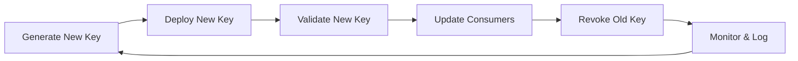
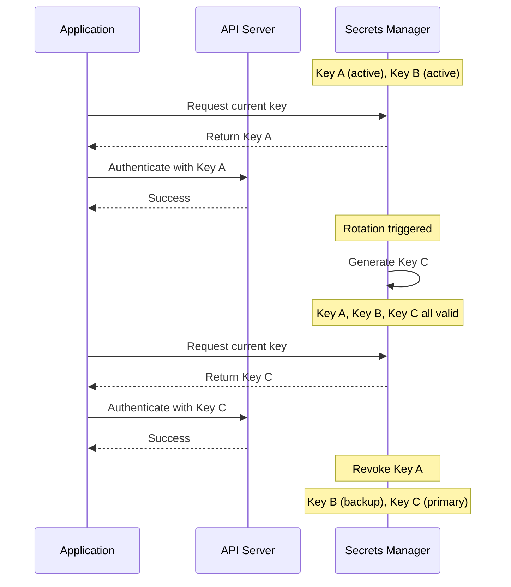
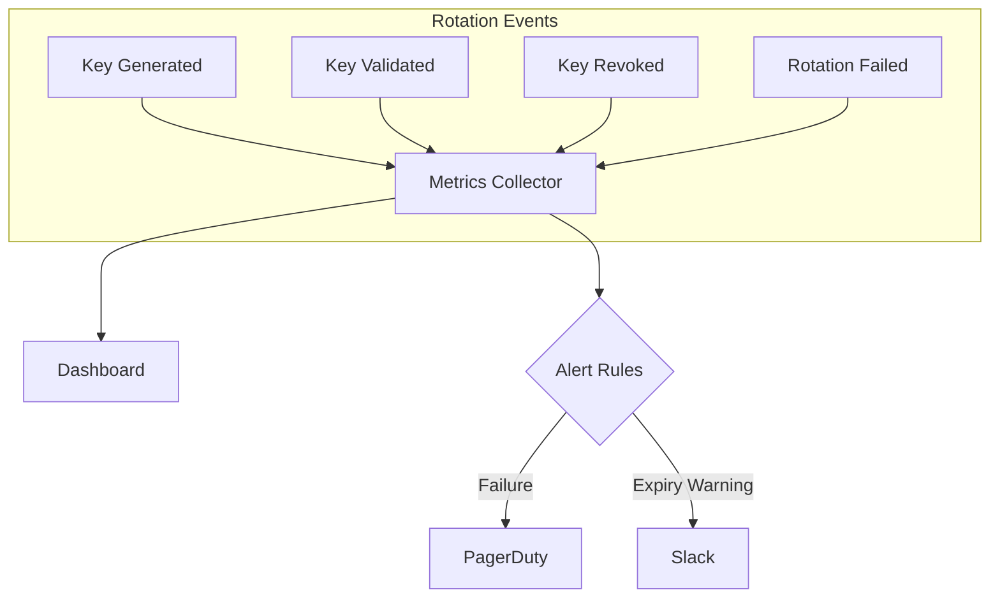

# How to Create API Key Rotation

Author: [nawazdhandala](https://github.com/nawazdhandala)

Tags: Security, API Keys, Rotation, Secrets Management

Description: Learn to create API key rotation for secure credential lifecycle management.

---

API keys are the silent workhorses of modern applications. They authenticate services, connect microservices, and grant access to third-party APIs. But like any credential, they become a liability if left unchanged. Attackers who obtain a stale key have unlimited time to exploit it. Regular rotation limits the window of exposure and forces good hygiene into your security practices.

## Why Rotate API Keys?

Static credentials are a ticking time bomb. Here is why rotation matters:

- **Limit blast radius**: A compromised key is only valid until the next rotation.
- **Compliance requirements**: PCI-DSS, SOC 2, and HIPAA mandate credential rotation.
- **Employee offboarding**: When team members leave, rotating keys ensures they lose access.
- **Audit trails**: Rotation creates natural checkpoints for security reviews.

## The Rotation Lifecycle

API key rotation follows a predictable pattern. The goal is to swap credentials without causing downtime for your services.



The critical insight is that both old and new keys must be valid simultaneously during the transition period. This overlap prevents service disruptions.

## Dual-Key Strategy

The safest approach uses two active keys at any time. When rotation occurs, you generate a third key, update consumers, then revoke the oldest key.



## Implementation: Node.js API Key Rotator

Here is a practical implementation that handles key generation, storage, and rotation. The code uses environment variables for configuration and supports multiple secret backends.

The main rotation class manages the key lifecycle and coordinates with your secrets storage.

```javascript
// api-key-rotator.js
const crypto = require('crypto');

class APIKeyRotator {
  constructor(options) {
    // Configuration for key length and rotation timing
    this.keyLength = options.keyLength || 32;
    this.rotationIntervalMs = options.rotationIntervalMs || 24 * 60 * 60 * 1000; // 24 hours
    this.overlapPeriodMs = options.overlapPeriodMs || 60 * 60 * 1000; // 1 hour overlap
    this.secretsBackend = options.secretsBackend;
    this.keys = new Map(); // keyId -> { key, createdAt, expiresAt, status }
  }

  // Generate a cryptographically secure API key
  generateKey() {
    const keyId = crypto.randomUUID();
    const key = crypto.randomBytes(this.keyLength).toString('base64url');
    const createdAt = Date.now();
    const expiresAt = createdAt + this.rotationIntervalMs + this.overlapPeriodMs;

    return { keyId, key, createdAt, expiresAt, status: 'active' };
  }

  // Perform rotation: create new key, mark old for expiration
  async rotate() {
    const newKeyData = this.generateKey();

    // Store new key in secrets backend
    await this.secretsBackend.store(newKeyData.keyId, newKeyData);
    this.keys.set(newKeyData.keyId, newKeyData);

    // Mark oldest active key for revocation after overlap period
    const oldestKey = this.getOldestActiveKey();
    if (oldestKey) {
      oldestKey.status = 'pending_revocation';
      oldestKey.revokeAt = Date.now() + this.overlapPeriodMs;
    }

    console.log(`Rotated API key. New key ID: ${newKeyData.keyId}`);
    return newKeyData;
  }

  // Find the oldest key that is still active
  getOldestActiveKey() {
    let oldest = null;
    for (const [, keyData] of this.keys) {
      if (keyData.status === 'active') {
        if (!oldest || keyData.createdAt < oldest.createdAt) {
          oldest = keyData;
        }
      }
    }
    return oldest;
  }

  // Validate an incoming API key
  validate(providedKey) {
    for (const [, keyData] of this.keys) {
      if (keyData.key === providedKey && keyData.status === 'active') {
        if (Date.now() < keyData.expiresAt) {
          return { valid: true, keyId: keyData.keyId };
        }
      }
    }
    return { valid: false, reason: 'invalid_or_expired' };
  }

  // Clean up expired and revoked keys
  async cleanup() {
    const now = Date.now();
    for (const [keyId, keyData] of this.keys) {
      if (keyData.status === 'pending_revocation' && now >= keyData.revokeAt) {
        keyData.status = 'revoked';
        await this.secretsBackend.revoke(keyId);
        this.keys.delete(keyId);
        console.log(`Revoked API key: ${keyId}`);
      }
    }
  }
}

module.exports = APIKeyRotator;
```

## Secrets Backend Integration

The rotator needs a backend to persist keys. Here is an adapter for HashiCorp Vault, which is common in production environments.

```javascript
// vault-backend.js
const vault = require('node-vault');

class VaultBackend {
  constructor(options) {
    this.client = vault({
      endpoint: options.endpoint || process.env.VAULT_ADDR,
      token: options.token || process.env.VAULT_TOKEN,
    });
    this.secretPath = options.secretPath || 'secret/data/api-keys';
  }

  // Store a new key in Vault
  async store(keyId, keyData) {
    await this.client.write(`${this.secretPath}/${keyId}`, {
      data: {
        key: keyData.key,
        createdAt: keyData.createdAt,
        expiresAt: keyData.expiresAt,
        status: keyData.status,
      },
    });
  }

  // Retrieve a key from Vault
  async retrieve(keyId) {
    const response = await this.client.read(`${this.secretPath}/${keyId}`);
    return response.data.data;
  }

  // Revoke a key by deleting it from Vault
  async revoke(keyId) {
    await this.client.delete(`${this.secretPath}/${keyId}`);
  }

  // List all stored key IDs
  async list() {
    const response = await this.client.list(this.secretPath);
    return response.data.keys || [];
  }
}

module.exports = VaultBackend;
```

## Automated Rotation with Cron

Set up automated rotation using a scheduler. This example runs daily and handles both rotation and cleanup.

```javascript
// rotation-scheduler.js
const cron = require('node-cron');
const APIKeyRotator = require('./api-key-rotator');
const VaultBackend = require('./vault-backend');

// Initialize the secrets backend
const backend = new VaultBackend({
  endpoint: process.env.VAULT_ADDR,
  token: process.env.VAULT_TOKEN,
  secretPath: 'secret/data/myapp/api-keys',
});

// Create the rotator with 24-hour rotation and 1-hour overlap
const rotator = new APIKeyRotator({
  keyLength: 32,
  rotationIntervalMs: 24 * 60 * 60 * 1000,
  overlapPeriodMs: 60 * 60 * 1000,
  secretsBackend: backend,
});

// Schedule rotation at midnight UTC every day
cron.schedule('0 0 * * *', async () => {
  console.log('Starting scheduled API key rotation');
  try {
    await rotator.rotate();
    await rotator.cleanup();
    console.log('Rotation completed successfully');
  } catch (error) {
    console.error('Rotation failed:', error);
    // Send alert to monitoring system
  }
});

// Run cleanup every hour to revoke expired keys
cron.schedule('0 * * * *', async () => {
  await rotator.cleanup();
});

console.log('API key rotation scheduler started');
```

## Consumer Update Pattern

Applications consuming your API need to fetch fresh keys. Here is a pattern that caches keys locally but refreshes them before expiration.

```javascript
// api-client.js
class APIClient {
  constructor(options) {
    this.secretsEndpoint = options.secretsEndpoint;
    this.cachedKey = null;
    this.cacheExpiresAt = 0;
    this.refreshBufferMs = 5 * 60 * 1000; // Refresh 5 minutes before expiry
  }

  // Get the current valid API key, refreshing if needed
  async getKey() {
    const now = Date.now();

    // Return cached key if still valid with buffer time
    if (this.cachedKey && now < this.cacheExpiresAt - this.refreshBufferMs) {
      return this.cachedKey;
    }

    // Fetch fresh key from secrets manager
    const response = await fetch(this.secretsEndpoint);
    const keyData = await response.json();

    this.cachedKey = keyData.key;
    this.cacheExpiresAt = keyData.expiresAt;

    return this.cachedKey;
  }

  // Make an authenticated API request
  async request(url, options = {}) {
    const key = await this.getKey();

    return fetch(url, {
      ...options,
      headers: {
        ...options.headers,
        'X-API-Key': key,
      },
    });
  }
}

module.exports = APIClient;
```

## Monitoring and Alerting

Track rotation events and failures. Integrate with your observability stack to catch issues before they cause outages.



Key metrics to track:

- **rotation_success_total**: Counter of successful rotations
- **rotation_failure_total**: Counter of failed rotations
- **active_keys_count**: Gauge of currently active keys
- **key_age_seconds**: Histogram of key ages
- **validation_failure_total**: Counter of rejected key validations

## Best Practices

1. **Never log keys**: Mask or omit API keys in log output. Log key IDs instead.

2. **Use short overlap periods**: The overlap window should be just long enough for consumers to update. Longer overlaps increase exposure risk.

3. **Test rotation in staging**: Run your rotation logic frequently in non-production environments to catch bugs.

4. **Implement graceful degradation**: If key retrieval fails, retry with exponential backoff before failing requests.

5. **Audit all access**: Log every key validation attempt with timestamp, source IP, and result.

6. **Separate keys by environment**: Never share keys between production, staging, and development.

7. **Rotate immediately after incidents**: If you suspect a key was compromised, trigger an immediate rotation outside the normal schedule.

## Handling Rotation Failures

When rotation fails, you need a recovery path. The system should continue operating with existing keys while alerting operators.

```javascript
async function safeRotate(rotator, maxRetries = 3) {
  for (let attempt = 1; attempt <= maxRetries; attempt++) {
    try {
      await rotator.rotate();
      return { success: true };
    } catch (error) {
      console.error(`Rotation attempt ${attempt} failed:`, error.message);

      if (attempt === maxRetries) {
        // Alert on-call engineer
        await sendAlert({
          severity: 'high',
          message: 'API key rotation failed after max retries',
          error: error.message,
        });
        return { success: false, error };
      }

      // Exponential backoff before retry
      await sleep(Math.pow(2, attempt) * 1000);
    }
  }
}
```

---

API key rotation is not optional for production systems. Implement it early, automate it completely, and monitor it continuously. The patterns shown here scale from small applications to enterprise deployments. Start with a simple rotation schedule, then add sophistication as your security requirements grow.
