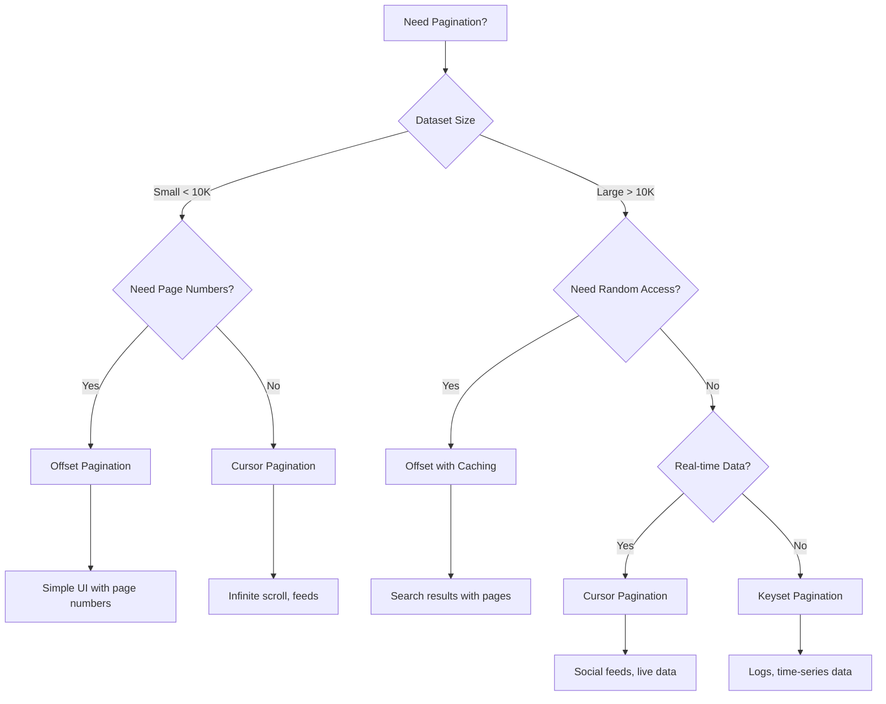

# How to Implement API Pagination Strategies

Author: [nawazdhandala](https://www.github.com/nawazdhandala)

Tags: API, Pagination, REST, Performance, Web Development

Description: Compare API pagination strategies including offset, cursor, keyset, and seek pagination with performance characteristics and implementation examples.

---

Every API that returns lists of data eventually needs pagination. Without it, a simple "get all users" endpoint becomes a time bomb waiting to bring down your server when your user base grows. The question is not whether to paginate, but which strategy fits your use case best.

This guide walks through the four main pagination approaches: offset-based, cursor-based, keyset, and seek pagination. Each has trade-offs worth understanding before you commit to one.

## Why Pagination Matters

Returning unbounded result sets creates problems across your entire stack:

- **Database load**: Full table scans and large result sets strain your database
- **Memory usage**: Your API server needs to hold all records in memory before sending
- **Network transfer**: Large payloads slow down response times and increase costs
- **Client performance**: Browsers and mobile apps struggle to render thousands of items

A well-designed pagination strategy keeps responses fast and predictable regardless of dataset size.

## Offset-Based Pagination

Offset pagination is the most intuitive approach. You specify how many records to skip (`offset`) and how many to return (`limit`).

Here is the basic SQL query pattern:

```sql
-- Fetch the third page of results (20 items per page)
SELECT id, name, email, created_at
FROM users
ORDER BY created_at DESC
LIMIT 20 OFFSET 40;
```

The API typically uses query parameters like `?page=3&limit=20` or `?offset=40&limit=20`.

Here is how you might implement this in a Node.js Express handler:

```javascript
// Offset-based pagination handler
// Simple to implement but has performance issues at scale
app.get('/api/users', async (req, res) => {
  // Parse pagination parameters with sensible defaults
  const page = parseInt(req.query.page) || 1;
  const limit = Math.min(parseInt(req.query.limit) || 20, 100); // Cap at 100
  const offset = (page - 1) * limit;

  // Execute paginated query
  const users = await db.query(
    'SELECT id, name, email FROM users ORDER BY id LIMIT $1 OFFSET $2',
    [limit, offset]
  );

  // Get total count for pagination metadata
  const countResult = await db.query('SELECT COUNT(*) FROM users');
  const totalItems = parseInt(countResult.rows[0].count);
  const totalPages = Math.ceil(totalItems / limit);

  res.json({
    data: users.rows,
    pagination: {
      page,
      limit,
      totalItems,
      totalPages,
      hasNextPage: page < totalPages,
      hasPrevPage: page > 1
    }
  });
});
```

**Pros:**
- Easy to understand and implement
- Clients can jump to any page directly
- Works well with traditional page number interfaces

**Cons:**
- Performance degrades as offset increases (database still scans skipped rows)
- Results can shift when items are inserted or deleted mid-pagination
- `COUNT(*)` for total pages adds overhead on large tables

## Cursor-Based Pagination

Cursor pagination uses an opaque token that points to a specific position in the result set. Instead of "give me page 3," clients say "give me items after this cursor."

The cursor typically encodes the last seen value of the sort field. For a simple ID-based cursor:

```javascript
// Cursor-based pagination implementation
// Better performance and consistency for large datasets
app.get('/api/users', async (req, res) => {
  const limit = Math.min(parseInt(req.query.limit) || 20, 100);

  // Decode cursor (base64-encoded JSON with last seen ID)
  let cursor = null;
  if (req.query.cursor) {
    try {
      cursor = JSON.parse(Buffer.from(req.query.cursor, 'base64').toString());
    } catch (e) {
      return res.status(400).json({ error: 'Invalid cursor' });
    }
  }

  // Build query based on cursor presence
  // Fetch one extra record to determine if there are more results
  let query, params;
  if (cursor) {
    query = `
      SELECT id, name, email, created_at
      FROM users
      WHERE id > $1
      ORDER BY id
      LIMIT $2
    `;
    params = [cursor.id, limit + 1];
  } else {
    query = 'SELECT id, name, email, created_at FROM users ORDER BY id LIMIT $1';
    params = [limit + 1];
  }

  const result = await db.query(query, params);

  // Check if there are more results
  const hasMore = result.rows.length > limit;
  const users = hasMore ? result.rows.slice(0, -1) : result.rows;

  // Generate next cursor from last item
  const nextCursor = hasMore
    ? Buffer.from(JSON.stringify({ id: users[users.length - 1].id })).toString('base64')
    : null;

  res.json({
    data: users,
    pagination: {
      nextCursor,
      hasMore
    }
  });
});
```

**Pros:**
- Consistent performance regardless of position in dataset
- Handles insertions and deletions gracefully
- No skipped or duplicated items when data changes

**Cons:**
- Cannot jump to arbitrary pages
- More complex cursor encoding and decoding
- Requires stable sort order

## Keyset Pagination

Keyset pagination is a specific form of cursor pagination that uses the actual column values instead of an opaque token. It leverages database indexes directly.

```sql
-- Keyset pagination using composite sort fields
-- Efficient because it uses index seeks instead of offset scans
SELECT id, name, email, created_at
FROM users
WHERE (created_at, id) < ('2026-01-15 10:30:00', 12345)
ORDER BY created_at DESC, id DESC
LIMIT 20;
```

Here is a more complete implementation handling multiple sort fields:

```python
# Keyset pagination in Python with SQLAlchemy
# Uses tuple comparison for efficient index-based filtering
from flask import Flask, request, jsonify
from sqlalchemy import and_, or_, tuple_

app = Flask(__name__)

@app.route('/api/articles')
def list_articles():
    limit = min(int(request.args.get('limit', 20)), 100)

    # Parse keyset parameters (last seen values)
    after_date = request.args.get('after_date')
    after_id = request.args.get('after_id')

    query = Article.query.order_by(
        Article.published_at.desc(),
        Article.id.desc()  # Tiebreaker for same timestamp
    )

    # Apply keyset filter if continuing from previous page
    if after_date and after_id:
        # Tuple comparison handles the multi-column ordering correctly
        query = query.filter(
            or_(
                Article.published_at < after_date,
                and_(
                    Article.published_at == after_date,
                    Article.id < int(after_id)
                )
            )
        )

    # Fetch one extra to check for more pages
    articles = query.limit(limit + 1).all()
    has_more = len(articles) > limit

    if has_more:
        articles = articles[:limit]

    # Build response with keyset values for next page
    result = {
        'data': [a.to_dict() for a in articles],
        'pagination': {
            'hasMore': has_more
        }
    }

    if has_more and articles:
        last = articles[-1]
        result['pagination']['nextKey'] = {
            'after_date': last.published_at.isoformat(),
            'after_id': last.id
        }

    return jsonify(result)
```

**Pros:**
- Optimal database performance with proper indexing
- Values are human-readable for debugging
- Easy to bookmark or share specific positions

**Cons:**
- Exposes internal data structure
- Sort field values must be unique (or use a tiebreaker)
- Changing sort order requires different keyset fields

## Seek Pagination

Seek pagination combines offset-like semantics with keyset efficiency. It uses a "seek" position based on a unique identifier while still supporting page-like navigation.

```go
// Seek pagination in Go
// Combines keyset efficiency with approximate page positioning
type SeekRequest struct {
    SeekID    *int64 `json:"seek_id"`    // ID to seek after
    Direction string `json:"direction"`  // "forward" or "backward"
    Limit     int    `json:"limit"`
}

type SeekResponse struct {
    Data       []User     `json:"data"`
    FirstID    int64      `json:"first_id"`
    LastID     int64      `json:"last_id"`
    HasMore    bool       `json:"has_more"`
    TotalCount int64      `json:"total_count"` // Optional, cached
}

func (h *Handler) ListUsers(w http.ResponseWriter, r *http.Request) {
    // Parse seek parameters
    limit := 20
    if l := r.URL.Query().Get("limit"); l != "" {
        limit = min(parseInt(l), 100)
    }

    var seekID *int64
    if s := r.URL.Query().Get("seek_after"); s != "" {
        id := parseInt(s)
        seekID = &id
    }

    // Build query with seek condition
    query := `
        SELECT id, name, email
        FROM users
        WHERE ($1::bigint IS NULL OR id > $1)
        ORDER BY id
        LIMIT $2
    `

    rows, err := h.db.Query(query, seekID, limit+1)
    if err != nil {
        http.Error(w, err.Error(), 500)
        return
    }
    defer rows.Close()

    users := make([]User, 0, limit)
    for rows.Next() {
        var u User
        rows.Scan(&u.ID, &u.Name, &u.Email)
        users = append(users, u)
    }

    // Check for more results and trim
    hasMore := len(users) > limit
    if hasMore {
        users = users[:limit]
    }

    resp := SeekResponse{
        Data:    users,
        HasMore: hasMore,
    }

    if len(users) > 0 {
        resp.FirstID = users[0].ID
        resp.LastID = users[len(users)-1].ID
    }

    json.NewEncoder(w).Encode(resp)
}
```

## Choosing the Right Strategy

The following diagram shows how to select a pagination strategy based on your requirements:



Here is a quick reference for common use cases:

| Use Case | Recommended Strategy | Reason |
|----------|---------------------|--------|
| Admin dashboard with small dataset | Offset | Simple, page numbers work fine |
| Social media feed | Cursor | Handles real-time insertions |
| Log viewer | Keyset (timestamp) | Time-based navigation is natural |
| Search results | Offset with caching | Users expect page numbers |
| Mobile infinite scroll | Cursor | Memory efficient, no page jumps |
| Audit trail | Keyset | Chronological, immutable data |

## Performance Comparison

Testing with a 10 million row table shows the performance difference clearly:

| Strategy | Page 1 | Page 100 | Page 10000 |
|----------|--------|----------|------------|
| Offset | 2ms | 45ms | 4500ms |
| Cursor | 2ms | 2ms | 2ms |
| Keyset | 2ms | 2ms | 2ms |

The offset performance degrades linearly because the database must scan and discard all skipped rows. Cursor and keyset maintain constant time regardless of position.

## Wrapping Up

Start with offset pagination if your dataset is small and users need page numbers. Switch to cursor or keyset pagination when performance becomes a concern or when dealing with frequently changing data. The extra implementation complexity pays off in better user experience and lower server load.

Whatever strategy you choose, always include pagination metadata in your responses so clients know what to request next. And remember to add proper indexes on your sort columns - even the best pagination strategy cannot fix a missing index.
