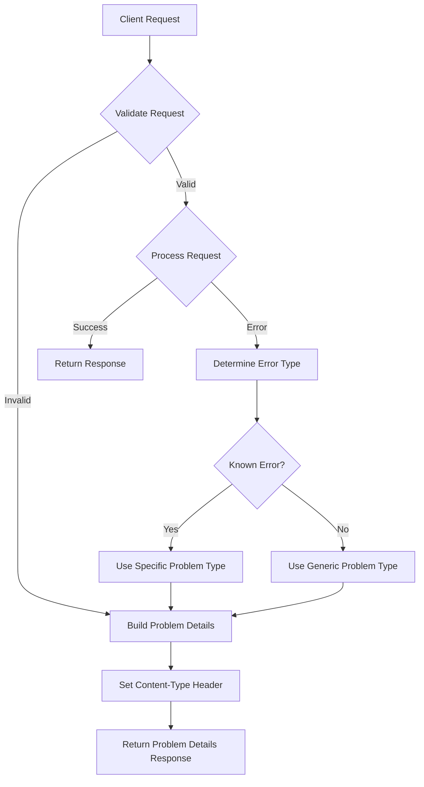
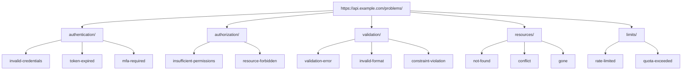
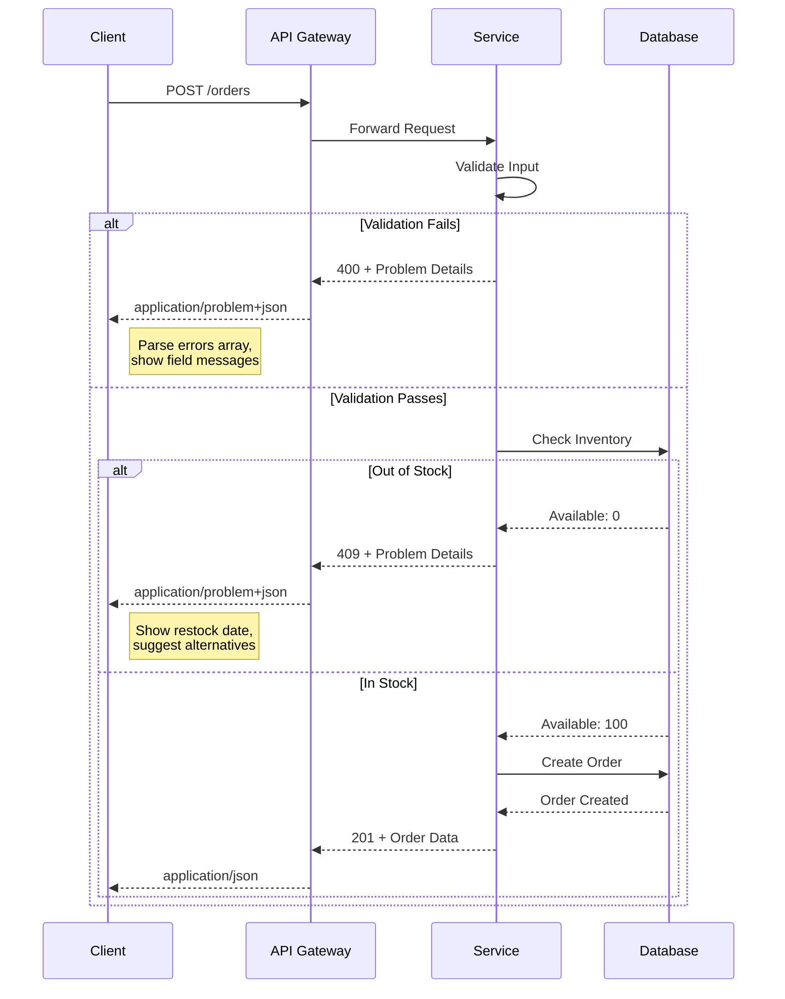

# How to Build API Problem Details

Author: [nawazdhandala](https://github.com/nawazdhandala)

Tags: API, Error Handling, RFC 7807, REST

Description: A practical guide to implementing RFC 7807/9457 Problem Details for standardized, machine-readable API error responses.

---

When your API returns an error, the client needs to know what went wrong, why it happened, and what to do about it. Most APIs return inconsistent error formats that force developers to write custom parsing logic for every endpoint. RFC 7807 (and its successor RFC 9457) solve this with a standardized error format called Problem Details.

## What Are Problem Details?

Problem Details is a specification for HTTP APIs to communicate errors in a consistent, machine-readable format. Instead of inventing your own error schema for each API, you use a standard structure that any client can understand.

A basic Problem Details response looks like this:

```json
HTTP/1.1 404 Not Found
Content-Type: application/problem+json

{
  "type": "https://api.example.com/problems/resource-not-found",
  "title": "Resource Not Found",
  "status": 404,
  "detail": "User with ID 12345 does not exist",
  "instance": "/users/12345"
}
```

The content type `application/problem+json` tells clients this is a Problem Details response, not a regular JSON payload.

## Core Fields

RFC 9457 defines five standard members:

| Field | Type | Required | Purpose |
|-------|------|----------|---------|
| `type` | URI | No* | Identifies the problem type |
| `title` | string | No | Short, human-readable summary |
| `status` | integer | No | HTTP status code |
| `detail` | string | No | Human-readable explanation specific to this occurrence |
| `instance` | URI | No | URI reference identifying this specific problem |

*If `type` is omitted, it defaults to `about:blank`, meaning the problem has no additional semantics beyond the HTTP status code.

## The Problem Type URI

The `type` field is the most important part. It serves as a unique identifier for the problem category and should point to documentation explaining the error.

```json
{
  "type": "https://api.example.com/problems/insufficient-balance",
  "title": "Insufficient Balance",
  "status": 402,
  "detail": "Your account balance of $10.50 is less than the required $25.00",
  "instance": "/transactions/tx-789"
}
```

The URI doesn't need to be resolvable, but making it point to actual documentation helps developers understand and fix issues.

## Error Handling Flow

Here's how Problem Details fit into your API error handling:



## Basic Implementation

Here's a Node.js implementation:

```typescript
// types/problem-details.ts
interface ProblemDetails {
  type: string;
  title: string;
  status: number;
  detail?: string;
  instance?: string;
  [key: string]: unknown; // Allow extensions
}

// problems/registry.ts
const PROBLEM_TYPES = {
  VALIDATION_ERROR: {
    type: 'https://api.example.com/problems/validation-error',
    title: 'Validation Error',
    status: 400,
  },
  RESOURCE_NOT_FOUND: {
    type: 'https://api.example.com/problems/resource-not-found',
    title: 'Resource Not Found',
    status: 404,
  },
  INSUFFICIENT_PERMISSIONS: {
    type: 'https://api.example.com/problems/insufficient-permissions',
    title: 'Insufficient Permissions',
    status: 403,
  },
  RATE_LIMITED: {
    type: 'https://api.example.com/problems/rate-limited',
    title: 'Rate Limit Exceeded',
    status: 429,
  },
  INTERNAL_ERROR: {
    type: 'https://api.example.com/problems/internal-error',
    title: 'Internal Server Error',
    status: 500,
  },
} as const;

// problems/builder.ts
function createProblem(
  problemType: keyof typeof PROBLEM_TYPES,
  options: {
    detail?: string;
    instance?: string;
    extensions?: Record<string, unknown>;
  } = {}
): ProblemDetails {
  const base = PROBLEM_TYPES[problemType];

  return {
    type: base.type,
    title: base.title,
    status: base.status,
    ...(options.detail && { detail: options.detail }),
    ...(options.instance && { instance: options.instance }),
    ...options.extensions,
  };
}
```

## Express Middleware

```typescript
// middleware/problem-details.ts
import { Request, Response, NextFunction } from 'express';

class ApiError extends Error {
  constructor(
    public problemType: keyof typeof PROBLEM_TYPES,
    public detail?: string,
    public extensions?: Record<string, unknown>
  ) {
    super(detail || PROBLEM_TYPES[problemType].title);
    this.name = 'ApiError';
  }
}

function problemDetailsMiddleware(
  err: Error,
  req: Request,
  res: Response,
  next: NextFunction
) {
  // Skip if response already started
  if (res.headersSent) {
    return next(err);
  }

  let problem: ProblemDetails;

  if (err instanceof ApiError) {
    problem = createProblem(err.problemType, {
      detail: err.detail,
      instance: req.originalUrl,
      extensions: err.extensions,
    });
  } else {
    // Unknown error - return generic problem
    problem = createProblem('INTERNAL_ERROR', {
      detail: process.env.NODE_ENV === 'development'
        ? err.message
        : 'An unexpected error occurred',
      instance: req.originalUrl,
    });

    // Log the actual error for debugging
    console.error('Unhandled error:', err);
  }

  res
    .status(problem.status)
    .type('application/problem+json')
    .json(problem);
}

export { ApiError, problemDetailsMiddleware };
```

## Validation Errors with Extensions

Problem Details supports custom extension members for domain-specific information. Validation errors are a perfect use case:

```typescript
// Validation error with field-level details
function createValidationProblem(
  errors: Array<{ field: string; message: string; code: string }>
): ProblemDetails {
  return createProblem('VALIDATION_ERROR', {
    detail: `${errors.length} validation error(s) occurred`,
    extensions: {
      errors: errors.map(err => ({
        field: err.field,
        message: err.message,
        code: err.code,
      })),
    },
  });
}

// Usage
app.post('/users', (req, res, next) => {
  const errors = [];

  if (!req.body.email) {
    errors.push({
      field: 'email',
      message: 'Email is required',
      code: 'REQUIRED',
    });
  } else if (!isValidEmail(req.body.email)) {
    errors.push({
      field: 'email',
      message: 'Email format is invalid',
      code: 'INVALID_FORMAT',
    });
  }

  if (req.body.password && req.body.password.length < 8) {
    errors.push({
      field: 'password',
      message: 'Password must be at least 8 characters',
      code: 'MIN_LENGTH',
    });
  }

  if (errors.length > 0) {
    const problem = createValidationProblem(errors);
    return res
      .status(problem.status)
      .type('application/problem+json')
      .json(problem);
  }

  // Continue processing...
});
```

Response:

```json
HTTP/1.1 400 Bad Request
Content-Type: application/problem+json

{
  "type": "https://api.example.com/problems/validation-error",
  "title": "Validation Error",
  "status": 400,
  "detail": "2 validation error(s) occurred",
  "errors": [
    {
      "field": "email",
      "message": "Email format is invalid",
      "code": "INVALID_FORMAT"
    },
    {
      "field": "password",
      "message": "Password must be at least 8 characters",
      "code": "MIN_LENGTH"
    }
  ]
}
```

## Problem Type URIs in Practice

Your problem type URIs should form a hierarchy that makes sense for your domain:



## Business Logic Errors

For domain-specific errors, use meaningful problem types with relevant extensions:

```typescript
// Payment processing error
const paymentProblem: ProblemDetails = {
  type: 'https://api.example.com/problems/payment/insufficient-funds',
  title: 'Insufficient Funds',
  status: 402,
  detail: 'Your account balance is insufficient for this transaction',
  instance: '/orders/ord-456/payment',
  balance: 50.00,
  required: 75.50,
  currency: 'USD',
};

// Inventory error
const inventoryProblem: ProblemDetails = {
  type: 'https://api.example.com/problems/inventory/out-of-stock',
  title: 'Item Out of Stock',
  status: 409,
  detail: 'The requested quantity is not available',
  instance: '/orders/ord-789',
  productId: 'SKU-12345',
  requested: 10,
  available: 3,
  restockDate: '2026-02-15',
};

// Rate limiting error
const rateLimitProblem: ProblemDetails = {
  type: 'https://api.example.com/problems/limits/rate-limited',
  title: 'Rate Limit Exceeded',
  status: 429,
  detail: 'You have exceeded the rate limit for this endpoint',
  instance: '/api/search',
  limit: 100,
  remaining: 0,
  resetAt: '2026-01-30T14:30:00Z',
};
```

## Client-Side Handling

Clients can handle Problem Details responses programmatically:

```typescript
// client/api-client.ts
async function apiRequest<T>(url: string, options?: RequestInit): Promise<T> {
  const response = await fetch(url, options);

  if (!response.ok) {
    const contentType = response.headers.get('content-type');

    if (contentType?.includes('application/problem+json')) {
      const problem: ProblemDetails = await response.json();
      throw new ApiProblemError(problem);
    }

    // Fallback for non-Problem Details errors
    throw new Error(`HTTP ${response.status}: ${response.statusText}`);
  }

  return response.json();
}

class ApiProblemError extends Error {
  constructor(public problem: ProblemDetails) {
    super(problem.detail || problem.title);
    this.name = 'ApiProblemError';
  }

  get type(): string {
    return this.problem.type;
  }

  get status(): number {
    return this.problem.status;
  }

  isValidationError(): boolean {
    return this.problem.type.includes('/validation');
  }

  isAuthError(): boolean {
    return this.problem.type.includes('/authentication');
  }

  isRateLimited(): boolean {
    return this.problem.status === 429;
  }
}

// Usage
try {
  const user = await apiRequest('/users/123');
} catch (err) {
  if (err instanceof ApiProblemError) {
    if (err.isValidationError()) {
      // Show field-specific errors to user
      const fieldErrors = err.problem.errors as Array<{field: string; message: string}>;
      fieldErrors.forEach(e => showFieldError(e.field, e.message));
    } else if (err.isRateLimited()) {
      const resetAt = err.problem.resetAt as string;
      showRetryMessage(resetAt);
    } else {
      showGenericError(err.problem.title);
    }
  }
}
```

## Integration Flow

Here's how Problem Details integrate into a typical request lifecycle:



## Python Implementation

```python
# problem_details.py
from dataclasses import dataclass, field, asdict
from typing import Optional, Any
from flask import jsonify, Response

@dataclass
class ProblemDetails:
    type: str
    title: str
    status: int
    detail: Optional[str] = None
    instance: Optional[str] = None
    extensions: dict = field(default_factory=dict)

    def to_dict(self) -> dict:
        result = {
            'type': self.type,
            'title': self.title,
            'status': self.status,
        }
        if self.detail:
            result['detail'] = self.detail
        if self.instance:
            result['instance'] = self.instance
        result.update(self.extensions)
        return result

    def to_response(self) -> Response:
        response = jsonify(self.to_dict())
        response.status_code = self.status
        response.content_type = 'application/problem+json'
        return response

# Problem type registry
class Problems:
    BASE_URI = 'https://api.example.com/problems'

    @classmethod
    def validation_error(cls, detail: str, errors: list) -> ProblemDetails:
        return ProblemDetails(
            type=f'{cls.BASE_URI}/validation-error',
            title='Validation Error',
            status=400,
            detail=detail,
            extensions={'errors': errors}
        )

    @classmethod
    def not_found(cls, resource: str, id: str) -> ProblemDetails:
        return ProblemDetails(
            type=f'{cls.BASE_URI}/resource-not-found',
            title='Resource Not Found',
            status=404,
            detail=f'{resource} with ID {id} does not exist'
        )

    @classmethod
    def rate_limited(cls, limit: int, reset_at: str) -> ProblemDetails:
        return ProblemDetails(
            type=f'{cls.BASE_URI}/rate-limited',
            title='Rate Limit Exceeded',
            status=429,
            detail='Too many requests',
            extensions={
                'limit': limit,
                'remaining': 0,
                'resetAt': reset_at
            }
        )

# Flask usage
from flask import Flask, request

app = Flask(__name__)

@app.errorhandler(Exception)
def handle_error(error):
    if isinstance(error, ValidationError):
        problem = Problems.validation_error(
            str(error),
            error.errors
        )
    elif isinstance(error, NotFoundError):
        problem = Problems.not_found(
            error.resource,
            error.resource_id
        )
    else:
        problem = ProblemDetails(
            type='https://api.example.com/problems/internal-error',
            title='Internal Server Error',
            status=500,
            detail='An unexpected error occurred'
        )

    return problem.to_response()
```

## Documenting Problem Types

Each problem type should have documentation at its URI. Here's a simple approach using a documentation endpoint:

```typescript
// routes/problems.ts
const problemDocs: Record<string, { description: string; resolution: string }> = {
  'validation-error': {
    description: 'The request body contains invalid data that failed validation.',
    resolution: 'Check the "errors" array for specific field issues and correct them.',
  },
  'resource-not-found': {
    description: 'The requested resource does not exist or has been deleted.',
    resolution: 'Verify the resource ID is correct. The resource may have been removed.',
  },
  'rate-limited': {
    description: 'You have exceeded the allowed number of requests.',
    resolution: 'Wait until the "resetAt" time before making more requests.',
  },
};

app.get('/problems/:type', (req, res) => {
  const doc = problemDocs[req.params.type];

  if (!doc) {
    return res.status(404).json({ error: 'Problem type not found' });
  }

  res.json({
    type: `https://api.example.com/problems/${req.params.type}`,
    ...doc,
  });
});
```

## Best Practices

1. **Use specific problem types** for errors clients need to handle programmatically
2. **Include actionable details** in the `detail` field
3. **Add extension members** for machine-readable context (like `errors` for validation)
4. **Document all problem types** at their URIs
5. **Keep titles stable** since clients may use them for display
6. **Set the correct Content-Type** header (`application/problem+json`)
7. **Match the status field** to the HTTP status code
8. **Use instance URIs** to identify specific occurrences for debugging

## Common Mistakes to Avoid

| Mistake | Problem | Fix |
|---------|---------|-----|
| Generic types for everything | Clients cannot differentiate errors | Create specific problem types |
| Missing Content-Type header | Clients parse as regular JSON | Always set `application/problem+json` |
| Exposing stack traces | Security risk, noise for clients | Log internally, return clean messages |
| Inconsistent type URIs | Hard to match error patterns | Use a central registry |
| Putting user instructions in `detail` | Mixing concerns | Use extensions for user messages |

## Testing Problem Details

```typescript
// test/problem-details.test.ts
describe('Problem Details', () => {
  it('should return validation errors with correct format', async () => {
    const response = await request(app)
      .post('/users')
      .send({ email: 'invalid' });

    expect(response.status).toBe(400);
    expect(response.headers['content-type']).toMatch(/application\/problem\+json/);
    expect(response.body).toMatchObject({
      type: 'https://api.example.com/problems/validation-error',
      title: 'Validation Error',
      status: 400,
    });
    expect(response.body.errors).toBeInstanceOf(Array);
    expect(response.body.errors[0]).toHaveProperty('field');
    expect(response.body.errors[0]).toHaveProperty('message');
  });

  it('should include instance URI for debugging', async () => {
    const response = await request(app)
      .get('/users/nonexistent');

    expect(response.status).toBe(404);
    expect(response.body.instance).toBe('/users/nonexistent');
  });

  it('should handle unknown errors gracefully', async () => {
    const response = await request(app)
      .get('/trigger-error');

    expect(response.status).toBe(500);
    expect(response.body.type).toContain('internal-error');
    expect(response.body.detail).not.toContain('stack');
  });
});
```

## Summary

Problem Details give your API a consistent error format that clients can rely on. Instead of guessing what shape errors will take, clients know they'll get a standard structure with `type`, `title`, `status`, and `detail`. Extensions let you add domain-specific context like validation errors or rate limit resets.

The key points:

- Use `application/problem+json` content type
- Define meaningful problem type URIs
- Include actionable details in the `detail` field
- Add extensions for machine-readable context
- Document all problem types

RFC 9457 builds on RFC 7807 and is the current standard. Most of the structure is identical, so existing implementations remain compatible.

For more on building reliable APIs, see our posts on [graceful shutdown handling](https://oneuptime.com/blog/post/2026-01-06-nodejs-graceful-shutdown-handler/view) and [health checks for Kubernetes](https://oneuptime.com/blog/post/2026-01-06-nodejs-health-checks-kubernetes/view).
