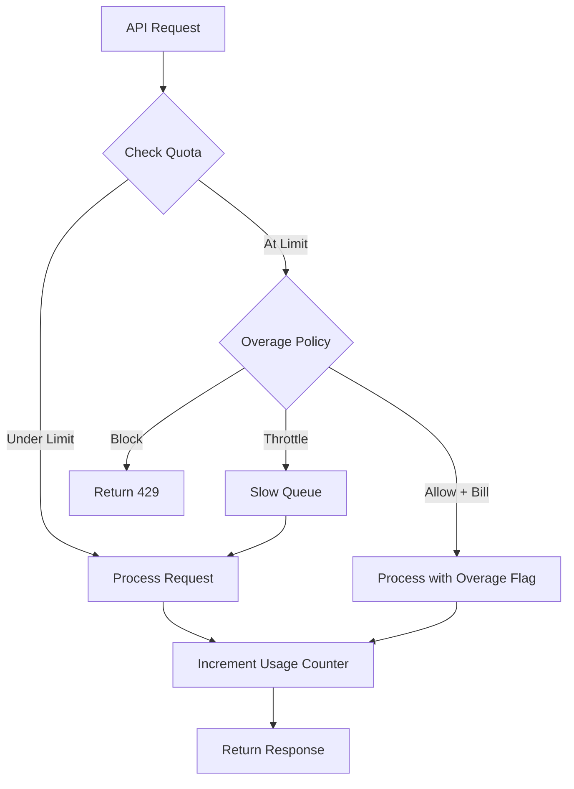
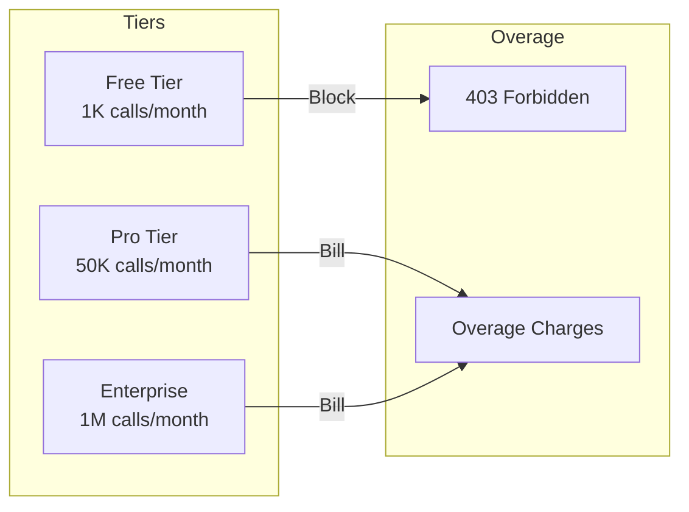
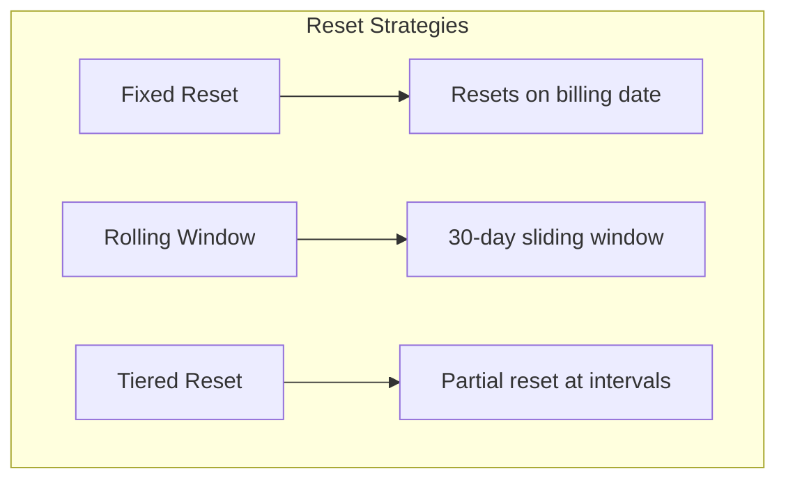
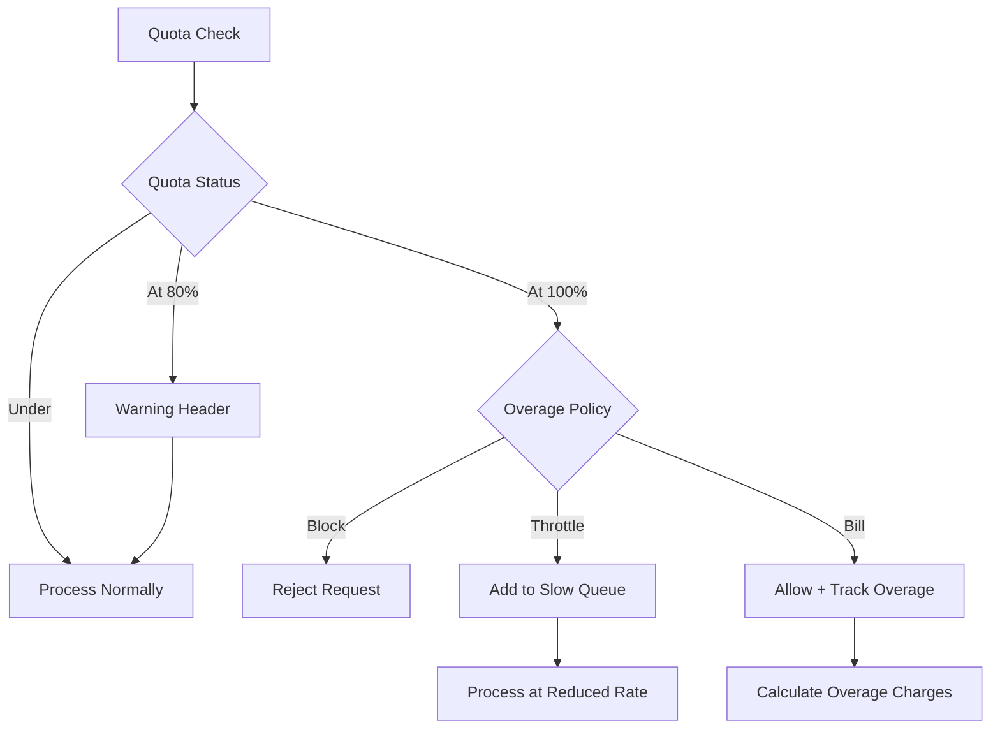

# How to Create API Quota Management

Author: [nawazdhandala](https://github.com/nawazdhandala)

Tags: API, Quota, Rate Limiting, Management

Description: Build robust API quota management systems with usage tiers, quota tracking, reset mechanisms, and overage handling.

---

API quota management goes beyond simple rate limiting. While rate limiting protects against bursts, quota management tracks cumulative usage over billing periods, enforces plan limits, and handles overage scenarios. This guide covers implementing a complete quota management system from scratch.

## Quota Management vs Rate Limiting

| Feature | Rate Limiting | Quota Management |
|---------|--------------|------------------|
| Time window | Seconds to minutes | Hours to months |
| Purpose | Prevent abuse | Enforce plan limits |
| Reset | Rolling or fixed short windows | Billing cycle aligned |
| Tracking | Per-second/minute counters | Cumulative usage |
| Overage | Block or delay | Bill, throttle, or block |

## Quota Tracking Flow



## Core Data Model

Design your quota storage to track usage efficiently:

```typescript
interface QuotaPlan {
  id: string;
  name: string;               // "Free", "Pro", "Enterprise"
  limits: QuotaLimits;
  overagePolicy: OveragePolicy;
  resetPeriod: ResetPeriod;
}

interface QuotaLimits {
  apiCalls: number;           // Total API calls per period
  bandwidth: number;          // Bytes transferred
  computeUnits: number;       // CPU-intensive operation credits
  storage: number;            // Bytes stored
}

interface QuotaUsage {
  tenantId: string;
  periodStart: Date;
  periodEnd: Date;
  usage: {
    apiCalls: number;
    bandwidth: number;
    computeUnits: number;
    storage: number;
  };
  overage: {
    apiCalls: number;
    bandwidth: number;
    computeUnits: number;
  };
}

type OveragePolicy = 'block' | 'throttle' | 'allow_and_bill';
type ResetPeriod = 'hourly' | 'daily' | 'weekly' | 'monthly';
```

## Implementing the Quota Manager

```typescript
import { createClient, RedisClientType } from 'redis';

interface QuotaCheckResult {
  allowed: boolean;
  remaining: number;
  limit: number;
  resetAt: Date;
  isOverage: boolean;
  overageUnits: number;
}

class QuotaManager {
  private redis: RedisClientType;
  private plans: Map<string, QuotaPlan>;

  constructor(redisUrl: string) {
    this.redis = createClient({ url: redisUrl });
    this.plans = new Map();
  }

  async initialize(): Promise<void> {
    await this.redis.connect();
    await this.loadPlans();
  }

  private async loadPlans(): Promise<void> {
    // Load from database or config
    this.plans.set('free', {
      id: 'free',
      name: 'Free',
      limits: {
        apiCalls: 1000,
        bandwidth: 100 * 1024 * 1024,    // 100MB
        computeUnits: 100,
        storage: 50 * 1024 * 1024,       // 50MB
      },
      overagePolicy: 'block',
      resetPeriod: 'monthly',
    });

    this.plans.set('pro', {
      id: 'pro',
      name: 'Pro',
      limits: {
        apiCalls: 50000,
        bandwidth: 10 * 1024 * 1024 * 1024,  // 10GB
        computeUnits: 5000,
        storage: 5 * 1024 * 1024 * 1024,     // 5GB
      },
      overagePolicy: 'allow_and_bill',
      resetPeriod: 'monthly',
    });

    this.plans.set('enterprise', {
      id: 'enterprise',
      name: 'Enterprise',
      limits: {
        apiCalls: 1000000,
        bandwidth: 100 * 1024 * 1024 * 1024, // 100GB
        computeUnits: 100000,
        storage: 100 * 1024 * 1024 * 1024,   // 100GB
      },
      overagePolicy: 'allow_and_bill',
      resetPeriod: 'monthly',
    });
  }

  private getPeriodKey(tenantId: string, metric: string): string {
    const now = new Date();
    const year = now.getFullYear();
    const month = String(now.getMonth() + 1).padStart(2, '0');
    return `quota:${tenantId}:${year}-${month}:${metric}`;
  }

  private getPeriodBounds(resetPeriod: ResetPeriod): { start: Date; end: Date } {
    const now = new Date();
    let start: Date;
    let end: Date;

    switch (resetPeriod) {
      case 'hourly':
        start = new Date(now.getFullYear(), now.getMonth(), now.getDate(), now.getHours());
        end = new Date(start.getTime() + 60 * 60 * 1000);
        break;
      case 'daily':
        start = new Date(now.getFullYear(), now.getMonth(), now.getDate());
        end = new Date(start.getTime() + 24 * 60 * 60 * 1000);
        break;
      case 'weekly':
        const dayOfWeek = now.getDay();
        start = new Date(now.getFullYear(), now.getMonth(), now.getDate() - dayOfWeek);
        end = new Date(start.getTime() + 7 * 24 * 60 * 60 * 1000);
        break;
      case 'monthly':
      default:
        start = new Date(now.getFullYear(), now.getMonth(), 1);
        end = new Date(now.getFullYear(), now.getMonth() + 1, 1);
        break;
    }

    return { start, end };
  }

  async checkQuota(
    tenantId: string,
    planId: string,
    metric: keyof QuotaLimits,
    units: number = 1
  ): Promise<QuotaCheckResult> {
    const plan = this.plans.get(planId);
    if (!plan) {
      throw new Error(`Unknown plan: ${planId}`);
    }

    const limit = plan.limits[metric];
    const key = this.getPeriodKey(tenantId, metric);
    const { end } = this.getPeriodBounds(plan.resetPeriod);

    // Get current usage
    const currentUsage = await this.redis.get(key);
    const usage = currentUsage ? parseInt(currentUsage, 10) : 0;

    const remaining = Math.max(0, limit - usage);
    const wouldExceed = usage + units > limit;

    if (wouldExceed) {
      if (plan.overagePolicy === 'block') {
        return {
          allowed: false,
          remaining,
          limit,
          resetAt: end,
          isOverage: false,
          overageUnits: 0,
        };
      }

      // Allow with overage tracking
      const overageUnits = Math.max(0, usage + units - limit);
      return {
        allowed: true,
        remaining: 0,
        limit,
        resetAt: end,
        isOverage: true,
        overageUnits,
      };
    }

    return {
      allowed: true,
      remaining: remaining - units,
      limit,
      resetAt: end,
      isOverage: false,
      overageUnits: 0,
    };
  }

  async consumeQuota(
    tenantId: string,
    planId: string,
    metric: keyof QuotaLimits,
    units: number = 1
  ): Promise<QuotaCheckResult> {
    const plan = this.plans.get(planId);
    if (!plan) {
      throw new Error(`Unknown plan: ${planId}`);
    }

    const key = this.getPeriodKey(tenantId, metric);
    const { end } = this.getPeriodBounds(plan.resetPeriod);
    const ttlSeconds = Math.ceil((end.getTime() - Date.now()) / 1000);

    // Atomic increment and get
    const newUsage = await this.redis.incrBy(key, units);

    // Set expiry on first write
    if (newUsage === units) {
      await this.redis.expire(key, ttlSeconds);
    }

    const limit = plan.limits[metric];
    const remaining = Math.max(0, limit - newUsage);
    const isOverage = newUsage > limit;
    const overageUnits = isOverage ? newUsage - limit : 0;

    // Track overage separately for billing
    if (isOverage && plan.overagePolicy === 'allow_and_bill') {
      const overageKey = `${key}:overage`;
      await this.redis.incrBy(overageKey, units);
      await this.redis.expire(overageKey, ttlSeconds);
    }

    return {
      allowed: !isOverage || plan.overagePolicy !== 'block',
      remaining,
      limit,
      resetAt: end,
      isOverage,
      overageUnits,
    };
  }

  async getUsage(tenantId: string, planId: string): Promise<QuotaUsage> {
    const plan = this.plans.get(planId);
    if (!plan) {
      throw new Error(`Unknown plan: ${planId}`);
    }

    const { start, end } = this.getPeriodBounds(plan.resetPeriod);
    const metrics: (keyof QuotaLimits)[] = ['apiCalls', 'bandwidth', 'computeUnits', 'storage'];

    const usage: Record<string, number> = {};
    const overage: Record<string, number> = {};

    for (const metric of metrics) {
      const key = this.getPeriodKey(tenantId, metric);
      const value = await this.redis.get(key);
      usage[metric] = value ? parseInt(value, 10) : 0;

      const overageKey = `${key}:overage`;
      const overageValue = await this.redis.get(overageKey);
      overage[metric] = overageValue ? parseInt(overageValue, 10) : 0;
    }

    return {
      tenantId,
      periodStart: start,
      periodEnd: end,
      usage: usage as QuotaUsage['usage'],
      overage: overage as QuotaUsage['overage'],
    };
  }
}
```

## Usage Tiers Implementation



### Tier-Based Middleware

```typescript
import { Request, Response, NextFunction } from 'express';

interface TenantContext {
  tenantId: string;
  planId: string;
}

declare global {
  namespace Express {
    interface Request {
      tenant?: TenantContext;
    }
  }
}

function createQuotaMiddleware(quotaManager: QuotaManager) {
  return function quotaMiddleware(metric: keyof QuotaLimits, unitsFn?: (req: Request) => number) {
    return async (req: Request, res: Response, next: NextFunction) => {
      if (!req.tenant) {
        return res.status(401).json({ error: 'Unauthorized' });
      }

      const { tenantId, planId } = req.tenant;
      const units = unitsFn ? unitsFn(req) : 1;

      try {
        const result = await quotaManager.checkQuota(tenantId, planId, metric, units);

        // Set quota headers
        res.set({
          'X-Quota-Limit': String(result.limit),
          'X-Quota-Remaining': String(result.remaining),
          'X-Quota-Reset': result.resetAt.toISOString(),
        });

        if (!result.allowed) {
          return res.status(429).json({
            error: 'Quota exceeded',
            message: `You have exceeded your ${metric} quota for this billing period`,
            limit: result.limit,
            resetAt: result.resetAt.toISOString(),
            upgradeUrl: '/pricing',
          });
        }

        if (result.isOverage) {
          res.set('X-Quota-Overage', String(result.overageUnits));
        }

        // Consume quota after successful check
        res.on('finish', async () => {
          if (res.statusCode < 400) {
            await quotaManager.consumeQuota(tenantId, planId, metric, units);
          }
        });

        next();
      } catch (error) {
        next(error);
      }
    };
  };
}

// Usage
const quotaMiddleware = createQuotaMiddleware(quotaManager);

app.get('/api/data',
  quotaMiddleware('apiCalls'),
  (req, res) => {
    res.json({ data: [] });
  }
);

// Variable units based on request
app.post('/api/process',
  quotaMiddleware('computeUnits', (req) => req.body.items?.length || 1),
  (req, res) => {
    res.json({ processed: true });
  }
);

// Bandwidth tracking
app.get('/api/download/:fileId',
  quotaMiddleware('bandwidth', (req) => getFileSize(req.params.fileId)),
  (req, res) => {
    res.sendFile(getFilePath(req.params.fileId));
  }
);
```

## Quota Reset Strategies



### Fixed Period Reset

Resets quota at the start of each billing period:

```typescript
class FixedPeriodQuotaManager extends QuotaManager {
  private getFixedPeriodKey(
    tenantId: string,
    metric: string,
    billingAnchor: Date
  ): string {
    const now = new Date();

    // Calculate current billing period based on anchor date
    let periodStart = new Date(billingAnchor);
    while (periodStart <= now) {
      const nextPeriod = new Date(periodStart);
      nextPeriod.setMonth(nextPeriod.getMonth() + 1);
      if (nextPeriod > now) break;
      periodStart = nextPeriod;
    }

    const periodKey = `${periodStart.getFullYear()}-${String(periodStart.getMonth() + 1).padStart(2, '0')}-${String(periodStart.getDate()).padStart(2, '0')}`;
    return `quota:${tenantId}:${periodKey}:${metric}`;
  }
}
```

### Rolling Window Reset

Allows usage to roll over based on a sliding time window:

```typescript
class RollingWindowQuotaManager {
  private redis: RedisClientType;
  private windowSeconds: number;

  constructor(redis: RedisClientType, windowDays: number = 30) {
    this.redis = redis;
    this.windowSeconds = windowDays * 24 * 60 * 60;
  }

  async recordUsage(tenantId: string, metric: string, units: number): Promise<void> {
    const key = `quota:rolling:${tenantId}:${metric}`;
    const timestamp = Date.now();

    // Add usage with timestamp as score
    await this.redis.zAdd(key, {
      score: timestamp,
      value: `${timestamp}:${units}`,
    });

    // Remove entries older than window
    const cutoff = timestamp - (this.windowSeconds * 1000);
    await this.redis.zRemRangeByScore(key, 0, cutoff);

    // Set key expiry
    await this.redis.expire(key, this.windowSeconds);
  }

  async getUsage(tenantId: string, metric: string): Promise<number> {
    const key = `quota:rolling:${tenantId}:${metric}`;
    const cutoff = Date.now() - (this.windowSeconds * 1000);

    // Get all entries in window
    const entries = await this.redis.zRangeByScore(key, cutoff, '+inf');

    // Sum up units
    return entries.reduce((total, entry) => {
      const parts = entry.split(':');
      const units = parseInt(parts[1], 10);
      return total + units;
    }, 0);
  }
}
```

## Overage Handling



### Overage Billing Tracker

```typescript
interface OverageRecord {
  tenantId: string;
  metric: string;
  units: number;
  timestamp: Date;
  unitPrice: number;
}

class OverageBillingTracker {
  private redis: RedisClientType;
  private overagePrices: Record<string, number> = {
    apiCalls: 0.0001,        // $0.0001 per call
    bandwidth: 0.00001,      // $0.00001 per byte ($0.01 per MB)
    computeUnits: 0.001,     // $0.001 per unit
  };

  constructor(redis: RedisClientType) {
    this.redis = redis;
  }

  async recordOverage(
    tenantId: string,
    metric: string,
    units: number
  ): Promise<void> {
    const now = new Date();
    const monthKey = `${now.getFullYear()}-${String(now.getMonth() + 1).padStart(2, '0')}`;
    const key = `overage:${tenantId}:${monthKey}`;

    const record: OverageRecord = {
      tenantId,
      metric,
      units,
      timestamp: now,
      unitPrice: this.overagePrices[metric] || 0,
    };

    await this.redis.rPush(key, JSON.stringify(record));

    // Keep for 90 days
    await this.redis.expire(key, 90 * 24 * 60 * 60);
  }

  async calculateOverageCharges(
    tenantId: string,
    billingPeriod: string
  ): Promise<{ total: number; breakdown: Record<string, number> }> {
    const key = `overage:${tenantId}:${billingPeriod}`;
    const records = await this.redis.lRange(key, 0, -1);

    const breakdown: Record<string, number> = {};
    let total = 0;

    for (const recordStr of records) {
      const record: OverageRecord = JSON.parse(recordStr);
      const charge = record.units * record.unitPrice;
      breakdown[record.metric] = (breakdown[record.metric] || 0) + charge;
      total += charge;
    }

    return { total, breakdown };
  }

  async getOverageReport(tenantId: string, billingPeriod: string): Promise<{
    charges: { total: number; breakdown: Record<string, number> };
    records: OverageRecord[];
  }> {
    const charges = await this.calculateOverageCharges(tenantId, billingPeriod);
    const key = `overage:${tenantId}:${billingPeriod}`;
    const recordStrings = await this.redis.lRange(key, 0, -1);
    const records = recordStrings.map(s => JSON.parse(s) as OverageRecord);

    return { charges, records };
  }
}
```

### Throttling Implementation

```typescript
import { RateLimiter } from 'limiter';

class ThrottledQuotaManager {
  private quotaManager: QuotaManager;
  private throttledLimiters: Map<string, RateLimiter>;
  private normalRate: number = 100;    // 100 requests per second
  private throttledRate: number = 10;  // 10 requests per second when over quota

  constructor(quotaManager: QuotaManager) {
    this.quotaManager = quotaManager;
    this.throttledLimiters = new Map();
  }

  private getThrottledLimiter(tenantId: string): RateLimiter {
    if (!this.throttledLimiters.has(tenantId)) {
      this.throttledLimiters.set(
        tenantId,
        new RateLimiter({
          tokensPerInterval: this.throttledRate,
          interval: 'second',
        })
      );
    }
    return this.throttledLimiters.get(tenantId)!;
  }

  async processRequest(
    tenantId: string,
    planId: string,
    metric: keyof QuotaLimits
  ): Promise<{ allowed: boolean; throttled: boolean; waitMs: number }> {
    const result = await this.quotaManager.checkQuota(tenantId, planId, metric);

    if (!result.allowed) {
      return { allowed: false, throttled: false, waitMs: 0 };
    }

    if (result.isOverage) {
      const limiter = this.getThrottledLimiter(tenantId);
      const remainingTokens = limiter.getTokensRemaining();

      if (remainingTokens < 1) {
        const waitMs = Math.ceil((1 - remainingTokens) * 1000 / this.throttledRate);
        await new Promise(resolve => setTimeout(resolve, waitMs));
      }

      await limiter.removeTokens(1);
      return { allowed: true, throttled: true, waitMs: 0 };
    }

    return { allowed: true, throttled: false, waitMs: 0 };
  }
}
```

## Usage Alerts and Notifications

```typescript
interface UsageAlert {
  tenantId: string;
  metric: string;
  threshold: number;      // Percentage (0.5 = 50%, 0.8 = 80%, 1.0 = 100%)
  triggered: boolean;
  triggeredAt?: Date;
}

class QuotaAlertManager {
  private redis: RedisClientType;
  private alertThresholds: number[] = [0.5, 0.8, 0.9, 1.0];

  constructor(redis: RedisClientType) {
    this.redis = redis;
  }

  async checkAndTriggerAlerts(
    tenantId: string,
    planId: string,
    metric: string,
    currentUsage: number,
    limit: number
  ): Promise<UsageAlert[]> {
    const usagePercent = currentUsage / limit;
    const triggeredAlerts: UsageAlert[] = [];
    const periodKey = this.getPeriodKey();

    for (const threshold of this.alertThresholds) {
      if (usagePercent >= threshold) {
        const alertKey = `alert:${tenantId}:${periodKey}:${metric}:${threshold}`;
        const alreadyTriggered = await this.redis.get(alertKey);

        if (!alreadyTriggered) {
          await this.redis.set(alertKey, 'triggered', { EX: 35 * 24 * 60 * 60 });

          triggeredAlerts.push({
            tenantId,
            metric,
            threshold,
            triggered: true,
            triggeredAt: new Date(),
          });
        }
      }
    }

    return triggeredAlerts;
  }

  private getPeriodKey(): string {
    const now = new Date();
    return `${now.getFullYear()}-${String(now.getMonth() + 1).padStart(2, '0')}`;
  }

  async sendAlertNotification(alert: UsageAlert): Promise<void> {
    const messages: Record<number, string> = {
      0.5: `You've used 50% of your ${alert.metric} quota`,
      0.8: `Warning: You've used 80% of your ${alert.metric} quota`,
      0.9: `Critical: You've used 90% of your ${alert.metric} quota`,
      1.0: `You've reached your ${alert.metric} quota limit`,
    };

    const message = messages[alert.threshold];

    // Send notification via your preferred channel
    console.log(`Alert for ${alert.tenantId}: ${message}`);

    // Example: Send email, Slack, webhook, etc.
    // await emailService.send(tenantEmail, 'Quota Alert', message);
    // await slackService.notify(tenantSlackChannel, message);
  }
}
```

## Dashboard API Endpoints

```typescript
import express from 'express';

const app = express();

// Get current usage
app.get('/api/quota/usage', async (req, res) => {
  const { tenantId, planId } = req.tenant!;

  const usage = await quotaManager.getUsage(tenantId, planId);
  const plan = quotaManager.getPlan(planId);

  const metrics = Object.keys(usage.usage).map(metric => ({
    metric,
    used: usage.usage[metric as keyof typeof usage.usage],
    limit: plan.limits[metric as keyof QuotaLimits],
    remaining: plan.limits[metric as keyof QuotaLimits] - usage.usage[metric as keyof typeof usage.usage],
    percentUsed: (usage.usage[metric as keyof typeof usage.usage] / plan.limits[metric as keyof QuotaLimits]) * 100,
    overage: usage.overage[metric as keyof typeof usage.overage] || 0,
  }));

  res.json({
    plan: plan.name,
    periodStart: usage.periodStart,
    periodEnd: usage.periodEnd,
    metrics,
  });
});

// Get usage history
app.get('/api/quota/history', async (req, res) => {
  const { tenantId } = req.tenant!;
  const { months = 6 } = req.query;

  const history = await getUsageHistory(tenantId, Number(months));
  res.json({ history });
});

// Get overage charges
app.get('/api/quota/overage', async (req, res) => {
  const { tenantId } = req.tenant!;
  const { period } = req.query;

  const billingPeriod = period || getCurrentBillingPeriod();
  const report = await overageTracker.getOverageReport(tenantId, billingPeriod as string);

  res.json(report);
});
```

## Best Practices

### 1. Use Atomic Operations

Always use atomic increments to prevent race conditions:

```typescript
// Good: Atomic increment
const newValue = await redis.incrBy(key, units);

// Bad: Read-modify-write cycle
const current = await redis.get(key);
await redis.set(key, parseInt(current) + units);
```

### 2. Set Appropriate TTLs

Match your TTL to the billing period plus a buffer:

```typescript
const periodEnd = getBillingPeriodEnd();
const bufferDays = 5;
const ttlSeconds = Math.ceil((periodEnd.getTime() - Date.now()) / 1000) + (bufferDays * 24 * 60 * 60);
await redis.expire(key, ttlSeconds);
```

### 3. Handle Clock Skew

Account for clock differences in distributed systems:

```typescript
const CLOCK_SKEW_BUFFER_MS = 5000; // 5 seconds

function isWithinPeriod(periodEnd: Date): boolean {
  return Date.now() < periodEnd.getTime() + CLOCK_SKEW_BUFFER_MS;
}
```

### 4. Implement Graceful Degradation

If quota service is unavailable, fail open with logging:

```typescript
async function checkQuotaWithFallback(tenantId: string, planId: string, metric: string): Promise<boolean> {
  try {
    const result = await quotaManager.checkQuota(tenantId, planId, metric);
    return result.allowed;
  } catch (error) {
    logger.error('Quota check failed, allowing request', { tenantId, error });
    // Track for manual review
    await trackFailedQuotaCheck(tenantId, metric);
    return true;
  }
}
```

## Summary

| Component | Purpose |
|-----------|---------|
| Quota Plans | Define limits per tier |
| Usage Tracking | Count consumption per period |
| Reset Strategy | Determine when quotas refresh |
| Overage Policy | Handle limit exceeded scenarios |
| Alert System | Notify users of approaching limits |
| Dashboard API | Expose usage data to users |

API quota management is essential for SaaS products. Start with simple fixed limits, then add rolling windows and overage billing as your product matures. Always provide clear visibility into usage so customers can manage their consumption effectively.

---

*Need to monitor your API quotas in production? [OneUptime](https://oneuptime.com) provides real-time API monitoring with usage tracking and alerting when quotas approach their limits.*
