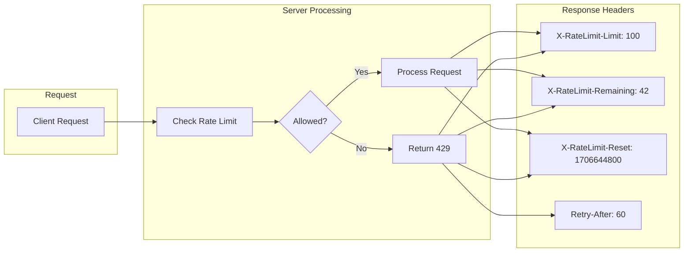
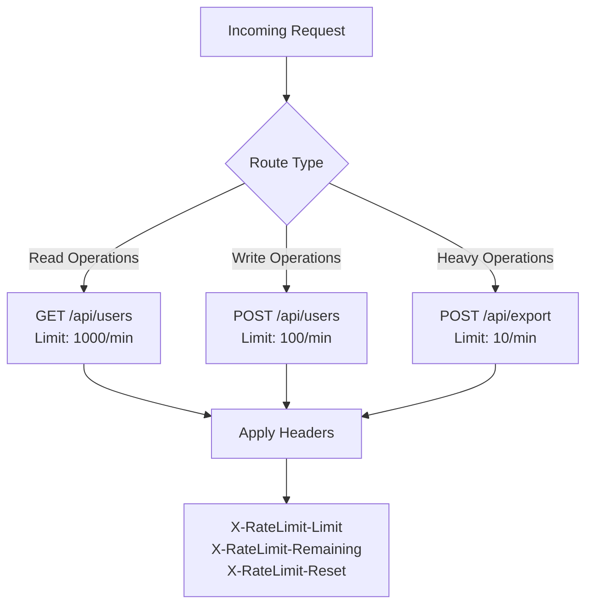
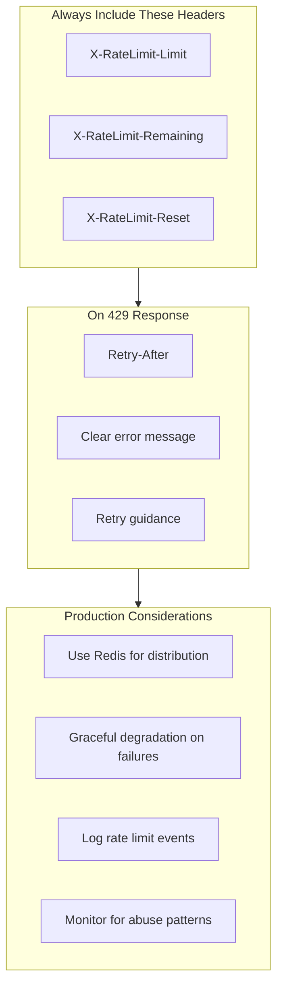

# How to Implement API Rate Limit Headers

Author: [nawazdhandala](https://github.com/nawazdhandala)

Tags: API, Rate Limiting, HTTP Headers, Node.js, Python, Express, Flask, REST API

Description: A practical guide to implementing standardized API rate limit headers that help clients understand their usage limits, remaining quota, and when limits reset.

---

Rate limit headers are how your API communicates usage quotas to clients. Without them, developers are left guessing when they can retry failed requests or how close they are to hitting limits. This guide covers the standard headers, their implementation, and best practices for production deployments.

## Why Rate Limit Headers Matter

When an API enforces rate limits but does not communicate them, clients end up in a frustrating loop of trial and error. Proper rate limit headers solve three problems:

1. **Transparency**: Clients know their exact quota and current usage
2. **Predictability**: Developers can build retry logic based on reset times
3. **Better User Experience**: Applications can show users when they can try again

## Standard Rate Limit Headers

The most widely adopted headers follow these conventions:



| Header | Description | Example |
|--------|-------------|---------|
| `X-RateLimit-Limit` | Maximum requests allowed in the window | `100` |
| `X-RateLimit-Remaining` | Requests remaining in current window | `42` |
| `X-RateLimit-Reset` | Unix timestamp when the limit resets | `1706644800` |
| `Retry-After` | Seconds until client can retry (on 429) | `60` |

## Basic Implementation in Node.js with Express

The following middleware tracks requests per IP address and adds rate limit headers to every response.

```javascript
// rate-limit-middleware.js
// A simple in-memory rate limiter for demonstration.
// For production, replace the Map with Redis for distributed deployments.

class RateLimiter {
    constructor(options = {}) {
        // Maximum requests allowed per window
        this.limit = options.limit || 100;
        // Window duration in seconds
        this.windowSeconds = options.windowSeconds || 60;
        // In-memory store (use Redis in production)
        this.store = new Map();

        // Clean up expired entries every minute
        setInterval(() => this.cleanup(), 60000);
    }

    // Remove entries with expired windows
    cleanup() {
        const now = Date.now();
        for (const [key, data] of this.store.entries()) {
            if (data.resetTime <= now) {
                this.store.delete(key);
            }
        }
    }

    // Check rate limit and return current state
    check(key) {
        const now = Date.now();
        let data = this.store.get(key);

        // Initialize or reset if window expired
        if (!data || data.resetTime <= now) {
            data = {
                count: 0,
                resetTime: now + (this.windowSeconds * 1000)
            };
        }

        // Increment request count
        data.count++;
        this.store.set(key, data);

        // Calculate remaining requests and reset time
        const remaining = Math.max(0, this.limit - data.count);
        const resetTimestamp = Math.floor(data.resetTime / 1000);

        return {
            allowed: data.count <= this.limit,
            limit: this.limit,
            remaining: remaining,
            reset: resetTimestamp,
            retryAfter: Math.ceil((data.resetTime - now) / 1000)
        };
    }
}

// Express middleware factory
function createRateLimitMiddleware(options = {}) {
    const limiter = new RateLimiter(options);

    // Function to extract the rate limit key from request
    // Default: use IP address
    const keyExtractor = options.keyExtractor || ((req) => {
        return req.ip ||
               req.headers['x-forwarded-for']?.split(',')[0] ||
               req.connection.remoteAddress ||
               'unknown';
    });

    return (req, res, next) => {
        const key = keyExtractor(req);
        const result = limiter.check(key);

        // Always set rate limit headers so clients can track their usage
        res.set('X-RateLimit-Limit', String(result.limit));
        res.set('X-RateLimit-Remaining', String(result.remaining));
        res.set('X-RateLimit-Reset', String(result.reset));

        // If rate limit exceeded, return 429 with Retry-After
        if (!result.allowed) {
            res.set('Retry-After', String(result.retryAfter));
            return res.status(429).json({
                error: 'Too Many Requests',
                message: `Rate limit exceeded. Try again in ${result.retryAfter} seconds.`,
                retryAfter: result.retryAfter
            });
        }

        next();
    };
}

module.exports = { RateLimiter, createRateLimitMiddleware };
```

Here is how to use the middleware in an Express application.

```javascript
// app.js
const express = require('express');
const { createRateLimitMiddleware } = require('./rate-limit-middleware');

const app = express();

// Apply rate limiting to all API routes
// 100 requests per minute per IP address
app.use('/api', createRateLimitMiddleware({
    limit: 100,
    windowSeconds: 60
}));

// API endpoint
app.get('/api/users', (req, res) => {
    res.json({ users: [{ id: 1, name: 'Alice' }] });
});

// Health check endpoint (no rate limiting)
app.get('/health', (req, res) => {
    res.json({ status: 'ok' });
});

app.listen(3000, () => {
    console.log('Server running on port 3000');
});
```

## Production Implementation with Redis

For production environments with multiple server instances, you need a shared store. Redis is the standard choice.

```javascript
// redis-rate-limiter.js
const Redis = require('ioredis');

class RedisRateLimiter {
    constructor(options = {}) {
        this.redis = new Redis(options.redisUrl || 'redis://localhost:6379');
        this.limit = options.limit || 100;
        this.windowSeconds = options.windowSeconds || 60;
        this.keyPrefix = options.keyPrefix || 'ratelimit';

        // Lua script ensures atomic increment and expiry
        // This prevents race conditions in distributed environments
        this.luaScript = `
            local key = KEYS[1]
            local limit = tonumber(ARGV[1])
            local window = tonumber(ARGV[2])

            local current = redis.call('INCR', key)

            -- Set expiry only on first request in window
            if current == 1 then
                redis.call('EXPIRE', key, window)
            end

            local ttl = redis.call('TTL', key)

            return {current, ttl}
        `;
    }

    async check(key) {
        const redisKey = `${this.keyPrefix}:${key}`;
        const now = Math.floor(Date.now() / 1000);

        const [count, ttl] = await this.redis.eval(
            this.luaScript,
            1,
            redisKey,
            this.limit,
            this.windowSeconds
        );

        const remaining = Math.max(0, this.limit - count);
        const resetTimestamp = now + Math.max(0, ttl);

        return {
            allowed: count <= this.limit,
            limit: this.limit,
            remaining: remaining,
            reset: resetTimestamp,
            retryAfter: Math.max(0, ttl)
        };
    }

    async close() {
        await this.redis.quit();
    }
}

// Express middleware with Redis backend
function createRedisRateLimitMiddleware(options = {}) {
    const limiter = new RedisRateLimiter(options);

    const keyExtractor = options.keyExtractor || ((req) => {
        return req.ip ||
               req.headers['x-forwarded-for']?.split(',')[0] ||
               'unknown';
    });

    return async (req, res, next) => {
        try {
            const key = keyExtractor(req);
            const result = await limiter.check(key);

            res.set('X-RateLimit-Limit', String(result.limit));
            res.set('X-RateLimit-Remaining', String(result.remaining));
            res.set('X-RateLimit-Reset', String(result.reset));

            if (!result.allowed) {
                res.set('Retry-After', String(result.retryAfter));
                return res.status(429).json({
                    error: 'Too Many Requests',
                    retryAfter: result.retryAfter
                });
            }

            next();
        } catch (error) {
            // On Redis failure, allow the request but log the error
            // This prevents rate limiting failures from breaking your API
            console.error('Rate limiter error:', error);
            next();
        }
    };
}

module.exports = { RedisRateLimiter, createRedisRateLimitMiddleware };
```

## Python Implementation with Flask

The same pattern works in Python. This implementation uses Flask and Redis.

```python
# rate_limiter.py
import time
import redis
from functools import wraps
from flask import Flask, request, jsonify, make_response

class RateLimiter:
    """
    A sliding window rate limiter using Redis.
    Provides accurate rate limiting with configurable windows.
    """

    def __init__(self, redis_url='redis://localhost:6379',
                 limit=100, window_seconds=60, key_prefix='ratelimit'):
        self.redis = redis.from_url(redis_url, decode_responses=True)
        self.limit = limit
        self.window_seconds = window_seconds
        self.key_prefix = key_prefix

    def check(self, key):
        """
        Check if the request is allowed and return rate limit info.
        Returns a tuple of (allowed, info_dict).
        """
        redis_key = f"{self.key_prefix}:{key}"
        now = int(time.time())

        # Use pipeline for atomic operations
        pipe = self.redis.pipeline()
        pipe.incr(redis_key)
        pipe.ttl(redis_key)
        count, ttl = pipe.execute()

        # Set expiry on first request
        if ttl == -1:
            self.redis.expire(redis_key, self.window_seconds)
            ttl = self.window_seconds

        remaining = max(0, self.limit - count)
        reset_timestamp = now + max(0, ttl)

        return count <= self.limit, {
            'limit': self.limit,
            'remaining': remaining,
            'reset': reset_timestamp,
            'retry_after': max(0, ttl)
        }


def rate_limit(limiter, key_func=None):
    """
    Decorator that applies rate limiting to a Flask route.
    Adds standard rate limit headers to all responses.
    """
    def decorator(f):
        @wraps(f)
        def decorated_function(*args, **kwargs):
            # Determine the rate limit key
            if key_func:
                key = key_func()
            else:
                # Default: use client IP address
                key = request.headers.get('X-Forwarded-For',
                                          request.remote_addr).split(',')[0]

            allowed, info = limiter.check(key)

            if allowed:
                # Process the request normally
                response = make_response(f(*args, **kwargs))
            else:
                # Return 429 Too Many Requests
                response = make_response(
                    jsonify({
                        'error': 'Too Many Requests',
                        'message': f"Rate limit exceeded. Retry in {info['retry_after']} seconds.",
                        'retry_after': info['retry_after']
                    }),
                    429
                )
                response.headers['Retry-After'] = str(info['retry_after'])

            # Always include rate limit headers
            response.headers['X-RateLimit-Limit'] = str(info['limit'])
            response.headers['X-RateLimit-Remaining'] = str(info['remaining'])
            response.headers['X-RateLimit-Reset'] = str(info['reset'])

            return response
        return decorated_function
    return decorator


# Example Flask application
app = Flask(__name__)
limiter = RateLimiter(limit=100, window_seconds=60)


@app.route('/api/data')
@rate_limit(limiter)
def get_data():
    return jsonify({'data': 'Hello, World!'})


@app.route('/api/users')
@rate_limit(limiter, key_func=lambda: request.headers.get('X-API-Key', 'anonymous'))
def get_users():
    """Rate limit by API key instead of IP address."""
    return jsonify({'users': [{'id': 1, 'name': 'Alice'}]})


if __name__ == '__main__':
    app.run(port=5000)
```

## Implementing Different Limits per Endpoint

Different API endpoints often need different rate limits. High-cost operations like file uploads should have stricter limits than simple read operations.



```javascript
// endpoint-specific-limits.js
const express = require('express');
const { createRedisRateLimitMiddleware } = require('./redis-rate-limiter');

const app = express();

// Define rate limits per endpoint category
const rateLimits = {
    // High volume read operations
    read: createRedisRateLimitMiddleware({
        limit: 1000,
        windowSeconds: 60,
        keyPrefix: 'rl:read'
    }),

    // Standard write operations
    write: createRedisRateLimitMiddleware({
        limit: 100,
        windowSeconds: 60,
        keyPrefix: 'rl:write'
    }),

    // Resource-intensive operations
    heavy: createRedisRateLimitMiddleware({
        limit: 10,
        windowSeconds: 60,
        keyPrefix: 'rl:heavy'
    })
};

// Apply different limits to different routes
app.get('/api/users', rateLimits.read, (req, res) => {
    res.json({ users: [] });
});

app.post('/api/users', rateLimits.write, (req, res) => {
    res.json({ created: true });
});

app.post('/api/export', rateLimits.heavy, (req, res) => {
    res.json({ exportId: 'abc123' });
});

app.listen(3000);
```

## Tiered Rate Limits for Different User Plans

SaaS applications typically offer different rate limits based on subscription plans.

```javascript
// tiered-rate-limiter.js
const Redis = require('ioredis');

// Define limits for each plan
const PLAN_LIMITS = {
    free: { limit: 100, windowSeconds: 3600 },      // 100/hour
    basic: { limit: 1000, windowSeconds: 3600 },    // 1000/hour
    pro: { limit: 10000, windowSeconds: 3600 },     // 10000/hour
    enterprise: { limit: 100000, windowSeconds: 3600 } // 100000/hour
};

class TieredRateLimiter {
    constructor(redisUrl = 'redis://localhost:6379') {
        this.redis = new Redis(redisUrl);
    }

    async check(userId, plan = 'free') {
        const limits = PLAN_LIMITS[plan] || PLAN_LIMITS.free;
        const key = `ratelimit:${plan}:${userId}`;
        const now = Math.floor(Date.now() / 1000);

        const count = await this.redis.incr(key);

        if (count === 1) {
            await this.redis.expire(key, limits.windowSeconds);
        }

        const ttl = await this.redis.ttl(key);
        const remaining = Math.max(0, limits.limit - count);

        return {
            allowed: count <= limits.limit,
            limit: limits.limit,
            remaining: remaining,
            reset: now + ttl,
            retryAfter: ttl,
            plan: plan
        };
    }
}

// Middleware that looks up user plan from request
function createTieredMiddleware(limiter, getUserPlan) {
    return async (req, res, next) => {
        // Get user ID and plan from your auth system
        const userId = req.user?.id || req.ip;
        const plan = await getUserPlan(req);

        const result = await limiter.check(userId, plan);

        // Include plan info in headers for transparency
        res.set('X-RateLimit-Limit', String(result.limit));
        res.set('X-RateLimit-Remaining', String(result.remaining));
        res.set('X-RateLimit-Reset', String(result.reset));
        res.set('X-RateLimit-Plan', result.plan);

        if (!result.allowed) {
            res.set('Retry-After', String(result.retryAfter));
            return res.status(429).json({
                error: 'Too Many Requests',
                message: `Rate limit for ${result.plan} plan exceeded.`,
                upgrade_url: '/pricing',
                retryAfter: result.retryAfter
            });
        }

        next();
    };
}

module.exports = { TieredRateLimiter, createTieredMiddleware, PLAN_LIMITS };
```

## Client-Side: Handling Rate Limit Headers

Clients should read and respect rate limit headers. Here is a JavaScript client that implements automatic retry with backoff.

```javascript
// api-client.js
class APIClient {
    constructor(baseUrl) {
        this.baseUrl = baseUrl;
        this.rateLimitInfo = null;
    }

    async request(endpoint, options = {}) {
        const url = `${this.baseUrl}${endpoint}`;

        // Check if we should wait before making request
        if (this.rateLimitInfo && this.rateLimitInfo.remaining === 0) {
            const now = Math.floor(Date.now() / 1000);
            const waitTime = this.rateLimitInfo.reset - now;

            if (waitTime > 0) {
                console.log(`Rate limited. Waiting ${waitTime} seconds...`);
                await this.sleep(waitTime * 1000);
            }
        }

        const response = await fetch(url, options);

        // Parse rate limit headers from response
        this.rateLimitInfo = {
            limit: parseInt(response.headers.get('X-RateLimit-Limit')) || null,
            remaining: parseInt(response.headers.get('X-RateLimit-Remaining')) || null,
            reset: parseInt(response.headers.get('X-RateLimit-Reset')) || null
        };

        // Handle 429 Too Many Requests
        if (response.status === 429) {
            const retryAfter = parseInt(response.headers.get('Retry-After')) || 60;
            console.log(`Rate limited. Retrying in ${retryAfter} seconds...`);

            await this.sleep(retryAfter * 1000);
            return this.request(endpoint, options); // Retry
        }

        return response;
    }

    sleep(ms) {
        return new Promise(resolve => setTimeout(resolve, ms));
    }

    // Expose rate limit info for UI display
    getRateLimitInfo() {
        return this.rateLimitInfo;
    }
}

// Usage example
async function fetchUsers() {
    const client = new APIClient('https://api.example.com');

    const response = await client.request('/api/users');
    const data = await response.json();

    // Show rate limit info in UI
    const limits = client.getRateLimitInfo();
    console.log(`Requests remaining: ${limits.remaining}/${limits.limit}`);

    return data;
}
```

## Testing Rate Limit Headers

Automated tests ensure your rate limiting works correctly.

```javascript
// rate-limiter.test.js
const request = require('supertest');
const express = require('express');
const { createRateLimitMiddleware } = require('./rate-limit-middleware');

describe('Rate Limit Headers', () => {
    let app;

    beforeEach(() => {
        app = express();
        app.use(createRateLimitMiddleware({ limit: 5, windowSeconds: 60 }));
        app.get('/test', (req, res) => res.json({ ok: true }));
    });

    test('includes rate limit headers on successful requests', async () => {
        const response = await request(app).get('/test');

        expect(response.status).toBe(200);
        expect(response.headers['x-ratelimit-limit']).toBe('5');
        expect(response.headers['x-ratelimit-remaining']).toBe('4');
        expect(response.headers['x-ratelimit-reset']).toBeDefined();
    });

    test('decrements remaining count with each request', async () => {
        await request(app).get('/test');
        await request(app).get('/test');
        const response = await request(app).get('/test');

        expect(response.headers['x-ratelimit-remaining']).toBe('2');
    });

    test('returns 429 when limit exceeded', async () => {
        // Exhaust the rate limit
        for (let i = 0; i < 5; i++) {
            await request(app).get('/test');
        }

        const response = await request(app).get('/test');

        expect(response.status).toBe(429);
        expect(response.headers['x-ratelimit-remaining']).toBe('0');
        expect(response.headers['retry-after']).toBeDefined();
        expect(response.body.error).toBe('Too Many Requests');
    });

    test('includes Retry-After header on 429 responses', async () => {
        for (let i = 0; i < 5; i++) {
            await request(app).get('/test');
        }

        const response = await request(app).get('/test');

        const retryAfter = parseInt(response.headers['retry-after']);
        expect(retryAfter).toBeGreaterThan(0);
        expect(retryAfter).toBeLessThanOrEqual(60);
    });
});
```

## Best Practices Summary



**Key takeaways:**

1. **Always send headers** - Include rate limit headers on every response, not just 429s
2. **Use Unix timestamps** - The `X-RateLimit-Reset` header should be a Unix timestamp for easy client parsing
3. **Include Retry-After on 429** - Tells clients exactly when to retry
4. **Handle Redis failures gracefully** - Your API should not break if Redis is down
5. **Log rate limit events** - Track who is hitting limits and why
6. **Document your headers** - Include rate limit information in your API documentation

## Conclusion

Implementing rate limit headers is straightforward but often overlooked. The three essential headers (Limit, Remaining, Reset) plus Retry-After for 429 responses give clients everything they need to handle rate limiting gracefully. Whether you use a simple in-memory store for development or Redis for production, the pattern remains the same: check the limit, add the headers, and return a clear 429 response when limits are exceeded.

Start with the basic implementation and add complexity (tiered limits, per-endpoint limits, distributed storage) as your API grows. Your API consumers will thank you for the transparency.
