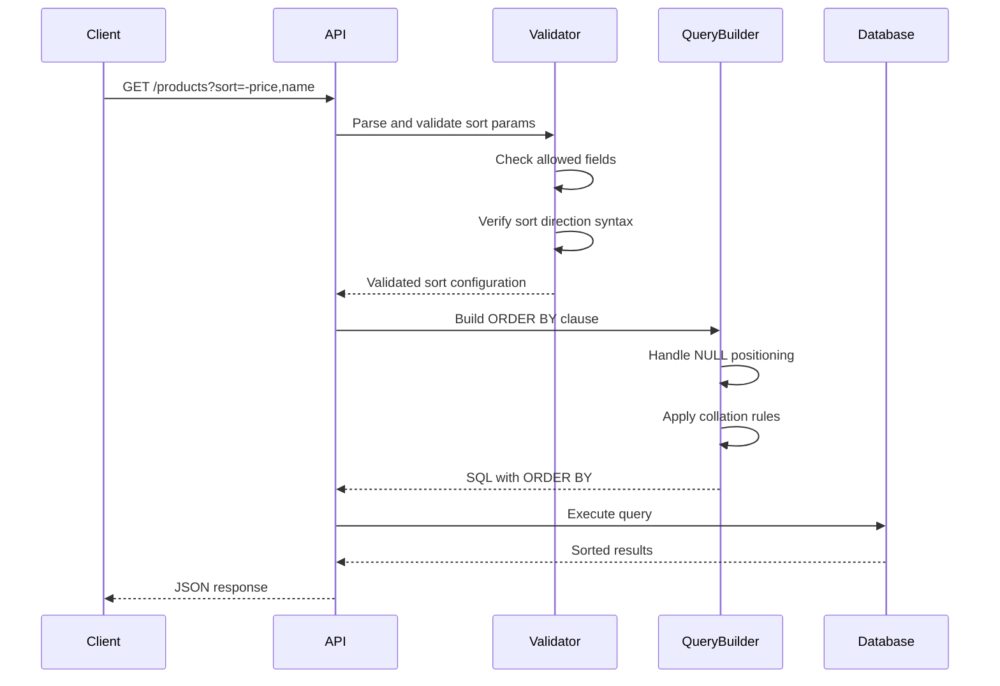
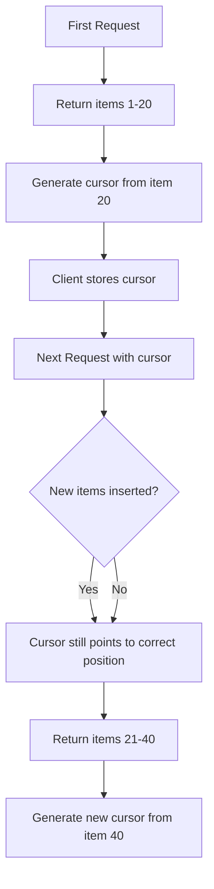
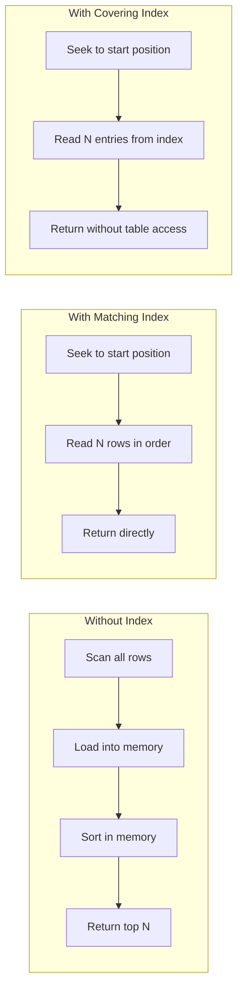

# How to Build API Sorting Implementation

Author: [nawazdhandala](https://github.com/nawazdhandala)

Tags: API, Backend, REST API, Database, PostgreSQL, MongoDB, Performance

Description: A deep dive into building production-ready sorting for REST APIs, covering multi-column sorting, NULL handling, collation, cursor-based pagination, and database-specific optimizations.

---

Sorting is one of those features that seems simple until you start implementing it properly. Your users expect to sort by price, date, name, or any combination of fields. They expect consistent behavior with NULL values, proper handling of international characters, and pagination that does not break when the data changes. This guide covers the implementation details that separate toy APIs from production systems.

## The Sorting Request Flow

Before diving into code, let's understand how a sorting request flows through your system:



## Basic Sorting Parser

Let's start with a robust parser that handles the common sort parameter format where a minus prefix indicates descending order.

The following parser extracts field names and directions from comma-separated sort strings like "-price,name,created_at":

```typescript
// sorting/parser.ts
// Parses sort parameters into a structured format for query building

interface SortField {
  field: string;
  direction: 'ASC' | 'DESC';
}

interface ParseOptions {
  allowedFields: string[];
  maxFields?: number;
  defaultSort?: SortField[];
}

/**
 * Parses a sort string like "-price,name" into structured sort fields.
 * Minus prefix indicates descending order, no prefix means ascending.
 *
 * @param sortParam - The raw sort parameter from the request
 * @param options - Configuration including allowed fields and limits
 * @returns Array of validated sort fields
 */
function parseSortParameter(
  sortParam: string | undefined,
  options: ParseOptions
): SortField[] {
  const { allowedFields, maxFields = 4, defaultSort = [] } = options;

  // Return default sort if no parameter provided
  if (!sortParam || sortParam.trim() === '') {
    return defaultSort;
  }

  const sortFields: SortField[] = [];
  const fields = sortParam.split(',').map(f => f.trim());

  for (const field of fields) {
    // Skip empty segments from malformed input like "price,,name"
    if (!field) continue;

    // Enforce maximum number of sort fields to prevent query complexity
    if (sortFields.length >= maxFields) {
      break;
    }

    // Check for descending prefix
    const isDescending = field.startsWith('-');
    const fieldName = isDescending ? field.slice(1) : field;

    // Security: Only allow sorting on whitelisted fields
    // This prevents sorting on sensitive columns or SQL injection
    if (!allowedFields.includes(fieldName)) {
      continue;
    }

    // Prevent duplicate sort fields
    if (sortFields.some(sf => sf.field === fieldName)) {
      continue;
    }

    sortFields.push({
      field: fieldName,
      direction: isDescending ? 'DESC' : 'ASC',
    });
  }

  // Fall back to default if no valid fields were parsed
  return sortFields.length > 0 ? sortFields : defaultSort;
}

export { parseSortParameter, SortField, ParseOptions };
```

## Handling NULL Values

NULL values in sorted columns cause inconsistent behavior across databases. PostgreSQL puts NULLs last by default for ASC and first for DESC. MySQL does the opposite. You need to control this explicitly.

The following utility generates NULL positioning clauses for consistent behavior:

```typescript
// sorting/nullHandling.ts
// Provides consistent NULL handling across database systems

type NullPosition = 'FIRST' | 'LAST';

interface NullHandlingOptions {
  // Where NULLs should appear when sorting ascending
  nullsOnAsc: NullPosition;
  // Where NULLs should appear when sorting descending
  nullsOnDesc: NullPosition;
}

// Default behavior: NULLs at the end regardless of sort direction
const DEFAULT_NULL_HANDLING: NullHandlingOptions = {
  nullsOnAsc: 'LAST',
  nullsOnDesc: 'LAST',
};

/**
 * Generates the NULLS FIRST/LAST clause for PostgreSQL.
 * For databases without native support, we handle this differently.
 */
function getNullsClause(
  direction: 'ASC' | 'DESC',
  options: NullHandlingOptions = DEFAULT_NULL_HANDLING
): string {
  const position = direction === 'ASC'
    ? options.nullsOnAsc
    : options.nullsOnDesc;

  return `NULLS ${position}`;
}

/**
 * For MySQL which lacks NULLS FIRST/LAST, we use a CASE expression.
 * This sorts NULLs to the desired position by assigning them 0 or 1.
 */
function getMySQLNullHandling(
  field: string,
  direction: 'ASC' | 'DESC',
  options: NullHandlingOptions = DEFAULT_NULL_HANDLING
): string {
  const position = direction === 'ASC'
    ? options.nullsOnAsc
    : options.nullsOnDesc;

  // If we want NULLs LAST, sort NULL indicator ascending (0 for non-null, 1 for null)
  // If we want NULLs FIRST, sort NULL indicator descending
  const nullIndicatorDirection = position === 'LAST' ? 'ASC' : 'DESC';

  return `(CASE WHEN ${field} IS NULL THEN 1 ELSE 0 END) ${nullIndicatorDirection}, ${field} ${direction}`;
}

export {
  getNullsClause,
  getMySQLNullHandling,
  NullHandlingOptions,
  DEFAULT_NULL_HANDLING
};
```

## Multi-Column Sort Query Builder

When users sort by multiple columns, the order matters. Sorting by "-price,name" means: first sort by price descending, then for items with the same price, sort by name ascending.

Here is a query builder that handles multi-column sorting with proper NULL handling:

```typescript
// sorting/queryBuilder.ts
// Builds database-specific ORDER BY clauses

import { SortField } from './parser';
import { getNullsClause, getMySQLNullHandling, NullHandlingOptions } from './nullHandling';

type DatabaseType = 'postgresql' | 'mysql' | 'sqlite';

interface QueryBuilderOptions {
  database: DatabaseType;
  tableAlias?: string;
  nullHandling?: NullHandlingOptions;
}

/**
 * Builds an ORDER BY clause from parsed sort fields.
 * Handles database-specific syntax for NULL positioning.
 */
function buildOrderByClause(
  sortFields: SortField[],
  options: QueryBuilderOptions
): string {
  const { database, tableAlias, nullHandling } = options;

  if (sortFields.length === 0) {
    return '';
  }

  const clauses = sortFields.map(({ field, direction }) => {
    // Qualify field with table alias if provided
    const qualifiedField = tableAlias ? `${tableAlias}.${field}` : field;

    switch (database) {
      case 'postgresql':
        // PostgreSQL supports NULLS FIRST/LAST natively
        const nullsClause = nullHandling
          ? getNullsClause(direction, nullHandling)
          : '';
        return `${qualifiedField} ${direction}${nullsClause ? ' ' + nullsClause : ''}`;

      case 'mysql':
        // MySQL needs CASE expression for NULL handling
        if (nullHandling) {
          return getMySQLNullHandling(qualifiedField, direction, nullHandling);
        }
        return `${qualifiedField} ${direction}`;

      case 'sqlite':
        // SQLite sorts NULLs first by default, use CASE for control
        if (nullHandling) {
          return getMySQLNullHandling(qualifiedField, direction, nullHandling);
        }
        return `${qualifiedField} ${direction}`;

      default:
        return `${qualifiedField} ${direction}`;
    }
  });

  return 'ORDER BY ' + clauses.join(', ');
}

export { buildOrderByClause, QueryBuilderOptions, DatabaseType };
```

## Collation and Locale-Aware Sorting

String sorting behaves differently across locales. "cafe" vs "Cafe" vs "Caf" should sort according to your users' expectations. PostgreSQL allows per-query collation specification.

This wrapper enables locale-aware sorting for international applications:

```typescript
// sorting/collation.ts
// Handles locale-aware string sorting

interface CollationOptions {
  // The collation to use (e.g., 'en_US', 'de_DE', 'C')
  locale?: string;
  // Case sensitivity: true = 'A' before 'a', false = case-insensitive
  caseSensitive?: boolean;
  // Accent sensitivity: true = 'e' before 'e', false = treat as equal
  accentSensitive?: boolean;
}

/**
 * Generates PostgreSQL COLLATE clause for locale-aware sorting.
 * Note: The collation must exist in the database.
 */
function getPostgreSQLCollation(options: CollationOptions): string {
  const { locale, caseSensitive = true } = options;

  if (!locale) {
    return '';
  }

  // PostgreSQL ICU collations support case/accent sensitivity modifiers
  // Format: locale@colStrength=primary (case+accent insensitive)
  //         locale@colStrength=secondary (accent sensitive, case insensitive)
  //         locale (fully sensitive)

  if (!caseSensitive) {
    // Case-insensitive collation
    return `COLLATE "${locale}"`;
  }

  return `COLLATE "${locale}"`;
}

/**
 * For case-insensitive sorting without collation support,
 * wrap the field in LOWER() or use ILIKE patterns.
 */
function getCaseInsensitiveSort(
  field: string,
  direction: 'ASC' | 'DESC',
  database: 'postgresql' | 'mysql' | 'sqlite'
): string {
  switch (database) {
    case 'postgresql':
    case 'sqlite':
      return `LOWER(${field}) ${direction}`;
    case 'mysql':
      // MySQL uses LOWER() or can set collation at table/column level
      return `LOWER(${field}) ${direction}`;
    default:
      return `LOWER(${field}) ${direction}`;
  }
}

export { getPostgreSQLCollation, getCaseInsensitiveSort, CollationOptions };
```

## Cursor-Based Pagination with Sorting

Offset pagination breaks when data changes between requests. Cursor pagination solves this by using the last item's sort values as a reference point. This is essential for sorted lists that update frequently.

The following diagram shows how cursor pagination maintains consistency:



Here is a complete cursor implementation for sorted queries:

```typescript
// sorting/cursor.ts
// Implements cursor-based pagination for sorted queries

import { SortField } from './parser';

interface CursorData {
  // Values of the sort fields for the last item
  values: Record<string, any>;
  // The primary key of the last item for tie-breaking
  id: string | number;
}

/**
 * Encodes cursor data as a base64 string for URL safety.
 * The cursor contains the sort field values of the last returned item.
 */
function encodeCursor(data: CursorData): string {
  const json = JSON.stringify(data);
  return Buffer.from(json).toString('base64url');
}

/**
 * Decodes a cursor string back into usable data.
 * Returns null for invalid cursors rather than throwing.
 */
function decodeCursor(cursor: string): CursorData | null {
  try {
    const json = Buffer.from(cursor, 'base64url').toString('utf-8');
    const data = JSON.parse(json);

    // Validate cursor structure
    if (!data.values || typeof data.values !== 'object') {
      return null;
    }
    if (data.id === undefined || data.id === null) {
      return null;
    }

    return data as CursorData;
  } catch {
    return null;
  }
}

/**
 * Generates a cursor from the last item in a result set.
 * The cursor captures the values of all sort fields.
 */
function generateCursor(
  lastItem: Record<string, any>,
  sortFields: SortField[],
  primaryKey: string = 'id'
): string {
  const values: Record<string, any> = {};

  for (const { field } of sortFields) {
    values[field] = lastItem[field];
  }

  return encodeCursor({
    values,
    id: lastItem[primaryKey],
  });
}

/**
 * Builds a WHERE clause for cursor-based pagination.
 * This is the complex part: we need to find rows that come "after" the cursor
 * according to the sort order.
 *
 * For sort by (price DESC, name ASC), rows after cursor (100, 'Apple') are:
 * - price < 100, OR
 * - price = 100 AND name > 'Apple', OR
 * - price = 100 AND name = 'Apple' AND id > cursor.id
 */
function buildCursorWhereClause(
  cursor: CursorData,
  sortFields: SortField[],
  primaryKey: string = 'id'
): { clause: string; params: any[] } {
  const conditions: string[] = [];
  const params: any[] = [];
  let paramIndex = 1;

  // Build OR conditions for each level of the sort
  for (let i = 0; i < sortFields.length; i++) {
    const equalityConditions: string[] = [];

    // All previous fields must be equal
    for (let j = 0; j < i; j++) {
      const { field } = sortFields[j];
      const value = cursor.values[field];

      if (value === null) {
        equalityConditions.push(`${field} IS NULL`);
      } else {
        equalityConditions.push(`${field} = $${paramIndex++}`);
        params.push(value);
      }
    }

    // Current field must be "after" according to sort direction
    const { field, direction } = sortFields[i];
    const value = cursor.values[field];
    const operator = direction === 'ASC' ? '>' : '<';

    if (value === null) {
      // If cursor value is NULL, and we sort NULLS LAST:
      // - For ASC NULLS LAST: no rows can come after NULL
      // - For DESC NULLS LAST: all non-NULL rows come after
      if (direction === 'DESC') {
        equalityConditions.push(`${field} IS NOT NULL`);
      } else {
        // Skip this branch, nothing comes after NULL in ASC NULLS LAST
        continue;
      }
    } else {
      equalityConditions.push(`${field} ${operator} $${paramIndex++}`);
      params.push(value);
    }

    if (equalityConditions.length > 0) {
      conditions.push(`(${equalityConditions.join(' AND ')})`);
    }
  }

  // Tie-breaker: all sort fields equal, use primary key
  const tieBreaker: string[] = [];
  for (const { field } of sortFields) {
    const value = cursor.values[field];
    if (value === null) {
      tieBreaker.push(`${field} IS NULL`);
    } else {
      tieBreaker.push(`${field} = $${paramIndex++}`);
      params.push(value);
    }
  }
  tieBreaker.push(`${primaryKey} > $${paramIndex++}`);
  params.push(cursor.id);
  conditions.push(`(${tieBreaker.join(' AND ')})`);

  return {
    clause: conditions.join(' OR '),
    params,
  };
}

export {
  encodeCursor,
  decodeCursor,
  generateCursor,
  buildCursorWhereClause,
  CursorData,
};
```

## Complete Express API Implementation

Now let's put everything together in a production-ready Express endpoint:

```typescript
// routes/products.ts
// Complete sorting implementation for a products API

import express from 'express';
import { Pool } from 'pg';
import { parseSortParameter, SortField } from '../sorting/parser';
import { buildOrderByClause } from '../sorting/queryBuilder';
import {
  decodeCursor,
  generateCursor,
  buildCursorWhereClause
} from '../sorting/cursor';

const router = express.Router();
const pool = new Pool({ connectionString: process.env.DATABASE_URL });

// Define allowed sort fields to prevent SQL injection and limit query complexity
const ALLOWED_SORT_FIELDS = [
  'name',
  'price',
  'created_at',
  'updated_at',
  'stock_quantity',
  'rating',
];

// Default sort when no sort parameter is provided
const DEFAULT_SORT: SortField[] = [
  { field: 'created_at', direction: 'DESC' },
];

interface ProductsQueryParams {
  sort?: string;
  cursor?: string;
  limit?: string;
}

/**
 * GET /products
 *
 * Supports multi-column sorting with cursor pagination.
 *
 * Query params:
 * - sort: Comma-separated fields, prefix with - for descending
 *         Example: -price,name (price desc, then name asc)
 * - cursor: Base64 encoded cursor from previous response
 * - limit: Number of items to return (default 20, max 100)
 *
 * Response includes:
 * - data: Array of products
 * - pagination.nextCursor: Cursor for the next page (if more results exist)
 * - pagination.hasMore: Boolean indicating if more results exist
 */
router.get('/products', async (req, res) => {
  try {
    const { sort, cursor, limit: limitParam } = req.query as ProductsQueryParams;

    // Parse and validate limit
    const limit = Math.min(100, Math.max(1, parseInt(limitParam || '20', 10)));

    // Request one extra item to determine if there are more results
    const fetchLimit = limit + 1;

    // Parse sort parameter into structured format
    const sortFields = parseSortParameter(sort, {
      allowedFields: ALLOWED_SORT_FIELDS,
      maxFields: 4,
      defaultSort: DEFAULT_SORT,
    });

    // Always add id as final sort field for consistent cursor pagination
    const sortWithId = [...sortFields];
    if (!sortWithId.some(sf => sf.field === 'id')) {
      sortWithId.push({ field: 'id', direction: 'ASC' });
    }

    // Build ORDER BY clause
    const orderByClause = buildOrderByClause(sortWithId, {
      database: 'postgresql',
      tableAlias: 'p',
      nullHandling: { nullsOnAsc: 'LAST', nullsOnDesc: 'LAST' },
    });

    // Build cursor WHERE clause if cursor provided
    let cursorClause = '';
    let cursorParams: any[] = [];

    if (cursor) {
      const cursorData = decodeCursor(cursor);
      if (cursorData) {
        const { clause, params } = buildCursorWhereClause(
          cursorData,
          sortWithId,
          'id'
        );
        cursorClause = `AND (${clause})`;
        cursorParams = params;
      }
    }

    // Build the complete query
    const query = `
      SELECT
        p.id,
        p.name,
        p.price,
        p.stock_quantity,
        p.rating,
        p.created_at,
        p.updated_at
      FROM products p
      WHERE p.deleted_at IS NULL
        ${cursorClause}
      ${orderByClause}
      LIMIT $${cursorParams.length + 1}
    `;

    const result = await pool.query(query, [...cursorParams, fetchLimit]);

    // Check if there are more results
    const hasMore = result.rows.length > limit;
    const items = hasMore ? result.rows.slice(0, limit) : result.rows;

    // Generate cursor for next page
    let nextCursor: string | null = null;
    if (hasMore && items.length > 0) {
      const lastItem = items[items.length - 1];
      nextCursor = generateCursor(lastItem, sortWithId, 'id');
    }

    res.json({
      data: items,
      pagination: {
        hasMore,
        nextCursor,
        limit,
      },
      meta: {
        sortedBy: sortFields.map(sf =>
          `${sf.direction === 'DESC' ? '-' : ''}${sf.field}`
        ).join(','),
      },
    });

  } catch (error) {
    console.error('Error fetching products:', error);
    res.status(500).json({
      error: 'Failed to fetch products',
      message: process.env.NODE_ENV === 'development'
        ? (error as Error).message
        : undefined,
    });
  }
});

export default router;
```

## Database Index Strategy for Sorting

Sorting performance depends heavily on proper indexing. Without indexes, the database must sort the entire result set in memory. With the right indexes, it can read rows in order directly.

Here are the recommended indexes for common sorting patterns:

```sql
-- Single column indexes for individual sort fields
CREATE INDEX idx_products_price ON products(price);
CREATE INDEX idx_products_created_at ON products(created_at DESC);
CREATE INDEX idx_products_rating ON products(rating DESC);

-- Composite index for common multi-column sort
-- This index supports: ORDER BY price DESC, name ASC
CREATE INDEX idx_products_price_name ON products(price DESC, name ASC);

-- Composite index for cursor pagination
-- Include the id for tie-breaking in cursor queries
CREATE INDEX idx_products_price_id ON products(price DESC, id ASC);
CREATE INDEX idx_products_created_at_id ON products(created_at DESC, id ASC);

-- Partial index for filtering + sorting combination
-- This index only includes active products, reducing index size
CREATE INDEX idx_products_active_price ON products(price DESC)
  WHERE deleted_at IS NULL AND status = 'active';

-- Covering index that includes all selected columns
-- Allows index-only scans, avoiding table lookups entirely
CREATE INDEX idx_products_list_covering ON products(
  created_at DESC,
  id ASC
) INCLUDE (name, price, stock_quantity, rating);
```

## Sort Performance Analysis

The following diagram shows how query performance changes with different index strategies:



## MongoDB Sorting Implementation

For MongoDB users, here is an equivalent implementation using the aggregation framework:

```typescript
// sorting/mongodb.ts
// MongoDB-specific sorting implementation

import { Collection, Document, Sort, Filter } from 'mongodb';
import { SortField } from './parser';

interface MongoSortOptions {
  sortFields: SortField[];
  cursor?: string;
  limit: number;
  filter?: Filter<Document>;
}

/**
 * Converts parsed sort fields to MongoDB sort specification.
 * MongoDB uses 1 for ascending and -1 for descending.
 */
function toMongoSort(sortFields: SortField[]): Sort {
  const sort: Sort = {};

  for (const { field, direction } of sortFields) {
    sort[field] = direction === 'ASC' ? 1 : -1;
  }

  return sort;
}

/**
 * Builds a MongoDB filter for cursor pagination.
 * Similar logic to SQL but using MongoDB query operators.
 */
function buildMongoCursorFilter(
  cursor: { values: Record<string, any>; id: string },
  sortFields: SortField[]
): Filter<Document> {
  const orConditions: Filter<Document>[] = [];

  for (let i = 0; i < sortFields.length; i++) {
    const andConditions: Filter<Document>[] = [];

    // Previous fields must be equal
    for (let j = 0; j < i; j++) {
      const { field } = sortFields[j];
      andConditions.push({ [field]: cursor.values[field] });
    }

    // Current field must be past cursor position
    const { field, direction } = sortFields[i];
    const operator = direction === 'ASC' ? '$gt' : '$lt';
    andConditions.push({ [field]: { [operator]: cursor.values[field] } });

    orConditions.push({ $and: andConditions });
  }

  // Tie-breaker condition
  const tieBreaker: Filter<Document>[] = sortFields.map(({ field }) => ({
    [field]: cursor.values[field],
  }));
  tieBreaker.push({ _id: { $gt: cursor.id } });
  orConditions.push({ $and: tieBreaker });

  return { $or: orConditions };
}

/**
 * Executes a sorted query with cursor pagination on MongoDB.
 */
async function findSorted<T extends Document>(
  collection: Collection<T>,
  options: MongoSortOptions
): Promise<{ items: T[]; nextCursor: string | null }> {
  const { sortFields, cursor, limit, filter = {} } = options;

  // Add _id to sort fields for consistent ordering
  const sortWithId: SortField[] = [...sortFields];
  if (!sortWithId.some(sf => sf.field === '_id')) {
    sortWithId.push({ field: '_id', direction: 'ASC' });
  }

  // Build query filter
  let queryFilter: Filter<Document> = { ...filter };

  if (cursor) {
    try {
      const cursorData = JSON.parse(Buffer.from(cursor, 'base64url').toString());
      const cursorFilter = buildMongoCursorFilter(cursorData, sortWithId);
      queryFilter = { $and: [queryFilter, cursorFilter] };
    } catch {
      // Invalid cursor, ignore
    }
  }

  // Execute query
  const items = await collection
    .find(queryFilter)
    .sort(toMongoSort(sortWithId))
    .limit(limit + 1)
    .toArray();

  // Check for more results and generate cursor
  const hasMore = items.length > limit;
  const returnItems = hasMore ? items.slice(0, limit) : items;

  let nextCursor: string | null = null;
  if (hasMore && returnItems.length > 0) {
    const lastItem = returnItems[returnItems.length - 1];
    const cursorData = {
      values: Object.fromEntries(
        sortWithId.map(({ field }) => [field, lastItem[field]])
      ),
      id: lastItem._id.toString(),
    };
    nextCursor = Buffer.from(JSON.stringify(cursorData)).toString('base64url');
  }

  return { items: returnItems as T[], nextCursor };
}

export { toMongoSort, findSorted, MongoSortOptions };
```

Create MongoDB indexes to support efficient sorting:

```javascript
// MongoDB index creation for sorting
db.products.createIndex({ price: -1 });
db.products.createIndex({ created_at: -1 });
db.products.createIndex({ price: -1, name: 1 });
db.products.createIndex({ created_at: -1, _id: 1 });

// Compound index for filtered + sorted queries
db.products.createIndex(
  { status: 1, price: -1, _id: 1 },
  { partialFilterExpression: { deleted_at: null } }
);
```

## Validating Sort Parameters

Never trust user input. Validate sort parameters to prevent injection attacks and ensure consistent behavior:

```typescript
// sorting/validation.ts
// Input validation for sort parameters

import { z } from 'zod';

/**
 * Creates a Zod schema for validating sort parameters.
 * Ensures the sort string only contains allowed characters and fields.
 */
function createSortSchema(allowedFields: string[]) {
  const fieldPattern = allowedFields.join('|');
  const sortFieldRegex = new RegExp(`^-?(${fieldPattern})$`);

  return z.string()
    .optional()
    .refine(
      (val) => {
        if (!val) return true;

        const fields = val.split(',');
        return fields.every(field => sortFieldRegex.test(field.trim()));
      },
      {
        message: `Sort fields must be one of: ${allowedFields.join(', ')}. Prefix with - for descending.`,
      }
    );
}

/**
 * Middleware factory for validating sort parameters in Express.
 */
function validateSortMiddleware(allowedFields: string[]) {
  const schema = createSortSchema(allowedFields);

  return (req: any, res: any, next: any) => {
    const result = schema.safeParse(req.query.sort);

    if (!result.success) {
      return res.status(400).json({
        error: 'Invalid sort parameter',
        message: result.error.errors[0].message,
        allowedFields,
      });
    }

    next();
  };
}

export { createSortSchema, validateSortMiddleware };
```

## Testing Sort Implementation

Test your sorting thoroughly with edge cases:

```typescript
// tests/sorting.test.ts
// Comprehensive tests for sorting implementation

import { parseSortParameter } from '../sorting/parser';
import { buildOrderByClause } from '../sorting/queryBuilder';
import { generateCursor, decodeCursor, buildCursorWhereClause } from '../sorting/cursor';

describe('Sort Parameter Parser', () => {
  const allowedFields = ['name', 'price', 'created_at'];

  test('parses ascending sort', () => {
    const result = parseSortParameter('price', { allowedFields });
    expect(result).toEqual([{ field: 'price', direction: 'ASC' }]);
  });

  test('parses descending sort with minus prefix', () => {
    const result = parseSortParameter('-price', { allowedFields });
    expect(result).toEqual([{ field: 'price', direction: 'DESC' }]);
  });

  test('parses multiple sort fields', () => {
    const result = parseSortParameter('-price,name', { allowedFields });
    expect(result).toEqual([
      { field: 'price', direction: 'DESC' },
      { field: 'name', direction: 'ASC' },
    ]);
  });

  test('ignores disallowed fields', () => {
    const result = parseSortParameter('-price,secret_field,name', { allowedFields });
    expect(result).toEqual([
      { field: 'price', direction: 'DESC' },
      { field: 'name', direction: 'ASC' },
    ]);
  });

  test('removes duplicate fields', () => {
    const result = parseSortParameter('price,-price,name', { allowedFields });
    expect(result).toEqual([
      { field: 'price', direction: 'ASC' },
      { field: 'name', direction: 'ASC' },
    ]);
  });

  test('respects maxFields limit', () => {
    const result = parseSortParameter('price,name,created_at', {
      allowedFields,
      maxFields: 2
    });
    expect(result).toHaveLength(2);
  });

  test('returns default sort when parameter is empty', () => {
    const result = parseSortParameter('', {
      allowedFields,
      defaultSort: [{ field: 'created_at', direction: 'DESC' }],
    });
    expect(result).toEqual([{ field: 'created_at', direction: 'DESC' }]);
  });
});

describe('Cursor Pagination', () => {
  const sortFields = [
    { field: 'price', direction: 'DESC' as const },
    { field: 'id', direction: 'ASC' as const },
  ];

  test('generates and decodes cursor correctly', () => {
    const item = { id: 123, price: 99.99, name: 'Test' };
    const cursor = generateCursor(item, sortFields);
    const decoded = decodeCursor(cursor);

    expect(decoded).not.toBeNull();
    expect(decoded?.values.price).toBe(99.99);
    expect(decoded?.id).toBe(123);
  });

  test('builds correct WHERE clause for cursor', () => {
    const cursor = { values: { price: 100 }, id: 50 };
    const { clause, params } = buildCursorWhereClause(cursor, sortFields);

    // Should create: (price < 100) OR (price = 100 AND id > 50)
    expect(clause).toContain('price');
    expect(params).toContain(100);
    expect(params).toContain(50);
  });

  test('handles NULL values in cursor', () => {
    const cursor = { values: { price: null }, id: 50 };
    const { clause } = buildCursorWhereClause(cursor, sortFields);

    expect(clause).toContain('IS NULL');
  });
});

describe('ORDER BY Clause Builder', () => {
  test('builds PostgreSQL ORDER BY with NULLS LAST', () => {
    const sortFields = [{ field: 'price', direction: 'DESC' as const }];
    const clause = buildOrderByClause(sortFields, {
      database: 'postgresql',
      nullHandling: { nullsOnAsc: 'LAST', nullsOnDesc: 'LAST' },
    });

    expect(clause).toBe('ORDER BY price DESC NULLS LAST');
  });

  test('builds MySQL ORDER BY with CASE for NULLs', () => {
    const sortFields = [{ field: 'price', direction: 'DESC' as const }];
    const clause = buildOrderByClause(sortFields, {
      database: 'mysql',
      nullHandling: { nullsOnAsc: 'LAST', nullsOnDesc: 'LAST' },
    });

    expect(clause).toContain('CASE WHEN');
    expect(clause).toContain('IS NULL');
  });

  test('includes table alias when provided', () => {
    const sortFields = [{ field: 'price', direction: 'ASC' as const }];
    const clause = buildOrderByClause(sortFields, {
      database: 'postgresql',
      tableAlias: 'p',
    });

    expect(clause).toContain('p.price');
  });
});
```

## Performance Checklist

Before deploying your sorting implementation, verify these items:

| Check | Why It Matters |
|-------|----------------|
| Indexes exist for all allowed sort fields | Prevents full table scans |
| Composite indexes match common sort combinations | Supports multi-column sorts efficiently |
| Cursor pagination uses indexed columns | Enables efficient seek operations |
| Sort parameter validation is in place | Prevents SQL injection |
| NULL handling is explicit | Ensures consistent ordering |
| Query execution plans are verified | Catches missing indexes |
| Sort field limit is enforced | Prevents complex queries |

Run `EXPLAIN ANALYZE` on your sorted queries to verify index usage:

```sql
EXPLAIN ANALYZE
SELECT * FROM products
WHERE deleted_at IS NULL
ORDER BY price DESC, id ASC
LIMIT 20;

-- Look for "Index Scan" or "Index Only Scan" in the output
-- "Seq Scan" indicates a missing index
```

---

Sorting might seem straightforward, but getting it right for production requires attention to NULL handling, cursor pagination, proper indexing, and input validation. The implementation patterns in this guide handle the edge cases that trip up simpler approaches.

The key takeaways:
- Always whitelist allowed sort fields
- Use cursor pagination for consistent results
- Create composite indexes matching your sort patterns
- Handle NULLs explicitly for predictable behavior
- Test edge cases including empty results and NULL values

---

*Need to monitor your API's sorting performance? [OneUptime](https://oneuptime.com) tracks response times and helps you identify slow queries before they impact users.*
